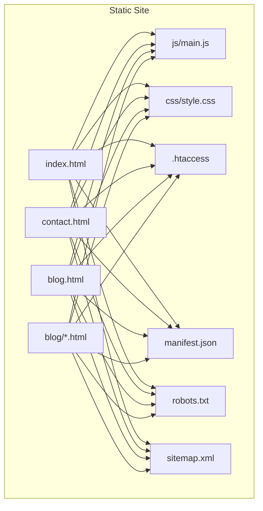
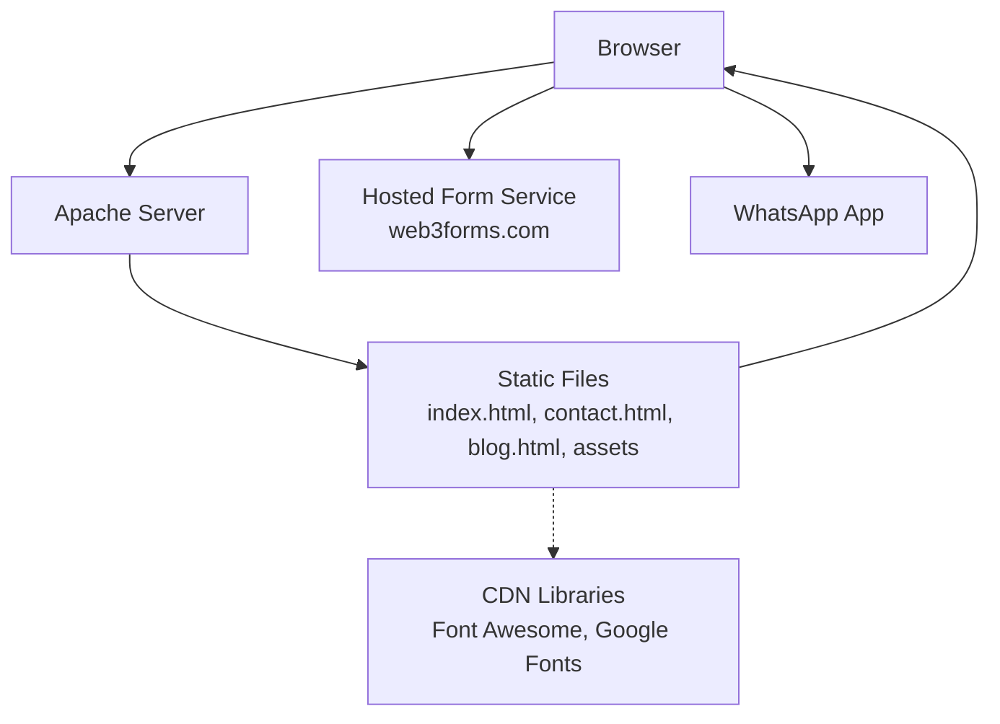
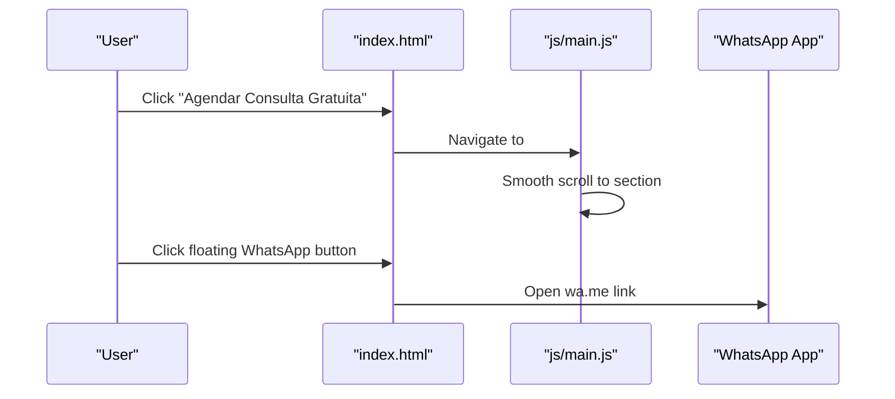
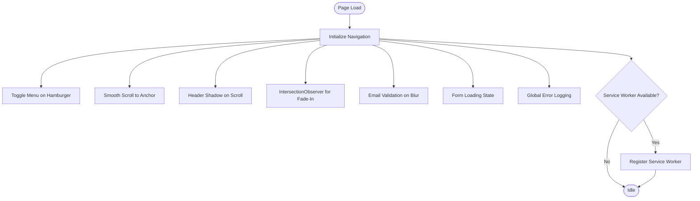
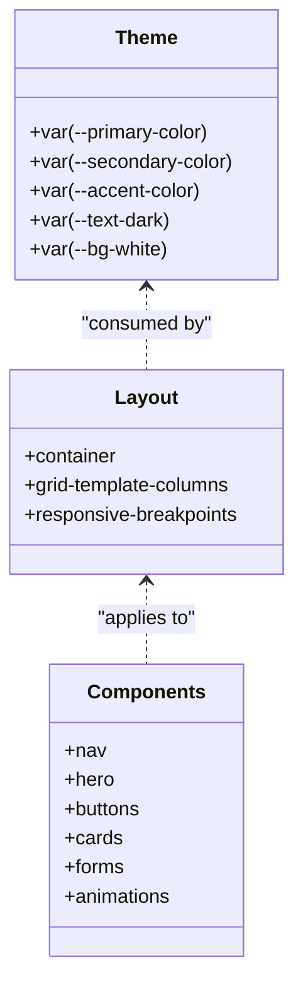
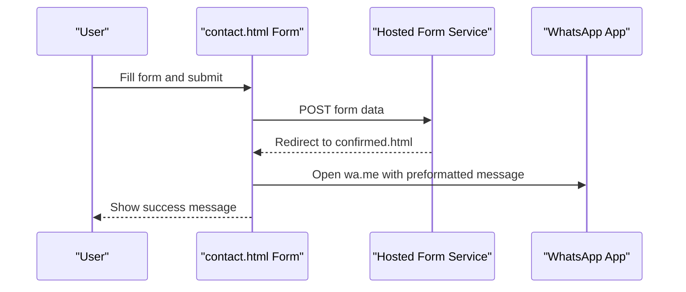
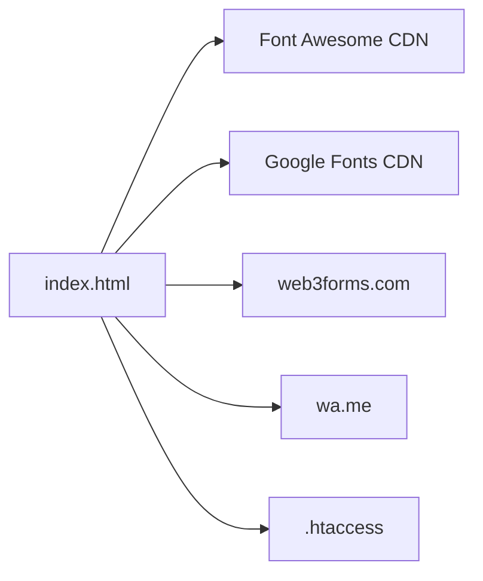
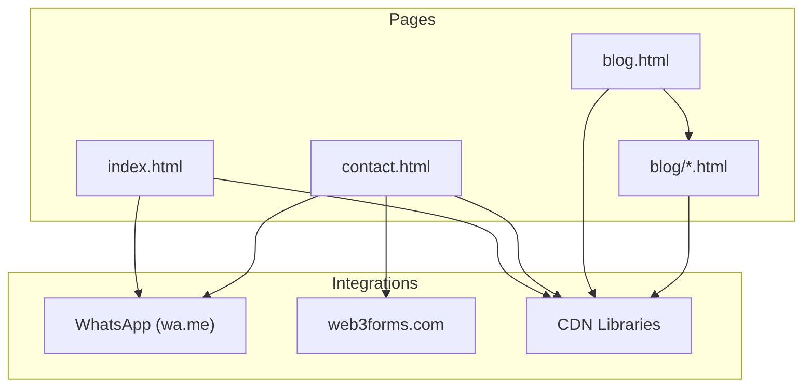

# Architecture Overview

<cite>
**Referenced Files in This Document**
- [index.html](file://index.html)
- [contact.html](file://contact.html)
- [blog.html](file://blog.html)
- [blog/erros-comuns-brasileiros-ingles.html](file://blog/erros-comuns-brasileiros-ingles.html)
- [js/main.js](file://js/main.js)
- [css/style.css](file://css/style.css)
- [.htaccess](file://.htaccess)
- [manifest.json](file://manifest.json)
- [robots.txt](file://robots.txt)
- [sitemap.xml](file://sitemap.xml)
- [README.md](file://README.md)
</cite>

## Table of Contents
1. [Introduction](#introduction)
2. [Project Structure](#project-structure)
3. [Core Components](#core-components)
4. [Architecture Overview](#architecture-overview)
5. [Detailed Component Analysis](#detailed-component-analysis)
6. [Dependency Analysis](#dependency-analysis)
7. [Performance Considerations](#performance-considerations)
8. [Troubleshooting Guide](#troubleshooting-guide)
9. [Conclusion](#conclusion)
10. [Appendices](#appendices)

## Introduction
This document describes the architecture of the graduates website, a pure vanilla JavaScript static website built with HTML5 semantic structure, modern CSS3 styling, and minimal external dependencies. The site targets Brazilian professionals seeking English instruction and emphasizes conversion-focused navigation, mobile-first responsive design, and pragmatic integration points such as WhatsApp and a hosted contact form service. Infrastructure is configured via Apache’s .htaccess for compression, caching, security headers, and HTTPS enforcement. Cross-cutting concerns include performance optimization, SEO implementation, and progressive web app readiness.

## Project Structure
The website follows a flat, static-file architecture with three primary pages and shared assets:
- index.html: Home page with hero, about, services, testimonials, pricing, and footer
- contact.html: Dedicated contact page with form, WhatsApp integration, and FAQ
- blog.html: Blog listing page with article cards and canonical links
- blog/*.html: Individual blog articles with structured data and canonicalization
- js/main.js: Client-side JavaScript for navigation, scroll effects, animations, and form handling
- css/style.css: Central stylesheet with CSS custom properties, responsive grids, and component styles
- .htaccess: Apache configuration for compression, caching, security headers, and HTTPS redirect
- manifest.json: PWA manifest for installability and theme metadata
- robots.txt and sitemap.xml: Search engine visibility and indexing configuration

**Diagram sources**
- [index.html](file://index.html)
- [contact.html](file://contact.html)
- [blog.html](file://blog.html)
- [blog/erros-comuns-brasileiros-ingles.html](file://blog/erros-comuns-brasileiros-ingles.html)
- [js/main.js](file://js/main.js)
- [css/style.css](file://css/style.css)
- [.htaccess](file://.htaccess)
- [manifest.json](file://manifest.json)
- [robots.txt](file://robots.txt)
- [sitemap.xml](file://sitemap.xml)

**Section sources**
- [README.md](file://README.md)
- [index.html](file://index.html)
- [contact.html](file://contact.html)
- [blog.html](file://blog.html)
- [blog/erros-comuns-brasileiros-ingles.html](file://blog/erros-comuns-brasileiros-ingles.html)
- [js/main.js](file://js/main.js)
- [css/style.css](file://css/style.css)
- [.htaccess](file://.htaccess)
- [manifest.json](file://manifest.json)
- [robots.txt](file://robots.txt)
- [sitemap.xml](file://sitemap.xml)

## Core Components
- HTML5 semantic structure: Each page uses semantic elements (header, nav, section, article, footer) to improve accessibility and SEO.
- CSS3 modern styling: Uses CSS custom properties, Grid/Flexbox layouts, transitions, and animations for responsive design.
- Minimal external dependencies: Libraries are loaded via CDN (Font Awesome, Google Fonts) with fallbacks to local assets.
- Conversion-focused navigation: Persistent floating WhatsApp button, prominent CTAs, and anchor-based smooth scrolling.
- Contact integration: Contact form submits to a hosted service and opens WhatsApp with a preformatted message; form validation and loading states are handled client-side.
- Progressive Web App: Manifest present for installability and standalone display.

**Section sources**
- [index.html](file://index.html)
- [contact.html](file://contact.html)
- [blog.html](file://blog.html)
- [blog/erros-comuns-brasileiros-ingles.html](file://blog/erros-comuns-brasileiros-ingles.html)
- [js/main.js](file://js/main.js)
- [css/style.css](file://css/style.css)
- [manifest.json](file://manifest.json)

## Architecture Overview
The system is a static website served by Apache with client-side interactivity powered by vanilla JavaScript. The architecture emphasizes:
- Pure static delivery with minimal server-side logic
- CDN-hosted libraries for icons and fonts
- Client-side routing via anchor links and smooth scroll
- Contact flow via hosted form and WhatsApp integration
- Infrastructure hardening via .htaccess directives

**Diagram sources**
- [index.html](file://index.html)
- [contact.html](file://contact.html)
- [blog.html](file://blog.html)
- [js/main.js](file://js/main.js)
- [.htaccess](file://.htaccess)

## Detailed Component Analysis

### HTML Structure and Navigation
- index.html: Contains hero, about, services, testimonials, pricing, and footer sections. Navigation is persistent with a mobile hamburger menu and smooth scrolling to anchors.
- contact.html: Dedicated contact page with hero, contact info, full form, and FAQ. Floating WhatsApp button is present on all pages.
- blog.html: Blog listing with cards linking to individual articles. Canonical tags and SEO metadata are included.
- blog/*.html: Individual articles with structured data (JSON-LD), canonical links, and metadata.

**Diagram sources**
- [index.html](file://index.html)
- [js/main.js](file://js/main.js)

**Section sources**
- [index.html](file://index.html)
- [contact.html](file://contact.html)
- [blog.html](file://blog.html)
- [blog/erros-comuns-brasileiros-ingles.html](file://blog/erros-comuns-brasileiros-ingles.html)

### JavaScript Functionality
Key behaviors implemented in js/main.js:
- Mobile navigation toggle with animated hamburger icon
- Smooth scrolling to anchor sections with fixed header offset
- Header shadow effect on scroll
- Phone number formatting for Brazilian format
- Scroll animations using IntersectionObserver for fade-in effects
- Active navigation highlighting based on scroll position
- Form input validation and loading states
- Global error logging
- Optional service worker registration placeholder

**Diagram sources**
- [js/main.js](file://js/main.js)

**Section sources**
- [js/main.js](file://js/main.js)

### CSS Styling and Responsive Design
The central stylesheet defines:
- CSS custom properties for consistent theming
- Responsive breakpoints and container widths
- Component-specific styles for navigation, hero, buttons, sections, cards, and forms
- Animations and transitions for interactive elements
- Media queries for mobile-first layout adjustments

**Diagram sources**
- [css/style.css](file://css/style.css)

**Section sources**
- [css/style.css](file://css/style.css)

### Contact Form Integration
The contact form integrates with a hosted service and WhatsApp:
- Form fields: name, phone, email, interest, message
- Hidden fields: access_key, subject, from_name, redirect
- Client-side validation and loading states
- Redirect to a success page after submission
- WhatsApp integration via preformatted message

**Diagram sources**
- [contact.html](file://contact.html)

**Section sources**
- [contact.html](file://contact.html)

### Progressive Web App Features
The manifest enables installability and standalone display:
- Short name, long name, icons, start URL, background/theme colors, display mode
- Descriptive metadata for app-like behavior

**Section sources**
- [manifest.json](file://manifest.json)

## Dependency Analysis
External dependencies and integrations:
- CDN-hosted libraries: Font Awesome (icons), Google Fonts (Inter)
- Hosted form service: web3forms.com for form submission
- WhatsApp integration: wa.me links for instant messaging
- Apache modules: mod_deflate, mod_expires, mod_headers, mod_rewrite

**Diagram sources**
- [index.html](file://index.html)
- [contact.html](file://contact.html)
- [.htaccess](file://.htaccess)

**Section sources**
- [index.html](file://index.html)
- [contact.html](file://contact.html)
- [.htaccess](file://.htaccess)

## Performance Considerations
- Compression: GZIP enabled for HTML, CSS, JS, JSON, and text content
- Browser caching: Long-lived cache for images and static assets; shorter cache for HTML
- Security headers: X-Content-Type-Options, X-Frame-Options, X-XSS-Protection, Referrer-Policy, Permissions-Policy
- HTTPS enforcement: Automatic redirect from HTTP to HTTPS
- Minimal dependencies: Only essential libraries via CDN
- Optimized CSS and JS: Single stylesheet and script files
- Image optimization: Use of PNG/JPG assets; consider lazy-loading for larger images
- Font optimization: Preloaded Google Fonts with display swap

**Section sources**
- [.htaccess](file://.htaccess)
- [css/style.css](file://css/style.css)
- [js/main.js](file://js/main.js)

## Troubleshooting Guide
Common issues and resolutions:
- Form not submitting: Verify hidden access_key and redirect fields; ensure hosted service is reachable
- WhatsApp not opening: Confirm wa.me links are correct and user has WhatsApp installed
- Mobile menu not toggling: Check JavaScript initialization and CSS visibility for .nav-menu.active
- Scroll animations not firing: Ensure IntersectionObserver is supported and elements have correct classes
- Caching issues: Clear browser cache or force refresh; verify .htaccess directives are active
- Mixed content warnings: Ensure all resources load over HTTPS; check CDN URLs

**Section sources**
- [contact.html](file://contact.html)
- [js/main.js](file://js/main.js)
- [.htaccess](file://.htaccess)

## Conclusion
The graduates website architecture is a lean, static-first solution optimized for conversion and performance. It leverages HTML5 semantics, modern CSS, and vanilla JavaScript to deliver a responsive, accessible, and secure experience. Infrastructure hardening via .htaccess ensures fast delivery and robust security, while CDN-hosted libraries minimize maintenance overhead. The contact flow integrates seamlessly with WhatsApp and a hosted form service, aligning with the conversion-focused design.

## Appendices

### System Context Diagram
High-level view of main pages, contact forms, and integration points.

**Diagram sources**
- [index.html](file://index.html)
- [contact.html](file://contact.html)
- [blog.html](file://blog.html)
- [blog/erros-comuns-brasileiros-ingles.html](file://blog/erros-comuns-brasileiros-ingles.html)

### Technology Stack and Version Compatibility
- HTML5: Semantic markup and accessibility features
- CSS3: Custom properties, Grid, Flexbox, transitions, animations
- JavaScript ES6: DOM manipulation, event handling, IntersectionObserver
- CDN-hosted libraries: Font Awesome 6.4.0, Google Fonts Inter
- Apache server: .htaccess directives for compression, caching, headers, HTTPS
- PWA: manifest.json for installability and standalone display
- Search visibility: robots.txt, sitemap.xml, Open Graph, canonical tags

**Section sources**
- [README.md](file://README.md)
- [index.html](file://index.html)
- [contact.html](file://contact.html)
- [blog.html](file://blog.html)
- [blog/erros-comuns-brasileiros-ingles.html](file://blog/erros-comuns-brasileiros-ingles.html)
- [js/main.js](file://js/main.js)
- [css/style.css](file://css/style.css)
- [.htaccess](file://.htaccess)
- [manifest.json](file://manifest.json)
- [robots.txt](file://robots.txt)
- [sitemap.xml](file://sitemap.xml)