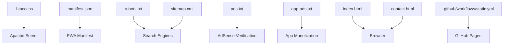
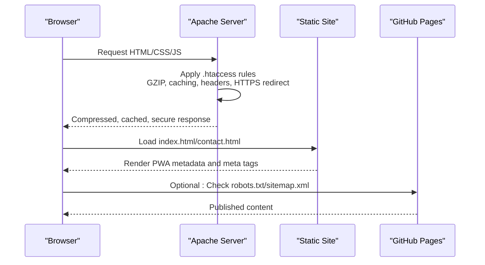
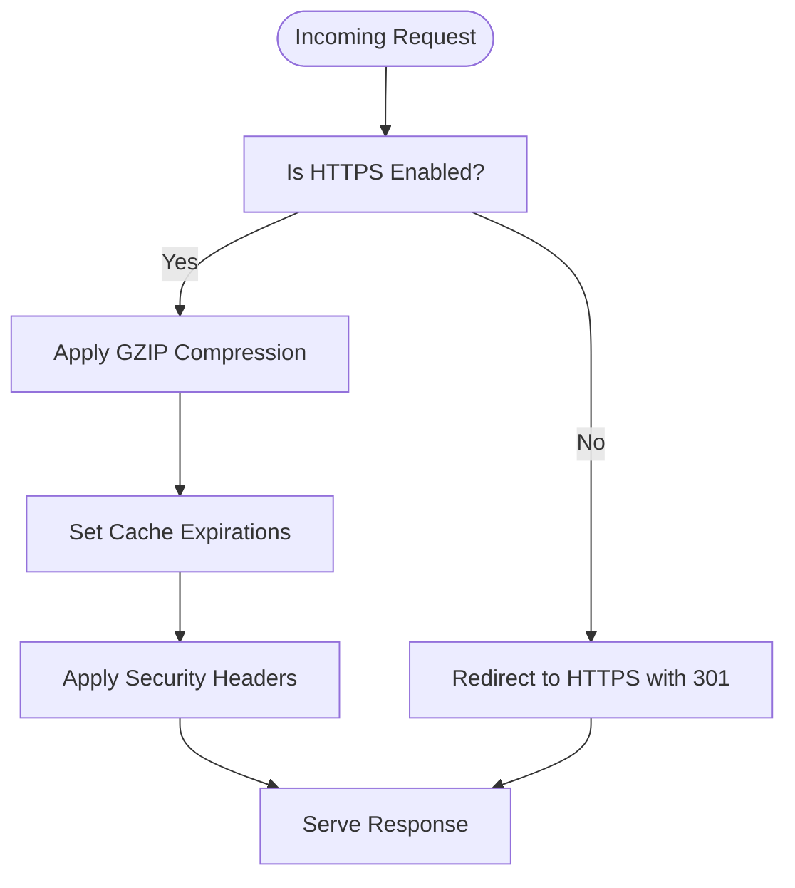
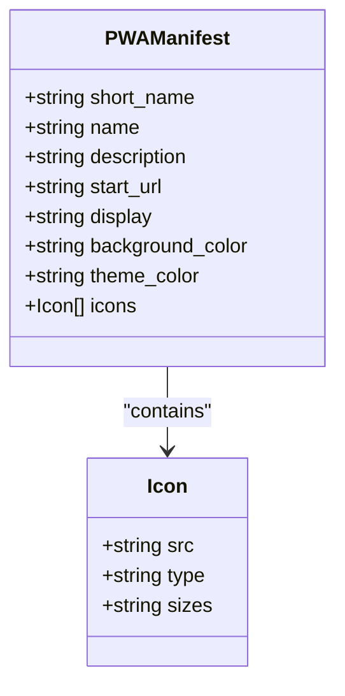
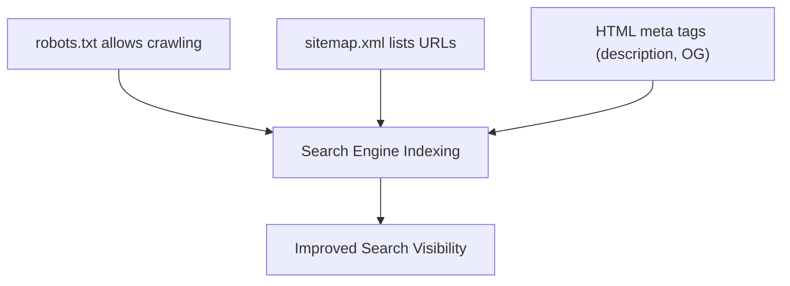
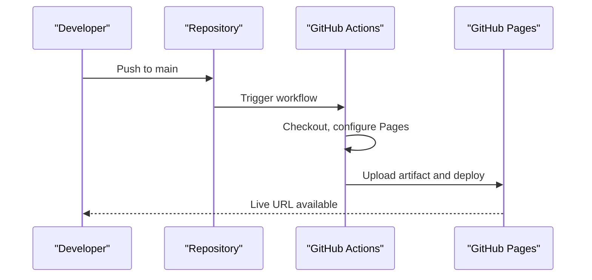
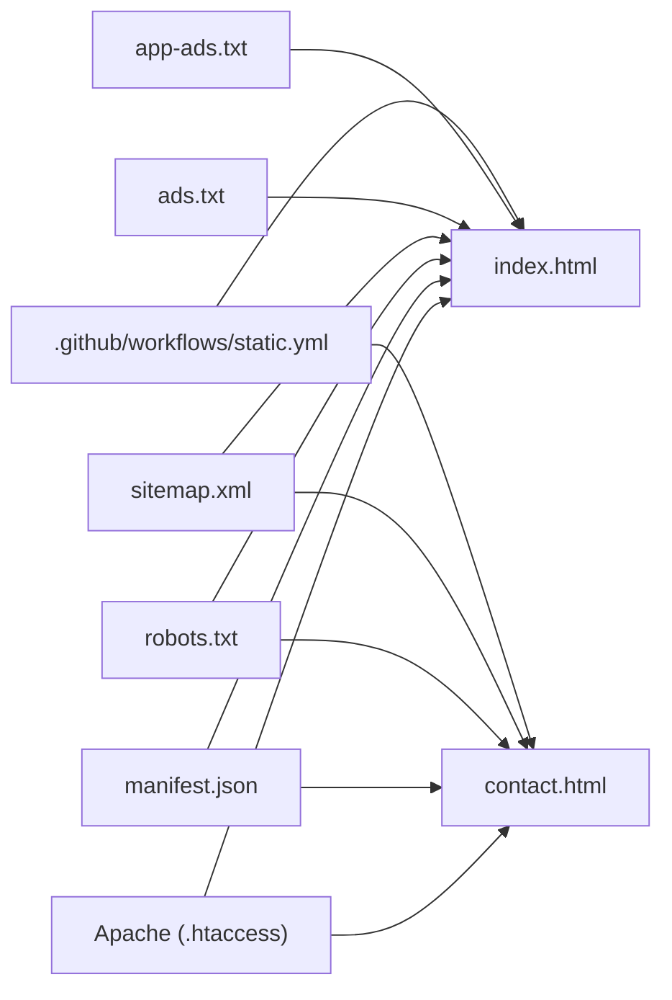

# Configuration and Deployment

<cite>
**Referenced Files in This Document**
- [.htaccess](file://.htaccess)
- [manifest.json](file://manifest.json)
- [robots.txt](file://robots.txt)
- [sitemap.xml](file://sitemap.xml)
- [ads.txt](file://ads.txt)
- [app-ads.txt](file://app-ads.txt)
- [index.html](file://index.html)
- [contact.html](file://contact.html)
- [README.md](file://README.md)
- [.github/workflows/static.yml](file://.github/workflows/static.yml)
</cite>

## Table of Contents
1. [Introduction](#introduction)
2. [Project Structure](#project-structure)
3. [Core Components](#core-components)
4. [Architecture Overview](#architecture-overview)
5. [Detailed Component Analysis](#detailed-component-analysis)
6. [Dependency Analysis](#dependency-analysis)
7. [Performance Considerations](#performance-considerations)
8. [Troubleshooting Guide](#troubleshooting-guide)
9. [Conclusion](#conclusion)
10. [Appendices](#appendices)

## Introduction
This document provides a comprehensive guide to configuring and deploying the graduates website with a focus on Apache server configuration via .htaccess, Progressive Web App (PWA) setup, SEO fundamentals, advertising configurations, and production best practices. It consolidates the existing configuration artifacts (.htaccess, manifest.json, robots.txt, sitemap.xml, ads.txt, app-ads.txt) and explains how they integrate with the HTML pages and deployment pipeline.

## Project Structure
The website is a static site with minimal server-side configuration. Key configuration files reside at the repository root alongside HTML pages and assets. The deployment workflow automates publishing to GitHub Pages.

**Diagram sources**
- [.htaccess](file://.htaccess)
- [manifest.json](file://manifest.json)
- [robots.txt](file://robots.txt)
- [sitemap.xml](file://sitemap.xml)
- [ads.txt](file://ads.txt)
- [app-ads.txt](file://app-ads.txt)
- [index.html](file://index.html)
- [contact.html](file://contact.html)
- [.github/workflows/static.yml](file://.github/workflows/static.yml)

**Section sources**
- [README.md](file://README.md)
- [.github/workflows/static.yml](file://.github/workflows/static.yml)

## Core Components
- Apache server configuration via .htaccess: Enables GZIP compression, sets browser caching, applies security headers, and enforces HTTPS.
- PWA configuration via manifest.json: Defines app metadata, icons, theme and background colors, and standalone display mode.
- SEO configuration: robots.txt permits crawling; sitemap.xml lists pages; HTML pages include meta tags and Open Graph properties.
- Advertising configuration: ads.txt and app-ads.txt provide verification and monetization declarations.
- Deployment pipeline: GitHub Actions workflow publishes the site to GitHub Pages.

**Section sources**
- [.htaccess](file://.htaccess)
- [manifest.json](file://manifest.json)
- [robots.txt](file://robots.txt)
- [sitemap.xml](file://sitemap.xml)
- [ads.txt](file://ads.txt)
- [app-ads.txt](file://app-ads.txt)
- [index.html](file://index.html)
- [contact.html](file://contact.html)
- [.github/workflows/static.yml](file://.github/workflows/static.yml)

## Architecture Overview
The runtime architecture ties together client-side rendering, server-side optimizations, and automated deployment.

**Diagram sources**
- [.htaccess](file://.htaccess)
- [index.html](file://index.html)
- [contact.html](file://contact.html)
- [robots.txt](file://robots.txt)
- [sitemap.xml](file://sitemap.xml)
- [.github/workflows/static.yml](file://.github/workflows/static.yml)

## Detailed Component Analysis

### Apache Server Configuration (.htaccess)
The .htaccess file configures:
- GZIP compression for text-based assets to reduce bandwidth and improve load times.
- Browser caching with long-lived cache policies for static resources and shorter cache for HTML.
- Security headers to mitigate common threats and enforce safe browsing defaults.
- HTTPS enforcement to redirect all HTTP traffic to HTTPS.

**Diagram sources**
- [.htaccess](file://.htaccess)

**Section sources**
- [.htaccess](file://.htaccess)

### Progressive Web App (PWA) Configuration (manifest.json)
The manifest defines:
- App identity and presentation: short_name, name, description, display mode (standalone).
- Icons for different densities and formats.
- Theme and background colors for immersive app-like experiences.
- Start URL to define the initial page loaded when launching the PWA.

**Diagram sources**
- [manifest.json](file://manifest.json)

**Section sources**
- [manifest.json](file://manifest.json)

### SEO Configuration
SEO is implemented through:
- robots.txt: Grants broad crawling permission to all agents.
- sitemap.xml: Provides an XML sitemap with URLs, last modification dates, change frequencies, and priorities.
- HTML meta tags: Includes viewport, description, Open Graph properties, and favicon/apple-touch icons.

**Diagram sources**
- [robots.txt](file://robots.txt)
- [sitemap.xml](file://sitemap.xml)
- [index.html](file://index.html)
- [contact.html](file://contact.html)

**Section sources**
- [robots.txt](file://robots.txt)
- [sitemap.xml](file://sitemap.xml)
- [index.html](file://index.html)
- [contact.html](file://contact.html)

### Advertising Configurations (ads.txt and app-ads.txt)
These files support ad verification and monetization:
- ads.txt: Declares authorized sellers for web inventory.
- app-ads.txt: Declares authorized sellers for app inventory.

Both files currently contain descriptive content suitable for publisher verification.

**Section sources**
- [ads.txt](file://ads.txt)
- [app-ads.txt](file://app-ads.txt)

### Deployment Pipeline (GitHub Actions)
The workflow automates publishing:
- Triggers on pushes to the default branch and manual dispatch.
- Checks out the repository, configures GitHub Pages, uploads the artifact, and deploys to GitHub Pages.
- Exposes the published URL via the environment context.

**Diagram sources**
- [.github/workflows/static.yml](file://.github/workflows/static.yml)

**Section sources**
- [.github/workflows/static.yml](file://.github/workflows/static.yml)

## Dependency Analysis
The configuration components interact as follows:
- .htaccess depends on Apache modules (deflate, expires, headers, rewrite) to apply compression, caching, headers, and HTTPS redirection.
- HTML pages depend on robots.txt and sitemap.xml for discoverability and on manifest.json for PWA behavior.
- ads.txt/app-ads.txt are independent verification files referenced by respective platforms.
- The deployment workflow depends on repository contents and GitHub Pages infrastructure.

**Diagram sources**
- [.htaccess](file://.htaccess)
- [manifest.json](file://manifest.json)
- [robots.txt](file://robots.txt)
- [sitemap.xml](file://sitemap.xml)
- [ads.txt](file://ads.txt)
- [app-ads.txt](file://app-ads.txt)
- [index.html](file://index.html)
- [contact.html](file://contact.html)
- [.github/workflows/static.yml](file://.github/workflows/static.yml)

**Section sources**
- [.htaccess](file://.htaccess)
- [manifest.json](file://manifest.json)
- [robots.txt](file://robots.txt)
- [sitemap.xml](file://sitemap.xml)
- [ads.txt](file://ads.txt)
- [app-ads.txt](file://app-ads.txt)
- [index.html](file://index.html)
- [contact.html](file://contact.html)
- [.github/workflows/static.yml](file://.github/workflows/static.yml)

## Performance Considerations
- Compression and caching: The .htaccess configuration enables GZIP compression and long cache lifetimes for static assets, reducing bandwidth and improving load times.
- Asset delivery: Ensure static assets are served efficiently; leverage CDN-hosted libraries where applicable.
- Image optimization: Use appropriately sized images and modern formats to minimize payload.
- Minimize redirects: HTTPS enforcement is essential; keep redirects minimal to avoid latency.
- Monitoring: Track metrics such as Time to First Byte (TTFB), First Contentful Paint (FCP), and Core Web Vitals post-deployment.

[No sources needed since this section provides general guidance]

## Troubleshooting Guide
- HTTPS enforcement not working:
  - Verify Apache modules (rewrite) are enabled and .htaccess is parsed.
  - Confirm the server supports HTTPS and the certificate is valid.
- Security headers not applied:
  - Ensure mod_headers is enabled and the directives are compatible with your Apache version.
- GZIP compression ineffective:
  - Confirm mod_deflate is enabled and the configured MIME types match served content.
- Browser caching issues:
  - Validate Expires headers and cache-control behavior in developer tools.
- PWA not appearing as installable:
  - Ensure manifest.json is served with correct MIME type and located at the root.
  - Verify icons are accessible and correctly referenced.
- Sitemap not indexed:
  - Confirm sitemap.xml is reachable and robots.txt does not block it.
- Ads verification failures:
  - Place ads.txt and app-ads.txt at the site root and ensure they are publicly accessible.
- Deployment errors:
  - Review workflow logs for checkout, upload, and deploy steps.
  - Ensure repository visibility and Pages settings are configured.

**Section sources**
- [.htaccess](file://.htaccess)
- [manifest.json](file://manifest.json)
- [robots.txt](file://robots.txt)
- [sitemap.xml](file://sitemap.xml)
- [ads.txt](file://ads.txt)
- [app-ads.txt](file://app-ads.txt)
- [.github/workflows/static.yml](file://.github/workflows/static.yml)

## Conclusion
The graduates website integrates Apache-level optimizations (.htaccess), PWA metadata (manifest.json), SEO assets (robots.txt, sitemap.xml), and advertising files (ads.txt, app-ads.txt) with a streamlined GitHub Actions deployment pipeline. These configurations collectively enhance performance, security, discoverability, and monetization readiness while maintaining a static, low-maintenance architecture.

[No sources needed since this section summarizes without analyzing specific files]

## Appendices

### Practical Deployment Preparation Checklist
- Validate SSL/TLS certificate and HTTPS enforcement.
- Confirm Apache modules for compression, caching, headers, and rewrite are enabled.
- Test PWA installation prompts and manifest parsing.
- Verify robots.txt allows indexing and sitemap.xml is accessible.
- Ensure ads.txt and app-ads.txt are present at the root and publicly accessible.
- Run a final deployment via the workflow and confirm the published URL.

**Section sources**
- [.htaccess](file://.htaccess)
- [manifest.json](file://manifest.json)
- [robots.txt](file://robots.txt)
- [sitemap.xml](file://sitemap.xml)
- [ads.txt](file://ads.txt)
- [app-ads.txt](file://app-ads.txt)
- [.github/workflows/static.yml](file://.github/workflows/static.yml)