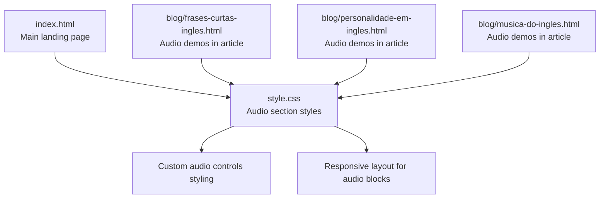
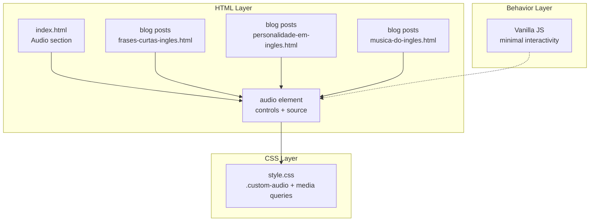
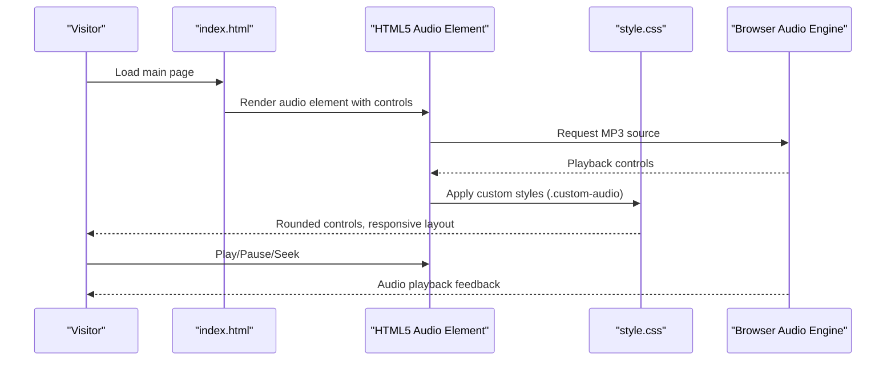
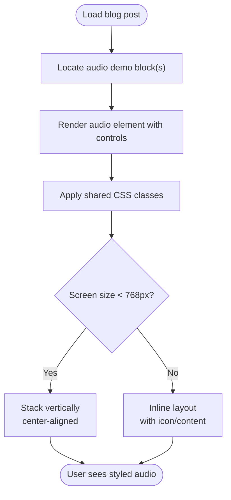
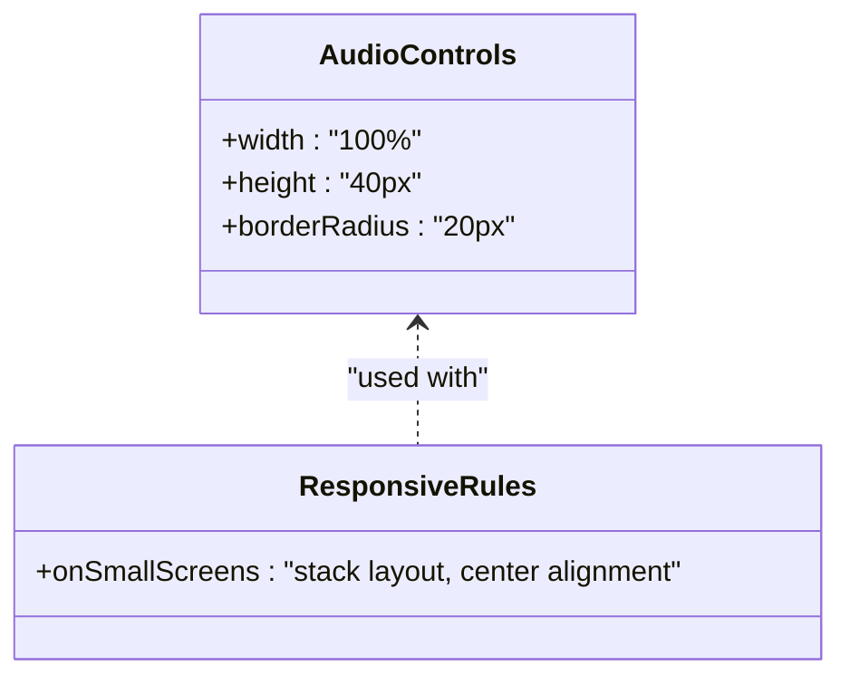
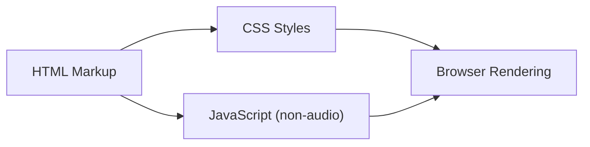

# Audio Pronunciation System

<cite>
**Referenced Files in This Document**
- [index.html](file://index.html)
- [style.css](file://css/style.css)
- [frases-curtas-ingles.html](file://blog/frases-curtas-ingles.html)
- [personalidade-em-ingles.html](file://blog/personalidade-em-ingles.html)
- [musica-do-ingles.html](file://blog/musica-do-ingles.html)
- [README.md](file://README.md)
</cite>

## Table of Contents
1. [Introduction](#introduction)
2. [Project Structure](#project-structure)
3. [Core Components](#core-components)
4. [Architecture Overview](#architecture-overview)
5. [Detailed Component Analysis](#detailed-component-analysis)
6. [Dependency Analysis](#dependency-analysis)
7. [Performance Considerations](#performance-considerations)
8. [Troubleshooting Guide](#troubleshooting-guide)
9. [Conclusion](#conclusion)
10. [Appendices](#appendices)

## Introduction
This document explains the audio pronunciation system implemented across the website. It focuses on the HTML5 audio element integration, custom styling for audio controls, responsive design, fallback messaging, accessibility features, and practical guidance for adding new audio samples. The system appears in two primary locations:
- The main landing page’s “Pronunciation Sample” section
- Multiple blog articles that embed audio demonstrations for pronunciation and speaking style

The goal is to help developers and content editors integrate audio content consistently, optimize for performance and cross-browser compatibility, and maintain a cohesive user experience aligned with the overall website design.

## Project Structure
The audio pronunciation system spans:
- A dedicated audio section on the main landing page
- Multiple blog posts that showcase audio examples for pronunciation and speaking style
- Shared CSS styles that define the appearance and responsiveness of audio players

**Diagram sources**
- [index.html:91-108](file://index.html#L91-L108)
- [style.css:777-841](file://css/style.css#L777-L841)
- [frases-curtas-ingles.html:243-273](file://blog/frases-curtas-ingles.html#L243-L273)
- [personalidade-em-ingles.html:178-194](file://blog/personalidade-em-ingles.html#L178-L194)
- [musica-do-ingles.html:20-100](file://blog/musica-do-ingles.html#L20-L100)

**Section sources**
- [index.html:91-108](file://index.html#L91-L108)
- [style.css:777-841](file://css/style.css#L777-L841)
- [frases-curtas-ingles.html:243-273](file://blog/frases-curtas-ingles.html#L243-L273)
- [personalidade-em-ingles.html:178-194](file://blog/personalidade-em-ingles.html#L178-L194)
- [musica-do-ingles.html:20-100](file://blog/musica-do-ingles.html#L20-L100)

## Core Components
- HTML5 audio element with MP3 source
- Custom-styled audio controls via CSS
- Responsive layout for audio blocks and containers
- Fallback message for unsupported browsers
- Accessibility attributes and labels
- Integration with the overall website design (colors, typography, spacing)

Key implementation points:
- The main page includes a single MP3 audio sample with a fallback message inside the audio tag.
- Blog posts embed multiple audio samples with consistent styling and layout.
- CSS defines rounded controls, width/height sizing, and responsive stacking on smaller screens.

**Section sources**
- [index.html:101-104](file://index.html#L101-L104)
- [style.css:825-829](file://css/style.css#L825-L829)
- [style.css:831-841](file://css/style.css#L831-L841)
- [frases-curtas-ingles.html:257-272](file://blog/frases-curtas-ingles.html#L257-L272)
- [personalidade-em-ingles.html:189-193](file://blog/personalidade-em-ingles.html#L189-L193)
- [musica-do-ingles.html:60-64](file://blog/musica-do-ingles.html#L60-L64)

## Architecture Overview
The audio pronunciation system follows a straightforward, static architecture:
- HTML markup defines the audio element and fallback text
- CSS applies custom styling and responsive behavior
- JavaScript remains minimal and does not alter audio behavior
- Blog posts reuse shared styles for consistency

**Diagram sources**
- [index.html:91-108](file://index.html#L91-L108)
- [frases-curtas-ingles.html:243-273](file://blog/frases-curtas-ingles.html#L243-L273)
- [personalidade-em-ingles.html:178-194](file://blog/personalidade-em-ingles.html#L178-L194)
- [musica-do-ingles.html:20-100](file://blog/musica-do-ingles.html#L20-L100)
- [style.css:777-841](file://css/style.css#L777-L841)

## Detailed Component Analysis

### Main Landing Page Audio Section
- Purpose: Showcase a pronunciation sample to demonstrate clear, paced, and understandable English suitable for business contexts.
- Implementation:
  - Uses the HTML5 audio element with controls enabled.
  - Provides an MP3 source and a fallback message inside the audio tag for unsupported browsers.
  - Styled with a custom class to achieve rounded controls and consistent sizing.
  - Responsive layout stacks content vertically on smaller screens.

**Diagram sources**
- [index.html:91-108](file://index.html#L91-L108)
- [index.html:101-104](file://index.html#L101-L104)
- [style.css:825-829](file://css/style.css#L825-L829)
- [style.css:831-841](file://css/style.css#L831-L841)

**Section sources**
- [index.html:91-108](file://index.html#L91-L108)
- [index.html:101-104](file://index.html#L101-L104)
- [style.css:825-829](file://css/style.css#L825-L829)
- [style.css:831-841](file://css/style.css#L831-L841)

### Blog Audio Demo Blocks
- Purpose: Provide embedded audio examples within educational content to illustrate pronunciation, rhythm, and speaking style.
- Implementation:
  - Each demo block contains a heading, explanatory text, and one or more audio elements.
  - Audio elements use the same MP3 source pattern and fallback message.
  - Shared CSS classes ensure consistent styling across posts.

**Diagram sources**
- [frases-curtas-ingles.html:243-273](file://blog/frases-curtas-ingles.html#L243-L273)
- [personalidade-em-ingles.html:178-194](file://blog/personalidade-em-ingles.html#L178-L194)
- [musica-do-ingles.html:20-100](file://blog/musica-do-ingles.html#L20-L100)
- [style.css:777-841](file://css/style.css#L777-L841)

**Section sources**
- [frases-curtas-ingles.html:243-273](file://blog/frases-curtas-ingles.html#L243-L273)
- [personalidade-em-ingles.html:178-194](file://blog/personalidade-em-ingles.html#L178-L194)
- [musica-do-ingles.html:20-100](file://blog/musica-do-ingles.html#L20-L100)
- [style.css:777-841](file://css/style.css#L777-L841)

### Custom Audio Controls Styling
- Rounded controls: Achieved via border-radius on the audio element.
- Consistent sizing: Width and height set to ensure uniform appearance across devices.
- Media query adjustments: On small screens, the layout stacks content and adjusts spacing.

**Diagram sources**
- [style.css:825-829](file://css/style.css#L825-L829)
- [style.css:831-841](file://css/style.css#L831-L841)

**Section sources**
- [style.css:825-829](file://css/style.css#L825-L829)
- [style.css:831-841](file://css/style.css#L831-L841)

### Accessibility Features
- ARIA labels: The main page includes an aria-label on the floating WhatsApp button, indicating the pattern for accessibility labeling.
- Semantic HTML: The audio element is used with a fallback message inside the tag, improving compatibility and accessibility.
- Keyboard navigation: The browser’s native controls are keyboard accessible by default.

**Section sources**
- [index.html:515](file://index.html#L515)
- [index.html:101-104](file://index.html#L101-L104)

## Dependency Analysis
- HTML depends on CSS for styling and layout.
- CSS defines the audio control appearance and responsive behavior.
- JavaScript is present but does not modify audio behavior; it handles navigation, scrolling, and form interactions.

**Diagram sources**
- [index.html:91-108](file://index.html#L91-L108)
- [style.css:777-841](file://css/style.css#L777-L841)
- [README.md:161-182](file://README.md#L161-L182)

**Section sources**
- [README.md:161-182](file://README.md#L161-L182)

## Performance Considerations
- File format: MP3 is widely supported across browsers and platforms, ensuring broad compatibility.
- File size: Keep audio files compressed and trimmed to the shortest length necessary to convey the intended pronunciation sample.
- Delivery: Host audio files on a fast CDN or the same origin to minimize latency.
- Lazy loading: Consider deferring audio initialization until the user interacts with the section containing the audio.
- Preloading: Use appropriate preload attributes to balance load speed and bandwidth usage.
- Cross-browser testing: Verify playback on Chrome, Firefox, Safari, Edge, and mobile browsers.

[No sources needed since this section provides general guidance]

## Troubleshooting Guide
Common issues and resolutions:
- Browser does not support the audio element:
  - Ensure the fallback message is present inside the audio tag.
  - Confirm the MP3 file path is correct and accessible.
- Audio does not play on iOS Safari:
  - Verify the file is served with the correct MIME type.
  - Ensure the file is hosted securely (HTTPS) if applicable.
- Controls appear too small or large:
  - Adjust the width and height in the custom audio class.
  - Use media queries to fine-tune for different screen sizes.
- Styling conflicts:
  - Inspect the audio container and ensure no conflicting CSS overrides the custom styles.
- Accessibility:
  - Add aria-labels to interactive elements near audio players.
  - Provide transcripts or captions for audio content where possible.

**Section sources**
- [index.html:101-104](file://index.html#L101-L104)
- [style.css:825-829](file://css/style.css#L825-L829)
- [style.css:831-841](file://css/style.css#L831-L841)

## Conclusion
The audio pronunciation system integrates seamlessly with the website’s design and educational goals. By leveraging the HTML5 audio element with MP3 playback, custom CSS styling, and responsive layout, it delivers a consistent, accessible, and performant experience across devices. The implementation is straightforward and extensible, enabling content teams to add new pronunciation samples and audio demonstrations with minimal effort while maintaining cross-browser compatibility and a professional appearance.

[No sources needed since this section summarizes without analyzing specific files]

## Appendices

### Adding New Audio Samples
Steps to add a new pronunciation sample:
1. Prepare the audio file in MP3 format and host it under the audio directory.
2. Reference the file in the HTML audio element with the correct path.
3. Add a fallback message inside the audio tag for unsupported browsers.
4. Apply the custom audio class to inherit consistent styling.
5. Wrap the audio element in a container that matches the existing layout (e.g., the audio section or demo block).
6. Test across browsers and devices to ensure compatibility and performance.

**Section sources**
- [index.html:101-104](file://index.html#L101-L104)
- [style.css:825-829](file://css/style.css#L825-L829)
- [style.css:831-841](file://css/style.css#L831-L841)

### Audio Quality and File Size Guidance
- Bitrate: Use a bitrate appropriate for spoken content (e.g., 128–192 kbps) to balance quality and file size.
- Duration: Keep samples short (e.g., 5–15 seconds) to reduce load times and improve user experience.
- Compression: Use industry-standard MP3 encoders with perceptual coding for speech.
- Hosting: Serve from a reliable CDN or optimized hosting to reduce latency.
- Preload strategy: Use “none” or “metadata” to avoid unnecessary downloads unless the user intends to play immediately.

[No sources needed since this section provides general guidance]

### Cross-Browser Compatibility Checklist
- Verify playback on Chrome, Firefox, Safari, Edge, and mobile browsers.
- Confirm the fallback message displays when the audio element is unsupported.
- Test on iOS Safari and Android Chrome for autoplay policies and user gesture requirements.
- Validate MIME types and HTTPS delivery for secure environments.

**Section sources**
- [README.md:170-175](file://README.md#L170-L175)