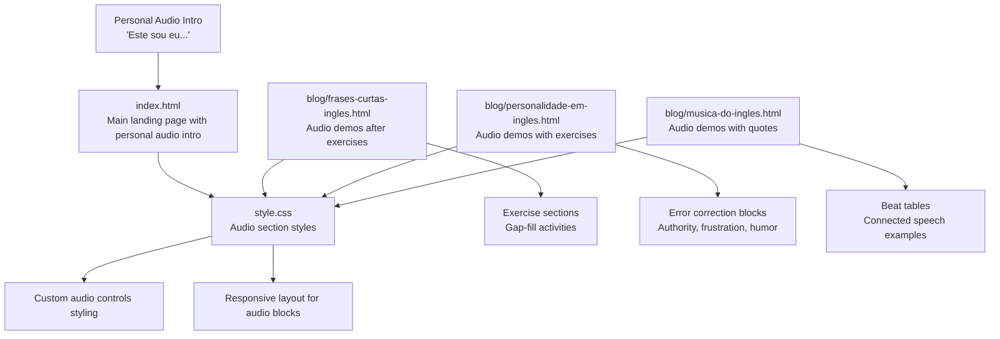
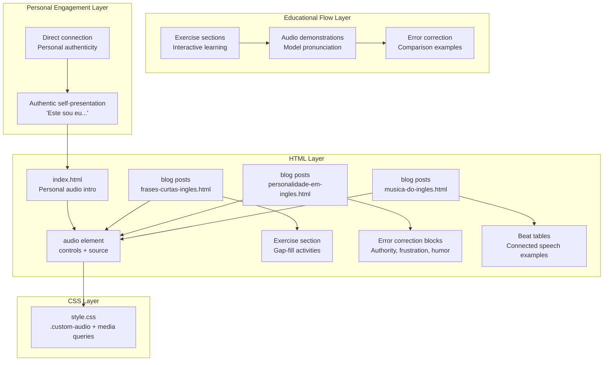
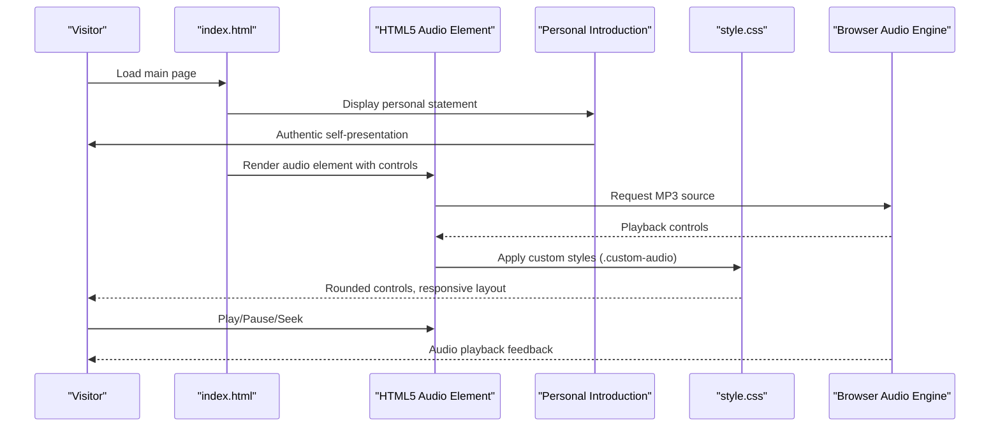
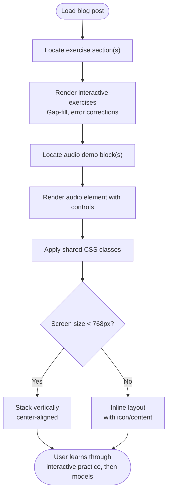
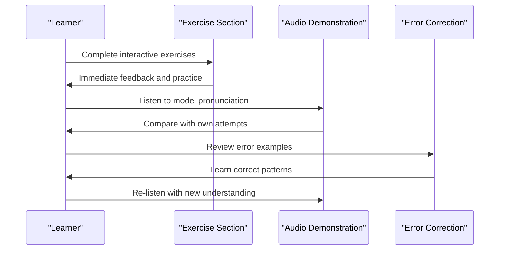
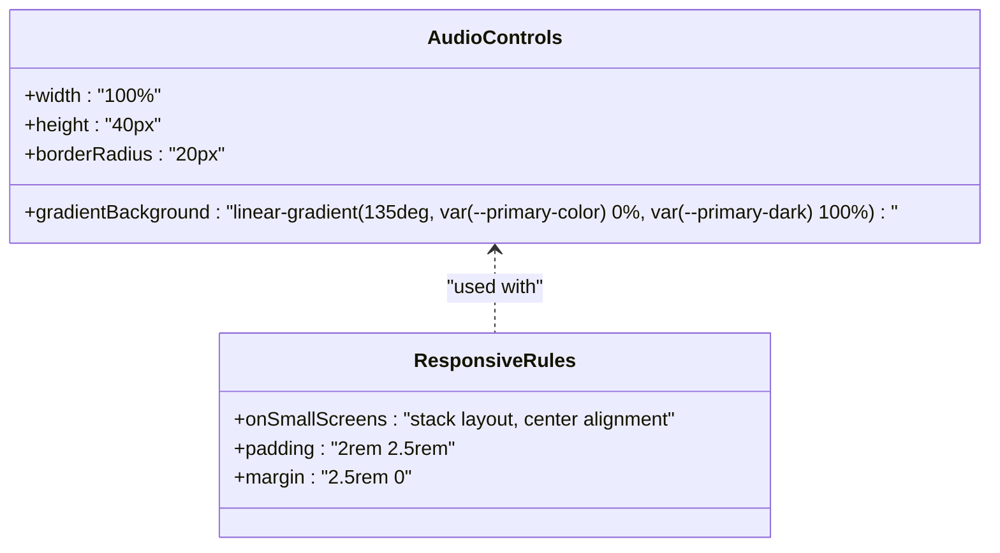
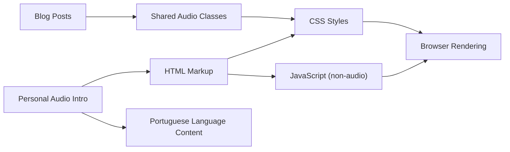

# Audio Pronunciation System

<cite>
**Referenced Files in This Document**
- [index.html](file://index.html)
- [style.css](file://css/style.css)
- [frases-curtas-ingles.html](file://blog/frases-curtas-ingles.html)
- [personalidade-em-ingles.html](file://blog/personalidade-em-ingles.html)
- [musica-do-ingles.html](file://blog/musica-do-ingles.html)
- [blog.html](file://blog.html)
- [README.md](file://README.md)
</cite>

## Update Summary
**Changes Made**
- Updated main landing page audio section analysis to reflect the new personal introduction approach
- Enhanced documentation of the audio introduction content transformation from generic educational content to authentic personal statement
- Updated audio sample positioning and educational flow documentation
- Revised content analysis to highlight the shift toward more personal and engaging audio introductions

## Table of Contents
1. [Introduction](#introduction)
2. [Project Structure](#project-structure)
3. [Core Components](#core-components)
4. [Architecture Overview](#architecture-overview)
5. [Detailed Component Analysis](#detailed-component-analysis)
6. [Dependency Analysis](#dependency-analysis)
7. [Performance Considerations](#performance-considerations)
8. [Troubleshooting Guide](#troubleshooting-guide)
9. [Conclusion](#conclusion)
10. [Appendices](#appendices)

## Introduction
This document explains the audio pronunciation system implemented across the website. It focuses on the HTML5 audio element integration, custom styling for audio controls, responsive design, fallback messaging, accessibility features, and practical guidance for adding new audio samples. The system appears in two primary locations:
- The main landing page's "Pronunciation Sample" section featuring a personal audio introduction
- Multiple blog articles that embed audio demonstrations for pronunciation and speaking style

The audio pronunciation system has been enhanced with improved layout structure, particularly in blog posts where audio demonstrations are strategically positioned after exercise sections to enhance the educational learning flow. The main landing page now features a more authentic personal approach to audio introductions, moving away from generic educational content about English importance to a direct, personal statement: "Este sou eu. Assim que você soa quando o inglês é a sua primeira língua."

## Project Structure
The audio pronunciation system spans:
- A dedicated audio section on the main landing page featuring a personal audio introduction
- Multiple blog posts that showcase audio examples for pronunciation and speaking style
- Shared CSS styles that define the appearance and responsiveness of audio players
- Integrated exercise sections that precede audio demonstrations for better learning flow

```mermaid
graph TB
A["index.html<br/>Main landing page with personal audio intro"] --> B["style.css<br/>Audio section styles"]
C["blog/frases-curtas-ingles.html<br/>Audio demos after exercises"] --> B
D["blog/personalidade-em-ingles.html<br/>Audio demos with exercises"] --> B
E["blog/musica-do-ingles.html<br/>Audio demos with quotes"] --> B
B --> F["Custom audio controls styling"]
B --> G["Responsive layout for audio blocks"]
C --> H["Exercise sections<br/>Gap-fill activities"]
D --> I["Error correction blocks<br/>Authority, frustration, humor"]
E --> J["Beat tables<br/>Connected speech examples"]
K["Personal Audio Intro<br/>'Este sou eu...'"] --> A
```

**Diagram sources**
- [index.html:102-119](file://index.html#L102-L119)
- [style.css:779-841](file://css/style.css#L779-L841)
- [frases-curtas-ingles.html:267-351](file://blog/frases-curtas-ingles.html#L267-L351)
- [personalidade-em-ingles.html:189-205](file://blog/personalidade-em-ingles.html#L189-L205)
- [musica-do-ingles.html:214-230](file://blog/musica-do-ingles.html#L214-L230)

**Section sources**
- [index.html:102-119](file://index.html#L102-L119)
- [style.css:779-841](file://css/style.css#L779-L841)
- [frases-curtas-ingles.html:267-351](file://blog/frases-curtas-ingles.html#L267-L351)
- [personalidade-em-ingles.html:189-205](file://blog/personalidade-em-ingles.html#L189-L205)
- [musica-do-ingles.html:214-230](file://blog/musica-do-ingles.html#L214-L230)

## Core Components
- HTML5 audio element with MP3 source
- Custom-styled audio controls via CSS
- Responsive layout for audio blocks and containers
- Fallback message for unsupported browsers
- Accessibility attributes and labels
- Integration with the overall website design (colors, typography, spacing)
- Exercise sections that precede audio demonstrations for enhanced learning flow
- Personal audio introduction featuring authentic self-presentation

Key implementation points:
- The main page includes a single MP3 audio sample with a personal introduction and fallback message inside the audio tag.
- The personal introduction uses a direct, authentic approach: "Este sou eu. Assim que você soa quando o inglês é a sua primeira língua."
- Blog posts embed multiple audio samples with consistent styling and layout, strategically positioned after exercise sections.
- CSS defines rounded controls, width/height sizing, and responsive stacking on smaller screens.
- Exercise sections provide interactive learning before audio demonstrations, creating a structured educational progression.

**Section sources**
- [index.html:110-115](file://index.html#L110-L115)
- [style.css:825-829](file://css/style.css#L825-L829)
- [frases-curtas-ingles.html:335-350](file://blog/frases-curtas-ingles.html#L335-L350)
- [personalidade-em-ingles.html:200-204](file://blog/personalidade-em-ingles.html#L200-L204)
- [musica-do-ingles.html:224-228](file://blog/musica-do-ingles.html#L224-L228)

## Architecture Overview
The audio pronunciation system follows a straightforward, static architecture with enhanced educational flow and personal engagement:
- HTML markup defines the audio element and fallback text with personal introduction
- CSS applies custom styling and responsive behavior
- JavaScript remains minimal and does not alter audio behavior
- Blog posts reuse shared styles for consistency with improved layout structure
- Exercise sections provide interactive learning before audio demonstrations
- Personal audio introductions create authentic connection with learners

```mermaid
graph TB
subgraph "HTML Layer"
H1["index.html<br/>Personal audio intro"] --> H2["audio element<br/>controls + source"]
H3["blog posts<br/>frases-curtas-ingles.html"] --> H4["Exercise section<br/>Gap-fill activities"]
H3 --> H2
H5["blog posts<br/>personalidade-em-ingles.html"] --> H6["Error correction blocks<br/>Authority, frustration, humor"]
H5 --> H2
H7["blog posts<br/>musica-do-ingles.html"] --> H8["Beat tables<br/>Connected speech examples"]
H7 --> H2
end
subgraph "CSS Layer"
S1["style.css<br/>.custom-audio + media queries"]
end
subgraph "Educational Flow Layer"
E1["Exercise sections<br/>Interactive learning"]
E2["Audio demonstrations<br/>Model pronunciation"]
E3["Error correction<br/>Comparison examples"]
end
subgraph "Personal Engagement Layer"
P1["Authentic self-presentation<br/>'Este sou eu...'"]
P2["Direct connection<br/>Personal authenticity"]
end
H2 --> S1
E1 --> E2
E2 --> E3
P1 --> H1
P2 --> P1
```

**Diagram sources**
- [index.html:102-119](file://index.html#L102-L119)
- [frases-curtas-ingles.html:267-351](file://blog/frases-curtas-ingles.html#L267-L351)
- [personalidade-em-ingles.html:228-395](file://blog/personalidade-em-ingles.html#L228-L395)
- [musica-do-ingles.html:245-447](file://blog/musica-do-ingles.html#L245-L447)
- [style.css:779-841](file://css/style.css#L779-L841)

## Detailed Component Analysis

### Main Landing Page Audio Section with Personal Introduction
- Purpose: Showcase a pronunciation sample that provides authentic self-presentation and demonstrates clear, paced, and understandable English suitable for business contexts.
- Implementation:
  - Uses the HTML5 audio element with controls enabled.
  - Provides an MP3 source and a fallback message inside the audio tag for unsupported browsers.
  - Features a personal introduction: "Este sou eu. Assim que você soa quando o inglês é a sua primeira língua."
  - Styled with a custom class to achieve rounded controls and consistent sizing.
  - Responsive layout stacks content vertically on smaller screens.
  - Creates authentic connection through direct, personal statement rather than generic educational content.

**Updated** The personal introduction approach transforms the audio sample from generic educational content to authentic self-presentation, making the audio sample more personally engaging and professionally representative.

```mermaid
sequenceDiagram
participant User as "Visitor"
participant Page as "index.html"
participant Audio as "HTML5 Audio Element"
participant Intro as "Personal Introduction"
participant CSS as "style.css"
participant Browser as "Browser Audio Engine"
User->>Page : Load main page
Page->>Intro : Display personal statement
Intro->>User : Authentic self-presentation
Page->>Audio : Render audio element with controls
Audio->>Browser : Request MP3 source
Browser-->>Audio : Playback controls
Audio->>CSS : Apply custom styles (.custom-audio)
CSS-->>User : Rounded controls, responsive layout
User->>Audio : Play/Pause/Seek
Browser-->>User : Audio playback feedback
```

**Diagram sources**
- [index.html:102-119](file://index.html#L102-L119)
- [index.html:110-115](file://index.html#L110-L115)
- [style.css:825-829](file://css/style.css#L825-L829)
- [style.css:831-841](file://css/style.css#L831-L841)

**Section sources**
- [index.html:102-119](file://index.html#L102-L119)
- [index.html:110-115](file://index.html#L110-L115)
- [style.css:825-829](file://css/style.css#L825-L829)
- [style.css:831-841](file://css/style.css#L831-L841)

### Blog Audio Demo Blocks with Enhanced Layout
- Purpose: Provide embedded audio examples within educational content to illustrate pronunciation, rhythm, and speaking style, with strategic positioning after interactive exercises.
- Implementation:
  - Each demo block contains a heading, explanatory text, and one or more audio elements.
  - Audio elements use the same MP3 source pattern and fallback message.
  - Shared CSS classes ensure consistent styling across posts.
  - Positioned after exercise sections to enhance learning flow and comprehension.

**Updated** Enhanced layout structure places audio demonstrations strategically after interactive exercises and error correction examples, creating a logical educational progression from practice to model examples.

```mermaid
flowchart TD
Start(["Load blog post"]) --> FindExercise["Locate exercise section(s)"]
FindExercise --> RenderExercise["Render interactive exercises<br/>Gap-fill, error corrections"]
RenderExercise --> FindAudio["Locate audio demo block(s)"]
FindAudio --> RenderAudio["Render audio element with controls"]
RenderAudio --> ApplyStyles["Apply shared CSS classes"]
ApplyStyles --> ResponsiveCheck{"Screen size < 768px?"}
ResponsiveCheck --> |Yes| StackLayout["Stack vertically<br/>center-aligned"]
ResponsiveCheck --> |No| InlineLayout["Inline layout<br/>with icon/content"]
StackLayout --> End(["User learns through<br/>interactive practice, then models"])
InlineLayout --> End
```

**Diagram sources**
- [frases-curtas-ingles.html:267-351](file://blog/frases-curtas-ingles.html#L267-L351)
- [personalidade-em-ingles.html:228-395](file://blog/personalidade-em-ingles.html#L228-L395)
- [musica-do-ingles.html:245-447](file://blog/musica-do-ingles.html#L245-L447)
- [style.css:779-841](file://css/style.css#L779-L841)

**Section sources**
- [frases-curtas-ingles.html:321-351](file://blog/frases-curtas-ingles.html#L321-L351)
- [personalidade-em-ingles.html:189-205](file://blog/personalidade-em-ingles.html#L189-L205)
- [musica-do-ingles.html:214-230](file://blog/musica-do-ingles.html#L214-L230)
- [style.css:779-841](file://css/style.css#L779-L841)

### Exercise Sections with Audio Integration
- Purpose: Provide interactive learning experiences that prepare users for audio demonstrations through hands-on practice.
- Implementation:
  - Gap-fill exercises with word banks and sentence completion activities.
  - Error correction blocks comparing robotic versus natural pronunciation.
  - Beat tables demonstrating connected speech patterns.
  - Strategic positioning of audio demonstrations after exercises for enhanced learning flow.

**Updated** Exercise sections now serve as foundational learning components that precede audio demonstrations, creating a structured educational progression that improves comprehension and retention.

```mermaid
sequenceDiagram
participant User as "Learner"
participant Exercise as "Exercise Section"
participant AudioDemo as "Audio Demonstration"
participant ErrorCorrection as "Error Correction"
User->>Exercise : Complete interactive exercises
Exercise->>User : Immediate feedback and practice
User->>AudioDemo : Listen to model pronunciation
AudioDemo->>User : Compare with own attempts
User->>ErrorCorrection : Review error examples
ErrorCorrection->>User : Learn correct patterns
User->>AudioDemo : Re-listen with new understanding
```

**Diagram sources**
- [frases-curtas-ingles.html:267-319](file://blog/frases-curtas-ingles.html#L267-L319)
- [personalidade-em-ingles.html:228-395](file://blog/personalidade-em-ingles.html#L228-L395)
- [musica-do-ingles.html:245-447](file://blog/musica-do-ingles.html#L245-L447)

**Section sources**
- [frases-curtas-ingles.html:267-319](file://blog/frases-curtas-ingles.html#L267-L319)
- [personalidade-em-ingles.html:228-395](file://blog/personalidade-em-ingles.html#L228-L395)
- [musica-do-ingles.html:245-447](file://blog/musica-do-ingles.html#L245-L447)

### Custom Audio Controls Styling
- Rounded controls: Achieved via border-radius on the audio element.
- Consistent sizing: Width and height set to ensure uniform appearance across devices.
- Media query adjustments: On small screens, the layout stacks content and adjusts spacing.
- Gradient backgrounds: Enhanced visual appeal with primary color gradients.

**Updated** Enhanced styling includes gradient backgrounds and improved visual hierarchy that complements the educational content structure and personal audio introduction approach.

```mermaid
classDiagram
class AudioControls {
+width : "100%"
+height : "40px"
+borderRadius : "20px"
+gradientBackground : "linear-gradient(135deg, var(--primary-color) 0%, var(--primary-dark) 100%)"
}
class ResponsiveRules {
+onSmallScreens : "stack layout, center alignment"
+padding : "2rem 2.5rem"
+margin : "2.5rem 0"
}
AudioControls <.. ResponsiveRules : "used with"
```

**Diagram sources**
- [style.css:825-829](file://css/style.css#L825-L829)
- [style.css:831-841](file://css/style.css#L831-L841)
- [frases-curtas-ingles.html:36-42](file://blog/frases-curtas-ingles.html#L36-L42)

**Section sources**
- [style.css:825-829](file://css/style.css#L825-L829)
- [style.css:831-841](file://css/style.css#L831-L841)
- [frases-curtas-ingles.html:36-42](file://blog/frases-curtas-ingles.html#L36-L42)

### Accessibility Features
- ARIA labels: The main page includes an aria-label on the floating WhatsApp button, indicating the pattern for accessibility labeling.
- Semantic HTML: The audio element is used with a fallback message inside the tag, improving compatibility and accessibility.
- Keyboard navigation: The browser's native controls are keyboard accessible by default.
- Screen reader compatibility: Audio elements include descriptive labels and titles.
- Personal content accessibility: The personal audio introduction is presented in Portuguese, making it accessible to the target audience.

**Section sources**
- [index.html:545](file://index.html#L545)
- [index.html:110-115](file://index.html#L110-L115)
- [frases-curtas-ingles.html:335-350](file://blog/frases-curtas-ingles.html#L335-L350)

## Dependency Analysis
- HTML depends on CSS for styling and layout.
- CSS defines the audio control appearance and responsive behavior.
- JavaScript is present but does not modify audio behavior; it handles navigation, scrolling, and form interactions.
- Blog posts depend on shared CSS classes for consistent audio demonstration styling.
- Personal audio introductions depend on Portuguese language content for authentic presentation.

```mermaid
graph LR
HTML["HTML Markup"] --> CSS["CSS Styles"]
HTML --> JS["JavaScript (non-audio)"]
CSS --> Browser["Browser Rendering"]
JS --> Browser
BlogPosts["Blog Posts"] --> SharedCSS["Shared Audio Classes"]
SharedCSS --> CSS
PersonalIntro["Personal Audio Intro"] --> HTML
PersonalIntro --> PortugueseContent["Portuguese Language Content"]
```

**Diagram sources**
- [index.html:102-119](file://index.html#L102-L119)
- [style.css:779-841](file://css/style.css#L779-L841)
- [README.md:161-182](file://README.md#L161-L182)

**Section sources**
- [README.md:161-182](file://README.md#L161-L182)

## Performance Considerations
- File format: MP3 is widely supported across browsers and platforms, ensuring broad compatibility.
- File size: Keep audio files compressed and trimmed to the shortest length necessary to convey the intended pronunciation sample.
- Delivery: Host audio files on a fast CDN or the same origin to minimize latency.
- Lazy loading: Consider deferring audio initialization until the user interacts with the section containing the audio.
- Preloading: Use appropriate preload attributes to balance load speed and bandwidth usage.
- Cross-browser testing: Verify playback on Chrome, Firefox, Safari, Edge, and mobile browsers.
- Educational flow optimization: Position audio demonstrations strategically after exercises to maximize learning effectiveness.
- Personal content optimization: The personal audio introduction should be concise and impactful to maintain user engagement.

**Updated** Enhanced performance considerations now include personal content optimization, ensuring audio demonstrations are positioned for maximum learning impact and authentic engagement.

## Troubleshooting Guide
Common issues and resolutions:
- Browser does not support the audio element:
  - Ensure the fallback message is present inside the audio tag.
  - Confirm the MP3 file path is correct and accessible.
- Audio does not play on iOS Safari:
  - Verify the file is served with the correct MIME type.
  - Ensure the file is hosted securely (HTTPS) if applicable.
- Controls appear too small or large:
  - Adjust the width and height in the custom audio class.
  - Use media queries to fine-tune for different screen sizes.
- Styling conflicts:
  - Inspect the audio container and ensure no conflicting CSS overrides the custom styles.
- Accessibility:
  - Add aria-labels to interactive elements near audio players.
  - Provide transcripts or captions for audio content where possible.
- Educational flow issues:
  - Verify exercise sections are properly positioned before audio demonstrations.
  - Ensure audio demonstrations follow logical learning progression.
- Personal content issues:
  - Verify the personal audio introduction text is properly formatted and accessible.
  - Ensure the audio file for the personal introduction is properly encoded and optimized.

**Updated** Added troubleshooting guidance for personal content issues and proper exercise-audio demonstration sequencing.

**Section sources**
- [index.html:110-115](file://index.html#L110-L115)
- [style.css:825-829](file://css/style.css#L825-L829)
- [style.css:831-841](file://css/style.css#L831-L841)

## Conclusion
The audio pronunciation system integrates seamlessly with the website's design and educational goals. Through strategic layout improvements, audio demonstrations are now positioned after interactive exercises, creating a logical learning progression that enhances comprehension and retention. The system leverages the HTML5 audio element with MP3 playback, custom CSS styling, responsive layout, and enhanced educational flow. 

**Updated** The system now features a more authentic personal approach with the audio introduction section rewritten from generic educational content about English importance to a personal statement: "Este sou eu. Assim que você soa quando o inglês é a sua primeira língua." This transformation makes the audio sample more personally engaging and professionally representative, enhancing the overall user experience and connection with the target audience.

The implementation is straightforward and extensible, enabling content teams to add new pronunciation samples and audio demonstrations with minimal effort while maintaining cross-browser compatibility and a professional appearance. The personal audio introduction approach creates a stronger emotional connection with learners, potentially improving engagement and conversion rates.

## Appendices

### Adding New Audio Samples with Proper Placement
Steps to add a new pronunciation sample with optimal educational flow:
1. Prepare the audio file in MP3 format and host it under the audio directory.
2. Reference the file in the HTML audio element with the correct path.
3. Add a fallback message inside the audio tag for unsupported browsers.
4. Apply the custom audio class to inherit consistent styling.
5. Wrap the audio element in a container that matches the existing layout (e.g., the audio section or demo block).
6. Position audio demonstrations after exercise sections for optimal learning flow.
7. Test across browsers and devices to ensure compatibility and performance.
8. Verify educational progression from interactive practice to model examples.
9. Consider the personal engagement factor when creating new audio introductions.

**Updated** Enhanced guidance includes strategic placement recommendations for optimal educational outcomes and personal engagement considerations.

**Section sources**
- [index.html:110-115](file://index.html#L110-L115)
- [style.css:825-829](file://css/style.css#L825-L829)
- [style.css:831-841](file://css/style.css#L831-L841)

### Audio Quality and File Size Guidance
- Bitrate: Use a bitrate appropriate for spoken content (e.g., 128–192 kbps) to balance quality and file size.
- Duration: Keep samples short (e.g., 5–15 seconds) to reduce load times and improve user experience.
- Compression: Use industry-standard MP3 encoders with perceptual coding for speech.
- Hosting: Serve from a reliable CDN or optimized hosting to reduce latency.
- Preload strategy: Use "none" or "metadata" to avoid unnecessary downloads unless the user intends to play immediately.
- Educational timing: Match audio demonstration timing to exercise completion for optimal learning flow.
- Personal content optimization: Ensure personal audio introductions are concise and impactful for maximum engagement.

**Updated** Added guidance for educational timing and optimal audio demonstration placement, including personal content optimization considerations.

### Cross-Browser Compatibility Checklist
- Verify playback on Chrome, Firefox, Safari, Edge, and mobile browsers.
- Confirm the fallback message displays when the audio element is unsupported.
- Test on iOS Safari and Android Chrome for autoplay policies and user gesture requirements.
- Validate MIME types and HTTPS delivery for secure environments.
- Test educational flow across different screen sizes and devices.
- Verify exercise-audio demonstration sequencing works correctly on all platforms.
- Test personal audio introduction content accessibility and language support.

**Updated** Enhanced compatibility checklist includes educational flow and device-specific testing requirements, plus personal content accessibility verification.

**Section sources**
- [README.md:170-175](file://README.md#L170-L175)