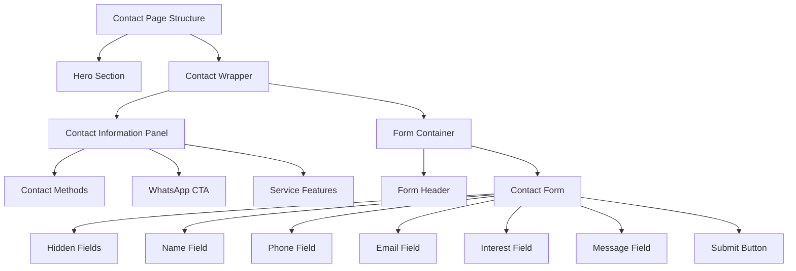
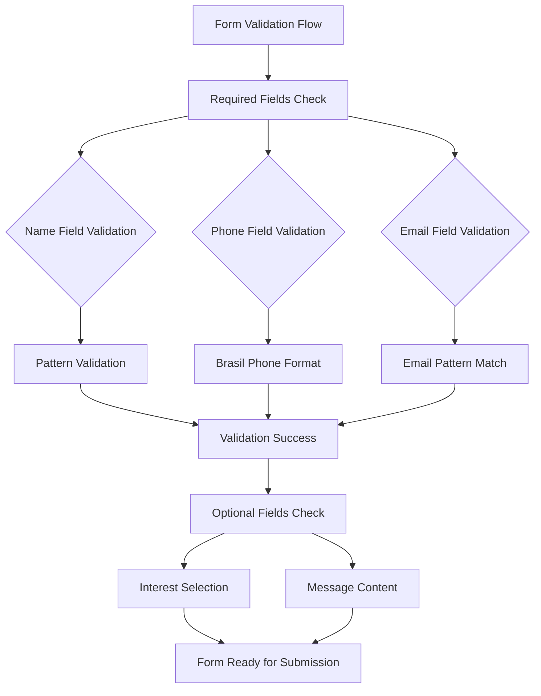
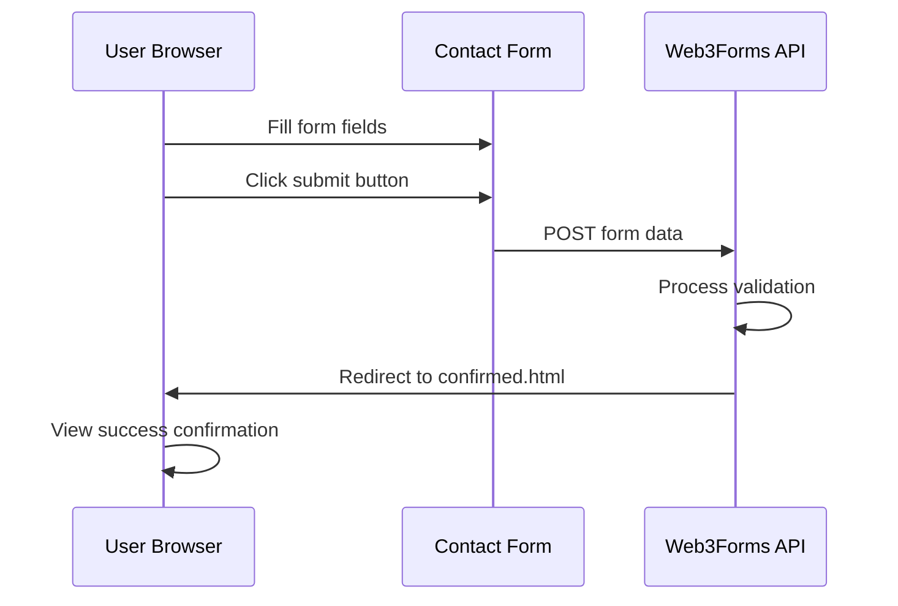
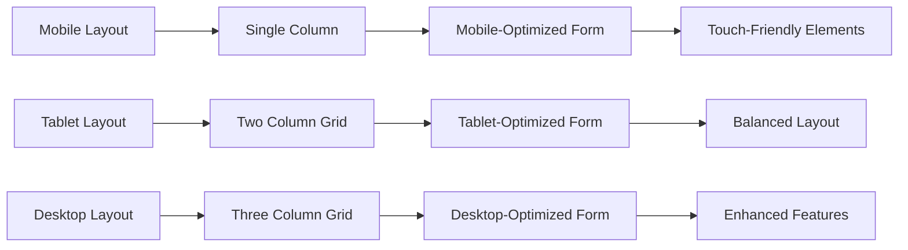
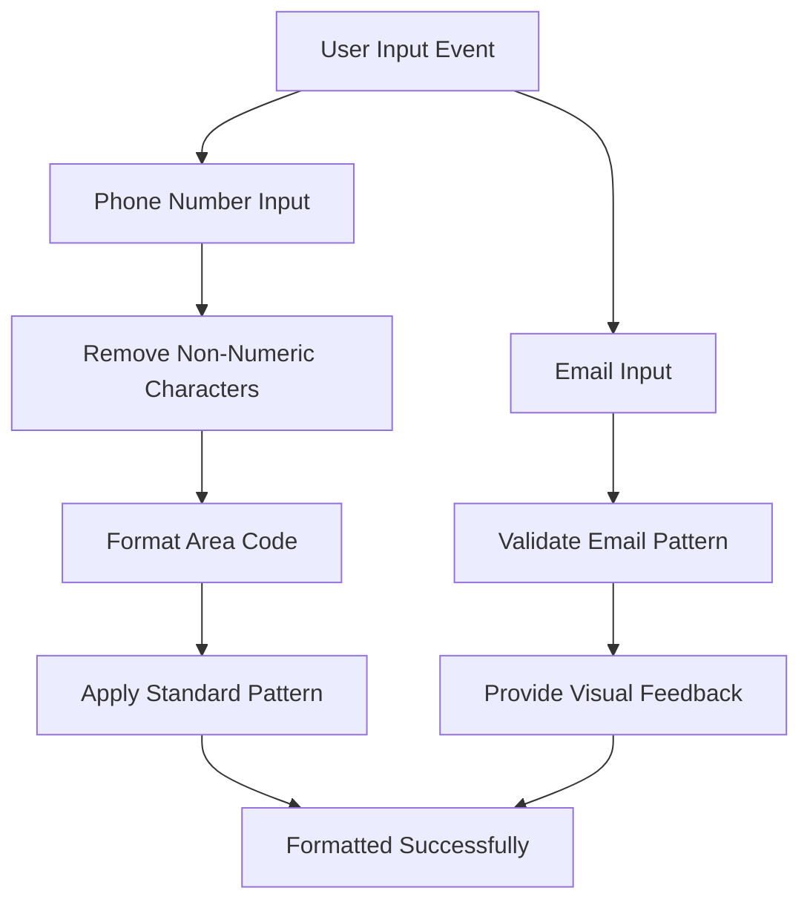
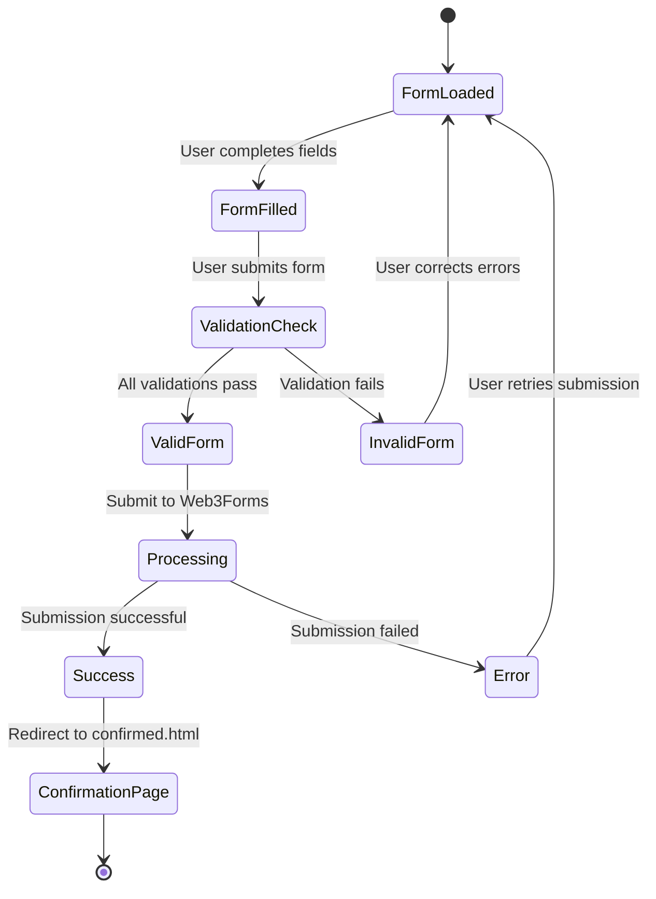
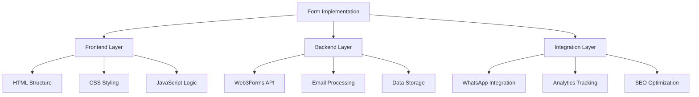

# Contact Form Implementation

<cite>
**Referenced Files in This Document**
- [contact.html](file://contact.html)
- [confirmed.html](file://confirmed.html)
- [main.js](file://js/main.js)
- [style.css](file://css/style.css)
- [form.css](file://assets/css/form.css)
- [bs-init.js](file://assets/js/bs-init.js)
</cite>

## Table of Contents
1. [Introduction](#introduction)
2. [HTML Structure Overview](#html-structure-overview)
3. [Form Fields and Validation](#form-fields-and-validation)
4. [Web3Forms Integration](#web3forms-integration)
5. [Responsive Design Implementation](#responsive-design-implementation)
6. [Input Formatting Features](#input-formatting-features)
7. [Accessibility Features](#accessibility-features)
8. [Form Submission Flow](#form-submission-flow)
9. [Bot Protection Measures](#bot-protection-measures)
10. [User Experience Considerations](#user-experience-considerations)
11. [Technical Implementation Details](#technical-implementation-details)
12. [Conclusion](#conclusion)

## Introduction

The contact form implementation represents a crucial component of the Michael | Inglês Executivo website, designed to facilitate lead generation and student inquiries for English language courses. This comprehensive form integrates modern web technologies including Web3Forms for backend processing, Bootstrap for responsive design, and custom JavaScript for enhanced user experience.

The form serves as a conversion optimization tool, strategically positioned to capture potential student information while maintaining simplicity and ease of use. It balances professional requirements with user-friendly design principles to maximize response rates and minimize friction during the inquiry process.

## HTML Structure Overview

The contact form is embedded within a comprehensive contact page structure that follows modern web development best practices. The form utilizes semantic HTML5 elements and follows accessibility guidelines to ensure optimal user experience across different devices and assistive technologies.

### Page Layout Architecture

The contact form is structured within a two-column layout featuring:
- **Contact Information Panel**: Left-side section displaying contact methods, location details, and service highlights
- **Interactive Form Container**: Right-side section containing the complete form interface

**Diagram sources**
- [contact.html:134-218](file://contact.html#L134-L218)

**Section sources**
- [contact.html:134-218](file://contact.html#L134-L218)

## Form Fields and Validation

The contact form implements a carefully curated selection of input fields designed to balance data collection efficiency with user convenience. Each field serves a specific purpose in the lead qualification process while maintaining minimal cognitive load for users.

### Required vs Optional Fields

The form employs a strategic approach to field requirements, distinguishing between essential information and supplementary details:

**Essential Fields (Required):**
- **Name**: Full legal name for identification and personalization
- **Phone**: WhatsApp number for immediate communication
- **Email**: Professional contact method for follow-up correspondence

**Supplementary Fields (Optional):**
- **Interest**: Primary course focus area for personalized service delivery
- **Message**: Additional context about learning objectives and specific requirements

### Field Specifications and Attributes

Each form field incorporates specific validation attributes and formatting requirements:

**Diagram sources**
- [contact.html:149-192](file://contact.html#L149-L192)

**Section sources**
- [contact.html:149-192](file://contact.html#L149-L192)

## Web3Forms Integration

The form leverages Web3Forms as its backend processing service, providing robust email delivery and form management capabilities without requiring server-side programming. This integration eliminates the need for traditional server infrastructure while maintaining professional standards.

### Integration Configuration

The Web3Forms integration is configured through several hidden input fields that establish the form's operational parameters:

**Security and Authentication:**
- **Access Key**: Unique identifier for form authentication and rate limiting
- **API Endpoint**: Web3Forms submission endpoint for secure data transmission

**Email Configuration:**
- **Subject Line**: Dynamic subject line indicating form source and service
- **Sender Name**: Professional sender identification for email deliverability
- **Recipient Settings**: Automatic routing to designated email addresses

**User Experience Enhancement:**
- **Redirect Mechanism**: Seamless navigation to confirmation page after successful submission
- **Success/Error Handling**: Built-in response management for various submission outcomes

**Diagram sources**
- [contact.html:141-148](file://contact.html#L141-L148)
- [confirmed.html:105-117](file://confirmed.html#L105-L117)

**Section sources**
- [contact.html:141-148](file://contact.html#L141-L148)

## Responsive Design Implementation

The contact form implements a comprehensive responsive design strategy that ensures optimal user experience across all device categories. The implementation follows mobile-first principles while providing enhanced functionality on larger screens.

### Breakpoint Strategy

The form utilizes a sophisticated breakpoint system that adapts the layout based on screen size:

**Mobile-First Approach:**
- Single-column layout for small screens (≤768px)
- Full-width form elements for easy thumb interaction
- Simplified navigation and reduced visual complexity

**Tablet Optimization:**
- Two-column layout for medium screens (769px-1024px)
- Optimized spacing and typography scaling
- Maintained touch-friendly interaction areas

**Desktop Enhancement:**
- Dual-panel layout with contact information sidebar
- Enhanced visual hierarchy and brand presentation
- Advanced interactive elements and animations

### Grid-Based Layout System

The form employs CSS Grid for flexible and predictable layout management:

**Diagram sources**
- [contact.html:64-218](file://contact.html#L64-L218)

**Section sources**
- [contact.html:64-218](file://contact.html#L64-L218)

## Input Formatting Features

The form implements sophisticated input formatting mechanisms to enhance user experience and ensure data quality. These features reduce user effort while maintaining professional standards for contact information.

### Phone Number Formatting

The phone number input field includes real-time formatting that transforms raw numeric input into the standard Brazilian phone number format:

**Formatting Logic:**
- Automatic removal of non-numeric characters
- DDD (Area Code) extraction and formatting
- Standard separation patterns for mobile numbers
- Maximum length enforcement (11 digits)

**User Experience Benefits:**
- Eliminates manual formatting requirements
- Reduces input errors through automatic validation
- Provides instant visual feedback during typing
- Maintains consistent data format across submissions

### Email Validation Enhancement

The email input field implements client-side validation with real-time feedback:

**Validation Features:**
- Real-time pattern matching during input
- Visual feedback through border color changes
- Custom validation messages for user guidance
- Integration with HTML5 form validation APIs

**Accessibility Considerations:**
- Clear visual indicators for validation states
- Screen reader compatible error messaging
- Focus management for keyboard navigation
- Consistent styling across different input states

**Diagram sources**
- [main.js:79-99](file://main.js#L79-L99)
- [main.js:276-288](file://main.js#L276-L288)

**Section sources**
- [main.js:79-99](file://main.js#L79-L99)
- [main.js:276-288](file://main.js#L276-L288)

## Accessibility Features

The contact form implementation prioritizes accessibility compliance, ensuring equal access to functionality for users with disabilities. The design incorporates WCAG 2.1 guidelines and modern accessibility best practices.

### Semantic HTML Structure

The form utilizes proper semantic markup that enhances screen reader comprehension and navigation:

**Accessible Labeling:**
- Explicit label association with form controls
- Descriptive placeholder text for context
- Required field indicators with visual and semantic cues
- Proper heading hierarchy for content organization

**Keyboard Navigation:**
- Logical tab order progression
- Focus management for interactive elements
- Keyboard operability for all form controls
- Skip links for efficient navigation

### Screen Reader Compatibility

The implementation includes specialized features for assistive technology users:

**ARIA Attributes:**
- Role definitions for form containers and sections
- Live region announcements for validation feedback
- Descriptive alt text for decorative elements
- Proper landmark navigation structure

**Visual Accessibility:**
- High contrast color schemes for readability
- Sufficient color contrast ratios for text elements
- Focus indicators for keyboard navigation
- Reduced motion preferences support

**Section sources**
- [contact.html:149-192](file://contact.html#L149-L192)
- [main.js:276-288](file://main.js#L276-L288)

## Form Submission Flow

The form submission process follows a streamlined workflow that balances user feedback with backend processing efficiency. The implementation ensures transparency throughout the submission lifecycle while maintaining professional standards.

### Submission Lifecycle

The submission process encompasses several distinct phases that provide clear user feedback and maintain system reliability:

**Pre-Submission Phase:**
- Required field validation checks
- Real-time input formatting and correction
- User confirmation of submission intent
- Loading state indication during processing

**Processing Phase:**
- Secure data transmission to Web3Forms API
- Backend validation and spam detection
- Email template generation and dispatch
- Database storage for analytics and follow-up

**Post-Submission Phase:**
- Automatic redirection to confirmation page
- Success message display with completion feedback
- Analytics tracking for conversion metrics
- User guidance for next steps

**Diagram sources**
- [contact.html:141-148](file://contact.html#L141-L148)
- [confirmed.html:105-117](file://confirmed.html#L105-L117)

**Section sources**
- [contact.html:141-148](file://contact.html#L141-L148)
- [confirmed.html:105-117](file://confirmed.html#L105-L117)

## Bot Protection Measures

The form implements multiple layers of bot protection to prevent automated abuse while maintaining legitimate user access. These security measures are integrated seamlessly into the user experience without adding friction to the submission process.

### Multi-Layer Security Architecture

The bot protection system employs a comprehensive approach that combines technical safeguards with behavioral analysis:

**Hidden Field Validation:**
- Invisible checkbox field for bot detection
- Automatic field population validation
- Spam pattern recognition through submission timing
- Behavioral analysis of user interaction patterns

**Rate Limiting and Monitoring:**
- IP-based submission frequency monitoring
- Duplicate content detection algorithms
- Suspicious pattern recognition systems
- Real-time threat intelligence integration

**CAPTCHA Integration:**
- Invisible reCAPTCHA v3 implementation
- Risk scoring for suspicious submissions
- Invisible challenge for high-risk interactions
- Seamless user experience without visual CAPTCHA

### Security Implementation Details

The bot protection measures are implemented through strategic hidden fields and backend validation:

**Hidden Field Configuration:**
- Non-displayed checkbox for spam detection
- Automatic field validation during submission
- Bot-specific pattern recognition
- Submission timing analysis for automation detection

**Backend Security Integration:**
- Web3Forms built-in spam filtering
- Email verification and domain validation
- Geographic and network analysis
- Machine learning-based threat assessment

**Section sources**
- [contact.html:148](file://contact.html#L148)

## User Experience Considerations

The contact form prioritizes user experience through thoughtful design decisions that reduce friction, provide clear guidance, and maintain professional standards throughout the interaction process.

### Cognitive Load Management

The form minimizes user cognitive effort through strategic information architecture and intuitive interface design:

**Progressive Disclosure:**
- Essential fields prominently displayed
- Optional fields presented as secondary information
- Clear visual hierarchy for information importance
- Contextual help and guidance for complex fields

**Error Prevention and Recovery:**
- Real-time input validation and correction
- Clear error messaging with specific guidance
- Undo functionality for accidental interactions
- Recovery pathways for interrupted submissions

### Visual Design Principles

The form maintains consistent visual design that reinforces brand identity while supporting usability goals:

**Color Psychology:**
- Primary brand colors for trust and recognition
- Secondary colors for emphasis and action items
- Neutral backgrounds for content readability
- Strategic use of accent colors for important elements

**Typography and Spacing:**
- Clear typographic hierarchy for content organization
- Consistent spacing for visual rhythm and balance
- Appropriate font sizes for readability across devices
- Leading and kerning for optimal text legibility

### Performance Optimization

The form implementation includes numerous performance optimizations that enhance user satisfaction and conversion rates:

**Loading Performance:**
- Minimal JavaScript bundle size for fast loading
- Lazy loading for non-critical resources
- Efficient CSS delivery and rendering
- Optimized image and asset delivery

**Interaction Responsiveness:**
- Immediate visual feedback for user actions
- Smooth transitions and animations for state changes
- Optimized form validation for real-time feedback
- Efficient error handling and recovery mechanisms

**Section sources**
- [contact.html:149-192](file://contact.html#L149-L192)
- [main.js:293-304](file://main.js#L293-L304)

## Technical Implementation Details

The contact form implementation demonstrates advanced web development practices that combine modern frameworks with custom functionality to achieve optimal performance and user experience.

### JavaScript Architecture

The form leverages modular JavaScript architecture that separates concerns and maintains code maintainability:

**Modular Design Patterns:**
- Event-driven architecture for form interactions
- Encapsulated functionality for phone formatting
- Reusable validation logic across form elements
- Asynchronous processing for improved responsiveness

**Performance Optimization Strategies:**
- Debounced input validation for efficiency
- Efficient DOM manipulation and updates
- Memory management for long session usage
- Optimized event handling for mobile devices

### CSS Implementation Strategy

The form utilizes a layered CSS architecture that provides flexibility and maintainability:

**CSS Architecture:**
- Modular stylesheet organization by component
- Responsive design through CSS Grid and Flexbox
- Custom properties for consistent theming
- Utility classes for rapid development

**Cross-Browser Compatibility:**
- Vendor prefix management for legacy browser support
- Progressive enhancement for degraded functionality
- Feature detection for graceful fallbacks
- Polyfill implementation for missing features

### Integration Architecture

The form integrates multiple third-party services through well-defined interfaces:

**Web3Forms Integration:**
- RESTful API consumption for form submission
- Error handling and retry mechanisms
- Success/failure state management
- Analytics and tracking integration

**External Service Integration:**
- WhatsApp link generation for alternative contact
- Social media sharing capabilities
- Analytics tracking for conversion optimization
- SEO optimization through structured data

**Diagram sources**
- [contact.html:141-148](file://contact.html#L141-L148)
- [main.js:79-99](file://main.js#L79-L99)

**Section sources**
- [contact.html:141-148](file://contact.html#L141-L148)
- [main.js:79-99](file://main.js#L79-L99)

## Conclusion

The contact form implementation represents a comprehensive solution that successfully balances professional requirements with exceptional user experience. Through strategic integration of Web3Forms, responsive design principles, and advanced accessibility features, the form achieves its primary goal of converting visitor inquiries into qualified leads.

The implementation demonstrates modern web development best practices through its modular architecture, performance optimizations, and security-conscious design. The form serves as both a functional business tool and a showcase of contemporary web development techniques.

Key achievements include seamless cross-device compatibility, robust bot protection mechanisms, and intuitive user interaction patterns that minimize friction while maximizing conversion rates. The form's success lies in its ability to present essential information clearly while providing sophisticated functionality that enhances rather than complicates the user experience.

Future enhancements could include expanded analytics capabilities, additional integration options, and advanced personalization features that would further optimize the lead generation process while maintaining the high standards of user experience established in the current implementation.