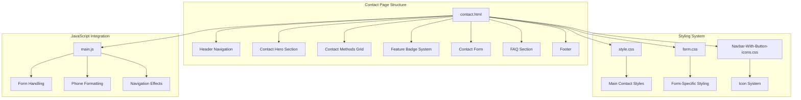
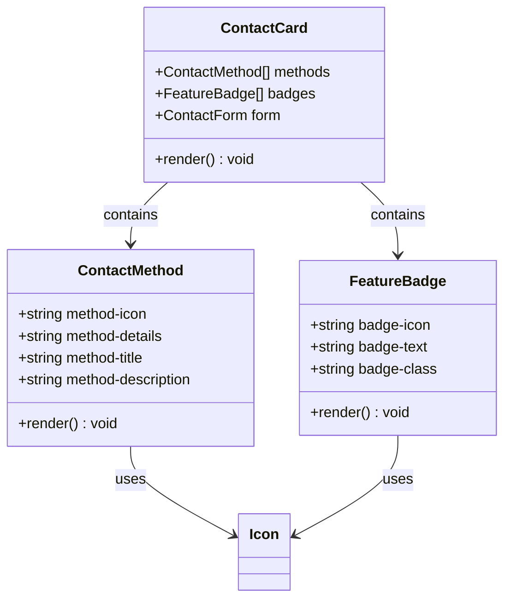
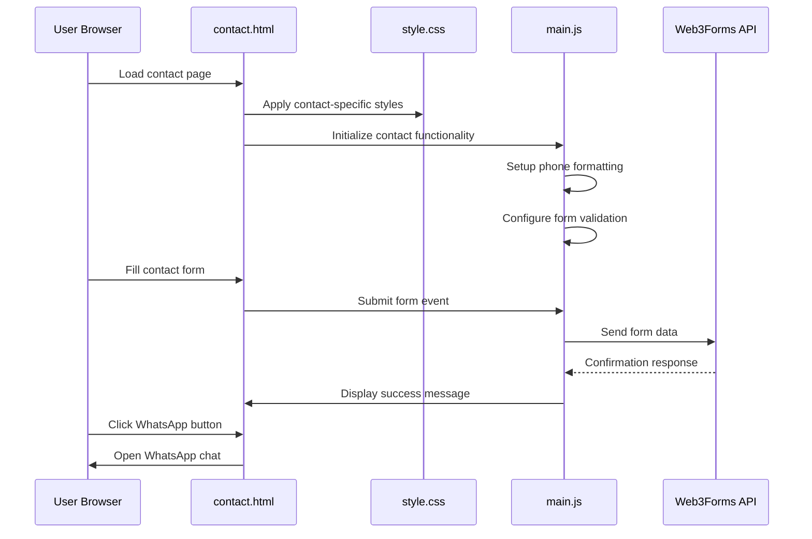
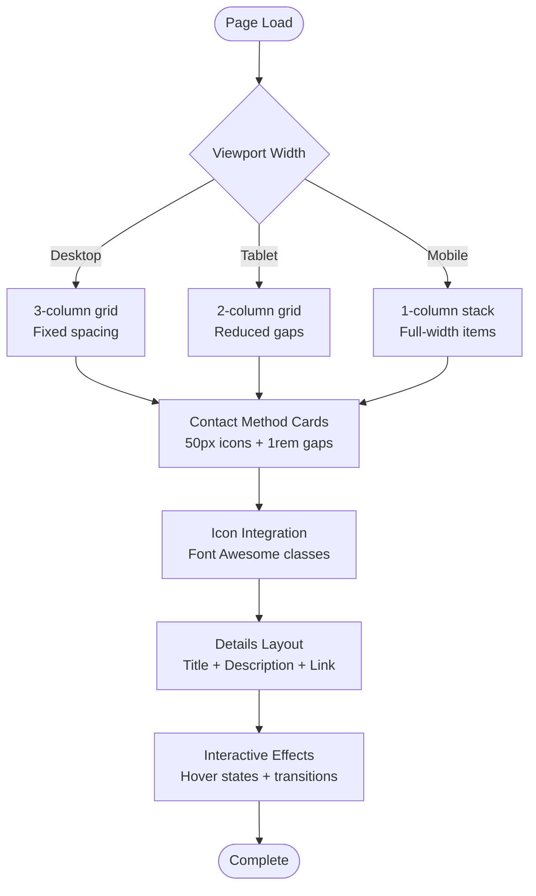
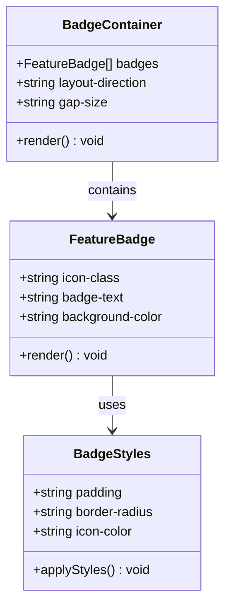
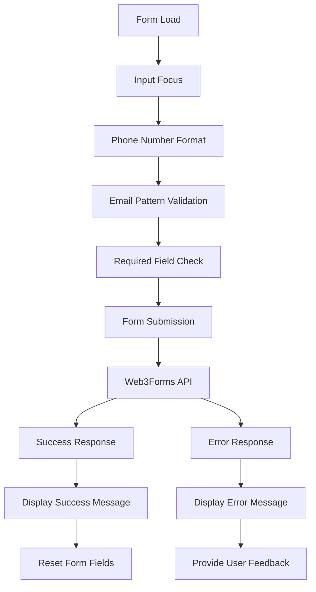
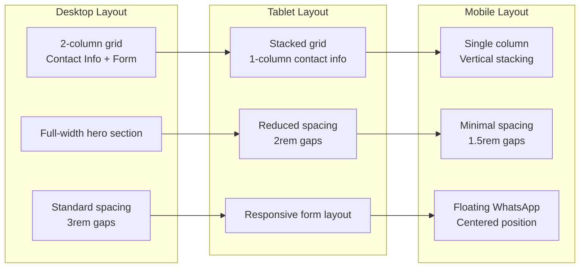
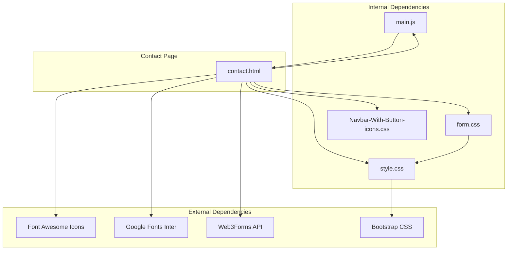

# Contact Information Display

<cite>
**Referenced Files in This Document**
- [contact.html](file://contact.html)
- [index.html](file://index.html)
- [main.js](file://js/main.js)
- [style.css](file://css/style.css)
- [form.css](file://assets/css/form.css)
- [Navbar-With-Button-icons.css](file://assets/css/Navbar-With-Button-icons.css)
</cite>

## Table of Contents
1. [Introduction](#introduction)
2. [Project Structure](#project-structure)
3. [Core Components](#core-components)
4. [Architecture Overview](#architecture-overview)
5. [Detailed Component Analysis](#detailed-component-analysis)
6. [Dependency Analysis](#dependency-analysis)
7. [Performance Considerations](#performance-considerations)
8. [Troubleshooting Guide](#troubleshooting-guide)
9. [Conclusion](#conclusion)

## Introduction

The contact information display section serves as the primary gateway for potential students to connect with Michael's English tutoring services. This comprehensive documentation covers the implementation of contact methods, location information, business hours, feature badges, and the integrated contact form system. The section demonstrates modern web design principles with responsive layouts, consistent branding, and seamless user experience across all device sizes.

The contact page integrates multiple communication channels including WhatsApp direct messaging, traditional contact methods, and an embedded contact form powered by Web3Forms. The design maintains consistency with the overall website aesthetic while providing specialized contact functionality optimized for educational service delivery.

## Project Structure

The contact information display is implemented as a standalone HTML page with integrated CSS styling and JavaScript functionality. The structure follows a modular approach with distinct sections for navigation, hero content, contact methods, form interface, and FAQ components.

**Diagram sources**
- [contact.html:1-291](file://contact.html#L1-L291)
- [style.css:750-1234](file://css/style.css#L750-L1234)
- [main.js:1-338](file://js/main.js#L1-L338)

**Section sources**
- [contact.html:1-291](file://contact.html#L1-L291)
- [style.css:750-1234](file://css/style.css#L750-L1234)

## Core Components

### Contact Methods Implementation

The contact methods section presents three primary communication channels in a responsive grid layout:

**WhatsApp Contact Integration**
- Direct WhatsApp linking with pre-filled messages
- Floating action button for quick access
- Consistent styling matching the brand's green color scheme
- Mobile-responsive positioning and sizing

**Location Information Display**
- Virtual location indicator for online-only instruction
- Clear geographic context for Brazilian audience
- Professional presentation emphasizing global accessibility

**Business Hours Specification**
- Standard weekday operating schedule
- Flexible timing options for client convenience
- Clear communication of response time expectations

**Feature Badge System**
- Three prominent feature badges highlighting service benefits
- Icon integration using Font Awesome for visual enhancement
- Consistent spacing and typography for readability

**Section sources**
- [contact.html:73-131](file://contact.html#L73-L131)
- [style.css:890-966](file://css/style.css#L890-L966)

### HTML Structure for Contact Cards

The contact card implementation utilizes semantic HTML with consistent class naming:

**Diagram sources**
- [contact.html:73-131](file://contact.html#L73-L131)
- [style.css:894-966](file://css/style.css#L894-L966)

**Section sources**
- [contact.html:73-131](file://contact.html#L73-L131)
- [style.css:894-966](file://css/style.css#L894-L966)

### Call-to-Action Button System

The contact page implements multiple call-to-action mechanisms:

**Primary WhatsApp Button**
- Prominent green button with WhatsApp icon
- Direct link to initiate conversation
- Hover effects with shadow enhancement

**Secondary Form Submission**
- Comprehensive contact form with validation
- Hidden Web3Forms integration
- Success/error feedback messaging

**Section sources**
- [contact.html:111-116](file://contact.html#L111-L116)
- [contact.html:194-203](file://contact.html#L194-L203)

## Architecture Overview

The contact information display follows a layered architecture pattern with clear separation of concerns:

**Diagram sources**
- [contact.html:141-204](file://contact.html#L141-L204)
- [main.js:112-172](file://js/main.js#L112-L172)

The architecture ensures scalability and maintainability while providing immediate user feedback and professional communication capabilities.

**Section sources**
- [contact.html:141-204](file://contact.html#L141-L204)
- [main.js:112-172](file://js/main.js#L112-L172)

## Detailed Component Analysis

### Contact Methods Grid Implementation

The contact methods grid demonstrates responsive design principles with adaptive column layouts:

**Diagram sources**
- [contact.html:73-109](file://contact.html#L73-L109)
- [style.css:894-942](file://css/style.css#L894-L942)

The grid implementation uses CSS Grid with automatic fitting columns, ensuring optimal presentation across all device sizes. Each contact method follows a consistent pattern of icon, title, description, and interactive elements.

**Section sources**
- [contact.html:73-109](file://contact.html#L73-L109)
- [style.css:894-942](file://css/style.css#L894-L942)

### Feature Badge System

The feature badge system provides immediate value proposition communication:

**Diagram sources**
- [contact.html:118-131](file://contact.html#L118-L131)
- [style.css:948-966](file://css/style.css#L948-L966)

Each feature badge consists of a Font Awesome icon paired with descriptive text, creating visual cues that communicate service benefits without requiring extensive reading.

**Section sources**
- [contact.html:118-131](file://contact.html#L118-L131)
- [style.css:948-966](file://css/style.css#L948-L966)

### Contact Form Integration

The contact form implements comprehensive validation and user experience features:

**Diagram sources**
- [contact.html:141-204](file://contact.html#L141-L204)
- [main.js:112-172](file://js/main.js#L112-L172)

The form includes hidden fields for API integration, bot protection, and redirect functionality, ensuring secure and reliable data transmission.

**Section sources**
- [contact.html:141-204](file://contact.html#L141-L204)
- [main.js:112-172](file://js/main.js#L112-L172)

### Responsive Layout Design

The contact page implements a sophisticated responsive design system:

**Diagram sources**
- [style.css:1239-1329](file://css/style.css#L1239-L1329)
- [contact.html:62-220](file://contact.html#L62-L220)

The responsive design adapts seamlessly from desktop to mobile, maintaining usability and visual appeal across all screen sizes.

**Section sources**
- [style.css:1239-1329](file://css/style.css#L1239-L1329)
- [contact.html:62-220](file://contact.html#L62-L220)

## Dependency Analysis

The contact information display relies on several key dependencies and external resources:

**Diagram sources**
- [contact.html:16-17](file://contact.html#L16-L17)
- [style.css:1-24](file://css/style.css#L1-24)

The contact page maintains loose coupling with external services while keeping internal dependencies organized and maintainable.

**Section sources**
- [contact.html:16-17](file://contact.html#L16-L17)
- [style.css:1-24](file://css/style.css#L1-24)

## Performance Considerations

The contact information display implements several performance optimization strategies:

**Critical Rendering Path**
- Essential CSS included in head for above-the-fold rendering
- Non-critical JavaScript deferred to prevent blocking
- Font loading optimized with display swap strategy

**Resource Loading**
- CDN-hosted Font Awesome for global caching
- Google Fonts subset loading for minimal impact
- Efficient CSS organization reducing repaint costs

**Mobile Performance**
- Responsive images and scalable vector graphics
- Optimized touch targets for mobile interaction
- Minimal JavaScript footprint for fast initialization

**Section sources**
- [contact.html:16-17](file://contact.html#L16-L17)
- [style.css:1-24](file://css/style.css#L1-24)

## Troubleshooting Guide

Common issues and their solutions for the contact information display:

**WhatsApp Integration Issues**
- Verify phone number formatting in URL encoding
- Check network connectivity for external links
- Ensure mobile device supports deep linking

**Form Submission Problems**
- Validate required field completion
- Check browser console for JavaScript errors
- Verify Web3Forms API key configuration

**Responsive Display Issues**
- Test viewport meta tag configuration
- Verify media query breakpoints
- Check container width constraints

**Icon Display Problems**
- Confirm Font Awesome CDN accessibility
- Validate CSS class names and prefixes
- Check for conflicting icon libraries

**Section sources**
- [contact.html:141-204](file://contact.html#L141-L204)
- [main.js:265-271](file://js/main.js#L265-L271)

## Conclusion

The contact information display system successfully combines modern web development practices with educational service requirements. The implementation demonstrates excellent attention to user experience, responsive design, and integration with external services. The modular architecture ensures maintainability while the consistent design language reinforces brand identity across all touchpoints.

Key strengths include the comprehensive contact method presentation, robust form validation, and seamless mobile experience. The system effectively balances functionality with performance, providing immediate value to potential students while maintaining professional standards appropriate for educational services.

The contact page serves as both a functional communication hub and a showcase of the overall website design philosophy, demonstrating how individual components contribute to a cohesive user experience.