# Contact Management System

<cite>
**Referenced Files in This Document**
- [contact.html](file://contact.html)
- [main.js](file://js/main.js)
- [style.css](file://css/style.css)
- [form.css](file://assets/css/form.css)
- [confirmed.html](file://confirmed.html)
- [README.md](file://README.md)
</cite>

## Table of Contents
1. [Introduction](#introduction)
2. [Project Structure](#project-structure)
3. [Core Components](#core-components)
4. [Architecture Overview](#architecture-overview)
5. [Detailed Component Analysis](#detailed-component-analysis)
6. [Dependency Analysis](#dependency-analysis)
7. [Performance Considerations](#performance-considerations)
8. [Troubleshooting Guide](#troubleshooting-guide)
9. [Conclusion](#conclusion)

## Introduction
This document provides comprehensive technical documentation for the contact management system, focusing on the contact form implementation, validation logic, Brazilian phone number formatting, Web3Forms API integration, localStorage backup functionality, and WhatsApp integration. It explains the complete flow from form submission to user feedback, including the floating WhatsApp button, breadcrumb navigation, and contact information display.

## Project Structure
The contact management system is primarily implemented in two key files:
- contact.html: Contains the complete contact page with form, contact information, and success/error messages
- main.js: Implements client-side functionality including phone number formatting, form validation, localStorage backup, and WhatsApp integration

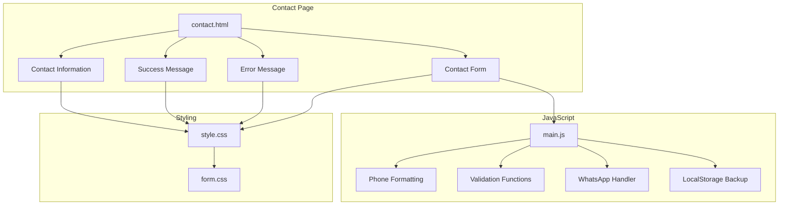

**Diagram sources**
- [contact.html:141-217](file://contact.html#L141-L217)
- [main.js:79-107](file://js/main.js#L79-L107)
- [main.js:276-288](file://js/main.js#L276-L288)
- [main.js:177-197](file://js/main.js#L177-L197)
- [main.js:139-146](file://js/main.js#L139-L146)

**Section sources**
- [contact.html:141-217](file://contact.html#L141-L217)
- [main.js:79-107](file://js/main.js#L79-L107)
- [style.css:968-1091](file://css/style.css#L968-L1091)

## Core Components
The contact management system consists of several interconnected components:

### Contact Form Implementation
The contact form in contact.html includes:
- Hidden Web3Forms API fields for secure submission
- Required field validation for name, email, and phone
- Professional styling with responsive layout
- Success and error message containers
- Redirect configuration to confirmed.html

### Phone Number Formatting
The system implements automatic Brazilian phone number formatting with:
- Real-time digit filtering and formatting
- Support for both 8-digit and 9-digit mobile numbers
- Proper DDD (area code) handling
- Input event listeners for dynamic formatting

### Validation System
Client-side validation includes:
- Email format validation using regex patterns
- Required field enforcement
- Custom validity messages
- Visual feedback through input styling

### WhatsApp Integration
Dual integration approach:
- Web3Forms API for backend processing
- WhatsApp URL generation for instant messaging
- Pre-formatted message templates
- Floating button accessibility

**Section sources**
- [contact.html:141-217](file://contact.html#L141-L217)
- [main.js:79-107](file://js/main.js#L79-L107)
- [main.js:276-288](file://js/main.js#L276-L288)
- [main.js:177-197](file://js/main.js#L177-L197)

## Architecture Overview
The contact management system follows a hybrid architecture combining client-side processing with external APIs:

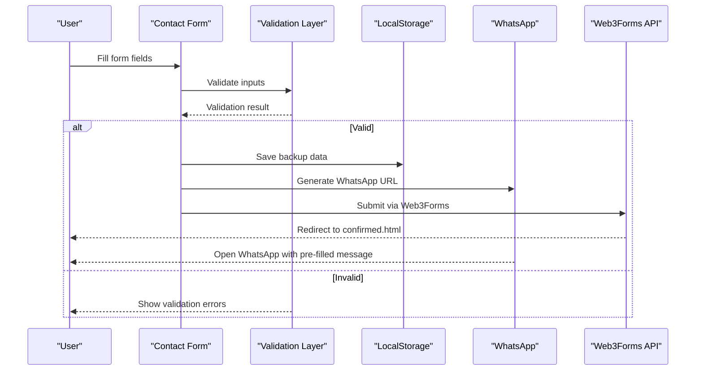

**Diagram sources**
- [contact.html:141-217](file://contact.html#L141-L217)
- [main.js:139-146](file://js/main.js#L139-L146)
- [main.js:177-197](file://js/main.js#L177-L197)

## Detailed Component Analysis

### Phone Number Formatting Component
The phone number formatting system provides seamless Brazilian phone number input:

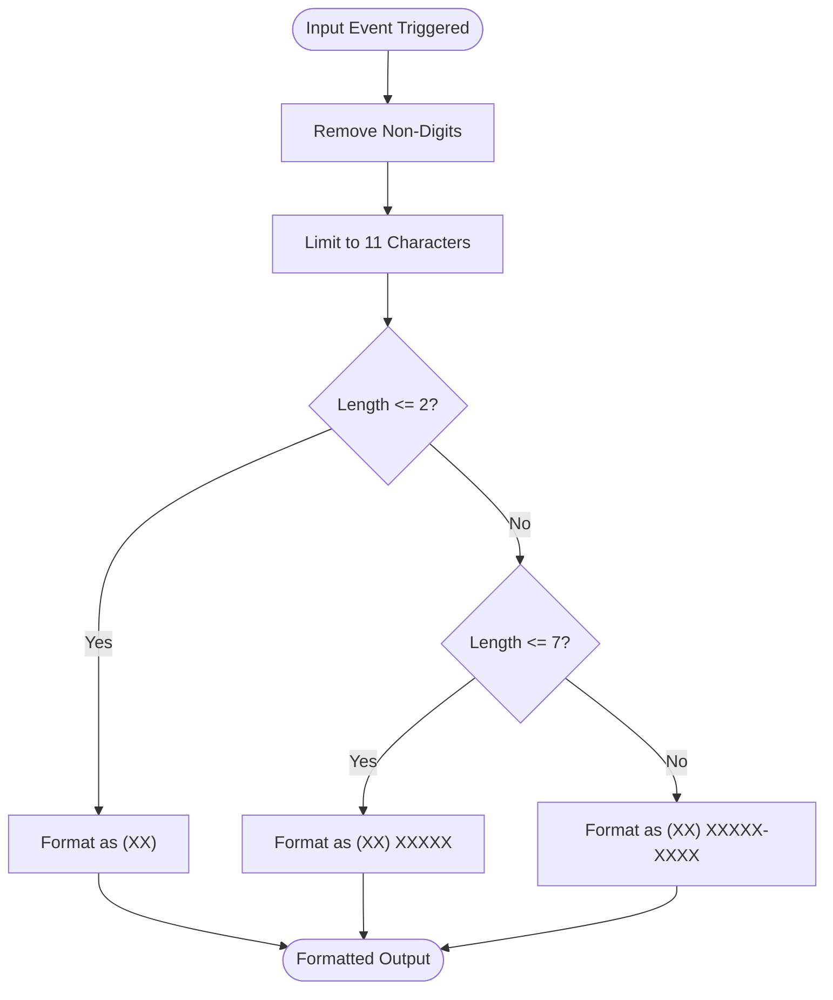

**Diagram sources**
- [main.js:79-99](file://js/main.js#L79-L99)

Implementation details:
- Event-driven formatting using input listeners
- Dynamic formatting based on character count
- Support for both landline and mobile numbers
- Automatic cursor positioning preservation

**Section sources**
- [main.js:79-107](file://js/main.js#L79-L107)

### Form Validation System
The validation system implements comprehensive field checking:

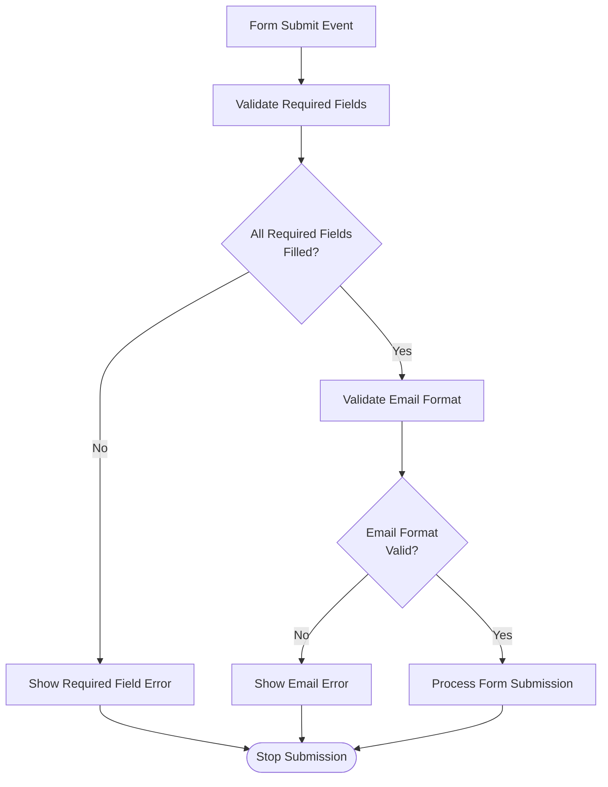

**Diagram sources**
- [main.js:132-137](file://js/main.js#L132-L137)
- [main.js:276-288](file://js/main.js#L276-L288)

Validation features:
- Required field enforcement for essential information
- Email format validation using regex patterns
- Custom validity messages for user guidance
- Visual feedback through input styling changes

**Section sources**
- [main.js:276-288](file://js/main.js#L276-L288)

### WhatsApp Integration Component
The WhatsApp integration provides dual communication channels:

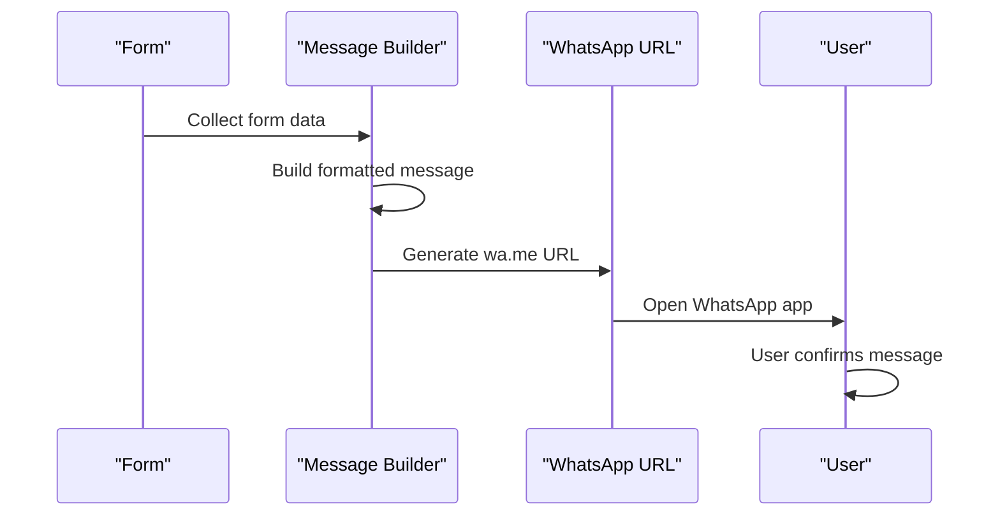

**Diagram sources**
- [main.js:177-197](file://js/main.js#L177-L197)
- [contact.html:283-286](file://contact.html#L283-L286)

Message template structure:
- Professional greeting and subject line
- Personal information fields
- Professional context details
- Timestamp for record keeping
- Line break formatting for readability

**Section sources**
- [main.js:177-197](file://js/main.js#L177-L197)
- [contact.html:81-84](file://contact.html#L81-L84)

### Web3Forms API Integration
The system integrates with Web3Forms for backend processing:

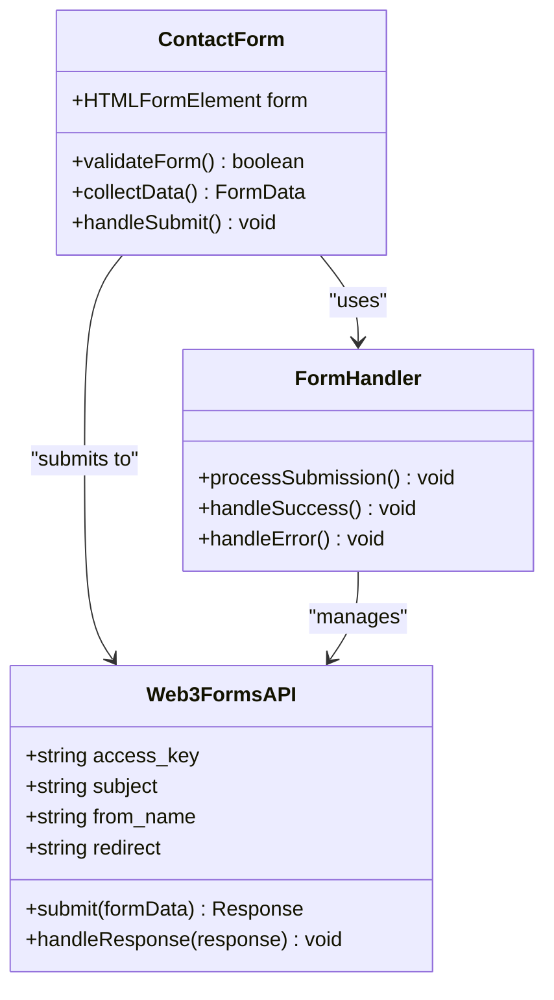

**Diagram sources**
- [contact.html:141-148](file://contact.html#L141-L148)

API configuration includes:
- Secure access key for authentication
- Custom subject line for email notifications
- Professional sender identification
- Automatic redirect to success page

**Section sources**
- [contact.html:141-148](file://contact.html#L141-L148)

### LocalStorage Backup System
The backup system ensures data persistence:

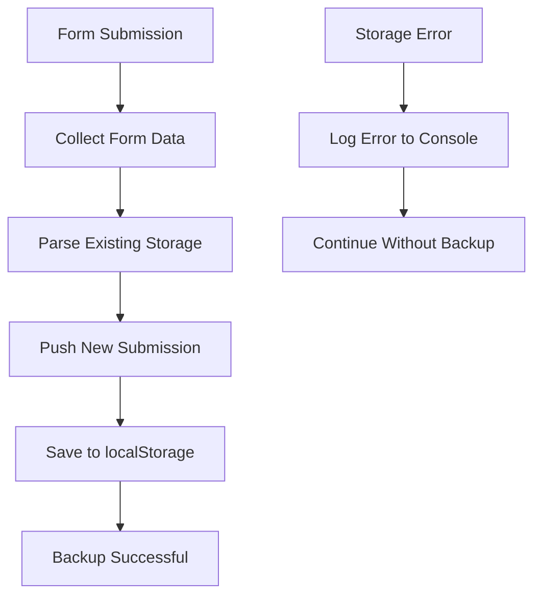

**Diagram sources**
- [main.js:139-146](file://js/main.js#L139-L146)

Backup features:
- JSON serialization for data storage
- Error handling for storage failures
- Persistent data across browser sessions
- Automatic timestamp inclusion

**Section sources**
- [main.js:139-146](file://js/main.js#L139-L146)

### Floating WhatsApp Button
The floating button provides continuous accessibility:

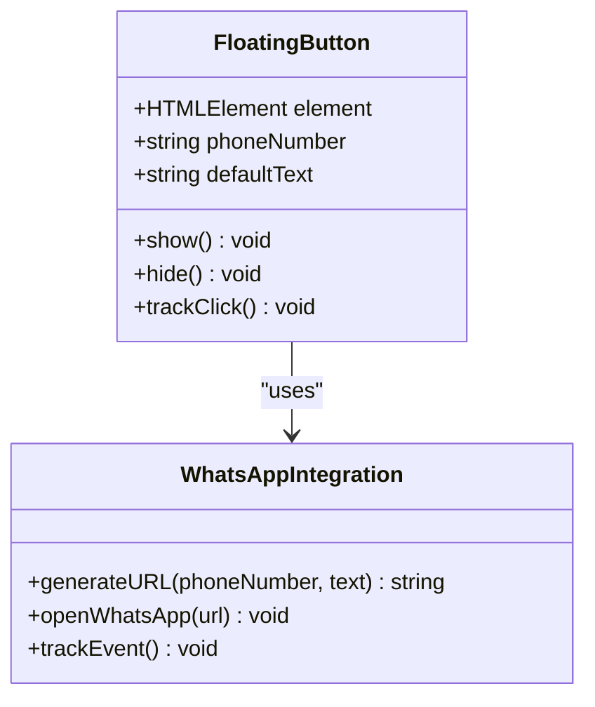

**Diagram sources**
- [contact.html:283-286](file://contact.html#L283-L286)
- [main.js:265-271](file://js/main.js#L265-L271)

Button characteristics:
- Always visible position fixed to screen
- Pulse animation for visibility
- Large touch targets for mobile users
- Consistent styling with brand colors

**Section sources**
- [contact.html:283-286](file://contact.html#L283-L286)
- [style.css:1198-1234](file://css/style.css#L1198-L1234)

### Breadcrumb Navigation
The breadcrumb system provides clear navigation context:

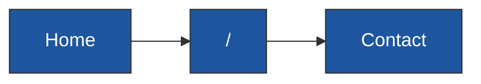

**Diagram sources**
- [contact.html:48-52](file://contact.html#L48-L52)

Breadcrumb features:
- Clear hierarchical navigation
- Consistent styling with primary color
- Hover effects for interactivity
- Semantic HTML structure

**Section sources**
- [contact.html:48-52](file://contact.html#L48-L52)

### Contact Information Display
The contact information section presents multiple communication options:

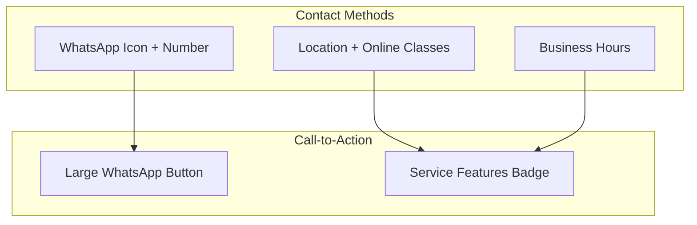

**Diagram sources**
- [contact.html:73-132](file://contact.html#L73-L132)

Information presentation:
- Icon-based visual communication
- Clear service differentiation badges
- Responsive grid layout
- Consistent spacing and typography

**Section sources**
- [contact.html:73-132](file://contact.html#L73-L132)

## Dependency Analysis
The contact management system has minimal external dependencies:

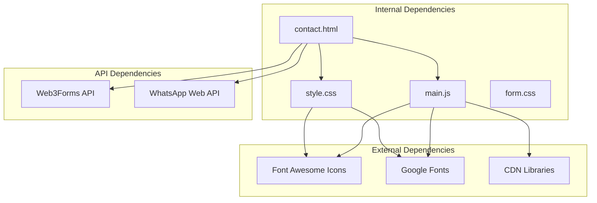

**Diagram sources**
- [contact.html:17-18](file://contact.html#L17-L18)
- [contact.html:141-148](file://contact.html#L141-L148)

Dependency management:
- CDN-hosted libraries for performance
- Font Awesome for consistent icons
- Google Fonts for typography
- Minimal JavaScript dependencies

**Section sources**
- [contact.html:17-18](file://contact.html#L17-L18)
- [contact.html:141-148](file://contact.html#L141-L148)

## Performance Considerations
The contact management system is optimized for performance:

### Client-Side Optimization
- Event delegation for efficient input handling
- Debounced validation to prevent excessive processing
- CSS animations for smooth transitions
- Minimal DOM manipulation operations

### Network Efficiency
- Single API call per submission
- Optimized image assets
- Compressed CSS and JavaScript
- Efficient form serialization

### Mobile Performance
- Touch-friendly button sizing
- Optimized viewport configuration
- Reduced JavaScript payload for mobile
- Fast-loading icon fonts

## Troubleshooting Guide

### Form Submission Failures
Common issues and solutions:

**Problem**: Form doesn't submit via Web3Forms
- Verify access_key is valid and configured correctly
- Check network connectivity and CORS policies
- Ensure form fields match API requirements
- Review browser console for JavaScript errors

**Problem**: Phone number formatting not working
- Confirm input event listeners are attached
- Check for conflicting JavaScript libraries
- Verify input type is set to "tel"
- Test in different browsers for compatibility

**Problem**: WhatsApp integration not opening
- Ensure wa.me URL is properly formatted
- Check if WhatsApp app is installed on device
- Verify phone number format includes country code
- Test with different devices and browsers

### Validation Errors
Common validation issues:

**Problem**: Email validation failing incorrectly
- Verify regex pattern matches required format
- Check for trailing spaces in input fields
- Ensure validation triggers on blur events
- Test with various email formats

**Problem**: Required field validation not working
- Confirm HTML5 required attributes are present
- Check CSS styling that might hide validation messages
- Verify JavaScript event handlers are functioning
- Test in incognito mode to eliminate cache issues

### Integration Troubleshooting
**Problem**: LocalStorage backup not working
- Check browser privacy settings and storage limits
- Verify JSON parsing and stringify operations
- Test with different browsers and devices
- Monitor for quota exceeded errors

**Problem**: Floating button not appearing
- Verify CSS positioning and z-index values
- Check for CSS conflicts with other styles
- Test in different viewport sizes
- Ensure JavaScript initialization completes

**Section sources**
- [main.js:325-331](file://js/main.js#L325-L331)
- [main.js:139-146](file://js/main.js#L139-L146)

## Conclusion
The contact management system provides a robust, user-friendly solution for lead capture and communication. Its hybrid architecture combining Web3Forms API integration with WhatsApp connectivity ensures reliable data processing while maintaining immediate customer engagement. The system's emphasis on Brazilian phone number formatting, comprehensive validation, and persistent backup functionality creates a professional and trustworthy user experience.

Key strengths include:
- Seamless multi-channel communication integration
- Professional Brazilian market compliance
- Comprehensive error handling and user feedback
- Performance-optimized client-side processing
- Mobile-responsive design and accessibility

The system serves as an excellent foundation for educational service providers seeking to streamline their contact process while maintaining professional standards and user convenience.