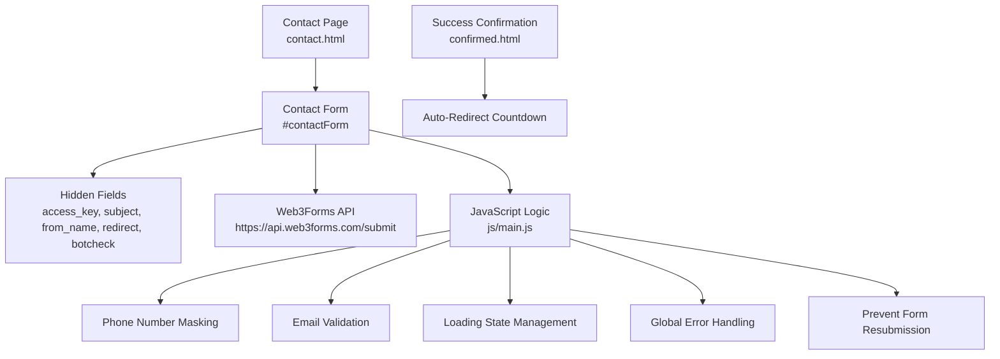
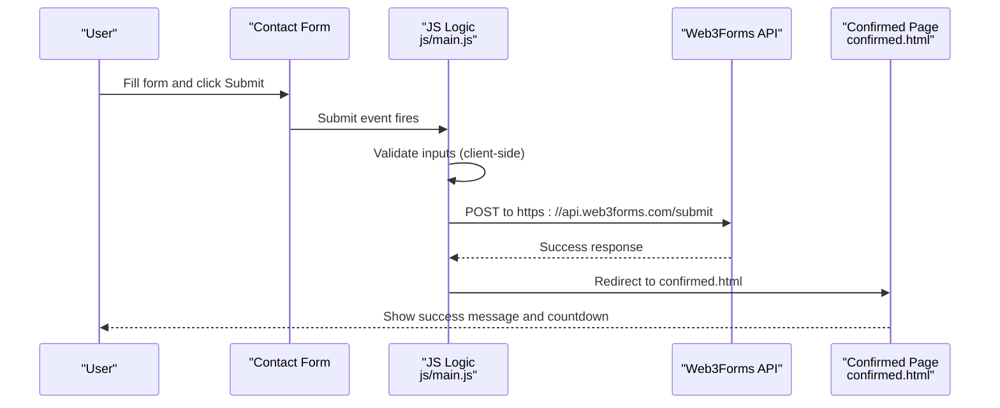
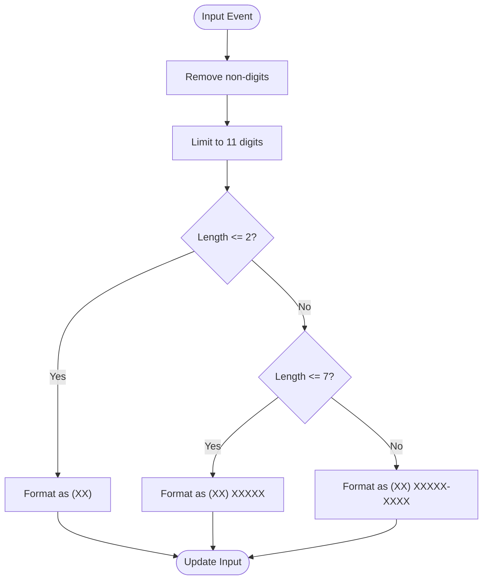
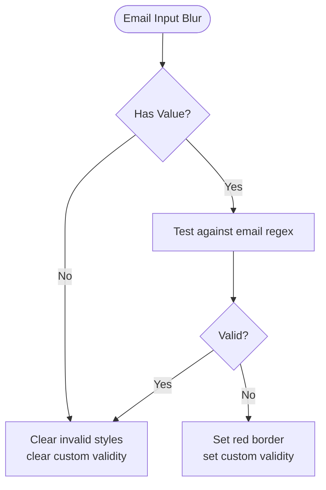
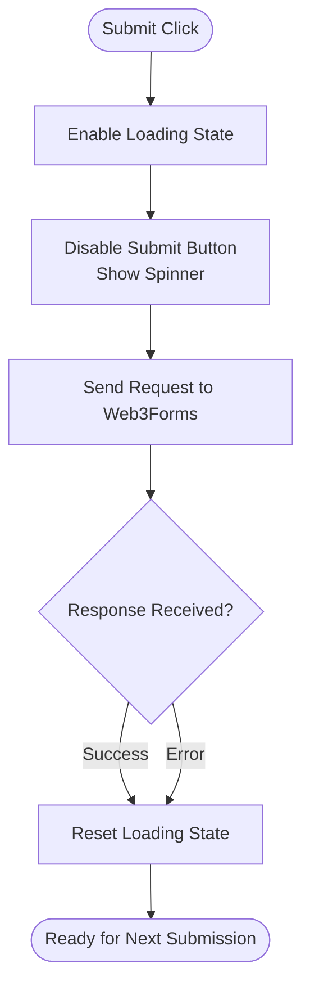
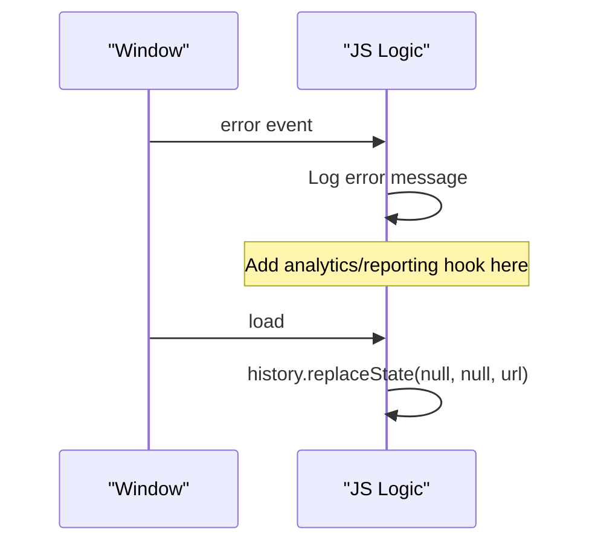
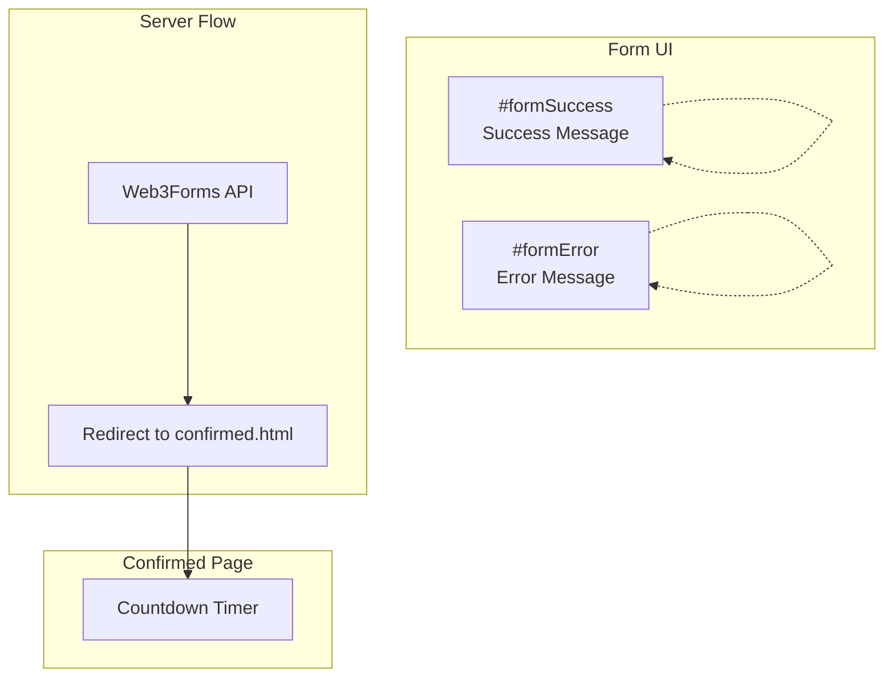
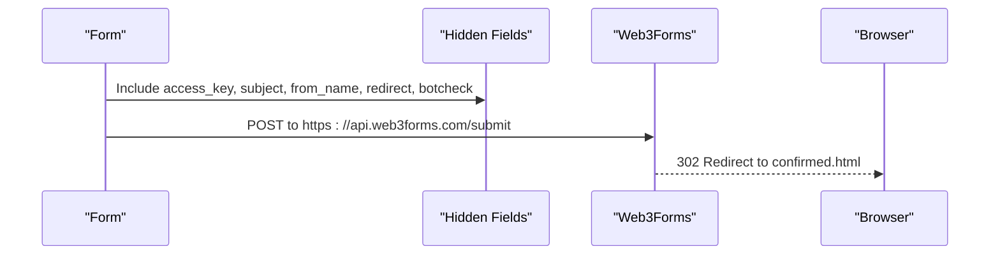
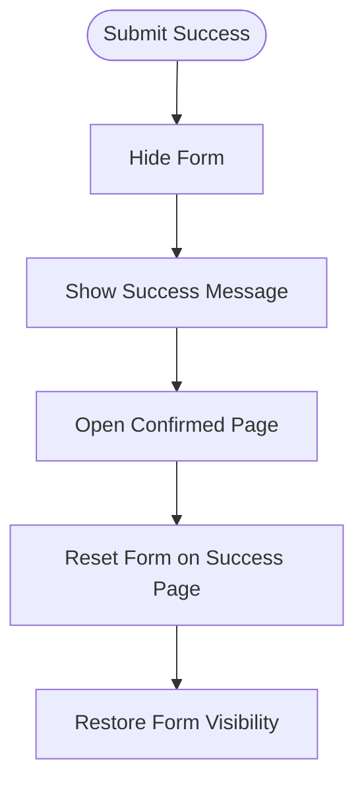
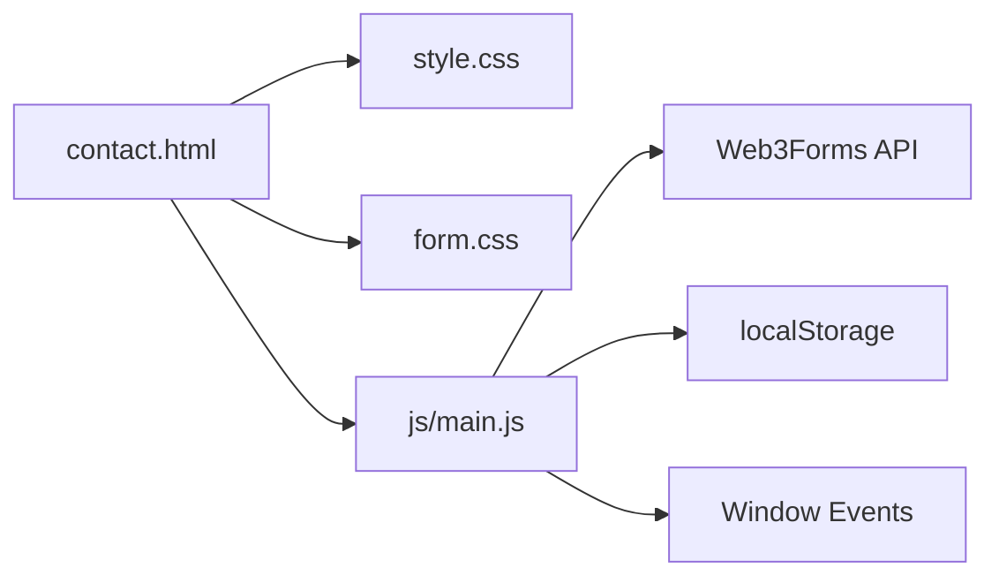

# Form Validation and Processing

<cite>
**Referenced Files in This Document**
- [main.js](file://js/main.js)
- [contact.html](file://contact.html)
- [confirmed.html](file://confirmed.html)
- [form.css](file://assets/css/form.css)
- [style.css](file://css/style.css)
</cite>

## Table of Contents
1. [Introduction](#introduction)
2. [Project Structure](#project-structure)
3. [Core Components](#core-components)
4. [Architecture Overview](#architecture-overview)
5. [Detailed Component Analysis](#detailed-component-analysis)
6. [Dependency Analysis](#dependency-analysis)
7. [Performance Considerations](#performance-considerations)
8. [Troubleshooting Guide](#troubleshooting-guide)
9. [Conclusion](#conclusion)

## Introduction
This document explains the form validation and processing logic implemented for the contact form. It focuses on:
- Phone number formatting for Brazilian mobile numbers
- Input sanitization and validation
- Error handling mechanisms
- localStorage backup for form persistence
- Validation error messages and user feedback systems
- Integration with Web3Forms API
- Form reset procedures and success/error state management
- Common validation scenarios, error prevention strategies, and user experience enhancements

## Project Structure
The contact form is implemented in a single-page application with a dedicated contact page and a success confirmation page. JavaScript logic resides in a central script file and is attached to the contact page.

**Diagram sources**
- [contact.html:141-204](file://contact.html#L141-L204)
- [main.js:79-107](file://js/main.js#L79-L107)
- [main.js:277-288](file://js/main.js#L277-L288)
- [main.js:293-304](file://js/main.js#L293-L304)
- [main.js:328-331](file://js/main.js#L328-L331)
- [main.js:336-338](file://js/main.js#L336-L338)
- [confirmed.html:105-117](file://confirmed.html#L105-L117)

**Section sources**
- [contact.html:141-204](file://contact.html#L141-L204)
- [main.js:79-107](file://js/main.js#L79-L107)
- [main.js:277-288](file://js/main.js#L277-L288)
- [main.js:293-304](file://js/main.js#L293-L304)
- [main.js:328-331](file://js/main.js#L328-L331)
- [main.js:336-338](file://js/main.js#L336-L338)
- [confirmed.html:105-117](file://confirmed.html#L105-L117)

## Core Components
- Phone number masking for Brazilian mobile numbers
- Email validation with real-time feedback
- Loading state toggling for form submission
- Global error handling and prevention of form resubmission
- Success and error user feedback elements
- Integration with Web3Forms API for server-side processing

Key implementation references:
- Phone masking: [formatPhoneNumber:79-99](file://js/main.js#L79-L99), [phone event listeners:102-107](file://js/main.js#L102-L107)
- Email validation: [email blur handler:277-288](file://js/main.js#L277-L288)
- Loading state: [setFormLoading:293-304](file://js/main.js#L293-L304)
- Global error handling: [window error listener:328-331](file://js/main.js#L328-L331)
- Prevent resubmission: [history.replaceState:336-338](file://js/main.js#L336-L338)
- Success/error UI: [formSuccess:206-211](file://contact.html#L206-L211), [formError:212-217](file://contact.html#L212-L217)
- Web3Forms integration: [form action and hidden fields:141-148](file://contact.html#L141-L148)

**Section sources**
- [main.js:79-107](file://js/main.js#L79-L107)
- [main.js:277-288](file://js/main.js#L277-L288)
- [main.js:293-304](file://js/main.js#L293-L304)
- [main.js:328-331](file://js/main.js#L328-L331)
- [main.js:336-338](file://js/main.js#L336-L338)
- [contact.html:206-217](file://contact.html#L206-L217)
- [contact.html:141-148](file://contact.html#L141-L148)

## Architecture Overview
The form uses a hybrid client-side and server-side processing model:
- Client-side: phone masking, email validation, loading state, global error handling, and UI feedback
- Server-side: Web3Forms handles email delivery and redirects to a success page

**Diagram sources**
- [contact.html:141-204](file://contact.html#L141-L204)
- [main.js:293-304](file://js/main.js#L293-L304)
- [confirmed.html:105-117](file://confirmed.html#L105-L117)

## Detailed Component Analysis

### Phone Number Masking for Brazilian Mobile Numbers
The phone masking logic ensures consistent formatting for Brazilian mobile numbers:
- Removes non-digit characters
- Limits input to 11 digits
- Formats as (XX) XXXXX-XXXX or (XX) XXXX-XXXX depending on length

**Diagram sources**
- [main.js:79-99](file://js/main.js#L79-L99)

Implementation highlights:
- Applies to all inputs with type tel
- Listens to input events to format on-the-fly
- Uses substring slicing to segment DDD, prefix, and suffix

**Section sources**
- [main.js:79-107](file://js/main.js#L79-L107)

### Email Validation and Input Sanitization
Real-time email validation provides immediate feedback:
- Validates email format on blur
- Sets custom validity message when invalid
- Updates visual styling to indicate invalid state

**Diagram sources**
- [main.js:277-288](file://js/main.js#L277-L288)

Notes:
- Uses HTML5 required attributes for mandatory fields
- Custom validity messages are shown by the browser’s constraint validation UI
- Visual feedback is achieved via inline styles

**Section sources**
- [main.js:277-288](file://js/main.js#L277-L288)
- [contact.html:150-170](file://contact.html#L150-L170)

### Loading State Management During Submission
The loading state prevents double-clicks and communicates progress:
- Disables submit button
- Replaces button content with spinner and “Sending…” text
- Resets button state after submission completes

**Diagram sources**
- [main.js:293-304](file://js/main.js#L293-L304)
- [contact.html:194-203](file://contact.html#L194-L203)

**Section sources**
- [main.js:293-304](file://js/main.js#L293-L304)

### Global Error Handling and Prevention of Form Resubmission
Robust error handling and UX safeguards:
- Global window error listener logs uncaught errors
- History replace state prevents resubmission on refresh/reload

**Diagram sources**
- [main.js:328-331](file://js/main.js#L328-L331)
- [main.js:336-338](file://js/main.js#L336-L338)

**Section sources**
- [main.js:328-331](file://js/main.js#L328-L331)
- [main.js:336-338](file://js/main.js#L336-L338)

### Success and Error Feedback Systems
The form provides clear success and error feedback:
- Success message appears after successful submission
- Error message appears on submission failure
- Confirmed page shows a success card and auto-redirect countdown

**Diagram sources**
- [contact.html:206-217](file://contact.html#L206-L217)
- [contact.html:141-148](file://contact.html#L141-L148)
- [confirmed.html:105-117](file://confirmed.html#L105-L117)

**Section sources**
- [contact.html:206-217](file://contact.html#L206-L217)
- [contact.html:141-148](file://contact.html#L141-L148)
- [confirmed.html:105-117](file://confirmed.html#L105-L117)

### Integration with Web3Forms API
The form integrates with Web3Forms for server-side processing:
- Hidden fields configure access key, subject, sender name, redirect, and bot protection
- Form action targets the Web3Forms endpoint
- On success, the user is redirected to a confirmation page

**Diagram sources**
- [contact.html:141-148](file://contact.html#L141-L148)

**Section sources**
- [contact.html:141-148](file://contact.html#L141-L148)

### Form Reset Procedures and State Management
- After successful submission, the form resets and UI returns to default state
- Success message is hidden and the form becomes visible again
- The success page auto-redirects after a countdown

**Diagram sources**
- [contact.html:206-211](file://contact.html#L206-L211)
- [confirmed.html:105-117](file://confirmed.html#L105-L117)

**Section sources**
- [contact.html:206-211](file://contact.html#L206-L211)
- [confirmed.html:105-117](file://confirmed.html#L105-L117)

## Dependency Analysis
The contact form relies on:
- HTML structure and hidden fields for Web3Forms integration
- CSS for styling and layout
- JavaScript for client-side validation, masking, and UI feedback

**Diagram sources**
- [contact.html:141-204](file://contact.html#L141-L204)
- [style.css:1-120](file://css/style.css#L1-L120)
- [form.css:1-73](file://assets/css/form.css#L1-L73)
- [main.js:79-107](file://js/main.js#L79-L107)
- [main.js:277-288](file://js/main.js#L277-L288)
- [main.js:293-304](file://js/main.js#L293-L304)

**Section sources**
- [contact.html:141-204](file://contact.html#L141-L204)
- [style.css:1-120](file://css/style.css#L1-L120)
- [form.css:1-73](file://assets/css/form.css#L1-L73)
- [main.js:79-107](file://js/main.js#L79-L107)
- [main.js:277-288](file://js/main.js#L277-L288)
- [main.js:293-304](file://js/main.js#L293-L304)

## Performance Considerations
- Phone masking uses efficient string operations and minimal DOM updates
- Email validation runs on blur to avoid unnecessary checks during typing
- Loading state prevents redundant submissions and improves perceived performance
- Global error logging helps identify and resolve issues quickly

## Troubleshooting Guide
Common issues and resolutions:
- Phone number not formatting correctly
  - Ensure input type is tel and the masking logic is attached
  - Verify that the input event listener is active
  - References: [phone masking:79-107](file://js/main.js#L79-L107)
- Email validation not triggering
  - Confirm the blur event handler is attached to the email input
  - Check that the custom validity message is set appropriately
  - References: [email validation:277-288](file://js/main.js#L277-L288)
- Form submits but no success feedback
  - Verify Web3Forms configuration and redirect field
  - Confirm the success message element exists and is visible
  - References: [Web3Forms fields:141-148](file://contact.html#L141-L148), [success message:206-211](file://contact.html#L206-L211)
- Auto-redirect not working on success page
  - Check the countdown timer logic and interval handling
  - References: [confirmed page countdown:105-117](file://confirmed.html#L105-L117)
- Form resubmission on refresh
  - Ensure history.replaceState is executed on load
  - References: [prevent resubmit:336-338](file://js/main.js#L336-L338)

**Section sources**
- [js/main.js:79-107](file://js/main.js#L79-L107)
- [js/main.js:277-288](file://js/main.js#L277-L288)
- [contact.html:141-148](file://contact.html#L141-L148)
- [contact.html:206-211](file://contact.html#L206-L211)
- [confirmed.html:105-117](file://confirmed.html#L105-L117)
- [js/main.js:336-338](file://js/main.js#L336-L338)

## Conclusion
The form validation and processing system combines robust client-side logic with reliable server-side processing via Web3Forms. It provides:
- Real-time phone number formatting for Brazilian mobile numbers
- Immediate email validation feedback
- Clear success and error messaging
- Protection against resubmission and global error handling
- A seamless user experience with loading states and auto-redirects

This architecture balances usability, reliability, and maintainability while keeping the implementation straightforward and extensible.