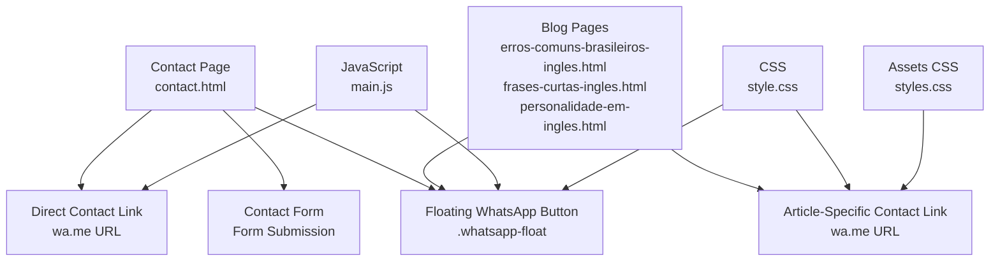
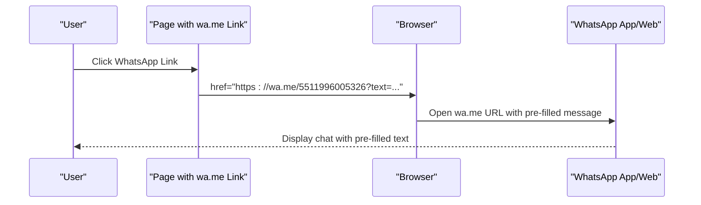
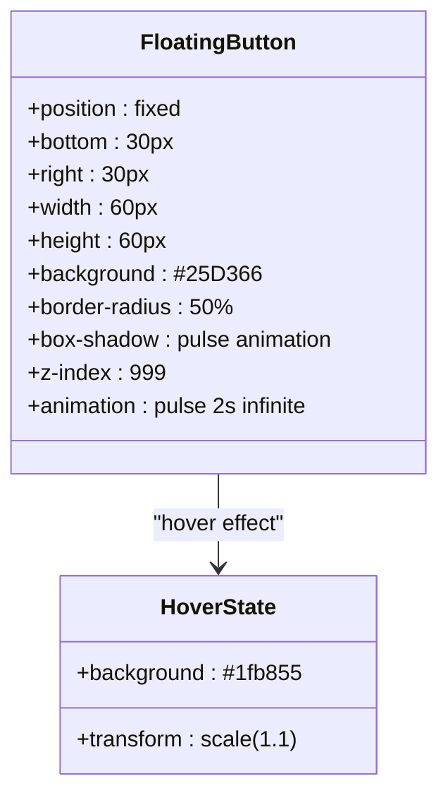
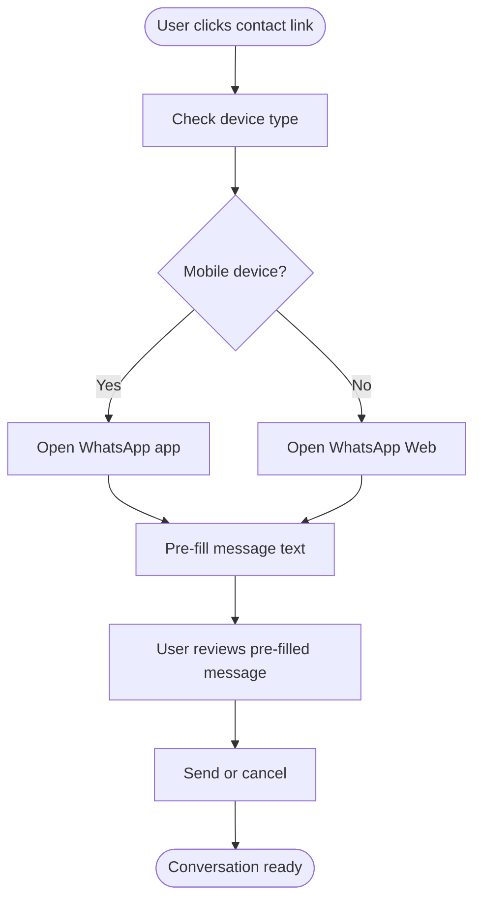
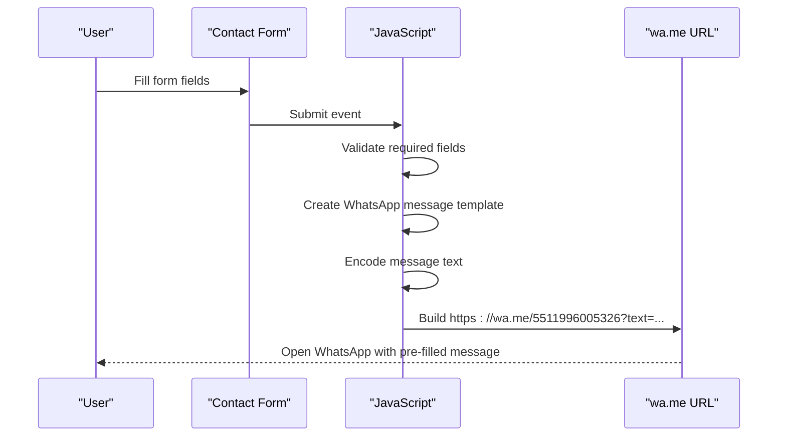
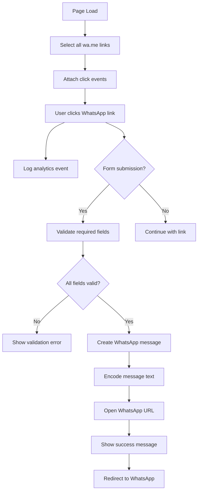
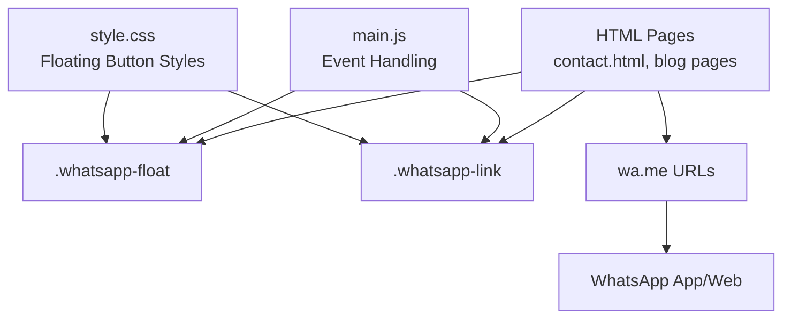

# WhatsApp Integration

<cite>
**Referenced Files in This Document**
- [contact.html](file://contact.html)
- [main.js](file://js/main.js)
- [style.css](file://css/style.css)
- [styles.css](file://assets/css/styles.css)
- [README.md](file://README.md)
- [erros-comuns-brasileiros-ingles.html](file://blog/erros-comuns-brasileiros-ingles.html)
- [frases-curtas-ingles.html](file://blog/frases-curtas-ingles.html)
- [personalidade-em-ingles.html](file://blog/personalidade-em-ingles.html)
</cite>

## Table of Contents
1. [Introduction](#introduction)
2. [Project Structure](#project-structure)
3. [Core Components](#core-components)
4. [Architecture Overview](#architecture-overview)
5. [Detailed Component Analysis](#detailed-component-analysis)
6. [Dependency Analysis](#dependency-analysis)
7. [Performance Considerations](#performance-considerations)
8. [Troubleshooting Guide](#troubleshooting-guide)
9. [Conclusion](#conclusion)

## Introduction
This document explains the WhatsApp integration system implemented across the website. It covers the floating WhatsApp button, direct contact links using wa.me URLs with pre-filled messages, URL encoding for Brazilian phone numbers, message templates, and integration parameters. It also documents JavaScript event handling, target window configurations, user experience considerations, and troubleshooting common issues with WhatsApp links and mobile device compatibility.

## Project Structure
The WhatsApp integration spans multiple pages and assets:
- Contact page with floating button, hero CTA, contact methods, and FAQ integration
- Blog post pages with floating buttons and article-specific contact links
- Shared JavaScript for event handling and analytics logging
- CSS for floating button styling and responsive behavior

**Diagram sources**
- [contact.html:81-84](file://contact.html#L81-L84)
- [contact.html:112-116](file://contact.html#L112-L116)
- [contact.html:282-286](file://contact.html#L282-L286)
- [erros-comuns-brasileiros-ingles.html:339-342](file://blog/erros-comuns-brasileiros-ingles.html#L339-L342)
- [erros-comuns-brasileiros-ingles.html:399-402](file://blog/erros-comuns-brasileiros-ingles.html#L399-L402)
- [main.js:265-271](file://js/main.js#L265-L271)
- [style.css:1198-1234](file://css/style.css#L1198-L1234)
- [styles.css:321-337](file://assets/css/styles.css#L321-L337)

**Section sources**
- [contact.html:1-291](file://contact.html#L1-L291)
- [main.js:1-338](file://js/main.js#L1-L338)
- [style.css:1195-1394](file://css/style.css#L1195-L1394)
- [styles.css:320-339](file://assets/css/styles.css#L320-L339)

## Core Components
- Floating WhatsApp Button: Fixed-position button on all pages, styled with green WhatsApp brand color and pulsing animation
- Direct Contact Links: wa.me URLs embedded in contact methods, hero section, footer, and blog articles
- Message Templates: Pre-formatted messages for form submissions and article-specific links
- JavaScript Event Handling: Analytics logging and form-to-WhatsApp redirection flow
- URL Encoding: Properly encoded text parameters for Brazilian phone numbers and messages

Key implementation locations:
- Floating button definition and styling
- Direct contact links with pre-filled messages
- Form submission handler and message creation
- CSS animations and responsive behavior

**Section sources**
- [contact.html:81-84](file://contact.html#L81-L84)
- [contact.html:112-116](file://contact.html#L112-L116)
- [contact.html:282-286](file://contact.html#L282-L286)
- [main.js:148-171](file://js/main.js#L148-L171)
- [main.js:177-197](file://js/main.js#L177-L197)
- [main.js:265-271](file://js/main.js#L265-L271)
- [style.css:1198-1234](file://css/style.css#L1198-L1234)

## Architecture Overview
The WhatsApp integration follows a consistent pattern across pages:
- Static HTML defines wa.me URLs with encoded text parameters
- CSS provides visual styling and responsive behavior for floating buttons
- JavaScript handles analytics logging and form submission flow
- Message templates are constructed client-side for form submissions

**Diagram sources**
- [contact.html:81-84](file://contact.html#L81-L84)
- [contact.html:112-116](file://contact.html#L112-L116)
- [contact.html:282-286](file://contact.html#L282-L286)

## Detailed Component Analysis

### Floating WhatsApp Button Implementation
The floating button is consistently implemented across all pages with identical structure and styling.

**Diagram sources**
- [contact.html:282-286](file://contact.html#L282-L286)
- [style.css:1198-1234](file://css/style.css#L1198-L1234)

Implementation details:
- Fixed positioning ensures visibility on all screen sizes
- Green brand color (#25D366) matches WhatsApp branding
- Pulse animation draws attention without being intrusive
- Hover scaling improves discoverability
- Responsive adjustments for mobile screens

**Section sources**
- [contact.html:282-286](file://contact.html#L282-L286)
- [style.css:1198-1234](file://css/style.css#L1198-L1234)
- [style.css:1303-1309](file://css/style.css#L1303-L1309)

### Direct Contact Links Using wa.me URLs
Multiple contact methods use wa.me URLs with pre-filled messages:

**Diagram sources**
- [contact.html:81-84](file://contact.html#L81-L84)
- [contact.html:112-116](file://contact.html#L112-L116)
- [contact.html:271-273](file://contact.html#L271-L273)

Contact link variations:
- Hero section CTA with WhatsApp icon and button styling
- Contact methods with formatted phone numbers
- Footer contact information with direct link
- Blog article-specific links with context-aware messages

**Section sources**
- [contact.html:73-116](file://contact.html#L73-L116)
- [contact.html:270-274](file://contact.html#L270-L274)
- [erros-comuns-brasileiros-ingles.html:339-342](file://blog/erros-comuns-brasileiros-ingles.html#L339-L342)
- [frases-curtas-ingles.html:555-558](file://blog/frases-curtas-ingles.html#L555-L558)
- [personalidade-em-ingles.html:412-415](file://blog/personalidade-em-ingles.html#L412-L415)

### Message Templates and URL Encoding
Message templates are constructed client-side for form submissions and use proper URL encoding:

**Diagram sources**
- [main.js:148-171](file://js/main.js#L148-L171)
- [main.js:177-197](file://js/main.js#L177-L197)

Template structure includes:
- Header with bold formatting
- Field-by-field information collection
- Optional availability preference
- Timestamp footer
- Proper line breaks and emphasis formatting

**Section sources**
- [main.js:148-171](file://js/main.js#L148-L171)
- [main.js:177-197](file://js/main.js#L177-L197)
- [README.md:277-293](file://README.md#L277-L293)

### JavaScript Event Handling
The JavaScript implementation includes analytics logging and form submission handling:

**Diagram sources**
- [main.js:265-271](file://js/main.js#L265-L271)
- [main.js:148-171](file://js/main.js#L148-L171)

Event handling features:
- Analytics logging for all WhatsApp button clicks
- Form validation and localStorage backup
- Success message display and automatic redirection
- Error handling and form reset functionality

**Section sources**
- [main.js:265-271](file://js/main.js#L265-L271)
- [main.js:148-171](file://js/main.js#L148-L171)
- [main.js:276-288](file://js/main.js#L276-L288)

### Target Window Configurations
All WhatsApp links use target="_blank" to open in new tabs/windows, ensuring users can return to the website after initiating contact.

**Section sources**
- [contact.html:82-84](file://contact.html#L82-L84)
- [contact.html:114-116](file://contact.html#L114-L116)
- [contact.html:284-286](file://contact.html#L284-L286)
- [erros-comuns-brasileiros-ingles.html:340-342](file://blog/erros-comuns-brasileiros-ingles.html#L340-L342)
- [frases-curtas-ingles.html:556-558](file://blog/frases-curtas-ingles.html#L556-L558)
- [personalidade-em-ingles.html:413-415](file://blog/personalidade-em-ingles.html#L413-L415)

### User Experience Considerations
The integration prioritizes user experience through:
- Consistent floating button placement across all pages
- Responsive design with mobile-specific adjustments
- Visual feedback through hover effects and animations
- Clear call-to-action buttons with WhatsApp branding
- Context-aware messages in blog articles
- Immediate pre-filling of WhatsApp messages

**Section sources**
- [style.css:1198-1234](file://css/style.css#L1198-L1234)
- [style.css:1303-1309](file://css/style.css#L1303-L1309)
- [styles.css:321-337](file://assets/css/styles.css#L321-L337)

## Dependency Analysis
The WhatsApp integration relies on minimal dependencies:

**Diagram sources**
- [style.css:1198-1234](file://css/style.css#L1198-L1234)
- [styles.css:321-337](file://assets/css/styles.css#L321-L337)
- [main.js:265-271](file://js/main.js#L265-L271)
- [contact.html:282-286](file://contact.html#L282-L286)

Dependencies:
- CSS for visual styling and animations
- JavaScript for event handling and analytics
- HTML for link definitions and page structure
- External WhatsApp service for message delivery

**Section sources**
- [style.css:1195-1394](file://css/style.css#L1195-L1394)
- [styles.css:320-339](file://assets/css/styles.css#L320-L339)
- [main.js:265-271](file://js/main.js#L265-L271)
- [contact.html:282-286](file://contact.html#L282-L286)

## Performance Considerations
- Minimal JavaScript overhead with event delegation
- Lightweight CSS animations using hardware acceleration
- Efficient DOM selection for wa.me link targeting
- No external dependencies for WhatsApp functionality
- Optimized for mobile devices with reduced button size

## Troubleshooting Guide

### Common Issues and Solutions

**WhatsApp App Not Opening**
- Verify wa.me URL format: `https://wa.me/5511996005326?text=encoded_message`
- Ensure text parameter is properly URL-encoded
- Check that target="_blank" is present for desktop browsers
- Confirm mobile device has WhatsApp installed

**Mobile Device Compatibility**
- On iOS Safari: May require user gesture to open external apps
- On Android Chrome: Should automatically open WhatsApp app
- Some browsers may open WhatsApp Web instead of app
- Test on multiple devices and browsers

**URL Encoding Problems**
- Special characters must be percent-encoded
- Spaces become %20, newlines become %0A
- Accented characters use UTF-8 encoding
- Use encodeURIComponent() for dynamic message construction

**Button Not Visible on Mobile**
- Check CSS media queries for .whatsapp-float
- Verify z-index is sufficient for overlay elements
- Ensure button is positioned outside of viewport constraints
- Test with browser developer tools in mobile emulation mode

**Analytics Logging Issues**
- Verify JavaScript is loaded and executed
- Check browser console for errors
- Ensure event listeners are attached after DOMContentLoaded
- Confirm selector 'a[href*="wa.me"]' matches intended links

**Form Submission Flow Problems**
- Validate required fields before constructing message
- Check localStorage availability and permissions
- Verify timeout delays are appropriate for user experience
- Ensure form reset occurs after successful submission

**Section sources**
- [main.js:265-271](file://js/main.js#L265-L271)
- [main.js:148-171](file://js/main.js#L148-L171)
- [style.css:1303-1309](file://css/style.css#L1303-L1309)

## Conclusion
The WhatsApp integration system provides a comprehensive, user-friendly contact strategy across all website pages. The implementation combines static wa.me URLs with dynamic JavaScript functionality to create seamless communication experiences. The floating button design, consistent message templates, and robust error handling ensure reliable operation across devices and browsers. The system's simplicity and reliance on native WhatsApp functionality make it highly maintainable while maximizing user engagement and conversion rates.