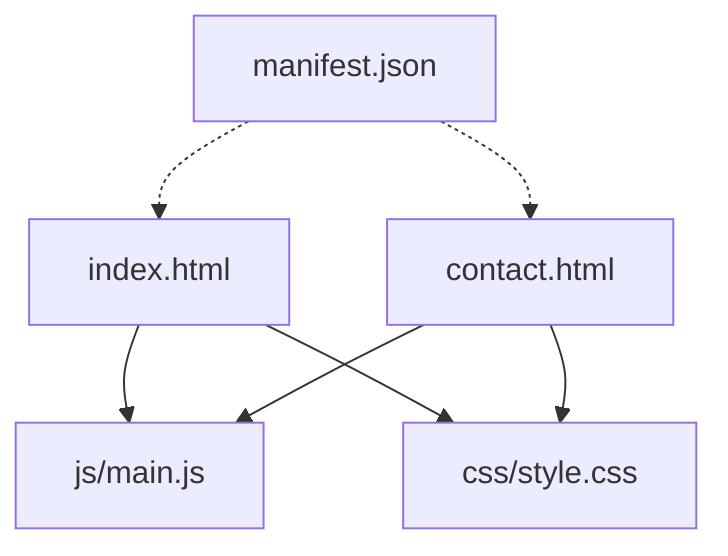
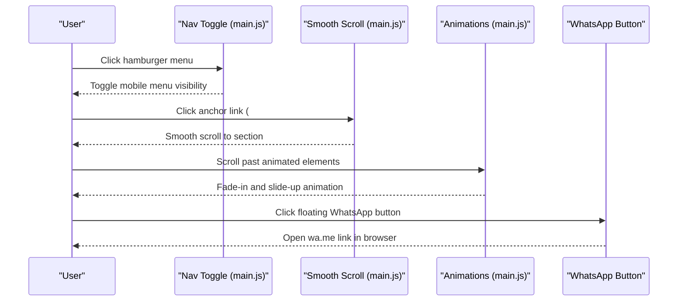
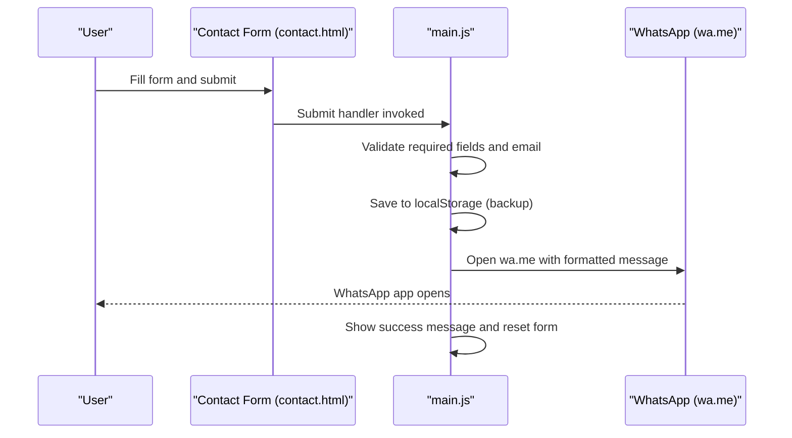
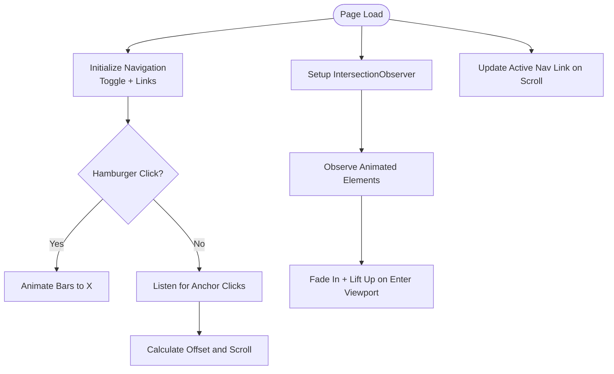
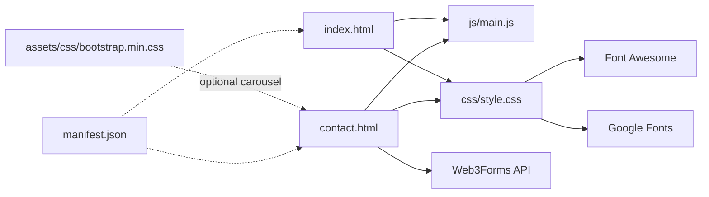

# Core Features

<cite>
**Referenced Files in This Document**
- [index.html](file://index.html)
- [contact.html](file://contact.html)
- [main.js](file://js/main.js)
- [style.css](file://css/style.css)
- [README.md](file://README.md)
- [manifest.json](file://manifest.json)
</cite>

## Table of Contents
1. [Introduction](#introduction)
2. [Project Structure](#project-structure)
3. [Core Components](#core-components)
4. [Architecture Overview](#architecture-overview)
5. [Detailed Component Analysis](#detailed-component-analysis)
6. [Dependency Analysis](#dependency-analysis)
7. [Performance Considerations](#performance-considerations)
8. [Troubleshooting Guide](#troubleshooting-guide)
9. [Conclusion](#conclusion)

## Introduction
This document explains the complete functionality of the Michael | Inglês Executivo website’s core features. It covers the hero section with its powerful value proposition, the about section highlighting teacher credentials, the services section featuring four specialized offerings, the methodology and “why choose” sections, testimonials presentation, pricing tiers, and the contact system including form validation, WhatsApp integration, and floating button behavior. It also documents responsive design, smooth scrolling navigation, mobile hamburger menu, and scroll animations, with practical examples from the codebase and customization options.

## Project Structure
The website is a single-page marketing site with a dedicated contact page. Key assets include:
- index.html: Home page with hero, about, services, testimonials, pricing, and floating WhatsApp button
- contact.html: Full contact page with form, FAQs, and contact info
- js/main.js: Navigation toggle, smooth scroll, scroll animations, phone formatting, form handling stub, and WhatsApp tracking
- css/style.css: Comprehensive styling for layout, typography, components, and responsive breakpoints
- manifest.json: PWA configuration for installability
- README.md: Feature inventory, technical details, and integration notes

**Diagram sources**
- [index.html](file://index.html)
- [contact.html](file://contact.html)
- [main.js](file://js/main.js)
- [style.css](file://css/style.css)
- [manifest.json](file://manifest.json)

**Section sources**
- [README.md](file://README.md)
- [index.html](file://index.html)
- [contact.html](file://contact.html)
- [main.js](file://js/main.js)
- [style.css](file://css/style.css)
- [manifest.json](file://manifest.json)

## Core Components
- Hero section: Value proposition, badges, CTAs, and three supporting cards
- About section: Teacher background, credentials, and highlights
- Services section: Four specialized offerings with feature lists
- Methodology section: Four-step approach (conceptual)
- Why choose section: Six differentiators (conceptual)
- Testimonials section: Four professional testimonials
- Pricing section: Three tiers with savings messaging
- Contact system: Form validation, WhatsApp integration, floating button
- Responsive design: Mobile-first grid/flex layouts, hamburger menu, animations

**Section sources**
- [index.html](file://index.html)
- [contact.html](file://contact.html)
- [main.js](file://js/main.js)
- [style.css](file://css/style.css)

## Architecture Overview
The site uses a static architecture with client-side interactivity:
- HTML defines semantic sections and navigation anchors
- CSS provides responsive layouts, component styles, and animations
- JavaScript handles navigation, smooth scrolling, scroll-triggered animations, phone formatting, and form handling hooks
- WhatsApp integration is implemented via deep links and a floating button

**Diagram sources**
- [main.js](file://js/main.js)
- [index.html](file://index.html)
- [contact.html](file://contact.html)

## Detailed Component Analysis

### Hero Section
- Purpose: Immediate value proposition with a strong headline, subtitle, badges, and dual CTAs
- Key elements:
  - Headline with accent highlight
  - Subtitle emphasizing experience and outcomes
  - Badge list with icons for certifications, corporate/tech background, and fluent Portuguese
  - Dual CTA buttons: primary “Free Consultation” and secondary “WhatsApp”
  - Three supporting cards with icons and short benefits
- Implementation highlights:
  - Uses CSS Grid for two-column layout on larger screens
  - Responsive adjustments stack on smaller screens
  - CTAs link to contact page and WhatsApp deep link
- Customization options:
  - Modify headline/subtitle text and badge items
  - Adjust card icons and copy
  - Change button colors via CSS variables

**Section sources**
- [index.html](file://index.html)
- [style.css](file://css/style.css)

### About Section
- Purpose: Establish credibility and connection by showcasing teacher background
- Key elements:
  - Section header with label and title
  - Personal introduction paragraph
  - Highlights grid with icons and short descriptions for international experience, business/tech background, TEFL certification, and cultural understanding
- Implementation highlights:
  - Uses a grid layout for highlight items
  - Hover effects and shadows for visual depth
- Customization options:
  - Update biography text and highlight items
  - Swap icons and adjust grid columns for responsiveness

**Section sources**
- [index.html](file://index.html)
- [style.css](file://css/style.css)

### Services Section
- Purpose: Present four specialized offerings tailored to professionals
- Offerings:
  - Corporate English: presentations, meetings, negotiations, professional emails
  - English for IT & Tech: technical vocabulary, Agile/Scrum, documentation, interviews
  - Advanced Conversation: fluency, pronunciation, idioms, cultural nuances
  - Exam Preparation: TOEFL/IELTS, Cambridge exams, strategies, practice tests
- Implementation highlights:
  - Grid layout with cards
  - Featured card with “Most Popular” badge
  - Feature lists with checkmark icons
- Customization options:
  - Edit service titles, descriptions, and feature bullets
  - Adjust card visuals and colors

**Section sources**
- [index.html](file://index.html)
- [style.css](file://css/style.css)

### Methodology Section
- Concept: Four-step teaching approach (not currently implemented in HTML/CSS)
- Implementation note: The CSS defines a methodology section with a grid and step numbering styles; the HTML does not yet include the steps
- Customization options:
  - Add step-number blocks and content inside the methodology grid
  - Style step-number circles and content areas as needed

**Section sources**
- [style.css](file://css/style.css)
- [index.html](file://index.html)

### Why Choose Section
- Concept: Six differentiators (not currently implemented in HTML/CSS)
- Implementation note: The CSS defines a reasons grid and card styles; the HTML does not yet include the cards
- Customization options:
  - Add reason-card blocks with icons and text
  - Adjust grid columns for responsiveness

**Section sources**
- [style.css](file://css/style.css)
- [index.html](file://index.html)

### Testimonials Section
- Purpose: Social proof through four professional testimonials
- Elements:
  - Five-star ratings
  - Quote text
  - Author avatar and role
- Implementation highlights:
  - Grid layout for cards
  - Background shading and shadows
- Customization options:
  - Replace testimonials with real student feedback
  - Adjust avatar initials and roles

**Section sources**
- [index.html](file://index.html)
- [style.css](file://css/style.css)

### Pricing Section
- Purpose: Transparent pricing with three tiers and a free consultation offer
- Tiers:
  - Single class: R$65 per 50-minute session
  - Monthly package: Four classes with savings messaging
  - Intensive package: Eight classes with additional support and study plan
- Implementation highlights:
  - Tiered cards with featured emphasis
  - Savings messaging and feature lists
  - Prominent “Free First Consultation” badge and CTA
- Customization options:
  - Adjust prices, periods, and included features
  - Modify tier badges and hover states

**Section sources**
- [index.html](file://index.html)
- [style.css](file://css/style.css)

### Contact System
- Overview: Two complementary contact pathways—WhatsApp and a full contact form
- WhatsApp integration:
  - Floating button fixed to the lower-right corner on all pages
  - Multiple CTAs linking to wa.me with prefilled text
  - Tracking event listeners for analytics hooks
- Contact form (contact.html):
  - Fields: name, phone (required), email, interest, message
  - Validation: required fields and email regex
  - Submission flow: form submission is configured for Web3Forms; local storage backup is present in the script
  - Success/error messages and redirect to a confirmation page
- Phone formatting:
  - Automatic formatting for Brazilian phone numbers (DDD and number segments)
- Customization options:
  - Update Web3Forms access key and subject
  - Modify WhatsApp prefilled text
  - Adjust form field labels and options

**Diagram sources**
- [contact.html](file://contact.html)
- [main.js](file://js/main.js)

**Section sources**
- [contact.html](file://contact.html)
- [main.js](file://js/main.js)
- [style.css](file://css/style.css)

### Responsive Design, Smooth Scrolling, Mobile Menu, and Scroll Animations
- Responsive design:
  - CSS Grid and Flexbox layouts adapt to breakpoints
  - Media queries adjust hero stacking, section paddings, and button widths
- Smooth scrolling:
  - JavaScript intercepts anchor clicks and scrolls smoothly to targets with a fixed header offset
- Mobile hamburger menu:
  - Toggle animates three bars into an X shape
  - Menu slides in from the left and closes on link click
- Scroll animations:
  - IntersectionObserver fades in and lifts up service/reason/testimonial cards and hero cards when scrolled into view
- Active navigation indicator:
  - Updates active nav link based on current section in viewport

**Diagram sources**
- [main.js](file://js/main.js)
- [style.css](file://css/style.css)

**Section sources**
- [main.js](file://js/main.js)
- [style.css](file://css/style.css)

## Dependency Analysis
- Internal dependencies:
  - index.html depends on main.js for navigation, smooth scroll, animations, and phone formatting
  - Both index.html and contact.html depend on style.css for layout and component styling
  - contact.html integrates Web3Forms for form submission
- External dependencies:
  - Font Awesome for icons
  - Google Fonts for Inter font
  - CDN-hosted Bootstrap CSS (referenced in assets) for potential carousel usage
- PWA metadata:
  - manifest.json configures installability and theme colors

**Diagram sources**
- [index.html](file://index.html)
- [contact.html](file://contact.html)
- [main.js](file://js/main.js)
- [style.css](file://css/style.css)
- [manifest.json](file://manifest.json)

**Section sources**
- [index.html](file://index.html)
- [contact.html](file://contact.html)
- [main.js](file://js/main.js)
- [style.css](file://css/style.css)
- [manifest.json](file://manifest.json)

## Performance Considerations
- Lightweight JavaScript: Vanilla ES6 with minimal DOM manipulation
- Efficient CSS: CSS Grid and Flexbox reduce layout thrashing
- IntersectionObserver for animations avoids continuous scroll event overhead
- Minimal external dependencies; icons and fonts served via CDNs
- PWA manifest enables caching and installability for improved load performance

[No sources needed since this section provides general guidance]

## Troubleshooting Guide
- Form validation errors:
  - Email validation uses a regex; ensure the pattern matches intended formats
  - Required fields trigger alerts; confirm all mandatory fields are filled
- Phone formatting:
  - Input masks apply Brazilian format; verify input type is tel and listener attached
- Smooth scrolling:
  - If anchor links do not scroll correctly, verify IDs match and header offset is appropriate
- Animations not triggering:
  - Ensure IntersectionObserver is supported and elements are within viewport
- WhatsApp integration:
  - Confirm wa.me links are correct and analytics tracking is enabled if needed
- Floating button visibility:
  - On mobile, ensure the fixed positioning and z-index are not overridden by other styles

**Section sources**
- [main.js](file://js/main.js)
- [style.css](file://css/style.css)

## Conclusion
The Michael | Inglês Executivo website delivers a professional, conversion-focused experience with a strong hero, compelling about section, clear services and pricing, and robust contact integration. Its responsive design, smooth interactions, and WhatsApp-centric flow optimize engagement and conversions for Brazilian professionals. The modular HTML and CSS enable straightforward customization, while the JavaScript provides extensible hooks for future enhancements.