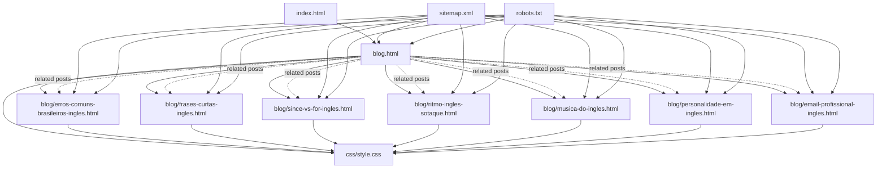
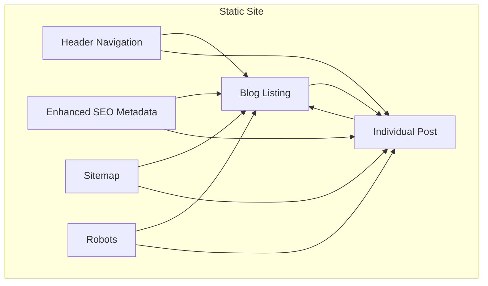
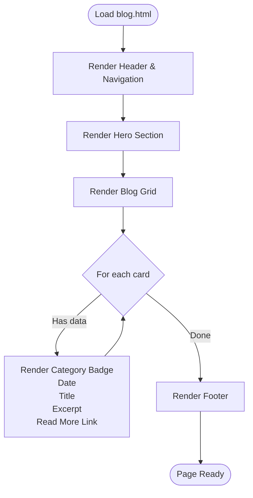
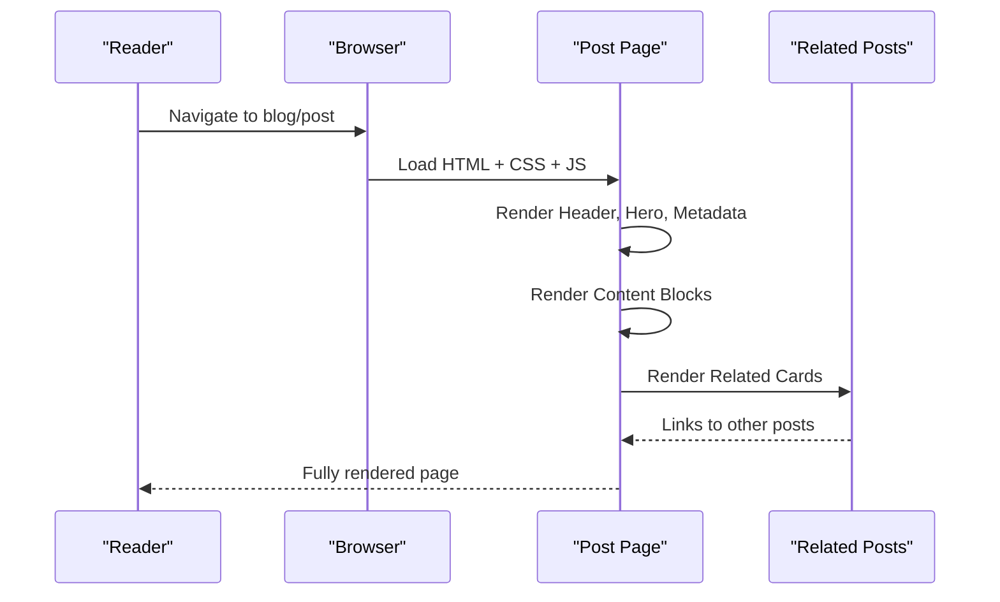
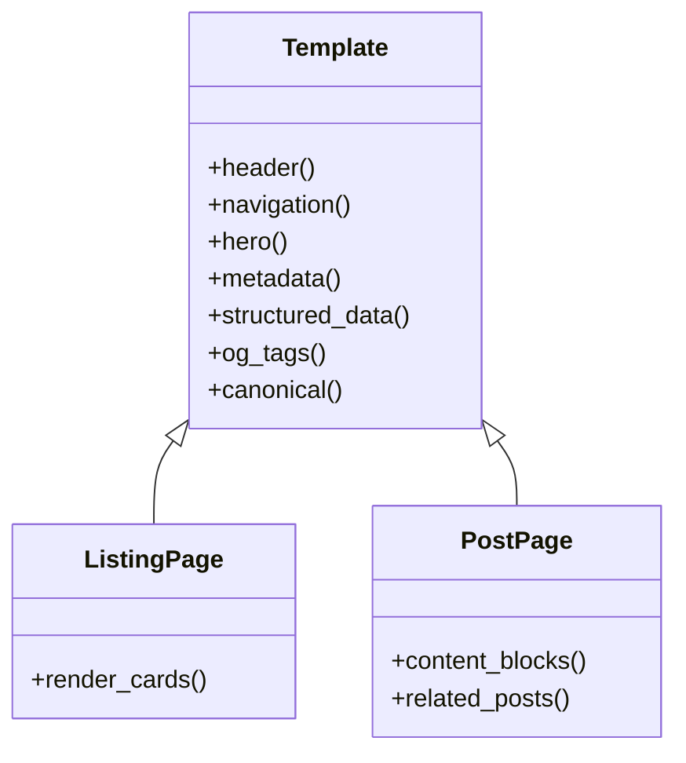
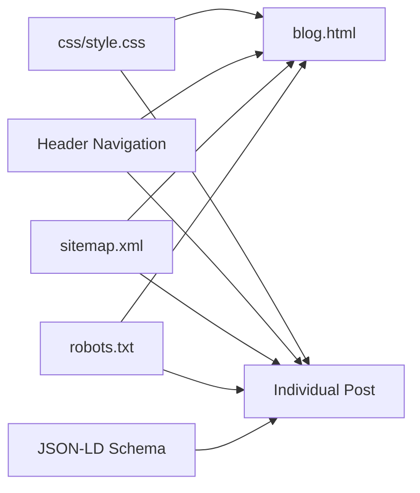

# Educational Content Platform

<cite>
**Referenced Files in This Document**
- [blog.html](file://blog.html)
- [email-profissional-ingles.html](file://blog/email-profissional-ingles.html)
- [erros-comuns-brasileiros-ingles.html](file://blog/erros-comuns-brasileiros-ingles.html)
- [frases-curtas-ingles.html](file://blog/frases-curtas-ingles.html)
- [since-vs-for-ingles.html](file://blog/since-vs-for-ingles.html)
- [ritmo-ingles-sotaque.html](file://blog/ritmo-ingles-sotaque.html)
- [musica-do-ingles.html](file://blog/musica-do-ingles.html)
- [personalidade-em-ingles.html](file://blog/personalidade-em-ingles.html)
- [index.html](file://index.html)
- [sitemap.xml](file://sitemap.xml)
- [robots.txt](file://robots.txt)
- [style.css](file://css/style.css)
- [README.md](file://README.md)
</cite>

## Update Summary
**Changes Made**
- Added documentation for the new professional email writing article series
- Enhanced structured data markup documentation for improved SEO performance
- Updated blog listing structure to include the new email writing content
- Expanded content organization categories to include professional communication focus

## Table of Contents
1. [Introduction](#introduction)
2. [Project Structure](#project-structure)
3. [Core Components](#core-components)
4. [Architecture Overview](#architecture-overview)
5. [Detailed Component Analysis](#detailed-component-analysis)
6. [Dependency Analysis](#dependency-analysis)
7. [Performance Considerations](#performance-considerations)
8. [Troubleshooting Guide](#troubleshooting-guide)
9. [Conclusion](#conclusion)
10. [Appendices](#appendices)

## Introduction
This document describes the educational blog platform for a Brazilian English instructor targeting professionals. It explains how the blog listing page organizes content by category, how individual posts are structured, and how metadata and cross-references are implemented. It also covers SEO strategies, content formatting, image handling, styling, educational value, audience segmentation, and content marketing integration with the main service offerings. Guidance is included for adding new posts, managing content workflows, and optimizing for search engines.

**Updated** Added comprehensive coverage of the new professional email writing article series and enhanced structured data markup for improved SEO performance across all blog content.

## Project Structure
The educational blog is a static site with:
- A main landing page that introduces services and includes a Blog link
- A blog listing page that displays cards for recent posts
- Individual blog post pages under a dedicated blog folder
- Shared styles and navigation across pages
- A sitemap and robots configuration for SEO
- Enhanced structured data markup for improved search engine visibility

**Diagram sources**
- [blog.html](file://blog.html)
- [email-profissional-ingles.html](file://blog/email-profissional-ingles.html)
- [erros-comuns-brasileiros-ingles.html](file://blog/erros-comuns-brasileiros-ingles.html)
- [frases-curtas-ingles.html](file://blog/frases-curtas-ingles.html)
- [since-vs-for-ingles.html](file://blog/since-vs-for-ingles.html)
- [ritmo-ingles-sotaque.html](file://blog/ritmo-ingles-sotaque.html)
- [musica-do-ingles.html](file://blog/musica-do-ingles.html)
- [personalidade-em-ingles.html](file://blog/personalidade-em-ingles.html)
- [index.html](file://index.html)
- [sitemap.xml](file://sitemap.xml)
- [robots.txt](file://robots.txt)
- [style.css](file://css/style.css)

**Section sources**
- [blog.html](file://blog.html)
- [index.html](file://index.html)
- [sitemap.xml](file://sitemap.xml)
- [robots.txt](file://robots.txt)
- [style.css](file://css/style.css)

## Core Components
- Blog listing page: Displays a grid of blog cards with category, date, title, and excerpt. Links to individual posts.
- Individual blog post pages: Feature a hero section with breadcrumbs, post metadata (author, date, reading time, category), content blocks, and a "Related Posts" section.
- Metadata and SEO: Canonical links, Open Graph tags, structured data (JSON-LD), and meta descriptions are embedded in each page head.
- Cross-references: Related posts are shown at the end of each article; the listing page links to related articles within the same category.
- Content organization: Articles are grouped by categories such as Grammar, Pronunciation, and Communication.
- Styling: Shared CSS defines typography, layout, and responsive behavior for all pages.
- **Enhanced SEO**: All posts now include comprehensive structured data markup for improved search engine performance.

**Updated** Enhanced SEO capabilities with comprehensive structured data markup across all blog content.

**Section sources**
- [blog.html](file://blog.html)
- [email-profissional-ingles.html](file://blog/email-profissional-ingles.html)
- [erros-comuns-brasileiros-ingles.html](file://blog/erros-comuns-brasileiros-ingles.html)
- [frases-curtas-ingles.html](file://blog/frases-curtas-ingles.html)
- [since-vs-for-ingles.html](file://blog/since-vs-for-ingles.html)
- [ritmo-ingles-sotaque.html](file://blog/ritmo-ingles-sotaque.html)
- [musica-do-ingles.html](file://blog/musica-do-ingles.html)
- [personalidade-em-ingles.html](file://blog/personalidade-em-ingles.html)
- [style.css](file://css/style.css)

## Architecture Overview
The blog architecture is a static, content-driven site:
- Navigation: The header appears consistently across pages and includes a link to the blog listing.
- Listing page: Renders a grid of cards with category badges and publication dates.
- Article pages: Render post metadata, content blocks, and related posts.
- SEO: Each page sets canonical URL, meta description, Open Graph tags, and JSON-LD structured data.
- Sitemap and robots: A sitemap lists all pages; robots allows indexing.

**Diagram sources**
- [blog.html](file://blog.html)
- [email-profissional-ingles.html](file://blog/email-profissional-ingles.html)
- [erros-comuns-brasileiros-ingles.html](file://blog/erros-comuns-brasileiros-ingles.html)
- [frases-curtas-ingles.html](file://blog/frases-curtas-ingles.html)
- [since-vs-for-ingles.html](file://blog/since-vs-for-ingles.html)
- [ritmo-ingles-sotaque.html](file://blog/ritmo-ingles-sotaque.html)
- [musica-do-ingles.html](file://blog/musica-do-ingles.html)
- [personalidade-em-ingles.html](file://blog/personalidade-em-ingles.html)
- [sitemap.xml](file://sitemap.xml)
- [robots.txt](file://robots.txt)

## Detailed Component Analysis

### Blog Listing Page
The listing page presents recent articles as interactive cards:
- Structure: Header with navigation, a hero section with breadcrumbs and headline, and a grid of blog cards.
- Cards: Each card includes a category badge, publish month/year, title, and excerpt; links to the full article.
- Layout: CSS grid adapts to screen size; cards use consistent spacing and typography.
- **New Content**: Now includes the professional email writing series alongside existing grammar, pronunciation, and communication articles.

**Diagram sources**
- [blog.html](file://blog.html)
- [style.css](file://css/style.css)

**Section sources**
- [blog.html](file://blog.html)
- [style.css](file://css/style.css)

### Individual Blog Post Structure
Each post page follows a consistent structure:
- Header and navigation
- Post hero with breadcrumbs and title
- Post metadata: author, date, reading time, category
- Content blocks: paragraphs, highlighted sections, optional audio demos, exercises, and quotes
- Related posts section with cards linking to other articles
- Footer and floating WhatsApp CTA

**Updated** All posts now include comprehensive structured data markup for enhanced SEO performance.

**Diagram sources**
- [email-profissional-ingles.html](file://blog/email-profissional-ingles.html)
- [erros-comuns-brasileiros-ingles.html](file://blog/erros-comuns-brasileiros-ingles.html)
- [frases-curtas-ingles.html](file://blog/frases-curtas-ingles.html)
- [since-vs-for-ingles.html](file://blog/since-vs-for-ingles.html)
- [ritmo-ingles-sotaque.html](file://blog/ritmo-ingles-sotaque.html)
- [musica-do-ingles.html](file://blog/musica-do-ingles.html)
- [personalidade-em-ingles.html](file://blog/personalidade-em-ingles.html)
- [style.css](file://css/style.css)

**Section sources**
- [email-profissional-ingles.html](file://blog/email-profissional-ingles.html)
- [erros-comuns-brasileiros-ingles.html](file://blog/erros-comuns-brasileiros-ingles.html)
- [frases-curtas-ingles.html](file://blog/frases-curtas-ingles.html)
- [since-vs-for-ingles.html](file://blog/since-vs-for-ingles.html)
- [ritmo-ingles-sotaque.html](file://blog/ritmo-ingles-sotaque.html)
- [musica-do-ingles.html](file://blog/musica-do-ingles.html)
- [personalidade-em-ingles.html](file://blog/personalidade-em-ingles.html)
- [style.css](file://css/style.css)

### Content Organization by Categories
Articles are categorized to help readers discover related topics:
- Grammar: Focus on common errors and rules
- Pronunciation: Focus on rhythm, connected speech, and accent
- Communication: Focus on tone, authority, and cultural nuances
- **Professional Communication**: New category focusing on workplace communication, including email writing etiquette and professional correspondence

**Updated** Added professional communication category to cover email writing and workplace communication skills.

Category badges appear on both the listing page and individual posts, aiding discovery and SEO.

**Section sources**
- [blog.html](file://blog.html)
- [email-profissional-ingles.html](file://blog/email-profissional-ingles.html)
- [erros-comuns-brasileiros-ingles.html](file://blog/erros-comuns-brasileiros-ingles.html)
- [since-vs-for-ingles.html](file://blog/since-vs-for-ingles.html)
- [ritmo-ingles-sotaque.html](file://blog/ritmo-ingles-sotaque.html)
- [musica-do-ingles.html](file://blog/musica-do-ingles.html)
- [personalidade-em-ingles.html](file://blog/personalidade-em-ingles.html)

### HTML Templates and Metadata Management
Templates are shared across pages:
- Header and navigation: Consistent branding and menu
- Hero sections: Breadcrumbs and page titles
- Post metadata: Author, date, reading time, category
- Structured data: JSON-LD BlogPosting schema on article pages
- Open Graph and canonical: Ensures proper social sharing and SEO

**Updated** All blog posts now include comprehensive structured data markup for improved search engine performance and rich snippet display.

**Diagram sources**
- [blog.html](file://blog.html)
- [email-profissional-ingles.html](file://blog/email-profissional-ingles.html)
- [erros-comuns-brasileiros-ingles.html](file://blog/erros-comuns-brasileiros-ingles.html)
- [frases-curtas-ingles.html](file://blog/frases-curtas-ingles.html)
- [since-vs-for-ingles.html](file://blog/since-vs-for-ingles.html)
- [ritmo-ingles-sotaque.html](file://blog/ritmo-ingles-sotaque.html)
- [musica-do-ingles.html](file://blog/musica-do-ingles.html)
- [personalidade-em-ingles.html](file://blog/personalidade-em-ingles.html)

**Section sources**
- [blog.html](file://blog.html)
- [email-profissional-ingles.html](file://blog/email-profissional-ingles.html)
- [erros-comuns-brasileiros-ingles.html](file://blog/erros-comuns-brasileiros-ingles.html)
- [frases-curtas-ingles.html](file://blog/frases-curtas-ingles.html)
- [since-vs-for-ingles.html](file://blog/since-vs-for-ingles.html)
- [ritmo-ingles-sotaque.html](file://blog/ritmo-ingles-sotaque.html)
- [musica-do-ingles.html](file://blog/musica-do-ingles.html)
- [personalidade-em-ingles.html](file://blog/personalidade-em-ingles.html)

### Cross-References Between Articles
Cross-references improve retention and engagement:
- Listing page: Cards link to individual posts; related posts are shown at the end of each article
- Category alignment: Related posts often share the same category, increasing topical relevance
- Internal linking: Breadcrumbs guide users back to the listing and home page
- **Enhanced Discovery**: New email writing content complements existing grammar and communication articles, creating a comprehensive learning pathway

**Updated** Enhanced cross-reference system with new email writing content that bridges grammar and professional communication skills.

**Section sources**
- [blog.html](file://blog.html)
- [email-profissional-ingles.html](file://blog/email-profissional-ingles.html)
- [erros-comuns-brasileiros-ingles.html](file://blog/erros-comuns-brasileiros-ingles.html)
- [frases-curtas-ingles.html](file://blog/frases-curtas-ingles.html)
- [since-vs-for-ingles.html](file://blog/since-vs-for-ingles.html)
- [ritmo-ingles-sotaque.html](file://blog/ritmo-ingles-sotaque.html)
- [musica-do-ingles.html](file://blog/musica-do-ingles.html)
- [personalidade-em-ingles.html](file://blog/personalidade-em-ingles.html)

### Examples of Blog Post Formatting, Image Handling, and Content Styling
- Formatting: Articles use paragraphs, highlighted sections, quotes, and optional audio embeds
- Styling: CSS defines typography, spacing, and responsive grids; each post can include scoped styles for special components (e.g., audio demos, exercises)
- Image handling: Placeholder comments indicate where audio assets are expected; images are not currently used in the provided templates
- **Structured Data**: All posts include comprehensive JSON-LD structured data for improved SEO performance

**Updated** All posts now include structured data markup for enhanced search engine visibility and rich snippet display.

**Section sources**
- [email-profissional-ingles.html](file://blog/email-profissional-ingles.html)
- [frases-curtas-ingles.html](file://blog/frases-curtas-ingles.html)
- [musica-do-ingles.html](file://blog/musica-do-ingles.html)
- [personalidade-em-ingles.html](file://blog/personalidade-em-ingles.html)
- [style.css](file://css/style.css)

### Educational Value Proposition and Target Audience Segmentation
- Educational value: Articles focus on practical, high-leverage skills—grammar precision, pronunciation rhythm, communication tone, and professional email writing—to help professionals sound native and confident
- Target audience: Brazilian professionals (executives, IT/Tech, general professionals) with intermediate English proficiency seeking career-focused English training
- Alignment with services: Blog posts complement paid instruction by highlighting key problem areas and encouraging consultations
- **Professional Focus**: New email writing content specifically addresses workplace communication challenges faced by Brazilian professionals

**Updated** Enhanced educational value with specialized professional communication content for career-focused learners.

**Section sources**
- [index.html](file://index.html)
- [README.md](file://README.md)

### Content Marketing Integration with Main Service Offerings
- Navigation: The blog link is prominently placed in the main navigation
- Soft CTAs: Each post ends with a call-to-action directing readers to schedule a free consultation or contact via WhatsApp
- Cross-promotion: Related posts reinforce themes covered in courses (grammar, pronunciation, communication, professional email writing)
- **Enhanced Lead Generation**: Professional email writing content directly addresses pain points that convert into paid consultation bookings

**Updated** Enhanced content marketing integration with specialized professional communication content that drives targeted lead generation.

**Section sources**
- [blog.html](file://blog.html)
- [email-profissional-ingles.html](file://blog/email-profissional-ingles.html)
- [erros-comuns-brasileiros-ingles.html](file://blog/erros-comuns-brasileiros-ingles.html)
- [frases-curtas-ingles.html](file://blog/frases-curtas-ingles.html)
- [since-vs-for-ingles.html](file://blog/since-vs-for-ingles.html)
- [ritmo-ingles-sotaque.html](file://blog/ritmo-ingles-sotaque.html)
- [musica-do-ingles.html](file://blog/musica-do-ingles.html)
- [personalidade-em-ingles.html](file://blog/personalidade-em-ingles.html)

### Adding New Blog Posts and Managing Content Workflows
- Create a new HTML file under the blog directory with the standard template structure
- Add metadata: canonical, meta description, Open Graph, and JSON-LD structured data
- Include content blocks aligned with existing patterns (introductions, sections, quotes, related posts)
- Update the listing page with a new card pointing to the new article
- Add or update the sitemap with the new URL and last modified date
- Verify robots.txt allows indexing if applicable
- **Structured Data Compliance**: Ensure all new posts include comprehensive JSON-LD BlogPosting schema for optimal SEO performance

**Updated** Enhanced content workflow with mandatory structured data compliance for all new blog posts.

**Section sources**
- [blog.html](file://blog.html)
- [email-profissional-ingles.html](file://blog/email-profissional-ingles.html)
- [sitemap.xml](file://sitemap.xml)
- [robots.txt](file://robots.txt)

## Dependency Analysis
The blog relies on shared resources and consistent templates:
- Shared CSS: All pages use the same stylesheet for typography, layout, and responsiveness
- Navigation: Header navigation is consistent across pages, linking to the listing and other sections
- Sitemap and robots: Centralized SEO configuration supports indexing of all pages
- **Structured Data**: All blog posts include comprehensive JSON-LD structured data for improved search engine performance

**Updated** Enhanced dependency structure with standardized structured data markup across all blog content.

**Diagram sources**
- [style.css](file://css/style.css)
- [blog.html](file://blog.html)
- [email-profissional-ingles.html](file://blog/email-profissional-ingles.html)
- [sitemap.xml](file://sitemap.xml)
- [robots.txt](file://robots.txt)

**Section sources**
- [style.css](file://css/style.css)
- [blog.html](file://blog.html)
- [email-profissional-ingles.html](file://blog/email-profissional-ingles.html)
- [sitemap.xml](file://sitemap.xml)
- [robots.txt](file://robots.txt)

## Performance Considerations
- Static hosting: No server-side rendering overhead; fast load times
- Minimal dependencies: Uses CDN-hosted libraries and vanilla CSS/JS
- Mobile-first design: Grid and flex layouts adapt to various screen sizes
- **Enhanced SEO Performance**: Structured data markup improves search engine crawling and rich snippet display
- Recommendations: Optimize images and audio assets when added; leverage browser caching; monitor Core Web Vitals; ensure structured data validation

**Updated** Enhanced performance considerations with structured data optimization for improved SEO crawling and rich snippet display.

[No sources needed since this section provides general guidance]

## Troubleshooting Guide
- Broken links: Verify canonical URLs and internal links; ensure relative paths are correct when moving files
- SEO issues: Confirm meta descriptions, Open Graph tags, and JSON-LD are present and accurate; update sitemap entries
- Cross-reference gaps: Ensure related posts are added at the end of each article and that categories align
- Navigation inconsistencies: Keep header navigation synchronized across pages
- Robots and sitemap: Confirm robots.txt allows indexing and sitemap.xml includes all published pages
- **Structured Data Issues**: Validate JSON-LD schema markup using Google Rich Results Test; ensure all required fields are present
- **Content Gaps**: Verify new email writing content aligns with existing grammar and communication themes

**Updated** Enhanced troubleshooting guide with structured data validation and new content integration checks.

**Section sources**
- [blog.html](file://blog.html)
- [email-profissional-ingles.html](file://blog/email-profissional-ingles.html)
- [sitemap.xml](file://sitemap.xml)
- [robots.txt](file://robots.txt)

## Conclusion
The educational blog platform delivers targeted, career-focused English content through a consistent, SEO-friendly structure. Its modular templates, category-based organization, and cross-references support both reader engagement and conversion to paid services. The addition of professional email writing content and enhanced structured data markup significantly improves the platform's educational value and search engine performance. By following the documented workflows and best practices, contributors can efficiently publish high-quality posts that align with the brand's mission and audience needs.

**Updated** Enhanced conclusion reflecting the expanded professional communication focus and improved SEO capabilities.

[No sources needed since this section summarizes without analyzing specific files]

## Appendices

### SEO Optimization Strategies
- Canonical URLs: Set per page to avoid duplicate content
- Meta descriptions: Summarize each article's value
- Open Graph: Define title, description, type, URL, and image for social sharing
- Structured data: Use JSON-LD BlogPosting for rich snippets and improved search visibility
- Sitemap: Include all pages with last modified dates and priorities
- Robots: Allow indexing for public pages
- **Enhanced Schema Markup**: Comprehensive JSON-LD implementation across all blog content for optimal SEO performance

**Updated** Enhanced SEO strategies with comprehensive structured data markup implementation.

**Section sources**
- [email-profissional-ingles.html](file://blog/email-profissional-ingles.html)
- [erros-comuns-brasileiros-ingles.html](file://blog/erros-comuns-brasileiros-ingles.html)
- [frases-curtas-ingles.html](file://blog/frases-curtas-ingles.html)
- [since-vs-for-ingles.html](file://blog/since-vs-for-ingles.html)
- [ritmo-ingles-sotaque.html](file://blog/ritmo-ingles-sotaque.html)
- [musica-do-ingles.html](file://blog/musica-do-ingles.html)
- [personalidade-em-ingles.html](file://blog/personalidade-em-ingles.html)
- [sitemap.xml](file://sitemap.xml)
- [robots.txt](file://robots.txt)