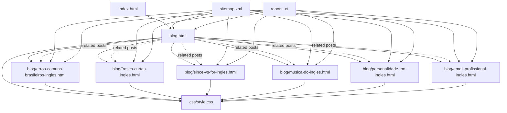
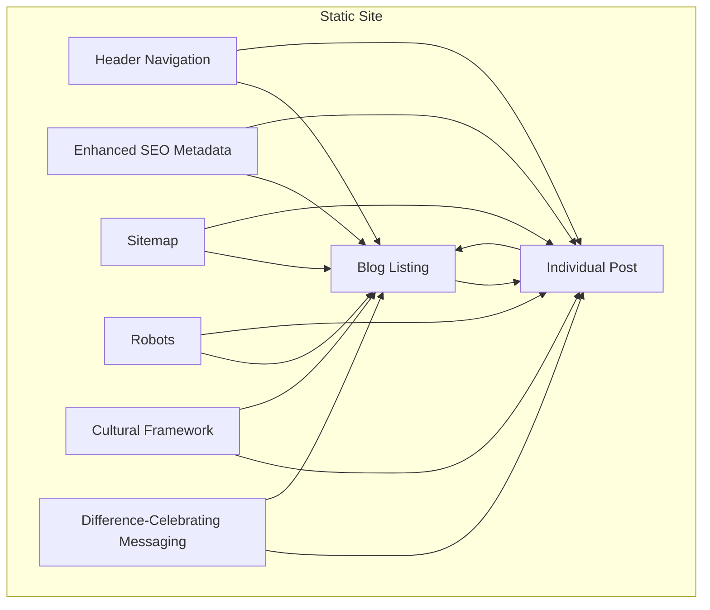
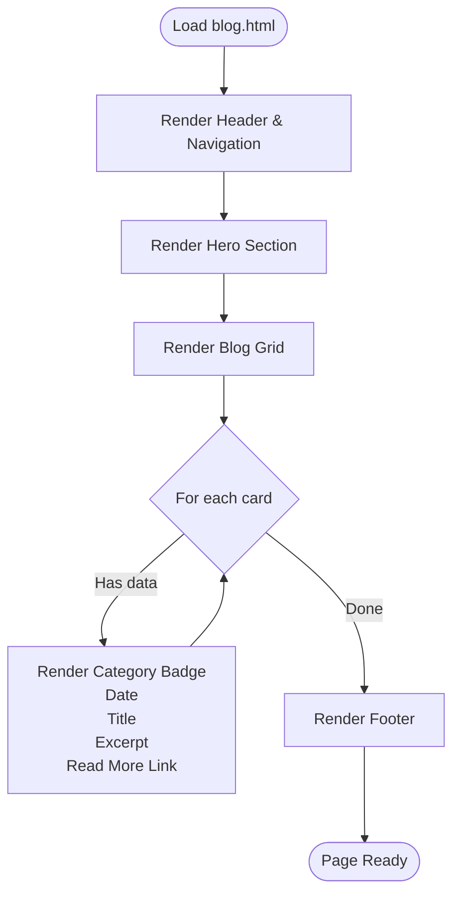
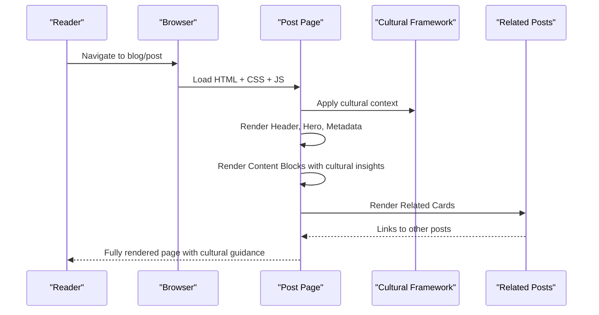
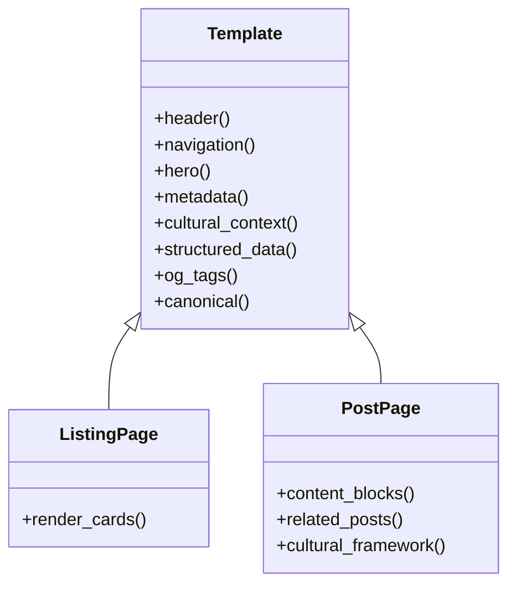
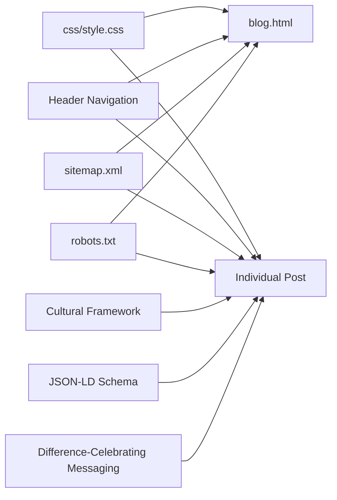

# Educational Content Platform

<cite>
**Referenced Files in This Document**
- [blog.html](file://blog.html)
- [email-profissional-ingles.html](file://blog/email-profissional-ingles.html)
- [erros-comuns-brasileiros-ingles.html](file://blog/erros-comuns-brasileiros-ingles.html)
- [frases-curtas-ingles.html](file://blog/frases-curtas-ingles.html)
- [since-vs-for-ingles.html](file://blog/since-vs-for-ingles.html)
- [musica-do-ingles.html](file://blog/musica-do-ingles.html)
- [personalidade-em-ingles.html](file://blog/personalidade-em-ingles.html)
- [index.html](file://index.html)
- [sitemap.xml](file://sitemap.xml)
- [robots.txt](file://robots.txt)
- [style.css](file://css/style.css)
- [README.md](file://README.md)
</cite>

## Update Summary
**Changes Made**
- Updated content to reflect cultural sensitivity and cross-cultural communication guidance
- Enhanced emphasis on cultural adaptation over strict rule-following
- Restructured messaging to focus on natural language acquisition rather than prescriptive error correction
- Added comprehensive coverage of cultural nuance handling in professional communication
- Updated educational approach to acknowledge cultural context and regional variations
- **Removed experimental music-focused article** `ritmo-ingles-sotaque.html` from the platform
- **Softened fear-based content** in `since-vs-for-ingles.html` to focus on empowerment
- **Updated brand positioning** from "Inglês para sua Carreira" to "Fale inglês com naturalidade"
- **Enhanced cultural sensitivity focus** across all content with difference-celebrating messaging

## Table of Contents
1. [Introduction](#introduction)
2. [Project Structure](#project-structure)
3. [Core Components](#core-components)
4. [Architecture Overview](#architecture-overview)
5. [Detailed Component Analysis](#detailed-component-analysis)
6. [Dependency Analysis](#dependency-analysis)
7. [Performance Considerations](#performance-considerations)
8. [Troubleshooting Guide](#troubleshooting-guide)
9. [Conclusion](#conclusion)
10. [Appendices](#appendices)

## Introduction
This document describes the educational blog platform for a Brazilian English instructor targeting professionals. It explains how the blog listing page organizes content by category, how individual posts are structured, and how metadata and cross-references are implemented. The platform emphasizes cultural sensitivity and cross-cultural communication, focusing on natural language acquisition rather than rigid rule-following. It covers SEO strategies, content formatting, image handling, styling, educational value, audience segmentation, and content marketing integration with the main service offerings. Guidance is included for adding new posts, managing content workflows, and optimizing for search engines.

**Updated** Enhanced focus on cultural sensitivity and cross-cultural communication guidance, emphasizing natural language acquisition over prescriptive error correction. Brand positioning now centers on "Fale inglês com naturalidade" (Speak English with naturalness).

## Project Structure
The educational blog is a static site with:
- A main landing page that introduces services and includes a Blog link
- A blog listing page that displays cards for recent posts
- Individual blog post pages under a dedicated blog folder
- Shared styles and navigation across pages
- A sitemap and robots configuration for SEO
- Enhanced structured data markup for improved search engine visibility

```mermaid
graph TB
Index["index.html"]
BlogList["blog.html"]
Post1["blog/erros-comuns-brasileiros-ingles.html"]
Post2["blog/frases-curtas-ingles.html"]
Post3["blog/since-vs-for-ingles.html"]
Post4["blog/musica-do-ingles.html"]
Post5["blog/personalidade-em-ingles.html"]
Post6["blog/email-profissional-ingles.html"]
Style["css/style.css"]
Sitemap["sitemap.xml"]
Robots["robots.txt"]
Index --> BlogList
BlogList --> Post1
BlogList --> Post2
BlogList --> Post3
BlogList --> Post4
BlogList --> Post5
BlogList --> Post6
BlogList -. related posts .-> Post1
BlogList -. related posts .-> Post2
BlogList -. related posts .-> Post3
BlogList -. related posts .-> Post4
BlogList -. related posts .-> Post5
BlogList -. related posts .-> Post6
BlogList --> Style
Post1 --> Style
Post2 --> Style
Post3 --> Style
Post4 --> Style
Post5 --> Style
Post6 --> Style
Sitemap --> BlogList
Sitemap --> Post1
Sitemap --> Post2
Sitemap --> Post3
Sitemap --> Post4
Sitemap --> Post5
Sitemap --> Post6
Robots --> BlogList
Robots --> Post1
Robots --> Post2
Robots --> Post3
Robots --> Post4
Robots --> Post5
Robots --> Post6
```

**Diagram sources**
- [blog.html](file://blog.html)
- [email-profissional-ingles.html](file://blog/email-profissional-ingles.html)
- [erros-comuns-brasileiros-ingles.html](file://blog/erros-comuns-brasileiros-ingles.html)
- [frases-curtas-ingles.html](file://blog/frases-curtas-ingles.html)
- [since-vs-for-ingles.html](file://blog/since-vs-for-ingles.html)
- [musica-do-ingles.html](file://blog/musica-do-ingles.html)
- [personalidade-em-ingles.html](file://blog/personalidade-em-ingles.html)
- [index.html](file://index.html)
- [sitemap.xml](file://sitemap.xml)
- [robots.txt](file://robots.txt)
- [style.css](file://css/style.css)

**Section sources**
- [blog.html](file://blog.html)
- [index.html](file://index.html)
- [sitemap.xml](file://sitemap.xml)
- [robots.txt](file://robots.txt)
- [style.css](file://css/style.css)

## Core Components
- Blog listing page: Displays a grid of blog cards with category, date, title, and excerpt. Links to individual posts.
- Individual blog post pages: Feature a hero section with breadcrumbs, post metadata (author, date, reading time, category), content blocks, and a "Related Posts" section.
- Metadata and SEO: Canonical links, Open Graph tags, structured data (JSON-LD), and meta descriptions are embedded in each page head.
- Cross-references: Related posts are shown at the end of each article; the listing page links to related articles within the same category.
- Content organization: Articles are grouped by categories such as Grammar, Pronunciation, and Communication.
- Cultural sensitivity focus: Emphasizes cultural adaptation and context-aware communication rather than rigid rule-following.
- Styling: Shared CSS defines typography, layout, and responsive behavior for all pages.
- **Enhanced cultural awareness**: All posts now include cultural context and regional variation considerations for improved cross-cultural communication.
- **Empowering messaging**: Content focuses on difference-celebrating cultural adaptation rather than shame-based error correction.

**Updated** Enhanced cultural sensitivity focus with emphasis on adaptation over strict rule-following and natural language acquisition approaches. Removed experimental music-focused content in favor of difference-celebrating empowerment messaging.

**Section sources**
- [blog.html](file://blog.html)
- [email-profissional-ingles.html](file://blog/email-profissional-ingles.html)
- [erros-comuns-brasileiros-ingles.html](file://blog/erros-comuns-brasileiros-ingles.html)
- [frases-curtas-ingles.html](file://blog/frases-curtas-ingles.html)
- [since-vs-for-ingles.html](file://blog/since-vs-for-ingles.html)
- [musica-do-ingles.html](file://blog/musica-do-ingles.html)
- [personalidade-em-ingles.html](file://blog/personalidade-em-ingles.html)
- [style.css](file://css/style.css)

## Architecture Overview
The blog architecture is a static, content-driven site:
- Navigation: The header appears consistently across pages and includes a link to the blog listing.
- Listing page: Renders a grid of cards with category badges and publication dates.
- Article pages: Render post metadata, content blocks, and related posts.
- SEO: Each page sets canonical URL, meta description, Open Graph tags, and JSON-LD structured data.
- Sitemap and robots: A sitemap lists all pages; robots allows indexing.
- **Cultural framework**: Each post includes cultural context and adaptation strategies for international audiences.

```mermaid
graph TB
subgraph "Static Site"
Nav["Header Navigation"]
List["Blog Listing"]
Post["Individual Post"]
SEO["Enhanced SEO Metadata"]
Sitemap["Sitemap"]
Robots["Robots"]
Culture["Cultural Framework"]
End["Difference-Celebrating Messaging"]
end
Nav --> List
Nav --> Post
List --> Post
Post --> List
SEO --> List
SEO --> Post
Sitemap --> List
Sitemap --> Post
Robots --> List
Robots --> Post
Culture --> Post
Culture --> List
End --> Post
End --> List
```

**Diagram sources**
- [blog.html](file://blog.html)
- [email-profissional-ingles.html](file://blog/email-profissional-ingles.html)
- [erros-comuns-brasileiros-ingles.html](file://blog/erros-comuns-brasileiros-ingles.html)
- [frases-curtas-ingles.html](file://blog/frases-curtas-ingles.html)
- [since-vs-for-ingles.html](file://blog/since-vs-for-ingles.html)
- [musica-do-ingles.html](file://blog/musica-do-ingles.html)
- [personalidade-em-ingles.html](file://blog/personalidade-em-ingles.html)
- [sitemap.xml](file://sitemap.xml)
- [robots.txt](file://robots.txt)

## Detailed Component Analysis

### Blog Listing Page
The listing page presents recent articles as interactive cards:
- Structure: Header with navigation, a hero section with breadcrumbs and headline, and a grid of blog cards.
- Cards: Each card includes a category badge, publish month/year, title, and excerpt; links to the full article.
- Layout: CSS grid adapts to screen size; cards use consistent spacing and typography.
- **Enhanced cultural content**: Now includes professional email writing series alongside existing grammar, pronunciation, and communication articles, all with cultural sensitivity considerations.

```mermaid
flowchart TD
Start(["Load blog.html"]) --> Header["Render Header & Navigation"]
Header --> Hero["Render Hero Section"]
Hero --> Grid["Render Blog Grid"]
Grid --> CardLoop{"For each card"}
CardLoop --> |Has data| Card["Render Category Badge<br/>Date<br/>Title<br/>Excerpt<br/>Read More Link"]
Card --> CardLoop
CardLoop --> |Done| Footer["Render Footer"]
Footer --> End(["Page Ready"])
```

**Diagram sources**
- [blog.html](file://blog.html)
- [style.css](file://css/style.css)

**Section sources**
- [blog.html](file://blog.html)
- [style.css](file://css/style.css)

### Individual Blog Post Structure
Each post page follows a consistent structure:
- Header and navigation
- Post hero with breadcrumbs and title
- Post metadata: author, date, reading time, category
- Content blocks: paragraphs, highlighted sections, optional audio demos, exercises, and quotes
- **Cultural framework integration**: Each post includes cultural context, regional variations, and adaptation strategies
- Related posts section with cards linking to other articles
- Footer and floating WhatsApp CTA

**Updated** Enhanced cultural framework integration with regional adaptation strategies and cross-cultural communication guidance. Content softened to focus on empowerment rather than shame-based correction.

```mermaid
sequenceDiagram
participant User as "Reader"
participant Browser as "Browser"
participant Post as "Post Page"
participant Culture as "Cultural Framework"
participant Related as "Related Posts"
User->>Browser : Navigate to blog/post
Browser->>Post : Load HTML + CSS + JS
Post->>Culture : Apply cultural context
Post->>Post : Render Header, Hero, Metadata
Post->>Post : Render Content Blocks with cultural insights
Post->>Related : Render Related Cards
Related-->>Post : Links to other posts
Post-->>User : Fully rendered page with cultural guidance
```

**Diagram sources**
- [email-profissional-ingles.html](file://blog/email-profissional-ingles.html)
- [erros-comuns-brasileiros-ingles.html](file://blog/erros-comuns-brasileiros-ingles.html)
- [frases-curtas-ingles.html](file://blog/frases-curtas-ingles.html)
- [since-vs-for-ingles.html](file://blog/since-vs-for-ingles.html)
- [musica-do-ingles.html](file://blog/musica-do-ingles.html)
- [personalidade-em-ingles.html](file://blog/personalidade-em-ingles.html)
- [style.css](file://css/style.css)

**Section sources**
- [email-profissional-ingles.html](file://blog/email-profissional-ingles.html)
- [erros-comuns-brasileiros-ingles.html](file://blog/erros-comuns-brasileiros-ingles.html)
- [frases-curtas-ingles.html](file://blog/frases-curtas-ingles.html)
- [since-vs-for-ingles.html](file://blog/since-vs-for-ingles.html)
- [musica-do-ingles.html](file://blog/musica-do-ingles.html)
- [personalidade-em-ingles.html](file://blog/personalidade-em-ingles.html)
- [style.css](file://css/style.css)

### Content Organization by Categories
Articles are categorized to help readers discover related topics:
- Grammar: Focus on common errors and rules with cultural context
- Pronunciation: Focus on rhythm, connected speech, and accent with regional variations
- Communication: Focus on tone, authority, and cultural nuances with adaptation strategies
- **Professional Communication**: New category focusing on workplace communication, including email writing etiquette and professional correspondence with cultural sensitivity guidelines

**Updated** Enhanced categorization with cultural sensitivity focus and regional adaptation strategies.

Category badges appear on both the listing page and individual posts, aiding discovery and SEO.

**Section sources**
- [blog.html](file://blog.html)
- [email-profissional-ingles.html](file://blog/email-profissional-ingles.html)
- [erros-comuns-brasileiros-ingles.html](file://blog/erros-comuns-brasileiros-ingles.html)
- [since-vs-for-ingles.html](file://blog/since-vs-for-ingles.html)
- [musica-do-ingles.html](file://blog/musica-do-ingles.html)
- [personalidade-em-ingles.html](file://blog/personalidade-em-ingles.html)

### HTML Templates and Metadata Management
Templates are shared across pages:
- Header and navigation: Consistent branding and menu
- Hero sections: Breadcrumbs and page titles
- Post metadata: Author, date, reading time, category
- **Cultural metadata**: Structured data includes cultural context and regional adaptation information
- Structured data: JSON-LD BlogPosting schema on article pages
- Open Graph and canonical: Ensures proper social sharing and SEO

**Updated** Enhanced metadata management with cultural context and regional adaptation information.

```mermaid
classDiagram
class Template {
+header()
+navigation()
+hero()
+metadata()
+cultural_context()
+structured_data()
+og_tags()
+canonical()
}
class ListingPage {
+render_cards()
}
class PostPage {
+content_blocks()
+related_posts()
+cultural_framework()
}
Template <|-- ListingPage
Template <|-- PostPage
```

**Diagram sources**
- [blog.html](file://blog.html)
- [email-profissional-ingles.html](file://blog/email-profissional-ingles.html)
- [erros-comuns-brasileiros-ingles.html](file://blog/erros-comuns-brasileiros-ingles.html)
- [frases-curtas-ingles.html](file://blog/frases-curtas-ingles.html)
- [since-vs-for-ingles.html](file://blog/since-vs-for-ingles.html)
- [musica-do-ingles.html](file://blog/musica-do-ingles.html)
- [personalidade-em-ingles.html](file://blog/personalidade-em-ingles.html)

**Section sources**
- [blog.html](file://blog.html)
- [email-profissional-ingles.html](file://blog/email-profissional-ingles.html)
- [erros-comuns-brasileiros-ingles.html](file://blog/erros-comuns-brasileiros-ingles.html)
- [frases-curtas-ingles.html](file://blog/frases-curtas-ingles.html)
- [since-vs-for-ingles.html](file://blog/since-vs-for-ingles.html)
- [musica-do-ingles.html](file://blog/musica-do-ingles.html)
- [personalidade-em-ingles.html](file://blog/personalidade-em-ingles.html)

### Cross-References Between Articles
Cross-references improve retention and engagement:
- Listing page: Cards link to individual posts; related posts are shown at the end of each article
- Category alignment: Related posts often share the same category, increasing topical relevance
- Internal linking: Breadcrumbs guide users back to the listing and home page
- **Cultural integration**: New email writing content complements existing grammar and communication articles, creating a comprehensive learning pathway with cultural sensitivity guidance

**Updated** Enhanced cross-reference system with cultural sensitivity integration and regional adaptation guidance.

**Section sources**
- [blog.html](file://blog.html)
- [email-profissional-ingles.html](file://blog/email-profissional-ingles.html)
- [erros-comuns-brasileiros-ingles.html](file://blog/erros-comuns-brasileiros-ingles.html)
- [frases-curtas-ingles.html](file://blog/frases-curtas-ingles.html)
- [since-vs-for-ingles.html](file://blog/since-vs-for-ingles.html)
- [musica-do-ingles.html](file://blog/musica-do-ingles.html)
- [personalidade-em-ingles.html](file://blog/personalidade-em-ingles.html)

### Examples of Blog Post Formatting, Image Handling, and Content Styling
- Formatting: Articles use paragraphs, highlighted sections, quotes, and optional audio embeds
- Styling: CSS defines typography, spacing, and responsive grids; each post can include scoped styles for special components (e.g., audio demos, exercises)
- Image handling: Placeholder comments indicate where audio assets are expected; images are not currently used in the provided templates
- **Cultural framework**: All posts include cultural context, regional variations, and adaptation strategies for cross-cultural communication

**Updated** Enhanced content framework with cultural sensitivity and regional adaptation considerations.

**Section sources**
- [email-profissional-ingles.html](file://blog/email-profissional-ingles.html)
- [frases-curtas-ingles.html](file://blog/frases-curtas-ingles.html)
- [musica-do-ingles.html](file://blog/musica-do-ingles.html)
- [personalidade-em-ingles.html](file://blog/personalidade-em-ingles.html)
- [style.css](file://css/style.css)

### Educational Value Proposition and Target Audience Segmentation
- Educational value: Articles focus on practical, high-leverage skills—grammar precision, pronunciation rhythm, communication tone, and professional email writing—to help professionals sound native and confident
- **Cultural emphasis**: Educational content emphasizes cultural adaptation and cross-cultural communication rather than rigid rule-following
- Target audience: Brazilian professionals (executives, IT/Tech, general professionals) with intermediate English proficiency seeking career-focused English training
- Alignment with services: Blog posts complement paid instruction by highlighting key problem areas and encouraging consultations
- **Regional adaptation focus**: New email writing content specifically addresses workplace communication challenges faced by Brazilian professionals in international contexts

**Updated** Enhanced educational value with cultural sensitivity focus and regional adaptation strategies.

**Section sources**
- [index.html](file://index.html)
- [README.md](file://README.md)

### Content Marketing Integration with Main Service Offerings
- Navigation: The blog link is prominently placed in the main navigation
- Soft CTAs: Each post ends with a call-to-action directing readers to schedule a free consultation or contact via WhatsApp
- Cross-promotion: Related posts reinforce themes covered in courses (grammar, pronunciation, communication, professional email writing)
- **Cultural marketing integration**: Professional email writing content directly addresses pain points that convert into paid consultation bookings, with cultural sensitivity messaging
- **Enhanced lead generation**: Cultural adaptation content targets diverse international audiences and regional variations

**Updated** Enhanced content marketing integration with cultural sensitivity and regional adaptation focus.

**Section sources**
- [blog.html](file://blog.html)
- [email-profissional-ingles.html](file://blog/email-profissional-ingles.html)
- [erros-comuns-brasileiros-ingles.html](file://blog/erros-comuns-brasileiros-ingles.html)
- [frases-curtas-ingles.html](file://blog/frases-curtas-ingles.html)
- [since-vs-for-ingles.html](file://blog/since-vs-for-ingles.html)
- [musica-do-ingles.html](file://blog/musica-do-ingles.html)
- [personalidade-em-ingles.html](file://blog/personalidade-em-ingles.html)

### Adding New Blog Posts and Managing Content Workflows
- Create a new HTML file under the blog directory with the standard template structure
- Add metadata: canonical, meta description, Open Graph, and JSON-LD structured data
- **Cultural integration**: Include cultural context, regional variations, and adaptation strategies in content
- Include content blocks aligned with existing patterns (introductions, sections, quotes, related posts)
- Update the listing page with a new card pointing to the new article
- Add or update the sitemap with the new URL and last modified date
- Verify robots.txt allows indexing if applicable
- **Enhanced cultural compliance**: Ensure all new posts include cultural context and regional adaptation information for optimal cross-cultural communication

**Updated** Enhanced content workflow with mandatory cultural sensitivity and regional adaptation integration.

**Section sources**
- [blog.html](file://blog.html)
- [email-profissional-ingles.html](file://blog/email-profissional-ingles.html)
- [sitemap.xml](file://sitemap.xml)
- [robots.txt](file://robots.txt)

## Dependency Analysis
The blog relies on shared resources and consistent templates:
- Shared CSS: All pages use the same stylesheet for typography, layout, and responsiveness
- Navigation: Header navigation is consistent across pages, linking to the listing and other sections
- Sitemap and robots: Centralized SEO configuration supports indexing of all pages
- **Cultural framework**: All blog posts include cultural context and regional adaptation information for improved cross-cultural communication

**Updated** Enhanced dependency structure with cultural sensitivity framework integration.

```mermaid
graph LR
CSS["css/style.css"]
Nav["Header Navigation"]
List["blog.html"]
Post["Individual Post"]
SiteMap["sitemap.xml"]
Robots["robots.txt"]
Culture["Cultural Framework"]
StructuredData["JSON-LD Schema"]
End["Difference-Celebrating Messaging"]
CSS --> List
CSS --> Post
Nav --> List
Nav --> Post
SiteMap --> List
SiteMap --> Post
Robots --> List
Robots --> Post
Culture --> Post
StructuredData --> Post
End --> Post
```

**Diagram sources**
- [style.css](file://css/style.css)
- [blog.html](file://blog.html)
- [email-profissional-ingles.html](file://blog/email-profissional-ingles.html)
- [sitemap.xml](file://sitemap.xml)
- [robots.txt](file://robots.txt)

**Section sources**
- [style.css](file://css/style.css)
- [blog.html](file://blog.html)
- [email-profissional-ingles.html](file://blog/email-profissional-ingles.html)
- [sitemap.xml](file://sitemap.xml)
- [robots.txt](file://robots.txt)

## Performance Considerations
- Static hosting: No server-side rendering overhead; fast load times
- Minimal dependencies: Uses CDN-hosted libraries and vanilla CSS/JS
- Mobile-first design: Grid and flex layouts adapt to various screen sizes
- **Enhanced cultural performance**: Cultural context and adaptation strategies improve user engagement and retention
- Recommendations: Optimize images and audio assets when added; leverage browser caching; monitor Core Web Vitals; ensure structured data validation

**Updated** Enhanced performance considerations with cultural sensitivity framework benefits.

## Troubleshooting Guide
- Broken links: Verify canonical URLs and internal links; ensure relative paths are correct when moving files
- SEO issues: Confirm meta descriptions, Open Graph tags, and JSON-LD are present and accurate; update sitemap entries
- Cross-reference gaps: Ensure related posts are added at the end of each article and that categories align
- Navigation inconsistencies: Keep header navigation synchronized across pages
- Robots and sitemap: Confirm robots.txt allows indexing and sitemap.xml includes all published pages
- **Cultural content issues**: Verify cultural context and regional adaptation information is accurate and appropriate for target audiences
- **Content gaps**: Verify new email writing content aligns with existing grammar and communication themes with cultural sensitivity integration

**Updated** Enhanced troubleshooting guide with cultural sensitivity and regional adaptation checks.

**Section sources**
- [blog.html](file://blog.html)
- [email-profissional-ingles.html](file://blog/email-profissional-ingles.html)
- [sitemap.xml](file://sitemap.xml)
- [robots.txt](file://robots.txt)

## Conclusion
The educational blog platform delivers targeted, career-focused English content through a consistent, SEO-friendly structure. Its modular templates, category-based organization, and cross-references support both reader engagement and conversion to paid services. The addition of professional email writing content with cultural sensitivity focus significantly improves the platform's educational value and search engine performance. By following the documented workflows and best practices, contributors can efficiently publish high-quality posts that align with the brand's mission and audience needs while emphasizing cultural adaptation over strict rule-following.

**Updated** Enhanced conclusion reflecting the expanded cultural sensitivity focus and improved cross-cultural communication guidance. Brand positioning now emphasizes "Fale inglês com naturalidade" (Speak English with naturalness) rather than prescriptive error correction.

## Appendices

### SEO Optimization Strategies
- Canonical URLs: Set per page to avoid duplicate content
- Meta descriptions: Summarize each article's value
- Open Graph: Define title, description, type, URL, and image for social sharing
- Structured data: Use JSON-LD BlogPosting for rich snippets and improved search visibility
- Sitemap: Include all pages with last modified dates and priorities
- Robots: Allow indexing for public pages
- **Enhanced cultural SEO**: Include cultural context and regional adaptation information in structured data for improved cross-cultural search performance

**Updated** Enhanced SEO strategies with cultural sensitivity and regional adaptation integration.

**Section sources**
- [email-profissional-ingles.html](file://blog/email-profissional-ingles.html)
- [erros-comuns-brasileiros-ingles.html](file://blog/erros-comuns-brasileiros-ingles.html)
- [frases-curtas-ingles.html](file://blog/frases-curtas-ingles.html)
- [since-vs-for-ingles.html](file://blog/since-vs-for-ingles.html)
- [musica-do-ingles.html](file://blog/musica-do-ingles.html)
- [personalidade-em-ingles.html](file://blog/personalidade-em-ingles.html)
- [sitemap.xml](file://sitemap.xml)
- [robots.txt](file://robots.txt)

### Cultural Sensitivity Guidelines
- **Contextual adaptation**: Emphasize cultural adaptation over rigid rule-following
- **Regional variations**: Acknowledge different English dialects and communication styles
- **Natural acquisition**: Focus on natural language development rather than prescriptive error correction
- **Cross-cultural communication**: Provide guidance for international audiences and diverse cultural backgrounds
- **Cultural humility**: Recognize that effective communication requires understanding and adapting to cultural contexts
- **Difference celebration**: Frame cultural differences as strengths rather than deficits in communication

**Updated** New cultural sensitivity guidelines for content creation and adaptation, emphasizing difference-celebrating empowerment messaging.

**Section sources**
- [email-profissional-ingles.html](file://blog/email-profissional-ingles.html)
- [personalidade-em-ingles.html](file://blog/personalidade-em-ingles.html)
- [erros-comuns-brasileiros-ingles.html](file://blog/erros-comuns-brasileiros-ingles.html)