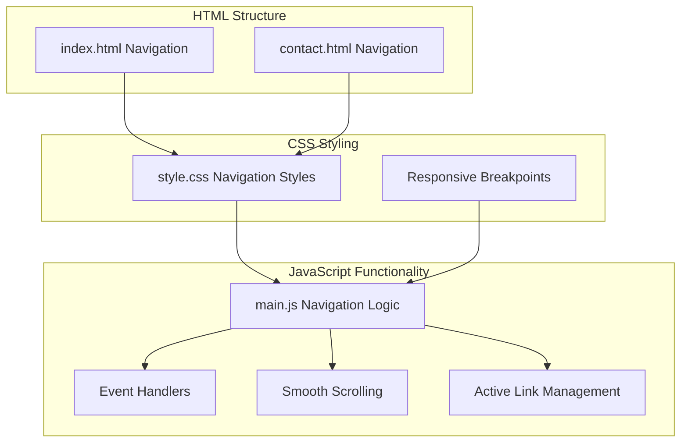
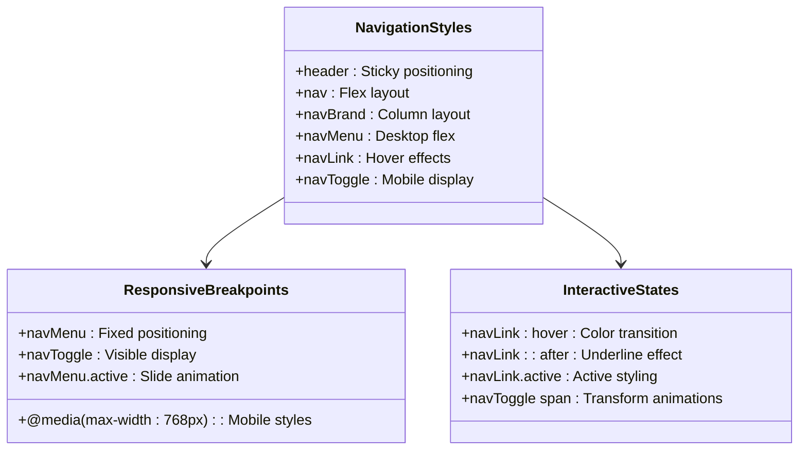
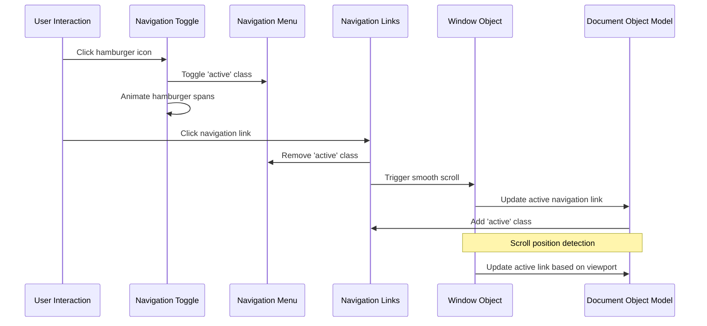
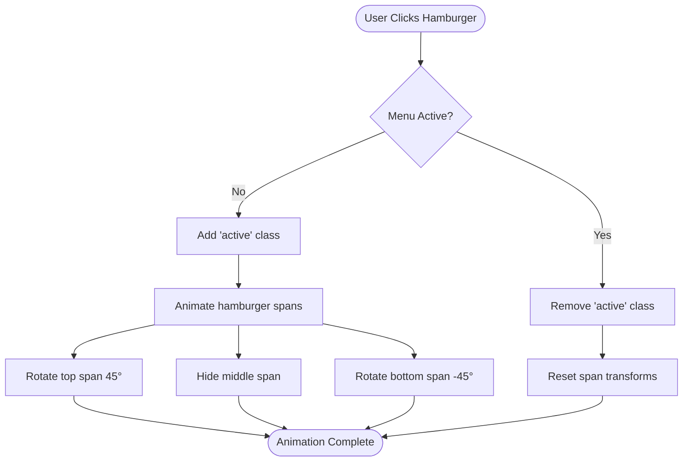
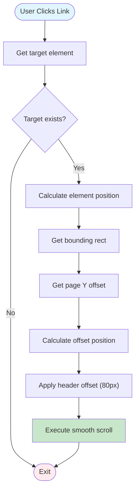
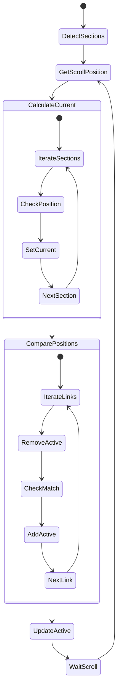
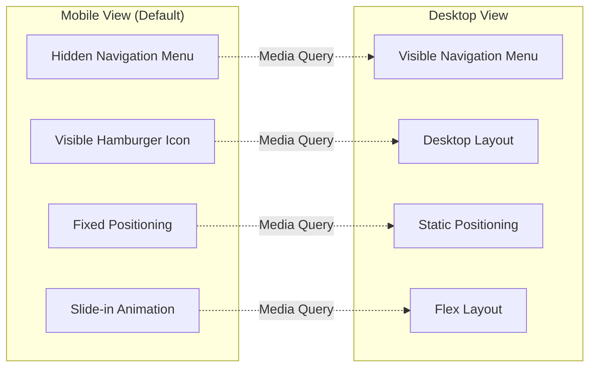

# Navigation System

<cite>
**Referenced Files in This Document**
- [main.js](file://js/main.js)
- [index.html](file://index.html)
- [contact.html](file://contact.html)
- [style.css](file://css/style.css)
</cite>

## Table of Contents
1. [Introduction](#introduction)
2. [Project Structure](#project-structure)
3. [Core Components](#core-components)
4. [Architecture Overview](#architecture-overview)
5. [Detailed Component Analysis](#detailed-component-analysis)
6. [Responsive Design Implementation](#responsive-design-implementation)
7. [Accessibility Features](#accessibility-features)
8. [Cross-Browser Compatibility](#cross-browser-compatibility)
9. [Customization Options](#customization-options)
10. [Integration Guide](#integration-guide)
11. [Performance Considerations](#performance-considerations)
12. [Troubleshooting Guide](#troubleshooting-guide)
13. [Conclusion](#conclusion)

## Introduction

The navigation system is a comprehensive responsive navigation solution built with modern web standards. It features a mobile-first hamburger menu, smooth scrolling functionality, active link highlighting based on scroll position, and seamless integration with the website's styling framework. The system provides an optimal user experience across all device sizes while maintaining excellent accessibility standards.

## Project Structure

The navigation system is implemented through a coordinated effort between HTML markup, CSS styling, and JavaScript functionality:



**Diagram sources**
- [index.html:26-47](file://index.html#L26-L47)
- [style.css:44-145](file://css/style.css#L44-L145)
- [main.js:4-42](file://js/main.js#L4-L42)

**Section sources**
- [index.html:26-47](file://index.html#L26-L47)
- [contact.html:22-43](file://contact.html#L22-L43)
- [style.css:44-145](file://css/style.css#L44-L145)

## Core Components

### Navigation Markup Structure

The navigation system consists of three primary HTML elements:

1. **Header Container**: Contains the entire navigation structure
2. **Navigation Brand**: Displays company name and tagline
3. **Mobile Toggle Button**: Hamburger icon for mobile devices
4. **Navigation Menu**: List of navigation links
5. **Navigation Links**: Individual menu items with smooth scrolling

### CSS Styling Architecture

The navigation styling follows a modular approach with separate concerns for desktop and mobile experiences:



**Diagram sources**
- [style.css:46-145](file://css/style.css#L46-L145)
- [style.css:1258-1310](file://css/style.css#L1258-L1310)

**Section sources**
- [style.css:46-145](file://css/style.css#L46-L145)
- [style.css:1258-1310](file://css/style.css#L1258-L1310)

## Architecture Overview

The navigation system operates through a sophisticated event-driven architecture that manages multiple concurrent processes:



**Diagram sources**
- [main.js:4-42](file://js/main.js#L4-L42)
- [main.js:236-260](file://js/main.js#L236-L260)

## Detailed Component Analysis

### Mobile Hamburger Menu Toggle

The mobile navigation system implements a sophisticated toggle mechanism with animated hamburger icons:



**Diagram sources**
- [main.js:10-27](file://js/main.js#L10-L27)

The hamburger animation creates a smooth transformation effect using CSS transforms and opacity changes, providing clear visual feedback to users.

**Section sources**
- [main.js:10-27](file://js/main.js#L10-L27)
- [style.css:130-144](file://css/style.css#L130-L144)

### Smooth Scrolling Implementation

The smooth scrolling functionality provides enhanced user experience through precise positioning calculations:



**Diagram sources**
- [main.js:47-62](file://js/main.js#L47-L62)

The implementation accounts for fixed header heights and provides consistent scrolling behavior across different screen sizes.

**Section sources**
- [main.js:47-62](file://js/main.js#L47-L62)

### Active Link Highlighting System

The active navigation link system uses scroll position detection to dynamically highlight the current section:



**Diagram sources**
- [main.js:236-260](file://js/main.js#L236-L260)

The system efficiently manages class assignments and maintains optimal performance during scroll events.

**Section sources**
- [main.js:236-260](file://js/main.js#L236-L260)

## Responsive Design Implementation

### Mobile-First Approach

The navigation system follows a mobile-first design philosophy with progressive enhancement for larger screens:



**Diagram sources**
- [style.css:1258-1310](file://css/style.css#L1258-L1310)

### Breakpoint Configuration

The system utilizes strategic breakpoints to optimize the user experience across different device categories:

| Breakpoint | Device Type | Navigation Behavior |
|------------|-------------|-------------------|
| 768px and below | Mobile devices | Hamburger menu, slide-in animation |
| 769px to 992px | Tablets | Enhanced touch targets, improved spacing |
| 993px and above | Desktop | Full navigation bar, hover effects |

**Section sources**
- [style.css:1239-1329](file://css/style.css#L1239-L1329)

## Accessibility Features

### Keyboard Navigation Support

The navigation system provides comprehensive keyboard accessibility:

- **Focus Management**: Clear visual focus indicators for all interactive elements
- **Keyboard Shortcuts**: Tab navigation through menu items
- **Screen Reader Compatibility**: Proper ARIA attributes and semantic markup
- **High Contrast Support**: Enhanced visibility for users with visual impairments

### ARIA Implementation

The navigation includes essential ARIA attributes for assistive technology:

```html
<button class="nav-toggle" aria-label="Toggle menu" aria-expanded="false" aria-controls="nav-menu">
    <span></span>
    <span></span>
    <span></span>
</button>
```

**Section sources**
- [index.html:32](file://index.html#L32)
- [contact.html:28](file://contact.html#L28)

## Cross-Browser Compatibility

### Modern Browser Support

The navigation system is designed for broad browser compatibility:

- **Chrome**: Full support with smooth animations
- **Firefox**: CSS transitions and transforms fully supported
- **Safari**: WebKit-specific optimizations applied
- **Edge**: Progressive enhancement for older versions
- **Internet Explorer**: Graceful degradation with fallbacks

### Feature Detection and Polyfills

The system implements feature detection to ensure graceful degradation:

```javascript
// Smooth scrolling feature detection
if ('scrollBehavior' in document.documentElement.style) {
    // Native smooth scrolling supported
} else {
    // Fallback to polyfill or basic scroll
}
```

**Section sources**
- [main.js:26-42](file://js/main.js#L26-L42)

## Customization Options

### Styling Modifications

The navigation system offers extensive customization possibilities:

#### Color Scheme Customization
- Primary color variables for links and accents
- Hover effects and transitions
- Active state styling
- Mobile menu background colors

#### Typography Adjustments
- Font family and weights
- Link text sizing and spacing
- Brand typography variations
- Responsive font scaling

#### Animation Customization
- Transition durations and easing functions
- Hamburger animation timing
- Menu slide-in/out effects
- Scroll position detection intervals

### JavaScript Configuration

The navigation system can be easily customized through configuration options:

```javascript
const navigationConfig = {
    headerOffset: 80,           // Offset for fixed headers
    activeThreshold: 100,       // Threshold for active link detection
    animationDuration: 300,     // Menu toggle animation duration
    scrollBehavior: 'smooth'    // Scroll behavior preference
};
```

**Section sources**
- [main.js:52-59](file://js/main.js#L52-L59)
- [main.js:246-248](file://js/main.js#L246-L248)

## Integration Guide

### Adding Navigation to Additional Pages

The navigation system can be seamlessly integrated into additional pages:

1. **Copy HTML Structure**: Use the existing navigation markup as a template
2. **Update Links**: Modify href attributes to match new page structure
3. **Adjust Active States**: Configure active link detection for new sections
4. **Style Integration**: Ensure CSS styling matches page content

### Multi-Page Navigation

For websites with multiple pages, implement cross-page navigation:

```html
<!-- Example for multi-page setup -->
<li><a href="index.html#services" class="nav-link">Services</a></li>
<li><a href="contact.html" class="nav-link">Contact</a></li>
```

**Section sources**
- [contact.html:34-40](file://contact.html#L34-L40)

## Performance Considerations

### Optimized Event Handling

The navigation system implements efficient event handling strategies:

- **Debounced Scroll Events**: Throttled scroll position updates
- **Efficient DOM Queries**: Cached element references
- **Conditional Animations**: Only animate when necessary
- **Memory Management**: Proper event listener cleanup

### CSS Performance Optimization

The styling system minimizes repaint and reflow operations:

- **Transform-Based Animations**: Hardware-accelerated transforms
- **Reduced DOM Manipulation**: CSS classes instead of inline styles
- **Efficient Selectors**: Specific and performant CSS selectors
- **Minimized Layout Thrashing**: Batched DOM updates

**Section sources**
- [main.js:259](file://js/main.js#L259)
- [style.css:130-144](file://css/style.css#L130-L144)

## Troubleshooting Guide

### Common Issues and Solutions

#### Navigation Menu Not Appearing on Mobile
- **Cause**: CSS media query conflicts
- **Solution**: Verify `@media (max-width: 768px)` styles are loading
- **Debug**: Check console for CSS errors

#### Smooth Scrolling Not Working
- **Cause**: Target element not found or positioned incorrectly
- **Solution**: Ensure target elements have proper ID attributes
- **Debug**: Verify element existence in DOM inspector

#### Active Link Highlighting Issues
- **Cause**: Section ID mismatches or scroll position calculation errors
- **Solution**: Align section IDs with navigation links
- **Debug**: Monitor scroll position and section boundaries

#### Hamburger Animation Problems
- **Cause**: CSS transform conflicts or JavaScript execution timing
- **Solution**: Check for CSS specificity issues
- **Debug**: Verify span element selection and transform properties

### Performance Debugging

#### Scroll Performance Issues
- **Monitor**: Use browser performance tools to identify bottlenecks
- **Optimize**: Reduce DOM queries during scroll events
- **Measure**: Track frame rate and scroll responsiveness

#### Memory Leaks Prevention
- **Cleanup**: Remove event listeners when components unmount
- **References**: Avoid circular references in JavaScript objects
- **Monitoring**: Use memory profiling tools to detect leaks

**Section sources**
- [main.js:328-331](file://js/main.js#L328-L331)

## Conclusion

The navigation system represents a comprehensive solution for modern web applications, combining responsive design principles with advanced JavaScript functionality. Its modular architecture ensures maintainability while providing an exceptional user experience across all devices and browsers.

Key strengths of the implementation include:

- **Responsive Design**: Mobile-first approach with progressive enhancement
- **Performance Optimization**: Efficient event handling and minimal DOM manipulation
- **Accessibility Compliance**: Comprehensive ARIA support and keyboard navigation
- **Cross-Browser Compatibility**: Graceful degradation and feature detection
- **Extensibility**: Easy customization and integration capabilities

The system serves as a robust foundation for building scalable navigation experiences that adapt to evolving web standards and user expectations.