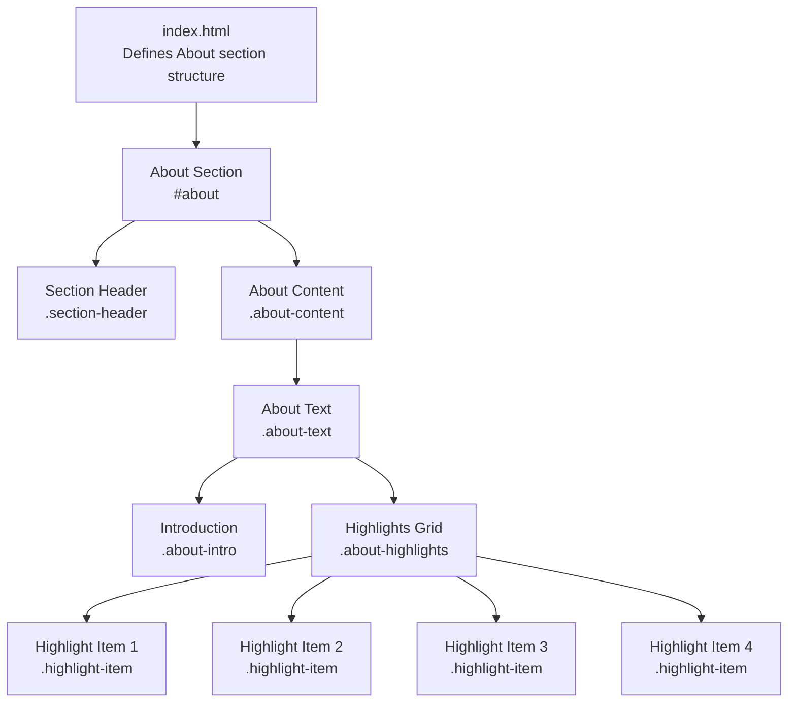
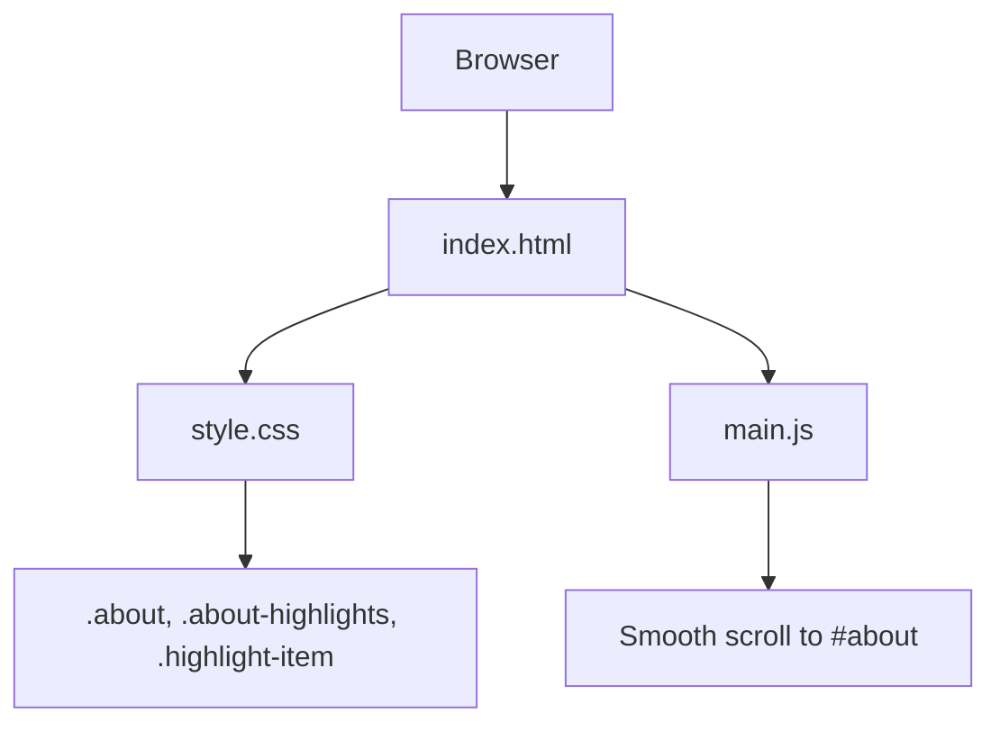
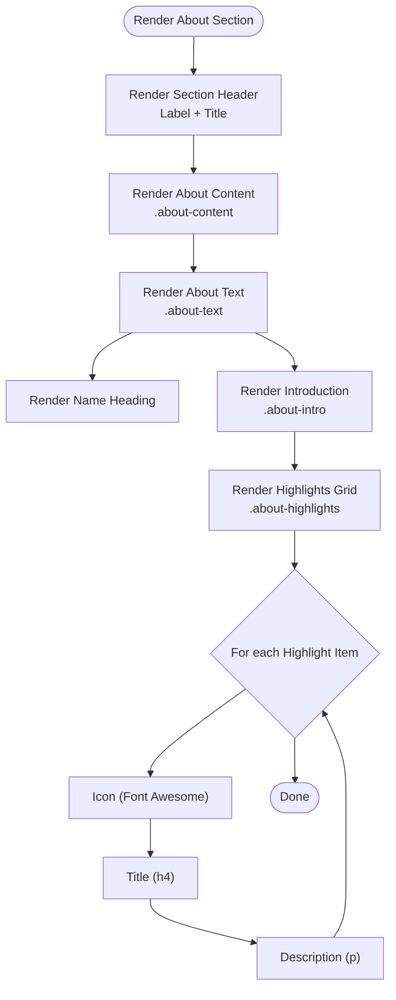
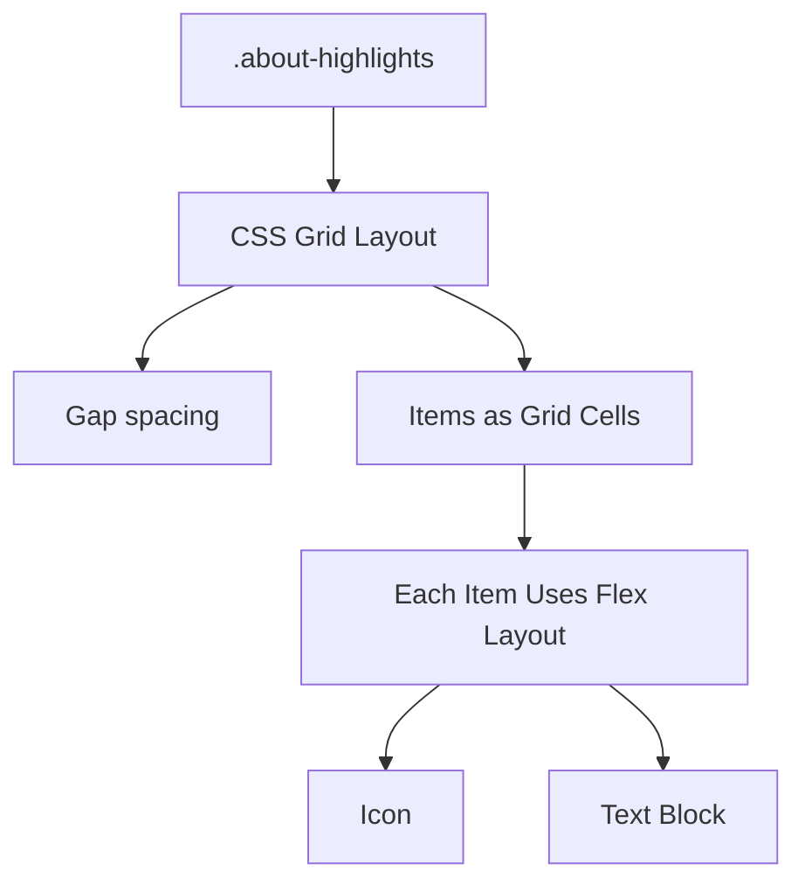
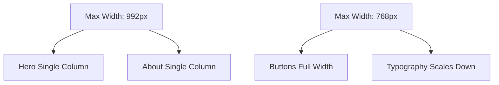
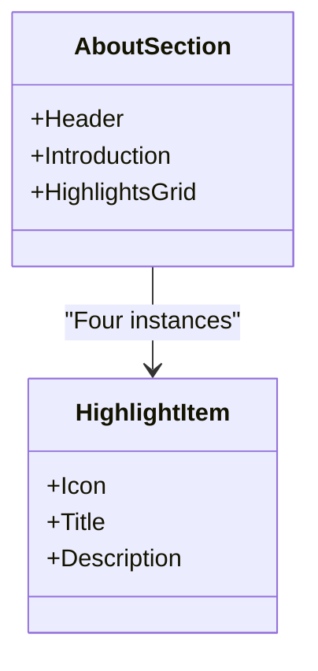
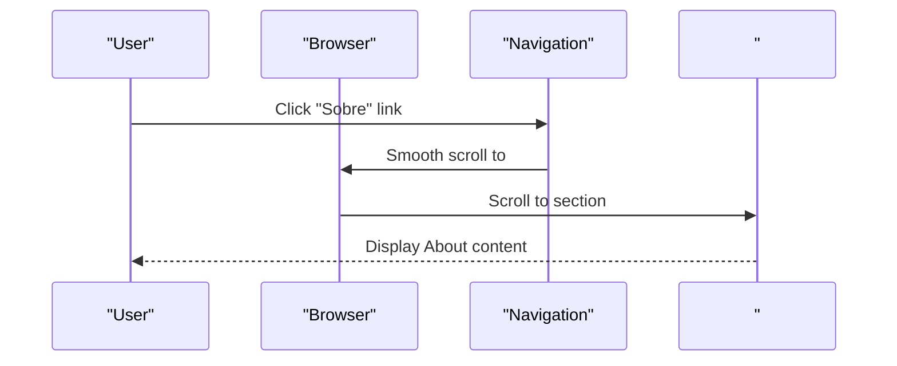
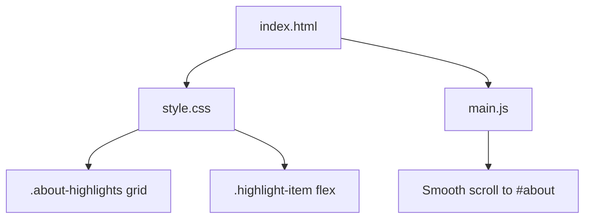

# About Section

<cite>
**Referenced Files in This Document**
- [index.html](file://index.html)
- [style.css](file://css/style.css)
- [README.md](file://README.md)
- [main.js](file://js/main.js)
</cite>

## Table of Contents
1. [Introduction](#introduction)
2. [Project Structure](#project-structure)
3. [Core Components](#core-components)
4. [Architecture Overview](#architecture-overview)
5. [Detailed Component Analysis](#detailed-component-analysis)
6. [Dependency Analysis](#dependency-analysis)
7. [Performance Considerations](#performance-considerations)
8. [Troubleshooting Guide](#troubleshooting-guide)
9. [Conclusion](#conclusion)

## Introduction
This document provides comprehensive guidance for the About section that showcases professor credentials and experience. It explains the HTML structure, CSS grid layout for highlights, responsive design behavior, and how to maintain visual consistency and accessibility while customizing content for different instructor profiles. It also covers the four key differentiators highlighted in the current implementation: international experience, corporate/TI background, TEFL certification, and cultural understanding.

## Project Structure
The About section resides within the main landing page and is composed of:
- A section header with label and title
- A professor introduction paragraph
- A highlights grid containing four credential items, each with an icon and descriptive text

**Diagram sources**
- [index.html:110-158](file://index.html#L110-L158)

**Section sources**
- [index.html:110-158](file://index.html#L110-L158)
- [README.md:28-40](file://README.md#L28-L40)

## Core Components
- Section container with ID for navigation targeting
- Section header with label and title
- Introduction paragraph with emphasis on native speaker background and Brazilian experience
- Highlights grid with four items, each featuring:
  - Icon (Font Awesome)
  - Heading describing the credential/differentiator
  - Supporting paragraph with details

Key elements and selectors:
- Container: section#about.about
- Header: .section-header with .section-label and .section-title
- Content: .about-content
- Text area: .about-text with .about-intro
- Highlights: .about-highlights.grid
- Individual item: .highlight-item with .highlight-item i, h4, p

**Section sources**
- [index.html:110-158](file://index.html#L110-L158)
- [style.css:326-376](file://css/style.css#L326-L376)

## Architecture Overview
The About section is a self-contained module within the landing page. It relies on:
- HTML semantics for content structure
- CSS Grid for responsive layout
- Font Awesome for icons
- Minimal JavaScript for smooth scrolling and navigation

**Diagram sources**
- [index.html:110-158](file://index.html#L110-L158)
- [style.css:326-376](file://css/style.css#L326-L376)
- [main.js:47-62](file://js/main.js#L47-L62)

## Detailed Component Analysis

### HTML Structure
The About section is defined with:
- A section wrapper with ID for navigation
- A centered header with label and title
- A content area containing:
  - A heading for the professor’s name
  - An introductory paragraph highlighting native speaker status and Brazilian experience
  - A grid of four highlight items, each with an icon and text

**Diagram sources**
- [index.html:110-158](file://index.html#L110-L158)

**Section sources**
- [index.html:110-158](file://index.html#L110-L158)

### CSS Grid Layout for Highlights
The highlights are laid out using CSS Grid:
- The grid container is .about-highlights with a fixed gap
- Items are .highlight-item blocks arranged in a single column on small screens and automatically adjusted on larger screens
- Each item displays an icon and text in a horizontal flex layout

Responsive behavior:
- On tablets and smaller, the grid collapses to a single column
- On larger screens, the grid remains a single column but items can stack vertically due to the grid’s automatic fitting

**Diagram sources**
- [style.css:347-376](file://css/style.css#L347-L376)

**Section sources**
- [style.css:347-376](file://css/style.css#L347-L376)

### Responsive Design Implementation
The About section benefits from global responsive rules:
- On tablets and smaller, the hero section switches to a single-column layout, and the About content maintains a single-column grid
- On phones, buttons and CTAs become full-width, and typography scales down appropriately

**Diagram sources**
- [style.css:1239-1329](file://css/style.css#L1239-L1329)

**Section sources**
- [style.css:1239-1329](file://css/style.css#L1239-L1329)

### Four Key Differentiators
The current implementation highlights four distinct credentials/differentiators:
1. International experience
2. Corporate/TI background
3. TEFL certification
4. Cultural understanding

These are represented as four .highlight-item entries under .about-highlights, each with a descriptive heading and paragraph.

**Diagram sources**
- [index.html:125-154](file://index.html#L125-L154)

**Section sources**
- [index.html:125-154](file://index.html#L125-L154)

### Adding New Highlight Items
To add a new highlight item:
1. Duplicate an existing .highlight-item inside .about-highlights
2. Replace the Font Awesome icon class with a new icon
3. Update the h4 title and p description to reflect the new credential/differentiator
4. Ensure the item remains within .about-highlights to inherit grid and spacing styles

Example steps:
- Copy the structure of one of the existing items
- Modify the icon class inside the i tag
- Adjust the h4 and p content
- Keep the outer div with class .highlight-item

**Section sources**
- [index.html:125-154](file://index.html#L125-L154)

### Modifying Iconography
Icons are Font Awesome classes applied to i tags within each .highlight-item. To change an icon:
- Locate the i tag inside the desired .highlight-item
- Replace the class attribute with another Font Awesome icon class
- Verify the new icon renders correctly and maintains visual balance with the text

Accessibility note:
- Icons are decorative; ensure they complement the text and do not replace meaningful text

**Section sources**
- [index.html:125-154](file://index.html#L125-L154)

### Customizing Content for Different Profiles
To adapt the About section for different instructors:
- Update the professor’s name in the .about-text h3
- Revise the .about-intro paragraph to reflect the new instructor’s background, certifications, and cultural insights
- Adjust the four .highlight-item entries to match the new instructor’s credentials and experience
- Keep the HTML structure intact to preserve styling and responsiveness

**Section sources**
- [index.html:118-154](file://index.html#L118-L154)

### Maintaining Visual Consistency
- Preserve the .about-highlights grid and .highlight-item classes to keep consistent spacing and layout
- Keep the .about-intro paragraph and .about-text container to maintain typography and alignment
- Maintain the Font Awesome icon classes for uniform icon sizing and color

**Section sources**
- [style.css:347-376](file://css/style.css#L347-L376)

### Accessibility Compliance
- Headings: Use h3 for the professor’s name and h4 for each highlight title; keep a logical heading hierarchy
- Contrast: Ensure sufficient contrast between text and background for readability
- Focus: Maintain focus styles for interactive elements (navigation, buttons)
- ARIA: Add aria-label attributes to decorative icons if needed, or rely on surrounding text for context

**Section sources**
- [index.html:118-154](file://index.html#L118-L154)
- [style.css:326-376](file://css/style.css#L326-L376)

## Architecture Overview
The About section integrates with the rest of the page via:
- Navigation anchors to #about
- Shared section styling via .section-header and .section-title
- Global responsive breakpoints affecting layout on smaller screens

**Diagram sources**
- [index.html:39](file://index.html#L39)
- [main.js:47-62](file://js/main.js#L47-L62)

**Section sources**
- [index.html:39](file://index.html#L39)
- [main.js:47-62](file://js/main.js#L47-L62)

## Dependency Analysis
- HTML depends on CSS for styling and layout
- CSS defines the grid and flex properties for the highlights
- JavaScript enables smooth scrolling to the #about section

**Diagram sources**
- [index.html:110-158](file://index.html#L110-L158)
- [style.css:347-376](file://css/style.css#L347-L376)
- [main.js:47-62](file://js/main.js#L47-L62)

**Section sources**
- [index.html:110-158](file://index.html#L110-L158)
- [style.css:347-376](file://css/style.css#L347-L376)
- [main.js:47-62](file://js/main.js#L47-L62)

## Performance Considerations
- Keep the number of icons minimal and use efficient Font Awesome classes
- Avoid heavy animations or excessive DOM nesting within the highlights grid
- Maintain a single-column layout on small screens to reduce rendering complexity

## Troubleshooting Guide
Common issues and resolutions:
- Icons not displaying:
  - Ensure Font Awesome is linked in the head
  - Verify the icon class exists and is spelled correctly
- Misaligned text or icons:
  - Confirm the .highlight-item uses flex layout
  - Check that the i tag is inside the .highlight-item
- Layout breaks on small screens:
  - Confirm responsive breakpoints are applied
  - Ensure .about-highlights remains a single-column grid on smaller screens

**Section sources**
- [index.html:21](file://index.html#L21)
- [style.css:347-376](file://css/style.css#L347-L376)
- [style.css:1239-1329](file://css/style.css#L1239-L1329)

## Conclusion
The About section effectively communicates professor credentials and experience through a clean, accessible structure and a responsive grid layout. By preserving the HTML and CSS patterns outlined here, you can confidently add new highlight items, adjust iconography, and tailor the content for different instructor profiles while maintaining visual consistency and accessibility across devices.