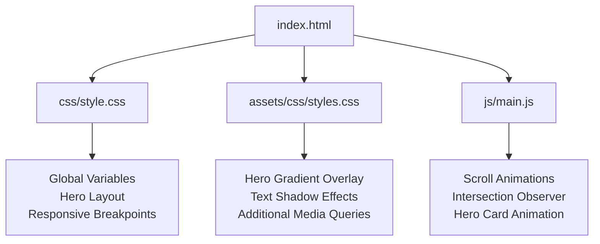
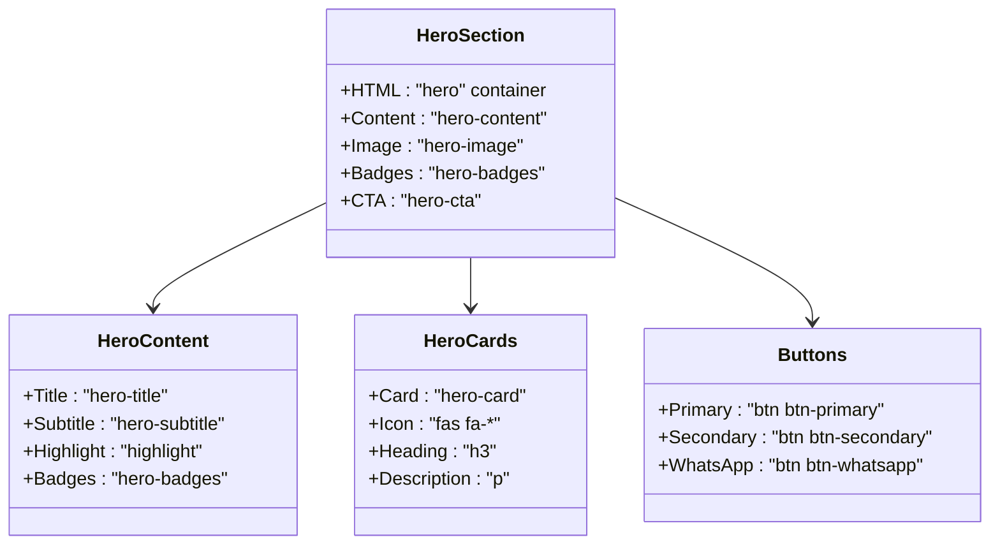
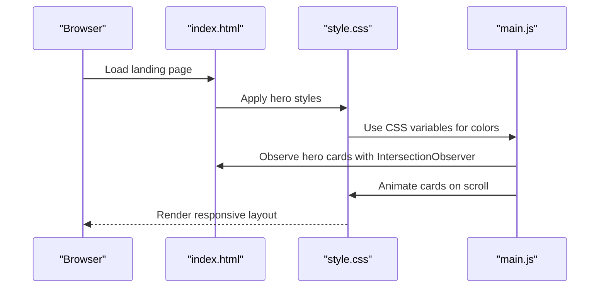
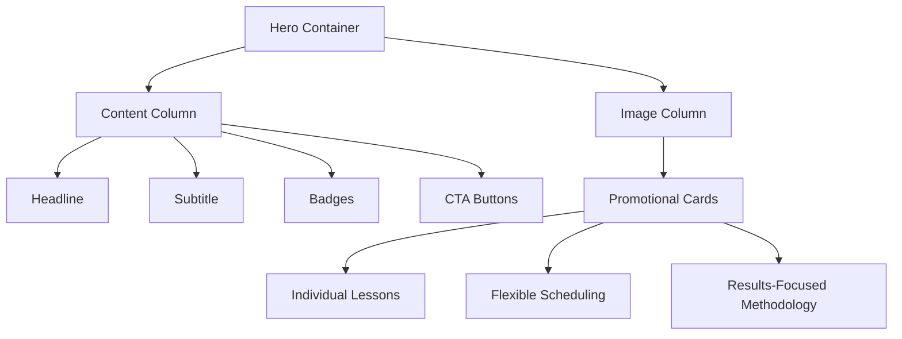
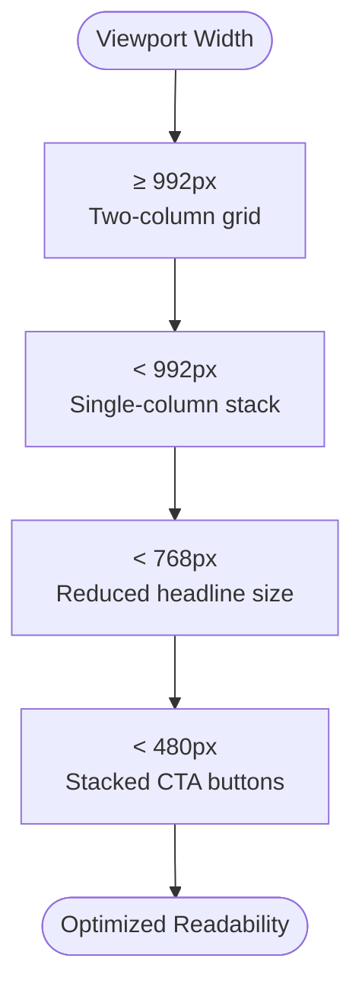
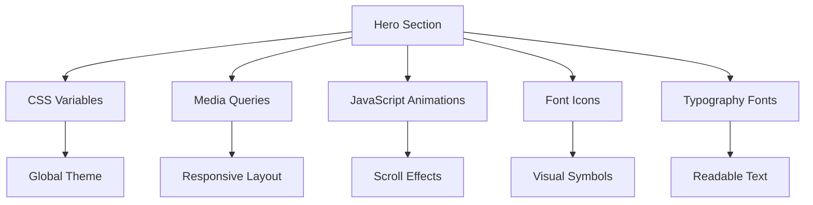

# Hero Section

<cite>
**Referenced Files in This Document**
- [index.html](file://index.html)
- [style.css](file://css/style.css)
- [styles.css](file://assets/css/styles.css)
- [main.js](file://js/main.js)
- [README.md](file://README.md)
</cite>

## Table of Contents
1. [Introduction](#introduction)
2. [Project Structure](#project-structure)
3. [Core Components](#core-components)
4. [Architecture Overview](#architecture-overview)
5. [Detailed Component Analysis](#detailed-component-analysis)
6. [Dependency Analysis](#dependency-analysis)
7. [Performance Considerations](#performance-considerations)
8. [Troubleshooting Guide](#troubleshooting-guide)
9. [Conclusion](#conclusion)

## Introduction
This document provides comprehensive guidance for implementing and customizing the hero section on the landing page. It covers the complete HTML structure, CSS styling, responsive design patterns, visual hierarchy, promotional cards, customization techniques, color scheme modification via CSS variables, responsive breakpoint adjustments, performance optimization tips, and accessibility considerations.

## Project Structure
The hero section resides within the main landing page and is styled using two primary CSS files:
- The main stylesheet defines global variables, hero layout, typography, and responsive breakpoints.
- An additional stylesheet provides supplementary hero styling and responsive enhancements.

**Diagram sources**
- [index.html:49-89](file://index.html#L49-L89)
- [style.css:10-24](file://css/style.css#L10-L24)
- [style.css:149-231](file://css/style.css#L149-L231)
- [styles.css:20-77](file://assets/css/styles.css#L20-L77)
- [main.js:202-231](file://js/main.js#L202-L231)

**Section sources**
- [index.html:49-89](file://index.html#L49-L89)
- [style.css:10-24](file://css/style.css#L10-L24)
- [style.css:149-231](file://css/style.css#L149-L231)
- [styles.css:20-77](file://assets/css/styles.css#L20-L77)
- [main.js:202-231](file://js/main.js#L202-L231)

## Core Components
The hero section consists of:
- Main headline with highlighted emphasis
- Subtitle with contextual information
- Certification badges with iconography
- Call-to-action buttons (primary and secondary)
- Three promotional cards (individual lessons, flexible scheduling, results-focused methodology) with icons and content

**Diagram sources**
- [index.html:50-89](file://index.html#L50-L89)
- [style.css:149-231](file://css/style.css#L149-L231)

**Section sources**
- [index.html:50-89](file://index.html#L50-L89)
- [style.css:149-231](file://css/style.css#L149-L231)

## Architecture Overview
The hero section integrates with the global design system through CSS variables and responsive media queries. JavaScript enhances the user experience with scroll-triggered animations for promotional cards.

**Diagram sources**
- [index.html:49-89](file://index.html#L49-L89)
- [style.css:10-24](file://css/style.css#L10-L24)
- [style.css:1239-1329](file://css/style.css#L1239-L1329)
- [main.js:202-231](file://js/main.js#L202-L231)

## Detailed Component Analysis

### HTML Structure
The hero section markup organizes content into a grid layout with content on the left and promotional cards on the right. The structure includes:
- Headline with emphasis class for accent color
- Subtitle with line break for readability
- Badge list with certification icons
- Dual CTA buttons (primary and secondary)
- Three promotional cards with icons and descriptive text

**Section sources**
- [index.html:50-89](file://index.html#L50-L89)

### CSS Styling and Visual Hierarchy
The hero styling establishes a strong visual hierarchy:
- Typography scales from large headline to medium subtitle and smaller badge text
- Accent color highlights key phrases for emphasis
- Background gradient creates depth while maintaining text contrast
- Promotional cards use backdrop blur and subtle borders for modern appearance

**Diagram sources**
- [style.css:149-231](file://css/style.css#L149-L231)
- [index.html:50-89](file://index.html#L50-L89)

**Section sources**
- [style.css:149-231](file://css/style.css#L149-L231)
- [index.html:50-89](file://index.html#L50-L89)

### Responsive Design Patterns
The hero section adapts across screen sizes:
- Desktop: Two-column grid layout with content and cards side-by-side
- Tablet: Single-column stacked layout for improved readability
- Mobile: Full-width single-column with adjusted typography and button stacking

**Diagram sources**
- [style.css:1239-1329](file://css/style.css#L1239-L1329)

**Section sources**
- [style.css:1239-1329](file://css/style.css#L1239-L1329)

### Promotional Cards Implementation
Each card follows a consistent pattern:
- Icon with accent color for visual emphasis
- Heading with medium font size
- Description with reduced opacity for hierarchy
- Glass-morphism effect with backdrop blur

**Section sources**
- [index.html:72-88](file://index.html#L72-L88)
- [style.css:209-231](file://css/style.css#L209-L231)

### Customization Guide

#### Modifying Hero Content
- Headline: Update the main headline text within the hero title element
- Subtitle: Modify the subtitle paragraph for additional context
- Badges: Add or remove badge items with appropriate icons
- CTA Buttons: Change button text, links, or add new variants

#### Color Scheme Modification
The hero section uses CSS variables for consistent theming:
- Primary colors: Adjust variables in the root section to change overall palette
- Accent color: Modify the accent variable for highlights and card icons
- Background gradient: Update the hero background values for different moods

#### Responsive Breakpoint Adjustment
- Desktop breakpoint: Modify the 992px media query for column layout changes
- Tablet breakpoint: Adjust the 768px media query for typography scaling
- Mobile breakpoint: Fine-tune the 480px media query for button stacking

**Section sources**
- [style.css:10-24](file://css/style.css#L10-L24)
- [style.css:1239-1329](file://css/style.css#L1239-L1329)

### Accessibility Considerations
The hero section incorporates several accessibility features:
- Semantic HTML structure with proper heading hierarchy
- Text contrast maintained against gradient backgrounds
- Focus states for interactive elements
- Screen reader friendly labels for icons
- Reduced motion preferences respected through CSS transitions

**Section sources**
- [index.html:50-89](file://index.html#L50-L89)
- [style.css:149-231](file://css/style.css#L149-L231)

## Dependency Analysis
The hero section relies on:
- CSS variables for consistent theming across components
- Media queries for responsive behavior
- JavaScript for scroll-triggered animations
- Font Awesome for iconography
- Google Fonts for typography

**Diagram sources**
- [style.css:10-24](file://css/style.css#L10-L24)
- [style.css:1239-1329](file://css/style.css#L1239-L1329)
- [main.js:202-231](file://js/main.js#L202-L231)

**Section sources**
- [style.css:10-24](file://css/style.css#L10-L24)
- [style.css:1239-1329](file://css/style.css#L1239-L1329)
- [main.js:202-231](file://js/main.js#L202-L231)

## Performance Considerations
- CSS variables reduce maintenance overhead and improve theme consistency
- Backdrop filters enhance visual appeal with minimal performance impact
- Intersection Observer optimizes animation performance by only observing visible elements
- Media queries prevent unnecessary reflows during responsive changes
- SVG icons load efficiently and scale without quality loss

## Troubleshooting Guide
Common issues and solutions:
- Text readability problems: Verify contrast ratios against gradient backgrounds
- Animation lag: Check browser support for backdrop filters and CSS transitions
- Mobile button overlap: Adjust media query breakpoints for button stacking
- Icon rendering issues: Ensure Font Awesome CDN is accessible
- Scroll animation not triggering: Verify Intersection Observer support and element selectors

**Section sources**
- [style.css:149-231](file://css/style.css#L149-L231)
- [main.js:202-231](file://js/main.js#L202-L231)

## Conclusion
The hero section provides a robust foundation for showcasing value propositions with modern design principles. Its modular structure, responsive behavior, and accessibility features make it adaptable to various contexts while maintaining performance and usability standards.