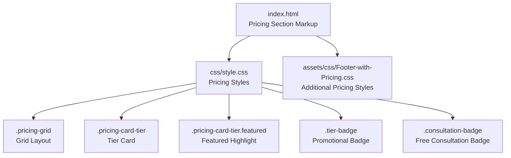
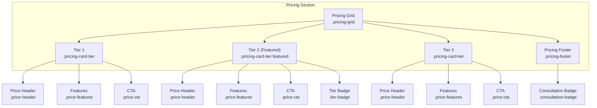
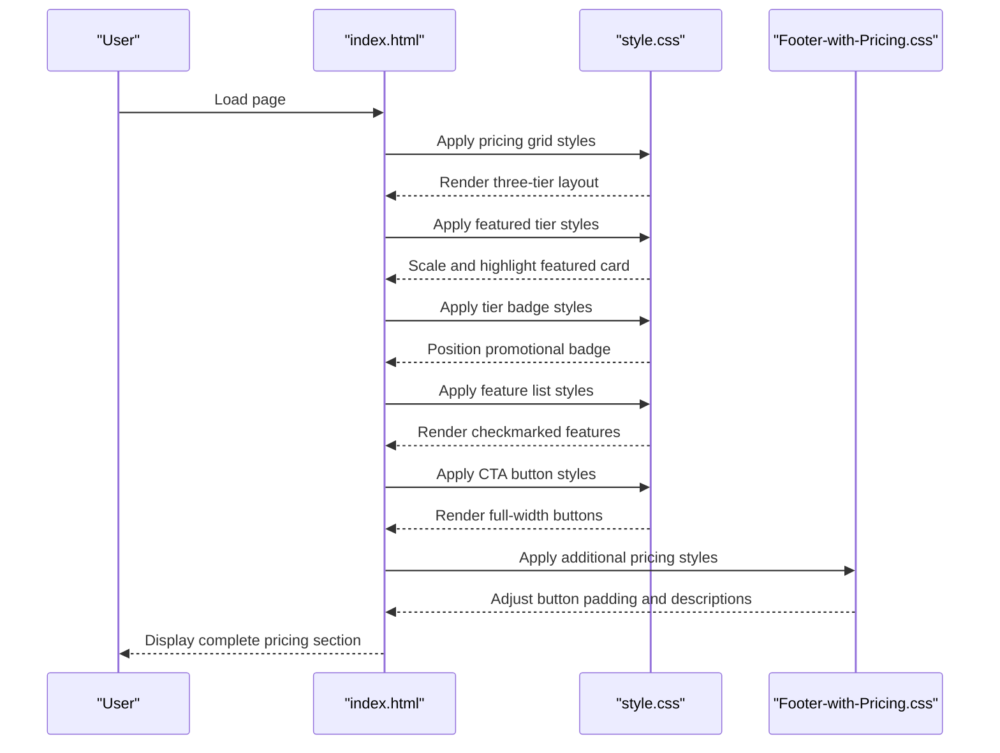
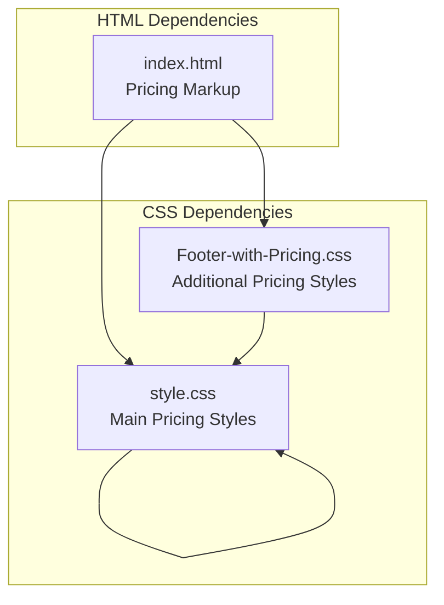

# Pricing Section

<cite>
**Referenced Files in This Document**
- [index.html](file://index.html)
- [style.css](file://css/style.css)
- [Footer-with-Pricing.css](file://assets/css/Footer-with-Pricing.css)
</cite>

## Table of Contents
1. [Introduction](#introduction)
2. [Project Structure](#project-structure)
3. [Core Components](#core-components)
4. [Architecture Overview](#architecture-overview)
5. [Detailed Component Analysis](#detailed-component-analysis)
6. [Dependency Analysis](#dependency-analysis)
7. [Performance Considerations](#performance-considerations)
8. [Troubleshooting Guide](#troubleshooting-guide)
9. [Conclusion](#conclusion)

## Introduction
This document provides comprehensive guidance for implementing and customizing the pricing section on the website. It covers the HTML structure for each pricing tier, CSS styling for the pricing grid layout, featured tier highlighting, promotional badges, and the pricing footer with free consultation promotion. It also explains how to customize pricing information, modify feature lists, add new pricing tiers, and implement promotional badges, along with overall pricing strategy recommendations.

## Project Structure
The pricing section is implemented within the main landing page and styled using centralized CSS. The key files involved are:
- index.html: Contains the pricing section markup with three pricing tiers and a promotional footer.
- css/style.css: Provides the primary pricing styles, including grid layout, featured tier highlighting, and responsive behavior.
- assets/css/Footer-with-Pricing.css: Offers additional pricing-specific styling for button sizing and descriptions.

**Diagram sources**
- [index.html:383-479](file://index.html#L383-L479)
- [style.css:1331-1530](file://css/style.css#L1331-L1530)
- [Footer-with-Pricing.css:1-10](file://assets/css/Footer-with-Pricing.css#L1-L10)

**Section sources**
- [index.html:383-479](file://index.html#L383-L479)
- [style.css:1331-1530](file://css/style.css#L1331-L1530)
- [Footer-with-Pricing.css:1-10](file://assets/css/Footer-with-Pricing.css#L1-L10)

## Core Components
The pricing section consists of:
- Pricing grid container with three pricing tiers
- Each tier card containing:
  - Price header with title, currency amount, and period
  - Feature list with checkmark icons
  - Call-to-action button
- Promotional footer with a free consultation badge and CTA

Key HTML elements and their roles:
- Container: pricing-grid
- Tier cards: pricing-card-tier (with optional featured modifier)
- Tier badge: tier-badge (used on the featured tier)
- Price header: price-header
- Price display: currency, amount, period
- Feature list: price-features
- Call-to-action: price-cta
- Consultation badge: consultation-badge

**Section sources**
- [index.html:393-464](file://index.html#L393-L464)
- [style.css:1334-1437](file://css/style.css#L1334-L1437)

## Architecture Overview
The pricing section follows a structured layout:
- A grid container holds three pricing cards
- Each card is a self-contained unit with a header, feature list, and CTA
- The featured tier is visually emphasized with a badge and scaling effect
- The footer promotes a free consultation with a prominent badge and CTA

**Diagram sources**
- [index.html:393-479](file://index.html#L393-L479)
- [style.css:1334-1443](file://css/style.css#L1334-L1443)

## Detailed Component Analysis

### Pricing Grid Layout
The pricing grid uses a CSS Grid layout to arrange three pricing cards in a responsive manner. On larger screens, the grid displays three columns; on smaller screens, it stacks into a single column with the featured tier elevated to the top.

Responsive behavior:
- Desktop: Three-column grid with equal spacing
- Tablet/Mobile: Single-column stack with featured tier ordered first

**Section sources**
- [style.css:1334-1341](file://css/style.css#L1334-L1341)
- [style.css:1445-1459](file://css/style.css#L1445-L1459)

### Pricing Tier Cards
Each tier card is a flexible container with:
- Consistent padding and shadow for depth
- Hover effects for interactivity
- Border accent for the featured tier
- Absolute positioning for the tier badge

Visual emphasis:
- Non-featured cards: subtle hover lift and shadow
- Featured card: scaling effect, border accent, raised z-index

**Section sources**
- [style.css:1343-1362](file://css/style.css#L1343-L1362)
- [index.html:415](file://index.html#L415)

### Price Headers
Each tier card includes a price header with:
- Tier title
- Currency symbol, amount, and period
- Consistent typography and spacing

Styling highlights:
- Amount is prominently sized for visibility
- Period text is subdued for clarity
- Text alignment is centered for non-featured tiers and left-aligned for featured tier layout

**Section sources**
- [index.html:396-401](file://index.html#L396-L401)
- [index.html:418-423](file://index.html#L418-L423)
- [index.html:442-447](file://index.html#L442-L447)
- [style.css:1383-1410](file://css/style.css#L1383-L1410)

### Feature Lists
Feature lists are presented as styled unordered lists with:
- Left-aligned items
- Checkmark icons for each feature
- Subtle borders between items
- Consistent padding for readability

Customization tip:
- Add or remove list items to reflect tier benefits
- Maintain the icon structure for visual consistency

**Section sources**
- [index.html:403-408](file://index.html#L403-L408)
- [index.html:426-433](file://index.html#L426-L433)
- [index.html:450-458](file://index.html#L450-L458)
- [style.css:1419-1427](file://css/style.css#L1419-L1427)

### Call-to-Action Buttons
Each tier card includes a full-width CTA button:
- Full-width for mobile responsiveness
- Centered text for featured tier layout
- Color contrast optimized for accessibility
- Hover effects for interactivity

Button customization:
- Modify button text and links to match tier offerings
- Adjust colors via CSS variables for brand consistency

**Section sources**
- [index.html:409-413](file://index.html#L409-L413)
- [index.html:434-438](file://index.html#L434-L438)
- [index.html:459-463](file://index.html#L459-L463)
- [style.css:1429-1437](file://css/style.css#L1429-L1437)

### Promotional Badges
Two types of badges are used:
- Tier badge: Positioned above the featured tier card to indicate popularity
- Consultation badge: Prominent badge in the pricing footer promoting free consultation

Badge styling:
- Tier badge: Positioned absolutely at the top center with uppercase text and rounded corners
- Consultation badge: Large, rounded badge with icon and bold text for prominence

**Section sources**
- [index.html:415](file://index.html#L415)
- [index.html:466-477](file://index.html#L466-L477)
- [style.css:1368-1381](file://css/style.css#L1368-L1381)
- [style.css:1439-1443](file://css/style.css#L1439-L1443)

### Pricing Footer with Free Consultation Promotion
The pricing footer includes:
- Consultation badge with gift icon and bold text
- Descriptive paragraph encouraging evaluation
- Prominent CTA button for scheduling

Footer layout:
- Centered content with top border separation
- Responsive padding and spacing
- Accessible color contrast for readability

**Section sources**
- [index.html:466-477](file://index.html#L466-L477)
- [style.css:1439-1443](file://css/style.css#L1439-L1443)

## Architecture Overview

**Diagram sources**
- [index.html:383-479](file://index.html#L383-L479)
- [style.css:1331-1530](file://css/style.css#L1331-L1530)
- [Footer-with-Pricing.css:1-10](file://assets/css/Footer-with-Pricing.css#L1-L10)

## Detailed Component Analysis

### Three Pricing Tiers

#### Single Lesson Tier
- Structure: Standard tier card with centered layout
- Features: Basic lesson benefits with standard feature list
- CTA: Secondary button variant

Implementation reference:
- HTML structure: [index.html:393-414](file://index.html#L393-L414)
- Styling: [style.css:1343-1362](file://css/style.css#L1343-L1362)

#### Monthly Package Tier (Featured)
- Structure: Featured tier card with scaling effect
- Badge: "Mais Popular" positioned above the card
- Enhanced features: Additional support and study materials
- CTA: Primary button variant for conversion

Implementation reference:
- HTML structure: [index.html:414-439](file://index.html#L414-L439)
- Styling: [style.css:1358-1362](file://css/style.css#L1358-L1362)
- Badge styling: [style.css:1368-1381](file://css/style.css#L1368-L1381)

#### Intensive Package Tier
- Structure: Standard tier card with enhanced feature list
- Savings calculation: Visible savings display
- CTA: Secondary button variant

Implementation reference:
- HTML structure: [index.html:439-464](file://index.html#L439-L464)
- Savings display: [index.html:448](file://index.html#L448)
- Styling: [style.css:1343-1362](file://css/style.css#L1343-L1362)

### Savings Calculations
The intensive package displays a savings calculation:
- Shows per-lesson cost comparison
- Highlights total savings amount
- Uses secondary color for emphasis

Implementation reference:
- Savings display: [index.html:448](file://index.html#L448)
- Styling: [style.css:1412-1417](file://css/style.css#L1412-L1417)

### Customization Examples

#### Customizing Pricing Information
To modify pricing details:
1. Update the amount and period in the price header
2. Adjust the currency symbol and amount text
3. Modify the period text (e.g., per lesson, per month)

Reference locations:
- Amount and period: [index.html:398-401](file://index.html#L398-L401)
- Amount and period (featured): [index.html:421-423](file://index.html#L421-L423)
- Amount and period (intensive): [index.html:445-447](file://index.html#L445-L447)

#### Modifying Feature Lists
To change features:
1. Edit the list items within the feature list container
2. Maintain the checkmark icon structure for consistency
3. Ensure the list remains accessible and readable

Reference locations:
- Feature list (single lesson): [index.html:403-408](file://index.html#L403-L408)
- Feature list (monthly package): [index.html:426-433](file://index.html#L426-L433)
- Feature list (intensive package): [index.html:450-458](file://index.html#L450-L458)

#### Adding New Pricing Tiers
To add a new tier:
1. Duplicate an existing tier card structure
2. Assign a unique tier name and pricing details
3. Add tier-specific features
4. Position the tier within the grid container

Reference locations:
- Tier card structure: [index.html:393-414](file://index.html#L393-L414)
- Grid container: [index.html:393](file://index.html#L393)

#### Implementing Promotional Badges
To add promotional badges:
1. Insert a tier badge element above the featured tier
2. Customize badge text and styling
3. Ensure proper positioning and z-index stacking

Reference locations:
- Tier badge element: [index.html:415](file://index.html#L415)
- Badge styling: [style.css:1368-1381](file://css/style.css#L1368-L1381)

### Pricing Strategy Implementation
Recommended approach for pricing strategy:
- Use the featured tier as the primary conversion option
- Position the monthly package as the recommended choice
- Provide clear savings information for volume discounts
- Maintain consistent visual hierarchy across tiers
- Ensure mobile responsiveness with appropriate spacing and scaling

Best practices:
- Keep pricing amounts clear and prominent
- Use contrasting colors for CTAs against tier backgrounds
- Include brief descriptions for complex pricing structures
- Test different layouts for optimal conversion rates

**Section sources**
- [index.html:393-464](file://index.html#L393-L464)
- [style.css:1334-1443](file://css/style.css#L1334-L1443)

## Dependency Analysis

**Diagram sources**
- [index.html:383-479](file://index.html#L383-L479)
- [style.css:1331-1530](file://css/style.css#L1331-L1530)
- [Footer-with-Pricing.css:1-10](file://assets/css/Footer-with-Pricing.css#L1-L10)

**Section sources**
- [index.html:383-479](file://index.html#L383-L479)
- [style.css:1331-1530](file://css/style.css#L1331-L1530)
- [Footer-with-Pricing.css:1-10](file://assets/css/Footer-with-Pricing.css#L1-L10)

## Performance Considerations
- Grid layout ensures efficient rendering on modern browsers
- Minimal JavaScript dependency reduces load time
- CSS transforms for hover effects are GPU-accelerated
- Responsive breakpoints optimize mobile performance
- SVG icons provide scalable graphics without external dependencies

## Troubleshooting Guide
Common issues and solutions:
- Tier badge misalignment: Verify absolute positioning and transform properties
- Button overflow on small screens: Ensure full-width button styles are applied
- Feature list spacing inconsistencies: Check list item padding and border properties
- Mobile layout issues: Confirm media query breakpoints and grid template adjustments
- Color contrast problems: Review button and text color combinations against backgrounds

**Section sources**
- [style.css:1368-1381](file://css/style.css#L1368-L1381)
- [style.css:1429-1437](file://css/style.css#L1429-L1437)
- [style.css:1445-1459](file://css/style.css#L1445-L1459)

## Conclusion
The pricing section implementation provides a robust foundation for showcasing service offerings with clear visual hierarchy and responsive design. The modular structure allows for easy customization while maintaining consistent styling across tiers. By following the guidelines provided, teams can effectively modify pricing information, enhance feature presentations, and implement promotional strategies that drive conversions.