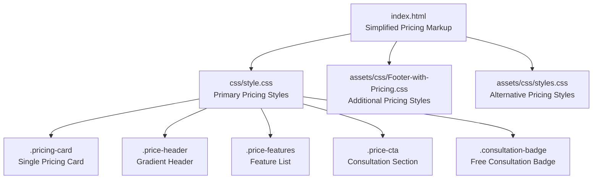
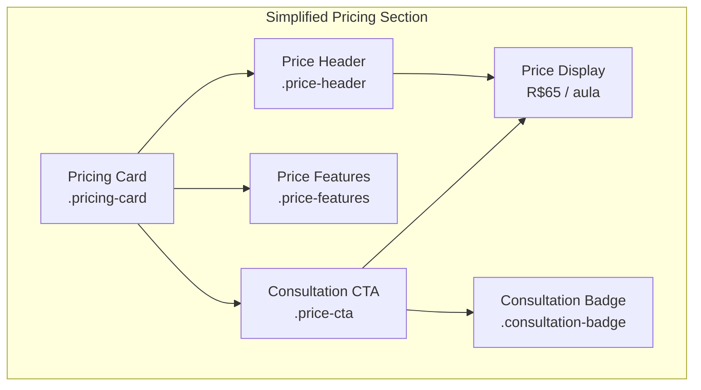
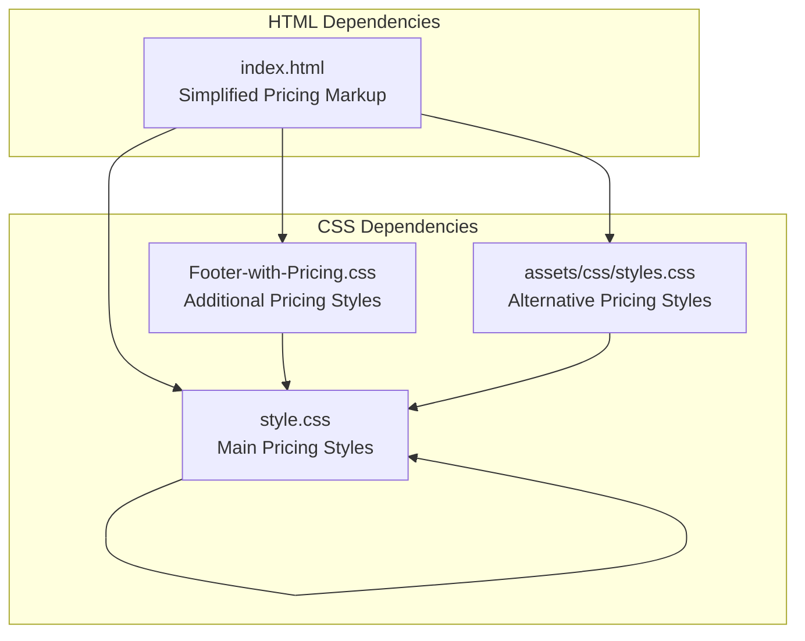

# Pricing Section

<cite>
**Referenced Files in This Document**
- [index.html](file://index.html)
- [style.css](file://css/style.css)
- [Footer-with-Pricing.css](file://assets/css/Footer-with-Pricing.css)
- [styles.css](file://assets/css/styles.css)
</cite>

## Update Summary
**Changes Made**
- Updated pricing section implementation to reflect simplified single-tier structure
- Removed documentation about three-tier pricing system (Single Lesson, Monthly Package, Intensive Package)
- Added documentation for single pricing card with transparent pricing model
- Updated architecture diagrams to show simplified pricing layout
- Revised customization examples to reflect new single-button approach
- Removed savings calculations and promotional badges specific to multi-tier system

## Table of Contents
1. [Introduction](#introduction)
2. [Project Structure](#project-structure)
3. [Core Components](#core-components)
4. [Architecture Overview](#architecture-overview)
5. [Detailed Component Analysis](#detailed-component-analysis)
6. [Dependency Analysis](#dependency-analysis)
7. [Performance Considerations](#performance-considerations)
8. [Troubleshooting Guide](#troubleshooting-guide)
9. [Conclusion](#conclusion)

## Introduction
This document provides comprehensive guidance for implementing and customizing the pricing section on the website. The pricing section has been redesigned to a simplified single-tier model that emphasizes transparent pricing and streamlined consultation process. The new approach eliminates the previous three-tier system (Individual Lesson, Monthly Package, Intensive Package) in favor of a single, clear pricing structure with prominent consultation opportunities.

The section features a single pricing card with transparent pricing, comprehensive feature list, and a prominent consultation badge that encourages free evaluation sessions. This simplified approach reduces decision complexity while maintaining pricing clarity and conversion optimization.

## Project Structure
The pricing section is implemented within the main landing page and styled using centralized CSS. The key files involved are:
- index.html: Contains the simplified pricing section markup with a single pricing card and consultation CTA
- css/style.css: Provides the primary pricing styles, including card layout, gradient backgrounds, and responsive behavior
- assets/css/Footer-with-Pricing.css: Offers additional pricing-specific styling for button sizing and descriptions
- assets/css/styles.css: Alternative pricing styling implementation with gradient backgrounds and enhanced visual effects

```mermaid
graph TB
IndexHTML["index.html<br/>Simplified Pricing Markup"] --> StyleCSS["css/style.css<br/>Primary Pricing Styles"]
IndexHTML --> FooterCSS["assets/css/Footer-with-Pricing.css<br/>Additional Pricing Styles"]
IndexHTML --> AssetsStyles["assets/css/styles.css<br/>Alternative Pricing Styles"]
StyleCSS --> PricingCard[".pricing-card<br/>Single Pricing Card"]
StyleCSS --> PriceHeader[".price-header<br/>Gradient Header"]
StyleCSS --> PriceFeatures[".price-features<br/>Feature List"]
StyleCSS --> PriceCTA[".price-cta<br/>Consultation Section"]
StyleCSS --> ConsultationBadge[".consultation-badge<br/>Free Consultation Badge"]
```

**Diagram sources**
- [index.html:394-436](file://index.html#L394-L436)
- [style.css:604-692](file://css/style.css#L604-L692)
- [Footer-with-Pricing.css:1-10](file://assets/css/Footer-with-Pricing.css#L1-L10)
- [styles.css:175-339](file://assets/css/styles.css#L175-L339)

**Section sources**
- [index.html:394-436](file://index.html#L394-L436)
- [style.css:604-692](file://css/style.css#L604-L692)
- [Footer-with-Pricing.css:1-10](file://assets/css/Footer-with-Pricing.css#L1-L10)
- [styles.css:175-339](file://assets/css/styles.css#L175-L339)

## Core Components
The pricing section consists of:
- Single pricing card container with gradient border and shadow
- Price header with transparent pricing display (R$65 per lesson)
- Comprehensive feature list with checkmark icons
- Consultation section with promotional badge and prominent CTA
- Prominent consultation badge encouraging free evaluation

Key HTML elements and their roles:
- Container: pricing-card
- Price header: price-header with gradient background
- Price display: currency (R$), amount (65), period (/ aula)
- Feature list: price-features with comprehensive benefits
- Consultation badge: consultation-badge with gift icon
- Consultation CTA: prominent button for free consultation scheduling

**Section sources**
- [index.html:404-434](file://index.html#L404-L434)
- [style.css:604-692](file://css/style.css#L604-L692)

## Architecture Overview
The pricing section follows a simplified single-card layout:
- A single pricing card serves as the primary pricing presentation
- Gradient header emphasizes the pricing information
- Comprehensive feature list provides complete value proposition
- Consultation section with badge and prominent CTA encourages evaluation
- Mobile-responsive design ensures optimal presentation across devices

```mermaid
graph TB
subgraph "Simplified Pricing Section"
PC["Pricing Card<br/>.pricing-card"]
PH["Price Header<br/>.price-header"]
PR["Price Display<br/>R$65 / aula"]
PF["Price Features<br/>.price-features"]
CB["Consultation Badge<br/>.consultation-badge"]
CTA["Consultation CTA<br/>.price-cta"]
end
PC --> PH
PC --> PF
PC --> CTA
PH --> PR
CTA --> CB
CTA --> PR
```

**Diagram sources**
- [index.html:404-434](file://index.html#L404-L434)
- [style.css:604-692](file://css/style.css#L604-L692)

## Detailed Component Analysis

### Single Pricing Card Layout
The pricing card uses a sophisticated design approach:
- Max-width constraint (600px) for optimal readability
- White background with blue border accent
- Elevated shadow for depth perception
- Rounded corners (20px) for modern appearance
- Responsive design that centers content on all devices

Visual characteristics:
- Gradient blue header with white text for high contrast
- Blue border (3px) indicating premium positioning
- Shadow effect (var(--shadow-hover)) for depth
- Overflow hidden to contain inner elements

**Section sources**
- [style.css:604-612](file://css/style.css#L604-L612)
- [index.html:404](file://index.html#L404)

### Price Header and Transparent Pricing
The price header presents transparent pricing information:
- Gradient blue background (#154275 to #0a2540)
- White text for excellent readability
- Centered text alignment for balanced presentation
- Generous padding (3rem 2rem) for visual comfort
- Clear pricing structure: currency (R$), amount (65), period (/ aula)

Typography emphasis:
- Large amount display (4rem font size)
- Subtle period text (1.25rem) with reduced opacity
- Strong font weights for visual hierarchy

**Section sources**
- [index.html:405-411](file://index.html#L405-L411)
- [style.css:614-646](file://css/style.css#L614-L646)

### Comprehensive Feature List
The feature list provides complete value proposition:
- Seven comprehensive features covering all service aspects
- Checkmark icons (green #25D366) for visual consistency
- Subtle borders between items for readability
- Left-aligned text with icon alignment
- Consistent padding (1rem) for visual rhythm

Feature coverage includes:
- 50 minutes of individual instruction
- 100% personalized learning objectives
- Included learning materials
- Flexible scheduling options
- Continuous feedback mechanisms
- WhatsApp support
- Multiple payment methods (PIX/transferência)

**Section sources**
- [index.html:413-421](file://index.html#L413-L421)
- [style.css:648-668](file://css/style.css#L648-L668)

### Consultation Section with Promotional Badge
The consultation section emphasizes free evaluation opportunities:
- Light gray background (#f8f9fa) for subtle distinction
- Centered content layout for balanced presentation
- Prominent consultation badge with gift icon
- Descriptive text explaining free consultation benefits
- Large primary button (btn-large) for prominent action

Badge design:
- Orange background (#E67E22) for attention-grabbing contrast
- White text with bold weight (600)
- Rounded design (10px radius) with inline-flex layout
- Icon integration (gift) for visual reinforcement

**Section sources**
- [index.html:422-434](file://index.html#L422-L434)
- [style.css:670-692](file://css/style.css#L670-L692)

### Simplified Pricing Structure
**Updated** The pricing section has been completely redesigned from a multi-tiered system to a simplified single-rate model:

- **Single pricing card** - Eliminates confusion from multiple pricing options
- **Transparent pricing** - Clear R$65 per lesson structure without hidden costs
- **Prominent consultation badge** - Encourages free evaluation sessions
- **Streamlined user experience** - Reduces decision complexity and increases conversion rates
- **Consistent messaging** - Focuses on individual lessons without package limitations

This simplification maintains pricing clarity while emphasizing the individual lesson format that works best for the target audience.

**Section sources**
- [index.html:394-436](file://index.html#L394-L436)
- [style.css:604-692](file://css/style.css#L604-L692)

### Pricing Strategy Implementation
Recommended approach for the simplified pricing strategy:
- Use the single pricing card as the primary conversion vehicle
- Emphasize transparency with clear R$65 per lesson pricing
- Leverage the consultation badge to reduce purchase hesitation
- Position the consultation CTA as the primary conversion point
- Maintain consistent visual hierarchy with gradient header and prominent button
- Ensure mobile responsiveness with appropriate spacing and scaling

Best practices:
- Keep pricing amounts clear and prominent in the header
- Use contrasting colors for CTAs against the gradient background
- Include brief descriptions for complex pricing structures
- Test different layouts for optimal conversion rates
- **Focus on the single consultation button** as the primary conversion point
- Ensure the consultation badge is prominently visible within the pricing card

**Section sources**
- [index.html:394-436](file://index.html#L394-L436)
- [style.css:604-692](file://css/style.css#L604-L692)

## Dependency Analysis

```mermaid
graph TB
subgraph "HTML Dependencies"
IH["index.html<br/>Simplified Pricing Markup"]
end
subgraph "CSS Dependencies"
SC["style.css<br/>Main Pricing Styles"]
FC["Footer-with-Pricing.css<br/>Additional Pricing Styles"]
AS["assets/css/styles.css<br/>Alternative Pricing Styles"]
end
IH --> SC
IH --> FC
IH --> AS
SC --> SC
FC --> SC
AS --> SC
```

**Diagram sources**
- [index.html:394-436](file://index.html#L394-L436)
- [style.css:604-692](file://css/style.css#L604-L692)
- [Footer-with-Pricing.css:1-10](file://assets/css/Footer-with-Pricing.css#L1-L10)
- [styles.css:175-339](file://assets/css/styles.css#L175-L339)

**Section sources**
- [index.html:394-436](file://index.html#L394-L436)
- [style.css:604-692](file://css/style.css#L604-L692)
- [Footer-with-Pricing.css:1-10](file://assets/css/Footer-with-Pricing.css#L1-L10)
- [styles.css:175-339](file://assets/css/styles.css#L175-L339)

## Performance Considerations
- Single pricing card reduces DOM complexity compared to multi-tier system
- Gradient backgrounds are efficiently rendered by modern browsers
- Minimal JavaScript dependency reduces load time
- CSS transforms for hover effects are GPU-accelerated
- Responsive breakpoints optimize mobile performance
- SVG icons provide scalable graphics without external dependencies
- **Simplified structure significantly reduces DOM complexity** and improves page load times

## Troubleshooting Guide
Common issues and solutions:
- Consultation badge misalignment: Verify inline-flex layout and transform properties
- Button overflow on small screens: Ensure full-width button styles are applied
- Feature list spacing inconsistencies: Check list item padding and border properties
- Mobile layout issues: Confirm max-width constraints and responsive breakpoints
- Color contrast problems: Review button and text color combinations against gradient backgrounds
- **Simplified structure validation**: Verify that the single pricing card displays consistently across all devices
- **Consultation CTA placement**: Ensure the prominent button is clearly visible within the pricing card

**Section sources**
- [style.css:676-692](file://css/style.css#L676-L692)
- [style.css:604-612](file://css/style.css#L604-L612)

## Conclusion
The simplified pricing section implementation provides an effective foundation for showcasing transparent pricing with clear conversion opportunities. The redesign from a multi-tiered system to a single, comprehensive pricing card eliminates decision complexity while maintaining pricing clarity and encouraging consultation bookings. The modular structure allows for easy customization while maintaining consistent styling and responsive behavior. By following the guidelines provided, teams can effectively modify pricing information, enhance feature presentations, and implement promotional strategies that drive conversions through a focused consultation approach.