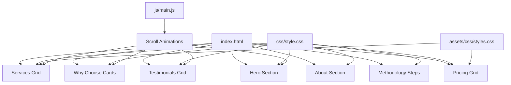
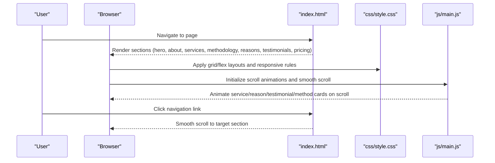
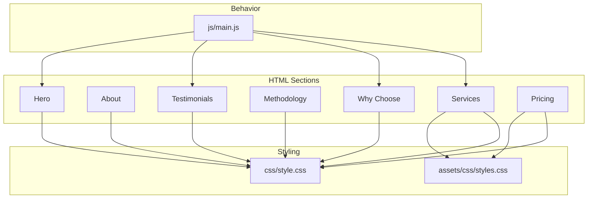
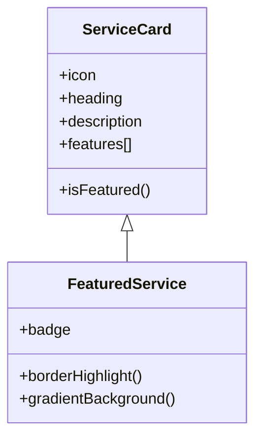
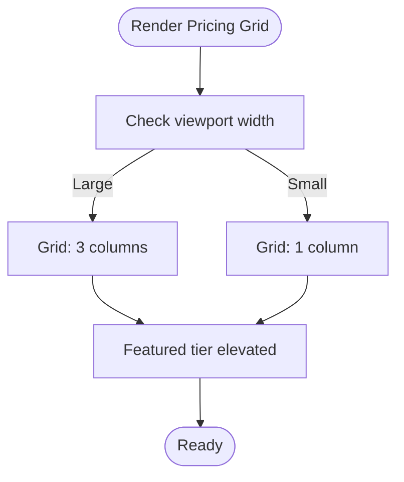
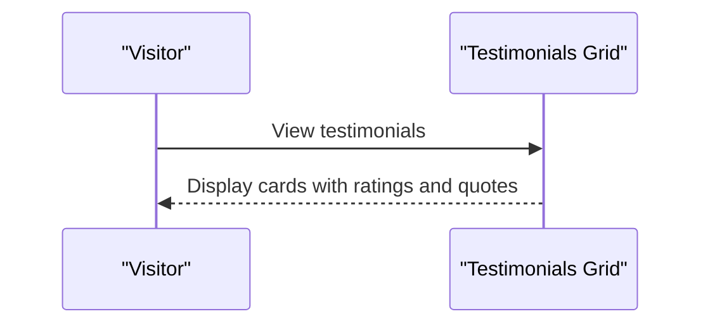
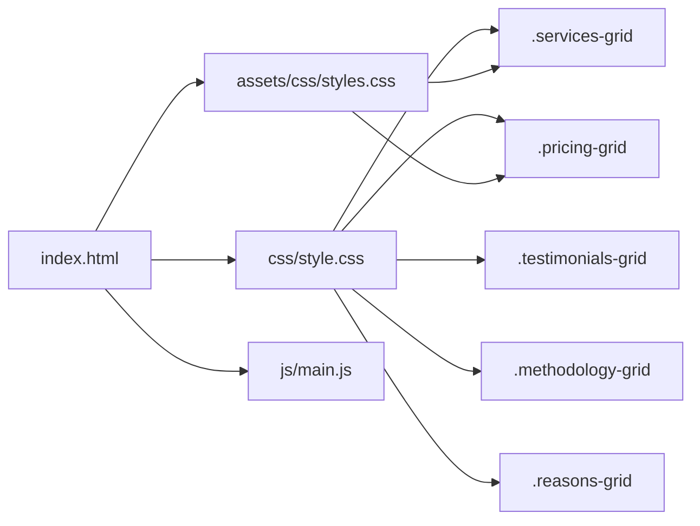

# Service Showcase

<cite>
**Referenced Files in This Document**
- [index.html](file://index.html)
- [style.css](file://css/style.css)
- [styles.css](file://assets/css/styles.css)
- [main.js](file://js/main.js)
</cite>

## Table of Contents
1. [Introduction](#introduction)
2. [Project Structure](#project-structure)
3. [Core Components](#core-components)
4. [Architecture Overview](#architecture-overview)
5. [Detailed Component Analysis](#detailed-component-analysis)
6. [Dependency Analysis](#dependency-analysis)
7. [Performance Considerations](#performance-considerations)
8. [Troubleshooting Guide](#troubleshooting-guide)
9. [Conclusion](#conclusion)
10. [Appendices](#appendices)

## Introduction
This document explains the complete implementation of the service showcase section for the website. It covers the hero section, about section, services grid, methodology presentation, differentiators, testimonials carousel, and pricing information. It also documents the HTML structure for each service card (icons, descriptions, feature lists), the CSS grid layout system, responsive design patterns, visual hierarchy, and practical guidance for customization and extension.

## Project Structure
The showcase is implemented primarily in a single HTML page with integrated CSS and JavaScript. The relevant sections are:
- Hero section with gradient background, headline, badges, and complementary cards
- About section with highlights and background emphasis
- Services grid with multiple service cards, including a featured card
- Methodology presentation (steps)
- Differentiators section (why choose)
- Testimonials carousel (grid of cards with ratings and author attribution)
- Pricing section with three tiers, including a highlighted featured tier

**Diagram sources**
- [index.html:49-479](file://index.html#L49-L479)
- [style.css:149-1381](file://css/style.css#L149-L1381)
- [styles.css:121-318](file://assets/css/styles.css#L121-L318)
- [main.js:200-231](file://js/main.js#L200-L231)

**Section sources**
- [index.html:49-479](file://index.html#L49-L479)
- [style.css:149-1381](file://css/style.css#L149-L1381)
- [styles.css:121-318](file://assets/css/styles.css#L121-L318)
- [main.js:200-231](file://js/main.js#L200-L231)

## Core Components
- Hero section: Prominent headline, subtitle, certification badges, and complementary cards with icons and short descriptions
- About section: Personal introduction, tagline, and highlight items with icons and explanatory text
- Services grid: Responsive grid of service cards with icons, headings, descriptions, and feature lists; one card is marked as featured
- Methodology steps: Step-by-step presentation with numbered steps and centered layout
- Why choose cards: Three cards emphasizing key differentiators with icons and concise copy
- Testimonials grid: Four cards with star ratings, quote text, and author avatar/name/title
- Pricing grid: Three pricing tiers with price blocks, feature lists, savings indicators, and call-to-action buttons; one tier is highlighted as featured

**Section sources**
- [index.html:49-479](file://index.html#L49-L479)
- [style.css:149-1381](file://css/style.css#L149-L1381)
- [styles.css:121-318](file://assets/css/styles.css#L121-L318)
- [main.js:200-231](file://js/main.js#L200-L231)

## Architecture Overview
The showcase leverages:
- Semantic HTML with clear section IDs for navigation and smooth scrolling
- CSS Grid for flexible, responsive layouts across services, testimonials, methodology, and pricing
- CSS Flexbox for alignment and composition within hero and pricing sections
- JavaScript for scroll-triggered animations and smooth scrolling navigation

**Diagram sources**
- [index.html:24-47](file://index.html#L24-L47)
- [style.css:149-1381](file://css/style.css#L149-L1381)
- [main.js:47-62](file://js/main.js#L47-L62)

## Detailed Component Analysis

### Hero Section
- Structure: Two-column grid layout with content on the left and image area on the right
- Content: Headline with accent color highlight, subtitle, badge list, and primary/secondary call-to-action buttons
- Right-side: Three complementary cards with translucent backgrounds, backdrop blur, and icons

Responsive behavior:
- On smaller screens, the two-column layout stacks into a single column
- Font sizes and spacing adapt across breakpoints

Accessibility and UX:
- Clear contrast against the dark gradient background
- Focus-friendly buttons and hover states

**Section sources**
- [index.html:49-89](file://index.html#L49-L89)
- [style.css:149-232](file://css/style.css#L149-L232)

### About Section
- Structure: Centered content with a section header and highlight items grid
- Highlights: Four items with icons, headings, and descriptive paragraphs
- Background: Light gray background for contrast and readability

Visual hierarchy:
- Section header emphasizes topic
- Highlight items use cards with subtle shadows and rounded corners

**Section sources**
- [index.html:110-158](file://index.html#L110-L158)
- [style.css:326-376](file://css/style.css#L326-L376)

### Services Grid
- Layout: CSS Grid with automatic fitting columns and minimum width constraints
- Cards: Standard cards with hover effects, borders, and shadow transitions
- Featured card: Additional border, gradient background, and a “Most Popular” badge positioned prominently

HTML structure per card:
- Icon container with circular gradient background and white icon
- Heading and descriptive paragraph
- Feature list with checkmark icons

Customization tips:
- To add a new service, duplicate a card and adjust the icon, heading, description, and feature list
- To mark a card as featured, add the “featured” class and include a badge element

**Section sources**
- [index.html:160-254](file://index.html#L160-L254)
- [style.css:381-464](file://css/style.css#L381-L464)
- [styles.css:121-174](file://assets/css/styles.css#L121-L174)

### Methodology Presentation
- Layout: Grid with automatic fitting columns and minimum width constraints
- Steps: Numbered circles with centered icons, headings, and descriptive paragraphs
- Visual emphasis: Clean cards with centered text and consistent spacing

Usage:
- Ideal for presenting process or approach in a digestible, scannable format

**Section sources**
- [index.html:256-290](file://index.html#L256-L290)
- [style.css:468-510](file://css/style.css#L468-L510)

### Differentiators (Why Choose)
- Layout: Grid of three cards with equal-width columns
- Presentation: Icons, headings, and concise descriptions
- Hover behavior: Subtle elevation and shadow enhancement

**Section sources**
- [index.html:256-290](file://index.html#L256-L290)
- [style.css:514-549](file://css/style.css#L514-L549)

### Testimonials Carousel
- Structure: Grid of cards with star ratings, quote text, and author information
- Author: Avatar placeholder, name, and job title
- Ratings: Five stars rendered with icons

Carousel behavior:
- The testimonials are presented as a grid in the HTML
- No client-side carousel script is present in the current codebase
- To implement a carousel, integrate a lightweight slider library or build a simple JavaScript-driven solution

Rating system:
- Star icons are consistently used across testimonials
- Author attribution is standardized with avatar, name, and title

**Section sources**
- [index.html:292-381](file://index.html#L292-L381)
- [style.css:552-615](file://css/style.css#L552-L615)

### Pricing Information
- Layout: Grid with three columns on larger screens, stacked vertically on smaller screens
- Tiers: Three pricing cards with distinct feature sets
- Featured tier: Elevated position, border highlight, and a “Most Popular” badge
- Savings indicator: Visible cost-per-session and total savings messaging
- Call-to-action: Prominent buttons aligned to the bottom of each card

HTML structure per tier:
- Price header with currency, amount, and period
- Savings note
- Feature list with checkmarks
- Call-to-action button

Customization tips:
- To add a new tier, duplicate a pricing card and adjust the header, features, and CTA
- To change pricing, update the currency, amount, and period elements
- To modify features, edit the list items within the feature list

**Section sources**
- [index.html:383-479](file://index.html#L383-L479)
- [style.css:617-707](file://css/style.css#L617-L707)
- [styles.css:175-318](file://assets/css/styles.css#L175-L318)

## Architecture Overview

**Diagram sources**
- [index.html:49-479](file://index.html#L49-L479)
- [style.css:149-1381](file://css/style.css#L149-L1381)
- [styles.css:121-318](file://assets/css/styles.css#L121-L318)
- [main.js:200-231](file://js/main.js#L200-L231)

## Detailed Component Analysis

### Services Grid Implementation
- CSS Grid: Automatic column sizing with minimum width and gap spacing
- Card hover: Elevation and shadow enhancement
- Featured card: Border highlight, gradient background, and badge positioning

**Diagram sources**
- [index.html:160-254](file://index.html#L160-L254)
- [style.css:381-464](file://css/style.css#L381-L464)
- [styles.css:121-174](file://assets/css/styles.css#L121-L174)

**Section sources**
- [index.html:160-254](file://index.html#L160-L254)
- [style.css:381-464](file://css/style.css#L381-L464)
- [styles.css:121-174](file://assets/css/styles.css#L121-L174)

### Pricing Grid Implementation
- CSS Grid: Fixed three-column layout on large screens, single-column stacking on small screens
- Featured tier: Elevated position and border highlight
- Savings indicators: Prominent messaging for cost-per-session and total savings

**Diagram sources**
- [index.html:383-479](file://index.html#L383-L479)
- [style.css:1334-1459](file://css/style.css#L1334-L1459)

**Section sources**
- [index.html:383-479](file://index.html#L383-L479)
- [style.css:1334-1459](file://css/style.css#L1334-L1459)
- [styles.css:175-318](file://assets/css/styles.css#L175-L318)

### Testimonials Grid Implementation
- Grid layout with automatic fitting columns
- Each card includes:
  - Rating stars
  - Quote text
  - Author avatar, name, and title

**Diagram sources**
- [index.html:292-381](file://index.html#L292-L381)
- [style.css:552-615](file://css/style.css#L552-L615)

**Section sources**
- [index.html:292-381](file://index.html#L292-L381)
- [style.css:552-615](file://css/style.css#L552-L615)

## Dependency Analysis

**Diagram sources**
- [index.html:49-479](file://index.html#L49-L479)
- [style.css:149-1381](file://css/style.css#L149-L1381)
- [styles.css:121-318](file://assets/css/styles.css#L121-L318)
- [main.js:200-231](file://js/main.js#L200-L231)

**Section sources**
- [index.html:49-479](file://index.html#L49-L479)
- [style.css:149-1381](file://css/style.css#L149-L1381)
- [styles.css:121-318](file://assets/css/styles.css#L121-L318)
- [main.js:200-231](file://js/main.js#L200-L231)

## Performance Considerations
- CSS Grid and Flexbox are efficient for layout; avoid excessive nesting to keep paint and layout costs low
- Keep hover effects subtle to prevent heavy GPU usage on lower-end devices
- Lazy-load images if additional media is introduced later
- Minimize DOM mutations during scroll animations; the current implementation observes elements once and updates styles on intersection

## Troubleshooting Guide
Common issues and resolutions:
- Cards not aligning properly:
  - Verify CSS Grid declarations and ensure containers use the intended grid classes
- Hover effects not triggering:
  - Confirm that interactive selectors (e.g., hover states) are applied to the correct elements
- Pricing tiers misaligned on small screens:
  - Check media queries for pricing grid and featured tier scaling
- Testimonials not animating:
  - Ensure IntersectionObserver is supported and that the observed elements exist in the DOM

**Section sources**
- [style.css:1334-1459](file://css/style.css#L1334-L1459)
- [main.js:200-231](file://js/main.js#L200-L231)

## Conclusion
The service showcase is built with a clean, modular structure using semantic HTML and robust CSS Grid layouts. The JavaScript adds subtle scroll-triggered animations and smooth navigation. The design is responsive and accessible, with clear visual hierarchy and consistent spacing. Extending the showcase involves duplicating existing card templates and adjusting content and styles as needed.

## Appendices

### Adding a New Service
Steps:
- Duplicate an existing service card within the services grid
- Replace the icon, heading, description, and feature list with new content
- If the service is the most popular, add the “featured” class and include a badge element

Reference points:
- Services grid container and card structure
- Featured card styling and badge placement

**Section sources**
- [index.html:160-254](file://index.html#L160-L254)
- [style.css:381-464](file://css/style.css#L381-L464)
- [styles.css:121-174](file://assets/css/styles.css#L121-L174)

### Customizing Pricing Tiers
Steps:
- Duplicate a pricing card within the pricing grid
- Adjust the header (plan name), price (currency, amount, period), and feature list
- Add a savings note if applicable
- Update the call-to-action button text and link

Reference points:
- Pricing grid container and tier structure
- Featured tier elevation and badge styling

**Section sources**
- [index.html:383-479](file://index.html#L383-L479)
- [style.css:1334-1459](file://css/style.css#L1334-L1459)
- [styles.css:175-318](file://assets/css/styles.css#L175-L318)

### Modifying Overall Layout Structure
Guidance:
- Use the container class for consistent horizontal spacing
- Leverage CSS Grid for multi-column sections (services, testimonials, methodology, pricing)
- Use Flexbox for alignment within cards and hero sections
- Maintain responsive breakpoints for optimal viewing across devices

**Section sources**
- [style.css:37-41](file://css/style.css#L37-L41)
- [style.css:149-1381](file://css/style.css#L149-L1381)
- [styles.css:121-318](file://assets/css/styles.css#L121-L318)