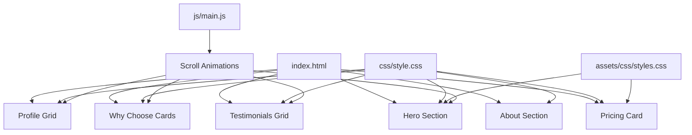
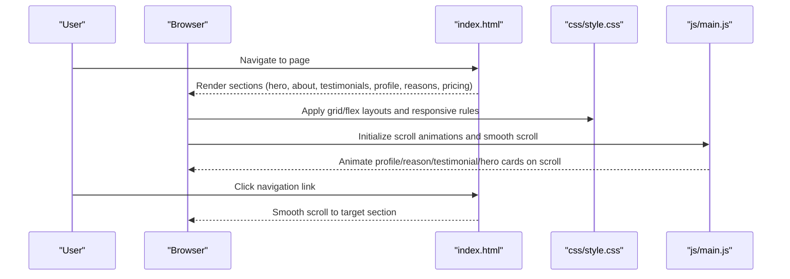
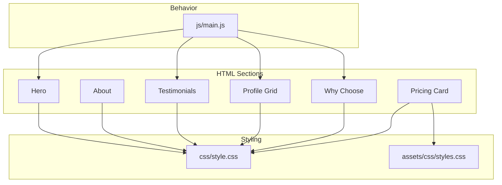
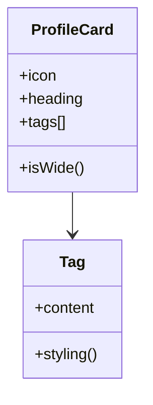
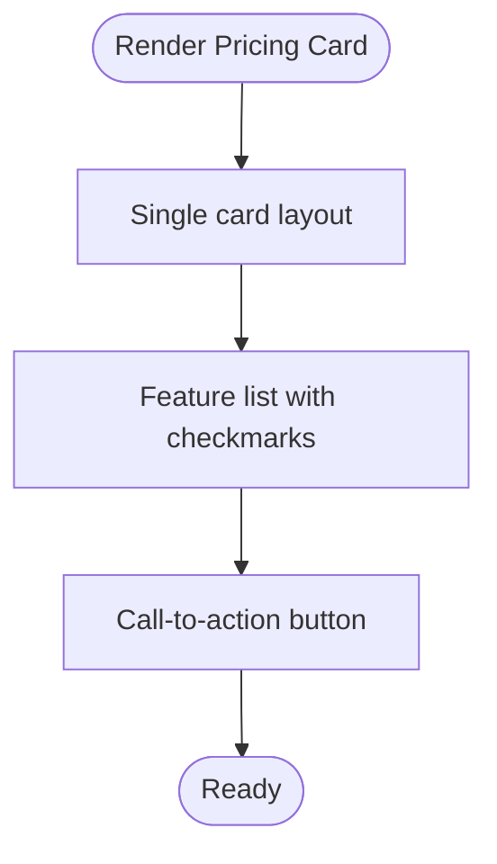
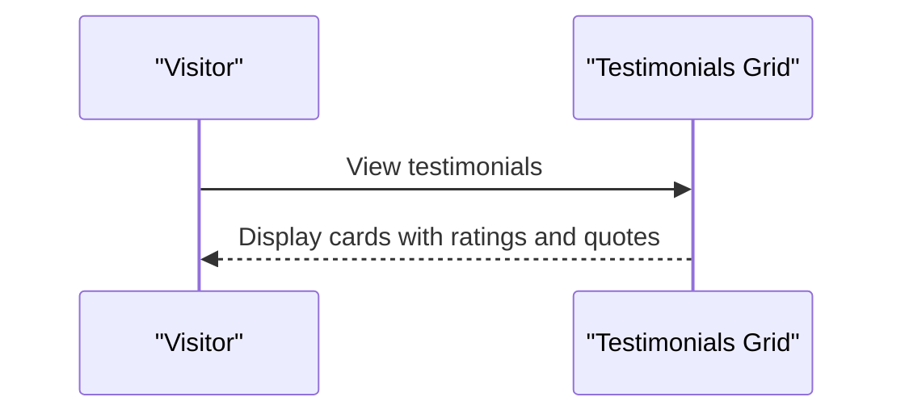
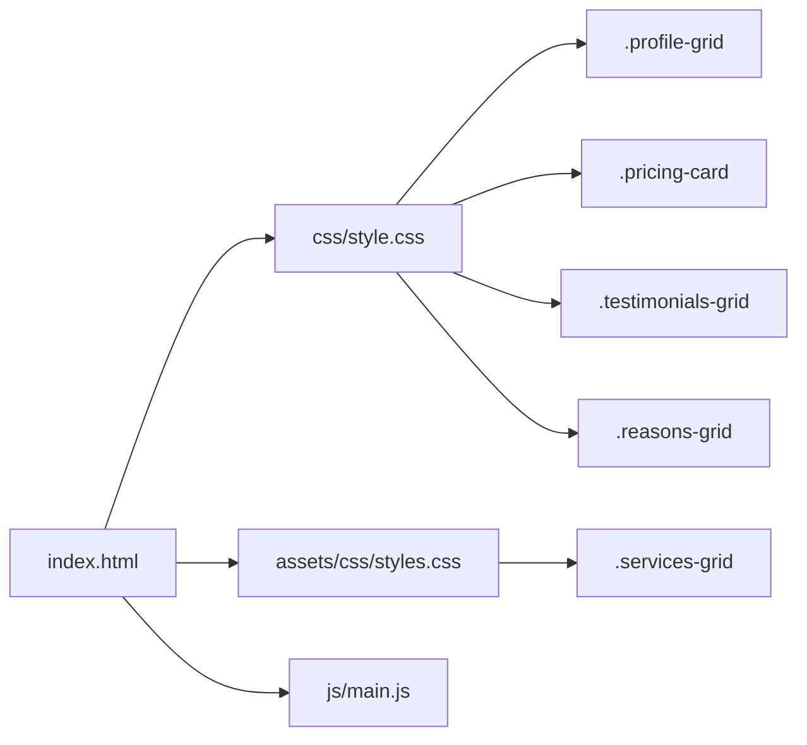

# Service Showcase

<cite>
**Referenced Files in This Document**
- [index.html](file://index.html)
- [style.css](file://css/style.css)
- [styles.css](file://assets/css/styles.css)
- [main.js](file://js/main.js)
</cite>

## Update Summary
**Changes Made**
- Updated Services Grid section to reflect the new Profile Cards with Tag System
- Removed references to the old services-grid and service-card structure
- Updated testimonials section to reflect its new position before services
- Removed methodology section as it's no longer part of the current architecture
- Simplified pricing section to show a single pricing card instead of multiple tiers
- Updated all component analyses to match the new profile card architecture

## Table of Contents
1. [Introduction](#introduction)
2. [Project Structure](#project-structure)
3. [Core Components](#core-components)
4. [Architecture Overview](#architecture-overview)
5. [Detailed Component Analysis](#detailed-component-analysis)
6. [Dependency Analysis](#dependency-analysis)
7. [Performance Considerations](#performance-considerations)
8. [Troubleshooting Guide](#troubleshooting-guide)
9. [Conclusion](#conclusion)
10. [Appendices](#appendices)

## Introduction
This document explains the complete implementation of the service showcase section for the website. The architecture has been significantly updated from service cards with badges to profile cards with tag system, featuring a simplified content presentation approach. It covers the hero section, about section, profile grid, differentiators, testimonials carousel, and pricing information. It also documents the HTML structure for each profile card (icons, descriptions, tag lists), the CSS grid layout system, responsive design patterns, visual hierarchy, and practical guidance for customization and extension.

## Project Structure
The showcase is implemented primarily in a single HTML page with integrated CSS and JavaScript. The relevant sections are:
- Hero section with gradient background, headline, badges, and complementary cards
- About section with highlights and background emphasis
- Profile grid with multiple profile cards, each containing a tag system for showcasing expertise
- Differentiators section (why choose)
- Testimonials carousel (grid of cards with ratings and author attribution)
- Pricing section with a single simplified pricing card

```mermaid
graph TB
Index["index.html"] --> Hero["Hero Section"]
Index --> About["About Section"]
Index --> Testimonials["Testimonials Grid"]
Index --> Profile["Profile Grid"]
Index --> Reasons["Why Choose Cards"]
Index --> Pricing["Pricing Card"]
StyleCSS["css/style.css"] --> Hero
StyleCSS --> About
StyleCSS --> Profile
StyleCSS --> Reasons
StyleCSS --> Testimonials
StyleCSS --> Pricing
AssetsStyles["assets/css/styles.css"] --> Hero
AssetsStyles --> Pricing
JSMain["js/main.js"] --> Animations["Scroll Animations"]
Animations --> Profile
Animations --> Reasons
Animations --> Testimonials
Animations --> Hero
```

**Diagram sources**
- [index.html:49-480](file://index.html#L49-L480)
- [style.css:149-1871](file://css/style.css#L149-L1871)
- [styles.css:121-339](file://assets/css/styles.css#L121-L339)
- [main.js:200-231](file://js/main.js#L200-L231)

**Section sources**
- [index.html:49-480](file://index.html#L49-L480)
- [style.css:149-1871](file://css/style.css#L149-L1871)
- [styles.css:121-339](file://assets/css/styles.css#L121-L339)
- [main.js:200-231](file://js/main.js#L200-L231)

## Core Components
- Hero section: Prominent headline, subtitle, certification badges, and complementary cards with icons and short descriptions
- About section: Personal introduction, tagline, and highlight items with icons and explanatory text
- Profile grid: Responsive grid of profile cards with icons, headings, and tag lists; one card spans the full width
- Differentiators section: Three cards emphasizing key differentiators with icons and concise copy
- Testimonials grid: Four cards with star ratings, quote text, and author avatar/name/title
- Pricing card: Single pricing card with price block, feature list, savings indicators, and call-to-action button

**Section sources**
- [index.html:49-480](file://index.html#L49-L480)
- [style.css:149-1871](file://css/style.css#L149-L1871)
- [styles.css:121-339](file://assets/css/styles.css#L121-L339)
- [main.js:200-231](file://js/main.js#L200-L231)

## Architecture Overview
The showcase leverages:
- Semantic HTML with clear section IDs for navigation and smooth scrolling
- CSS Grid for flexible, responsive layouts across profile cards, testimonials, and pricing
- CSS Flexbox for alignment and composition within hero and pricing sections
- JavaScript for scroll-triggered animations and smooth scrolling navigation

```mermaid
sequenceDiagram
participant User as "User"
participant Browser as "Browser"
participant HTML as "index.html"
participant CSS as "css/style.css"
participant JS as "js/main.js"
User->>HTML : Navigate to page
HTML-->>Browser : Render sections (hero, about, testimonials, profile, reasons, pricing)
Browser->>CSS : Apply grid/flex layouts and responsive rules
Browser->>JS : Initialize scroll animations and smooth scroll
JS-->>Browser : Animate profile/reason/testimonial/hero cards on scroll
User->>HTML : Click navigation link
HTML-->>Browser : Smooth scroll to target section
```

**Diagram sources**
- [index.html:24-58](file://index.html#L24-L58)
- [style.css:149-1871](file://css/style.css#L149-L1871)
- [main.js:47-62](file://js/main.js#L47-L62)

## Detailed Component Analysis

### Hero Section
- Structure: Two-column grid layout with content on the left and image area on the right
- Content: Headline with accent color highlight, subtitle, badge list, and primary/secondary call-to-action buttons
- Right-side: Three complementary cards with translucent backgrounds, backdrop blur, and icons

Responsive behavior:
- On smaller screens, the two-column layout stacks into a single column
- Font sizes and spacing adapt across breakpoints

Accessibility and UX:
- Clear contrast against the dark gradient background
- Focus-friendly buttons and hover states

**Section sources**
- [index.html:60-100](file://index.html#L60-L100)
- [style.css:149-232](file://css/style.css#L149-L232)

### About Section
- Structure: Centered content with a section header and highlight items grid
- Highlights: Four items with icons, headings, and descriptive paragraphs
- Background: Light gray background for contrast and readability

Visual hierarchy:
- Section header emphasizes topic
- Highlight items use cards with subtle shadows and rounded corners

**Section sources**
- [index.html:121-172](file://index.html#L121-L172)
- [style.css:326-376](file://css/style.css#L326-L376)

### Profile Grid (Updated from Services Grid)
- Layout: CSS Grid with automatic fitting columns and minimum width constraints
- Cards: Standard cards with hover effects, borders, and shadow transitions
- Structure: Each card contains a header with icon and title, followed by a tag list
- Full-width card: One card spans the full width of the grid for emphasis

HTML structure per card:
- Header with circular gradient background icon and title
- Tag list with multiple tags representing expertise areas

Customization tips:
- To add a new profile area, duplicate a card and adjust the icon, heading, and tag list
- To create a full-width card, add the `profile-card--wide` class to a card element

**Updated** The services grid has been completely replaced with a profile grid that focuses on showcasing expertise through tags rather than traditional service descriptions.

**Section sources**
- [index.html:265-356](file://index.html#L265-L356)
- [style.css:381-448](file://css/style.css#L381-L448)

### Differentiators (Why Choose)
- Layout: Grid of three cards with equal-width columns
- Presentation: Icons, headings, and concise descriptions
- Hover behavior: Subtle elevation and shadow enhancement

**Section sources**
- [index.html:358-392](file://index.html#L358-L392)
- [style.css:499-533](file://css/style.css#L499-L533)

### Testimonials Carousel (Updated Position)
- Structure: Grid of cards with star ratings, quote text, and author information
- Author: Avatar placeholder, name, and job title
- Ratings: Five stars rendered with icons

Carousel behavior:
- The testimonials are presented as a grid in the HTML
- No client-side carousel script is present in the current codebase
- To implement a carousel, integrate a lightweight slider library or build a simple JavaScript-driven solution

Rating system:
- Star icons are consistently used across testimonials
- Author attribution is standardized with avatar, name, and title

**Updated** The testimonials section has been moved up in the page structure to appear before the profile grid, serving as social proof before showcasing expertise.

**Section sources**
- [index.html:174-263](file://index.html#L174-L263)
- [style.css:538-599](file://css/style.css#L538-L599)

### Pricing Information (Simplified)
- Layout: Single pricing card centered on the page
- Presentation: Clean, focused design with prominent pricing information
- Features: Comprehensive feature list with checkmarks
- Call-to-action: Prominent button aligned to the bottom of the card

HTML structure:
- Price header with currency, amount, and period
- Feature list with checkmarks
- Call-to-action button with consultation badge

Customization tips:
- To modify pricing, update the currency, amount, and period elements
- To change features, edit the list items within the feature list
- To customize the call-to-action, modify the button text and link

**Updated** The pricing section has been simplified from multiple tiers to a single, focused pricing card that emphasizes the individual lesson rate and included benefits.

**Section sources**
- [index.html:394-436](file://index.html#L394-L436)
- [style.css:604-691](file://css/style.css#L604-L691)
- [styles.css:175-339](file://assets/css/styles.css#L175-L339)

## Architecture Overview

```mermaid
graph TB
subgraph "HTML Sections"
H["Hero"]
A["About"]
T["Testimonials"]
P["Profile Grid"]
R["Why Choose"]
PC["Pricing Card"]
end
subgraph "Styling"
SCSS["css/style.css"]
ASCSS["assets/css/styles.css"]
end
subgraph "Behavior"
J["js/main.js"]
end
H --> SCSS
A --> SCSS
T --> SCSS
P --> SCSS
R --> SCSS
PC --> SCSS
PC --> ASCSS
J --> P
J --> R
J --> T
J --> H
```

**Diagram sources**
- [index.html:49-480](file://index.html#L49-L480)
- [style.css:149-1871](file://css/style.css#L149-L1871)
- [styles.css:121-339](file://assets/css/styles.css#L121-L339)
- [main.js:200-231](file://js/main.js#L200-L231)

## Detailed Component Analysis

### Profile Grid Implementation (Updated)
- CSS Grid: Automatic column sizing with minimum width and gap spacing
- Card hover: Elevation and shadow enhancement
- Structure: Header with icon and title, followed by tag list
- Full-width option: Special wide card for emphasis

```mermaid
classDiagram
class ProfileCard {
+icon
+heading
+tags[]
+isWide()
}
class Tag {
+content
+styling()
}
ProfileCard --> Tag
```

**Diagram sources**
- [index.html:265-356](file://index.html#L265-L356)
- [style.css:381-448](file://css/style.css#L381-L448)

**Section sources**
- [index.html:265-356](file://index.html#L265-L356)
- [style.css:381-448](file://css/style.css#L381-L448)

### Pricing Card Implementation (Updated)
- Single card design with prominent pricing display
- Clean feature list with checkmarks
- Emphasis on consultation offer and value proposition

```mermaid
flowchart TD
Start(["Render Pricing Card"]) --> CheckScreen["Single card layout"]
CheckScreen --> Features["Feature list with checkmarks"]
Features --> CTA["Call-to-action button"]
CTA --> End(["Ready"])
```

**Diagram sources**
- [index.html:394-436](file://index.html#L394-L436)
- [style.css:604-691](file://css/style.css#L604-L691)

**Section sources**
- [index.html:394-436](file://index.html#L394-L436)
- [style.css:604-691](file://css/style.css#L604-L691)
- [styles.css:175-339](file://assets/css/styles.css#L175-L339)

### Testimonials Grid Implementation (Updated Position)
- Grid layout with automatic fitting columns
- Each card includes:
  - Rating stars
  - Quote text
  - Author avatar, name, and title

```mermaid
sequenceDiagram
participant Visitor as "Visitor"
participant Page as "Testimonials Grid"
Visitor->>Page : View testimonials
Page-->>Visitor : Display cards with ratings and quotes
```

**Diagram sources**
- [index.html:174-263](file://index.html#L174-L263)
- [style.css:538-599](file://css/style.css#L538-L599)

**Section sources**
- [index.html:174-263](file://index.html#L174-L263)
- [style.css:538-599](file://css/style.css#L538-L599)

## Dependency Analysis

```mermaid
graph LR
HTML["index.html"] --> Style["css/style.css"]
HTML --> AssetsStyle["assets/css/styles.css"]
HTML --> JS["js/main.js"]
Style --> Profile[".profile-grid"]
Style --> Pricing[".pricing-card"]
Style --> Testimonials[".testimonials-grid"]
Style --> Reasons[".reasons-grid"]
AssetsStyle --> Services[".services-grid"]
```

**Diagram sources**
- [index.html:49-480](file://index.html#L49-L480)
- [style.css:149-1871](file://css/style.css#L149-L1871)
- [styles.css:121-339](file://assets/css/styles.css#L121-L339)
- [main.js:200-231](file://js/main.js#L200-L231)

**Section sources**
- [index.html:49-480](file://index.html#L49-L480)
- [style.css:149-1871](file://css/style.css#L149-L1871)
- [styles.css:121-339](file://assets/css/styles.css#L121-L339)
- [main.js:200-231](file://js/main.js#L200-L231)

## Performance Considerations
- CSS Grid and Flexbox are efficient for layout; avoid excessive nesting to keep paint and layout costs low
- Keep hover effects subtle to prevent heavy GPU usage on lower-end devices
- Lazy-load images if additional media is introduced later
- Minimize DOM mutations during scroll animations; the current implementation observes elements once and updates styles on intersection

## Troubleshooting Guide
Common issues and resolutions:
- Cards not aligning properly:
  - Verify CSS Grid declarations and ensure containers use the intended grid classes
- Hover effects not triggering:
  - Confirm that interactive selectors (e.g., hover states) are applied to the correct elements
- Profile cards not displaying tags correctly:
  - Check that tag elements are properly structured within tag-list containers
- Testimonials not animating:
  - Ensure IntersectionObserver is supported and that the observed elements exist in the DOM

**Section sources**
- [style.css:381-448](file://css/style.css#L381-L448)
- [main.js:200-231](file://js/main.js#L200-L231)

## Conclusion
The service showcase has been significantly restructured with a focus on showcasing expertise through a modern profile card system with tag-based categorization. The architecture maintains clean, modular structure using semantic HTML and robust CSS Grid layouts. The JavaScript adds subtle scroll-triggered animations and smooth navigation. The design is responsive and accessible, with clear visual hierarchy and consistent spacing. Extending the showcase involves duplicating existing profile card templates and adjusting content and styles as needed.

## Appendices

### Adding a New Profile Area
Steps:
- Duplicate an existing profile card within the profile grid
- Replace the icon, heading, and tag list with new content
- If the profile area is particularly important, add the `profile-card--wide` class to make it span the full width

Reference points:
- Profile grid container and card structure
- Tag list styling and tag element structure

**Section sources**
- [index.html:265-356](file://index.html#L265-L356)
- [style.css:381-448](file://css/style.css#L381-L448)

### Customizing Pricing Card
Steps:
- Update the header (lesson type), price (currency, amount, period), and feature list
- Add a savings note if applicable
- Update the call-to-action button text and link

Reference points:
- Pricing card container and structure
- Consultation badge styling and feature list formatting

**Section sources**
- [index.html:394-436](file://index.html#L394-L436)
- [style.css:604-691](file://css/style.css#L604-L691)
- [styles.css:175-339](file://assets/css/styles.css#L175-L339)

### Modifying Overall Layout Structure
Guidance:
- Use the container class for consistent horizontal spacing
- Leverage CSS Grid for multi-column sections (profile grid, testimonials)
- Use Flexbox for alignment within cards and hero sections
- Maintain responsive breakpoints for optimal viewing across devices

**Section sources**
- [style.css:37-41](file://css/style.css#L37-L41)
- [style.css:149-1871](file://css/style.css#L149-L1871)
- [styles.css:121-339](file://assets/css/styles.css#L121-L339)