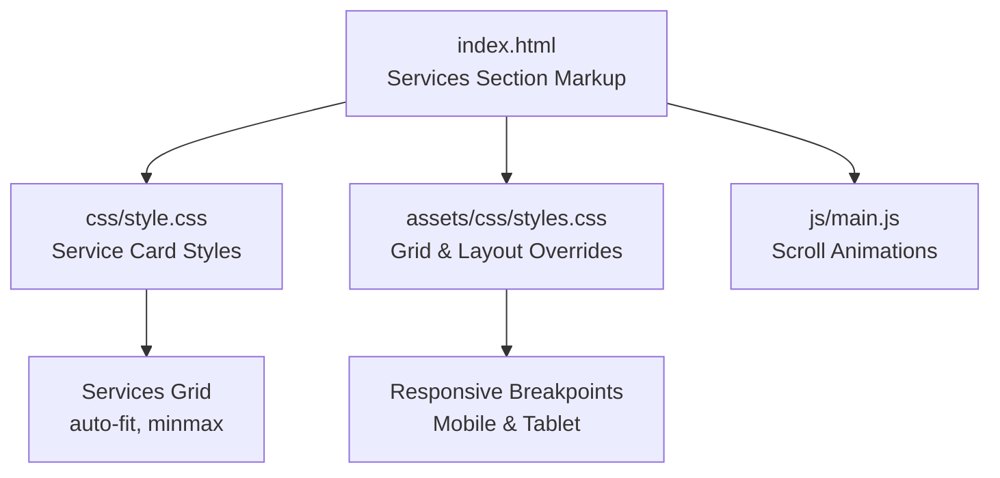
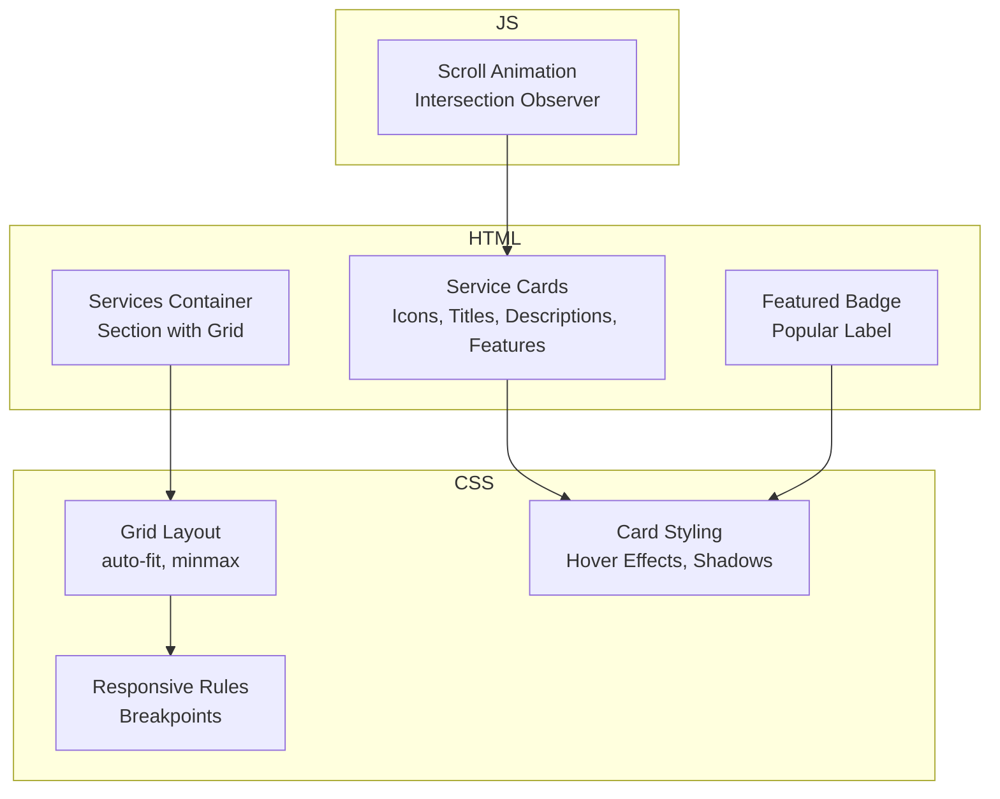
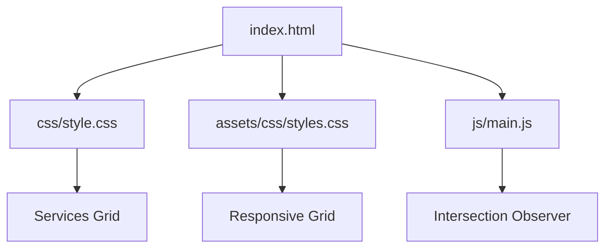

# Services Section

<cite>
**Referenced Files in This Document**
- [index.html](file://index.html)
- [style.css](file://css/style.css)
- [styles.css](file://assets/css/styles.css)
- [Footer-with-Pricing.css](file://assets/css/Footer-with-Pricing.css)
- [Navbar-With-Button-icons.css](file://assets/css/Navbar-With-Button-icons.css)
- [main.js](file://js/main.js)
</cite>

## Table of Contents
1. [Introduction](#introduction)
2. [Project Structure](#project-structure)
3. [Core Components](#core-components)
4. [Architecture Overview](#architecture-overview)
5. [Detailed Component Analysis](#detailed-component-analysis)
6. [Dependency Analysis](#dependency-analysis)
7. [Performance Considerations](#performance-considerations)
8. [Troubleshooting Guide](#troubleshooting-guide)
9. [Conclusion](#conclusion)

## Introduction
This document provides a comprehensive guide to the Services Section implementation, focusing on the four specialized service offerings and the featured service highlighting mechanism. It explains the HTML structure for each service card, the CSS grid layout system, responsive design patterns, and the popular badge system. It also covers customization guidelines for adding new services, adjusting pricing information, modifying feature lists, and maintaining consistent styling across service cards.

## Project Structure
The Services Section is implemented within the main landing page and styled using dedicated CSS files. The HTML markup defines the service cards and their content, while the CSS files define the grid layout, typography, and responsive behavior. A small amount of JavaScript handles scroll animations for the service cards.

**Diagram sources**
- [index.html:160-254](file://index.html#L160-L254)
- [style.css:378-464](file://css/style.css#L378-L464)
- [styles.css:121-127](file://assets/css/styles.css#L121-L127)
- [main.js:200-231](file://js/main.js#L200-L231)

**Section sources**
- [index.html:160-254](file://index.html#L160-L254)
- [style.css:378-464](file://css/style.css#L378-L464)
- [styles.css:121-127](file://assets/css/styles.css#L121-L127)
- [main.js:200-231](file://js/main.js#L200-L231)

## Core Components
The Services Section consists of:
- A container with a section header and a grid of service cards
- Five service cards representing the following categories:
  - Communication Strategies
  - Business English
  - English for IT & Tech
  - Advanced Conversation
  - Exam Preparation
- One featured service card highlighted with a “Popular” badge and elevated styling

Each service card includes:
- An icon area
- A title
- A descriptive paragraph
- A feature list with checkmark icons

**Section sources**
- [index.html:160-254](file://index.html#L160-L254)

## Architecture Overview
The Services Section follows a modular architecture:
- HTML markup defines the structure and content
- CSS applies grid layout, typography, and responsive behavior
- JavaScript adds scroll animations for a polished user experience

**Diagram sources**
- [index.html:160-254](file://index.html#L160-L254)
- [style.css:378-464](file://css/style.css#L378-L464)
- [styles.css:121-127](file://assets/css/styles.css#L121-L127)
- [main.js:200-231](file://js/main.js#L200-L231)

## Detailed Component Analysis

### HTML Structure for Service Cards
Each service card is structured consistently:
- A container with a class indicating a service card
- An icon area containing a Font Awesome icon
- A title element
- A paragraph describing the service
- A feature list with multiple items, each prefixed by a checkmark icon

The featured service card additionally includes a badge positioned near the top-right corner.

Key HTML elements and classes:
- Container: service-card
- Icon area: service-icon
- Title: h3
- Description: p
- Feature list: service-features
- Featured badge: service-badge
- Featured modifier: featured

**Section sources**
- [index.html:170-254](file://index.html#L170-L254)

### CSS Grid Layout System
The Services Section uses a CSS Grid to arrange service cards responsively:
- The grid container uses a two-dimensional grid with automatic column sizing
- Columns are defined using auto-fit and a minimum width threshold
- Gaps between cards are standardized for consistent spacing

Responsive behavior:
- On larger screens, multiple columns are displayed
- On smaller screens, columns stack to accommodate limited width

**Section sources**
- [style.css:381-385](file://css/style.css#L381-L385)
- [styles.css:121-127](file://assets/css/styles.css#L121-L127)

### Responsive Design Patterns
The Services Section adapts to various screen sizes:
- Minimum column width ensures readability on small devices
- Hover effects and shadows enhance interactivity
- Typography scales appropriately across breakpoints

Media queries adjust:
- Grid behavior for optimal card distribution
- Spacing and padding for compact layouts on mobile
- Visual emphasis for the featured card on tablets and phones

**Section sources**
- [style.css:381-406](file://css/style.css#L381-L406)
- [styles.css:304-318](file://assets/css/styles.css#L304-L318)

### Featured Service Highlighting Mechanism
The featured service is visually distinguished by:
- A special class applied to the card container
- A prominent badge positioned near the top-right corner
- Elevated styling including a border accent and gradient background

The badge is positioned absolutely and styled to draw attention without disrupting the card’s content flow.

**Section sources**
- [index.html:219-235](file://index.html#L219-L235)
- [style.css:403-418](file://css/style.css#L403-L418)

### Service Categories and Content
The Services Section presents five distinct categories, each with a unique icon and tailored feature list:

- Communication Strategies
  - Icon: comments
  - Focus: fluency maintenance, filler usage, conversation recovery
- Business English
  - Icon: briefcase
  - Focus: presentations, meetings, professional emails, negotiation techniques
- English for IT & Tech
  - Icon: laptop-code
  - Focus: technical vocabulary, Agile/Scrum, technical documentation, interview practice
- Advanced Conversation
  - Icon: comments
  - Focus: fluency development, accent reduction, idiomatic expressions, cultural nuances
- Exam Preparation
  - Icon: graduation-cap
  - Focus: TOEFL/IELTS, Cambridge exams, test strategies, practical simulations

Each category includes a descriptive paragraph and a feature list aligned with the service’s goals.

**Section sources**
- [index.html:170-254](file://index.html#L170-L254)

### Adding New Services
To add a new service:
1. Duplicate an existing service card structure within the services grid container.
2. Replace the icon, title, description, and feature list with the new service details.
3. Optionally apply the featured class to highlight a popular offering.
4. Ensure the new card maintains the same class structure for consistent styling.

Guidelines:
- Use the same icon wrapper and feature list structure.
- Keep feature lists concise and scannable.
- Maintain consistent spacing and typography.

**Section sources**
- [index.html:170-254](file://index.html#L170-L254)
- [style.css:448-463](file://css/style.css#L448-L463)

### Customizing Pricing Information
While pricing information resides in a separate section, the same design principles apply:
- Use a consistent grid layout for pricing tiers.
- Apply a featured modifier to highlight the most popular option.
- Maintain uniform typography and spacing across tiers.

**Section sources**
- [index.html:383-479](file://index.html#L383-L479)
- [style.css:175-201](file://css/style.css#L175-L201)

### Modifying Feature Lists
Feature lists are implemented as unordered lists with consistent styling:
- Each item includes a checkmark icon and descriptive text.
- Items are spaced vertically for readability.
- Hover states and transitions provide interactive feedback.

When editing:
- Keep bullet points short and action-oriented.
- Ensure the list remains scannable on small screens.

**Section sources**
- [index.html:180-250](file://index.html#L180-L250)
- [style.css:448-463](file://css/style.css#L448-L463)

### Implementing the Popular Badge System
The popular badge system uses:
- A dedicated badge element inside the featured card
- Absolute positioning to place the badge near the top-right corner
- A contrasting color scheme to emphasize popularity

Best practices:
- Keep badge text concise and actionable.
- Align badge placement across all cards for consistency.
- Ensure the badge does not overlap with content.

**Section sources**
- [index.html:220](file://index.html#L220)
- [style.css:408-418](file://css/style.css#L408-L418)

### Maintaining Consistent Styling Across Service Cards
Consistency is achieved through:
- Shared class names for structure and styling
- Centralized CSS variables for colors and spacing
- Uniform hover effects and transitions
- Responsive adjustments that preserve readability

Recommendations:
- Use the same icon wrapper and feature list structure for all cards.
- Maintain consistent padding and margins.
- Apply the same typography scale and line heights.

**Section sources**
- [style.css:378-464](file://css/style.css#L378-L464)
- [styles.css:121-127](file://assets/css/styles.css#L121-L127)

### Optimizing for Different Screen Sizes
Optimization strategies:
- Use flexible grid units with minimum widths to prevent overlapping.
- Adjust spacing and padding for mobile-first usability.
- Preserve visual hierarchy by keeping typography and icon sizes readable.
- Ensure hover effects remain accessible on touch devices.

**Section sources**
- [style.css:381-406](file://css/style.css#L381-L406)
- [styles.css:304-318](file://assets/css/styles.css#L304-L318)

## Dependency Analysis
The Services Section depends on:
- HTML structure for content and semantics
- CSS for layout, typography, and responsiveness
- JavaScript for scroll-triggered animations

**Diagram sources**
- [index.html:160-254](file://index.html#L160-L254)
- [style.css:378-464](file://css/style.css#L378-L464)
- [styles.css:121-127](file://assets/css/styles.css#L121-L127)
- [main.js:200-231](file://js/main.js#L200-L231)

**Section sources**
- [index.html:160-254](file://index.html#L160-L254)
- [style.css:378-464](file://css/style.css#L378-L464)
- [styles.css:121-127](file://assets/css/styles.css#L121-L127)
- [main.js:200-231](file://js/main.js#L200-L231)

## Performance Considerations
- Use efficient CSS Grid properties to minimize layout recalculations.
- Keep feature lists concise to reduce rendering overhead.
- Avoid heavy animations on low-powered devices; rely on lightweight transitions.
- Ensure images and icons are optimized for fast loading.

## Troubleshooting Guide
Common issues and resolutions:
- Cards not stacking on small screens: Verify the grid template and minimum column width settings.
- Hover effects not visible on mobile: Confirm that hover states are complemented by focus-visible styles for accessibility.
- Featured badge misalignment: Check absolute positioning and ensure parent containers have relative positioning.
- Inconsistent spacing: Review padding and gap values across cards and adjust to match the design system.

**Section sources**
- [style.css:381-406](file://css/style.css#L381-L406)
- [styles.css:121-127](file://assets/css/styles.css#L121-L127)

## Conclusion
The Services Section is a well-structured, responsive component that effectively communicates specialized offerings through consistent HTML semantics, robust CSS Grid layout, and thoughtful visual enhancements. By following the provided guidelines, teams can easily add new services, customize content, and maintain a cohesive design across devices.