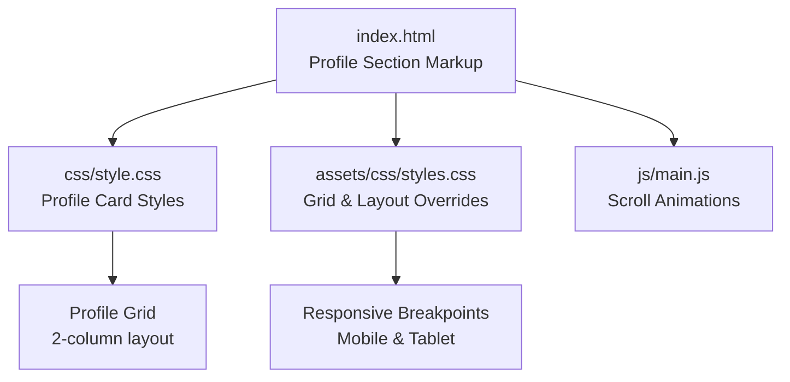
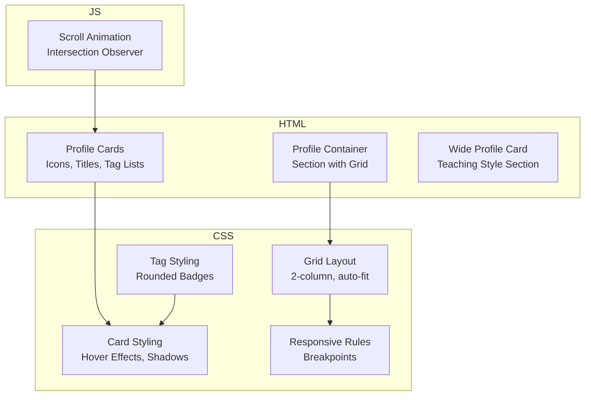
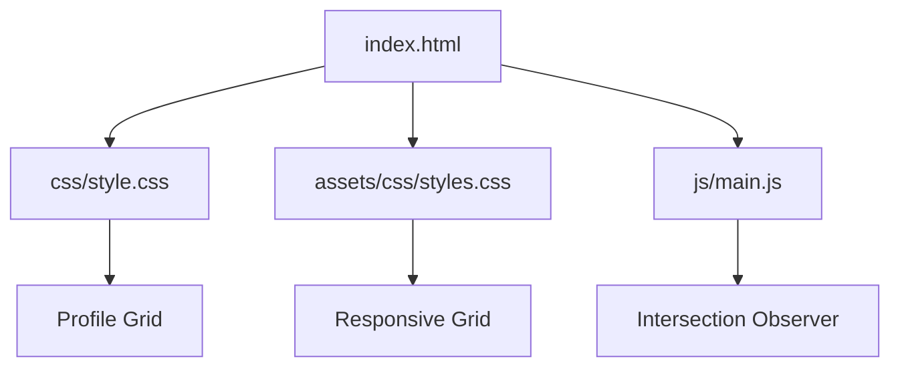

# Services Section

<cite>
**Referenced Files in This Document**
- [index.html](file://index.html)
- [style.css](file://css/style.css)
- [styles.css](file://assets/css/styles.css)
- [main.js](file://js/main.js)
</cite>

## Update Summary
**Changes Made**
- Complete transformation from five-service card system to four-profile card system with tag-based presentation
- Replaced specialized service categories with comprehensive instructor profile cards
- Updated section title from "Services" to "Profile Section" to reflect new content focus
- Modified HTML structure to use profile-card and tag-list classes instead of service-card
- Updated CSS grid system to use profile-grid instead of services-grid
- Removed service-specific feature lists in favor of tag-based presentation
- Retained scroll animation functionality for profile cards

## Table of Contents
1. [Introduction](#introduction)
2. [Project Structure](#project-structure)
3. [Core Components](#core-components)
4. [Architecture Overview](#architecture-overview)
5. [Detailed Component Analysis](#detailed-component-analysis)
6. [Dependency Analysis](#dependency-analysis)
7. [Performance Considerations](#performance-considerations)
8. [Troubleshooting Guide](#troubleshooting-guide)
9. [Conclusion](#conclusion)

## Introduction
This document provides a comprehensive guide to the Profile Section implementation, focusing on the four specialized instructor profile cards and the tag-based presentation system. The Profile Section has been strategically repositioned to showcase the instructor's comprehensive expertise through four distinct profile categories, each presented with a tag-based system that highlights specific competencies and experiences.

The Profile Section demonstrates a modern approach to presenting instructor qualifications through clean, organized tag displays rather than traditional feature lists. Each profile card includes an icon, title, and a collection of relevant tags that represent the instructor's expertise areas.

## Project Structure
The Profile Section is implemented within the main landing page and styled using dedicated CSS files. The HTML markup defines the profile cards and their tag collections, while the CSS files define the grid layout, typography, and responsive behavior. A small amount of JavaScript handles scroll animations for the profile cards.

```mermaid
graph TB
IndexHTML["index.html<br/>Profile Section Markup"] --> StyleCSS["css/style.css<br/>Profile Card Styles"]
IndexHTML --> AssetsStyles["assets/css/styles.css<br/>Grid & Layout Overrides"]
IndexHTML --> JSMain["js/main.js<br/>Scroll Animations"]
StyleCSS --> ProfileGrid["Profile Grid<br/>2-column layout"]
AssetsStyles --> Responsive["Responsive Breakpoints<br/>Mobile & Tablet"]
```

**Diagram sources**
- [index.html:265-356](file://index.html#L265-L356)
- [style.css:381-448](file://css/style.css#L381-L448)
- [styles.css:121-127](file://assets/css/styles.css#L121-L127)
- [main.js:200-231](file://js/main.js#L200-L231)

**Section sources**
- [index.html:265-356](file://index.html#L265-L356)
- [style.css:381-448](file://css/style.css#L381-L448)
- [styles.css:121-127](file://assets/css/styles.css#L121-L127)
- [main.js:200-231](file://js/main.js#L200-L231)

## Core Components
The Profile Section consists of:
- A container with a section header and a grid of profile cards
- Four profile cards representing the following expertise areas:
  - Experience Level Proficiency
  - International Experience
  - Language Learning Objectives
  - Specific Purpose Areas
  - Teaching Style Philosophy
- Each profile card includes:
  - An icon area with a professional icon
  - A title describing the expertise area
  - A tag list with relevant competency tags

The Profile Section replaces the previous service-based approach with a more comprehensive presentation of instructor qualifications and expertise areas.

**Section sources**
- [index.html:265-356](file://index.html#L265-L356)

## Architecture Overview
The Profile Section follows a modular architecture:
- HTML markup defines the structure and content using profile-card and tag-list classes
- CSS applies grid layout, typography, and responsive behavior with profile-grid
- JavaScript adds scroll animations for a polished user experience

```mermaid
graph TB
subgraph "HTML"
ProfileContainer["Profile Container<br/>Section with Grid"]
ProfileCards["Profile Cards<br/>Icons, Titles, Tag Lists"]
WideCard["Wide Profile Card<br/>Teaching Style Section"]
end
subgraph "CSS"
ProfileGrid["Grid Layout<br/>2-column, auto-fit"]
CardStyling["Card Styling<br/>Hover Effects, Shadows"]
TagStyling["Tag Styling<br/>Rounded Badges"]
ResponsiveRules["Responsive Rules<br/>Breakpoints"]
end
subgraph "JS"
ScrollAnimation["Scroll Animation<br/>Intersection Observer"]
end
ProfileContainer --> ProfileGrid
ProfileCards --> CardStyling
TagStyling --> CardStyling
ProfileGrid --> ResponsiveRules
ScrollAnimation --> ProfileCards
```

**Diagram sources**
- [index.html:265-356](file://index.html#L265-L356)
- [style.css:381-448](file://css/style.css#L381-L448)
- [styles.css:121-127](file://assets/css/styles.css#L121-L127)
- [main.js:200-231](file://js/main.js#L200-L231)

## Detailed Component Analysis

### HTML Structure for Profile Cards
Each profile card is structured consistently:
- A container with a class indicating a profile card
- A header section containing an icon wrapper and title
- A tag list with multiple tags, each representing a specific competency or experience area

The wide profile card (Teaching Style) spans the full width of the grid using the profile-card--wide class.

Key HTML elements and classes:
- Container: profile-card
- Header: profile-card-header
- Icon area: profile-card-icon
- Title: h3
- Tag list: tag-list
- Wide card modifier: profile-card--wide
- Individual tags: tag

**Section sources**
- [index.html:275-356](file://index.html#L275-L356)

### CSS Grid Layout System
The Profile Section uses a CSS Grid to arrange profile cards responsively:
- The grid container uses a two-column layout with equal width columns
- The wide card spans both columns using grid-column: 1 / -1
- Gaps between cards are standardized for consistent spacing

Responsive behavior:
- On larger screens, two columns are displayed side-by-side
- On smaller screens, the layout adapts to available space
- The wide card automatically becomes a single column on smaller screens

**Section sources**
- [style.css:381-385](file://css/style.css#L381-L385)
- [style.css:436-438](file://css/style.css#L436-L438)
- [styles.css:121-127](file://assets/css/styles.css#L121-L127)

### Responsive Design Patterns
The Profile Section adapts to various screen sizes:
- Two-column layout ensures optimal card distribution on desktop
- Hover effects and shadows enhance interactivity
- Typography scales appropriately across breakpoints
- The wide card automatically adjusts its layout on smaller screens

Media queries adjust:
- Grid behavior for optimal card distribution
- Spacing and padding for compact layouts on mobile
- Visual emphasis for the wide card on tablets and phones

**Section sources**
- [style.css:381-406](file://css/style.css#L381-L406)
- [style.css:436-438](file://css/style.css#L436-L438)
- [styles.css:304-318](file://assets/css/styles.css#L304-L318)

### Profile Card Design System
Each profile card follows a consistent design pattern:
- Professional icon in a circular gradient background
- Clean typography with clear hierarchy
- Rounded tag badges with subtle borders
- Hover effects that enhance interactivity
- Shadow-based elevation for depth perception

The design emphasizes professionalism and clarity while maintaining visual consistency across all cards.

**Section sources**
- [style.css:401-448](file://css/style.css#L401-L448)

### Profile Categories and Content
The Profile Section presents four distinct expertise areas, each with a unique icon and tailored tag collection:

- **Experience Level Proficiency**
  - Icon: layer-group
  - Focus: Language proficiency levels from Intermediate to Advanced Superior
  - Tags: Intermediário, Intermediário Superior, Avançado, Avançado Superior
- **International Experience**
  - Icon: globe-americas
  - Focus: Global teaching and living experience across multiple countries
  - Tags: Irlanda, Reino Unido (11 anos), Estados Unidos (1 ano), Austrália (2 anos), África, Ásia, Brasil (26 anos)
- **Language Learning Objectives**
  - Icon: bullseye
  - Focus: Specific language learning goals and skill areas
  - Tags: Accent Reduction, Listening Comprehension, Reading Comprehension, Speaking Practice, Vocabulary Development, Phonetics, Writing Correction
- **Specific Purpose Areas**
  - Icon: briefcase
  - Focus: Contextual English applications for specific professional needs
  - Tags: Academic English, Business English, Technical English, Interview Preparation, Medical English
- **Teaching Style Philosophy** *(Wide Card)*
  - Icon: chalkboard-teacher
  - Focus: Teaching methodology and approach philosophy
  - Tags: Conversation-focused, Grammar when necessary, Real-world examples, Patient & direct feedback, No translation dependency

Each category includes a professional icon, clear title, and a comprehensive tag list that represents the instructor's expertise in that area.

**Section sources**
- [index.html:275-356](file://index.html#L275-L356)

### Adding New Profile Categories
To add a new profile category:
1. Duplicate an existing profile card structure within the profile grid container.
2. Replace the icon, title, and tag list with the new expertise area details.
3. Optionally use the wide card modifier for longer tag lists.
4. Ensure the new card maintains the same class structure for consistent styling.

Guidelines:
- Use the same icon wrapper and tag list structure.
- Keep tag lists concise and scannable.
- Maintain consistent spacing and typography.
- Consider using the wide card modifier for categories with many tags.

**Section sources**
- [index.html:275-356](file://index.html#L275-L356)
- [style.css:436-438](file://css/style.css#L436-L438)

### Customizing Tag Content
Tags are implemented as rounded badges with consistent styling:
- Each tag includes professional text and descriptive content
- Tags are spaced horizontally for readability
- Hover states and transitions provide interactive feedback
- Color schemes distinguish tags from the card background

When editing:
- Keep tag text concise and professional.
- Ensure the tag list remains scannable on small screens.
- Consider grouping related tags for better organization.

**Section sources**
- [index.html:283-353](file://index.html#L283-L353)
- [style.css:440-448](file://css/style.css#L440-L448)

### Implementing the Wide Card Pattern
The wide card pattern uses:
- A dedicated wide card class that spans both columns
- Full-width tag display for comprehensive content
- Specialized styling to differentiate from standard cards

Best practices:
- Use the wide card modifier for categories with extensive tag lists.
- Ensure the wide card remains readable on all screen sizes.
- Maintain consistent padding and spacing across all cards.

**Section sources**
- [index.html:339](file://index.html#L339)
- [style.css:436-438](file://css/style.css#L436-L438)

### Maintaining Consistent Styling Across Profile Cards
Consistency is achieved through:
- Shared class names for structure and styling
- Centralized CSS variables for colors and spacing
- Uniform hover effects and transitions
- Responsive adjustments that preserve readability

Recommendations:
- Use the same icon wrapper and tag list structure for all cards.
- Maintain consistent padding and margins.
- Apply the same typography scale and line heights.
- Ensure all cards have the same shadow and border treatment.

**Section sources**
- [style.css:381-448](file://css/style.css#L381-L448)
- [styles.css:121-127](file://assets/css/styles.css#L121-L127)

### Optimizing for Different Screen Sizes
Optimization strategies:
- Use flexible grid units with equal width columns to prevent overlapping.
- Adjust spacing and padding for mobile-first usability.
- Preserve visual hierarchy by keeping typography and icon sizes readable.
- Ensure hover effects remain accessible on touch devices.
- The wide card automatically adapts to single-column layout on smaller screens.

**Section sources**
- [style.css:381-406](file://css/style.css#L381-L406)
- [style.css:436-438](file://css/style.css#L436-L438)
- [styles.css:304-318](file://assets/css/styles.css#L304-L318)

## Dependency Analysis
The Profile Section depends on:
- HTML structure for content and semantics using profile-card classes
- CSS for layout, typography, and responsiveness with profile-grid
- JavaScript for scroll-triggered animations

```mermaid
graph TB
HTMLIndex["index.html"] --> CSSStyle["css/style.css"]
HTMLIndex --> CSSAssets["assets/css/styles.css"]
HTMLIndex --> JSMain["js/main.js"]
CSSStyle --> ProfileGrid["Profile Grid"]
CSSAssets --> ResponsiveGrid["Responsive Grid"]
JSMain --> ScrollObserver["Intersection Observer"]
```

**Diagram sources**
- [index.html:265-356](file://index.html#L265-L356)
- [style.css:381-448](file://css/style.css#L381-L448)
- [styles.css:121-127](file://assets/css/styles.css#L121-L127)
- [main.js:200-231](file://js/main.js#L200-L231)

**Section sources**
- [index.html:265-356](file://index.html#L265-L356)
- [style.css:381-448](file://css/style.css#L381-L448)
- [styles.css:121-127](file://assets/css/styles.css#L121-L127)
- [main.js:200-231](file://js/main.js#L200-L231)

## Performance Considerations
- Use efficient CSS Grid properties to minimize layout recalculations.
- Keep tag lists concise to reduce rendering overhead.
- Avoid heavy animations on low-powered devices; rely on lightweight transitions.
- Ensure images and icons are optimized for fast loading.
- The tag-based system reduces complexity compared to traditional feature lists.

## Troubleshooting Guide
Common issues and resolutions:
- Cards not stacking properly on small screens: Verify the grid template and column settings.
- Hover effects not visible on mobile: Confirm that hover states are complemented by focus-visible styles for accessibility.
- Wide card not spanning columns: Check the grid-column CSS property and ensure proper class application.
- Tag overflow issues: Review tag wrapping and spacing settings across cards and adjust to match the design system.

**Section sources**
- [style.css:381-406](file://css/style.css#L381-L406)
- [style.css:436-438](file://css/style.css#L436-L438)
- [styles.css:121-127](file://assets/css/styles.css#L121-L127)

## Conclusion
The Profile Section is a well-structured, responsive component that effectively communicates instructor expertise through four comprehensive profile cards and a tag-based presentation system. The strategic transformation from specialized service categories to comprehensive instructor profiles reflects a shift toward showcasing holistic teaching capabilities and professional qualifications.

The tag-based approach provides a clean, organized way to present complex information about language proficiency levels, international experience, learning objectives, and teaching methodologies. By following the provided guidelines, teams can easily add new profile categories, customize tag content, and maintain a cohesive design across devices while emphasizing the comprehensive teaching expertise that makes the instructor stand out in the competitive online English education market.