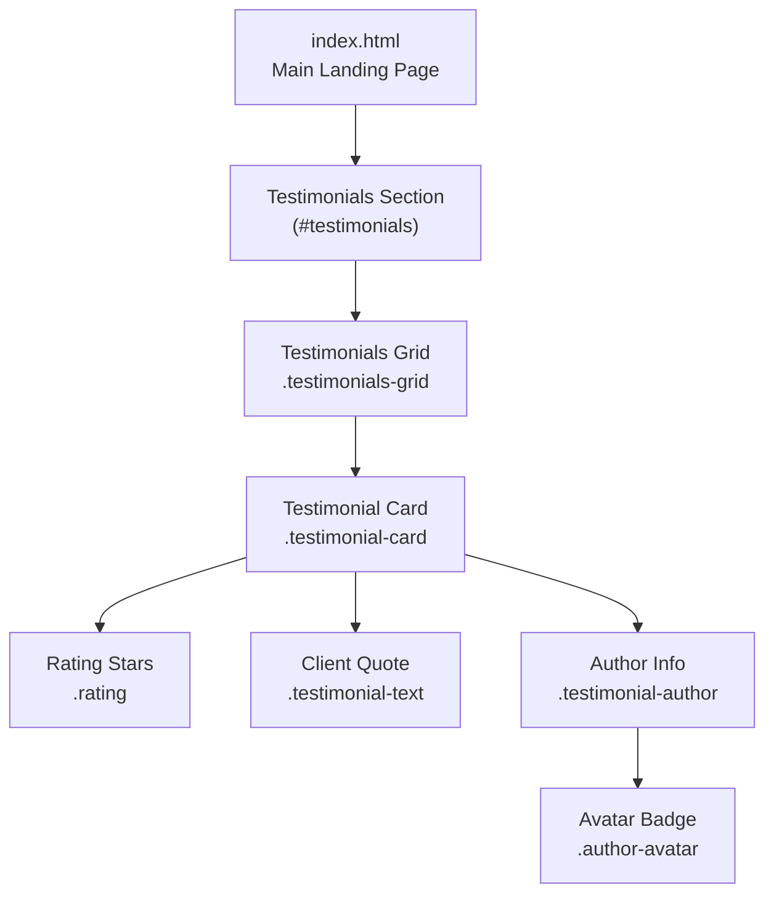
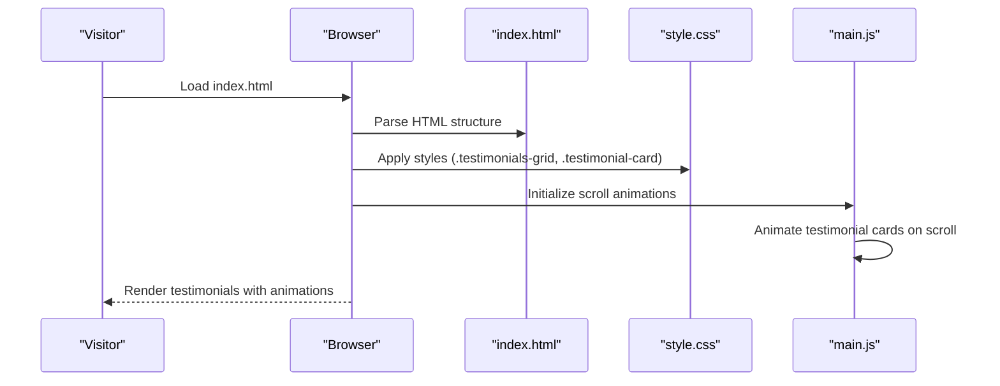
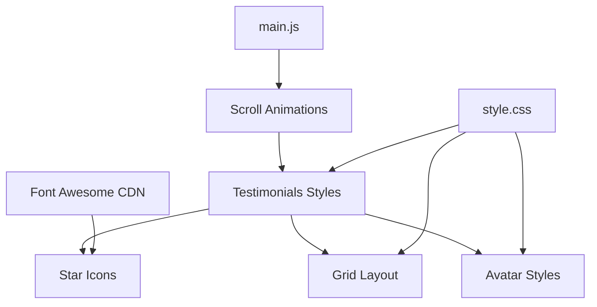

# Testimonials Section

<cite>
**Referenced Files in This Document**
- [index.html](file://index.html)
- [style.css](file://css/style.css)
- [main.js](file://js/main.js)
- [README.md](file://README.md)
</cite>

## Table of Contents
1. [Introduction](#introduction)
2. [Project Structure](#project-structure)
3. [Core Components](#core-components)
4. [Architecture Overview](#architecture-overview)
5. [Detailed Component Analysis](#detailed-component-analysis)
6. [Dependency Analysis](#dependency-analysis)
7. [Performance Considerations](#performance-considerations)
8. [Troubleshooting Guide](#troubleshooting-guide)
9. [Conclusion](#conclusion)

## Introduction
This document provides comprehensive guidance for implementing and maintaining the testimonials section on the website. It covers the HTML structure for each testimonial card, CSS styling for the grid layout and responsive design, the rating system using Font Awesome stars, avatar styling, and author attribution. It also includes practical examples for adding new testimonials, customizing the rating system, adjusting the grid layout, and implementing the author avatar system. Accessibility considerations for the rating system are addressed to ensure inclusive design.

## Project Structure
The testimonials section is part of the main landing page and is implemented using semantic HTML and modern CSS Grid. The section is styled with a cohesive design system that integrates with the overall site theme.

**Diagram sources**
- [index.html:292-381](file://index.html#L292-L381)
- [style.css:552-615](file://css/style.css#L552-L615)

**Section sources**
- [index.html:292-381](file://index.html#L292-L381)
- [style.css:552-615](file://css/style.css#L552-L615)

## Core Components
The testimonials section consists of:
- Container with section header and grid layout
- Individual testimonial cards with rating, quote, and author information
- Responsive grid that adapts to screen sizes
- Consistent typography and spacing aligned with the site’s design system

Key implementation points:
- HTML structure defines semantic sections and cards
- CSS Grid creates a flexible, responsive layout
- Font Awesome icons power the star rating system
- Avatar badges provide visual identity for authors

**Section sources**
- [index.html:292-381](file://index.html#L292-L381)
- [style.css:552-615](file://css/style.css#L552-L615)

## Architecture Overview
The testimonials section follows a modular architecture:
- HTML provides semantic structure and content
- CSS handles layout, typography, and visual presentation
- JavaScript enables scroll animations and interactive behaviors

**Diagram sources**
- [index.html:292-381](file://index.html#L292-L381)
- [style.css:552-615](file://css/style.css#L552-L615)
- [main.js:200-231](file://js/main.js#L200-L231)

## Detailed Component Analysis

### HTML Structure for Testimonial Cards
Each testimonial card follows a consistent structure:
- Rating container with five star icons
- Client quote paragraph with italicized text
- Author information with avatar badge and role

Example structure reference:
- [index.html:300-320](file://index.html#L300-L320)
- [index.html:321-340](file://index.html#L321-L340)
- [index.html:341-360](file://index.html#L341-L360)
- [index.html:361-380](file://index.html#L361-L380)

Implementation highlights:
- Star icons are rendered using Font Awesome classes
- Author avatar uses a simple text-initial badge
- Quote text is styled for readability and emphasis

**Section sources**
- [index.html:292-381](file://index.html#L292-L381)

### CSS Styling for Testimonial Grid Layout
The testimonials grid uses CSS Grid for responsive behavior:
- Auto-fit columns with minimum width constraints
- Consistent gap spacing between cards
- Card-level shadows and rounded corners

Responsive behavior:
- On smaller screens, the grid collapses to single-column layout
- Typography and spacing adjust for optimal readability

Reference styles:
- [style.css:552-561](file://css/style.css#L552-L561)
- [style.css:1292-1296](file://css/style.css#L1292-L1296)

**Section sources**
- [style.css:552-561](file://css/style.css#L552-L561)
- [style.css:1292-1296](file://css/style.css#L1292-L1296)

### Rating System Implementation
The rating system uses Font Awesome star icons:
- Five identical star icons represent full ratings
- Color theming aligns with the site’s accent color
- Font sizing ensures visibility and proportionality

Accessibility considerations:
- Screen readers interpret the star icons as decorative; ensure meaningful context via surrounding text
- Consider adding ARIA attributes if dynamic ratings are introduced

Reference styles:
- [style.css:572-576](file://css/style.css#L572-L576)

**Section sources**
- [style.css:572-576](file://css/style.css#L572-L576)

### Avatar Styling and Author Attribution
Author avatars are implemented as circular badges:
- Fixed dimensions for consistent alignment
- Centered initials for quick recognition
- Background and text color contrast for legibility

Author attribution includes:
- Full name in a heading element
- Professional role or title in a secondary text element

Reference styles:
- [style.css:594-604](file://css/style.css#L594-L604)
- [style.css:606-614](file://css/style.css#L606-L614)

**Section sources**
- [style.css:594-604](file://css/style.css#L594-L604)
- [style.css:606-614](file://css/style.css#L606-L614)

### Adding New Testimonials
Steps to add a new testimonial:
1. Duplicate an existing testimonial card structure
2. Replace star icons with desired rating count (1–5)
3. Update the quote text with the new testimonial content
4. Modify the author avatar text and role information
5. Ensure the grid remains responsive by keeping consistent markup

Reference structure:
- [index.html:300-320](file://index.html#L300-L320)
- [index.html:321-340](file://index.html#L321-L340)
- [index.html:341-360](file://index.html#L341-L360)
- [index.html:361-380](file://index.html#L361-L380)

**Section sources**
- [index.html:292-381](file://index.html#L292-L381)

### Customizing the Rating System
Options for customization:
- Adjust star color by modifying the rating color variable
- Change star size using the rating font size
- Replace star icons with alternative icons if desired

Reference styles:
- [style.css:572-576](file://css/style.css#L572-L576)

**Section sources**
- [style.css:572-576](file://css/style.css#L572-L576)

### Modifying the Grid Layout
Adjustments for different numbers of testimonials:
- Increase or decrease the number of cards in the grid
- The grid automatically adapts due to auto-fit behavior
- For fixed layouts, replace auto-fit with explicit column counts

Reference styles:
- [style.css:558-561](file://css/style.css#L558-L561)
- [style.css:1292-1296](file://css/style.css#L1292-L1296)

**Section sources**
- [style.css:558-561](file://css/style.css#L558-L561)
- [style.css:1292-1296](file://css/style.css#L1292-L1296)

### Implementing the Author Avatar System
Guidelines for avatar implementation:
- Use a two-character initial for clarity and brevity
- Maintain consistent sizing and alignment with the author row
- Ensure sufficient contrast between background and text colors

Reference styles:
- [style.css:594-604](file://css/style.css#L594-L604)

**Section sources**
- [style.css:594-604](file://css/style.css#L594-L604)

### Maintaining Consistent Styling
Best practices:
- Use the established color variables for consistency
- Maintain consistent spacing and typography scales
- Keep card layouts uniform across testimonials
- Test responsiveness across breakpoints

Reference styles:
- [style.css:552-615](file://css/style.css#L552-L615)

**Section sources**
- [style.css:552-615](file://css/style.css#L552-L615)

### Accessibility Considerations for the Rating System
Recommendations:
- Ensure the star icons are purely decorative; no alt text needed
- Provide sufficient color contrast for the star color against backgrounds
- Consider adding ARIA labels if the rating becomes interactive
- Maintain readable font sizes for the quote and author text

Reference styles:
- [style.css:572-576](file://css/style.css#L572-L576)
- [style.css:594-604](file://css/style.css#L594-L604)

**Section sources**
- [style.css:572-576](file://css/style.css#L572-L576)
- [style.css:594-604](file://css/style.css#L594-L604)

## Dependency Analysis
The testimonials section relies on:
- Font Awesome for star icons
- CSS Grid for responsive layout
- Site-wide color and typography variables
- JavaScript for scroll-triggered animations

**Diagram sources**
- [index.html](file://index.html#L21)
- [style.css:552-615](file://css/style.css#L552-L615)
- [main.js:200-231](file://js/main.js#L200-L231)

**Section sources**
- [index.html](file://index.html#L21)
- [style.css:552-615](file://css/style.css#L552-L615)
- [main.js:200-231](file://js/main.js#L200-L231)

## Performance Considerations
- Keep star icons lightweight by using Font Awesome CDN
- Minimize custom CSS to leverage existing variables and mixins
- Use CSS Grid for efficient layout rendering
- Avoid heavy JavaScript for static testimonials

[No sources needed since this section provides general guidance]

## Troubleshooting Guide
Common issues and resolutions:
- Misaligned avatars: Verify consistent dimensions and flex alignment
- Inconsistent spacing: Check card padding and grid gap values
- Poor readability: Confirm color contrast ratios for text and backgrounds
- Broken layout on small screens: Ensure media queries are active

Reference styles:
- [style.css:552-615](file://css/style.css#L552-L615)
- [style.css:1292-1296](file://css/style.css#L1292-L1296)

**Section sources**
- [style.css:552-615](file://css/style.css#L552-L615)
- [style.css:1292-1296](file://css/style.css#L1292-L1296)

## Conclusion
The testimonials section is a well-structured, accessible, and responsive component that enhances social proof and trust. By following the guidelines in this document, you can confidently add new testimonials, customize the rating system, adjust the grid layout, and maintain consistent styling across the site. The implementation leverages modern web standards and integrates seamlessly with the broader design system.