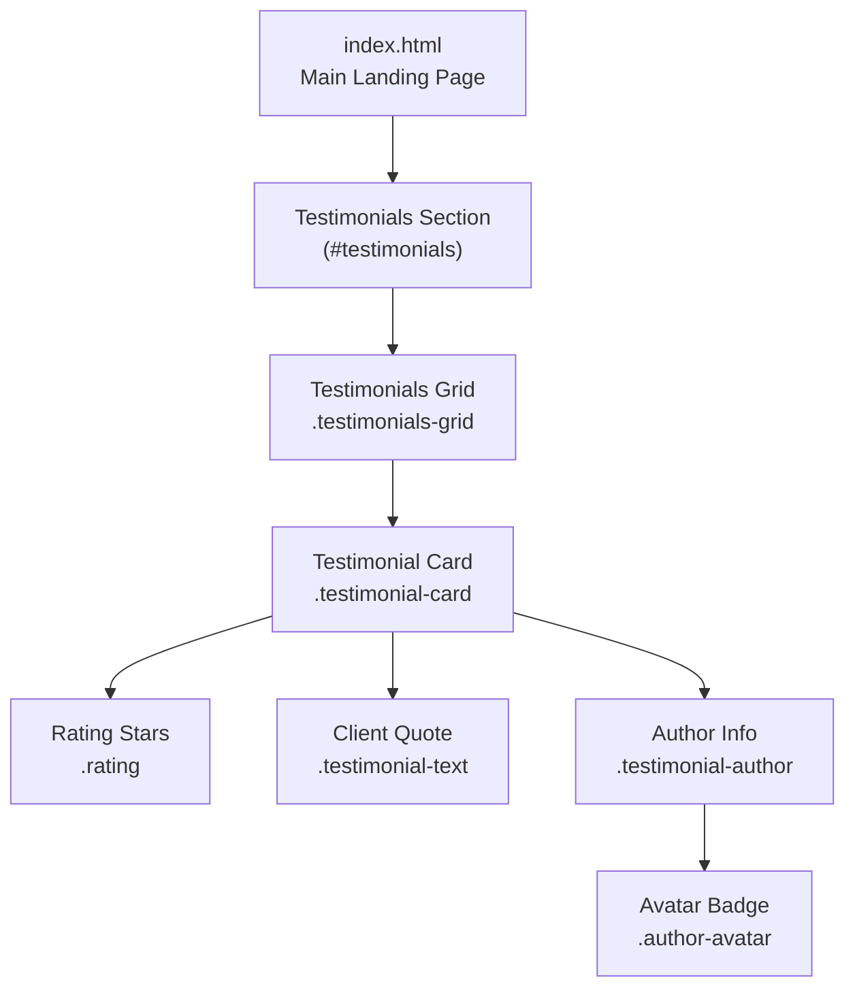
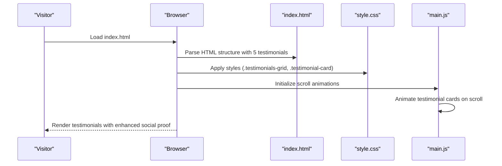
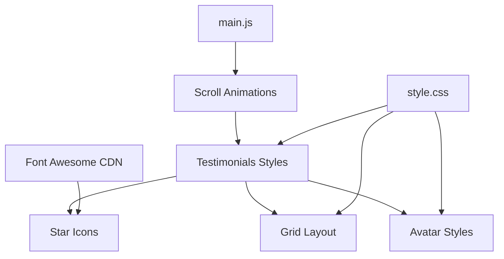

# Testimonials Section

<cite>
**Referenced Files in This Document**
- [index.html](file://index.html)
- [style.css](file://css/style.css)
- [main.js](file://js/main.js)
- [README.md](file://README.md)
</cite>

## Update Summary
**Changes Made**
- Updated testimonial count from 4 to 5 cards
- Added new testimonial featuring Fernando's success story
- Enhanced social proof with additional student success story
- Improved user engagement through authentic feedback examples

## Table of Contents
1. [Introduction](#introduction)
2. [Project Structure](#project-structure)
3. [Core Components](#core-components)
4. [Architecture Overview](#architecture-overview)
5. [Detailed Component Analysis](#detailed-component-analysis)
6. [Dependency Analysis](#dependency-analysis)
7. [Performance Considerations](#performance-considerations)
8. [Troubleshooting Guide](#troubleshooting-guide)
9. [Conclusion](#conclusion)

## Introduction
This document provides comprehensive guidance for implementing and maintaining the testimonials section on the website. It covers the HTML structure for each testimonial card, CSS styling for the grid layout and responsive design, the rating system using Font Awesome stars, avatar styling, and author attribution. The section now features 5 authentic student testimonials that demonstrate real success stories and improved social proof for potential clients.

## Project Structure
The testimonials section is part of the main landing page and is implemented using semantic HTML and modern CSS Grid. The section is styled with a cohesive design system that integrates with the overall site theme and showcases authentic student success stories.

**Diagram sources**
- [index.html:312-420](file://index.html#L312-L420)
- [style.css:550-615](file://css/style.css#L550-L615)

**Section sources**
- [index.html:312-420](file://index.html#L312-L420)
- [style.css:550-615](file://css/style.css#L550-L615)

## Core Components
The testimonials section consists of:
- Container with section header and grid layout showcasing 5 authentic testimonials
- Individual testimonial cards with rating, quote, and author information
- Responsive grid that adapts to screen sizes with 5 cards displayed
- Consistent typography and spacing aligned with the site's design system

Key implementation points:
- HTML structure defines semantic sections and cards with authentic student feedback
- CSS Grid creates a flexible, responsive layout optimized for 5 cards
- Font Awesome icons power the star rating system with consistent styling
- Avatar badges provide visual identity for diverse author backgrounds

**Updated** Enhanced with additional testimonial featuring Fernando's success story demonstrating real-world application of English skills

**Section sources**
- [index.html:312-420](file://index.html#L312-L420)
- [style.css:550-615](file://css/style.css#L550-L615)

## Architecture Overview
The testimonials section follows a modular architecture:
- HTML provides semantic structure and authentic content
- CSS handles layout, typography, and visual presentation
- JavaScript enables scroll animations and interactive behaviors

**Diagram sources**
- [index.html:312-420](file://index.html#L312-L420)
- [style.css:550-615](file://css/style.css#L550-L615)
- [main.js:200-231](file://js/main.js#L200-L231)

## Detailed Component Analysis

### HTML Structure for Testimonial Cards
Each testimonial card follows a consistent structure with authentic content:
- Rating container with five star icons for perfect scores
- Client quote paragraph with italicized text showcasing real success stories
- Author information with avatar badge and professional attribution

**Updated** Enhanced with Fernando's testimonial featuring his international travel success story

Example structure reference:
- [index.html:320-340](file://index.html#L320-L340)
- [index.html:341-360](file://index.html#L341-L360)
- [index.html:361-380](file://index.html#L361-L380)
- [index.html:381-400](file://index.html#L381-L400)
- [index.html:399-418](file://index.html#L399-L418)

Implementation highlights:
- Star icons are rendered using Font Awesome classes for consistent styling
- Author avatar uses a simple text-initial badge with "F" for Fernando
- Quote text showcases authentic success stories and real-world applications
- Enhanced social proof through diverse professional backgrounds

**Section sources**
- [index.html:312-420](file://index.html#L312-L420)

### CSS Styling for Testimonial Grid Layout
The testimonials grid uses CSS Grid for responsive behavior optimized for 5 cards:
- Auto-fit columns with minimum width constraints for optimal spacing
- Consistent gap spacing between cards for visual balance
- Card-level shadows and rounded corners for depth perception

Responsive behavior:
- On smaller screens, the grid collapses to single-column layout
- Typography and spacing adjust for optimal readability across devices
- Grid maintains 5-card layout on larger screens for maximum social proof

Reference styles:
- [style.css:557-561](file://css/style.css#L557-L561)
- [style.css:558-561](file://css/style.css#L558-L561)

**Section sources**
- [style.css:557-561](file://css/style.css#L557-L561)
- [style.css:558-561](file://css/style.css#L558-L561)

### Rating System Implementation
The rating system uses Font Awesome star icons with consistent styling:
- Five identical star icons representing perfect 5-star ratings
- Color theming aligns with the site's accent color (#f39c12)
- Font sizing ensures visibility and proportionality across all testimonials

Accessibility considerations:
- Screen readers interpret the star icons as decorative elements
- Ensure meaningful context via surrounding text and author information
- Consider adding ARIA attributes if dynamic ratings are introduced

Reference styles:
- [style.css:572-576](file://css/style.css#L572-L576)

**Section sources**
- [style.css:572-576](file://css/style.css#L572-L576)

### Avatar Styling and Author Attribution
Author avatars are implemented as circular badges with consistent styling:
- Fixed dimensions (50px) for consistent alignment across testimonials
- Centered initials for quick recognition and brand identity
- Background and text color contrast for legibility and visual appeal

Author attribution includes:
- Full name in a heading element with consistent typography
- Professional role or title in a secondary text element
- Enhanced diversity with various professional backgrounds

**Updated** Includes Fernando's avatar with "F" initials and professional title "Profissional — Minas Gerais"

Reference styles:
- [style.css:594-604](file://css/style.css#L594-L604)
- [style.css:606-614](file://css/style.css#L606-L614)

**Section sources**
- [style.css:594-604](file://css/style.css#L594-L604)
- [style.css:606-614](file://css/style.css#L606-L614)

### Adding New Testimonials
Steps to add a new testimonial:
1. Duplicate an existing testimonial card structure
2. Replace star icons with desired rating count (1–5)
3. Update the quote text with the new testimonial content showcasing authentic success stories
4. Modify the author avatar text and professional role information
5. Ensure the grid remains responsive by keeping consistent markup

**Updated** Enhanced process with emphasis on authentic storytelling and real-world success examples

Reference structure:
- [index.html:320-340](file://index.html#L320-L340)
- [index.html:341-360](file://index.html#L341-L360)
- [index.html:361-380](file://index.html#L361-L380)
- [index.html:381-400](file://index.html#L381-L400)
- [index.html:399-418](file://index.html#L399-L418)

**Section sources**
- [index.html:312-420](file://index.html#L312-L420)

### Customizing the Rating System
Options for customization:
- Adjust star color by modifying the rating color variable (--accent-color)
- Change star size using the rating font size (1.125rem)
- Replace star icons with alternative icons if desired
- Implement dynamic rating systems if needed

Reference styles:
- [style.css:572-576](file://css/style.css#L572-L576)

**Section sources**
- [style.css:572-576](file://css/style.css#L572-L576)

### Modifying the Grid Layout
Adjustments for different numbers of testimonials:
- Increase or decrease the number of cards in the grid (currently 5)
- The grid automatically adapts due to auto-fit behavior with minmax(280px, 1fr)
- For fixed layouts, replace auto-fit with explicit column counts
- Optimal viewing experience maintained across 3-5 testimonials

**Updated** Enhanced grid layout optimized for 5 testimonials to maximize social proof impact

Reference styles:
- [style.css:558-561](file://css/style.css#L558-L561)
- [style.css:557-561](file://css/style.css#L557-L561)

**Section sources**
- [style.css:558-561](file://css/style.css#L558-L561)
- [style.css:557-561](file://css/style.css#L557-L561)

### Implementing the Author Avatar System
Guidelines for avatar implementation:
- Use a two-character initial for clarity and brand recognition
- Maintain consistent sizing (50px) and alignment with the author row
- Ensure sufficient contrast between background (--primary-color) and text colors
- Consider professional diversity with varied backgrounds and roles

**Updated** Enhanced avatar system with diverse professional backgrounds including "Profissional — Minas Gerais"

Reference styles:
- [style.css:594-604](file://css/style.css#L594-L604)

**Section sources**
- [style.css:594-604](file://css/style.css#L594-L604)

### Maintaining Consistent Styling
Best practices:
- Use the established color variables for consistency across all testimonials
- Maintain consistent spacing and typography scales for visual harmony
- Keep card layouts uniform across all 5 testimonials
- Test responsiveness across breakpoints for optimal mobile experience

**Updated** Enhanced consistency with 5 testimonials providing maximum social proof impact

Reference styles:
- [style.css:550-615](file://css/style.css#L550-L615)

**Section sources**
- [style.css:550-615](file://css/style.css#L550-L615)

### Accessibility Considerations for the Rating System
Recommendations:
- Ensure the star icons are purely decorative; no alt text needed
- Provide sufficient color contrast for the star color against backgrounds
- Consider adding ARIA labels if the rating becomes interactive
- Maintain readable font sizes for the quote and author text
- Ensure screen readers can properly navigate the testimonial content

Reference styles:
- [style.css:572-576](file://css/style.css#L572-L576)
- [style.css:594-604](file://css/style.css#L594-L604)

**Section sources**
- [style.css:572-576](file://css/style.css#L572-L576)
- [style.css:594-604](file://css/style.css#L594-L604)

## Dependency Analysis
The testimonials section relies on:
- Font Awesome for star icons and social proof elements
- CSS Grid for responsive layout optimized for 5 cards
- Site-wide color and typography variables for consistency
- JavaScript for scroll-triggered animations affecting all testimonial cards

**Updated** Enhanced dependency chain with improved social proof through additional testimonials

**Diagram sources**
- [index.html:37](file://index.html#L37)
- [style.css:550-615](file://css/style.css#L550-L615)
- [main.js:200-231](file://js/main.js#L200-L231)

**Section sources**
- [index.html:37](file://index.html#L37)
- [style.css:550-615](file://css/style.css#L550-L615)
- [main.js:200-231](file://js/main.js#L200-L231)

## Performance Considerations
- Keep star icons lightweight by using Font Awesome CDN
- Minimize custom CSS to leverage existing variables and mixins
- Use CSS Grid for efficient layout rendering with 5 cards
- Avoid heavy JavaScript for static testimonials
- Optimize for mobile performance with responsive design

**Updated** Enhanced performance considerations for 5 testimonials with optimized mobile experience

## Troubleshooting Guide
Common issues and resolutions:
- Misaligned avatars: Verify consistent dimensions (50px) and flex alignment
- Inconsistent spacing: Check card padding and grid gap values (2rem)
- Poor readability: Confirm color contrast ratios for text and backgrounds
- Broken layout on small screens: Ensure media queries are active for 5-card grid
- Content overflow: Verify testimonial text fits within card boundaries

**Updated** Enhanced troubleshooting for 5-card grid layout and additional content management

Reference styles:
- [style.css:550-615](file://css/style.css#L550-L615)
- [style.css:557-561](file://css/style.css#L557-L561)

**Section sources**
- [style.css:550-615](file://css/style.css#L550-L615)
- [style.css:557-561](file://css/style.css#L557-L561)

## Conclusion
The testimonials section is a well-structured, accessible, and responsive component that significantly enhances social proof and trust. With the addition of Fernando's success story and the current 5-card layout, the section now provides maximum social proof impact while maintaining consistent styling and accessibility standards. By following the guidelines in this document, you can confidently manage the expanded testimonial collection, customize the rating system, adjust the grid layout, and maintain consistent styling across the site. The implementation leverages modern web standards and integrates seamlessly with the broader design system, providing visitors with authentic evidence of the program's effectiveness.