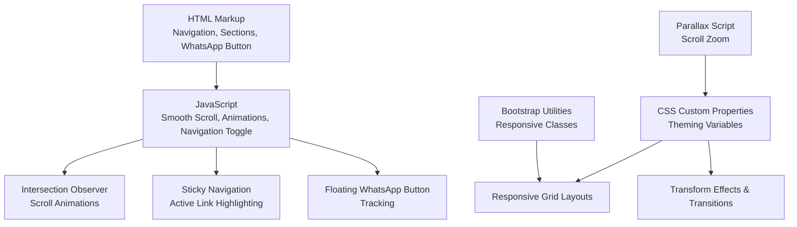
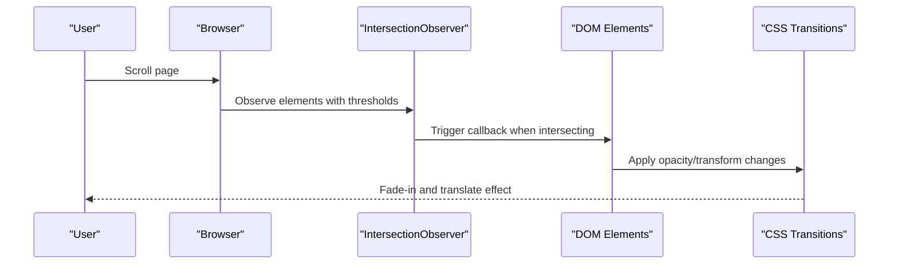
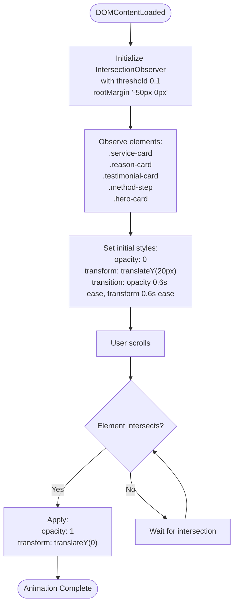
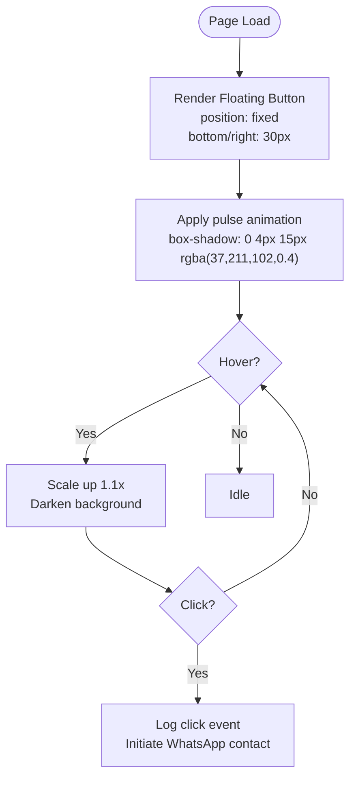
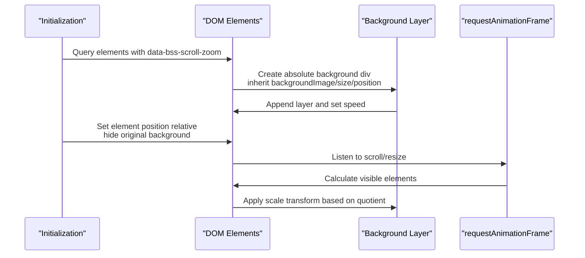
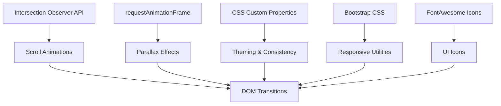

# Technical Features

<cite>
**Referenced Files in This Document**
- [main.js](file://js/main.js)
- [style.css](file://css/style.css)
- [index.html](file://index.html)
- [bs-init.js](file://assets/js/bs-init.js)
- [bs-init.js](file://assets/js/js/bs-init.js)
- [bootstrap.min.css](file://assets/css/bootstrap/css/bootstrap.min.css)
- [aos.min.css](file://assets/css/aos.min.css)
</cite>

## Table of Contents
1. [Introduction](#introduction)
2. [Project Structure](#project-structure)
3. [Core Components](#core-components)
4. [Architecture Overview](#architecture-overview)
5. [Detailed Component Analysis](#detailed-component-analysis)
6. [Dependency Analysis](#dependency-analysis)
7. [Performance Considerations](#performance-considerations)
8. [Troubleshooting Guide](#troubleshooting-guide)
9. [Conclusion](#conclusion)

## Introduction
This document covers the technical features implemented in the website, focusing on scroll animations, parallax effects, floating elements, and performance optimizations. It explains the Intersection Observer API implementation for scroll-triggered animations, CSS transform effects, fade-in transitions, floating WhatsApp button functionality, sticky navigation behavior, responsive breakpoint management, and the use of CSS custom properties for theming. It also provides guidance on animation timing, performance considerations, browser compatibility strategies, responsive grid layouts, and mobile-first design principles.

## Project Structure
The technical features are implemented through a combination of HTML markup, CSS custom properties, modern CSS transforms, and JavaScript for dynamic interactions. The structure integrates:
- Sticky navigation with smooth scrolling and active link highlighting
- Intersection Observer-based fade-in animations
- Floating WhatsApp button with pulse animation
- Responsive grid layouts using CSS Grid and Bootstrap utilities
- Parallax background effects via a dedicated script
- Mobile-first responsive design with media queries



**Diagram sources**
- [index.html:24-522](file://index.html#L24-L522)
- [main.js:1-338](file://js/main.js#L1-L338)
- [style.css:10-24](file://css/style.css#L10-L24)
- [style.css:1198-1234](file://css/style.css#L1198-L1234)
- [bs-init.js:17-96](file://assets/js/bs-init.js#L17-L96)

**Section sources**
- [index.html:24-522](file://index.html#L24-L522)
- [main.js:1-338](file://js/main.js#L1-L338)
- [style.css:10-24](file://css/style.css#L10-L24)

## Core Components
This section outlines the primary technical components and their roles:

- **Intersection Observer Scroll Animations**: Implements fade-in transitions for cards and content blocks when they enter the viewport.
- **Sticky Navigation**: Maintains a fixed header with shadow changes on scroll and active link highlighting based on current section.
- **Floating WhatsApp Button**: Provides a persistent floating action button with hover scaling and pulsing animation.
- **Responsive Grid Layouts**: Uses CSS Grid and Bootstrap utilities to create adaptive layouts across breakpoints.
- **Parallax Background Effects**: Applies zoom-based parallax to hero and section backgrounds using requestAnimationFrame.
- **CSS Custom Properties**: Centralizes theme variables for colors, shadows, transitions, and spacing.

**Section sources**
- [main.js:200-231](file://js/main.js#L200-L231)
- [main.js:67-74](file://js/main.js#L67-L74)
- [main.js:236-260](file://js/main.js#L236-L260)
- [style.css:1198-1234](file://css/style.css#L1198-L1234)
- [style.css:1239-1329](file://css/style.css#L1239-L1329)
- [bs-init.js:17-96](file://assets/js/bs-init.js#L17-L96)
- [style.css:10-24](file://css/style.css#L10-L24)

## Architecture Overview
The technical architecture combines declarative HTML, centralized CSS theming, and modular JavaScript for interactions. The Intersection Observer drives scroll-triggered animations, while requestAnimationFrame optimizes parallax rendering. Responsive breakpoints are managed through CSS media queries and Bootstrap utilities.



**Diagram sources**
- [main.js:200-231](file://js/main.js#L200-L231)
- [style.css:209-226](file://css/style.css#L209-L226)

**Section sources**
- [main.js:200-231](file://js/main.js#L200-L231)
- [style.css:209-226](file://css/style.css#L209-L226)

## Detailed Component Analysis

### Intersection Observer Scroll Animations
The Intersection Observer API is used to trigger fade-in and slide-up animations for service cards, reason cards, testimonial cards, methodology steps, and hero cards. The implementation sets initial opacity and transform states, defines observer thresholds and root margins, and applies transitions on intersection.

Key characteristics:
- Threshold: 0.1 for early triggering
- Root margin: adjusted to trigger animations before elements reach the top
- Transition: opacity and transform with easing
- Target elements: service-card, reason-card, testimonial-card, method-step, hero-card



**Diagram sources**
- [main.js:200-231](file://js/main.js#L200-L231)
- [style.css:209-226](file://css/style.css#L209-L226)

**Section sources**
- [main.js:200-231](file://js/main.js#L200-L231)
- [style.css:209-226](file://css/style.css#L209-L226)

### Sticky Navigation Behavior
The navigation remains fixed at the top with a sticky position and adjusts its shadow based on scroll distance. Active navigation links are highlighted based on the current section in view.

Key characteristics:
- Sticky header with top: 0 and z-index: 1000
- Shadow change threshold: > 50px scroll
- Active link detection: compares current scroll position against section offsets
- Mobile toggle: hamburger menu with animated spans

```mermaid
sequenceDiagram
participant User as "User"
participant Window as "Window"
participant Header as "Header"
participant Nav as "Nav Menu"
participant Links as "Nav Links"
User->>Window : Scroll
Window->>Header : Update shadow based on scrollY
Window->>Links : Update active link based on current section
User->>Nav : Click hamburger
Nav->>Nav : Toggle active class<br/>Animate spans transform/opacity
```

**Diagram sources**
- [main.js:67-74](file://js/main.js#L67-L74)
- [main.js:236-260](file://js/main.js#L236-L260)
- [main.js:4-42](file://js/main.js#L4-L42)

**Section sources**
- [main.js:67-74](file://js/main.js#L67-L74)
- [main.js:236-260](file://js/main.js#L236-L260)
- [main.js:4-42](file://js/main.js#L4-L42)

### Floating WhatsApp Button
A floating action button is positioned fixed at the bottom-right corner with a pulsing animation and hover scaling effect. It includes tracking for click events.

Key characteristics:
- Fixed positioning with z-index: 999
- Pulse animation: box-shadow intensity variation
- Hover effect: background darken and scale up
- Click tracking: logs initiation source



**Diagram sources**
- [style.css:1198-1234](file://css/style.css#L1198-L1234)
- [main.js:265-271](file://js/main.js#L265-L271)

**Section sources**
- [style.css:1198-1234](file://css/style.css#L1198-L1234)
- [main.js:265-271](file://js/main.js#L265-L271)

### Parallax Background Effects
Parallax is implemented using a dedicated script that creates off-screen background layers for elements with a specific data attribute. It calculates visibility and applies scale transforms using requestAnimationFrame for smooth performance.

Key characteristics:
- Data attribute: data-bss-scroll-zoom
- Speed factor: configurable via data attribute
- Visibility: elements within viewport trigger updates
- Transform: scale3d based on scroll position ratio



**Diagram sources**
- [bs-init.js:17-96](file://assets/js/bs-init.js#L17-L96)

**Section sources**
- [bs-init.js:17-96](file://assets/js/bs-init.js#L17-L96)

### Responsive Breakpoint Management
Responsive design is managed through CSS media queries and Bootstrap utility classes. Breakpoints include:
- Mobile-first: base styles for small screens
- Tablet: 768px and above
- Desktop: 992px and above
- Large desktop: 1400px and above

Key characteristics:
- Media queries: max-width for each breakpoint
- Grid adjustments: single column layouts on smaller screens
- Navigation: mobile menu toggles at 768px
- Button sizing: responsive adjustments for smaller screens

**Section sources**
- [style.css:1239-1329](file://css/style.css#L1239-L1329)
- [bootstrap.min.css:2627-2655](file://assets/css/bootstrap/css/bootstrap.min.css#L2627-L2655)

### CSS Custom Properties for Theming
CSS custom properties centralize theme variables for colors, shadows, transitions, and spacing. These variables are used throughout the stylesheet to maintain consistent theming.

Key characteristics:
- Color palette: primary, secondary, accent, text, background
- Shadows: base and hover variants
- Transitions: global transition duration and easing
- Usage: var(--variable-name) across components

**Section sources**
- [style.css:10-24](file://css/style.css#L10-L24)

### Responsive Grid Layouts and Mobile-First Design
Grid layouts are implemented using CSS Grid with automatic fitting columns and Bootstrap utility classes. Mobile-first design ensures optimal presentation on small screens with progressive enhancements for larger devices.

Key characteristics:
- CSS Grid: repeat(auto-fit, minmax()) for flexible columns
- Bootstrap utilities: responsive classes for alignment and spacing
- Mobile-first: base grid configurations optimized for small screens
- Progressive enhancement: adjustments for tablet and desktop breakpoints

**Section sources**
- [style.css:381-385](file://css/style.css#L381-L385)
- [style.css:472-476](file://css/style.css#L472-L476)
- [style.css:514-518](file://css/style.css#L514-L518)
- [style.css:557-561](file://css/style.css#L557-L561)
- [style.css:1334-1341](file://css/style.css#L1334-L1341)

## Dependency Analysis
The technical features depend on several libraries and APIs:
- Intersection Observer API: native browser API for scroll-triggered animations
- requestAnimationFrame: native browser API for smooth parallax rendering
- CSS Custom Properties: modern CSS feature for theming
- Bootstrap CSS: utility classes for responsive behavior
- FontAwesome Icons: icons for buttons and decorative elements



**Diagram sources**
- [main.js:200-231](file://js/main.js#L200-L231)
- [bs-init.js:17-96](file://assets/js/bs-init.js#L17-L96)
- [style.css:10-24](file://css/style.css#L10-L24)
- [bootstrap.min.css:2627-2655](file://assets/css/bootstrap/css/bootstrap.min.css#L2627-L2655)

**Section sources**
- [main.js:200-231](file://js/main.js#L200-L231)
- [bs-init.js:17-96](file://assets/js/bs-init.js#L17-L96)
- [style.css:10-24](file://css/style.css#L10-L24)

## Performance Considerations
Performance is optimized through several strategies:
- requestAnimationFrame for smooth parallax rendering
- Efficient CSS transforms and opacity changes
- Intersection Observer for low overhead scroll detection
- CSS custom properties for reduced style recalculation
- Mobile-first approach minimizing unnecessary animations on small screens
- Minimal JavaScript footprint with focused functionality

Best practices:
- Use transform and opacity for hardware-accelerated animations
- Limit observer thresholds and root margins to reduce calculations
- Defer non-critical animations until after initial load
- Optimize images and background assets for parallax effects
- Monitor scroll performance on mobile devices

## Troubleshooting Guide
Common issues and solutions:
- Animations not triggering: verify Intersection Observer support and correct selector classes
- Parallax not working: ensure data-bss-scroll-zoom attributes are present and script loads
- Navigation toggle issues: check for conflicting CSS and JavaScript errors
- Responsive layout problems: verify media query breakpoints and Bootstrap class usage
- Floating button not visible: confirm fixed positioning and z-index values

Debugging tips:
- Use browser dev tools to inspect element visibility and transform states
- Check console for JavaScript errors during initialization
- Verify CSS custom property values are correctly applied
- Test animations across different screen sizes and browsers

**Section sources**
- [main.js:200-231](file://js/main.js#L200-L231)
- [bs-init.js:17-96](file://assets/js/bs-init.js#L17-L96)
- [main.js:328-331](file://js/main.js#L328-L331)

## Conclusion
The website implements a comprehensive set of technical features that combine modern web APIs with efficient CSS and JavaScript. The Intersection Observer-driven animations, parallax effects, sticky navigation, and floating elements work together to create an engaging user experience while maintaining performance and responsiveness. The use of CSS custom properties ensures consistent theming, and the mobile-first approach guarantees optimal presentation across all devices. These features provide a solid foundation for extending functionality and maintaining accessibility standards.