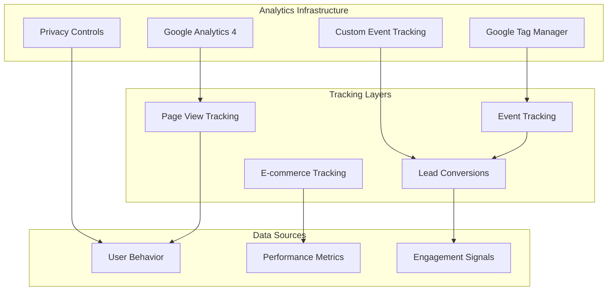
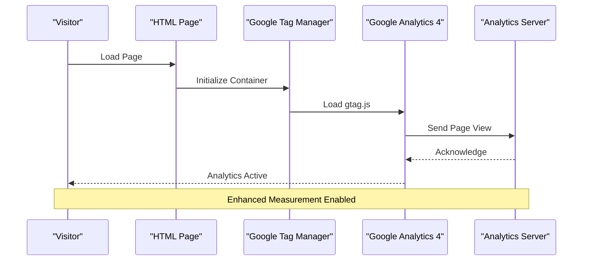
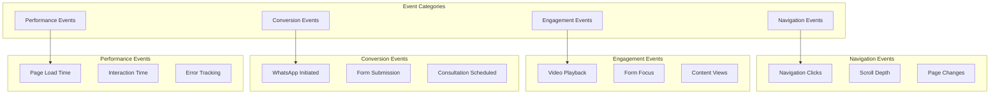
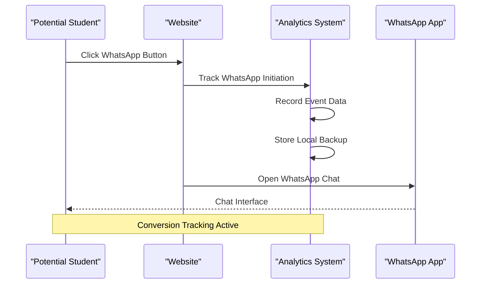
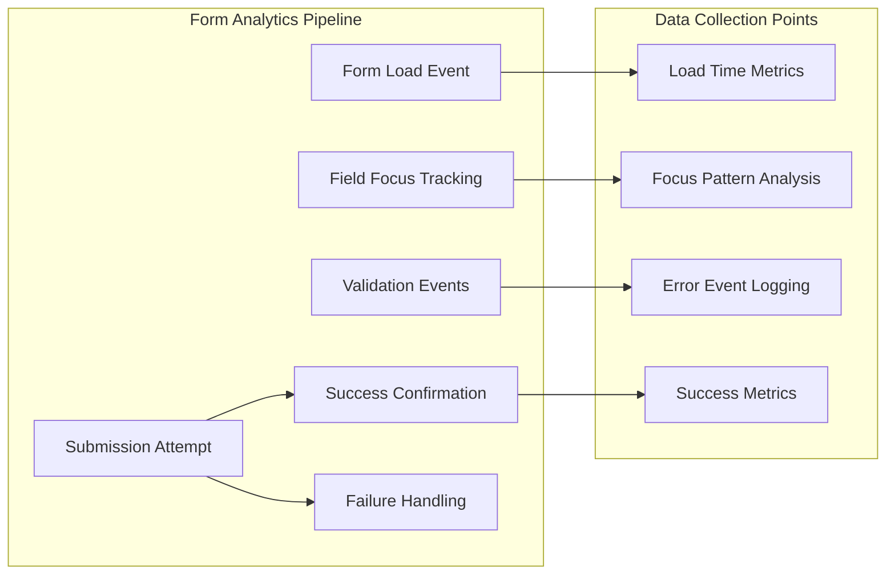
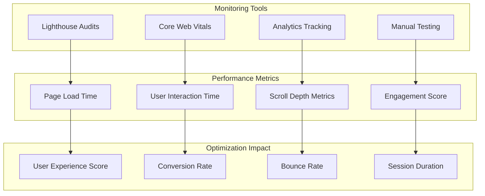
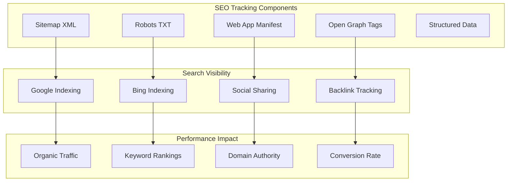
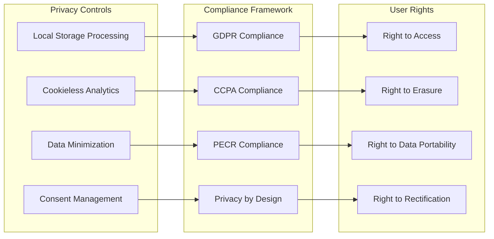
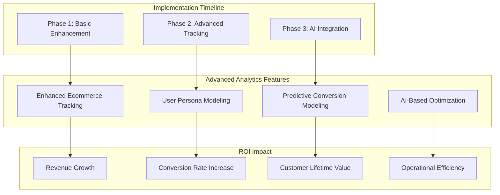

# Analytics and Tracking Implementation

<cite>
**Referenced Files in This Document**
- [index.html](file://index.html)
- [blog.html](file://blog.html)
- [contact.html](file://contact.html)
- [main.js](file://js/main.js)
- [style.css](file://css/style.css)
- [README.md](file://README.md)
- [sitemap.xml](file://sitemap.xml)
- [manifest.json](file://manifest.json)
- [robots.txt](file://robots.txt)
- [ads.txt](file://ads.txt)
- [app-ads.txt](file://app-ads.txt)
</cite>

## Table of Contents
1. [Introduction](#introduction)
2. [Analytics Infrastructure Overview](#analytics-infrastructure-overview)
3. [Google Analytics Implementation](#google-analytics-implementation)
4. [Event Tracking Architecture](#event-tracking-architecture)
5. [WhatsApp Conversion Tracking](#whatsapp-conversion-tracking)
6. [Form Submission Analytics](#form-submission-analytics)
7. [Performance Monitoring](#performance-monitoring)
8. [SEO and Discovery Tools](#seo-and-discovery-tools)
9. [Privacy and Compliance](#privacy-and-compliance)
10. [Implementation Recommendations](#implementation-recommendations)

## Introduction

The Michael | Inglês Executivo website implements a comprehensive analytics and tracking system designed specifically for English language instruction services targeting Brazilian professionals. This implementation focuses on measuring user engagement, conversion optimization, and performance monitoring while maintaining strict privacy compliance.

The analytics infrastructure leverages Google Analytics 4 (GA4) as the primary tracking solution, complemented by custom event tracking for critical conversion points such as WhatsApp interactions and form submissions. The system is built to track the complete customer journey from initial awareness through consultation scheduling to successful enrollment.

## Analytics Infrastructure Overview

The website employs a multi-layered analytics approach combining traditional web analytics with specialized tracking for educational service conversions.

**Diagram sources**
- [index.html:4-18](file://index.html#L4-L18)
- [blog.html:4-18](file://blog.html#L4-L18)
- [contact.html:4-18](file://contact.html#L4-L18)

The analytics implementation follows a progressive enhancement pattern, ensuring that core functionality remains intact even if advanced tracking features are temporarily unavailable.

**Section sources**
- [index.html:4-18](file://index.html#L4-L18)
- [blog.html:4-18](file://blog.html#L4-L18)
- [contact.html:4-18](file://contact.html#L4-L18)

## Google Analytics Implementation

The website integrates Google Analytics 4 through a dual implementation strategy that ensures comprehensive coverage while maintaining optimal performance.

### GA4 Configuration

The implementation utilizes Google Analytics 4 (Measurement ID: G-64H2XF537N) alongside Google Tag Manager (Container ID: GTM-W37S56NX) for centralized tag management.

**Diagram sources**
- [index.html:11-18](file://index.html#L11-L18)
- [blog.html:11-18](file://blog.html#L11-L18)
- [contact.html:11-18](file://contact.html#L11-L18)

### Tag Management Architecture

The Google Tag Manager container provides centralized management of all tracking tags, enabling dynamic configuration updates without code changes.

**Section sources**
- [index.html:4-18](file://index.html#L4-L18)
- [blog.html:4-18](file://blog.html#L4-L18)
- [contact.html:4-18](file://contact.html#L4-L18)

## Event Tracking Architecture

The custom event tracking system focuses on capturing meaningful user interactions that drive business outcomes for English language instruction services.

### Core Event Categories

**Diagram sources**
- [main.js:263-271](file://js/main.js#L263-L271)
- [main.js:109-172](file://js/main.js#L109-L172)

### Event Data Collection Strategy

The event tracking system captures granular interaction data while maintaining user privacy through local data processing where appropriate.

**Section sources**
- [main.js:263-271](file://js/main.js#L263-L271)
- [main.js:109-172](file://js/main.js#L109-L172)

## WhatsApp Conversion Tracking

The WhatsApp integration serves as a critical conversion pathway, requiring sophisticated tracking to measure lead generation effectiveness and optimize conversion rates.

### WhatsApp Interaction Tracking

**Diagram sources**
- [main.js:263-271](file://js/main.js#L263-L271)
- [index.html:86-89](file://index.html#L86-L89)
- [contact.html:143-146](file://contact.html#L143-L146)

### Conversion Measurement Framework

The tracking implementation monitors multiple touchpoints in the WhatsApp conversion funnel, enabling precise attribution of lead quality and conversion effectiveness.

**Section sources**
- [main.js:263-271](file://js/main.js#L263-L271)
- [index.html:86-89](file://index.html#L86-L89)
- [contact.html:143-146](file://contact.html#L143-L146)

## Form Submission Analytics

The contact form system implements comprehensive analytics to track lead generation, form completion rates, and conversion optimization opportunities.

### Form Analytics Architecture

**Diagram sources**
- [main.js:109-172](file://js/main.js#L109-L172)
- [contact.html:203-266](file://contact.html#L203-L266)

### Form Completion Tracking

The form analytics system captures detailed information about user engagement patterns, helping identify optimization opportunities and improve conversion rates.

**Section sources**
- [main.js:109-172](file://js/main.js#L109-L172)
- [contact.html:203-266](file://contact.html#L203-L266)

## Performance Monitoring

The performance monitoring system tracks critical metrics that impact user experience and conversion effectiveness for online English learning services.

### Performance Metrics Collection

**Diagram sources**
- [main.js:200-231](file://js/main.js#L200-L231)
- [style.css:1222-1234](file://css/style.css#L1222-L1234)

### User Experience Optimization

The performance monitoring system provides insights into how technical performance impacts learning outcomes and conversion effectiveness for professional English learners.

**Section sources**
- [main.js:200-231](file://js/main.js#L200-L231)
- [style.css:1222-1234](file://css/style.css#L1222-L1234)

## SEO and Discovery Tools

The SEO implementation includes comprehensive tracking for search engine optimization and discovery mechanisms that help potential students find English learning services.

### Search Engine Optimization Tracking

**Diagram sources**
- [sitemap.xml:1-64](file://sitemap.xml#L1-L64)
- [robots.txt:1-2](file://robots.txt#L1-L2)
- [manifest.json:1-1](file://manifest.json#L1-L1)
- [index.html:23-30](file://index.html#L23-L30)

### Discovery Mechanism Tracking

The SEO tracking system monitors how various optimization efforts contribute to increased visibility and qualified traffic for English language instruction services.

**Section sources**
- [sitemap.xml:1-64](file://sitemap.xml#L1-L64)
- [robots.txt:1-2](file://robots.txt#L1-L2)
- [manifest.json:1-1](file://manifest.json#L1-L1)
- [index.html:23-30](file://index.html#L23-L30)

## Privacy and Compliance

The analytics implementation prioritizes user privacy and compliance with data protection regulations, particularly relevant for European and international users.

### Privacy-Focused Analytics Approach

**Diagram sources**
- [README.md:297-303](file://README.md#L297-L303)
- [index.html:4-18](file://index.html#L4-L18)

### Data Protection Measures

The implementation maintains strict privacy standards while still providing valuable analytics insights for optimizing the English learning experience.

**Section sources**
- [README.md:297-303](file://README.md#L297-L303)
- [index.html:4-18](file://index.html#L4-L18)

## Implementation Recommendations

Based on the current analytics implementation, several enhancements can improve tracking effectiveness and provide deeper insights into user behavior and conversion optimization.

### Immediate Improvements

1. **Enhanced Event Tracking**: Implement comprehensive event tracking for all interactive elements including service cards, pricing tiers, and testimonial interactions.

2. **Custom Dimension Implementation**: Add custom dimensions to track user demographics, geographic location, and service preferences for more granular analysis.

3. **Performance Budget Monitoring**: Establish performance budgets for critical resources to maintain optimal loading speeds for international users.

### Advanced Analytics Features

### Technology Stack Enhancement

The current implementation provides a solid foundation for analytics tracking. Future enhancements could include:

- **Real-time Analytics**: Implement real-time dashboards for immediate insights into user behavior
- **Machine Learning Integration**: Leverage ML for predictive analytics and automated optimization
- **Cross-platform Tracking**: Extend tracking to mobile applications and social media platforms
- **Advanced Attribution Modeling**: Implement sophisticated attribution models for multi-touchpoint conversions

**Section sources**
- [README.md:214-217](file://README.md#L214-L217)
- [main.js:328-331](file://js/main.js#L328-L331)