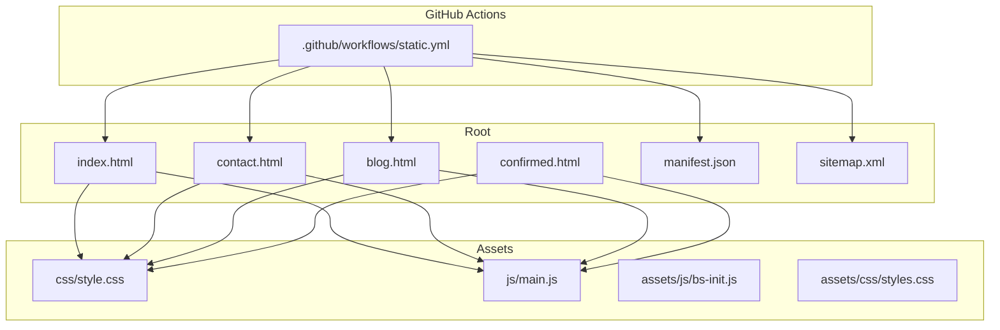
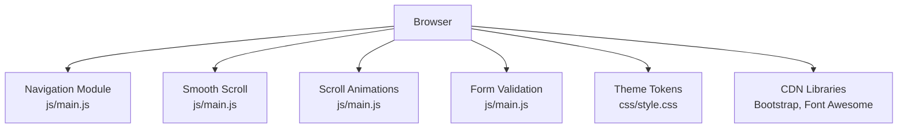
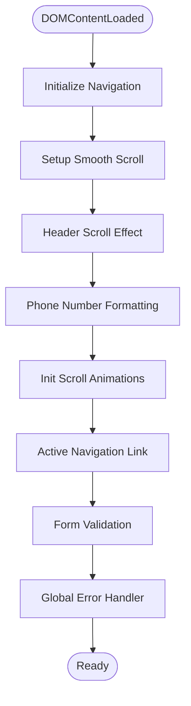
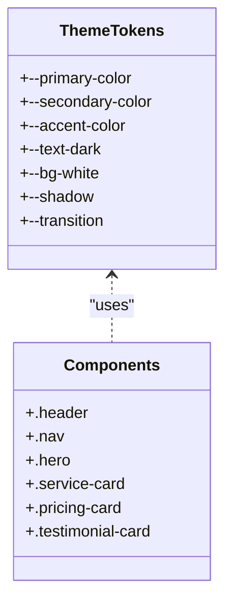
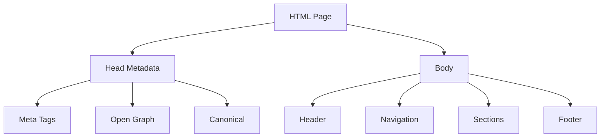
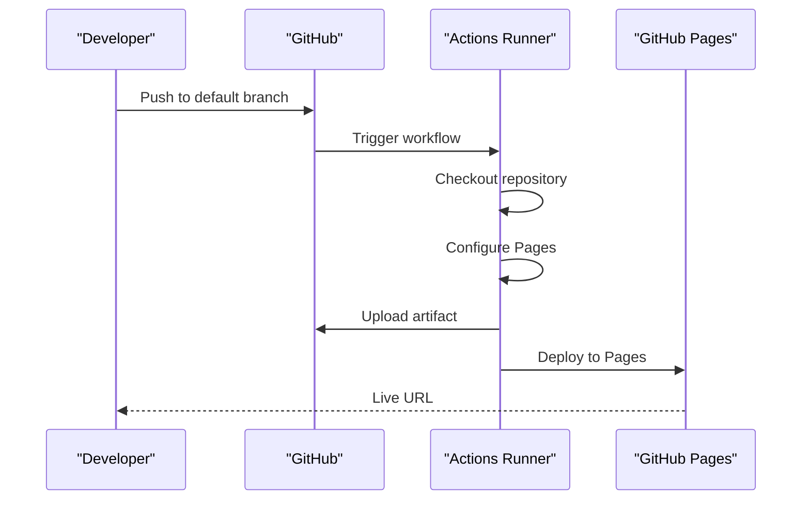
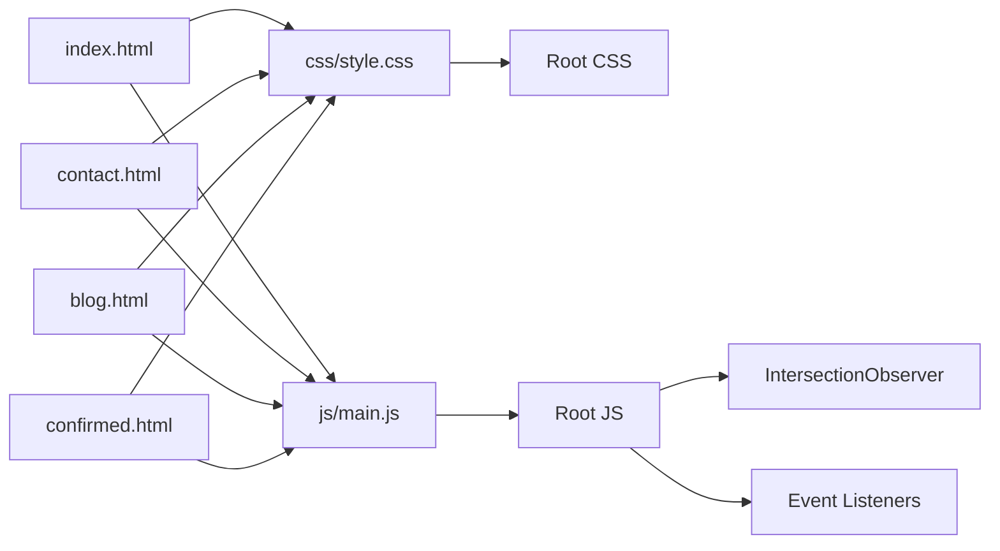

# Development Guidelines

<cite>
**Referenced Files in This Document**
- [README.md](file://README.md)
- [index.html](file://index.html)
- [contact.html](file://contact.html)
- [blog.html](file://blog.html)
- [confirmed.html](file://confirmed.html)
- [js/main.js](file://js/main.js)
- [css/style.css](file://css/style.css)
- [assets/js/bs-init.js](file://assets/js/bs-init.js)
- [assets/css/styles.css](file://assets/css/styles.css)
- [.github/workflows/static.yml](file://.github/workflows/static.yml)
- [manifest.json](file://manifest.json)
- [sitemap.xml](file://sitemap.xml)
</cite>

## Table of Contents
1. [Introduction](#introduction)
2. [Project Structure](#project-structure)
3. [Core Components](#core-components)
4. [Architecture Overview](#architecture-overview)
5. [Detailed Component Analysis](#detailed-component-analysis)
6. [Dependency Analysis](#dependency-analysis)
7. [Performance Considerations](#performance-considerations)
8. [Troubleshooting Guide](#troubleshooting-guide)
9. [Conclusion](#conclusion)
10. [Appendices](#appendices)

## Introduction
This document defines the development guidelines for the graduates website, focusing on coding standards, best practices, and maintenance procedures. It explains the modular JavaScript structure, CSS architecture using custom properties, and semantic HTML practices. It also documents naming conventions, commenting standards, documentation practices, version control workflows, testing strategies, maintenance procedures, and extension guidelines while preserving backward compatibility.

## Project Structure
The website is a static, bilingual (Portuguese/English) marketing site for an English teacher. It follows a flat, file-per-page structure with shared assets and a central stylesheet and script.

**Diagram sources**
- [index.html](file://index.html)
- [contact.html](file://contact.html)
- [blog.html](file://blog.html)
- [confirmed.html](file://confirmed.html)
- [css/style.css](file://css/style.css)
- [js/main.js](file://js/main.js)
- [assets/js/bs-init.js](file://assets/js/bs-init.js)
- [assets/css/styles.css](file://assets/css/styles.css)
- [.github/workflows/static.yml](file://.github/workflows/static.yml)
- [manifest.json](file://manifest.json)
- [sitemap.xml](file://sitemap.xml)

**Section sources**
- [README.md](file://README.md)
- [index.html](file://index.html)
- [contact.html](file://contact.html)
- [blog.html](file://blog.html)
- [confirmed.html](file://confirmed.html)
- [css/style.css](file://css/style.css)
- [js/main.js](file://js/main.js)
- [assets/js/bs-init.js](file://assets/js/bs-init.js)
- [assets/css/styles.css](file://assets/css/styles.css)
- [.github/workflows/static.yml](file://.github/workflows/static.yml)
- [manifest.json](file://manifest.json)
- [sitemap.xml](file://sitemap.xml)

## Core Components
- Modular JavaScript: The main script initializes navigation, smooth scrolling, scroll effects, phone formatting, scroll animations, active navigation highlighting, form validation, and error handling. It is designed as a single module with clearly separated functional blocks.
- CSS Architecture: Uses CSS custom properties for theme tokens and a consistent naming convention for layout, components, and states. Shared styles are centralized in a single stylesheet with minimal overrides.
- Semantic HTML: Pages use semantic sections, landmarks, and accessible attributes (e.g., aria-label, role). Navigation and form elements are structured for usability and SEO.
- Assets: Bootstrap and Font Awesome are included via CDN; local scripts handle animations and interactions.

**Section sources**
- [js/main.js](file://js/main.js)
- [css/style.css](file://css/style.css)
- [index.html](file://index.html)
- [contact.html](file://contact.html)
- [blog.html](file://blog.html)

## Architecture Overview
The site is a static SPA-like experience with client-side interactions and serverless form handling. Navigation and interactions are handled by vanilla JavaScript; animations rely on IntersectionObserver and CSS transitions. The build/deployment pipeline is automated via GitHub Actions.

**Diagram sources**
- [js/main.js](file://js/main.js)
- [css/style.css](file://css/style.css)

**Section sources**
- [js/main.js](file://js/main.js)
- [css/style.css](file://css/style.css)

## Detailed Component Analysis

### JavaScript Module Organization
- Structure: The script is organized into labeled blocks for navigation, smooth scrolling, header effects, phone formatting, form handling, scroll animations, active navigation, WhatsApp tracking, form validation, loading states, service worker registration, global error handling, and anti-resubmission. Each block is self-contained and documented with comments.
- Event Handling: Uses modern DOM APIs (addEventListener, querySelectorAll) and IntersectionObserver for animations. Avoids jQuery and external dependencies.
- Backward Compatibility: Uses replaceState to prevent resubmission and gracefully disables advanced features on older browsers.

**Diagram sources**
- [js/main.js](file://js/main.js)

**Section sources**
- [js/main.js](file://js/main.js)

### CSS Architecture with Custom Properties
- Theme Tokens: Centralized in :root with variables for colors, typography, shadows, and transitions. This enables consistent theming and easy updates.
- Naming Convention: Uses BEM-like class names (e.g., .header, .nav, .hero, .service-card) with modifiers (e.g., .featured) and states (e.g., .active).
- Layout Patterns: Grid and Flexbox are used for responsive layouts. Media queries adapt to breakpoints.
- Overrides: Local overrides exist in assets/css/styles.css for third-party components; keep overrides minimal and scoped.

**Diagram sources**
- [css/style.css](file://css/style.css)
- [assets/css/styles.css](file://assets/css/styles.css)

**Section sources**
- [css/style.css](file://css/style.css)
- [assets/css/styles.css](file://assets/css/styles.css)

### Semantic HTML Practices
- Landmarks: Uses header, nav, section, footer with meaningful IDs and classes.
- Accessibility: Includes aria-labels, roles, and ARIA attributes where applicable.
- SEO: Provides meta descriptions, Open Graph tags, canonical links, and structured metadata.

**Diagram sources**
- [index.html](file://index.html)
- [contact.html](file://contact.html)
- [blog.html](file://blog.html)

**Section sources**
- [index.html](file://index.html)
- [contact.html](file://contact.html)
- [blog.html](file://blog.html)

### Naming Conventions
- Classes: Use kebab-case for component names (e.g., .hero-card, .service-features). Use .is-active or .has-state for dynamic states.
- IDs: Use kebab-case for anchors and IDs (e.g., #home, #about).
- Variables: Use camelCase in JavaScript (e.g., headerEffect, phoneInputs).
- Files: Use kebab-case for HTML/CSS/JS files (e.g., main.js, style.css).

**Section sources**
- [js/main.js](file://js/main.js)
- [css/style.css](file://css/style.css)
- [index.html](file://index.html)

### Commenting Standards and Documentation Practices
- Block Comments: Group related functionality with descriptive headers (e.g., "Navigation Menu Toggle").
- Inline Comments: Explain complex logic or browser-specific behavior.
- Documentation: Keep README.md up to date with project goals, structure, and maintenance notes.

**Section sources**
- [js/main.js](file://js/main.js)
- [README.md](file://README.md)

### Version Control Workflows
- Branching: Deployments occur from the default branch via GitHub Actions.
- Automation: The workflow checks out the repository, sets up GitHub Pages, uploads artifacts, and deploys to Pages.
- Permissions: Controlled permissions for Pages deployment and identity tokens.

**Diagram sources**
- [.github/workflows/static.yml](file://.github/workflows/static.yml)

**Section sources**
- [.github/workflows/static.yml](file://.github/workflows/static.yml)

### Testing Strategies
- Manual Testing: Verify navigation, smooth scrolling, mobile menu, phone formatting, form validation, and floating WhatsApp button across devices.
- Cross-browser Compatibility: Test on latest Chrome, Firefox, Safari, Edge, and mobile browsers.
- Mobile Responsiveness: Validate breakpoints, touch targets, and navigation on small screens.
- SEO and Accessibility: Confirm meta tags, Open Graph, alt-ready images, and ARIA attributes.
- Performance: Measure load times, reduce render-blocking resources, and minimize repaints.

**Section sources**
- [README.md](file://README.md)
- [index.html](file://index.html)
- [contact.html](file://contact.html)
- [blog.html](file://blog.html)

### Maintenance Procedures
- Content Updates: Replace placeholder testimonials and update copy in HTML pages. Keep meta tags and OG tags synchronized with content.
- Asset Management: Keep CDN libraries updated; maintain local scripts and styles carefully.
- Monitoring: Track deployment status via GitHub Pages and monitor errors via console logs.
- Backward Compatibility: Preserve existing selectors and IDs; avoid breaking changes to public APIs.

**Section sources**
- [README.md](file://README.md)
- [index.html](file://index.html)
- [contact.html](file://contact.html)
- [blog.html](file://blog.html)

### Extending Functionality and Backward Compatibility
- New Pages: Follow the established HTML structure, include shared styles and scripts, and add meta tags.
- JavaScript: Add new modules under the existing structure; avoid global pollution; keep event delegation consistent.
- CSS: Use custom properties; scope overrides; avoid ID-based selectors for components.
- Form Handling: Maintain the current form flow; integrate with backend via hidden fields or external services as needed.

**Section sources**
- [js/main.js](file://js/main.js)
- [css/style.css](file://css/style.css)
- [contact.html](file://contact.html)

## Dependency Analysis
- Internal Dependencies: index.html, contact.html, blog.html depend on css/style.css and js/main.js. Local overrides exist in assets/css/styles.css for third-party components.
- External Dependencies: Bootstrap and Font Awesome via CDN; optional service worker registration is present but disabled by default.
- Build Pipeline: GitHub Actions automates deployment to GitHub Pages.

**Diagram sources**
- [index.html](file://index.html)
- [contact.html](file://contact.html)
- [blog.html](file://blog.html)
- [confirmed.html](file://confirmed.html)
- [css/style.css](file://css/style.css)
- [js/main.js](file://js/main.js)

**Section sources**
- [index.html](file://index.html)
- [contact.html](file://contact.html)
- [blog.html](file://blog.html)
- [confirmed.html](file://confirmed.html)
- [css/style.css](file://css/style.css)
- [js/main.js](file://js/main.js)
- [assets/css/styles.css](file://assets/css/styles.css)

## Performance Considerations
- Minimize External Dependencies: Keep CDN usage to essential libraries.
- Optimize CSS: Consolidate and minimize unused rules; leverage custom properties.
- Optimize JavaScript: Avoid heavy synchronous operations; defer non-critical scripts.
- Reduce Render-Blocking: Inline critical CSS; defer non-critical CSS.
- Image Optimization: Ensure alt-ready images and appropriate sizes.
- Lighthouse Metrics: Monitor Core Web Vitals and optimize accordingly.

[No sources needed since this section provides general guidance]

## Troubleshooting Guide
- Navigation Issues: Verify nav-toggle and nav-menu classes; ensure event listeners are attached after DOMContentLoaded.
- Smooth Scroll: Confirm anchor links and target IDs exist; adjust headerOffset if needed.
- Phone Formatting: Ensure input[type="tel"] exists and event listeners are attached.
- Form Validation: Check email regex and custom validity messages.
- Scroll Animations: Confirm IntersectionObserver support and thresholds.
- Deployment Failures: Review GitHub Actions logs and permissions.

**Section sources**
- [js/main.js](file://js/main.js)
- [index.html](file://index.html)
- [contact.html](file://contact.html)
- [.github/workflows/static.yml](file://.github/workflows/static.yml)

## Conclusion
These guidelines establish a consistent, maintainable, and scalable approach to developing and maintaining the graduates website. By adhering to modular JavaScript, CSS custom properties, semantic HTML, and disciplined version control practices, contributors can extend functionality safely while preserving backward compatibility and performance.

[No sources needed since this section summarizes without analyzing specific files]

## Appendices

### A. Practical Examples

- JavaScript Event Handling
  - Navigation toggle and mobile menu: [js/main.js](file://js/main.js)
  - Smooth scroll to anchors: [js/main.js](file://js/main.js)
  - Form validation: [js/main.js](file://js/main.js)

- CSS Selector Organization
  - Component classes and modifiers: [css/style.css](file://css/style.css)
  - Override patterns: [assets/css/styles.css](file://assets/css/styles.css)

- HTML Structure Validation
  - Semantic sections and landmarks: [index.html](file://index.html), [contact.html](file://contact.html), [blog.html](file://blog.html)

**Section sources**
- [js/main.js](file://js/main.js)
- [css/style.css](file://css/style.css)
- [assets/css/styles.css](file://assets/css/styles.css)
- [index.html](file://index.html)
- [contact.html](file://contact.html)
- [blog.html](file://blog.html)

### B. Version Control and Deployment
- Workflow: Automated deployment via GitHub Actions: [.github/workflows/static.yml](file://.github/workflows/static.yml)
- Manifest and Sitemap: Progressive Web App metadata and SEO: [manifest.json](file://manifest.json), [sitemap.xml](file://sitemap.xml)

**Section sources**
- [.github/workflows/static.yml](file://.github/workflows/static.yml)
- [manifest.json](file://manifest.json)
- [sitemap.xml](file://sitemap.xml)