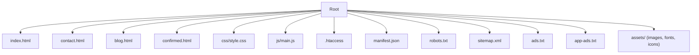
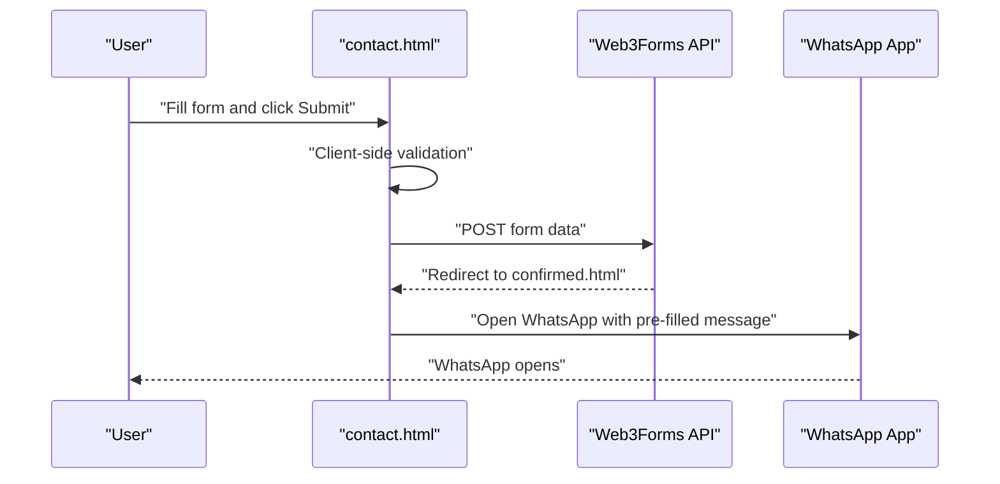

# Getting Started

<cite>
**Referenced Files in This Document**
- [README.md](file://README.md)
- [index.html](file://index.html)
- [contact.html](file://contact.html)
- [blog.html](file://blog.html)
- [css/style.css](file://css/style.css)
- [js/main.js](file://js/main.js)
- [.htaccess](file://.htaccess)
- [manifest.json](file://manifest.json)
- [robots.txt](file://robots.txt)
- [sitemap.xml](file://sitemap.xml)
- [confirmed.html](file://confirmed.html)
- [ads.txt](file://ads.txt)
- [app-ads.txt](file://app-ads.txt)
</cite>

## Table of Contents
1. [Introduction](#introduction)
2. [Prerequisites](#prerequisites)
3. [Local Development Environment Setup](#local-development-environment-setup)
4. [File Structure Overview](#file-structure-overview)
5. [Installation and Local Server Configuration](#installation-and-local-server-configuration)
6. [Testing Locally](#testing-locally)
7. [Initial Customization Guide](#initial-customization-guide)
8. [Browser Compatibility and Mobile Testing](#browser-compatibility-and-mobile-testing)
9. [Deployment Preparation Checklist](#deployment-preparation-checklist)
10. [Troubleshooting Common Issues](#troubleshooting-common-issues)
11. [Conclusion](#conclusion)

## Introduction
This guide helps you set up the graduates website locally, verify functionality, and make initial customizations. The site is a bilingual (Portuguese/English) marketing website for a professional English teacher, built with vanilla HTML, CSS, and JavaScript. It includes a main landing page, a dedicated contact page with a form, a blog hub, and supporting assets.

## Prerequisites
- Basic web development knowledge:
  - Understanding of HTML, CSS, and JavaScript
  - Familiarity with editing text files and managing static assets
- Local development environment:
  - A modern web browser (Chrome, Firefox, Safari, Edge)
  - A simple local server or a static file server (e.g., Python’s http.server, Live Server extension, or any static server)
- Optional:
  - Text editor or IDE with syntax highlighting
  - Git for version control (optional)

## Local Development Environment Setup
- Recommended local server options:
  - Python: python -m http.server 8000
  - Node.js: serve or http-server
  - VS Code Live Server extension
  - Any static file server that serves files from the project root
- Start the server from the repository root so all paths resolve correctly (CSS, JS, images, fonts).

## File Structure Overview
The project follows a flat, feature-based structure with minimal dependencies:
- Root pages: index.html, contact.html, blog.html, confirmed.html
- Assets: css/, js/, assets/ (images, fonts, icons)
- Configuration: .htaccess, manifest.json, robots.txt, sitemap.xml, ads.txt, app-ads.txt
- README.md provides a complete project overview and launch checklist

**Diagram sources**
- [index.html](file://index.html)
- [contact.html](file://contact.html)
- [blog.html](file://blog.html)
- [confirmed.html](file://confirmed.html)
- [css/style.css](file://css/style.css)
- [js/main.js](file://js/main.js)
- [.htaccess](file://.htaccess)
- [manifest.json](file://manifest.json)
- [robots.txt](file://robots.txt)
- [sitemap.xml](file://sitemap.xml)
- [ads.txt](file://ads.txt)
- [app-ads.txt](file://app-ads.txt)

**Section sources**
- [README.md](file://README.md)
- [index.html](file://index.html)
- [contact.html](file://contact.html)
- [blog.html](file://blog.html)

## Installation and Local Server Configuration
- Clone or download the repository to your machine.
- Open a terminal in the project root.
- Start a local static server:
  - Example: python -m http.server 8000
- Open your browser and navigate to http://localhost:8000 (or your configured port).
- Verify that:
  - index.html loads with navigation, hero, services, testimonials, pricing, and footer
  - contact.html loads with contact info, form, and FAQ
  - blog.html lists articles
  - CSS and JavaScript are applied and interactive elements work

**Section sources**
- [README.md](file://README.md)
- [.htaccess](file://.htaccess)

## Testing Locally
- Navigation:
  - Click the hamburger menu on mobile and desktop to toggle the navigation drawer.
  - Use smooth scrolling to jump between sections on index.html.
- Forms:
  - On contact.html, fill in required fields and submit. The form integrates with a third-party service and redirects to a success page.
  - The floating WhatsApp button opens the native app with a pre-filled message.
- Interactions:
  - Phone number inputs auto-format to a Brazilian format.
  - Email validation highlights invalid entries.
  - Scroll animations reveal content as you move down the page.
- Accessibility:
  - Ensure screen reader-friendly labels and ARIA attributes are present (as implemented in the code).

**Diagram sources**
- [contact.html](file://contact.html)
- [confirmed.html](file://confirmed.html)

**Section sources**
- [js/main.js](file://js/main.js)
- [contact.html](file://contact.html)
- [confirmed.html](file://confirmed.html)

## Initial Customization Guide
- Replace placeholder testimonials:
  - Edit index.html and update the testimonials grid with real student feedback and author details.
  - Keep star ratings and structure consistent.
- Update contact information:
  - Modify phone numbers, locations, and hours in contact.html and the footer of index.html.
  - Update the WhatsApp number used in floating buttons and form redirection.
- Customize design and branding:
  - Adjust colors and typography in css/style.css (variables defined in :root).
  - Replace favicon and Apple touch icons in assets/img/ and update references in HTML head.
- Content updates:
  - Update meta titles, descriptions, and Open Graph tags in index.html, contact.html, blog.html, and blog article pages.
  - Add or modify blog content in blog.html and individual article pages under blog/.
- Form configuration:
  - Confirm the third-party form provider keys and redirect URL in contact.html.
  - Ensure the “redirect” field points to confirmed.html.

Practical examples:
- Replace testimonials:
  - Find the testimonials section in index.html and edit the testimonial cards to reflect real names, roles, and quotes.
- Update contact info:
  - Change phone numbers and locations in contact.html contact methods and index.html footer.
- Customize design:
  - Modify primary, secondary, and accent colors in css/style.css variables to match your brand.

**Section sources**
- [index.html](file://index.html)
- [contact.html](file://contact.html)
- [blog.html](file://blog.html)
- [css/style.css](file://css/style.css)

## Browser Compatibility and Mobile Testing
- Supported browsers:
  - Chrome, Firefox, Safari, Edge (all latest versions)
  - Mobile browsers (iOS Safari, Chrome Mobile)
- Mobile optimization:
  - Hamburger menu appears on small screens.
  - Touch-friendly buttons and readable text sizes.
  - Floating WhatsApp button remains accessible.
- Testing steps:
  - Resize browser windows to emulate mobile/tablet/desktop.
  - Test navigation, form inputs, and WhatsApp integration on multiple devices.
  - Verify smooth scrolling and scroll-triggered animations.

**Section sources**
- [README.md](file://README.md)
- [js/main.js](file://js/main.js)
- [css/style.css](file://css/style.css)

## Deployment Preparation Checklist
- Final checks before publishing:
  - Replace all placeholder content (testimonials, images, descriptions).
  - Verify all links and navigation.
  - Test forms and confirm successful redirects.
  - Validate meta tags and Open Graph properties.
  - Confirm HTTPS enforcement and caching headers (.htaccess).
  - Ensure robots.txt and sitemap.xml are deployed.
  - Confirm PWA manifest (manifest.json) is reachable.
- Deployment:
  - Use your hosting provider’s publish/deploy feature or upload all files to the public directory.
  - Share the live URL on professional networks and marketing channels.

**Section sources**
- [README.md](file://README.md)
- [.htaccess](file://.htaccess)
- [robots.txt](file://robots.txt)
- [sitemap.xml](file://sitemap.xml)
- [manifest.json](file://manifest.json)

## Troubleshooting Common Issues
- Styles not loading:
  - Ensure the server serves files from the project root and paths in HTML match the actual folder structure.
- JavaScript not working:
  - Confirm js/main.js is included and loaded after DOM elements.
  - Check browser console for errors.
- Form not submitting:
  - Verify the third-party form provider configuration in contact.html (access key, subject, redirect).
  - Ensure the redirect path matches confirmed.html.
- WhatsApp button not opening:
  - Confirm the number format and protocol in the href attribute.
  - Test on a device with the native WhatsApp app installed.
- Phone number formatting:
  - The formatting script expects tel inputs; ensure the input type is correct and the event listeners are attached.
- Caching and redirects:
  - If pages appear stale, clear browser cache or disable cache during development.
  - Confirm .htaccess is enabled on your server (GZIP compression, expires, security headers, HTTPS redirect).

**Section sources**
- [js/main.js](file://js/main.js)
- [contact.html](file://contact.html)
- [.htaccess](file://.htaccess)

## Conclusion
You now have the essentials to run the site locally, verify functionality, and customize it for your needs. Focus on replacing placeholders, validating forms, and ensuring cross-browser and mobile readiness before deploying live.