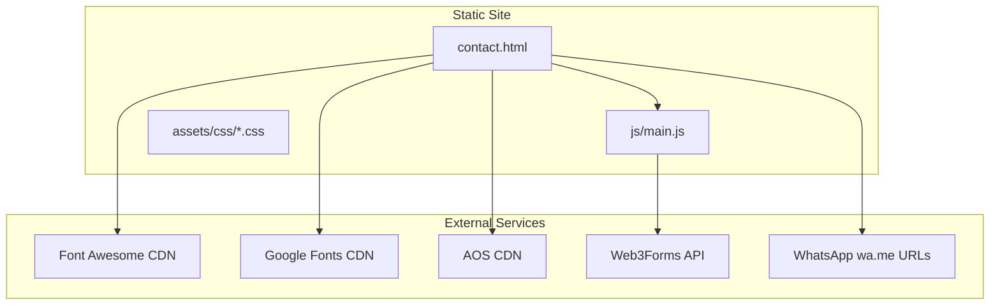
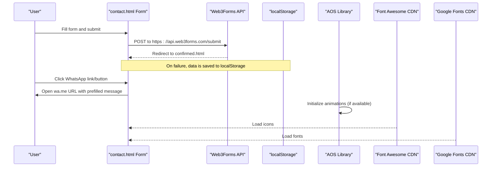
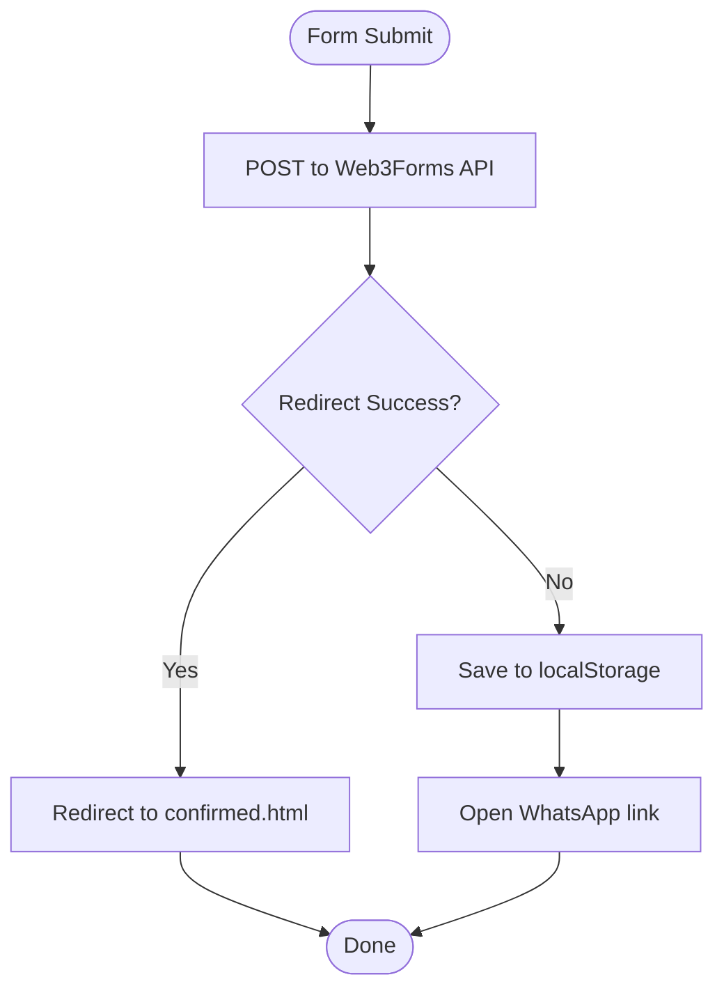
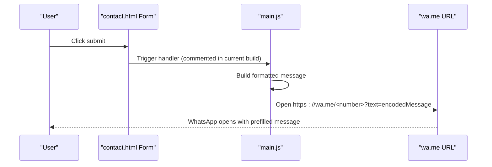
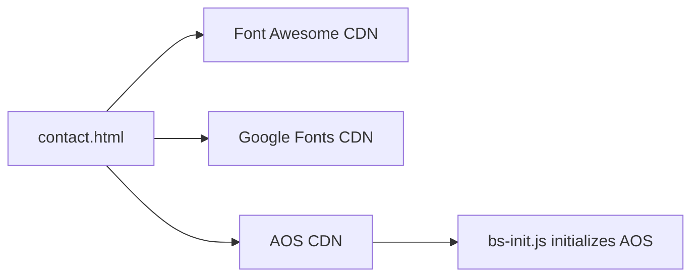
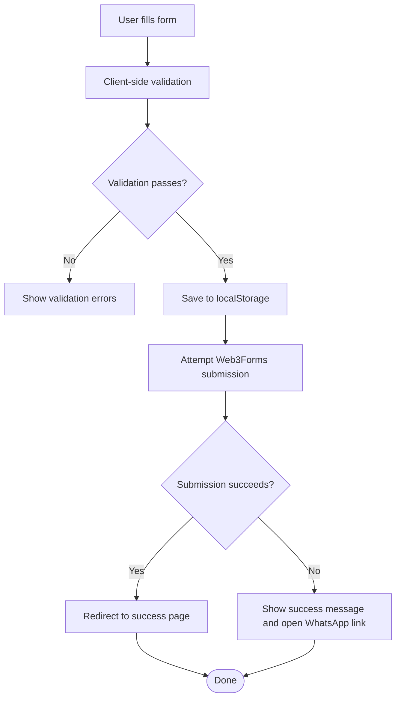
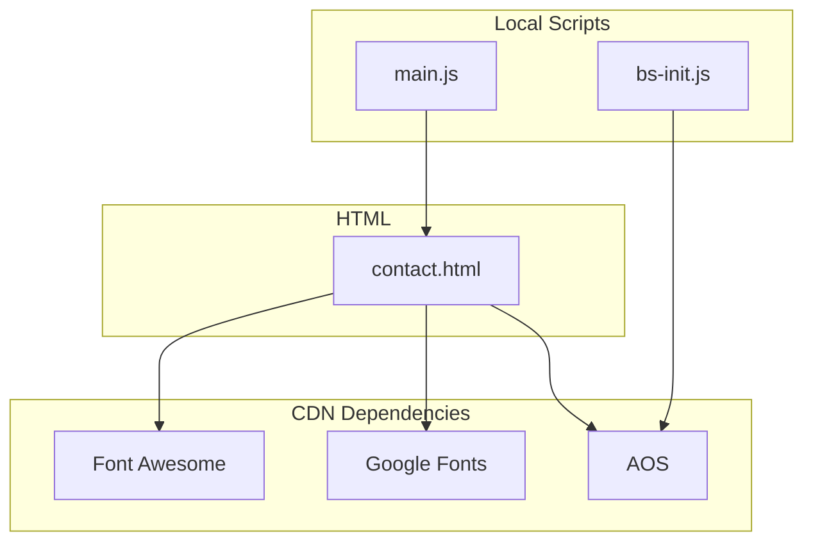

# Integration Guide

<cite>
**Referenced Files in This Document**
- [contact.html](file://contact.html)
- [main.js](file://js/main.js)
- [bs-init.js](file://assets/js/bs-init.js)
- [aos.min.css](file://assets/css/aos.min.css)
- [form.css](file://assets/css/form.css)
- [styles.css](file://assets/css/styles.css)
- [README.md](file://README.md)
</cite>

## Table of Contents
1. [Introduction](#introduction)
2. [Project Structure](#project-structure)
3. [Core Components](#core-components)
4. [Architecture Overview](#architecture-overview)
5. [Detailed Component Analysis](#detailed-component-analysis)
6. [Dependency Analysis](#dependency-analysis)
7. [Performance Considerations](#performance-considerations)
8. [Troubleshooting Guide](#troubleshooting-guide)
9. [Conclusion](#conclusion)
10. [Appendices](#appendices)

## Introduction
This integration guide documents third-party service integrations and API connections for the graduates website, focusing on:
- Web3Forms API integration for contact form processing
- WhatsApp API implementation via wa.me URLs
- External library integration with CDN-hosted resources (Font Awesome, Google Fonts, AOS)
- Practical examples of form data flow, localStorage backup, and integration testing
- Troubleshooting, rate limiting considerations, fallback strategies, and security/data privacy compliance

## Project Structure
The website is a static site with minimal client-side logic. Third-party integrations are primarily embedded via CDN links and handled client-side.

**Diagram sources**
- [contact.html:141-148](file://contact.html#L141-L148)
- [contact.html:16-17](file://contact.html#L16-L17)
- [main.js:112-172](file://js/main.js#L112-L172)

**Section sources**
- [contact.html:141-148](file://contact.html#L141-L148)
- [contact.html:16-17](file://contact.html#L16-L17)
- [main.js:112-172](file://js/main.js#L112-L172)

## Core Components
- Web3Forms API integration: The contact form posts directly to the Web3Forms API endpoint with hidden configuration fields and redirects to a success page.
- WhatsApp integration: The site uses wa.me URLs for multiple contact touchpoints, including a floating button and form submission flow.
- External libraries: Font Awesome icons, Google Fonts, and AOS animations are loaded via CDN.
- Client-side storage: Form submissions are backed up to localStorage for resilience against service unavailability.

**Section sources**
- [contact.html:141-148](file://contact.html#L141-L148)
- [contact.html:283-286](file://contact.html#L283-L286)
- [main.js:112-172](file://js/main.js#L112-L172)
- [main.js:140-146](file://js/main.js#L140-L146)

## Architecture Overview
The contact form flow integrates with Web3Forms and optionally falls back to WhatsApp when needed. External libraries are loaded via CDNs.

**Diagram sources**
- [contact.html:141-148](file://contact.html#L141-L148)
- [contact.html:283-286](file://contact.html#L283-L286)
- [main.js:140-146](file://js/main.js#L140-L146)
- [bs-init.js:12-16](file://assets/js/bs-init.js#L12-L16)

## Detailed Component Analysis

### Web3Forms API Integration
- Endpoint configuration: The form action targets the Web3Forms API endpoint with hidden fields for access key, subject, sender name, redirect URL, and bot protection.
- Form field mapping: The form includes required fields (name, phone) and optional fields (email, interest, message). Hidden fields configure the API behavior.
- Error handling strategies: The current implementation relies on redirect behavior. A fallback mechanism saves form data to localStorage for later retrieval.

**Diagram sources**
- [contact.html:141-148](file://contact.html#L141-L148)
- [main.js:140-146](file://js/main.js#L140-L146)

**Section sources**
- [contact.html:141-148](file://contact.html#L141-L148)
- [main.js:140-146](file://js/main.js#L140-L146)

### WhatsApp API Implementation via wa.me URLs
- Message formatting: The site constructs a structured message with bold and italic formatting suitable for WhatsApp.
- URL parameter encoding: The constructed message is encoded for safe inclusion in the URL query string.
- Integration testing: The floating button and contact links use wa.me URLs for immediate user engagement.

**Diagram sources**
- [contact.html:283-286](file://contact.html#L283-L286)
- [main.js:177-197](file://js/main.js#L177-L197)

**Section sources**
- [contact.html:283-286](file://contact.html#L283-L286)
- [main.js:177-197](file://js/main.js#L177-L197)

### External Library Integration (CDN-hosted Resources)
- Font Awesome icons: Loaded via CDN for consistent iconography across the site.
- Google Fonts: Inter font family is included via CDN for typography.
- AOS animation library: Initialized via a script that checks for AOS availability and applies animations.

**Diagram sources**
- [contact.html:16-17](file://contact.html#L16-L17)
- [bs-init.js:12-16](file://assets/js/bs-init.js#L12-L16)

**Section sources**
- [contact.html:16-17](file://contact.html#L16-L17)
- [bs-init.js:12-16](file://assets/js/bs-init.js#L12-L16)

### Practical Example: Form Data Flow and localStorage Backup
- User input: The form collects name, phone, email, interest, and message.
- Validation: Client-side validation ensures required fields are present and email format is valid.
- Backup: On submission, form data is saved to localStorage for reliability.
- Success message: A success message is shown while the system attempts to process the submission.
- WhatsApp fallback: If processing fails, the user can still initiate a WhatsApp conversation via a link.

**Diagram sources**
- [main.js:276-288](file://js/main.js#L276-L288)
- [main.js:140-146](file://js/main.js#L140-L146)
- [contact.html:141-148](file://contact.html#L141-L148)

**Section sources**
- [main.js:276-288](file://js/main.js#L276-L288)
- [main.js:140-146](file://js/main.js#L140-L146)
- [contact.html:141-148](file://contact.html#L141-L148)

## Dependency Analysis
- External dependencies are loaded via CDN and initialized in the browser.
- The contact form’s primary integration is Web3Forms, with wa.me URLs as a fallback.
- AOS initialization depends on the presence of the AOS library.

**Diagram sources**
- [contact.html:16-17](file://contact.html#L16-L17)
- [bs-init.js:12-16](file://assets/js/bs-init.js#L12-L16)
- [main.js:112-172](file://js/main.js#L112-L172)

**Section sources**
- [contact.html:16-17](file://contact.html#L16-L17)
- [bs-init.js:12-16](file://assets/js/bs-init.js#L12-L16)
- [main.js:112-172](file://js/main.js#L112-L172)

## Performance Considerations
- CDN-hosted libraries reduce server load and improve caching.
- Minimizing JavaScript logic keeps the site fast; the current implementation avoids heavy frameworks.
- AOS animations are conditionally initialized to prevent unnecessary overhead on mobile devices.

[No sources needed since this section provides general guidance]

## Troubleshooting Guide
- Web3Forms submission failures:
  - Verify the access key and hidden fields are correctly configured.
  - Confirm the redirect URL is valid and accessible.
  - Check network connectivity and CORS policies if applicable.
- WhatsApp integration issues:
  - Ensure the wa.me URL is correctly formed with proper encoding.
  - Test opening the URL directly in the browser to confirm formatting.
- External library loading:
  - Confirm CDN URLs are reachable and not blocked by ad blockers.
  - Verify AOS initialization occurs only when the library is present.
- localStorage backup:
  - Confirm localStorage is enabled and not blocked by browser settings.
  - Monitor for quota exceeded errors and implement cleanup strategies if needed.

**Section sources**
- [contact.html:141-148](file://contact.html#L141-L148)
- [contact.html:283-286](file://contact.html#L283-L286)
- [main.js:140-146](file://js/main.js#L140-L146)
- [bs-init.js:12-16](file://assets/js/bs-init.js#L12-L16)

## Conclusion
The graduates website integrates third-party services through straightforward CDN-based libraries and a direct Web3Forms API submission. The wa.me URL strategy provides a reliable fallback for user engagement. Client-side localStorage backup enhances resilience during service unavailability. Security and privacy are addressed by keeping data local and using user-owned apps for communication.

[No sources needed since this section summarizes without analyzing specific files]

## Appendices

### API Endpoint Configuration Reference
- Endpoint: https://api.web3forms.com/submit
- Hidden fields:
  - access_key: Provided by Web3Forms
  - subject: Email subject line
  - from_name: Sender name
  - redirect: Success page URL
  - botcheck: Hidden spam protection field

**Section sources**
- [contact.html:141-148](file://contact.html#L141-L148)

### External Library References
- Font Awesome: Loaded via CDN for icons
- Google Fonts: Inter font family loaded via CDN
- AOS: Animation library initialized conditionally

**Section sources**
- [contact.html:16-17](file://contact.html#L16-L17)
- [bs-init.js:12-16](file://assets/js/bs-init.js#L12-L16)

### Security and Privacy Considerations
- Data remains local until submitted to Web3Forms.
- WhatsApp integration uses the user’s own app, minimizing data exposure.
- No cookies or tracking are used unless additional analytics are added.

**Section sources**
- [README.md:297-303](file://README.md#L297-L303)