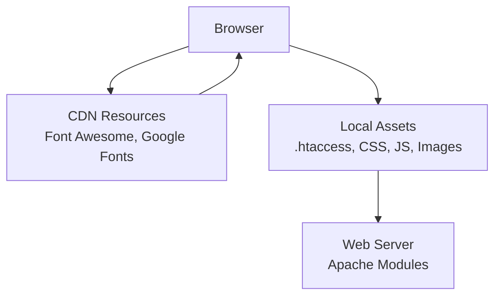
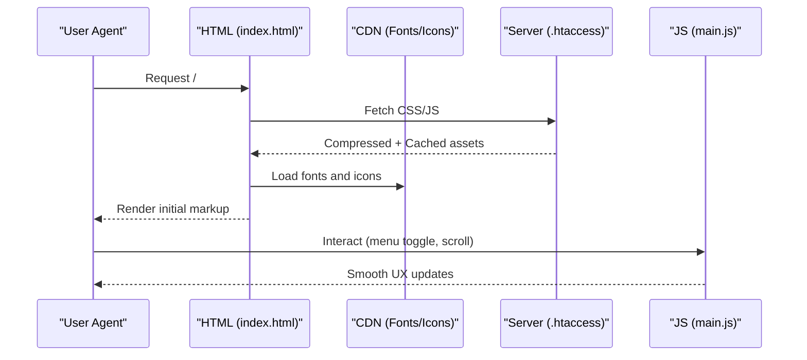
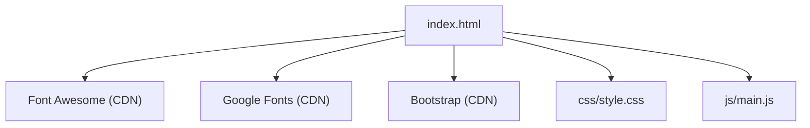

# Performance and Optimization

<cite>
**Referenced Files in This Document**
- [.htaccess](file://.htaccess)
- [index.html](file://index.html)
- [manifest.json](file://manifest.json)
- [robots.txt](file://robots.txt)
- [sitemap.xml](file://sitemap.xml)
- [css/style.css](file://css/style.css)
- [js/main.js](file://js/main.js)
- [assets/js/bs-init.js](file://assets/js/bs-init.js)
- [assets/bootstrap/css/bootstrap.min.css](file://assets/bootstrap/css/bootstrap.min.css)
- [assets/bootstrap/js/bootstrap.min.js](file://assets/bootstrap/js/bootstrap.min.js)
</cite>

## Table of Contents
1. [Introduction](#introduction)
2. [Project Structure](#project-structure)
3. [Core Components](#core-components)
4. [Architecture Overview](#architecture-overview)
5. [Detailed Component Analysis](#detailed-component-analysis)
6. [Dependency Analysis](#dependency-analysis)
7. [Performance Considerations](#performance-considerations)
8. [Troubleshooting Guide](#troubleshooting-guide)
9. [Conclusion](#conclusion)

## Introduction
This document presents a comprehensive performance and optimization strategy for the graduates website. It focuses on loading performance, mobile responsiveness, browser caching and compression, asset delivery, JavaScript efficiency, image optimization, monitoring, and accessibility considerations. The guidance is grounded in the actual implementation present in the repository and provides practical, actionable recommendations aligned with modern web performance best practices.

## Project Structure
The site is a single-page application built with HTML, CSS, and JavaScript. Static assets are served from local paths, while third-party resources are loaded via CDNs. The server configuration enables GZIP compression, browser caching, security headers, and HTTPS enforcement. Progressive Web App metadata is included to support installability and baseline caching behavior.

**Diagram sources**
- [index.html:20-21](file://index.html#L20-L21)
- [.htaccess:1-33](file://.htaccess#L1-L33)

**Section sources**
- [index.html:1-522](file://index.html#L1-L522)
- [.htaccess:1-33](file://.htaccess#L1-L33)

## Core Components
- HTML entry point defines viewport, meta tags, canonical links, and external CDN dependencies for fonts and icons.
- CSS leverages CSS Grid and Flexbox for layout, with responsive breakpoints and utility classes.
- JavaScript handles navigation toggling, smooth scrolling, scroll effects, intersection-based animations, and form interactions.
- Server configuration enables GZIP compression, cache headers, security headers, and HTTPS redirection.

Practical implications:
- The page loads quickly due to minimal local scripts and efficient CSS.
- Third-party resources are cached globally via CDNs, reducing origin bandwidth.
- Server-side compression reduces payload sizes for HTML, CSS, and JS.

**Section sources**
- [index.html:4-22](file://index.html#L4-L22)
- [css/style.css:149-157](file://css/style.css#L149-L157)
- [js/main.js:4-42](file://js/main.js#L4-L42)
- [.htaccess:1-33](file://.htaccess#L1-L33)

## Architecture Overview
The runtime architecture centers on client-side rendering with minimal DOM manipulation and efficient event handling. Third-party libraries are loaded asynchronously from CDNs. Server-side optimizations reduce round-trips and improve perceived performance.

**Diagram sources**
- [index.html:19-21](file://index.html#L19-L21)
- [.htaccess:1-33](file://.htaccess#L1-L33)
- [js/main.js:47-62](file://js/main.js#L47-L62)

## Detailed Component Analysis

### Loading Performance Optimization
- Resource optimization strategies:
  - External CDN for fonts and icons reduces origin load and leverages global caching.
  - Minimal local JavaScript reduces blocking and parse time.
- Bundle size considerations:
  - Single-page design avoids multi-page navigation overhead.
  - Local CSS and JS are concatenated and served statically; consider bundling/minification for production builds.
- Lazy loading implementation:
  - No explicit lazy-loading attributes are used; defer non-critical images and videos to improve Largest Contentful Paint.
- Asset delivery:
  - GZIP compression enabled server-side for HTML/CSS/JS.
  - Long-term caching configured for static assets.

Practical examples:
- Replace placeholder images with responsive, appropriately sized assets and add loading="lazy".
- Defer non-critical third-party widgets until after initial render.

**Section sources**
- [index.html:20-21](file://index.html#L20-L21)
- [.htaccess:1-16](file://.htaccess#L1-L16)

### Mobile Optimization Techniques
- Responsive design principles:
  - CSS Grid and Flexbox layouts adapt to screen widths.
  - Media queries adjust hero heights and card layouts for larger screens.
- Touch interaction handling:
  - Navigation toggle uses CSS transforms and JavaScript for smooth animations.
  - Scroll spy and smooth scrolling enhance navigation on small screens.
- Device category considerations:
  - Prefer aspect-ratio-friendly hero layouts and avoid fixed-height images.
  - Ensure tap targets meet minimum size guidelines for mobile usability.

Practical examples:
- Use CSS container queries for component-level responsiveness.
- Optimize font sizes and line heights for mobile reading comfort.

**Section sources**
- [css/style.css:149-157](file://css/style.css#L149-L157)
- [css/style.css:56-77](file://css/style.css#L56-L77)
- [js/main.js:4-42](file://js/main.js#L4-L42)

### Browser Caching Strategies
- Cache headers:
  - Images cached for one year; CSS and JS cached for one month; HTML cached for one week.
- Security headers:
  - X-Content-Type-Options, X-Frame-Options, X-XSS-Protection, Referrer-Policy, Permissions-Policy.
- HTTPS enforcement:
  - Automatic redirect to HTTPS for secure transport.

Practical examples:
- Use cache-busting for critical assets during updates.
- Monitor cache hit ratios and adjust TTLs based on analytics.

**Section sources**
- [.htaccess:6-16](file://.htaccess#L6-L16)
- [.htaccess:18-25](file://.htaccess#L18-L25)
- [.htaccess:27-32](file://.htaccess#L27-L32)

### GZIP Compression Implementation
- Compression enabled for HTML, plain text, XML, CSS, JavaScript, and JSON.
- Reduces payload sizes and improves transfer speeds.

Practical examples:
- Ensure server sends correct Content-Encoding headers.
- Validate compression effectiveness with browser devtools Network panel.

**Section sources**
- [.htaccess:1-4](file://.htaccess#L1-L4)

### Asset Minification Processes
- Current state:
  - Local CSS and JS appear minified; Bootstrap and Font Awesome are served from CDN.
- Recommendations:
  - Use build tools to minify and concatenate CSS/JS for production.
  - Inline critical CSS for above-the-fold content and defer non-critical CSS.

**Section sources**
- [assets/bootstrap/css/bootstrap.min.css:1-5](file://assets/bootstrap/css/bootstrap.min.css#L1-L5)
- [assets/bootstrap/js/bootstrap.min.js:1-7](file://assets/bootstrap/js/bootstrap.min.js#L1-L7)

### CSS Grid and Flexbox Optimization
- Layout patterns:
  - Hero section uses CSS Grid for two-column layout.
  - Navigation uses Flexbox for alignment and spacing.
- Performance tips:
  - Prefer logical properties for internationalization.
  - Avoid expensive layout triggers (e.g., frequent reflows) in scroll handlers.

Practical examples:
- Use CSS custom properties for theme colors to reduce repaint costs.
- Simplify complex grids for low-end devices.

**Section sources**
- [css/style.css:149-157](file://css/style.css#L149-L157)
- [css/style.css:54-61](file://css/style.css#L54-L61)

### JavaScript Efficiency Techniques
- Event delegation and selective DOM updates:
  - Navigation toggle animates hamburger icon without heavy DOM queries.
  - Smooth scrolling uses native window APIs.
- Intersection Observer for animations:
  - Uses thresholds and margins to trigger fade-in effects efficiently.
- Error handling and prevention:
  - Global error handler logs uncaught exceptions.
  - Prevents form resubmission on refresh.

Practical examples:
- Debounce or throttle scroll handlers to limit reflows.
- Split large functions into smaller units for better testability and caching.

**Section sources**
- [js/main.js:4-42](file://js/main.js#L4-L42)
- [js/main.js:202-231](file://js/main.js#L202-L231)
- [js/main.js:328-331](file://js/main.js#L328-L331)
- [js/main.js:336-338](file://js/main.js#L336-L338)

### Image Optimization Strategies
- Current state:
  - Images referenced via local paths; no explicit lazy-loading attributes.
- Recommendations:
  - Serve responsive images using srcset and sizes.
  - Prefer modern formats (AVIF/WebP) with fallbacks.
  - Compress images losslessly or with perceptual quality settings.

Practical examples:
- Add loading="lazy" and decoding="async" to non-critical images.
- Use picture element for format switching.

**Section sources**
- [index.html:15-18](file://index.html#L15-L18)

### Performance Monitoring and Validation
- Measurement approaches:
  - Use browser devtools Performance and Lighthouse panels.
  - Track Core Web Vitals (LCP, FID, CLS) in production.
- Validation methods:
  - Validate cache headers with curl or browser Network panel.
  - Confirm HTTPS enforcement and HSTS headers if applicable.

Practical examples:
- Set up automated Lighthouse checks in CI.
- Monitor Time to First Byte (TTFB) and server response times.

**Section sources**
- [.htaccess:18-25](file://.htaccess#L18-L25)
- [.htaccess:27-32](file://.htaccess#L27-L32)

### Accessibility Performance Considerations
- Inclusive design optimization:
  - Ensure sufficient color contrast for text and interactive elements.
  - Provide skip links and keyboard navigation support.
  - Use semantic HTML and ARIA roles where dynamic content is added.
- Performance-aligned accessibility:
  - Defer non-essential animations for motion sensitivity.
  - Keep focus management predictable to avoid layout thrashing.

Practical examples:
- Audit color contrast using axe or Lighthouse.
- Test reduced-motion preferences and adjust animations accordingly.

**Section sources**
- [css/style.css:10-24](file://css/style.css#L10-L24)
- [js/main.js:202-231](file://js/main.js#L202-L231)

## Dependency Analysis
External dependencies are loaded from CDNs, reducing origin bandwidth and leveraging global caching. Internal dependencies include local CSS and JS, with optional Bootstrap utilities.

**Diagram sources**
- [index.html:20-21](file://index.html#L20-L21)
- [assets/bootstrap/css/bootstrap.min.css:1-5](file://assets/bootstrap/css/bootstrap.min.css#L1-L5)
- [assets/bootstrap/js/bootstrap.min.js:1-7](file://assets/bootstrap/js/bootstrap.min.js#L1-L7)

**Section sources**
- [index.html:19-21](file://index.html#L19-L21)
- [assets/bootstrap/css/bootstrap.min.css:1-5](file://assets/bootstrap/css/bootstrap.min.css#L1-L5)
- [assets/bootstrap/js/bootstrap.min.js:1-7](file://assets/bootstrap/js/bootstrap.min.js#L1-L7)

## Performance Considerations
- Prioritize above-the-fold content with critical CSS inlining.
- Reduce JavaScript execution time by deferring non-critical scripts.
- Optimize third-party embeds and widgets for performance.
- Monitor and iterate on Core Web Vitals metrics.
- Plan for progressive enhancement to ensure reliable performance across devices.

[No sources needed since this section provides general guidance]

## Troubleshooting Guide
- Verify compression:
  - Confirm Content-Encoding headers for CSS/JS.
- Check cache headers:
  - Validate Expires/Cache-Control for static assets.
- Inspect redirects:
  - Ensure HTTPS redirect works without loops.
- Debug JavaScript:
  - Use browser console for errors and performance traces.
- Validate PWA metadata:
  - Confirm manifest fields and icons for installability.

**Section sources**
- [.htaccess:1-16](file://.htaccess#L1-L16)
- [.htaccess:27-32](file://.htaccess#L27-L32)
- [js/main.js:328-331](file://js/main.js#L328-L331)
- [manifest.json:1](file://manifest.json#L1)

## Conclusion
The graduates website employs effective performance strategies: CDN-delivered assets, server-side compression and caching, and efficient client-side JavaScript. To further optimize, consider bundling/minification, image optimization, lazy loading, and continuous monitoring of Core Web Vitals. These steps will improve loading performance, mobile experience, and accessibility across diverse devices and connection conditions.