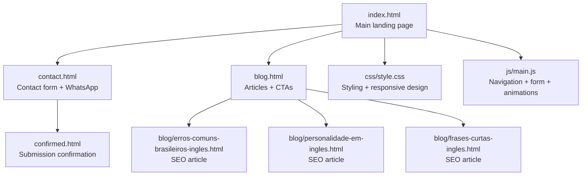
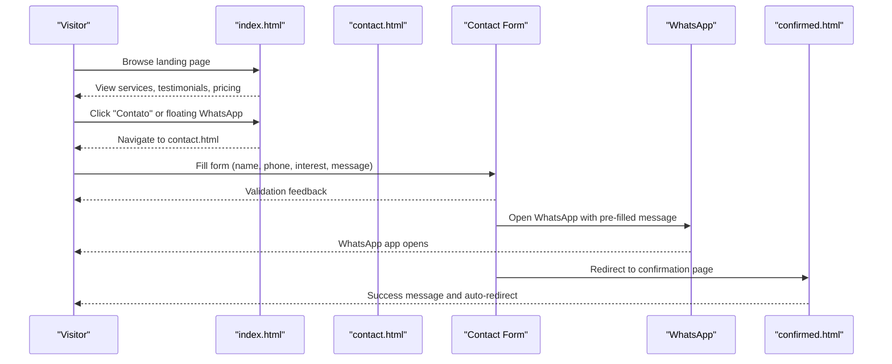
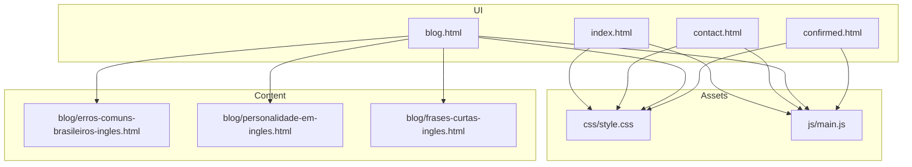

# Business Objectives & Target Audience

<cite>
**Referenced Files in This Document**
- [README.md](file://README.md)
- [index.html](file://index.html)
- [contact.html](file://contact.html)
- [blog.html](file://blog.html)
- [blog/erros-comuns-brasileiros-ingles.html](file://blog/erros-comuns-brasileiros-ingles.html)
- [blog/personalidade-em-ingles.html](file://blog/personalidade-em-ingles.html)
- [blog/frases-curtas-ingles.html](file://blog/frases-curtas-ingles.html)
- [css/style.css](file://css/style.css)
- [js/main.js](file://js/main.js)
- [confirmed.html](file://confirmed.html)
</cite>

## Table of Contents
1. [Introduction](#introduction)
2. [Project Structure](#project-structure)
3. [Core Components](#core-components)
4. [Architecture Overview](#architecture-overview)
5. [Detailed Component Analysis](#detailed-component-analysis)
6. [Dependency Analysis](#dependency-analysis)
7. [Performance Considerations](#performance-considerations)
8. [Troubleshooting Guide](#troubleshooting-guide)
9. [Conclusion](#conclusion)
10. [Appendices](#appendices)

## Introduction
This document defines the business objectives and target audience for Michael | Inglês Executivo’s marketing strategy. It synthesizes the project’s positioning, service offerings, and conversion pathways into actionable insights for stakeholders and developers. The strategy centers on attracting Brazilian professionals who seek practical, career-focused English instruction grounded in deep understanding of Brazilian business culture and international teaching experience.

## Project Structure
The website is a bilingual (Portuguese/English) marketing site built with static HTML, CSS, and JavaScript. It is designed to convert visitors into leads through clear messaging, social proof, and frictionless contact channels. The structure supports:
- A main landing page with hero, about, services, testimonials, pricing, and contact sections
- A dedicated contact page with a form and WhatsApp integration
- A blog section with SEO-optimized articles targeting common communication challenges
- A success page for form submissions

**Diagram sources**
- [index.html:1-522](file://index.html#L1-L522)
- [contact.html:1-291](file://contact.html#L1-L291)
- [blog.html:1-247](file://blog.html#L1-L247)
- [blog/erros-comuns-brasileiros-ingles.html:1-407](file://blog/erros-comuns-brasileiros-ingles.html#L1-L407)
- [blog/personalidade-em-ingles.html:1-519](file://blog/personalidade-em-ingles.html#L1-L519)
- [blog/frases-curtas-ingles.html:1-563](file://blog/frases-curtas-ingles.html#L1-L563)
- [confirmed.html:1-120](file://confirmed.html#L1-L120)
- [css/style.css:1-800](file://css/style.css#L1-L800)
- [js/main.js:1-338](file://js/main.js#L1-L338)

**Section sources**
- [README.md:118-159](file://README.md#L118-L159)
- [index.html:1-522](file://index.html#L1-L522)
- [contact.html:1-291](file://contact.html#L1-L291)
- [blog.html:1-247](file://blog.html#L1-L247)

## Core Components
- Business positioning: 26 years in Brazil plus international teaching experience, combined with deep understanding of Brazilian business culture
- Target audience: corporate executives, IT/tech professionals, and general professionals seeking career advancement
- Service offerings: one-on-one online classes, flexible scheduling, and specialized methodologies (corporate, tech, advanced conversation, exam preparation)
- Pricing: R$65/class with a free consultation and transparent payment options
- Conversion strategy: social proof, authority, reciprocity, transparency, and low-friction contact channels

**Section sources**
- [README.md:118-159](file://README.md#L118-L159)
- [index.html:160-254](file://index.html#L160-L254)
- [index.html:383-479](file://index.html#L383-L479)
- [contact.html:141-204](file://contact.html#L141-L204)

## Architecture Overview
The marketing architecture is a static, mobile-first website with integrated contact flows and content-driven conversion. The system emphasizes:
- Clear navigation and smooth scrolling to key sections
- Persistent floating WhatsApp button for instant contact
- Form-driven lead capture with pre-filled WhatsApp messages
- Blog content to establish authority and drive organic traffic
- Local storage-backed form backup and submission confirmation

**Diagram sources**
- [index.html:50-89](file://index.html#L50-L89)
- [contact.html:141-204](file://contact.html#L141-L204)
- [js/main.js:112-171](file://js/main.js#L112-L171)
- [confirmed.html:105-117](file://confirmed.html#L105-L117)

**Section sources**
- [README.md:251-276](file://README.md#L251-L276)
- [js/main.js:112-197](file://js/main.js#L112-L197)
- [contact.html:141-204](file://contact.html#L141-L204)

## Detailed Component Analysis

### Business Objectives
- Primary goal: attract Brazilian professionals to invest in high-impact English instruction tailored to their career needs
- Positioning differentiator: unique combination of 26 years in Brazil and international teaching experience, plus business/tech background
- Market focus: professionals who need practical English for meetings, presentations, emails, interviews, and daily work interactions
- Competitive advantage: one-on-one classes, flexible scheduling, and affordable pricing (R$65/class)

**Section sources**
- [README.md:118-133](file://README.md#L118-L133)
- [index.html:110-158](file://index.html#L110-L158)

### Target Audience Segmentation
- Corporate executives and managers: need presentation, negotiation, and email skills
- IT/tech professionals: require technical vocabulary, interview readiness, and agile/Scrum communication
- General professionals: aim for career advancement and confidence in international contexts
- Minimum proficiency: intermediate level preferred

Practical examples:
- A project manager needs to present to international stakeholders and requires “Corporate English” training
- A software developer preparing for a technical interview wants “English for IT & Tech”
- A marketing specialist seeks “Advanced Conversation” to improve fluency and pronunciation

**Section sources**
- [README.md:120-124](file://README.md#L120-L124)
- [index.html:190-217](file://index.html#L190-L217)

### Key Selling Points
- 26 years in Brazil with deep understanding of local business culture
- International teaching experience across multiple countries
- Business and IT background to contextualize lessons
- One-on-one classes with flexible scheduling
- Transparent, affordable pricing (R$65/class) with free consultation

**Section sources**
- [README.md:126-132](file://README.md#L126-L132)
- [index.html:110-158](file://index.html#L110-L158)
- [index.html:383-479](file://index.html#L383-L479)

### Service Offerings
- Corporate English: presentations, meetings, negotiations, professional emails
- English for IT & Tech: technical vocabulary, code reviews, agile/Scrum, interviews
- Advanced Conversation: fluency, pronunciation, idiomatic expressions, cultural nuances
- Exam Preparation: TOEFL, IELTS, Cambridge exams
- Pricing tiers: single class (R$65), monthly package (R$240 for 4 classes), intensive package (R$440 for 8 classes)

**Section sources**
- [index.html:160-254](file://index.html#L160-L254)
- [index.html:383-479](file://index.html#L383-L479)

### Conversion Strategy and Lead Generation
- Social proof: testimonials from real professionals
- Authority: teacher credentials, international experience, and Brazilian context
- Reciprocity: free consultation to lower risk
- Transparency: clear pricing and payment options
- Low-friction contact: floating WhatsApp button, simplified contact form, and pre-filled messages

Practical examples:
- Visitors land on the homepage, see testimonials, and click “Agendar Consulta Gratuita”
- On the contact page, the form captures essential information and opens WhatsApp with a structured message
- After submission, visitors see a success page with an auto-redirect to the homepage

**Section sources**
- [README.md:251-257](file://README.md#L251-L257)
- [index.html:292-381](file://index.html#L292-L381)
- [contact.html:141-204](file://contact.html#L141-L204)
- [js/main.js:177-197](file://js/main.js#L177-L197)
- [confirmed.html:105-117](file://confirmed.html#L105-L117)

### Content Marketing and SEO
- Blog articles address common communication challenges for Brazilian professionals
- Articles include structured data (JSON-LD) and Open Graph metadata for SEO
- Soft CTAs within posts guide readers to contact or WhatsApp

Examples:
- “5 Erros Comuns que Brasileiros Cometem em Inglês” targets grammar pitfalls
- “Como Soar Como Você Mesmo em Inglês” focuses on personality and tone
- “A Armadilha das Frases Longas” teaches concise, powerful communication

**Section sources**
- [blog.html:68-204](file://blog.html#L68-L204)
- [blog/erros-comuns-brasileiros-ingles.html:25-46](file://blog/erros-comuns-brasileiros-ingles.html#L25-L46)
- [blog/personalidade-em-ingles.html:100-121](file://blog/personalidade-em-ingles.html#L100-L121)
- [blog/frases-curtas-ingles.html:165-186](file://blog/frases-curtas-ingles.html#L165-L186)

### Technical Implementation Notes
- Navigation: smooth scroll anchors, active section highlighting, and mobile hamburger menu
- Form handling: client-side validation, pre-filled WhatsApp messages, and success/confirmation flow
- Accessibility: ARIA labels, semantic HTML, and responsive design
- Performance: minimal dependencies, optimized CSS, and efficient JavaScript

**Section sources**
- [js/main.js:4-42](file://js/main.js#L4-L42)
- [js/main.js:112-197](file://js/main.js#L112-L197)
- [css/style.css:1-800](file://css/style.css#L1-L800)

## Dependency Analysis
The website’s conversion pipeline depends on cohesive interactions across pages and scripts. The following diagram maps dependencies between components:

**Diagram sources**
- [index.html:19-22](file://index.html#L19-L22)
- [contact.html:15-17](file://contact.html#L15-L17)
- [blog.html:22-24](file://blog.html#L22-L24)
- [css/style.css:1-24](file://css/style.css#L1-L24)
- [js/main.js:1-338](file://js/main.js#L1-L338)
- [blog/erros-comuns-brasileiros-ingles.html:22-24](file://blog/erros-comuns-brasileiros-ingles.html#L22-L24)

**Section sources**
- [index.html:1-522](file://index.html#L1-L522)
- [contact.html:1-291](file://contact.html#L1-L291)
- [blog.html:1-247](file://blog.html#L1-L247)

## Performance Considerations
- Static site architecture ensures fast load times and low maintenance
- CSS Grid and Flexbox layouts optimize responsiveness across devices
- Minimal JavaScript reduces overhead while maintaining interactive features
- Image placeholders and CDN-hosted libraries minimize bandwidth usage

[No sources needed since this section provides general guidance]

## Troubleshooting Guide
Common issues and resolutions:
- Form validation errors: ensure required fields are filled and email format is valid
- WhatsApp integration: verify pre-filled message formatting and phone number format
- Navigation: confirm smooth scroll anchors and active section highlighting
- Mobile responsiveness: test navigation toggle and layout stacking on small screens

**Section sources**
- [js/main.js:276-288](file://js/main.js#L276-L288)
- [js/main.js:47-62](file://js/main.js#L47-L62)
- [js/main.js:102-107](file://js/main.js#L102-L107)

## Conclusion
Michael | Inglês Executivo’s marketing strategy leverages a strong positioning rooted in Brazilian business culture and international teaching experience. The website’s architecture and content are aligned to convert visitors into leads through clear messaging, social proof, and frictionless contact channels. By focusing on practical English outcomes for corporate and tech professionals, the strategy drives both awareness and conversions while maintaining a professional, trustworthy brand presence.

[No sources needed since this section summarizes without analyzing specific files]

## Appendices
- Business model: one-on-one online instruction with flexible scheduling and transparent pricing
- Competitive advantages: localized expertise, personalized methodology, and low-risk free consultation
- Marketing channels: website, blog, WhatsApp, and social proof through testimonials

**Section sources**
- [README.md:136-159](file://README.md#L136-L159)
- [index.html:292-381](file://index.html#L292-L381)
- [contact.html:222-248](file://contact.html#L222-L248)