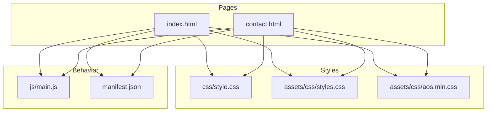
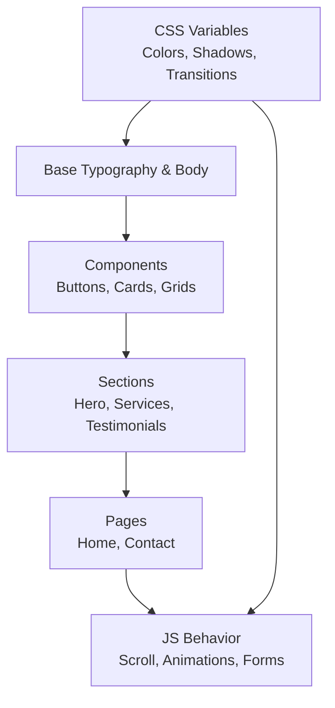
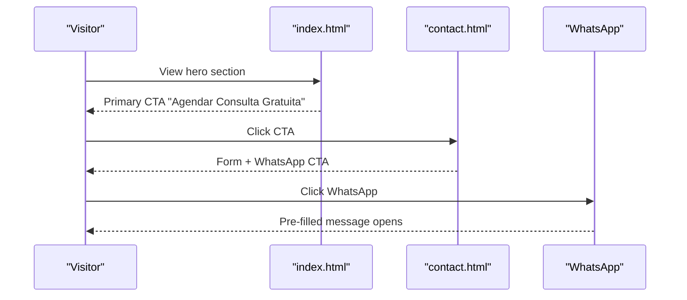
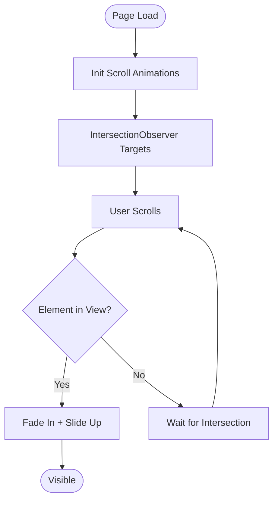
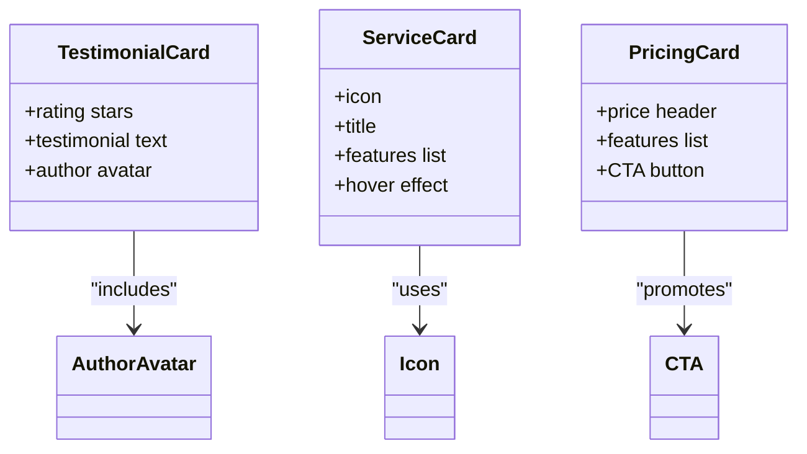
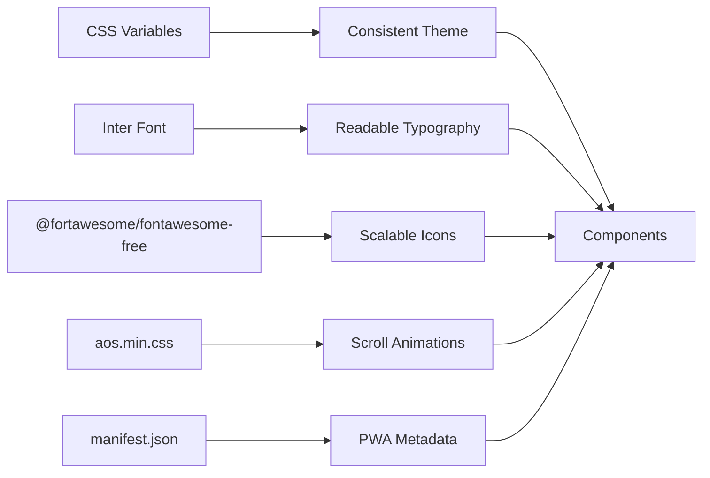

# Design Philosophy & Visual Identity

<cite>
**Referenced Files in This Document**
- [README.md](file://README.md)
- [index.html](file://index.html)
- [contact.html](file://contact.html)
- [css/style.css](file://css/style.css)
- [assets/css/styles.css](file://assets/css/styles.css)
- [js/main.js](file://js/main.js)
- [manifest.json](file://manifest.json)
- [assets/css/aos.min.css](file://assets/css/aos.min.css)
</cite>

## Table of Contents
1. [Introduction](#introduction)
2. [Project Structure](#project-structure)
3. [Core Components](#core-components)
4. [Architecture Overview](#architecture-overview)
5. [Detailed Component Analysis](#detailed-component-analysis)
6. [Dependency Analysis](#dependency-analysis)
7. [Performance Considerations](#performance-considerations)
8. [Troubleshooting Guide](#troubleshooting-guide)
9. [Conclusion](#conclusion)

## Introduction
This document presents the design philosophy and visual identity of Michael | Inglês Executivo, grounded in the codebase. It synthesizes the deliberate color palette, typography, conversion-focused UX, and accessibility features into a cohesive guide for stakeholders and developers. The site’s professional aesthetic emphasizes trust, growth, and energy while maintaining a mobile-first, responsive approach and clear pathways to consultation.

## Project Structure
The site is a bilingual (Portuguese/English) static website with two primary pages:
- Home page (index.html): hero, about, services, methodology, reasons, testimonials, pricing, and simplified contact
- Contact page (contact.html): dedicated form, contact info, and FAQ

Key design assets:
- Global CSS (css/style.css) defines the theme, components, and responsive behavior
- Additional asset CSS (assets/css/styles.css) enhances hero and card visuals
- JavaScript (js/main.js) powers navigation, scroll effects, animations, and form interactions
- Manifest (manifest.json) configures PWA metadata and theme color
- Animation library (assets/css/aos.min.css) enables scroll-triggered animations

**Diagram sources**
- [index.html:1-522](file://index.html#L1-L522)
- [contact.html:1-291](file://contact.html#L1-L291)
- [css/style.css:1-800](file://css/style.css#L1-L800)
- [assets/css/styles.css:1-339](file://assets/css/styles.css#L1-L339)
- [assets/css/aos.min.css:1-800](file://assets/css/aos.min.css#L1-L800)
- [js/main.js:1-338](file://js/main.js#L1-L338)
- [manifest.json:1-1](file://manifest.json#L1-L1)

**Section sources**
- [README.md:11-23](file://README.md#L11-L23)
- [index.html:1-522](file://index.html#L1-L522)
- [contact.html:1-291](file://contact.html#L1-L291)

## Core Components
- Color system: Blue (#1e56a0) for trust, green (#28a745) for growth, orange (#f39c12) for energy, and WhatsApp green (#25D366) for conversion
- Typography: Inter from Google Fonts for modern professionalism
- Conversion strategy: Clear CTAs, multiple touchpoints, and low-friction lead gen via free consultation
- Accessibility: ARIA labels, semantic markup, focus states, and scroll animations
- Mobile-first: Responsive breakpoints and navigation tailored for phones and tablets

**Section sources**
- [README.md:236-258](file://README.md#L236-L258)
- [css/style.css:10-24](file://css/style.css#L10-L24)
- [assets/css/styles.css:1-339](file://assets/css/styles.css#L1-L339)
- [index.html:32-46](file://index.html#L32-L46)
- [contact.html:28-42](file://contact.html#L28-L42)

## Architecture Overview
The design system is implemented through a layered approach:
- Variables and base styles define the theme and typography
- Component classes encapsulate reusable UI patterns (buttons, cards, grids)
- Page-level sections compose components into coherent experiences
- JavaScript augments UX with smooth scrolling, animations, and form behavior

**Diagram sources**
- [css/style.css:10-35](file://css/style.css#L10-L35)
- [css/style.css:236-284](file://css/style.css#L236-L284)
- [css/style.css:381-464](file://css/style.css#L381-L464)
- [css/style.css:552-615](file://css/style.css#L552-L615)
- [index.html:49-89](file://index.html#L49-L89)
- [contact.html:45-220](file://contact.html#L45-L220)
- [js/main.js:47-62](file://js/main.js#L47-L62)
- [js/main.js:202-231](file://js/main.js#L202-L231)

## Detailed Component Analysis

### Color System and Visual Hierarchy
- Primary: Blue (#1e56a0) anchors trust and professionalism across headers, badges, and accents
- Secondary: Green (#28a745) highlights success and growth, notably in WhatsApp and feature icons
- Accent: Orange (#f39c12) draws attention to CTAs and badges
- Typography: Inter ensures readability and modernity across all breakpoints

Practical examples:
- Hero gradient uses primary blue for strong visual impact
- CTA buttons use accent orange for prominence
- Feature icons use secondary green for positive reinforcement
- Text uses neutral grays for contrast and legibility

**Section sources**
- [README.md:239-242](file://README.md#L239-L242)
- [css/style.css:10-24](file://css/style.css#L10-L24)
- [css/style.css:149-172](file://css/style.css#L149-L172)
- [css/style.css:250-259](file://css/style.css#L250-L259)
- [css/style.css:460-463](file://css/style.css#L460-L463)

### Typography Scaling and Readability
- Headings scale from hero titles down to section subtitles
- Inter font weights and line heights ensure consistent rhythm
- Focus states and hover transitions improve interactive clarity

Examples:
- Hero title uses large, bold sizing with high line height for emphasis
- Section titles and descriptions balance hierarchy and readability
- Form inputs and labels maintain accessible sizing and spacing

**Section sources**
- [css/style.css:163-178](file://css/style.css#L163-L178)
- [css/style.css:311-321](file://css/style.css#L311-L321)
- [assets/css/form.css:34-59](file://assets/css/form.css#L34-L59)

### Conversion-Focused UX
- Multiple CTAs: Primary CTA in hero, secondary CTA, and floating WhatsApp button
- Low-friction lead gen: Free consultation badge and prominent CTA in pricing footer
- Social proof: Testimonials grid with ratings and author avatars
- Trust signals: Certifications, experience badges, and transparent pricing

**Diagram sources**
- [index.html:64-70](file://index.html#L64-L70)
- [index.html:466-477](file://index.html#L466-L477)
- [contact.html:194-203](file://contact.html#L194-L203)
- [contact.html:112-116](file://contact.html#L112-L116)

**Section sources**
- [README.md:244-256](file://README.md#L244-L256)
- [index.html:292-381](file://index.html#L292-L381)
- [index.html:383-479](file://index.html#L383-L479)
- [contact.html:134-248](file://contact.html#L134-L248)

### Mobile-First Approach and Breakpoints
- Navigation transforms to a hamburger menu on smaller screens
- Hero and content adapt to stacked layouts on phones
- Cards and grids reflow to accommodate various viewport widths
- Floating WhatsApp button remains accessible across devices

Responsive enhancements:
- Hero height increases progressively on larger screens
- Grids adjust column counts and spacing for optimal readability
- Navigation toggle animates with visual feedback

**Section sources**
- [README.md:186-200](file://README.md#L186-L200)
- [assets/css/styles.css:56-77](file://assets/css/styles.css#L56-L77)
- [css/style.css:381-385](file://css/style.css#L381-L385)
- [index.html:513-517](file://index.html#L513-L517)
- [contact.html:282-286](file://contact.html#L282-L286)

### Accessibility Features
- ARIA labels on interactive elements (menu toggle, floating WhatsApp)
- Semantic HTML structure with landmarks and headings
- Focus states and keyboard-friendly navigation
- Scroll animations enhance perceived performance without sacrificing accessibility

**Section sources**
- [index.html:32-36](file://index.html#L32-L36)
- [index.html:515](file://index.html#L515)
- [contact.html:28-32](file://contact.html#L28-L32)
- [contact.html:284](file://contact.html#L284)
- [js/main.js:202-231](file://js/main.js#L202-L231)

### Interactive Elements and Animations
- Smooth scroll to sections for seamless navigation
- Fade-in animations triggered on scroll for content sections
- Hover states on buttons and cards reinforce interactivity
- Header shadow effect on scroll improves depth perception

**Diagram sources**
- [js/main.js:202-231](file://js/main.js#L202-L231)
- [assets/css/aos.min.css:1-800](file://assets/css/aos.min.css#L1-L800)

**Section sources**
- [js/main.js:47-62](file://js/main.js#L47-L62)
- [js/main.js:67-74](file://js/main.js#L67-L74)
- [css/style.css:236-284](file://css/style.css#L236-L284)

### Floating WhatsApp Button
- Always visible on all pages to reduce friction
- Uses brand-consistent green (#25D366) and iconography
- Opens pre-filled WhatsApp conversations with structured messages

Placement and behavior:
- Positioned fixed for consistent visibility
- Tracks clicks for potential analytics integration
- Maintains accessibility with ARIA labels

**Section sources**
- [index.html:513-517](file://index.html#L513-L517)
- [contact.html:282-286](file://contact.html#L282-L286)
- [js/main.js:265-271](file://js/main.js#L265-L271)

### Testimonial Placement and Service Showcase
- Testimonials grid highlights social proof with ratings and author details
- Service cards emphasize benefits and features with iconography and hover states
- Pricing section prominently displays “Free Consultation” to lower perceived risk

**Diagram sources**
- [css/style.css:552-615](file://css/style.css#L552-L615)
- [css/style.css:381-464](file://css/style.css#L381-L464)
- [css/style.css:618-707](file://css/style.css#L618-L707)

**Section sources**
- [index.html:292-381](file://index.html#L292-L381)
- [index.html:160-254](file://index.html#L160-L254)
- [index.html:383-479](file://index.html#L383-L479)

## Dependency Analysis
The design system relies on minimal, explicit dependencies:
- CSS variables define the theme consistently across components
- Inter font from Google Fonts ensures cross-browser readability
- Font Awesome icons provide scalable vector graphics
- AOS library enables scroll-triggered animations
- PWA manifest configures standalone presentation and theme color

**Diagram sources**
- [css/style.css:10-24](file://css/style.css#L10-L24)
- [index.html:20](file://index.html#L20)
- [contact.html:16](file://contact.html#L16)
- [assets/css/aos.min.css:1-800](file://assets/css/aos.min.css#L1-L800)
- [manifest.json:1-1](file://manifest.json#L1-L1)

**Section sources**
- [README.md:163-169](file://README.md#L163-L169)
- [index.html:20-22](file://index.html#L20-L22)
- [contact.html:15-17](file://contact.html#L15-L17)

## Performance Considerations
- Minimal external dependencies reduce load times
- CSS Grid and Flexbox layouts optimize rendering
- Scroll animations use IntersectionObserver to avoid heavy computations
- PWA manifest supports offline-ready presentation

[No sources needed since this section provides general guidance]

## Troubleshooting Guide
Common issues and resolutions:
- Navigation not toggling on mobile: Verify hamburger icon event listeners and active class toggling
- Smooth scroll not working: Confirm anchor links and scroll handler logic
- Form validation errors: Check email regex and required field states
- Animations not triggering: Ensure IntersectionObserver targets and thresholds are configured

**Section sources**
- [js/main.js:4-42](file://js/main.js#L4-L42)
- [js/main.js:47-62](file://js/main.js#L47-L62)
- [js/main.js:276-288](file://js/main.js#L276-L288)
- [js/main.js:202-231](file://js/main.js#L202-L231)

## Conclusion
Michael | Inglês Executivo’s design philosophy centers on trust, growth, and energy—communicated through a cohesive color system, modern typography, and conversion-focused UX. The mobile-first approach, accessibility features, and low-friction lead generation align with professional expectations for a bilingual, career-focused English instruction brand. The codebase reflects these principles through consistent theming, responsive components, and thoughtful interactions.