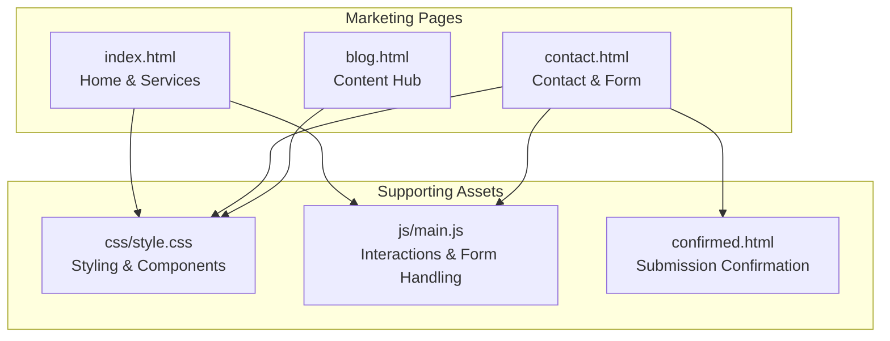
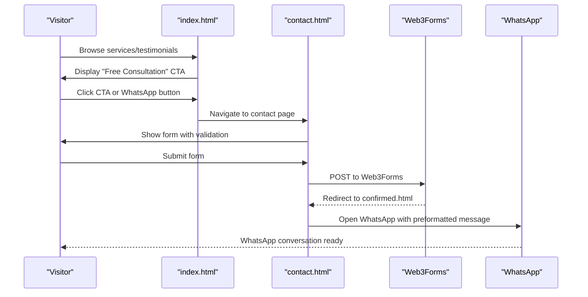
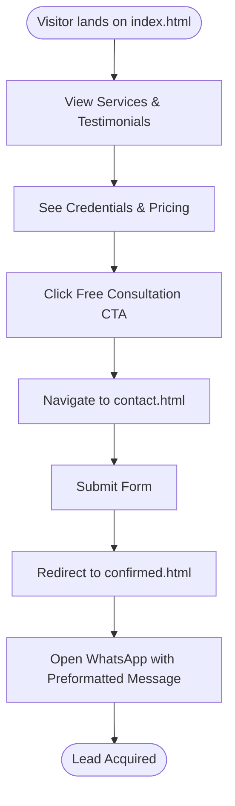
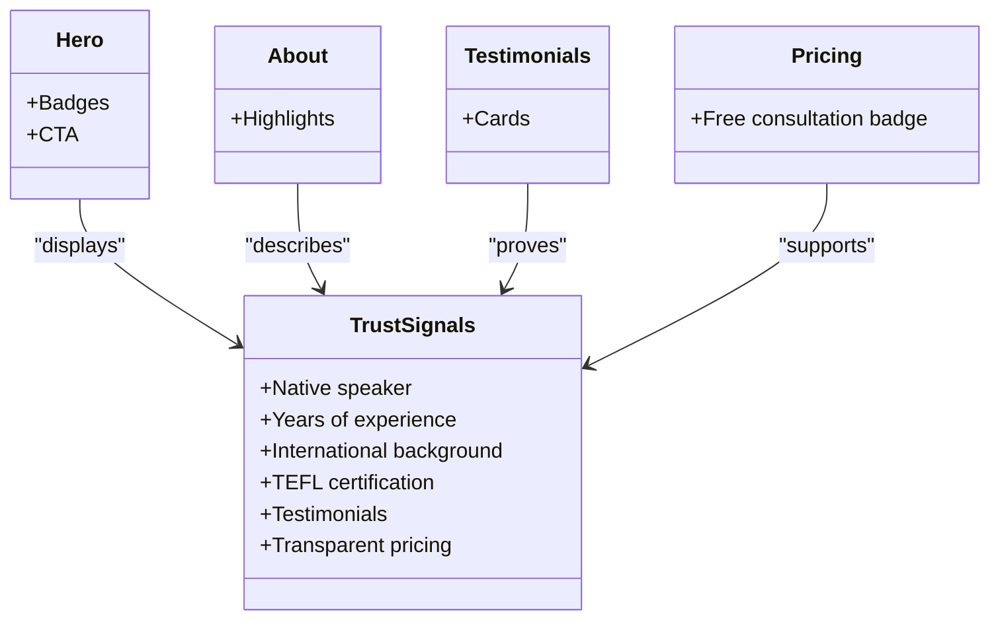
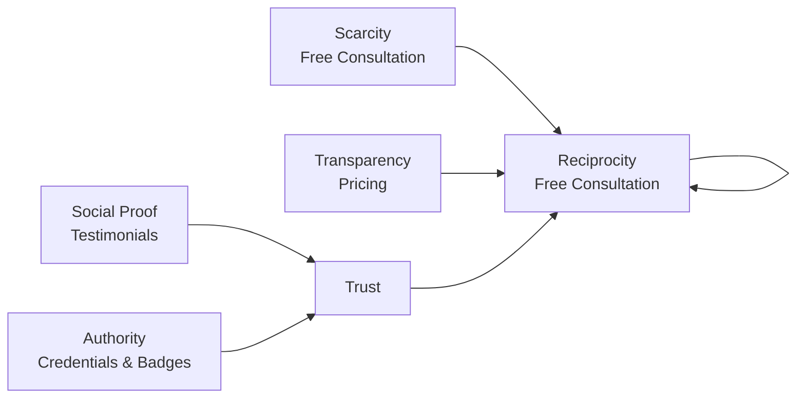
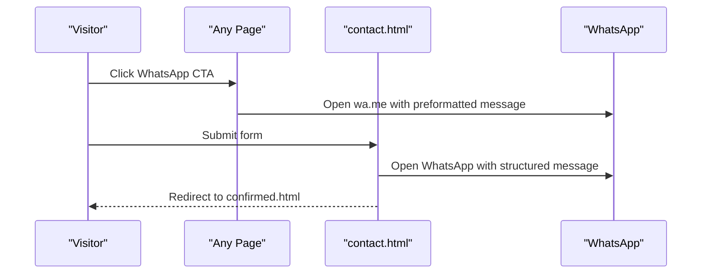
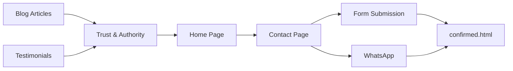
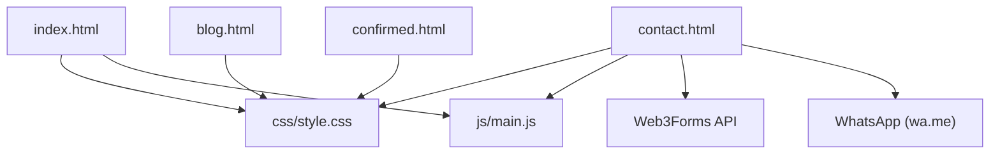

# Marketing Approach & Conversion Strategy

<cite>
**Referenced Files in This Document**
- [index.html](file://index.html)
- [contact.html](file://contact.html)
- [README.md](file://README.md)
- [css/style.css](file://css/style.css)
- [js/main.js](file://js/main.js)
- [blog.html](file://blog.html)
- [confirmed.html](file://confirmed.html)
</cite>

## Table of Contents
1. [Introduction](#introduction)
2. [Project Structure](#project-structure)
3. [Core Components](#core-components)
4. [Architecture Overview](#architecture-overview)
5. [Detailed Component Analysis](#detailed-component-analysis)
6. [Dependency Analysis](#dependency-analysis)
7. [Performance Considerations](#performance-considerations)
8. [Troubleshooting Guide](#troubleshooting-guide)
9. [Conclusion](#conclusion)
10. [Appendices](#appendices)

## Introduction
This document outlines the marketing approach and conversion strategy for Michael | Inglês Executivo’s multi-touchpoint lead generation system. It explains the conversion funnel from service showcase to testimonials and contact acquisition, with emphasis on the “free consultation” strategy to reduce purchase hesitation. It documents trust-building elements (teacher credentials, experience, certifications, and international background), conversion optimization techniques (social proof, authority indicators, scarcity messaging), and the dual contact strategy (direct WhatsApp integration plus comprehensive contact forms). It also connects content marketing (testimonials and blog) to direct sales channels (contact forms), and provides practical implementation details for developers alongside conceptual guidance for stakeholders.

## Project Structure
The website is a static, bilingual (Portuguese/English) marketing site with a clear funnel:
- Home page (index.html): showcases services, credentials, testimonials, pricing, and CTAs
- Contact page (contact.html): dedicated form with dual integration (Web3Forms backend and WhatsApp)
- Blog (blog.html): content marketing hub for SEO and trust-building
- Supporting assets: CSS for styling, JS for interactions and form handling

**Diagram sources**
- [index.html:1-522](file://index.html#L1-L522)
- [contact.html:1-291](file://contact.html#L1-L291)
- [blog.html:1-247](file://blog.html#L1-L247)
- [css/style.css:1-800](file://css/style.css#L1-L800)
- [js/main.js:1-338](file://js/main.js#L1-L338)
- [confirmed.html:1-89](file://confirmed.html#L1-L89)

**Section sources**
- [README.md:11-22](file://README.md#L11-L22)
- [README.md:77-96](file://README.md#L77-L96)

## Core Components
- Hero and value proposition with “free consultation” CTA
- About section highlighting credentials, experience, and international background
- Services showcase with specialized offerings
- Testimonials section for social proof
- Pricing section with transparency and “free consultation” badge
- Dual contact strategy: floating WhatsApp button and comprehensive contact form
- Blog section for content marketing and trust-building

These components collectively guide visitors through a structured funnel: awareness (services/testimonials), consideration (credentials/pricing), and decision (free consultation).

**Section sources**
- [index.html:49-89](file://index.html#L49-L89)
- [index.html:110-158](file://index.html#L110-L158)
- [index.html:160-254](file://index.html#L160-L254)
- [index.html:292-381](file://index.html#L292-L381)
- [index.html:383-479](file://index.html#L383-L479)
- [contact.html:45-132](file://contact.html#L45-L132)
- [contact.html:134-218](file://contact.html#L134-L218)
- [blog.html:52-204](file://blog.html#L52-L204)

## Architecture Overview
The marketing architecture centers on a frictionless conversion funnel:
- Awareness: Services and testimonials on the home page
- Consideration: Credentials and pricing with “free consultation”
- Decision: Single-click WhatsApp entry and comprehensive form
- Post-conversion: Confirmation page and follow-up via WhatsApp

**Diagram sources**
- [index.html:64-70](file://index.html#L64-L70)
- [contact.html:141-148](file://contact.html#L141-L148)
- [contact.html:194-203](file://contact.html#L194-L203)
- [confirmed.html:12-68](file://confirmed.html#L12-L68)

## Detailed Component Analysis

### Conversion Funnel: From Awareness to Contact Acquisition
- Awareness: Services and testimonials on the home page establish relevance and outcomes.
- Consideration: Credentials and pricing communicate authority and transparency.
- Decision: “Free consultation” reduces risk and encourages engagement.
- Post-decision: Confirmation page and immediate WhatsApp connection streamline follow-up.

**Diagram sources**
- [index.html:160-254](file://index.html#L160-L254)
- [index.html:292-381](file://index.html#L292-L381)
- [index.html:383-479](file://index.html#L383-L479)
- [contact.html:141-148](file://contact.html#L141-L148)
- [contact.html:194-203](file://contact.html#L194-L203)
- [confirmed.html:12-68](file://confirmed.html#L12-L68)

**Section sources**
- [README.md:251-257](file://README.md#L251-L257)
- [index.html:64-70](file://index.html#L64-L70)
- [index.html:467-477](file://index.html#L467-L477)

### Trust-Building Elements
- Credentials and experience: native speaker, 8+ years teaching, 26 years in Brazil, TEFL certification, international background
- Authority indicators: badges and highlights in hero and about sections
- Social proof: testimonials from professionals across industries
- Transparency: clear pricing and “free consultation” messaging

**Diagram sources**
- [index.html:59-63](file://index.html#L59-L63)
- [index.html:119-154](file://index.html#L119-L154)
- [index.html:299-379](file://index.html#L299-L379)
- [index.html:467-477](file://index.html#L467-L477)

**Section sources**
- [index.html:59-63](file://index.html#L59-L63)
- [index.html:119-154](file://index.html#L119-L154)
- [index.html:299-379](file://index.html#L299-L379)
- [index.html:467-477](file://index.html#L467-L477)

### Conversion Optimization Techniques
- Social proof: curated testimonials with star ratings and author details
- Authority: prominent badges and credentials in hero and about sections
- Scarcity messaging: implied limited availability via “free consultation” and flexible scheduling
- Reciprocity: offer free consultation to lower perceived cost
- Clarity: transparent pricing and straightforward CTAs

**Diagram sources**
- [index.html:299-379](file://index.html#L299-L379)
- [index.html:59-63](file://index.html#L59-L63)
- [index.html:467-477](file://index.html#L467-L477)

**Section sources**
- [README.md:251-257](file://README.md#L251-L257)
- [index.html:299-379](file://index.html#L299-L379)

### Dual Contact Strategy: WhatsApp Integration and Contact Form
- WhatsApp integration:
  - Floating button on all pages
  - Primary CTA in hero and pricing sections
  - Contact page with direct link
  - Form submission opens WhatsApp with a preformatted message
- Contact form:
  - Dedicated page with fields for name, phone, email, interest, message
  - Hidden Web3Forms integration and redirect to confirmation page
  - Client-side validation and loading states

**Diagram sources**
- [index.html:66-69](file://index.html#L66-L69)
- [index.html:514-517](file://index.html#L514-L517)
- [contact.html:81-85](file://contact.html#L81-L85)
- [contact.html:112-116](file://contact.html#L112-L116)
- [contact.html:141-148](file://contact.html#L141-L148)
- [contact.html:194-203](file://contact.html#L194-L203)

**Section sources**
- [README.md:260-294](file://README.md#L260-L294)
- [contact.html:141-148](file://contact.html#L141-L148)
- [contact.html:194-203](file://contact.html#L194-L203)
- [js/main.js:112-172](file://js/main.js#L112-L172)
- [js/main.js:177-197](file://js/main.js#L177-L197)

### Lead Qualification Process and Message Formatting
- Lead qualification fields on the form include name, phone, email, interest, and optional message
- On submission, the system creates a structured WhatsApp message with:
  - Name, email, phone
  - Profession, English level, interest
  - Availability preference (if provided)
  - Message (if provided)
  - Timestamp
- The form redirects to a confirmation page and opens WhatsApp automatically

Practical example (message structure):
- Subject line: “Nova Solicitação de Consulta”
- Fields: Name, Email, Phone, Profession, English Level, Interest, Availability, Message
- Footer: “Enviado em: [timestamp]”

**Section sources**
- [contact.html:154-192](file://contact.html#L154-L192)
- [js/main.js:177-197](file://js/main.js#L177-L197)
- [README.md:277-293](file://README.md#L277-L293)

### Form Optimization Strategies
- Required fields: name, phone, email, profession, level, interest
- Client-side validation: email format and required field checks
- User experience: loading state during submission, success/error messages, and automatic form reset
- Accessibility: ARIA labels and semantic HTML structure
- Privacy: No server-side processing; data remains local until WhatsApp opens

**Section sources**
- [contact.html:154-192](file://contact.html#L154-L192)
- [js/main.js:276-288](file://js/main.js#L276-L288)
- [js/main.js:293-304](file://js/main.js#L293-L304)
- [README.md:297-304](file://README.md#L297-L304)

### Relationship Between Content Marketing and Direct Sales Channels
- Blog content positions the teacher as an authority on English communication for professionals, driving traffic and trust
- Testimonials on the home page reinforce credibility and reduce hesitation
- Both content channels funnel visitors to the contact page, where the dual contact strategy captures leads via form and WhatsApp

**Diagram sources**
- [blog.html:52-204](file://blog.html#L52-L204)
- [index.html:292-381](file://index.html#L292-L381)
- [index.html:45-59](file://index.html#L45-L59)
- [contact.html:134-218](file://contact.html#L134-L218)
- [confirmed.html:12-68](file://confirmed.html#L12-L68)

**Section sources**
- [blog.html:52-204](file://blog.html#L52-L204)
- [index.html:292-381](file://index.html#L292-L381)
- [index.html:45-59](file://index.html#L45-L59)

## Dependency Analysis
- index.html depends on CSS for styling and JS for interactions
- contact.html depends on CSS and JS for form handling and validation
- Web3Forms handles form submission and redirect to confirmed.html
- WhatsApp integration relies on wa.me links and preformatted messages
- The design system uses consistent color themes and typography across pages

**Diagram sources**
- [index.html:19](file://index.html#L19)
- [contact.html:15](file://contact.html#L15)
- [contact.html:141-148](file://contact.html#L141-L148)
- [css/style.css:1-25](file://css/style.css#L1-L25)
- [js/main.js:1-338](file://js/main.js#L1-L338)
- [blog.html:22](file://blog.html#L22)
- [confirmed.html:9](file://confirmed.html#L9)

**Section sources**
- [css/style.css:1-25](file://css/style.css#L1-L25)
- [js/main.js:1-338](file://js/main.js#L1-L338)
- [contact.html:141-148](file://contact.html#L141-L148)

## Performance Considerations
- Minimal external dependencies and CDN-hosted libraries improve load times
- CSS Grid and Flexbox layouts ensure responsive design across devices
- Smooth scroll and scroll animations enhance UX without impacting performance
- Local storage usage for form backups ensures resilience without server overhead

[No sources needed since this section provides general guidance]

## Troubleshooting Guide
- Form validation errors: ensure required fields are filled and email format is valid
- WhatsApp not opening: verify wa.me link and preformatted message encoding
- Redirect issues: confirm Web3Forms redirect setting and access key
- Mobile responsiveness: test on various screen sizes and orientations

**Section sources**
- [js/main.js:276-288](file://js/main.js#L276-L288)
- [js/main.js:177-197](file://js/main.js#L177-L197)
- [contact.html:141-148](file://contact.html#L141-L148)
- [README.md:297-304](file://README.md#L297-L304)

## Conclusion
The marketing approach leverages a clear, frictionless funnel that moves visitors from awareness to decision via trust-building elements and a dual contact strategy. The “free consultation” lowers purchase hesitation, while testimonials and credentials reinforce authority. The contact form and WhatsApp integration capture leads efficiently, and the blog and testimonials strengthen content marketing and social proof. Together, these components create a robust, developer-friendly system aligned with stakeholder goals.

[No sources needed since this section summarizes without analyzing specific files]

## Appendices
- Practical examples:
  - WhatsApp message format: see [README.md:277-293](file://README.md#L277-L293)
  - Form fields: see [contact.html:154-192](file://contact.html#L154-L192)
  - Confirmation page: see [confirmed.html:12-68](file://confirmed.html#L12-L68)

[No sources needed since this section aggregates previously cited content]