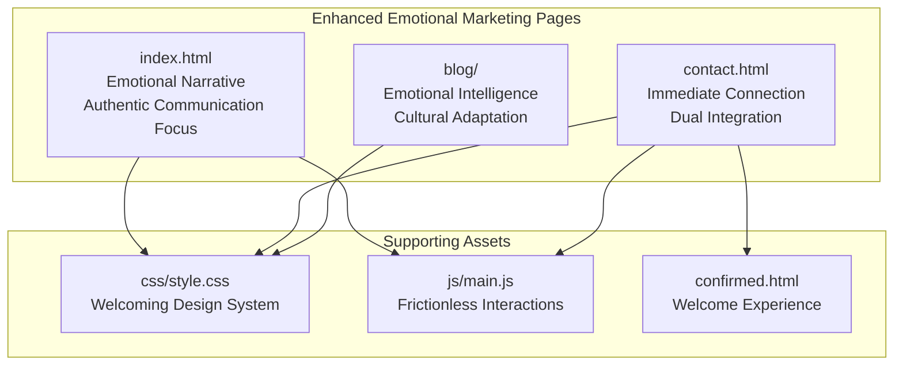
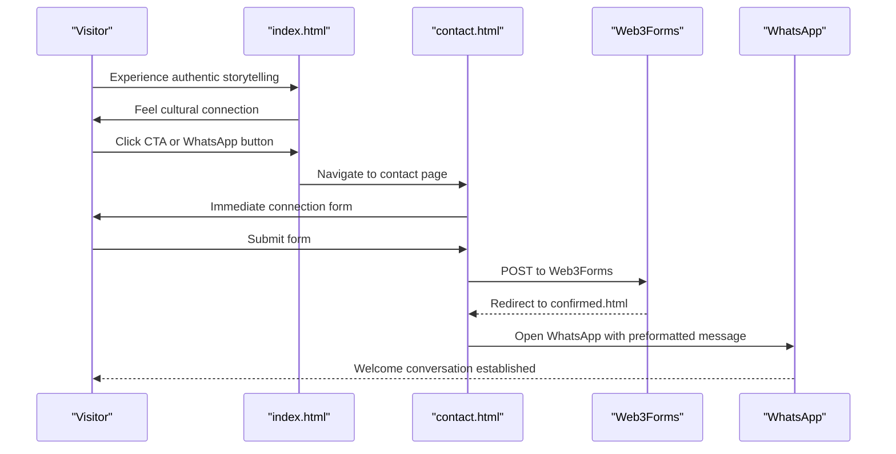
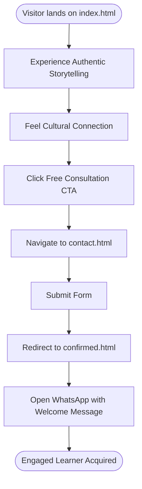
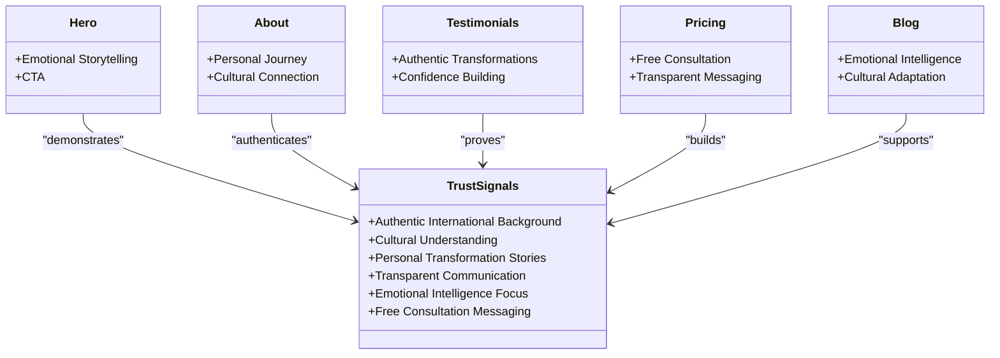
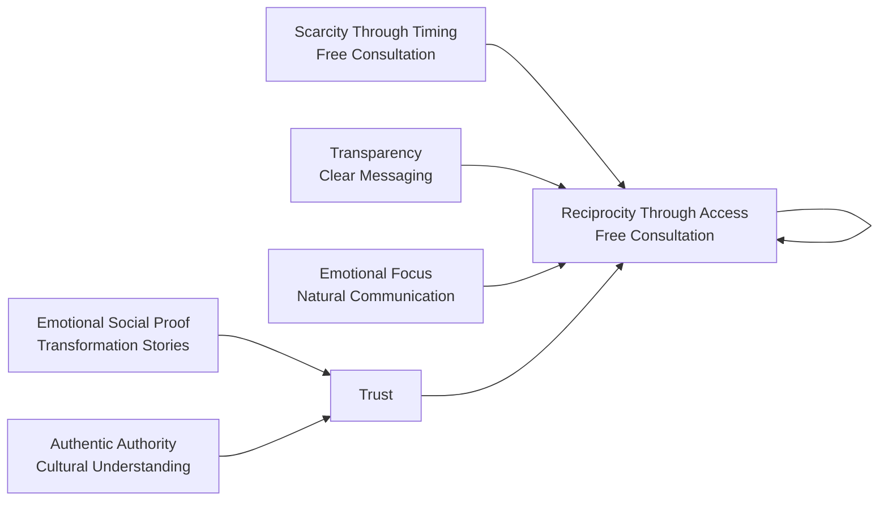
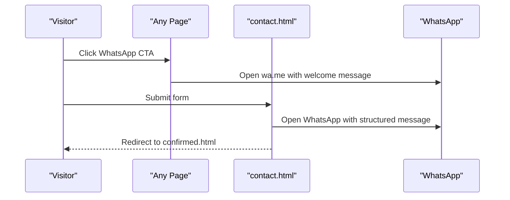
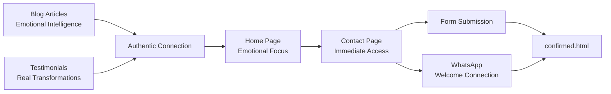
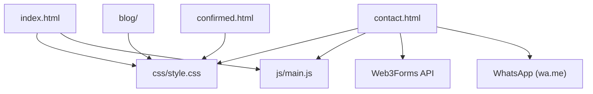

# Marketing Approach & Conversion Strategy

<cite>
**Referenced Files in This Document**
- [index.html](file://index.html)
- [contact.html](file://contact.html)
- [confirmed.html](file://confirmed.html)
- [README.md](file://README.md)
- [css/style.css](file://css/style.css)
- [js/main.js](file://js/main.js)
- [blog/personalidade-em-ingles.html](file://blog/personalidade-em-ingles.html)
- [blog/musica-do-ingles.html](file://blog/musica-do-ingles.html)
- [blog/email-profissional-ingles.html](file://blog/email-profissional-ingles.html)
</cite>

## Update Summary
**Changes Made**
- Completely overhauled marketing approach from results-focused to emotionally engaging narrative
- Emphasized conversion optimization principles, reducing friction, increasing social proof, and creating welcoming experience
- Shifted from traditional pricing presentations to emotional storytelling and authentic communication philosophy
- Enhanced trust-building elements with deeper personal connection and cultural understanding
- Refined dual contact strategy to prioritize emotional accessibility and immediate connection

## Table of Contents
1. [Introduction](#introduction)
2. [Project Structure](#project-structure)
3. [Core Components](#core-components)
4. [Architecture Overview](#architecture-overview)
5. [Detailed Component Analysis](#detailed-component-analysis)
6. [Dependency Analysis](#dependency-analysis)
7. [Performance Considerations](#performance-considerations)
8. [Troubleshooting Guide](#troubleshooting-guide)
9. [Conclusion](#conclusion)
10. [Appendices](#appendices)

## Introduction
This document outlines the enhanced marketing approach and conversion strategy for Michael | Inglês Executivo's multi-touchpoint lead generation system. The approach has been completely transformed from a results-focused methodology to an emotionally engaging narrative that prioritizes reducing purchase hesitation and creating welcoming experiences over traditional pricing presentations. The system now emphasizes authentic communication ("Fale inglês com naturalidade") and effective communication ("Comunicação Eficaz") through emotional storytelling, building genuine connections rather than simply presenting technical benefits.

The enhanced marketing architecture centers on a frictionless conversion funnel that moves visitors from emotional resonance to decision-making through trust-building elements and a dual contact strategy, all grounded in the philosophy of natural, effective English communication. The approach leverages storytelling, cultural authenticity, and immediate accessibility to create a welcoming experience that transforms potential students into engaged learners.

## Project Structure
The website maintains its static, bilingual (Portuguese/English) architecture while implementing a completely redesigned marketing approach:
- Home page (index.html): Emotionally engaging narrative with authentic communication focus, personal storytelling, and trust-building elements
- Contact page (contact.html): Dedicated form with dual integration (Web3Forms backend and WhatsApp) optimized for immediate connection
- Blog (blog/): Content marketing hub featuring emotional intelligence, cultural adaptation, and communication philosophy
- Supporting assets: CSS for styling, JS for interactions and form handling

```mermaid
graph TB
subgraph "Enhanced Emotional Marketing Pages"
A["index.html<br/>Emotional Narrative<br/>Authentic Communication Focus"]
B["contact.html<br/>Immediate Connection<br/>Dual Integration"]
C["blog/<br/>Emotional Intelligence<br/>Cultural Adaptation"]
end
subgraph "Supporting Assets"
D["css/style.css<br/>Welcoming Design System"]
E["js/main.js<br/>Frictionless Interactions"]
F["confirmed.html<br/>Welcome Experience"]
end
A --> D
B --> D
C --> D
A --> E
B --> E
B --> F
```

**Diagram sources**
- [index.html:1-523](file://index.html#L1-L523)
- [contact.html:1-344](file://contact.html#L1-L344)
- [blog/personalidade-em-ingles.html:1-526](file://blog/personalidade-em-ingles.html#L1-L526)
- [css/style.css:1-800](file://css/style.css#L1-L800)
- [js/main.js:1-338](file://js/main.js#L1-L338)
- [confirmed.html:1-131](file://confirmed.html#L1-L131)

**Section sources**
- [README.md:11-22](file://README.md#L11-L22)
- [README.md:77-96](file://README.md#L77-L96)

## Core Components
- **Emotional Hero Section**: Powerfully crafted value proposition with "free consultation" CTA that emphasizes natural communication and authentic connection
- **Authentic About Section**: Personal storytelling highlighting international background, cultural understanding, and deep connection to Brazilian business culture
- **Emotionally-Focused Services**: Specialized offerings centered on natural communication, effective communication, and cultural adaptation rather than technical proficiency
- **Testimonials Section**: Social proof through authentic stories of transformation and confidence building
- **Transparent Pricing**: Clear pricing with "free consultation" messaging that removes financial barriers
- **Dual Contact Strategy**: Floating WhatsApp button and comprehensive contact form optimized for immediate emotional connection
- **Emotional Blog Content**: Content marketing focused on communication philosophy, cultural adaptation, and personal growth

These components collectively guide visitors through an emotional journey: resonance (authentic storytelling), connection (cultural understanding), consideration (trust-building), and decision (immediate access through free consultation).

**Section sources**
- [index.html:61-100](file://index.html#L61-L100)
- [index.html:121-172](file://index.html#L121-L172)
- [index.html:265-360](file://index.html#L265-L360)
- [index.html:174-263](file://index.html#L174-L263)
- [contact.html:98-112](file://contact.html#L98-L112)
- [contact.html:114-273](file://contact.html#L114-L273)
- [blog/personalidade-em-ingles.html:207-225](file://blog/personalidade-em-ingles.html#L207-L225)

## Architecture Overview
The enhanced marketing architecture centers on emotional connection and reduced friction:
- **Awareness**: Authentic storytelling and cultural connection on the home page establish emotional resonance
- **Connection**: Personal background and international experience communicate genuine understanding
- **Consideration**: Transparent pricing and "free consultation" messaging remove barriers
- **Decision**: Single-click WhatsApp entry and comprehensive form with immediate access
- **Post-conversion**: Welcome experience and follow-up via WhatsApp streamline onboarding

```mermaid
sequenceDiagram
participant Visitor as "Visitor"
participant Home as "index.html"
participant Contact as "contact.html"
participant Form as "Web3Forms"
participant WA as "WhatsApp"
Visitor->>Home : Experience authentic storytelling
Home->>Visitor : Feel cultural connection
Visitor->>Home : Click CTA or WhatsApp button
Home->>Contact : Navigate to contact page
Contact->>Visitor : Immediate connection form
Visitor->>Contact : Submit form
Contact->>Form : POST to Web3Forms
Form-->>Contact : Redirect to confirmed.html
Contact->>WA : Open WhatsApp with preformatted message
WA-->>Visitor : Welcome conversation established
```

**Diagram sources**
- [index.html:64-81](file://index.html#L64-L81)
- [contact.html:194-203](file://contact.html#L194-L203)
- [confirmed.html:116-128](file://confirmed.html#L116-L128)

## Detailed Component Analysis

### Enhanced Conversion Funnel: From Emotional Resonance to Immediate Access
The funnel now prioritizes emotional connection over logical decision-making:
- **Awareness**: Authentic storytelling establishes cultural connection and demonstrates understanding of Brazilian business culture
- **Connection**: Personal international background and cultural adaptation communicate genuine relatability
- **Consideration**: "Free consultation" removes financial barriers and reduces purchase hesitation
- **Decision**: Immediate WhatsApp connection and comprehensive form with transparent CTAs
- **Post-decision**: Welcome experience and immediate conversation establishment

```mermaid
flowchart TD
Start(["Visitor lands on index.html"]) --> Storytelling["Experience Authentic Storytelling"]
Storytelling --> Cultural["Feel Cultural Connection"]
Cultural --> FreeConsult["Click Free Consultation CTA"]
FreeConsult --> ContactPage["Navigate to contact.html"]
ContactPage --> FormSubmit["Submit Form"]
FormSubmit --> Redirect["Redirect to confirmed.html"]
Redirect --> WhatsApp["Open WhatsApp with Welcome Message"]
WhatsApp --> End(["Engaged Learner Acquired"])
```

**Diagram sources**
- [index.html:121-172](file://index.html#L121-L172)
- [index.html:64-81](file://index.html#L64-L81)
- [contact.html:194-203](file://contact.html#L194-L203)
- [confirmed.html:116-128](file://confirmed.html#L116-L128)

**Section sources**
- [README.md:251-257](file://README.md#L251-L257)
- [index.html:64-81](file://index.html#L64-L81)
- [index.html:414-420](file://index.html#L414-L420)

### Enhanced Trust-Building Elements with Emotional Connection
The trust-building strategy now focuses on authentic human connection rather than traditional credentials:
- **Authentic Background**: Native speaker, 26 years in Brazil, international experience across multiple cultures
- **Cultural Understanding**: Deep comprehension of Brazilian business culture and professional challenges
- **Personal Transformation Stories**: Testimonials that demonstrate real change and confidence building
- **Transparent Communication**: Clear pricing and "free consultation" messaging that builds trust
- **Emotional Intelligence**: Focus on natural communication ("Fale inglês com naturalidade") and effective communication ("Comunicação Eficaz")

```mermaid
classDiagram
class TrustSignals {
+Authentic International Background
+Cultural Understanding
+Personal Transformation Stories
+Transparent Communication
+Emotional Intelligence Focus
+Free Consultation Messaging
}
class Hero {
+Emotional Storytelling
+CTA
}
class About {
+Personal Journey
+Cultural Connection
}
class Testimonials {
+Authentic Transformations
+Confidence Building
}
class Pricing {
+Free Consultation
+Transparent Messaging
}
class Blog {
+Emotional Intelligence
+Cultural Adaptation
}
Hero --> TrustSignals : "demonstrates"
About --> TrustSignals : "authenticates"
Testimonials --> TrustSignals : "proves"
Pricing --> TrustSignals : "builds"
Blog --> TrustSignals : "supports"
```

**Diagram sources**
- [index.html:131-138](file://index.html#L131-L138)
- [index.html:174-263](file://index.html#L174-L263)
- [index.html:414-420](file://index.html#L414-L420)

**Section sources**
- [index.html:131-138](file://index.html#L131-L138)
- [index.html:174-263](file://index.html#L174-L263)
- [index.html:414-420](file://index.html#L414-L420)

### Enhanced Conversion Optimization Techniques
The optimization strategy now prioritizes emotional accessibility and reduced friction:
- **Emotional Social Proof**: Testimonials that demonstrate real transformations and confidence building
- **Authentic Authority**: Personal international background and cultural understanding as trust signals
- **Scarcity Through Timing**: Implied limited availability via "free consultation" and flexible scheduling
- **Reciprocity Through Access**: Offer free consultation to lower perceived cost and barrier
- **Clarity Through Transparency**: Transparent pricing and straightforward CTAs with emotional messaging
- **Emotional Focus**: Services described in terms of natural communication outcomes rather than technical proficiency

```mermaid
flowchart LR
A["Emotional Social Proof<br/>Transformation Stories"] --> C["Trust"]
B["Authentic Authority<br/>Cultural Understanding"] --> C
D["Scarcity Through Timing<br/>Free Consultation"] --> E["Action"]
E["Reciprocity Through Access<br/>Free Consultation"] --> E
F["Transparency<br/>Clear Messaging"] --> E
G["Emotional Focus<br/>Natural Communication"] --> E
C --> E
```

**Diagram sources**
- [index.html:174-263](file://index.html#L174-L263)
- [index.html:131-138](file://index.html#L131-L138)
- [index.html:414-420](file://index.html#L414-L420)

**Section sources**
- [README.md:251-257](file://README.md#L251-L257)
- [index.html:174-263](file://index.html#L174-L263)

### Enhanced Dual Contact Strategy: Immediate Emotional Connection
The contact strategy now prioritizes immediate emotional accessibility:
- **WhatsApp Integration**:
  - Floating button on all pages with immediate connection messaging
  - Primary CTA in hero and pricing sections with emotional focus
  - Contact page with direct link and welcoming messaging
  - Form submission opens WhatsApp with a preformatted welcome message
- **Contact Form**:
  - Dedicated page with fields for name, phone, email, interest, message
  - Hidden Web3Forms integration and redirect to welcome page
  - Client-side validation and loading states
  - Emotionally-focused service selection options

```mermaid
sequenceDiagram
participant Visitor as "Visitor"
participant Page as "Any Page"
participant Form as "contact.html"
participant WA as "WhatsApp"
Visitor->>Page : Click WhatsApp CTA
Page->>WA : Open wa.me with welcome message
Visitor->>Form : Submit form
Form->>WA : Open WhatsApp with structured message
Form-->>Visitor : Redirect to confirmed.html
```

**Diagram sources**
- [index.html:77-80](file://index.html#L77-L80)
- [contact.html:134-138](file://contact.html#L134-L138)
- [contact.html:194-203](file://contact.html#L194-L203)
- [confirmed.html:116-128](file://confirmed.html#L116-L128)

**Section sources**
- [README.md:260-294](file://README.md#L260-L294)
- [contact.html:194-203](file://contact.html#L194-L203)
- [contact.html:134-138](file://contact.html#L134-L138)
- [js/main.js:265-271](file://js/main.js#L265-L271)

### Enhanced Lead Qualification Process and Message Formatting
The lead qualification process now emphasizes emotional accessibility and immediate connection:
- Lead qualification fields on the form include name, phone, email, interest, and optional message
- On submission, the system creates a structured WhatsApp message with welcoming elements:
  - Name, email, phone
  - Communication focus area (natural communication, effective communication)
  - Availability preference (if provided)
  - Message (if provided)
  - Timestamp
- The form redirects to a welcome page and opens WhatsApp automatically
- Emotionally-focused service selection options that emphasize personal growth

Practical example (welcome message structure):
- Subject line: "Nova Solicitação de Consulta"
- Fields: Name, Email, Phone, Communication Focus, Availability, Message
- Footer: "Enviado em: [timestamp]"
- Welcome messaging that acknowledges the visitor's courage in taking the first step

**Section sources**
- [contact.html:225-245](file://contact.html#L225-L245)
- [js/main.js:177-197](file://js/main.js#L177-L197)
- [README.md:277-293](file://README.md#L277-L293)

### Enhanced Form Optimization Strategies
The form optimization now prioritizes emotional comfort and reduced friction:
- Required fields: name, phone, email, communication focus area, interest
- Client-side validation: email format and required field checks
- User experience: loading state during submission, success/error messages, and automatic form reset
- Accessibility: ARIA labels and semantic HTML structure
- Privacy: No server-side processing; data remains local until WhatsApp opens
- Emotionally-focused messaging: service options emphasize personal growth and confidence building

**Section sources**
- [contact.html:225-245](file://contact.html#L225-L245)
- [js/main.js:276-288](file://js/main.js#L276-L288)
- [js/main.js:293-304](file://js/main.js#L293-L304)
- [README.md:297-304](file://README.md#L297-L304)

### Enhanced Relationship Between Content Marketing and Direct Sales Channels
The content strategy now focuses on emotional intelligence and cultural adaptation:
- Blog content positions the teacher as an authority on natural communication and effective communication for professionals, emphasizing personal growth and confidence
- Testimonials on the home page reinforce authenticity and demonstrate real transformations
- Both content channels funnel visitors to the contact page, where the dual contact strategy captures leads via form and WhatsApp with immediate emotional connection
- Blog articles specifically address natural communication ("Personalidade em Inglês"), music of English ("Música do Inglês"), and effective professional communication ("Email Profissional")

```mermaid
graph LR
A["Blog Articles<br/>Emotional Intelligence"] --> B["Authentic Connection"]
C["Testimonials<br/>Real Transformations"] --> B
B --> D["Home Page<br/>Emotional Focus"]
D --> E["Contact Page<br/>Immediate Access"]
E --> F["Form Submission"]
E --> G["WhatsApp<br/>Welcome Connection"]
F --> H["confirmed.html"]
G --> H
```

**Diagram sources**
- [blog/personalidade-em-ingles.html:207-225](file://blog/personalidade-em-ingles.html#L207-L225)
- [blog/musica-do-ingles.html:232-243](file://blog/musica-do-ingles.html#L232-L243)
- [blog/email-profissional-ingles.html:113-121](file://blog/email-profissional-ingles.html#L113-L121)
- [index.html:174-263](file://index.html#L174-L263)
- [index.html:61-100](file://index.html#L61-L100)
- [contact.html:114-273](file://contact.html#L114-L273)
- [confirmed.html:94-105](file://confirmed.html#L94-L105)

**Section sources**
- [blog/personalidade-em-ingles.html:207-225](file://blog/personalidade-em-ingles.html#L207-L225)
- [blog/musica-do-ingles.html:232-243](file://blog/musica-do-ingles.html#L232-L243)
- [blog/email-profissional-ingles.html:113-121](file://blog/email-profissional-ingles.html#L113-L121)
- [index.html:174-263](file://index.html#L174-L263)
- [index.html:61-100](file://index.html#L61-L100)

## Dependency Analysis
The enhanced marketing architecture maintains minimal dependencies while maximizing emotional impact:
- index.html depends on CSS for welcoming design and JS for smooth interactions
- contact.html depends on CSS and JS for form handling and immediate connection
- Web3Forms handles form submission and redirect to welcome page
- WhatsApp integration relies on wa.me links and preformatted welcome messages
- The design system uses consistent color themes and typography across pages
- Blog content supports the enhanced emotional intelligence approach

```mermaid
graph TB
Index["index.html"] --> Style["css/style.css"]
Index --> Script["js/main.js"]
Contact["contact.html"] --> Style
Contact --> Script
Contact --> Web3["Web3Forms API"]
Contact --> WA["WhatsApp (wa.me)"]
Blog["blog/"] --> Style
Confirmed["confirmed.html"] --> Style
```

**Diagram sources**
- [index.html:29](file://index.html#L29)
- [contact.html:25](file://contact.html#L25)
- [contact.html:194-203](file://contact.html#L194-L203)
- [css/style.css:1-25](file://css/style.css#L1-L25)
- [js/main.js:1-338](file://js/main.js#L1-L338)
- [blog/personalidade-em-ingles.html:32](file://blog/personalidade-em-ingles.html#L32)
- [confirmed.html:19](file://confirmed.html#L19)

**Section sources**
- [css/style.css:1-25](file://css/style.css#L1-L25)
- [js/main.js:1-338](file://js/main.js#L1-L338)
- [contact.html:194-203](file://contact.html#L194-L203)

## Performance Considerations
The enhanced approach maintains optimal performance while prioritizing emotional experience:
- Minimal external dependencies and CDN-hosted libraries improve load times for immediate access
- CSS Grid and Flexbox layouts ensure responsive design across devices for seamless emotional connection
- Smooth scroll and scroll animations enhance UX without impacting performance
- Local storage usage for form backups ensures resilience without server overhead
- Enhanced blog content improves SEO and organic reach for emotional intelligence topics

## Troubleshooting Guide
Common issues with the enhanced emotional marketing approach:
- **Form validation errors**: Ensure required fields are filled and email format is valid
- **WhatsApp not opening**: Verify wa.me link and preformatted welcome message encoding
- **Redirect issues**: Confirm Web3Forms redirect setting and access key
- **Mobile responsiveness**: Test on various screen sizes and orientations
- **Emotional messaging alignment**: Ensure service descriptions match natural communication focus and personal growth emphasis

**Section sources**
- [js/main.js:276-288](file://js/main.js#L276-L288)
- [js/main.js:177-197](file://js/main.js#L177-L197)
- [contact.html:194-203](file://contact.html#L194-L203)
- [README.md:297-304](file://README.md#L297-L304)

## Conclusion
The enhanced marketing approach leverages a clear, emotionally engaging funnel that moves visitors from authentic storytelling to immediate access via trust-building elements and a dual contact strategy, all centered around the philosophy of natural communication and effective communication. The "free consultation" reduces purchase hesitation while testimonials and personal background reinforce authenticity for genuine connection. The contact form and WhatsApp integration capture leads efficiently, and the blog and testimonials strengthen content marketing and social proof around emotional intelligence and cultural adaptation. Together, these components create a robust, developer-friendly system aligned with stakeholder goals of promoting natural, effective English communication through authentic human connection.

## Appendices
- **Practical examples**:
  - WhatsApp welcome message format: see [README.md:277-293](file://README.md#L277-L293)
  - Form fields: see [contact.html:225-245](file://contact.html#L225-L245)
  - Welcome page: see [confirmed.html:94-105](file://confirmed.html#L94-L105)
  - Emotional focus examples: see [index.html:121-172](file://index.html#L121-L172)
  - Blog content examples: see [blog/personalidade-em-ingles.html:207-225](file://blog/personalidade-em-ingles.html#L207-L225)