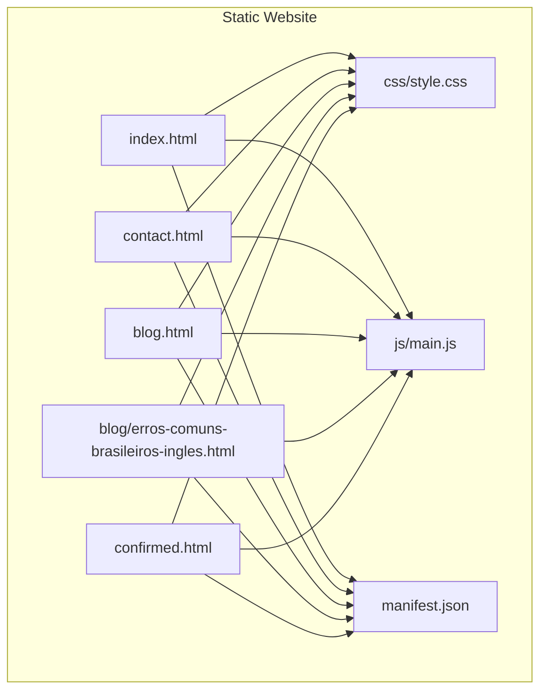
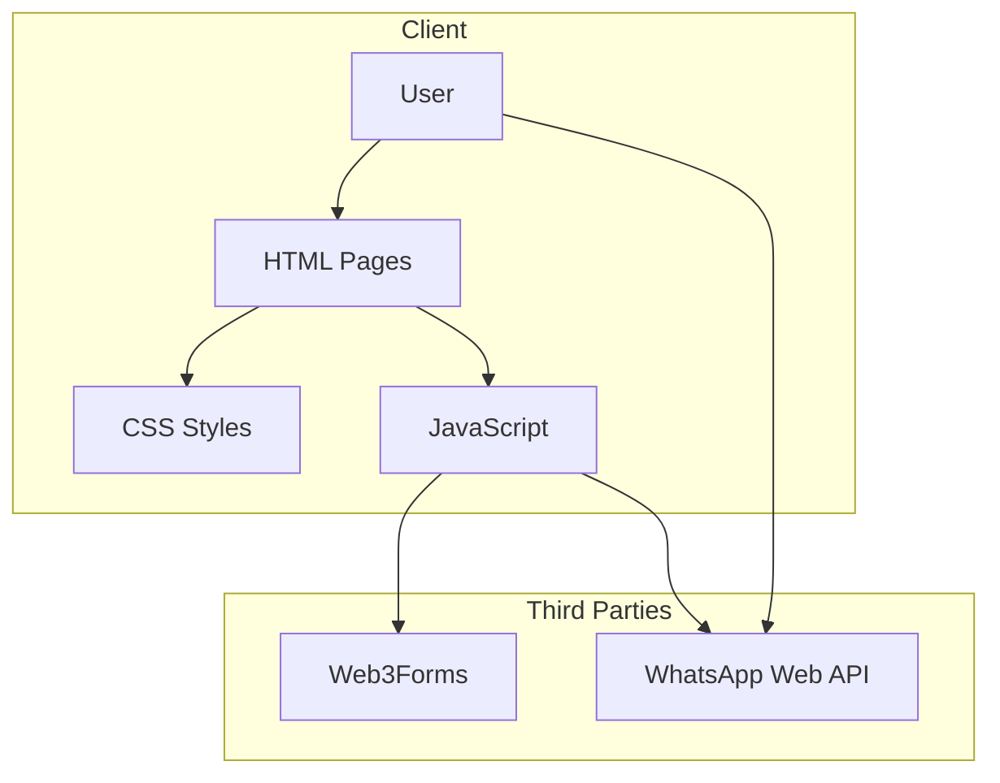
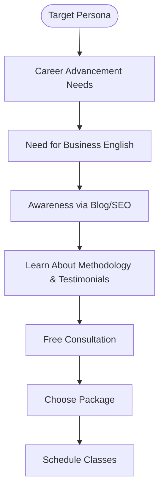
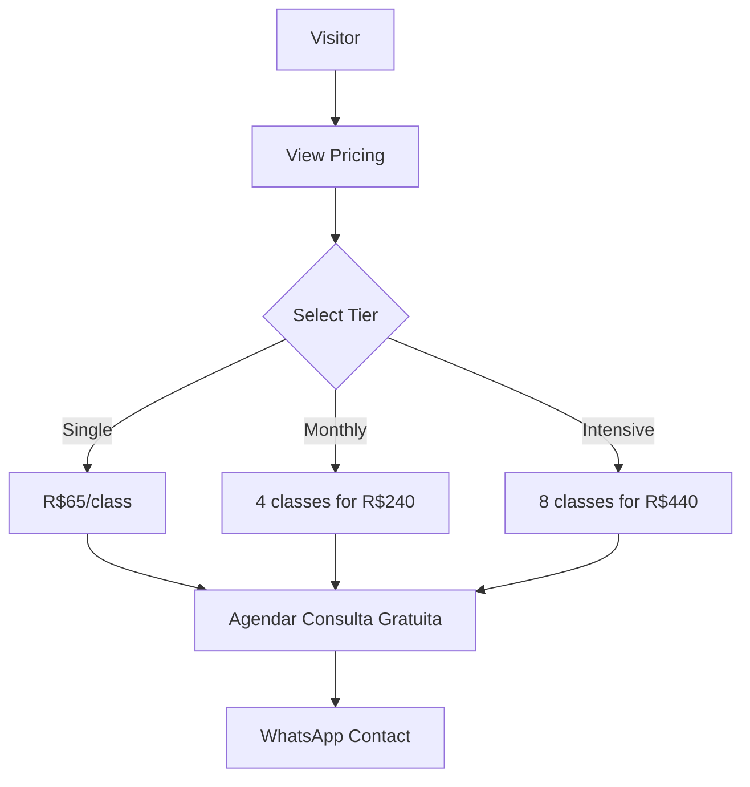
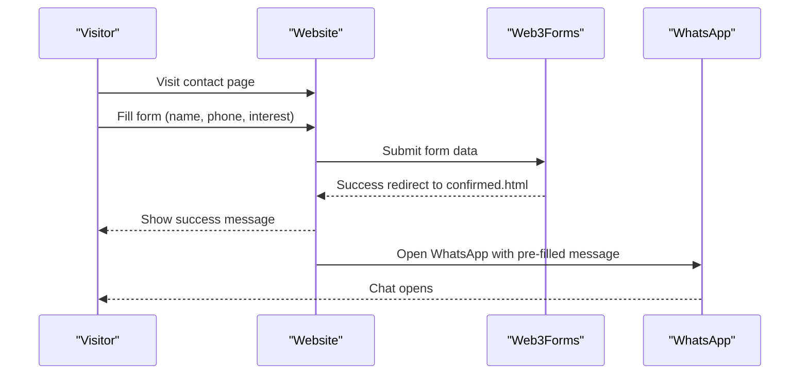
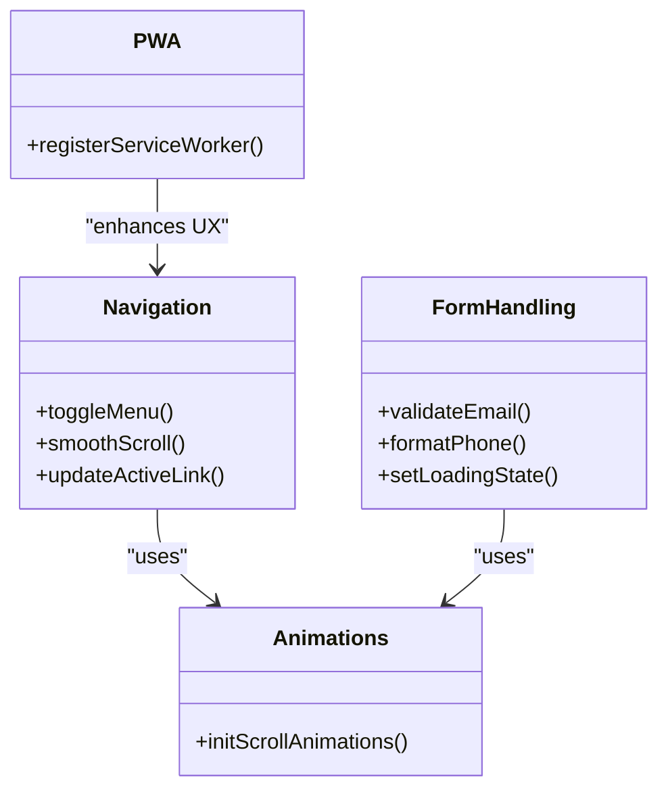
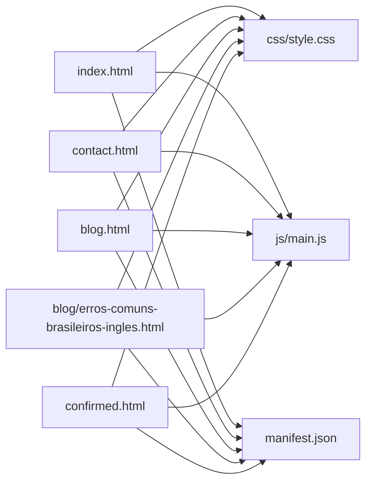

# Project Overview

<cite>
**Referenced Files in This Document**
- [README.md](file://README.md)
- [index.html](file://index.html)
- [contact.html](file://contact.html)
- [blog.html](file://blog.html)
- [blog/erros-comuns-brasileiros-ingles.html](file://blog/erros-comuns-brasileiros-ingles.html)
- [confirmed.html](file://confirmed.html)
- [css/style.css](file://css/style.css)
- [js/main.js](file://js/main.js)
- [manifest.json](file://manifest.json)
</cite>

## Table of Contents
1. [Introduction](#introduction)
2. [Project Structure](#project-structure)
3. [Core Components](#core-components)
4. [Architecture Overview](#architecture-overview)
5. [Detailed Component Analysis](#detailed-component-analysis)
6. [Dependency Analysis](#dependency-analysis)
7. [Performance Considerations](#performance-considerations)
8. [Troubleshooting Guide](#troubleshooting-guide)
9. [Conclusion](#conclusion)
10. [Appendices](#appendices)

## Introduction
This project is a bilingual (Portuguese/English) marketing website for Michael | Inglês Executivo, a professional English instruction service targeting Brazilian professionals. The site positions Michael as a native speaker with 26 years of life experience in Brazil and extensive international exposure, combining deep cultural understanding with global teaching expertise. It serves as a conversion-focused platform that emphasizes trust, transparency, and low-friction engagement through multiple contact channels and a clear pricing model.

The website’s primary goals are:
- Educate and attract Brazilian professionals seeking English proficiency for career advancement
- Demonstrate authority and credibility via background storytelling and testimonials
- Drive conversions through a simplified funnel: awareness → consultation → enrollment
- Maintain a professional, mobile-first, and accessible design aligned with modern UX expectations

## Project Structure
The website is a static, bilingual HTML/CSS/JavaScript application with a clear separation of concerns:
- Landing page (index.html): hero, about, services, methodology, testimonials, pricing, and footer
- Contact page (contact.html): dedicated form, contact methods, and FAQ
- Blog section (blog.html and individual articles): educational content to build trust and improve SEO
- Supporting assets: CSS, JS, fonts, icons, and media
- Progressive Web App metadata (manifest.json) for installability

**Diagram sources**
- [index.html:1-522](file://index.html#L1-L522)
- [contact.html:1-291](file://contact.html#L1-L291)
- [blog.html:1-247](file://blog.html#L1-L247)
- [blog/erros-comuns-brasileiros-ingles.html:1-407](file://blog/erros-comuns-brasileiros-ingles.html#L1-L407)
- [confirmed.html:1-120](file://confirmed.html#L1-L120)
- [css/style.css:1-1886](file://css/style.css#L1-L1886)
- [js/main.js:1-338](file://js/main.js#L1-L338)
- [manifest.json:1-1](file://manifest.json#L1-L1)

**Section sources**
- [README.md:11-22](file://README.md#L11-L22)
- [index.html:1-522](file://index.html#L1-L522)
- [contact.html:1-291](file://contact.html#L1-L291)
- [blog.html:1-247](file://blog.html#L1-L247)
- [blog/erros-comuns-brasileiros-ingles.html:1-407](file://blog/erros-comuns-brasileiros-ingles.html#L1-L407)
- [confirmed.html:1-120](file://confirmed.html#L1-L120)
- [css/style.css:1-1886](file://css/style.css#L1-L1886)
- [js/main.js:1-338](file://js/main.js#L1-L338)
- [manifest.json:1-1](file://manifest.json#L1-L1)

## Core Components
- Bilingual content and navigation: Portuguese primary with English fallback in specific UI elements (e.g., footer brand tagline)
- Hero section: compelling headline, badges highlighting credentials, and dual CTAs (contact page and WhatsApp)
- About section: narrative emphasizing international experience, Brazilian context, and TEFL certification
- Services section: four specialized offerings (Corporate English, IT & Tech, Advanced Conversation, Exam Preparation) plus a popular tier
- Testimonials: curated quotes from professionals with ratings and brief roles
- Pricing: transparent tiers (single class, monthly package, intensive package) with savings messaging and a free consultation badge
- Contact: simplified contact options, floating WhatsApp button, and a dedicated contact page with a form integrated via a third-party service
- Blog: curated articles to establish authority and drive organic traffic
- Progressive Web App: manifest enabling standalone installation

**Section sources**
- [index.html:49-479](file://index.html#L49-L479)
- [contact.html:45-248](file://contact.html#L45-L248)
- [blog.html:52-204](file://blog.html#L52-L204)
- [blog/erros-comuns-brasileiros-ingles.html:74-348](file://blog/erros-comuns-brasileiros-ingles.html#L74-L348)
- [confirmed.html:83-94](file://confirmed.html#L83-L94)
- [manifest.json:1-1](file://manifest.json#L1-L1)

## Architecture Overview
The site follows a static architecture with client-side interactions:
- HTML pages define content and structure
- CSS provides responsive, theme-driven styling
- JavaScript handles navigation, scroll effects, phone formatting, form validation, and animations
- Third-party integrations: Web3Forms for contact form submission and WhatsApp for communication

**Diagram sources**
- [index.html:1-522](file://index.html#L1-L522)
- [contact.html:141-204](file://contact.html#L141-L204)
- [js/main.js:112-172](file://js/main.js#L112-L172)

**Section sources**
- [README.md:161-183](file://README.md#L161-L183)
- [index.html:1-522](file://index.html#L1-L522)
- [contact.html:141-204](file://contact.html#L141-L204)
- [js/main.js:112-172](file://js/main.js#L112-L172)

## Detailed Component Analysis

### Target Audience and Positioning
- Primary persona: Brazilian professionals (executives, managers, IT/Tech specialists) at intermediate level or higher
- Key motivations: career advancement, international communication, confidence in business settings
- Positioning differentiators:
  - Native speaker with 26 years in Brazil and international experience
  - TEFL-certified instructor
  - Contextual understanding of Brazilian business culture
  - Flexible, one-on-one online classes with transparent pricing

**Section sources**
- [README.md:118-133](file://README.md#L118-L133)
- [index.html:110-158](file://index.html#L110-L158)
- [index.html:160-254](file://index.html#L160-L254)
- [index.html:292-381](file://index.html#L292-L381)
- [index.html:383-479](file://index.html#L383-L479)

### Business Model, Pricing, and Offerings
- Service model: One-on-one online English lessons
- Duration: 50 minutes per class
- Pricing tiers:
  - Single class: R$65/class
  - Monthly package: 4 classes for R$240 (R$60/class)
  - Intensive package: 8 classes for R$440 (R$55/class)
- Policy: Free consultation (first meeting), no long-term contracts, flexible scheduling
- Payment methods: Pix, card, or bank transfer (as described in pricing section)
- Offerings:
  - Corporate English
  - English for IT & Tech
  - Advanced Conversation
  - Exam Preparation (TOEFL, IELTS, Cambridge)

**Section sources**
- [index.html:383-479](file://index.html#L383-L479)
- [contact.html:141-204](file://contact.html#L141-L204)

### Marketing Funnel and Conversion Strategy
- Awareness: Blog content and social presence
- Consideration: Services, testimonials, methodology, and pricing transparency
- Decision: Free consultation and WhatsApp integration
- Action: Contact form submission and redirection to confirmation page

**Diagram sources**
- [contact.html:141-204](file://contact.html#L141-L204)
- [confirmed.html:83-94](file://confirmed.html#L83-L94)
- [js/main.js:112-172](file://js/main.js#L112-L172)

**Section sources**
- [README.md:269-294](file://README.md#L269-L294)
- [contact.html:141-204](file://contact.html#L141-L204)
- [confirmed.html:83-94](file://confirmed.html#L83-L94)
- [js/main.js:112-172](file://js/main.js#L112-L172)

### Technical Implementation Highlights
- Navigation: Smooth scrolling anchors, mobile hamburger menu, active section highlighting
- Interactions: Phone number formatting, form validation, scroll-triggered animations
- Accessibility: Semantic HTML, ARIA labels, keyboard-friendly navigation
- Performance: Minimal dependencies, CDN-hosted libraries, optimized CSS and JS
- Progressive Web App: Manifest defines installability and branding

**Diagram sources**
- [js/main.js:4-42](file://js/main.js#L4-L42)
- [js/main.js:112-172](file://js/main.js#L112-L172)
- [js/main.js:202-231](file://js/main.js#L202-L231)
- [js/main.js:316-323](file://js/main.js#L316-L323)

**Section sources**
- [js/main.js:4-42](file://js/main.js#L4-L42)
- [js/main.js:79-107](file://js/main.js#L79-L107)
- [js/main.js:112-172](file://js/main.js#L112-L172)
- [js/main.js:202-231](file://js/main.js#L202-L231)
- [js/main.js:316-323](file://js/main.js#L316-L323)
- [css/style.css:1-25](file://css/style.css#L1-L25)

### Design Philosophy and UX Principles
- Visual identity: Blue (#1e56a0) for trust, green (#28a745) for growth, orange (#f39c12) for energy, Inter font for readability
- User experience: Clear CTAs, multiple contact touchpoints, floating WhatsApp button, responsive layout, and trust signals (certifications, testimonials)
- Conversion strategy: Social proof, authority, reciprocity (free consultation), transparency, and low friction

**Section sources**
- [README.md:236-257](file://README.md#L236-L257)
- [index.html:49-89](file://index.html#L49-L89)
- [index.html:292-381](file://index.html#L292-L381)
- [index.html:383-479](file://index.html#L383-L479)

## Dependency Analysis
- Internal dependencies:
  - index.html depends on css/style.css and js/main.js
  - contact.html depends on css/style.css and js/main.js
  - blog.html and article pages depend on css/style.css and js/main.js
  - confirmed.html depends on css/style.css and js/main.js
  - manifest.json is consumed by browsers for PWA behavior
- External dependencies:
  - Google Fonts (Inter)
  - Font Awesome (icons)
  - CDN-hosted libraries (via CDN links)
  - Web3Forms (contact form backend)
  - WhatsApp Web API (for chat initiation)

**Diagram sources**
- [index.html:1-522](file://index.html#L1-L522)
- [contact.html:1-291](file://contact.html#L1-L291)
- [blog.html:1-247](file://blog.html#L1-L247)
- [blog/erros-comuns-brasileiros-ingles.html:1-407](file://blog/erros-comuns-brasileiros-ingles.html#L1-L407)
- [confirmed.html:1-120](file://confirmed.html#L1-L120)
- [css/style.css:1-1886](file://css/style.css#L1-L1886)
- [js/main.js:1-338](file://js/main.js#L1-L338)
- [manifest.json:1-1](file://manifest.json#L1-L1)

**Section sources**
- [README.md:163-183](file://README.md#L163-L183)
- [index.html:1-522](file://index.html#L1-L522)
- [contact.html:1-291](file://contact.html#L1-L291)
- [blog.html:1-247](file://blog.html#L1-L247)
- [blog/erros-comuns-brasileiros-ingles.html:1-407](file://blog/erros-comuns-brasileiros-ingles.html#L1-L407)
- [confirmed.html:1-120](file://confirmed.html#L1-L120)
- [css/style.css:1-1886](file://css/style.css#L1-L1886)
- [js/main.js:1-338](file://js/main.js#L1-L338)
- [manifest.json:1-1](file://manifest.json#L1-L1)

## Performance Considerations
- Lightweight stack: vanilla JavaScript, minimal CSS, and CDN-hosted assets reduce overhead
- Optimizations present:
  - CSS Grid and Flexbox for efficient layouts
  - Intersection Observer for scroll animations
  - Local storage-backed form backup (client-side)
  - Responsive breakpoints for mobile/tablet/desktop
- Recommendations:
  - Add structured data (JSON-LD) for improved SEO
  - Implement lazy loading for images and videos
  - Enable compression (gzip/brotli) on hosting
  - Consider caching strategies for static assets

[No sources needed since this section provides general guidance]

## Troubleshooting Guide
Common issues and resolutions:
- Form validation errors: Ensure required fields are filled and email format is valid
- Phone formatting: Input follows Brazilian format; verify input mask behavior
- WhatsApp integration: Confirm the floating button and form submission open WhatsApp with a pre-filled message
- Redirect after submission: The contact page redirects to a confirmation page; verify redirect URL and timing
- PWA installation: Confirm manifest is served and cache-control allows installation

**Section sources**
- [js/main.js:276-288](file://js/main.js#L276-L288)
- [js/main.js:79-107](file://js/main.js#L79-L107)
- [contact.html:141-204](file://contact.html#L141-L204)
- [confirmed.html:83-94](file://confirmed.html#L83-L94)
- [manifest.json:1-1](file://manifest.json#L1-L1)

## Conclusion
Michael | Inglês Executivo’s website is a focused, bilingual marketing platform that blends authority, accessibility, and conversion intent. Its strengths lie in a clear value proposition, transparent pricing, and seamless contact pathways. The static architecture ensures fast delivery and simplicity, while the bilingual design and PWA metadata enhance reach and usability. For continued growth, prioritize content depth (blog), analytics integration, and incremental enhancements (booking system, payment gateway, and student portal) as outlined in the roadmap.

[No sources needed since this section summarizes without analyzing specific files]

## Appendices
- Practical examples:
  - Marketing approach: Use testimonials and methodology to demonstrate results and process
  - Conversion strategy: Offer a free consultation to lower perceived risk and drive engagement
  - Service offerings: Highlight specialized tracks (Corporate, IT/Tech, Advanced Conversation, Exam Prep) to address diverse professional needs
- Target audience segmentation:
  - Executives and managers
  - IT/Tech professionals
  - General professionals seeking career advancement

[No sources needed since this section provides general guidance]