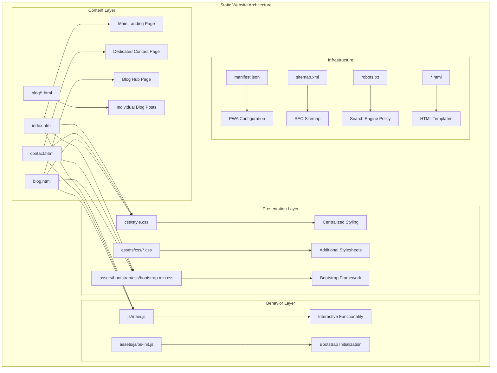
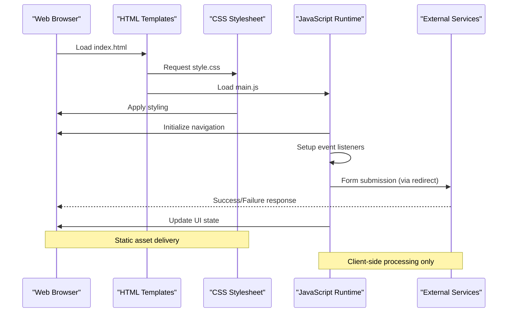
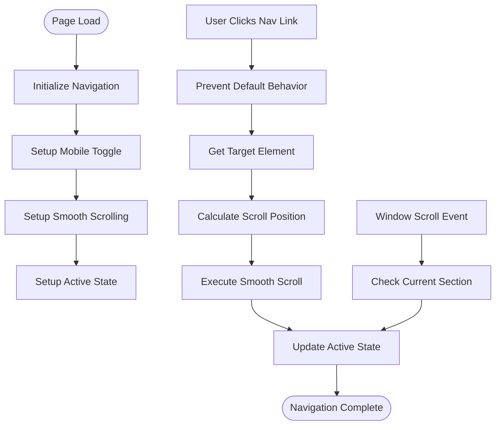
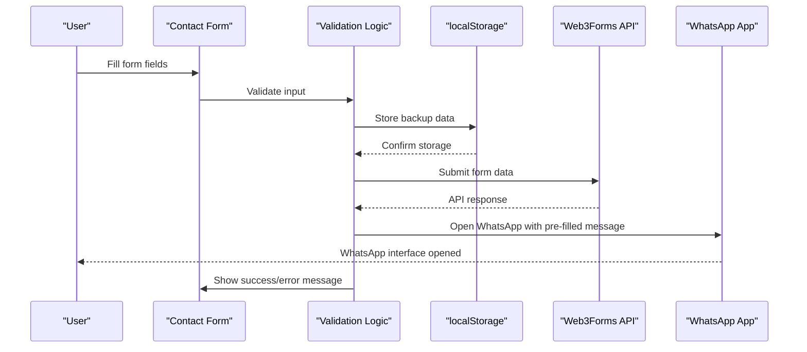
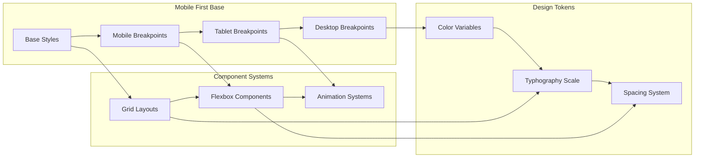
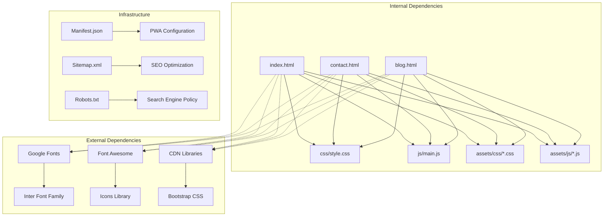

# Technical Architecture Overview

<cite>
**Referenced Files in This Document**
- [index.html](file://index.html)
- [contact.html](file://contact.html)
- [blog.html](file://blog.html)
- [css/style.css](file://css/style.css)
- [js/main.js](file://js/main.js)
- [assets/js/bs-init.js](file://assets/js/bs-init.js)
- [assets/bootstrap/css/bootstrap.min.css](file://assets/bootstrap/css/bootstrap.min.css)
- [manifest.json](file://manifest.json)
- [sitemap.xml](file://sitemap.xml)
- [robots.txt](file://robots.txt)
- [README.md](file://README.md)
</cite>

## Table of Contents
1. [Introduction](#introduction)
2. [Project Structure](#project-structure)
3. [Core Components](#core-components)
4. [Architecture Overview](#architecture-overview)
5. [Detailed Component Analysis](#detailed-component-analysis)
6. [Dependency Analysis](#dependency-analysis)
7. [Performance Considerations](#performance-considerations)
8. [Troubleshooting Guide](#troubleshooting-guide)
9. [Conclusion](#conclusion)

## Introduction

Michael | Inglês Executivo is a pure static website implementation built with HTML5, CSS3, and vanilla JavaScript. This architecture eliminates backend dependencies while maintaining modern web standards and responsive design capabilities. The site serves as a professional marketing platform for English language instruction services targeting Brazilian professionals, featuring bilingual content (Portuguese/English) with a focus on mobile-first responsive design and seamless user experience.

The architecture follows a component-based structure where each major page represents a distinct functional module with shared styling and interactive capabilities. The implementation emphasizes performance, accessibility, and cross-browser compatibility while leveraging modern web technologies without external framework dependencies.

## Project Structure

The static website follows a clean, modular file organization that separates concerns across content, presentation, and behavior layers:

**Diagram sources**
- [index.html:1-522](file://index.html#L1-L522)
- [contact.html:1-291](file://contact.html#L1-L291)
- [css/style.css:1-800](file://css/style.css#L1-L800)
- [js/main.js:1-338](file://js/main.js#L1-L338)

The architecture employs a component-based approach where each HTML file represents a distinct page component with shared styling and interactive capabilities. The separation ensures maintainability while keeping the implementation lightweight and fast-loading.

**Section sources**
- [README.md:11-22](file://README.md#L11-L22)
- [index.html:1-522](file://index.html#L1-L522)
- [contact.html:1-291](file://contact.html#L1-L291)

## Core Components

### Main Landing Page (index.html)
The primary entry point implements a comprehensive single-page application approach with smooth scrolling navigation and section-based content organization. The page structure follows a modern, mobile-first design philosophy with semantic HTML5 markup and accessibility features.

Key architectural elements include:
- **Header Navigation**: Sticky navigation with mobile hamburger menu and smooth scrolling
- **Hero Section**: Value proposition with call-to-action buttons and animated cards
- **Service Sections**: Modular service presentations with feature highlights
- **Testimonial System**: Customer feedback with rating displays
- **Pricing Structure**: Tiered pricing with promotional badges
- **Footer Integration**: Consistent branding and navigation across all pages

### Contact Page (contact.html)
Dedicated contact interface featuring comprehensive form handling, validation, and integration with external services. The page implements a dual-contact strategy combining traditional form submission with instant WhatsApp integration.

### Centralized Styling (css/style.css)
Single stylesheet containing all visual styling with modern CSS3 features including CSS Grid, Flexbox, custom properties, and responsive design patterns. The stylesheet implements a comprehensive design system with color variables, typography scales, and component-specific styling.

### Interactive Functionality (js/main.js)
Vanilla JavaScript implementation providing essential interactive features without external dependencies. The script handles navigation, form validation, smooth scrolling, and dynamic content enhancement.

**Section sources**
- [index.html:24-522](file://index.html#L24-L522)
- [contact.html:20-291](file://contact.html#L20-L291)
- [css/style.css:1-800](file://css/style.css#L1-L800)
- [js/main.js:1-338](file://js/main.js#L1-L338)

## Architecture Overview

The static website architecture implements a pure client-side solution with the following key architectural patterns:

**Diagram sources**
- [index.html:19](file://index.html#L19)
- [contact.html:15](file://contact.html#L15)
- [js/main.js:112-171](file://js/main.js#L112-L171)

The architecture leverages modern web standards while maintaining simplicity and performance. All processing occurs client-side, eliminating server-side dependencies and reducing operational complexity.

### Architectural Patterns

The implementation employs several key architectural patterns:

**Single-Page Application Pattern**: Despite being static, the site uses smooth scrolling navigation and dynamic content updates to provide SPA-like experiences without routing frameworks.

**Component-Based Architecture**: Each major page represents a distinct component with shared styling and behavior patterns, enabling maintainable code organization.

**Mobile-First Responsive Design**: Progressive enhancement ensures optimal performance across all device categories with adaptive layouts and touch-friendly interactions.

**Progressive Enhancement**: Core functionality remains intact even with reduced JavaScript support, ensuring graceful degradation across browsers.

**Modular CSS Architecture**: CSS Grid and Flexbox provide flexible layout systems with consistent spacing and typography scales.

**Event-Driven Interactions**: JavaScript implements event-driven behavior patterns for navigation, form handling, and UI state management.

**Section sources**
- [README.md:67-74](file://README.md#L67-L74)
- [css/style.css:26-28](file://css/style.css#L26-L28)
- [js/main.js:47-62](file://js/main.js#L47-L62)

## Detailed Component Analysis

### Navigation System Architecture

The navigation system implements a sophisticated client-side routing mechanism without external dependencies:

**Diagram sources**
- [js/main.js:4-42](file://js/main.js#L4-L42)
- [js/main.js:47-62](file://js/main.js#L47-L62)
- [js/main.js:236-260](file://js/main.js#L236-L260)

The navigation system provides:
- **Responsive Mobile Menu**: Hamburger menu with animated transitions
- **Smooth Scrolling**: CSS `scroll-behavior: smooth` combined with JavaScript fallback
- **Active State Management**: Dynamic highlighting of current section
- **Cross-Page Navigation**: Consistent navigation across all pages

### Form Processing Architecture

The contact form implements a hybrid approach combining client-side validation with external service integration:

**Diagram sources**
- [contact.html:141-204](file://contact.html#L141-L204)
- [js/main.js:112-171](file://js/main.js#L112-L171)

The form processing system includes:
- **Client-Side Validation**: Real-time field validation with visual feedback
- **Data Backup**: Local storage for form submissions as backup
- **External Integration**: Web3Forms API for email notifications
- **WhatsApp Integration**: Direct WhatsApp messaging with formatted content
- **Success/Error States**: Visual feedback for form submission outcomes

### Responsive Design Architecture

The styling system implements a comprehensive responsive design approach:

**Diagram sources**
- [css/style.css:10-24](file://css/style.css#L10-L24)
- [css/style.css:37-41](file://css/style.css#L37-L41)
- [css/style.css:381-464](file://css/style.css#L381-L464)

The responsive architecture provides:
- **Mobile-First Approach**: Base styles optimized for mobile devices
- **Progressive Enhancement**: Additional styles for larger screens
- **Flexible Grid System**: CSS Grid and Flexbox for adaptable layouts
- **Consistent Spacing**: Design tokens for uniform spacing and typography
- **Touch-Friendly Elements**: Appropriate sizing and spacing for mobile interaction

### Performance Optimization Architecture

The architecture implements several performance optimization strategies:

**Asset Delivery Optimization**:
- Single CSS file reduces HTTP requests
- CDN-hosted libraries minimize load times
- Optimized image assets with appropriate sizing
- Minimal JavaScript bundle with essential functionality only

**Runtime Performance**:
- Intersection Observer for scroll animations
- Efficient event delegation patterns
- CSS transforms for smooth animations
- Debounced scroll handlers for performance

**Caching Strategy**:
- Static asset caching through CDN
- Browser caching for CSS and JavaScript
- Service worker registration capability (commented)
- Progressive Web App support through manifest

**Section sources**
- [README.md:177-182](file://README.md#L177-L182)
- [js/main.js:202-231](file://js/main.js#L202-L231)
- [manifest.json:1](file://manifest.json#L1)

## Dependency Analysis

The static website maintains minimal external dependencies while leveraging modern web standards:

**Diagram sources**
- [index.html:19](file://index.html#L19)
- [contact.html:15](file://contact.html#L15)
- [blog.html:22](file://blog.html#L22)

### Internal Dependencies
- **Shared Styles**: All pages reference the central stylesheet
- **Common Scripts**: JavaScript functionality shared across pages
- **Asset Organization**: Consistent asset structure across components
- **Navigation Consistency**: Uniform navigation patterns throughout

### External Dependencies
- **Google Fonts**: Inter font family for typography
- **Font Awesome**: Icon library for visual elements
- **CDN Libraries**: Bootstrap CSS for responsive utilities
- **Web3Forms API**: External form processing service

### Infrastructure Dependencies
- **PWA Manifest**: Progressive Web App configuration
- **SEO Sitemap**: Search engine optimization structure
- **Robots Policy**: Search engine crawling permissions

**Section sources**
- [index.html:20](file://index.html#L20)
- [contact.html:16](file://contact.html#L16)
- [blog.html:23](file://blog.html#L23)
- [manifest.json:1](file://manifest.json#L1)

## Performance Considerations

The static website architecture prioritizes performance through several optimization strategies:

### Loading Performance
- **Minimal Dependencies**: Only essential external resources loaded
- **CDN Delivery**: Third-party libraries served via Content Delivery Networks
- **Single CSS Bundle**: Reduced HTTP requests through consolidated styling
- **Efficient JavaScript**: Lightweight implementation with essential functionality

### Runtime Performance
- **Intersection Observer**: Modern API for scroll-based animations
- **Event Delegation**: Efficient event handling patterns
- **CSS Transforms**: Hardware-accelerated animations
- **Debounced Handlers**: Optimized scroll and resize event handling

### Caching Strategy
- **Static Asset Caching**: Long-term caching for CSS, JavaScript, and images
- **Browser Caching**: Proper cache headers for improved load times
- **Service Worker Capability**: Built-in support for offline functionality
- **Progressive Enhancement**: Graceful degradation when features unavailable

### Mobile Performance
- **Responsive Images**: Optimized image delivery for different screen sizes
- **Touch-Friendly Elements**: Appropriate sizing for mobile interaction
- **Reduced JavaScript**: Minimal client-side processing on mobile devices
- **Fast Initial Paint**: Optimized first rendering for mobile users

**Section sources**
- [README.md:170-182](file://README.md#L170-L182)
- [js/main.js:202-231](file://js/main.js#L202-L231)

## Troubleshooting Guide

### Common Issues and Solutions

**Navigation Not Working**
- Verify JavaScript is enabled in the browser
- Check console for JavaScript errors
- Ensure `js/main.js` loads successfully
- Validate CSS class names match HTML structure

**Form Submission Failures**
- Check browser console for network errors
- Verify Web3Forms API key configuration
- Test form validation locally before deployment
- Ensure proper CORS configuration for external APIs

**Responsive Design Issues**
- Test on various screen sizes and devices
- Verify viewport meta tag is present
- Check CSS media queries for proper breakpoints
- Validate touch interaction elements sizing

**Performance Problems**
- Monitor page load times in browser developer tools
- Check for excessive HTTP requests
- Validate CSS and JavaScript minification
- Test with disabled JavaScript to ensure graceful degradation

### Debugging Tools and Techniques

**Browser Developer Tools**
- Network tab for resource loading analysis
- Console tab for JavaScript error identification
- Performance tab for runtime profiling
- Elements tab for CSS and HTML inspection

**Testing Strategies**
- Cross-browser testing across major browsers
- Mobile device testing on various platforms
- Accessibility testing with screen readers
- Performance testing with real-world scenarios

**Section sources**
- [js/main.js:328-331](file://js/main.js#L328-L331)
- [README.md:327-334](file://README.md#L327-L334)

## Conclusion

The Michael | Inglês Executivo static website architecture demonstrates a mature approach to modern web development without backend dependencies. The implementation successfully balances functionality, performance, and maintainability through careful architectural decisions and modern web standards.

Key strengths of the architecture include:
- **Pure Static Implementation**: Eliminates server-side complexity and operational overhead
- **Modern Web Standards**: Leverages contemporary CSS Grid, Flexbox, and JavaScript features
- **Mobile-First Design**: Comprehensive responsive design covering all device categories
- **Performance Optimization**: Careful attention to loading times and runtime efficiency
- **Accessibility Compliance**: Semantic HTML and ARIA attributes for inclusive design
- **Progressive Enhancement**: Graceful degradation ensuring functionality across browsers

The component-based structure enables easy maintenance and future enhancements while the centralized styling and JavaScript provide consistent behavior across all pages. The architecture successfully meets the requirements for a professional marketing website while maintaining simplicity and reliability.

Future enhancements could include implementing the commented service worker functionality for offline support, adding structured data for improved SEO, and potentially integrating additional third-party services as business requirements evolve.