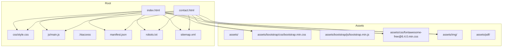
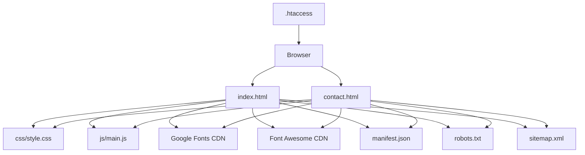
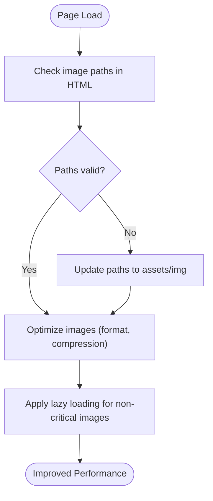
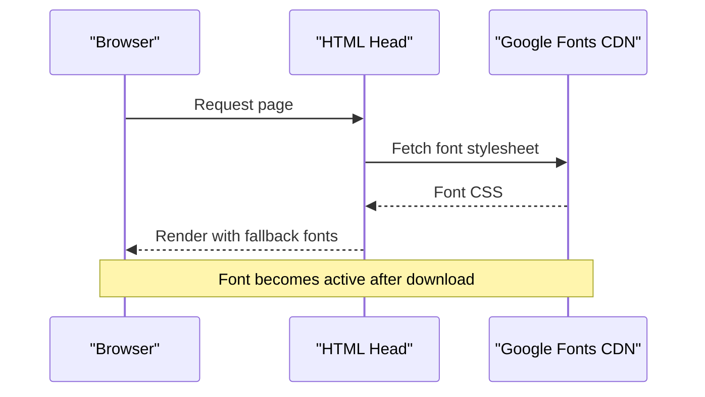
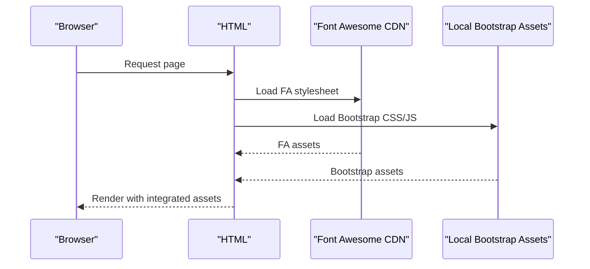
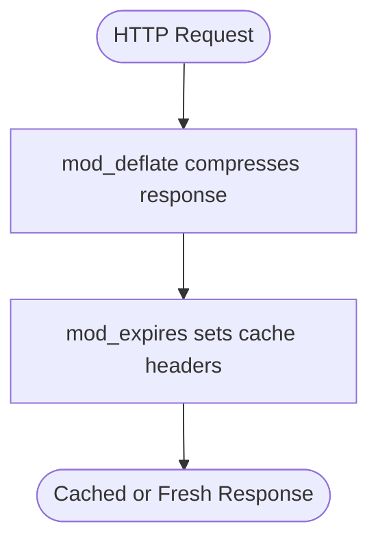
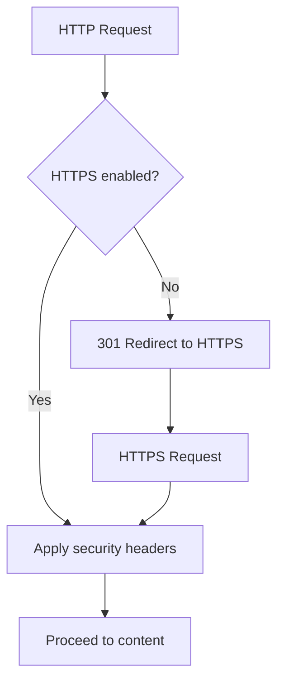
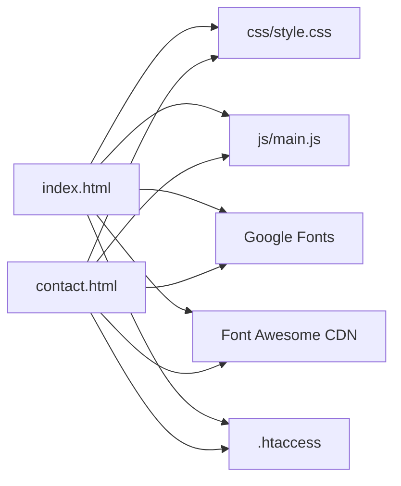

# Asset Management

<cite>
**Referenced Files in This Document**
- [.htaccess](file://.htaccess)
- [README.md](file://README.md)
- [index.html](file://index.html)
- [contact.html](file://contact.html)
- [css/style.css](file://css/style.css)
- [js/main.js](file://js/main.js)
- [manifest.json](file://manifest.json)
- [robots.txt](file://robots.txt)
- [sitemap.xml](file://sitemap.xml)
</cite>

## Table of Contents
1. [Introduction](#introduction)
2. [Project Structure](#project-structure)
3. [Core Components](#core-components)
4. [Architecture Overview](#architecture-overview)
5. [Detailed Component Analysis](#detailed-component-analysis)
6. [Dependency Analysis](#dependency-analysis)
7. [Performance Considerations](#performance-considerations)
8. [Troubleshooting Guide](#troubleshooting-guide)
9. [Conclusion](#conclusion)
10. [Appendices](#appendices)

## Introduction
This document describes the asset management system for the website, focusing on how images, fonts, and media are organized and delivered, how CDN resources are integrated, and how performance and security are optimized. It also covers versioning, cache busting, fallback strategies for external resources, and operational maintenance practices to keep assets up to date and secure.

## Project Structure
The website organizes assets primarily under the repository root with a dedicated assets directory for third-party libraries and static resources. The main HTML pages reference local CSS and JS as well as CDN-hosted resources for fonts and icons. Additional SEO and PWA-related files are present to support discovery and progressive enhancement.

**Diagram sources**
- [index.html](file://index.html)
- [contact.html](file://contact.html)
- [css/style.css](file://css/style.css)
- [js/main.js](file://js/main.js)
- [.htaccess](file://.htaccess)
- [manifest.json](file://manifest.json)
- [robots.txt](file://robots.txt)
- [sitemap.xml](file://sitemap.xml)

**Section sources**
- [README.md](file://README.md)
- [index.html](file://index.html)
- [contact.html](file://contact.html)

## Core Components
- Local CSS and JS: The pages load local styles and scripts for layout, interactions, and animations.
- CDN resources: Fonts and icons are loaded from CDNs to reduce hosting overhead and leverage global distribution.
- Static assets: Images and PDFs are placed under assets/img and assets/pdf respectively for centralized management.
- PWA and SEO: Manifest, robots, and sitemap files support installability and search engine visibility.

Key asset references:
- Fonts: Google Fonts via a stylesheet link.
- Icons: Font Awesome via a CDN stylesheet.
- Local styles and scripts: Linked from the css and js directories.
- PWA icons: Referenced in the manifest pointing to assets/img.

**Section sources**
- [index.html](file://index.html)
- [contact.html](file://contact.html)
- [css/style.css](file://css/style.css)
- [js/main.js](file://js/main.js)
- [manifest.json](file://manifest.json)

## Architecture Overview
The asset delivery architecture combines local hosting for core styles and scripts with CDN-hosted fonts and icons. The .htaccess file configures compression, caching, security headers, and HTTPS enforcement. The manifest and sitemap files support modern web capabilities and SEO.

**Diagram sources**
- [index.html](file://index.html)
- [contact.html](file://contact.html)
- [css/style.css](file://css/style.css)
- [js/main.js](file://js/main.js)
- [.htaccess](file://.htaccess)
- [manifest.json](file://manifest.json)
- [robots.txt](file://robots.txt)
- [sitemap.xml](file://sitemap.xml)

## Detailed Component Analysis

### Image Handling and Organization
- Directory placement: Images are intended to reside under assets/img. While the project structure indicates empty directories, the HTML references assets/img for favicons and Apple touch icons.
- Reference pattern: The favicon and Apple touch icon links use relative paths under assets/img.
- Recommendations:
  - Place actual images in assets/img and ensure paths match the HTML references.
  - Use appropriate image formats (e.g., WebP or AVIF where supported) and compress assets for faster delivery.
  - Implement lazy loading for non-critical images to improve initial page load performance.

**Section sources**
- [index.html](file://index.html)
- [contact.html](file://contact.html)

### Font Loading Strategies (Google Fonts)
- Integration: Fonts are loaded via a Google Fonts stylesheet link in the HTML head.
- Optimization:
  - Use font-display: swap to prevent invisible text during font fetch.
  - Subset fonts to include only required character sets.
  - Prefer WOFF2 with fallbacks for broad compatibility.
  - Consider self-hosting critical font variants to minimize external requests.

**Section sources**
- [index.html](file://index.html)
- [contact.html](file://contact.html)

### CDN Resource Integration (Bootstrap and Font Awesome)
- Bootstrap: The HTML references local Bootstrap CSS and JS under assets/bootstrap. Ensure these files are present and up to date.
- Font Awesome: Loaded from a CDN stylesheet in the HTML head.
- Best practices:
  - Pin versions in filenames or use subresource integrity (SRI) for critical libraries.
  - Mirror frequently used libraries to your origin for reduced latency and improved reliability.
  - Monitor CDN health and maintain fallbacks to local copies.

**Section sources**
- [index.html](file://index.html)
- [contact.html](file://contact.html)

### Performance Optimization: GZIP Compression and Browser Caching
- GZIP Compression: Enabled via mod_deflate in .htaccess for HTML, text, CSS, JavaScript, and JSON.
- Browser Caching: Set via mod_expires for images, CSS, JavaScript, and HTML with long expiration periods.
- Impact: Reduced payload sizes and leveraged cached assets for repeat visits.

**Section sources**
- [.htaccess](file://.htaccess)

### Security Headers and HTTPS Enforcement
- Security headers: X-Content-Type-Options, X-Frame-Options, X-XSS-Protection, Referrer-Policy, Permissions-Policy.
- HTTPS enforcement: mod_rewrite redirects HTTP to HTTPS.
- Benefits: Improved protection against common attacks and ensures encrypted transport.

**Section sources**
- [.htaccess](file://.htaccess)

### Asset Delivery Strategies and Bandwidth Optimization
- CDN offloading: Font Awesome and Google Fonts reduce origin bandwidth.
- Local hosting: Bootstrap and custom CSS/JS minimize external dependencies.
- Compression and caching: Reduce bandwidth usage and latency.
- Recommendations:
  - Use a CDN for static assets to improve global delivery.
  - Implement versioned filenames or content hashing for cache busting.
  - Employ preloading for critical fonts and above-the-fold resources.

**Section sources**
- [index.html](file://index.html)
- [contact.html](file://contact.html)
- [.htaccess](file://.htaccess)

### Version Management and Cache Busting
- Current state: No explicit cache busting is implemented in the HTML references shown.
- Recommended approaches:
  - Append query string version or hash (e.g., ?v=1.0.0 or ?cb=h123) to CSS/JS links.
  - Rename files with content hashes (e.g., style.a1b2c3.css) and update references accordingly.
  - Automate via build tooling to ensure consistency across deployments.

**Section sources**
- [css/style.css](file://css/style.css)
- [js/main.js](file://js/main.js)

### Fallback Mechanisms for External Resources
- Strategy:
  - Self-host critical libraries (e.g., Bootstrap) to avoid CDN outages.
  - Use feature detection and degrade gracefully if external resources fail.
  - Maintain local fallbacks for fonts/icons to ensure readability and usability.

**Section sources**
- [index.html](file://index.html)
- [contact.html](file://contact.html)

### Practical Examples of Asset Linking Patterns
- Fonts: Link to Google Fonts stylesheet in the HTML head.
- Icons: Link to Font Awesome stylesheet from a CDN.
- Local assets: Reference css/style.css and js/main.js from the respective directories.
- PWA icons: Reference PNG icons from assets/img in the manifest.

**Section sources**
- [index.html](file://index.html)
- [contact.html](file://contact.html)
- [manifest.json](file://manifest.json)

## Dependency Analysis
The pages depend on local styles and scripts, while fonts and icons rely on external CDNs. The .htaccess file centralizes performance and security policies applied to all requests.

**Diagram sources**
- [index.html](file://index.html)
- [contact.html](file://contact.html)
- [css/style.css](file://css/style.css)
- [js/main.js](file://js/main.js)
- [.htaccess](file://.htaccess)

**Section sources**
- [index.html](file://index.html)
- [contact.html](file://contact.html)
- [.htaccess](file://.htaccess)

## Performance Considerations
- Minimize round trips: Combine and minify CSS/JS where feasible.
- Prioritize above-the-fold content: Preload critical fonts and assets.
- Optimize images: Use modern formats, compression, and lazy loading.
- Monitor metrics: Track TTFB, LCP, and CLS to guide further improvements.

[No sources needed since this section provides general guidance]

## Troubleshooting Guide
- Fonts not rendering:
  - Verify the Google Fonts stylesheet link is reachable.
  - Confirm network connectivity and CORS policies if loading from a different origin.
- Icons missing:
  - Ensure the Font Awesome stylesheet link is valid.
  - Check for ad blockers interfering with the CDN.
- Assets not loading:
  - Confirm file paths under assets/img and assets/pdf match HTML references.
  - Validate server permissions and MIME types.
- HTTPS and security headers:
  - Ensure SSL termination is configured and .htaccess directives apply.
  - Verify redirects from HTTP to HTTPS are functioning.

**Section sources**
- [index.html](file://index.html)
- [contact.html](file://contact.html)
- [.htaccess](file://.htaccess)

## Conclusion
The asset management system leverages a hybrid model: local hosting for core functionality and CDN-hosted fonts and icons for scalability and performance. The .htaccess configuration enforces security and optimizes delivery through compression and caching. By implementing robust versioning, cache busting, and fallback strategies, the site can maintain fast, reliable, and secure asset delivery across diverse environments.

[No sources needed since this section summarizes without analyzing specific files]

## Appendices

### Asset Directory Structure
- assets/
  - bootstrap/: Local Bootstrap CSS/JS
  - css/: Font Awesome CSS (CDN link in HTML)
  - img/: Images and icons (placeholder directories)
  - js/: Local Bootstrap JS (CDN link in HTML)
  - pdf/: PDF documents (placeholder directory)
- Root-level assets:
  - css/style.css: Local styles
  - js/main.js: Local scripts
  - manifest.json: PWA icons and metadata
  - robots.txt: Search engine directives
  - sitemap.xml: XML sitemap for SEO

**Section sources**
- [README.md](file://README.md)
- [index.html](file://index.html)
- [contact.html](file://contact.html)
- [manifest.json](file://manifest.json)
- [robots.txt](file://robots.txt)
- [sitemap.xml](file://sitemap.xml)