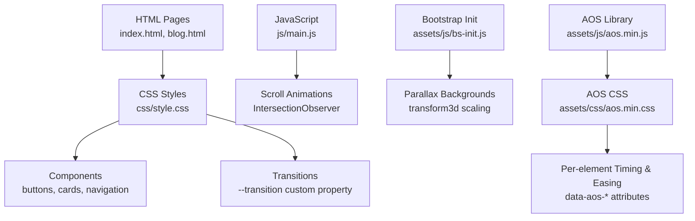
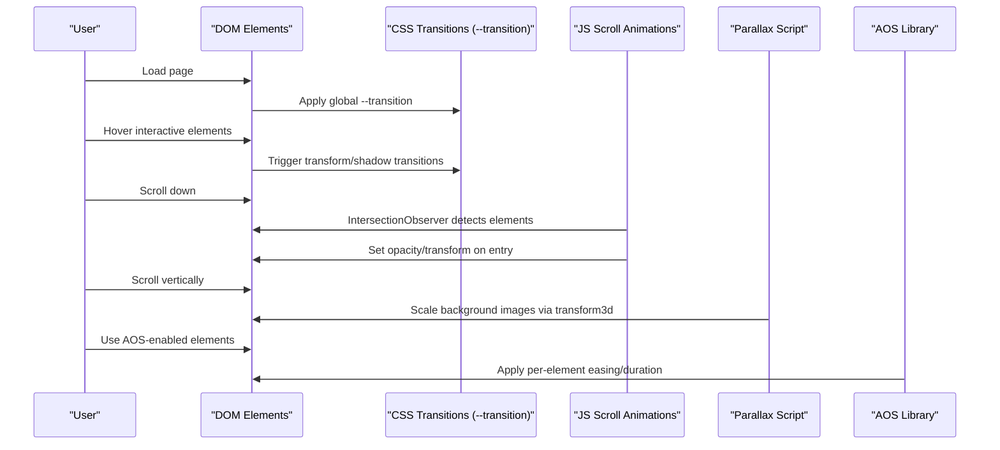
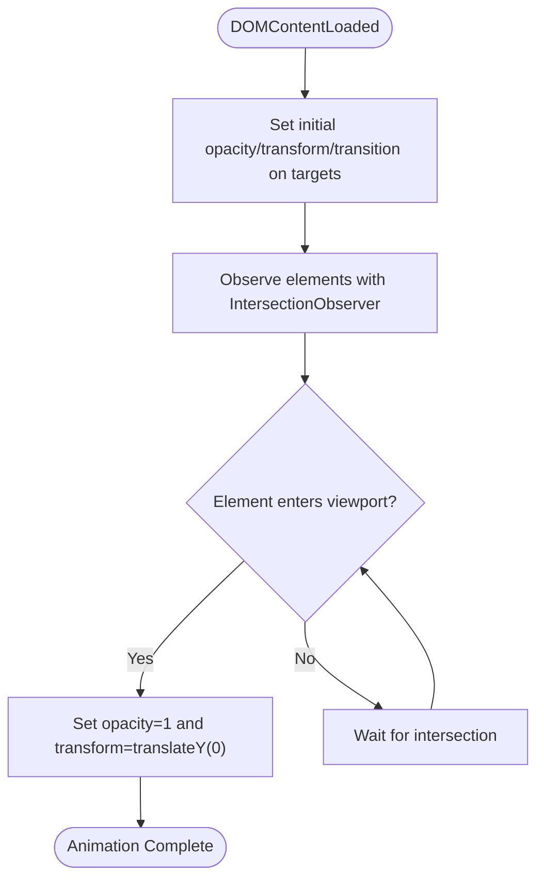
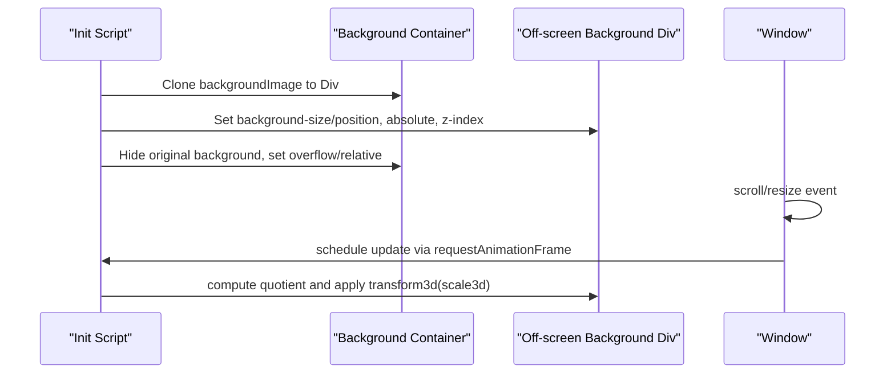
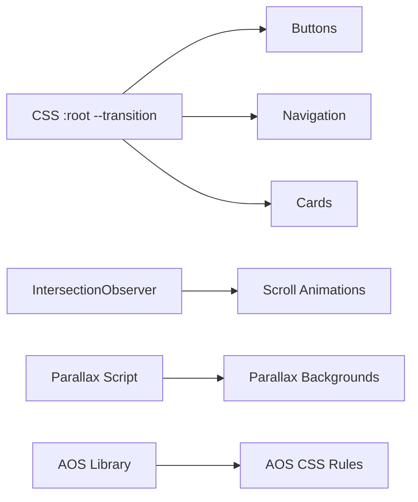

# Animation & Transition Effects

<cite>
**Referenced Files in This Document**
- [style.css](file://css/style.css)
- [main.js](file://js/main.js)
- [bs-init.js](file://assets/js/bs-init.js)
- [aos.min.css](file://assets/css/aos.min.css)
- [index.html](file://index.html)
- [blog.html](file://blog.html)
</cite>

## Table of Contents
1. [Introduction](#introduction)
2. [Project Structure](#project-structure)
3. [Core Components](#core-components)
4. [Architecture Overview](#architecture-overview)
5. [Detailed Component Analysis](#detailed-component-analysis)
6. [Dependency Analysis](#dependency-analysis)
7. [Performance Considerations](#performance-considerations)
8. [Troubleshooting Guide](#troubleshooting-guide)
9. [Conclusion](#conclusion)
10. [Appendices](#appendices)

## Introduction
This document explains the animation and transition effects implemented across the project. It focuses on:
- The CSS transition system using the --transition custom property for consistent animation timing
- Transform effects (translateY, scale, rotate) for interactive elements
- Hover states and interactive feedback for buttons, cards, and navigation items
- Entrance animations, fade effects, and parallax scrolling implementations
- Performance optimization through transform3d and will-change
- Animation timing functions, duration controls, and easing patterns
- Accessibility considerations for motion sensitivity and reduced motion preferences
- Troubleshooting common animation performance issues and browser compatibility strategies

## Project Structure
The animation system is primarily implemented via:
- Global CSS transitions using a shared custom property
- Component-specific transforms and hover states
- JavaScript-driven scroll animations and parallax effects
- Optional AOS (Animate On Scroll) integration

**Diagram sources**
- [style.css:10-24](file://css/style.css#L10-L24)
- [style.css:236-279](file://css/style.css#L236-L279)
- [style.css:387-401](file://css/style.css#L387-L401)
- [main.js:202-231](file://js/main.js#L202-L231)
- [bs-init.js:23-96](file://assets/js/bs-init.js#L23-L96)
- [aos.min.css:1-800](file://assets/css/aos.min.css#L1-L800)

**Section sources**
- [style.css:10-24](file://css/style.css#L10-L24)
- [index.html:19](file://index.html#L19)
- [blog.html:22](file://blog.html#L22)

## Core Components
- Global transition system: The :root defines --transition to unify timing and easing across interactive elements.
- Interactive feedback: Buttons, cards, and navigation links use transform and shadow transitions for hover states.
- Scroll-triggered animations: IntersectionObserver sets opacity and transform on elements as they enter the viewport.
- Parallax backgrounds: A custom script scales background images based on scroll position using transform3d.
- Optional AOS integration: AOS CSS provides per-element timing and easing via data attributes.

Key implementation references:
- Global transition definition: [style.css:23](file://css/style.css#L23)
- Button hover transforms: [style.css:255-269](file://css/style.css#L255-L269)
- Card hover transforms: [style.css:397-401](file://css/style.css#L397-L401)
- Scroll animation initialization: [main.js:202-231](file://js/main.js#L202-L231)
- Parallax background script: [bs-init.js:23-96](file://assets/js/bs-init.js#L23-L96)
- AOS easing and duration rules: [aos.min.css:723-800](file://assets/css/aos.min.css#L723-L800)

**Section sources**
- [style.css:23](file://css/style.css#L23)
- [style.css:255-269](file://css/style.css#L255-L269)
- [style.css:397-401](file://css/style.css#L397-L401)
- [main.js:202-231](file://js/main.js#L202-L231)
- [bs-init.js:23-96](file://assets/js/bs-init.js#L23-L96)
- [aos.min.css:723-800](file://assets/css/aos.min.css#L723-L800)

## Architecture Overview
The animation pipeline combines CSS custom properties, component-level transforms, and JavaScript-driven triggers.

**Diagram sources**
- [style.css:23](file://css/style.css#L23)
- [main.js:202-231](file://js/main.js#L202-L231)
- [bs-init.js:23-96](file://assets/js/bs-init.js#L23-L96)
- [aos.min.css:723-800](file://assets/css/aos.min.css#L723-L800)

## Detailed Component Analysis

### CSS Transition System Using --transition
- Purpose: Centralizes transition timing and easing for consistent user experience.
- Implementation: :root defines --transition; components inherit it via transition: var(--transition).
- Benefits: Uniform hover feedback across buttons, cards, navigation, and form inputs.

References:
- [style.css:10-24](file://css/style.css#L10-L24)
- [style.css:87-97](file://css/style.css#L87-L97)
- [style.css:247](file://css/style.css#L247)
- [style.css:1025](file://css/style.css#L1025)

**Section sources**
- [style.css:10-24](file://css/style.css#L10-L24)
- [style.css:87-97](file://css/style.css#L87-L97)
- [style.css:247](file://css/style.css#L247)
- [style.css:1025](file://css/style.css#L1025)

### Transform Effects: translateY, scale, rotate
- translateY:
  - Buttons and cards lift slightly on hover for depth perception.
  - Example: service-card hover applies translateY(-5px) and increased shadow.
- scale:
  - Featured pricing card scales up to draw attention.
  - Example: pricing-card-tier.featured applies scale(1.05) and border highlight.
- rotate:
  - Navigation toggle animates hamburger icon segments into X shape on open.

References:
- [style.css:397-401](file://css/style.css#L397-L401)
- [style.css:1353-1366](file://css/style.css#L1353-L1366)
- [main.js:14-26](file://js/main.js#L14-L26)

**Section sources**
- [style.css:397-401](file://css/style.css#L397-L401)
- [style.css:1353-1366](file://css/style.css#L1353-L1366)
- [main.js:14-26](file://js/main.js#L14-L26)

### Hover States and Interactive Feedback
- Buttons:
  - Primary buttons lift and cast a stronger shadow on hover.
  - WhatsApp buttons adjust background on hover.
- Cards:
  - Service and reason cards lift and increase shadow on hover.
  - Image inside cards scales for zoom effect.
- Navigation:
  - Links animate underline and color change with --transition.
  - CTA button lifts on hover.
- Forms:
  - Inputs focus with border color transition.

References:
- [style.css:255-269](file://css/style.css#L255-L269)
- [style.css:276-278](file://css/style.css#L276-L278)
- [style.css:397-401](file://css/style.css#L397-L401)
- [style.css:528-531](file://css/style.css#L528-L531)
- [style.css:87-97](file://css/style.css#L87-L97)
- [style.css:125-128](file://css/style.css#L125-L128)
- [style.css:1025-1033](file://css/style.css#L1025-L1033)

**Section sources**
- [style.css:255-269](file://css/style.css#L255-L269)
- [style.css:276-278](file://css/style.css#L276-L278)
- [style.css:397-401](file://css/style.css#L397-L401)
- [style.css:528-531](file://css/style.css#L528-L531)
- [style.css:87-97](file://css/style.css#L87-L97)
- [style.css:125-128](file://css/style.css#L125-L128)
- [style.css:1025-1033](file://css/style.css#L1025-L1033)

### Entrance Animations and Fade Effects
- Mechanism: IntersectionObserver watches elements with specific selectors.
- Behavior: On intersection, opacity transitions to 1 and transform to translateY(0).
- Trigger: Called on DOMContentLoaded after setting initial opacity/transform and transition.

**Diagram sources**
- [main.js:202-231](file://js/main.js#L202-L231)

**Section sources**
- [main.js:202-231](file://js/main.js#L202-L231)

### Parallax Scrolling Implementation
- Mechanism: A custom script creates off-screen background divs and scales them based on scroll position.
- Performance: Uses transform3d for GPU-accelerated scaling.
- Behavior: Visible backgrounds are tracked; on scroll/resize, requestAnimationFrame updates transforms.

**Diagram sources**
- [bs-init.js:23-96](file://assets/js/bs-init.js#L23-L96)

**Section sources**
- [bs-init.js:23-96](file://assets/js/bs-init.js#L23-L96)

### Animation Timing Functions, Duration Controls, and Easing Patterns
- Global easing/timing: --transition uses a consistent timing function across components.
- Per-element control (AOS):
  - Duration presets: data-aos-duration values map to transition-duration rules.
  - Easing presets: data-aos-easing values map to transition-timing-function rules.
- Practical usage: AOS attributes on HTML elements control individual timing/easing.

References:
- [style.css:23](file://css/style.css#L23)
- [aos.min.css:1-800](file://assets/css/aos.min.css#L1-L800)

**Section sources**
- [style.css:23](file://css/style.css#L23)
- [aos.min.css:1-800](file://assets/css/aos.min.css#L1-L800)

### Accessibility Considerations for Motion Sensitivity and Reduced Motion Preferences
- Reduced motion strategy:
  - Disable AOS on small screens via data-bss-disabled-mobile removal of AOS attributes.
  - Avoid heavy animations on mobile devices to reduce CPU/GPU load.
- General guidance:
  - Prefer transform-based animations over layout-affecting properties.
  - Keep durations reasonable and easing predictable.
  - Provide alternatives for users who prefer minimal motion.

References:
- [bs-init.js:2-10](file://assets/js/bs-init.js#L2-L10)

**Section sources**
- [bs-init.js:2-10](file://assets/js/bs-init.js#L2-L10)

## Dependency Analysis
- CSS depends on :root --transition for uniformity.
- Components depend on hover and transform rules defined in style.css.
- JavaScript depends on IntersectionObserver for scroll animations.
- Parallax script depends on requestAnimationFrame and element visibility.
- AOS CSS depends on AOS library initialization.

**Diagram sources**
- [style.css:23](file://css/style.css#L23)
- [main.js:202-231](file://js/main.js#L202-L231)
- [bs-init.js:23-96](file://assets/js/bs-init.js#L23-L96)
- [aos.min.css:723-800](file://assets/css/aos.min.css#L723-L800)

**Section sources**
- [style.css:23](file://css/style.css#L23)
- [main.js:202-231](file://js/main.js#L202-L231)
- [bs-init.js:23-96](file://assets/js/bs-init.js#L23-L96)
- [aos.min.css:723-800](file://assets/css/aos.min.css#L723-L800)

## Performance Considerations
- Prefer transform3d and transform for GPU acceleration:
  - Parallax script uses transform3d for smooth scaling.
- Use requestAnimationFrame for scroll-driven updates:
  - Ensures frame-aligned updates and reduces jank.
- Limit expensive properties:
  - Avoid animating layout-affecting properties (width/height) when possible.
- Control animation scope:
  - Disable heavy animations on mobile via data-bss-disabled-mobile.
- Keep transitions short and subtle:
  - Shorter durations improve perceived responsiveness.

[No sources needed since this section provides general guidance]

## Troubleshooting Guide
- Scroll animations not triggering:
  - Verify IntersectionObserver is initialized after DOMContentLoaded.
  - Ensure target elements exist and have the expected selectors.
  - Confirm initial opacity/transform/transition are set before intersection.
- Parallax not working:
  - Check that elements have data-bss-scroll-zoom attributes.
  - Ensure requestAnimationFrame is supported by the browser.
  - Validate background images are present and accessible.
- AOS not applying:
  - Confirm AOS.init() is called and AOS library is loaded.
  - Verify data-aos-* attributes match AOS CSS rules.
- Mobile performance issues:
  - Disable AOS on small screens using data-bss-disabled-mobile.
  - Reduce animation complexity and duration on mobile.

**Section sources**
- [main.js:202-231](file://js/main.js#L202-L231)
- [bs-init.js:2-10](file://assets/js/bs-init.js#L2-L10)
- [bs-init.js:23-96](file://assets/js/bs-init.js#L23-L96)

## Conclusion
The project implements a cohesive animation system centered on a unified --transition custom property, complemented by targeted transform effects, scroll-triggered animations, and parallax backgrounds. Optional AOS integration provides granular control over timing and easing. Performance is prioritized through transform3d, requestAnimationFrame, and mobile-aware disabling of heavy animations. Accessibility is addressed by reducing motion on smaller screens and offering predictable, efficient transitions.

[No sources needed since this section summarizes without analyzing specific files]

## Appendices
- Example HTML pages using animations:
  - [index.html](file://index.html)
  - [blog.html](file://blog.html)

**Section sources**
- [index.html:19](file://index.html#L19)
- [blog.html:22](file://blog.html#L22)