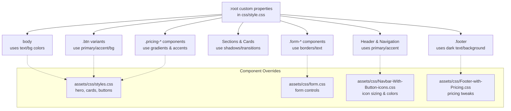
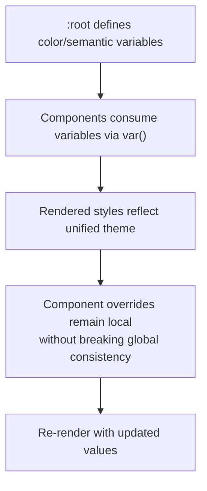
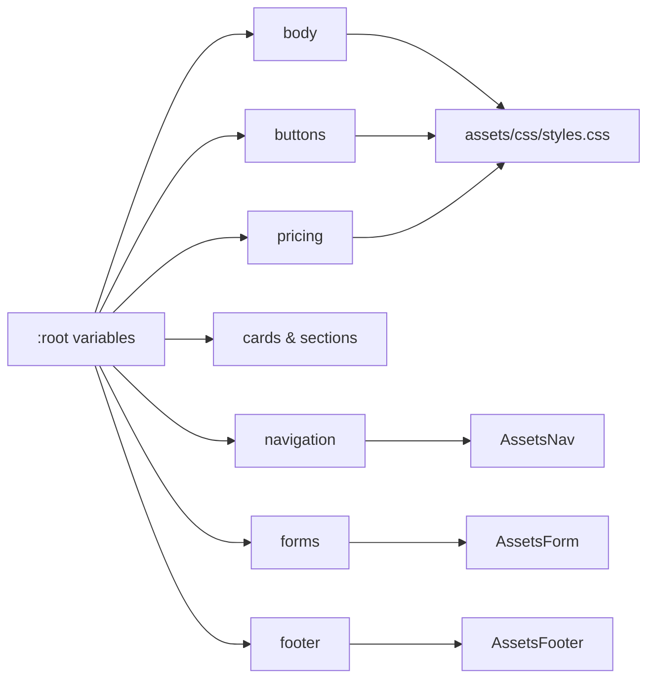

# CSS Custom Properties & Theming

<cite>
**Referenced Files in This Document**
- [css/style.css](file://css/style.css)
- [assets/css/styles.css](file://assets/css/styles.css)
- [assets/css/form.css](file://assets/css/form.css)
- [assets/css/Navbar-With-Button-icons.css](file://assets/css/Navbar-With-Button-icons.css)
- [assets/css/Footer-with-Pricing.css](file://assets/css/Footer-with-Pricing.css)
- [README.md](file://README.md)
</cite>

## Table of Contents
1. [Introduction](#introduction)
2. [Project Structure](#project-structure)
3. [Core Components](#core-components)
4. [Architecture Overview](#architecture-overview)
5. [Detailed Component Analysis](#detailed-component-analysis)
6. [Dependency Analysis](#dependency-analysis)
7. [Performance Considerations](#performance-considerations)
8. [Troubleshooting Guide](#troubleshooting-guide)
9. [Conclusion](#conclusion)
10. [Appendices](#appendices)

## Introduction
This document explains the CSS custom properties and theming system used across the project. It focuses on the color palette defined in :root, the semantic naming convention for variables, and how custom properties enable consistent theming across components. It also covers practical usage patterns, extension strategies, and browser compatibility considerations.

## Project Structure
The theming system is primarily centralized in the main stylesheet with additional component-specific styles that leverage the shared variables.

**Diagram sources**
- [css/style.css:10-24](file://css/style.css#L10-L24)
- [css/style.css:30-35](file://css/style.css#L30-L35)
- [css/style.css:114-128](file://css/style.css#L114-L128)
- [css/style.css:250-269](file://css/style.css#L250-L269)
- [assets/css/styles.css:1-339](file://assets/css/styles.css#L1-L339)
- [assets/css/form.css:1-73](file://assets/css/form.css#L1-L73)
- [assets/css/Navbar-With-Button-icons.css:1-58](file://assets/css/Navbar-With-Button-icons.css#L1-L58)
- [assets/css/Footer-with-Pricing.css:1-10](file://assets/css/Footer-with-Pricing.css#L1-L10)

**Section sources**
- [css/style.css:10-24](file://css/style.css#L10-L24)
- [README.md:11-22](file://README.md#L11-L22)

## Core Components
The theming system centers around a set of custom properties declared in :root. These variables define:
- Primary colors: base and dark variants
- Secondary colors: base and dark variants
- Accent color: orange for highlights and CTAs
- Text and background palettes: dark/light text, light background, white background
- Borders and shadows: consistent border color and shadow values
- Transitions: standardized transition timing

These variables are consumed throughout the stylesheet to ensure consistent theming across components.

Practical usage examples across the codebase:
- Body and typography use text and background variables for consistent contrast and readability.
- Navigation and CTA buttons use primary and accent colors for brand alignment.
- Cards, sections, and pricing tiers use shadows and transitions for consistent motion.
- Forms use border and text variables for coherent focus states and labels.
- Footer uses dark text on dark backgrounds for accessibility.

**Section sources**
- [css/style.css:10-24](file://css/style.css#L10-L24)
- [css/style.css:30-35](file://css/style.css#L30-L35)
- [css/style.css:114-128](file://css/style.css#L114-L128)
- [css/style.css:250-269](file://css/style.css#L250-L269)
- [assets/css/styles.css:113-115](file://assets/css/styles.css#L113-L115)
- [assets/css/form.css:55-59](file://assets/css/form.css#L55-L59)

## Architecture Overview
The theming architecture follows a unidirectional data flow:
- Central definition in :root
- Consumption via var(--variable-name) in component styles
- Optional component-level overrides for specific contexts

[No sources needed since this diagram shows conceptual workflow, not actual code structure]

## Detailed Component Analysis

### Color Palette and Semantic Variables
The :root palette establishes a cohesive brand identity:
- Primary colors: base and dark variants for branding and CTAs
- Secondary colors: base and dark variants for supportive actions and accents
- Accent color: orange for highlights and call-to-action emphasis
- Neutral tones: text-dark, text-light, bg-light, bg-white, border-color
- Motion and effects: shadow, shadow-hover, transition

Semantic naming convention:
- --text-dark/--text-light: typography and content text
- --bg-light/--bg-white: backgrounds and surfaces
- --border-color: borders and dividers
- --shadow/--shadow-hover: elevation and depth cues
- --transition: motion timing for interactive elements

These names clearly communicate intent, enabling easy maintenance and predictable usage across components.

**Section sources**
- [css/style.css:10-24](file://css/style.css#L10-L24)

### Practical Variable Usage Across Stylesheets
- Body and typography: body uses text-dark and bg-white for readability and contrast.
- Navigation: brand text and hover states use primary color; CTA buttons use primary color with dark variant on hover.
- Buttons: primary and secondary variants consistently use accent and primary colors respectively.
- Cards and sections: shadows and transitions unify motion across interactive elements.
- Forms: focus states and borders use primary color and border-color for coherent feedback.
- Pricing: gradients and accents use primary and accent colors for visual hierarchy.
- Footer: dark text on dark background ensures readability and brand continuity.

Examples of variable consumption:
- Body text and backgrounds: [css/style.css:30-35](file://css/style.css#L30-L35)
- Navigation links and CTA: [css/style.css:114-128](file://css/style.css#L114-L128)
- Button variants: [css/style.css:250-269](file://css/style.css#L250-L269)
- Card shadows and transitions: [css/style.css:397-401](file://css/style.css#L397-L401)
- Form focus and borders: [css/style.css:1027-1033](file://css/style.css#L1027-L1033)
- Pricing gradients and accents: [css/style.css:629-631](file://css/style.css#L629-L631), [css/style.css:1373](file://css/style.css#L1373)
- Footer text and background: [css/style.css:1135-1138](file://css/style.css#L1135-L1138)

**Section sources**
- [css/style.css:30-35](file://css/style.css#L30-L35)
- [css/style.css:114-128](file://css/style.css#L114-L128)
- [css/style.css:250-269](file://css/style.css#L250-L269)
- [css/style.css:397-401](file://css/style.css#L397-L401)
- [css/style.css:1027-1033](file://css/style.css#L1027-L1033)
- [css/style.css:629-631](file://css/style.css#L629-L631)
- [css/style.css:1373](file://css/style.css#L1373)
- [css/style.css:1135-1138](file://css/style.css#L1135-L1138)

### Component-Specific Theming Patterns
- Hero and section headers: gradients and accents use primary and accent variables for visual impact.
- Pricing tiers: featured tier uses accent color for prominence; hover states maintain consistent transitions.
- Form controls: focus outlines and placeholder colors use primary and neutral variables for accessible feedback.
- Navigation icons: icon sizing and colors adapt to theme via --bs-icon-size and --bs-primary.

Examples:
- Hero gradient and accent usage: [css/style.css:149-172](file://css/style.css#L149-L172)
- Pricing tier accents: [css/style.css:1358-1362](file://css/style.css#L1358-L1362)
- Form focus and placeholder: [assets/css/form.css:55-59](file://assets/css/form.css#L55-L59), [assets/css/form.css:50-53](file://assets/css/form.css#L50-L53)
- Navigation icon sizing and colors: [assets/css/Navbar-With-Button-icons.css:1-11](file://assets/css/Navbar-With-Button-icons.css#L1-L11)

**Section sources**
- [css/style.css:149-172](file://css/style.css#L149-L172)
- [css/style.css:1358-1362](file://css/style.css#L1358-L1362)
- [assets/css/form.css:55-59](file://assets/css/form.css#L55-L59)
- [assets/css/form.css:50-53](file://assets/css/form.css#L50-L53)
- [assets/css/Navbar-With-Button-icons.css:1-11](file://assets/css/Navbar-With-Button-icons.css#L1-L11)

### Extending the Theme System
To add new color variations while maintaining consistency:
- Define new variables in :root with semantic names (e.g., --success-color, --warning-color).
- Use these variables in components to ensure uniform application.
- Keep overrides minimal and localized to specific components to avoid breaking global consistency.

Example extension points:
- Additional semantic colors for status indicators or alerts.
- Extended shade variants for primary/secondary/accent families.
- New motion variables for component-specific transitions.

[No sources needed since this section provides general guidance]

### Browser Compatibility and Fallback Strategies
- Custom properties are widely supported in modern browsers. For older browsers, consider providing fallback declarations before var() usage or using a build tool to polyfill.
- When using Bootstrap utilities that rely on --bs-* variables, ensure the Bootstrap CSS is included so those variables resolve to meaningful values.

[No sources needed since this section provides general guidance]

## Dependency Analysis
The theming system exhibits low coupling and high cohesion:
- Centralized definition in :root reduces duplication and improves maintainability.
- Components depend on semantic variable names rather than hardcoded values, enabling easy theme swaps.
- Component-specific styles can override selectively without affecting global consistency.

**Diagram sources**
- [css/style.css:10-24](file://css/style.css#L10-L24)
- [assets/css/styles.css:1-339](file://assets/css/styles.css#L1-L339)
- [assets/css/form.css:1-73](file://assets/css/form.css#L1-L73)
- [assets/css/Navbar-With-Button-icons.css:1-58](file://assets/css/Navbar-With-Button-icons.css#L1-L58)
- [assets/css/Footer-with-Pricing.css:1-10](file://assets/css/Footer-with-Pricing.css#L1-L10)

**Section sources**
- [css/style.css:10-24](file://css/style.css#L10-L24)

## Performance Considerations
- Using custom properties centralizes color definitions, reducing CSS size and improving maintainability.
- Avoid excessive redefinition of variables; reuse existing semantic names to minimize cascade complexity.
- Keep component overrides minimal to prevent unnecessary repaints and reflows.

[No sources needed since this section provides general guidance]

## Troubleshooting Guide
Common issues and resolutions:
- Variables not applying: Verify the variable is defined in :root and used with var(--variable-name).
- Inconsistent colors across components: Ensure components consume the intended semantic variables rather than hardcoding values.
- Hover/focus states not reflecting theme: Confirm that hover/focus selectors use the same variables as base states.
- Bootstrap conflicts: When using Bootstrap utilities that rely on --bs-* variables, ensure Bootstrap CSS is loaded so those variables resolve.

[No sources needed since this section provides general guidance]

## Conclusion
The CSS custom properties and theming system deliver a consistent, maintainable, and extensible design foundation. By defining a clear palette and semantic variable names in :root, the project achieves theme consistency across components while enabling easy modifications and future extensions.

[No sources needed since this section summarizes without analyzing specific files]

## Appendices

### Appendix A: Variable Reference
- Primary colors: --primary-color, --primary-dark
- Secondary colors: --secondary-color, --secondary-dark
- Accent color: --accent-color
- Text and backgrounds: --text-dark, --text-light, --bg-light, --bg-white
- Borders and effects: --border-color, --shadow, --shadow-hover, --transition

**Section sources**
- [css/style.css:10-24](file://css/style.css#L10-L24)