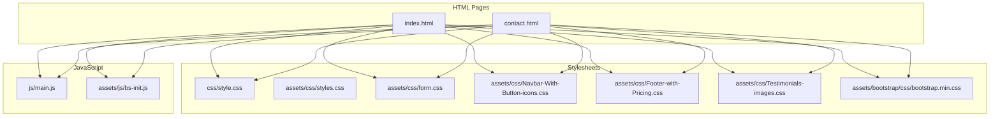
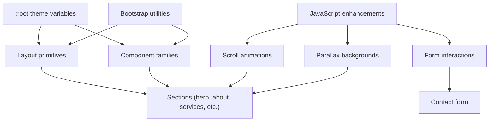
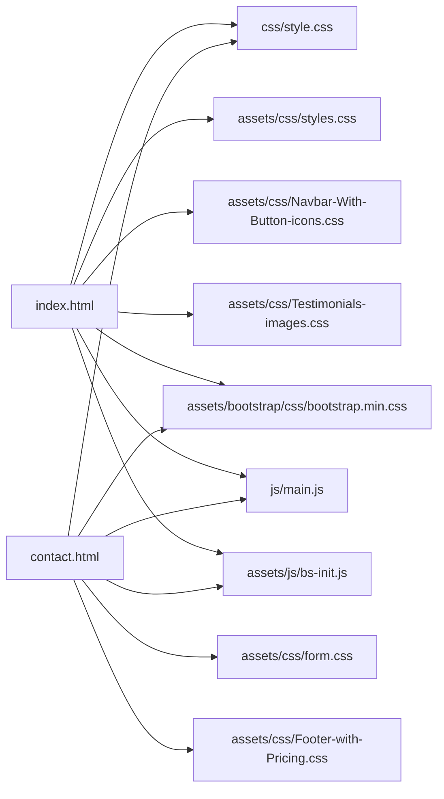

# CSS Design System

<cite>
**Referenced Files in This Document**
- [index.html](file://index.html)
- [contact.html](file://contact.html)
- [README.md](file://README.md)
- [css/style.css](file://css/style.css)
- [assets/css/styles.css](file://assets/css/styles.css)
- [assets/css/form.css](file://assets/css/form.css)
- [assets/css/Navbar-With-Button-icons.css](file://assets/css/Navbar-With-Button-icons.css)
- [assets/css/Footer-with-Pricing.css](file://assets/css/Footer-with-Pricing.css)
- [assets/css/Testimonials-images.css](file://assets/css/Testimonials-images.css)
- [assets/bootstrap/css/bootstrap.min.css](file://assets/bootstrap/css/bootstrap.min.css)
- [assets/js/bs-init.js](file://assets/js/bs-init.js)
- [js/main.js](file://js/main.js)
</cite>

## Table of Contents
1. [Introduction](#introduction)
2. [Project Structure](#project-structure)
3. [Core Components](#core-components)
4. [Architecture Overview](#architecture-overview)
5. [Detailed Component Analysis](#detailed-component-analysis)
6. [Dependency Analysis](#dependency-analysis)
7. [Performance Considerations](#performance-considerations)
8. [Troubleshooting Guide](#troubleshooting-guide)
9. [Conclusion](#conclusion)
10. [Appendices](#appendices)

## Introduction
This document describes the CSS design system powering the “Michael | Inglês Executivo” website. It covers theming with CSS custom properties, responsive design using Grid and Flexbox, mobile-first approach, animation systems (fade-in, transforms, and parallax), typography and color schemes, spacing conventions, component styling patterns, utility classes, responsive breakpoints, architecture and maintainability, browser compatibility, performance, and accessibility.

## Project Structure
The design system centers around a single comprehensive stylesheet that defines global themes, layout primitives, component styles, and responsive behavior. Additional smaller CSS files provide focused styling for specific areas (forms, icons, testimonials), while Bootstrap’s CSS is included for utility classes and grid helpers. JavaScript enhances interactions and animations.

**Diagram sources**
- [index.html:1-522](file://index.html#L1-L522)
- [contact.html:1-291](file://contact.html#L1-L291)
- [css/style.css:1-1886](file://css/style.css#L1-L1886)
- [assets/css/styles.css:1-339](file://assets/css/styles.css#L1-L339)
- [assets/css/form.css:1-73](file://assets/css/form.css#L1-L73)
- [assets/css/Navbar-With-Button-icons.css:1-58](file://assets/css/Navbar-With-Button-icons.css#L1-L58)
- [assets/css/Footer-with-Pricing.css:1-10](file://assets/css/Footer-with-Pricing.css#L1-L10)
- [assets/css/Testimonials-images.css:1-5](file://assets/css/Testimonials-images.css#L1-L5)
- [assets/bootstrap/css/bootstrap.min.css:1-6](file://assets/bootstrap/css/bootstrap.min.css#L1-L6)
- [js/main.js:1-338](file://js/main.js#L1-L338)
- [assets/js/bs-init.js:1-97](file://assets/js/bs-init.js#L1-L97)

**Section sources**
- [index.html:1-522](file://index.html#L1-L522)
- [contact.html:1-291](file://contact.html#L1-L291)
- [README.md:11-22](file://README.md#L11-L22)

## Core Components
- Global theming via CSS custom properties in :root
- Layout primitives: container, grid, flex utilities
- Component families: buttons, cards, pricing tiers, testimonials, FAQs
- Typography stack using Inter from Google Fonts
- Color palette: primary, secondary, accent, text, background, borders, shadows
- Spacing tokens: consistent padding/margins and gaps
- Responsive breakpoints: mobile-first with targeted adjustments
- Animation system: fade-ins, hover transforms, floating WhatsApp pulse
- Accessibility: focus states, contrast, ARIA attributes in markup

**Section sources**
- [css/style.css:10-24](file://css/style.css#L10-L24)
- [css/style.css:30-41](file://css/style.css#L30-L41)
- [css/style.css:236-284](file://css/style.css#L236-L284)
- [css/style.css:381-406](file://css/style.css#L381-L406)
- [css/style.css:619-627](file://css/style.css#L619-L627)
- [css/style.css:1198-1234](file://css/style.css#L1198-L1234)
- [index.html:32-36](file://index.html#L32-L36)
- [contact.html:28-32](file://contact.html#L28-L32)

## Architecture Overview
The CSS architecture follows a modular, maintainable approach:
- Central theme variables in :root for consistent theming
- Component-based styles grouped by sections (header, hero, services, pricing, footer)
- Utility mixins via Bootstrap classes for rapid layout composition
- Responsive variants appended at the end of the stylesheet
- JavaScript-driven enhancements (scroll animations, parallax, form interactions)

**Diagram sources**
- [css/style.css:10-24](file://css/style.css#L10-L24)
- [css/style.css:46-131](file://css/style.css#L46-L131)
- [css/style.css:149-232](file://css/style.css#L149-L232)
- [css/style.css:381-406](file://css/style.css#L381-L406)
- [css/style.css:619-627](file://css/style.css#L619-L627)
- [css/style.css:1198-1234](file://css/style.css#L1198-L1234)
- [assets/js/bs-init.js:12-97](file://assets/js/bs-init.js#L12-L97)
- [js/main.js:202-231](file://js/main.js#L202-L231)

## Detailed Component Analysis

### Theming with CSS Custom Properties
- Centralized color tokens: primary, secondary, accent, text, background, borders, shadows
- Transition and spacing tokens for consistent motion and layout
- Scoped to :root for global availability across components

Implementation highlights:
- Theme tokens defined in :root
- Consistent usage across components (buttons, cards, pricing, footer)
- Shadow and transition tokens applied uniformly for hover states and elevation

**Section sources**
- [css/style.css:10-24](file://css/style.css#L10-L24)
- [css/style.css:236-284](file://css/style.css#L236-L284)
- [css/style.css:381-406](file://css/style.css#L381-L406)
- [css/style.css:619-627](file://css/style.css#L619-L627)
- [css/style.css:1135-1193](file://css/style.css#L1135-L1193)

### Responsive Design and Mobile-First Approach
- Mobile-first base styles with progressively enhanced breakpoints
- Grid-based layouts for hero, services, testimonials, pricing, blog
- Flexbox for alignment and spacing within components
- Breakpoints tailored to phone, tablet, and desktop

Key patterns:
- Container max widths and gutters
- Grid auto-fit/minmax for flexible card grids
- Media queries targeting 768px, 992px, and 1200px+
- Adjustments for stacked layouts on small screens

**Section sources**
- [css/style.css:37-41](file://css/style.css#L37-L41)
- [css/style.css:1239-1330](file://css/style.css#L1239-L1330)
- [css/style.css:1445-1460](file://css/style.css#L1445-L1460)
- [css/style.css:1835-1886](file://css/style.css#L1835-L1886)

### Typography System
- Inter font stack from Google Fonts
- Semantic sizing and line-height tokens
- Headings, body copy, and component-specific typography

Highlights:
- Body font stack includes Inter and fallbacks
- Heading scale with decreasing sizes at larger breakpoints
- Component typography applied consistently (buttons, cards, pricing)

**Section sources**
- [index.html](file://index.html#L20)
- [contact.html](file://contact.html#L16)
- [css/style.css:30-35](file://css/style.css#L30-L35)
- [css/style.css:163-168](file://css/style.css#L163-L168)
- [css/style.css:845-854](file://css/style.css#L845-L854)

### Color Scheme Organization
- Primary: brand blue for accents and CTAs
- Secondary: green for success and highlights
- Accent: orange for badges and emphasis
- Text: dark/light grays for readability
- Background: light gray and white
- Borders and shadows: subtle tints for depth

Usage:
- Applied via theme variables across components
- Hover states and focus states maintain contrast and accessibility

**Section sources**
- [css/style.css:11-21](file://css/style.css#L11-L21)
- [css/style.css:250-279](file://css/style.css#L250-L279)
- [css/style.css:420-434](file://css/style.css#L420-L434)
- [css/style.css:1368-1381](file://css/style.css#L1368-L1381)

### Spacing Conventions
- Consistent padding/margin tokens across sections and components
- Gutters managed via container and grid utilities
- Vertical rhythm maintained with section paddings and component margins

Patterns:
- Section-level padding defaults
- Component-level padding for cards, pricing tiers, forms
- Gap tokens for grid layouts

**Section sources**
- [css/style.css:288-290](file://css/style.css#L288-L290)
- [css/style.css:387-394](file://css/style.css#L387-L394)
- [css/style.css:620-627](file://css/style.css#L620-L627)
- [css/style.css:969-974](file://css/style.css#L969-L974)
- [css/style.css:1334-1341](file://css/style.css#L1334-L1341)

### Animation System
- Fade-in on scroll using IntersectionObserver
- Transform transitions for hover states (cards, buttons, pricing)
- Floating WhatsApp button with pulsing animation

Implementation details:
- Scroll animations initialize on DOMContentLoaded
- CSS transitions for opacity and transform
- Keyframes for floating pulse effect

**Section sources**
- [js/main.js:202-231](file://js/main.js#L202-L231)
- [css/style.css:1198-1234](file://css/style.css#L1198-L1234)
- [css/style.css:397-401](file://css/style.css#L397-L401)
- [css/style.css:1353-1356](file://css/style.css#L1353-L1356)

### Parallax Background Effects
- JavaScript-driven parallax scaling for background images
- Conditional initialization for mobile to disable heavy effects
- Smooth zoom effect during scroll

**Section sources**
- [assets/js/bs-init.js:12-97](file://assets/js/bs-init.js#L12-L97)

### Component Styling Patterns
- Buttons: unified base with variants (primary, secondary, large)
- Cards: consistent elevation, hover transforms, and feature lists
- Pricing tiers: featured tier highlighting, badges, and CTA alignment
- Testimonials: avatar placeholders and rating stars
- Forms: grid-based layout, focus states, and validation feedback

**Section sources**
- [css/style.css:236-284](file://css/style.css#L236-L284)
- [css/style.css:387-406](file://css/style.css#L387-L406)
- [css/style.css:619-627](file://css/style.css#L619-L627)
- [css/style.css:1343-1362](file://css/style.css#L1343-L1362)
- [assets/css/form.css:23-73](file://assets/css/form.css#L23-L73)

### Utility Classes and Naming Conventions
- Utility classes from Bootstrap for grid and spacing
- Component-specific classes (e.g., .pricing-card-tier, .service-card)
- Modifier classes (e.g., .featured) for variant states
- Utility icon classes (.bs-icon) with size modifiers

**Section sources**
- [assets/bootstrap/css/bootstrap.min.css:1-6](file://assets/bootstrap/css/bootstrap.min.css#L1-L6)
- [assets/css/Navbar-With-Button-icons.css:1-58](file://assets/css/Navbar-With-Button-icons.css#L1-L58)
- [css/style.css:1358-1362](file://css/style.css#L1358-L1362)

### Practical Examples
- Hero section with gradient overlay and centered content
- Services grid with hover elevation and feature lists
- Pricing tiers with featured highlight and savings messaging
- Contact form with grid layout and responsive adjustments
- Floating WhatsApp button with pulse animation

**Section sources**
- [css/style.css:149-157](file://css/style.css#L149-L157)
- [css/style.css:381-406](file://css/style.css#L381-L406)
- [css/style.css:1334-1362](file://css/style.css#L1334-L1362)
- [css/style.css:969-1000](file://css/style.css#L969-L1000)
- [css/style.css:1198-1234](file://css/style.css#L1198-L1234)

## Dependency Analysis
- HTML pages depend on css/style.css for core styling
- Additional asset-specific stylesheets augment core styles
- Bootstrap CSS provides utility classes and grid helpers
- JavaScript files enhance animations and interactions

**Diagram sources**
- [index.html:19-21](file://index.html#L19-L21)
- [contact.html:15-17](file://contact.html#L15-L17)
- [css/style.css:1-1886](file://css/style.css#L1-L1886)
- [assets/css/styles.css:1-339](file://assets/css/styles.css#L1-L339)
- [assets/css/form.css:1-73](file://assets/css/form.css#L1-L73)
- [assets/css/Navbar-With-Button-icons.css:1-58](file://assets/css/Navbar-With-Button-icons.css#L1-L58)
- [assets/css/Footer-with-Pricing.css:1-10](file://assets/css/Footer-with-Pricing.css#L1-L10)
- [assets/css/Testimonials-images.css:1-5](file://assets/css/Testimonials-images.css#L1-L5)
- [assets/bootstrap/css/bootstrap.min.css:1-6](file://assets/bootstrap/css/bootstrap.min.css#L1-L6)
- [js/main.js:1-338](file://js/main.js#L1-L338)
- [assets/js/bs-init.js:1-97](file://assets/js/bs-init.js#L1-L97)

**Section sources**
- [index.html:19-21](file://index.html#L19-L21)
- [contact.html:15-17](file://contact.html#L15-L17)
- [README.md:163-176](file://README.md#L163-L176)

## Performance Considerations
- Minimal external dependencies reduce payload
- Efficient selectors: class-based targeting avoids deep nesting
- CSS custom properties centralize theme updates
- JavaScript animations disabled on mobile to preserve performance
- Grid and Flexbox layouts minimize reflows

[No sources needed since this section provides general guidance]

## Troubleshooting Guide
Common issues and resolutions:
- Parallax not working on mobile: script disables heavy effects below a viewport threshold
- Form validation: client-side checks complement backend validation
- Scroll animations: IntersectionObserver thresholds and root margins tuned for visibility
- Floating button: fixed positioning with z-index ensures visibility

**Section sources**
- [assets/js/bs-init.js:2-10](file://assets/js/bs-init.js#L2-L10)
- [js/main.js:276-288](file://js/main.js#L276-L288)
- [js/main.js:202-231](file://js/main.js#L202-L231)
- [css/style.css:1198-1234](file://css/style.css#L1198-L1234)

## Conclusion
The CSS design system employs a cohesive, maintainable architecture built on CSS custom properties, Grid and Flexbox layouts, and a mobile-first responsive strategy. It integrates thoughtful animations, a consistent color and typography system, and pragmatic utility classes. JavaScript augments the experience with scroll-triggered animations and parallax effects, while accessibility and performance remain priorities.

[No sources needed since this section summarizes without analyzing specific files]

## Appendices

### Responsive Breakpoints Reference
- 768px: Mobile hamburger menu activation, stacked hero layout, card grids become single-column
- 992px: Contact form stacks, pricing tiers switch to single-column, blog grid adjusts
- 1200px+: Container max-width increases, pricing tiers return to three-column layout

**Section sources**
- [css/style.css:1239-1256](file://css/style.css#L1239-L1256)
- [css/style.css:1258-1310](file://css/style.css#L1258-L1310)
- [css/style.css:1445-1460](file://css/style.css#L1445-L1460)

### Accessibility Compliance Notes
- Focus states and keyboard navigation supported by base styles
- Contrast ratios maintained for text and interactive elements
- ARIA labels present in navigation toggles
- Semantic HTML structure in pages

**Section sources**
- [index.html:32-36](file://index.html#L32-L36)
- [contact.html:28-32](file://contact.html#L28-L32)
- [css/style.css:95-112](file://css/style.css#L95-L112)