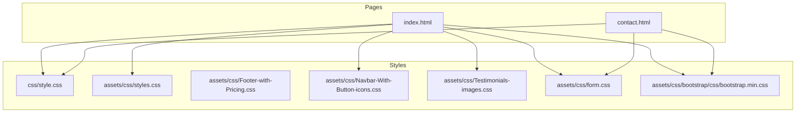
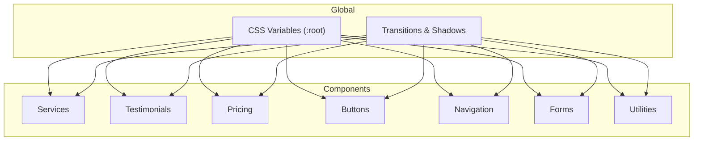
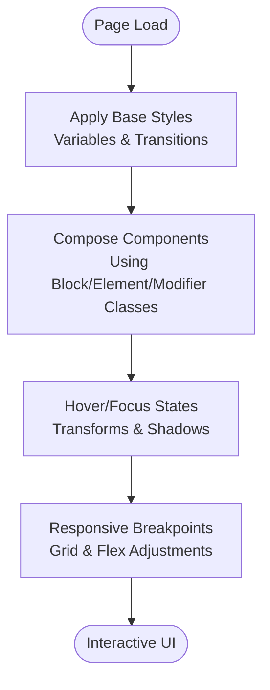
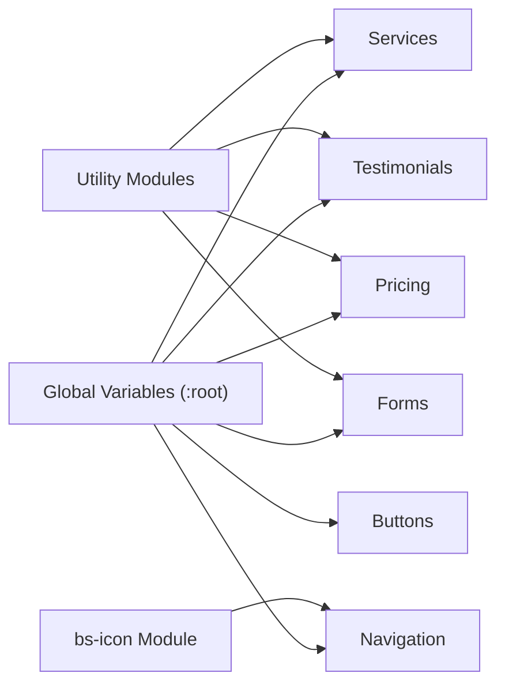

# Component Styling Patterns

<cite>
**Referenced Files in This Document**
- [index.html](file://index.html)
- [contact.html](file://contact.html)
- [css/style.css](file://css/style.css)
- [assets/css/styles.css](file://assets/css/styles.css)
- [assets/css/Footer-with-Pricing.css](file://assets/css/Footer-with-Pricing.css)
- [assets/css/Navbar-With-Button-icons.css](file://assets/css/Navbar-With-Button-icons.css)
- [assets/css/Testimonials-images.css](file://assets/css/Testimonials-images.css)
- [assets/css/form.css](file://assets/css/form.css)
- [assets/css/bootstrap/css/bootstrap.min.css](file://assets/css/bootstrap/css/bootstrap.min.css)
</cite>

## Table of Contents
1. [Introduction](#introduction)
2. [Project Structure](#project-structure)
3. [Core Components](#core-components)
4. [Architecture Overview](#architecture-overview)
5. [Detailed Component Analysis](#detailed-component-analysis)
6. [Dependency Analysis](#dependency-analysis)
7. [Performance Considerations](#performance-considerations)
8. [Troubleshooting Guide](#troubleshooting-guide)
9. [Conclusion](#conclusion)
10. [Appendices](#appendices)

## Introduction
This document describes the component-based styling patterns and naming conventions used across the project’s stylesheets. It focuses on:
- Block-element-modifier (BEM)–inspired naming methodology
- Component architecture for services, testimonials, and pricing cards
- Utility classes for spacing, alignment, and responsive behavior
- Composition patterns, state management via CSS classes, and interactive styles
- Isolation techniques, specificity management, and maintainability strategies
- Reusable patterns such as badges, icons, and gradient backgrounds
- Guidelines for extending existing components and creating new variants

## Project Structure
The styling system is organized around a modular approach:
- Global base styles and theme variables live in the main stylesheet
- Feature-specific styles are grouped into dedicated CSS files
- Utility and icon systems are encapsulated in separate modules
- HTML pages compose components using semantic class names aligned with the BEM methodology



**Diagram sources**
- [css/style.css](file://css/style.css)
- [assets/css/styles.css](file://assets/css/styles.css)
- [assets/css/Footer-with-Pricing.css](file://assets/css/Footer-with-Pricing.css)
- [assets/css/Navbar-With-Button-icons.css](file://assets/css/Navbar-With-Button-icons.css)
- [assets/css/Testimonials-images.css](file://assets/css/Testimonials-images.css)
- [assets/css/form.css](file://assets/css/form.css)
- [assets/css/bootstrap/css/bootstrap.min.css](file://assets/css/bootstrap/css/bootstrap.min.css)
- [index.html](file://index.html)
- [contact.html](file://contact.html)

**Section sources**
- [css/style.css](file://css/style.css)
- [assets/css/styles.css](file://assets/css/styles.css)
- [assets/css/Navbar-With-Button-icons.css](file://assets/css/Navbar-With-Button-icons.css)
- [assets/css/Testimonials-images.css](file://assets/css/Testimonials-images.css)
- [assets/css/form.css](file://assets/css/form.css)
- [assets/css/Footer-with-Pricing.css](file://assets/css/Footer-with-Pricing.css)
- [assets/css/bootstrap/css/bootstrap.min.css](file://assets/css/bootstrap/css/bootstrap.min.css)
- [index.html](file://index.html)
- [contact.html](file://contact.html)

## Core Components
This section outlines the primary component families and their naming patterns.

- Services grid and cards
  - Block: service-card
  - Elements: service-icon, service-features, service-features li
  - Modifiers: featured
  - Example usage: [index.html](file://index.html)

- Testimonials grid and cards
  - Block: testimonial-card
  - Elements: rating, testimonial-text, testimonial-author, author-avatar
  - Example usage: [index.html](file://index.html)

- Pricing cards and tiers
  - Block: pricing-card-tier
  - Elements: price-header, price, currency, amount, period, price-features, price-cta
  - Modifiers: featured
  - Example usage: [index.html](file://index.html)

- Buttons and badges
  - Blocks: btn, badge, consultation-badge, tier-badge, feature-badge
  - Variants: btn-primary, btn-secondary, btn-large, btn-whatsapp
  - Example usage: [index.html](file://index.html), [contact.html](file://contact.html)

- Navigation and icons
  - Block: nav
  - Elements: nav-brand, nav-menu, nav-link, nav-toggle
  - Icon system: bs-icon with size and color modifiers
  - Example usage: [index.html](file://index.html), [contact.html](file://contact.html)

- Forms
  - Blocks: contact-form-container, contact-form, form-group, form-message
  - Elements: form-header, form-row, form-note, form-footer
  - Example usage: [contact.html](file://contact.html)

- Utilities
  - Spacing and alignment: container, hero-content, hero-gradient
  - Responsive helpers: grid templates, flex utilities
  - Example usage: [css/style.css](file://css/style.css), [assets/css/styles.css](file://assets/css/styles.css)

**Section sources**
- [index.html](file://index.html)
- [contact.html](file://contact.html)
- [css/style.css](file://css/style.css)
- [assets/css/styles.css](file://assets/css/styles.css)
- [assets/css/Navbar-With-Button-icons.css](file://assets/css/Navbar-With-Button-icons.css)
- [assets/css/form.css](file://assets/css/form.css)

## Architecture Overview
The architecture follows a component-first approach:
- Each component defines a block class (e.g., service-card)
- Child elements are named as block__element
- Variants and states are expressed as block--modifier or block__element--state
- Global variables and transitions are centralized in the main stylesheet
- Utility and icon systems are modularized for reuse



**Diagram sources**
- [css/style.css](file://css/style.css)

**Section sources**
- [css/style.css](file://css/style.css)

## Detailed Component Analysis

### Services Component Family
- Block: service-card
- Elements: service-icon, service-features, service-features li
- Modifier: featured
- Composition pattern: grid layout with auto-fit columns; hover effects and borders
- State management: hover transforms and borders; modifier class toggles accent styling

```mermaid
classDiagram
class ServiceCard {
"+service-card"
"+service-card--featured"
}
class ServiceIcon {
"+service-icon"
}
class ServiceFeatures {
"+service-features"
}
class ServiceFeatureItem {
"+service-features__item"
}
ServiceCard --> ServiceIcon : "contains"
ServiceCard --> ServiceFeatures : "contains"
ServiceFeatures --> ServiceFeatureItem : "list item"
```

**Diagram sources**
- [index.html](file://index.html)
- [css/style.css](file://css/style.css)

**Section sources**
- [index.html](file://index.html)
- [css/style.css](file://css/style.css)

### Testimonials Component Family
- Block: testimonial-card
- Elements: rating, testimonial-text, testimonial-author, author-avatar
- Composition pattern: grid layout; card layout with avatar and author details

```mermaid
classDiagram
class TestimonialCard {
"+testimonial-card"
}
class Rating {
"+rating"
}
class TestimonialText {
"+testimonial-text"
}
class TestimonialAuthor {
"+testimonial-author"
}
class AuthorAvatar {
"+author-avatar"
}
TestimonialCard --> Rating : "contains"
TestimonialCard --> TestimonialText : "contains"
TestimonialCard --> TestimonialAuthor : "contains"
TestimonialAuthor --> AuthorAvatar : "contains"
```

**Diagram sources**
- [index.html](file://index.html)
- [css/style.css](file://css/style.css)

**Section sources**
- [index.html](file://index.html)
- [css/style.css](file://css/style.css)

### Pricing Component Family
- Block: pricing-card-tier
- Elements: price-header, price, currency, amount, period, price-features, price-cta
- Modifier: featured
- Composition pattern: grid layout; gradient backgrounds; badge overlays; hover scaling

```mermaid
classDiagram
class PricingTier {
"+pricing-card-tier"
"+pricing-card-tier--featured"
}
class PriceHeader {
"+price-header"
}
class Price {
"+price"
}
class Currency {
"+currency"
}
class Amount {
"+amount"
}
class Period {
"+period"
}
class PriceFeatures {
"+price-features"
}
class PriceFeatureItem {
"+price-features__item"
}
class PriceCTA {
"+price-cta"
}
class TierBadge {
"+tier-badge"
}
PricingTier --> PriceHeader : "contains"
PriceHeader --> Price : "contains"
Price --> Currency : "contains"
Price --> Amount : "contains"
Price --> Period : "contains"
PricingTier --> PriceFeatures : "contains"
PriceFeatures --> PriceFeatureItem : "list item"
PricingTier --> PriceCTA : "contains"
PricingTier --> TierBadge : "contains"
```

**Diagram sources**
- [index.html](file://index.html)
- [css/style.css](file://css/style.css)
- [assets/css/styles.css](file://assets/css/styles.css)
- [assets/css/Footer-with-Pricing.css](file://assets/css/Footer-with-Pricing.css)

**Section sources**
- [index.html](file://index.html)
- [css/style.css](file://css/style.css)
- [assets/css/styles.css](file://assets/css/styles.css)
- [assets/css/Footer-with-Pricing.css](file://assets/css/Footer-with-Pricing.css)

### Buttons and Badges
- Blocks: btn, badge, consultation-badge, tier-badge, feature-badge
- Variants: btn-primary, btn-secondary, btn-large, btn-whatsapp
- Composition pattern: shared button shape and transitions; variant classes switch colors and sizes

```mermaid
classDiagram
class Button {
"+btn"
"+btn--primary"
"+btn--secondary"
"+btn--large"
"+btn--whatsapp"
}
class Badge {
"+badge"
}
class ConsultationBadge {
"+consultation-badge"
}
class TierBadge {
"+tier-badge"
}
class FeatureBadge {
"+feature-badge"
}
Button <.. Badge : "used in"
Button <.. ConsultationBadge : "used in"
PricingTier --> TierBadge : "contains"
ContactInfo --> FeatureBadge : "contains"
```

**Diagram sources**
- [css/style.css](file://css/style.css)
- [assets/css/styles.css](file://assets/css/styles.css)
- [index.html](file://index.html)
- [contact.html](file://contact.html)

**Section sources**
- [css/style.css](file://css/style.css)
- [assets/css/styles.css](file://assets/css/styles.css)
- [index.html](file://index.html)
- [contact.html](file://contact.html)

### Navigation and Icons
- Block: nav
- Elements: nav-brand, nav-menu, nav-link, nav-toggle
- Icon system: bs-icon with size modifiers (xs, sm, md, lg, xl) and color/background variants (primary, primary-light, semi-white), plus rounded and circle shapes

```mermaid
classDiagram
class Nav {
"+nav"
}
class NavBrand {
"+nav-brand"
}
class NavMenu {
"+nav-menu"
}
class NavLink {
"+nav-link"
}
class NavToggle {
"+nav-toggle"
}
class BSIcon {
"+bs-icon"
"+bs-icon--size-xs/sm/md/lg/xl"
"+bs-icon--variant-primary/primary-light/semi-white"
"+bs-icon--shape-rounded/circle"
}
Nav --> NavBrand : "contains"
Nav --> NavMenu : "contains"
NavMenu --> NavLink : "contains"
Nav --> NavToggle : "contains"
Nav --> BSIcon : "uses"
```

**Diagram sources**
- [css/style.css](file://css/style.css)
- [assets/css/Navbar-With-Button-icons.css](file://assets/css/Navbar-With-Button-icons.css)
- [index.html](file://index.html)
- [contact.html](file://contact.html)

**Section sources**
- [css/style.css](file://css/style.css)
- [assets/css/Navbar-With-Button-icons.css](file://assets/css/Navbar-With-Button-icons.css)
- [index.html](file://index.html)
- [contact.html](file://contact.html)

### Forms
- Blocks: contact-form-container, contact-form, form-group, form-message
- Elements: form-header, form-row, form-note, form-footer
- Composition pattern: structured layout with grid and flex utilities; focus and validation states

```mermaid
classDiagram
class ContactFormContainer {
"+contact-form-container"
}
class ContactForm {
"+contact-form"
}
class FormGroup {
"+form-group"
}
class FormRow {
"+form-row"
}
class FormHeader {
"+form-header"
}
class FormNote {
"+form-note"
}
class FormFooter {
"+form-footer"
}
class FormMessage {
"+form-message"
"+form-message--success"
"+form-message--error"
}
ContactFormContainer --> FormHeader : "contains"
ContactFormContainer --> ContactForm : "contains"
ContactForm --> FormRow : "contains"
ContactForm --> FormGroup : "contains"
ContactForm --> FormFooter : "contains"
ContactForm --> FormNote : "contains"
ContactForm --> FormMessage : "contains"
```

**Diagram sources**
- [contact.html](file://contact.html)
- [assets/css/form.css](file://assets/css/form.css)
- [css/style.css](file://css/style.css)

**Section sources**
- [contact.html](file://contact.html)
- [assets/css/form.css](file://assets/css/form.css)
- [css/style.css](file://css/style.css)

### Utilities and Responsive Behavior
- Utilities: container, hero-content, hero-gradient, fit-cover
- Responsive patterns: grid and flex layouts with media queries; breakpoint-driven adjustments
- Interaction styles: hover, focus, and transform states across components



**Diagram sources**
- [css/style.css](file://css/style.css)
- [assets/css/styles.css](file://assets/css/styles.css)
- [assets/css/Testimonials-images.css](file://assets/css/Testimonials-images.css)

**Section sources**
- [css/style.css](file://css/style.css)
- [assets/css/styles.css](file://assets/css/styles.css)
- [assets/css/Testimonials-images.css](file://assets/css/Testimonials-images.css)

## Dependency Analysis
The styling system exhibits low coupling and high cohesion:
- Global variables and transitions are referenced by all components
- Icon and utility modules are imported separately for reuse
- Component styles are scoped to their blocks and elements, minimizing cross-contamination



**Diagram sources**
- [css/style.css](file://css/style.css)
- [assets/css/Navbar-With-Button-icons.css](file://assets/css/Navbar-With-Button-icons.css)
- [assets/css/styles.css](file://assets/css/styles.css)
- [assets/css/form.css](file://assets/css/form.css)

**Section sources**
- [css/style.css](file://css/style.css)
- [assets/css/Navbar-With-Button-icons.css](file://assets/css/Navbar-With-Button-icons.css)
- [assets/css/styles.css](file://assets/css/styles.css)
- [assets/css/form.css](file://assets/css/form.css)

## Performance Considerations
- Prefer class-based selectors over deep nesting to reduce specificity and improve maintainability
- Use CSS variables for colors and transitions to minimize repeated declarations
- Keep hover and transform effects lightweight; leverage GPU-friendly properties
- Modularize styles to enable selective loading and caching

## Troubleshooting Guide
Common issues and resolutions:
- Conflicts with external libraries
  - The project imports Bootstrap variables; ensure custom styles override where necessary
  - Use modifier classes to avoid unintended global resets
- Icon sizing inconsistencies
  - Use bs-icon size modifiers consistently across components
- Form focus states
  - Verify focus-visible outlines and custom validity messages are applied
- Responsive breakpoints
  - Confirm media queries align with component grids and containers

**Section sources**
- [assets/css/bootstrap/css/bootstrap.min.css](file://assets/css/bootstrap/css/bootstrap.min.css)
- [assets/css/Navbar-With-Button-icons.css](file://assets/css/Navbar-With-Button-icons.css)
- [assets/css/form.css](file://assets/css/form.css)
- [css/style.css](file://css/style.css)

## Conclusion
The project employs a pragmatic BEM-inspired methodology with clear separation of concerns. Components are modular, reusable, and maintainable, with robust utility and icon systems. By adhering to the patterns documented here, teams can extend existing components and introduce new variants while preserving consistency and performance.

## Appendices

### Naming Convention Reference
- Block: service-card, testimonial-card, pricing-card-tier, btn, nav, contact-form
- Element: service-icon, price-header, price-features__item, nav-link, form-group
- Modifier: service-card--featured, pricing-card-tier--featured, btn--primary, btn--large

**Section sources**
- [css/style.css](file://css/style.css)
- [index.html](file://index.html)
- [contact.html](file://contact.html)