# CSS Grid Layouts

<cite>
**Referenced Files in This Document**
- [style.css](file://css/style.css)
- [styles.css](file://assets/css/styles.css)
- [Testimonials-images.css](file://assets/css/Testimonials-images.css)
- [Footer-with-Pricing.css](file://assets/css/Footer-with-Pricing.css)
- [Navbar-With-Button-icons.css](file://assets/css/Navbar-With-Button-icons.css)
- [index.html](file://index.html)
- [blog.html](file://blog.html)
</cite>

## Table of Contents
1. [Introduction](#introduction)
2. [Project Structure](#project-structure)
3. [Core Components](#core-components)
4. [Architecture Overview](#architecture-overview)
5. [Detailed Component Analysis](#detailed-component-analysis)
6. [Dependency Analysis](#dependency-analysis)
7. [Performance Considerations](#performance-considerations)
8. [Troubleshooting Guide](#troubleshooting-guide)
9. [Conclusion](#conclusion)

## Introduction
This document explains the CSS Grid implementation patterns used throughout the design system. It focuses on responsive card grids using repeat(auto-fit, minmax()) for services, testimonials, pricing tiers, methodology steps, reasons, FAQs, footer sections, and blog listings. It also covers grid-template-columns, gap properties, alignment utilities, complex grid arrangements (hero image cards), and responsive behavior using minmax() functions. Guidance is included for grid item placement, spanning behaviors, alignment options, troubleshooting common grid issues, and browser compatibility considerations.

## Project Structure
The design system primarily uses a single global stylesheet for layout and typography, with additional asset-level styles for specific components. The main layout CSS defines grid patterns for major sections, while HTML pages apply these patterns to build responsive card grids.

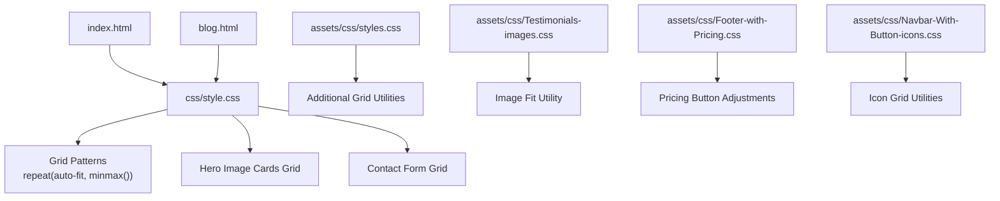

**Diagram sources**
- [index.html:1-522](file://index.html#L1-L522)
- [blog.html:1-247](file://blog.html#L1-L247)
- [style.css:1-1886](file://css/style.css#L1-L1886)
- [styles.css:1-339](file://assets/css/styles.css#L1-L339)
- [Testimonials-images.css:1-5](file://assets/css/Testimonials-images.css#L1-L5)
- [Footer-with-Pricing.css:1-10](file://assets/css/Footer-with-Pricing.css#L1-L10)
- [Navbar-With-Button-icons.css:1-58](file://assets/css/Navbar-With-Button-icons.css#L1-L58)

**Section sources**
- [style.css:1-1886](file://css/style.css#L1-L1886)
- [index.html:1-522](file://index.html#L1-L522)
- [blog.html:1-247](file://blog.html#L1-L247)

## Core Components
This section highlights the primary grid patterns and their usage across the design system.

- Services Grid
  - Selector: .services-grid
  - Pattern: repeat(auto-fit, minmax(280px, 1fr))
  - Purpose: Responsive card grid for service offerings
  - Implementation: Applied to the services section container

- Testimonials Grid
  - Selector: .testimonials-grid
  - Pattern: repeat(auto-fit, minmax(280px, 1fr))
  - Purpose: Responsive card grid for client testimonials
  - Implementation: Applied to the testimonials section container

- Pricing Grid (Tiers)
  - Selector: .pricing-grid (tiers)
  - Pattern: repeat(3, 1fr) with align-items: start
  - Purpose: Fixed three-column tier layout with centered featured card
  - Implementation: Applied to the pricing section container

- Pricing Grid (Card)
  - Selector: .pricing-grid (card)
  - Pattern: repeat(auto-fit, minmax(300px, 1fr))
  - Purpose: Responsive pricing card layout on pricing page
  - Implementation: Applied to the pricing page container

- Methodology Steps Grid
  - Selector: .methodology-grid
  - Pattern: repeat(auto-fit, minmax(250px, 1fr))
  - Purpose: Responsive step-by-step methodology cards
  - Implementation: Applied to the methodology section container

- Reasons Grid
  - Selector: .reasons-grid
  - Pattern: repeat(auto-fit, minmax(300px, 1fr))
  - Purpose: Responsive reasons/differentiators cards
  - Implementation: Applied to the reasons section container

- FAQ Grid
  - Selector: .faq-grid
  - Pattern: repeat(auto-fit, minmax(280px, 1fr))
  - Purpose: Responsive FAQ items
  - Implementation: Applied to the FAQ section container

- Footer Sections Grid
  - Selector: .footer-content
  - Pattern: repeat(auto-fit, minmax(250px, 1fr))
  - Purpose: Responsive footer column layout
  - Implementation: Applied to the footer container

- Blog Grid
  - Selector: .blog-grid
  - Pattern: repeat(auto-fit, minmax(320px, 1fr))
  - Purpose: Responsive blog listing cards
  - Implementation: Applied to the blog listing section container

- Hero Image Cards Grid
  - Selector: .hero-image
  - Pattern: 1fr grid-template-columns with 1rem gap
  - Purpose: Three vertically stacked hero feature cards
  - Implementation: Applied to the hero image container

- Contact Form Grid
  - Selector: .form-row
  - Pattern: 1fr 1fr grid-template-columns with 1.5rem gap
  - Purpose: Two-column form row layout
  - Implementation: Applied to form rows

- Additional Grid Utilities
  - Selectors: .services-grid (assets), .pricing-grid (assets)
  - Purpose: Secondary grid patterns for services and pricing on homepage
  - Implementation: Applied to respective containers

**Section sources**
- [style.css:381-464](file://css/style.css#L381-L464)
- [style.css:557-561](file://css/style.css#L557-L561)
- [style.css:1334-1341](file://css/style.css#L1334-L1341)
- [style.css:1471-1477](file://css/style.css#L1471-L1477)
- [style.css:472-476](file://css/style.css#L472-L476)
- [style.css:514-518](file://css/style.css#L514-L518)
- [style.css:1098-1104](file://css/style.css#L1098-L1104)
- [style.css:1142-1147](file://css/style.css#L1142-L1147)
- [style.css:1471-1477](file://css/style.css#L1471-L1477)
- [style.css:203-207](file://css/style.css#L203-L207)
- [style.css:996-1000](file://css/style.css#L996-L1000)
- [styles.css:121-127](file://assets/css/styles.css#L121-L127)
- [styles.css:175-182](file://assets/css/styles.css#L175-L182)

## Architecture Overview
The grid architecture centers on a single global stylesheet that defines reusable grid patterns. These patterns are applied consistently across sections to ensure responsive behavior and visual coherence. The design system uses two primary approaches:
- repeat(auto-fit, minmax()) for flexible, fluid grids that adapt to viewport width
- fixed repeat(N, 1fr) for layouts requiring a strict number of columns

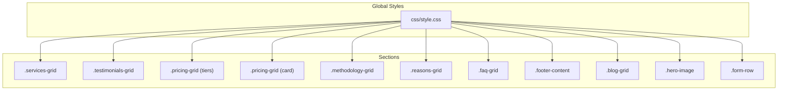

**Diagram sources**
- [style.css:381-464](file://css/style.css#L381-L464)
- [style.css:557-561](file://css/style.css#L557-L561)
- [style.css:1334-1341](file://css/style.css#L1334-L1341)
- [style.css:1471-1477](file://css/style.css#L1471-L1477)
- [style.css:472-476](file://css/style.css#L472-L476)
- [style.css:514-518](file://css/style.css#L514-L518)
- [style.css:1098-1104](file://css/style.css#L1098-L1104)
- [style.css:1142-1147](file://css/style.css#L1142-L1147)
- [style.css:1471-1477](file://css/style.css#L1471-L1477)
- [style.css:203-207](file://css/style.css#L203-L207)
- [style.css:996-1000](file://css/style.css#L996-L1000)

## Detailed Component Analysis

### Services Grid
- Pattern: repeat(auto-fit, minmax(280px, 1fr))
- Behavior: Automatically adjusts the number of columns based on available space, with a minimum width of 280px per card
- Gap: 2rem spacing between cards
- Responsive behavior: On small screens, switches to single column via media query

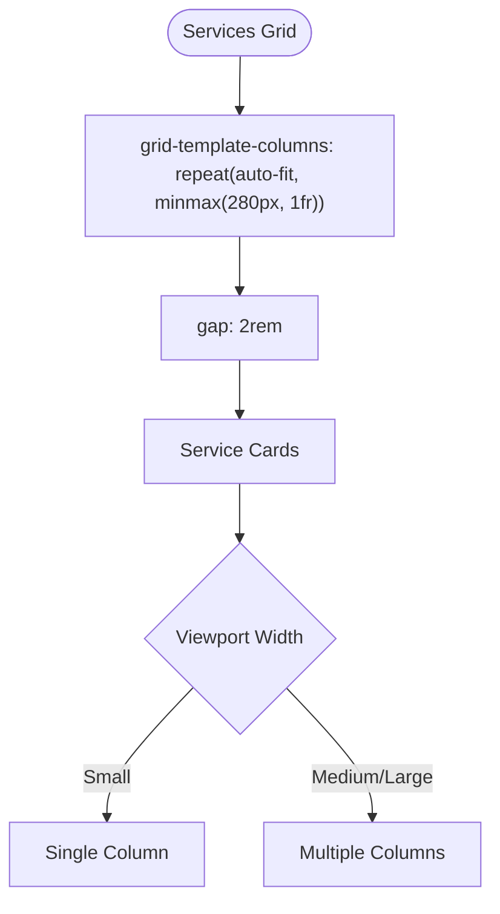

**Diagram sources**
- [style.css:381-385](file://css/style.css#L381-L385)
- [style.css:1292-1296](file://css/style.css#L1292-L1296)

**Section sources**
- [style.css:381-406](file://css/style.css#L381-L406)
- [style.css:1292-1296](file://css/style.css#L1292-L1296)

### Testimonials Grid
- Pattern: repeat(auto-fit, minmax(280px, 1fr))
- Behavior: Flexible card grid with minimum 280px width
- Layout: Each testimonial card displays rating, text, and author avatar
- Responsive behavior: Switches to single column on smaller screens

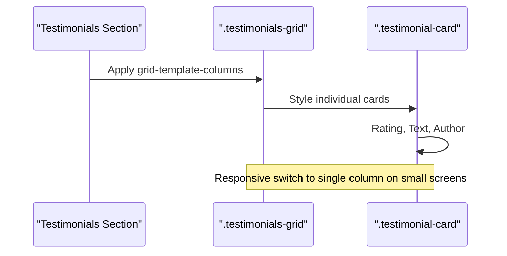

**Diagram sources**
- [style.css:557-561](file://css/style.css#L557-L561)
- [style.css:563-614](file://css/style.css#L563-L614)
- [style.css:1292-1296](file://css/style.css#L1292-L1296)

**Section sources**
- [style.css:557-561](file://css/style.css#L557-L561)
- [style.css:563-614](file://css/style.css#L563-L614)
- [index.html:299-379](file://index.html#L299-L379)

### Pricing Grid (Tiers)
- Pattern: repeat(3, 1fr) with align-items: start
- Behavior: Fixed three-column layout for pricing tiers
- Featured card: Elevated with transform and higher z-index
- Responsive behavior: On medium screens, switches to single column and reorders featured card

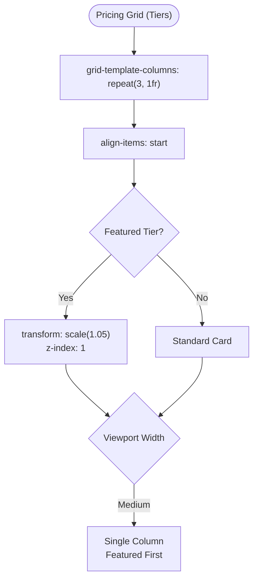

**Diagram sources**
- [style.css:1334-1341](file://css/style.css#L1334-L1341)
- [style.css:1358-1362](file://css/style.css#L1358-L1362)
- [style.css:1445-1459](file://css/style.css#L1445-L1459)

**Section sources**
- [style.css:1334-1341](file://css/style.css#L1334-L1341)
- [style.css:1358-1362](file://css/style.css#L1358-L1362)
- [style.css:1445-1459](file://css/style.css#L1445-L1459)

### Pricing Grid (Card)
- Pattern: repeat(auto-fit, minmax(300px, 1fr))
- Behavior: Flexible pricing card layout on pricing page
- Responsive behavior: Switches to single column on smaller screens

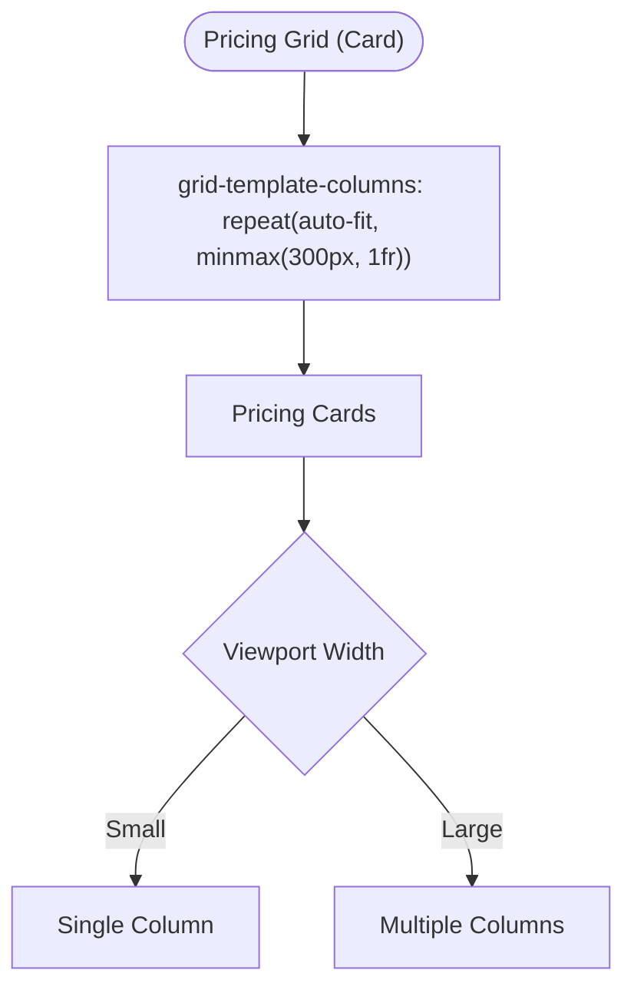

**Diagram sources**
- [styles.css:175-182](file://assets/css/styles.css#L175-L182)
- [styles.css:304-318](file://assets/css/styles.css#L304-L318)

**Section sources**
- [styles.css:175-182](file://assets/css/styles.css#L175-L182)
- [styles.css:304-318](file://assets/css/styles.css#L304-L318)

### Methodology Steps Grid
- Pattern: repeat(auto-fit, minmax(250px, 1fr))
- Behavior: Flexible step-by-step cards with numbered indicators
- Responsive behavior: Adapts to available space with minimum 250px width

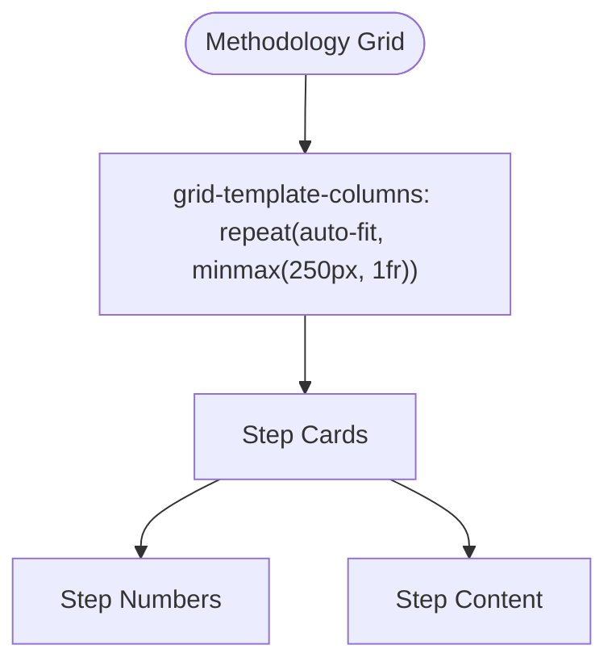

**Diagram sources**
- [style.css:472-476](file://css/style.css#L472-L476)

**Section sources**
- [style.css:472-509](file://css/style.css#L472-L509)

### Reasons Grid
- Pattern: repeat(auto-fit, minmax(300px, 1fr))
- Behavior: Flexible cards highlighting differentiators
- Responsive behavior: Single column on small screens

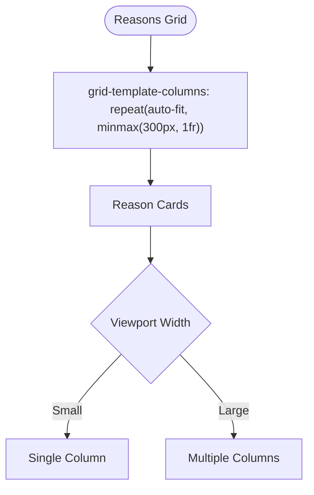

**Diagram sources**
- [style.css:514-518](file://css/style.css#L514-L518)
- [style.css:1292-1296](file://css/style.css#L1292-L1296)

**Section sources**
- [style.css:514-548](file://css/style.css#L514-L548)
- [style.css:1292-1296](file://css/style.css#L1292-L1296)

### FAQ Grid
- Pattern: repeat(auto-fit, minmax(280px, 1fr))
- Behavior: Flexible FAQ items with question and answer content
- Responsive behavior: Adapts to available space with minimum 280px width

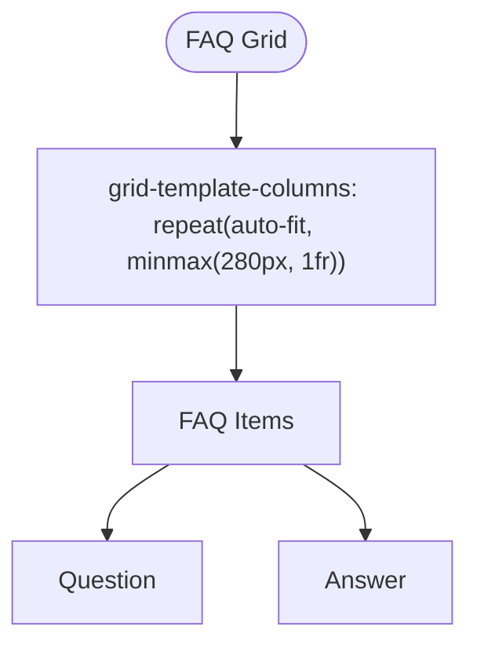

**Diagram sources**
- [style.css:1098-1104](file://css/style.css#L1098-L1104)

**Section sources**
- [style.css:1098-1130](file://css/style.css#L1098-L1130)

### Footer Sections Grid
- Pattern: repeat(auto-fit, minmax(250px, 1fr))
- Behavior: Flexible footer columns with links and contact information
- Responsive behavior: Adapts to available space with minimum 250px width

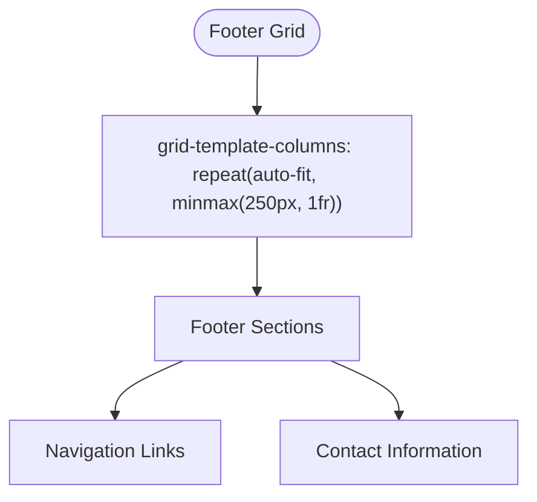

**Diagram sources**
- [style.css:1142-1147](file://css/style.css#L1142-L1147)

**Section sources**
- [style.css:1142-1182](file://css/style.css#L1142-L1182)

### Blog Grid
- Pattern: repeat(auto-fit, minmax(320px, 1fr))
- Behavior: Flexible blog listing cards with category and date metadata
- Responsive behavior: Single column on small screens

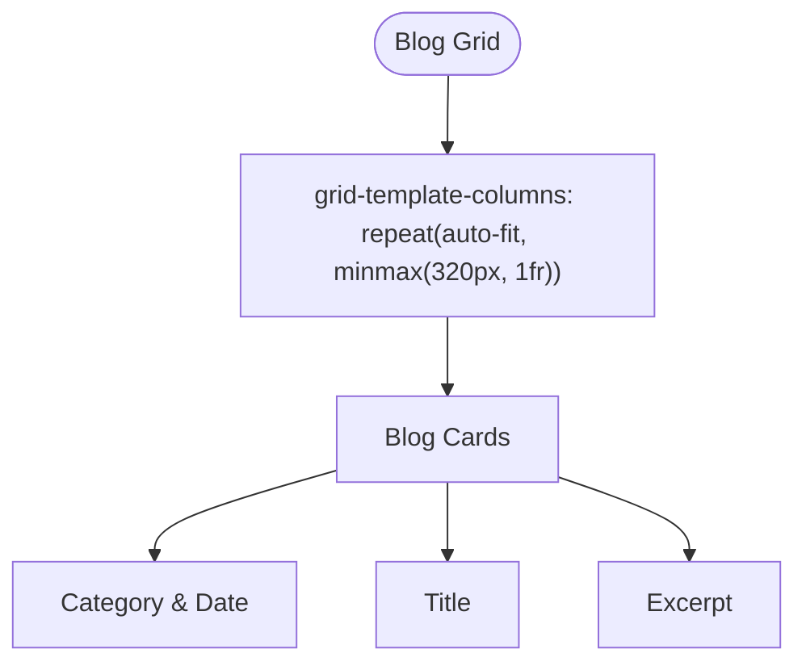

**Diagram sources**
- [style.css:1471-1477](file://css/style.css#L1471-L1477)
- [style.css:1835-1838](file://css/style.css#L1835-L1838)

**Section sources**
- [style.css:1471-1578](file://css/style.css#L1471-L1578)
- [blog.html:70-202](file://blog.html#L70-L202)

### Hero Image Cards Grid
- Pattern: 1fr grid-template-columns with 1rem gap
- Behavior: Three vertically stacked feature cards in the hero section
- Purpose: Highlight key benefits and features

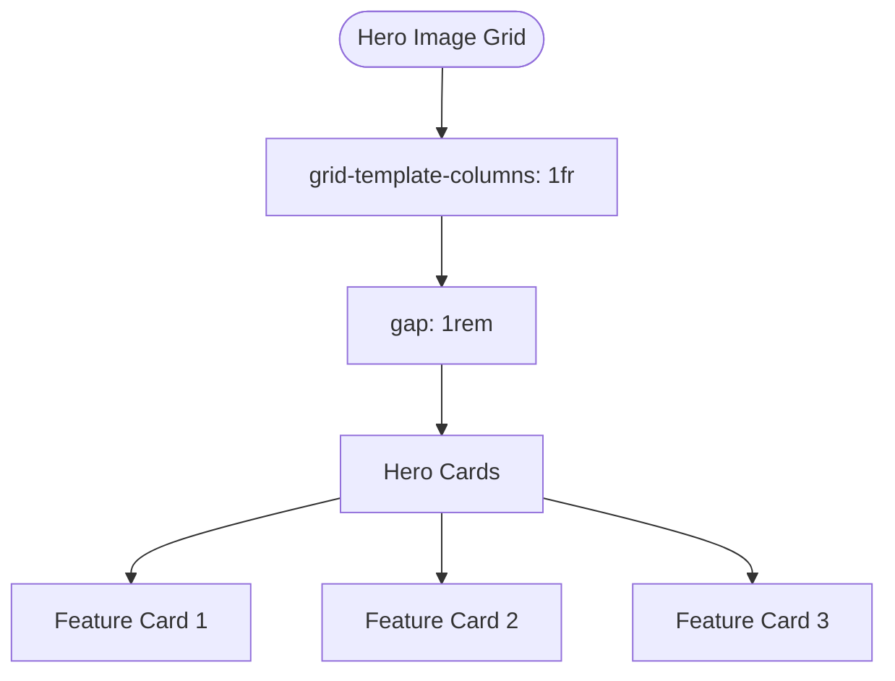

**Diagram sources**
- [style.css:203-207](file://css/style.css#L203-L207)

**Section sources**
- [style.css:203-231](file://css/style.css#L203-L231)
- [index.html:72-88](file://index.html#L72-L88)

### Contact Form Grid
- Pattern: 1fr 1fr grid-template-columns with 1.5rem gap
- Behavior: Two-column form rows for grouped inputs
- Purpose: Improve form layout and readability

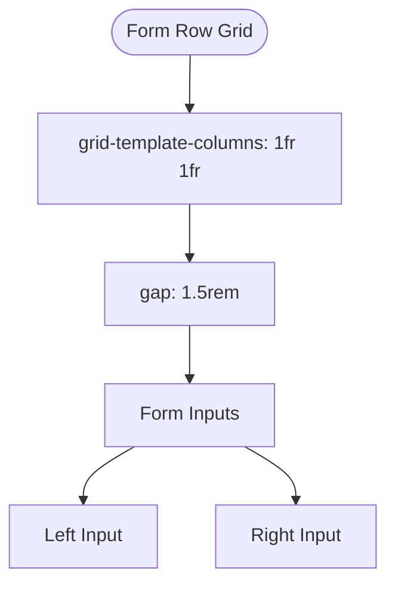

**Diagram sources**
- [style.css:996-1000](file://css/style.css#L996-L1000)

**Section sources**
- [style.css:996-1038](file://css/style.css#L996-L1038)

### Additional Grid Utilities
- Services Grid (assets): repeat(auto-fit, minmax(300px, 1fr))
- Pricing Grid (assets): flex-based layout with gap and centering
- Purpose: Secondary grid patterns for homepage services and pricing sections

**Section sources**
- [styles.css:121-127](file://assets/css/styles.css#L121-L127)
- [styles.css:175-182](file://assets/css/styles.css#L175-L182)

## Dependency Analysis
The grid system relies on a single global stylesheet for consistent patterns. HTML pages depend on these selectors to render responsive layouts. Asset-level styles provide complementary patterns for specific components.

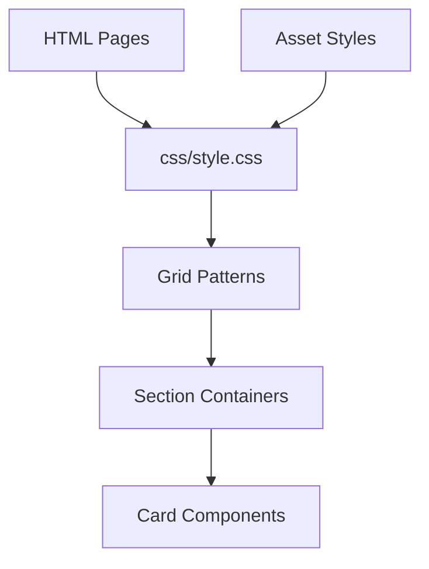

**Diagram sources**
- [index.html:1-522](file://index.html#L1-L522)
- [blog.html:1-247](file://blog.html#L1-L247)
- [style.css:1-1886](file://css/style.css#L1-L1886)
- [styles.css:1-339](file://assets/css/styles.css#L1-L339)

**Section sources**
- [index.html:1-522](file://index.html#L1-L522)
- [blog.html:1-247](file://blog.html#L1-L247)
- [style.css:1-1886](file://css/style.css#L1-L1886)
- [styles.css:1-339](file://assets/css/styles.css#L1-L339)

## Performance Considerations
- Use repeat(auto-fit, minmax()) judiciously: While flexible, excessive nesting can impact rendering performance on low-powered devices.
- Prefer fixed repeat(N, 1fr) for critical layouts: Ensures predictable performance and avoids layout thrashing during viewport changes.
- Minimize deep grid nesting: Limit grid containers to 2–3 levels to reduce complexity and improve maintainability.
- Leverage gap for spacing: Using gap reduces the need for margins and improves layout performance compared to manual spacing.
- Media query breakpoints: Consolidate responsive breakpoints to minimize recalculations during resize events.

## Troubleshooting Guide
Common grid issues and solutions:

- Cards stacking unexpectedly on small screens
  - Verify media query overrides for grid-template-columns
  - Ensure grid-template-columns switches to 1fr on small screens
  - Confirm gap remains consistent across breakpoints

- Misaligned content within grid items
  - Use align-items and justify-content on grid containers
  - Ensure child elements do not exceed grid item boundaries
  - Check for conflicting flex properties on grid items

- Inconsistent spacing between cards
  - Confirm gap is set on the grid container
  - Avoid using margins on grid items that conflict with gap
  - Verify consistent box-sizing across components

- Featured card overlaps other cards
  - Use z-index strategically for elevated elements
  - Consider transform-origin and positioning for featured cards
  - Ensure proper stacking context with parent containers

- Images not filling grid areas
  - Apply object-fit utilities to images within grid items
  - Ensure aspect ratio constraints are respected
  - Use fit-cover utilities for consistent image coverage

Browser compatibility considerations:
- Modern browsers support CSS Grid widely; ensure fallbacks for older browsers if necessary
- Use vendor prefixes sparingly; modern builds typically do not require them
- Test across devices and screen sizes to validate responsive behavior
- Validate accessibility with assistive technologies to ensure grid-based layouts remain usable

**Section sources**
- [style.css:1239-1256](file://css/style.css#L1239-L1256)
- [style.css:1445-1459](file://css/style.css#L1445-L1459)
- [Testimonials-images.css:1-5](file://assets/css/Testimonials-images.css#L1-L5)

## Conclusion
The design system employs a robust CSS Grid architecture centered on repeat(auto-fit, minmax()) for flexible, responsive card grids and fixed repeat(N, 1fr) for structured layouts. Consistent patterns across services, testimonials, pricing, methodology, reasons, FAQs, footer sections, and blog listings ensure visual coherence and maintainable code. By leveraging gap for spacing, align-items for alignment, and media queries for responsiveness, the system delivers excellent user experiences across devices. Following the troubleshooting and performance recommendations will help maintain optimal grid behavior and accessibility.