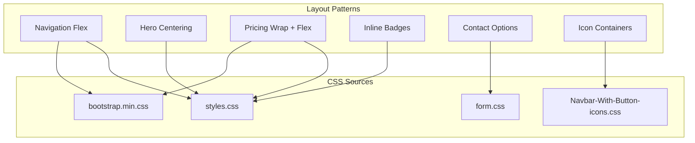
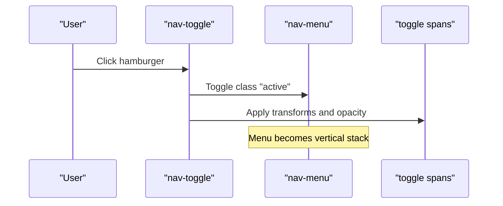
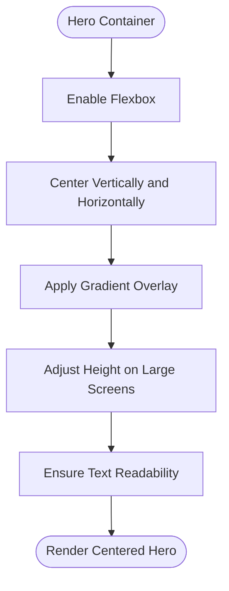
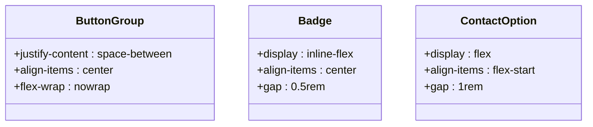
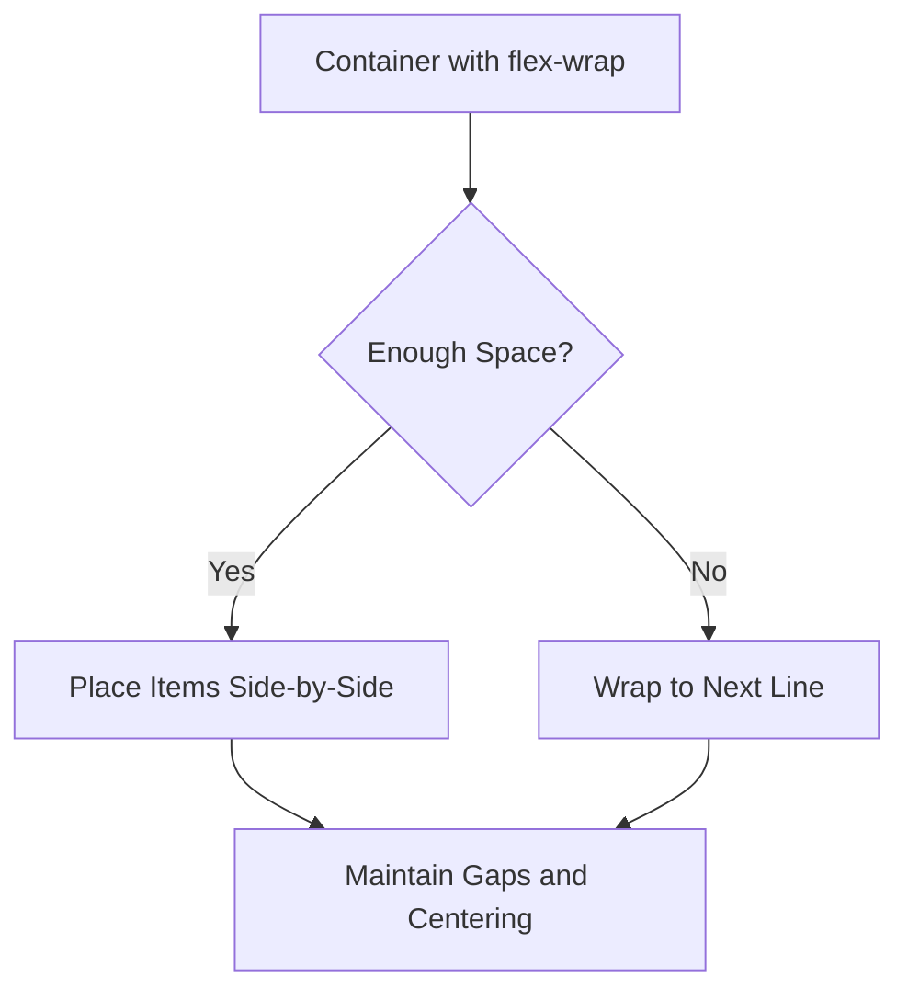
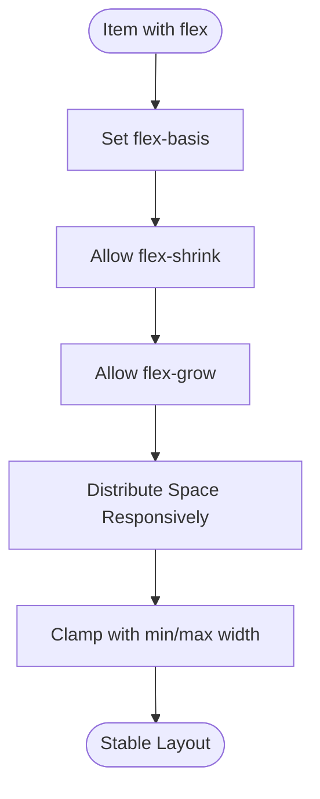
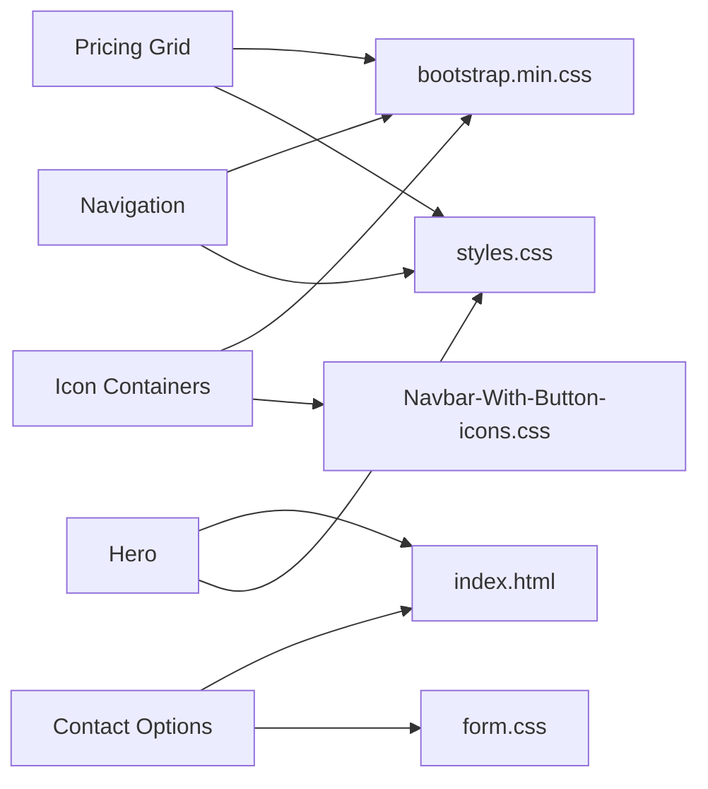

# Flexbox Systems

<cite>
**Referenced Files in This Document**
- [index.html](file://index.html)
- [contact.html](file://contact.html)
- [styles.css](file://assets/css/styles.css)
- [Navbar-With-Button-icons.css](file://assets/css/Navbar-With-Button-icons.css)
- [bootstrap.min.css](file://assets/bootstrap/css/bootstrap.min.css)
- [form.css](file://assets/css/form.css)
- [main.js](file://js/main.js)
- [README.md](file://README.md)
</cite>

## Table of Contents
1. [Introduction](#introduction)
2. [Project Structure](#project-structure)
3. [Core Components](#core-components)
4. [Architecture Overview](#architecture-overview)
5. [Detailed Component Analysis](#detailed-component-analysis)
6. [Dependency Analysis](#dependency-analysis)
7. [Performance Considerations](#performance-considerations)
8. [Troubleshooting Guide](#troubleshooting-guide)
9. [Conclusion](#conclusion)

## Introduction
This document explains the Flexbox implementation patterns and utilities used across the website. It focuses on how flex properties are applied to build navigation menus, hero sections, button groups, badges, and contact layouts. It also covers responsive behavior via flex-wrap, dynamic sizing with flex-grow, flex-shrink, and flex-basis, and provides best practices, pitfalls, and alternatives.

## Project Structure
The project is a static marketing site for an English instructor. Flexbox is primarily implemented in custom styles and Bootstrap utilities. Key areas:
- Navigation menu layout and responsiveness
- Hero section alignment and content arrangement
- Pricing cards and badge collections with wrapping and spacing
- Contact option layouts and form field directionality
- Utility classes for icon containers and inline-flex badges

```mermaid
graph TB
subgraph "Pages"
IDX["index.html"]
CT["contact.html"]
end
subgraph "Styles"
STY["assets/css/styles.css"]
NAV["assets/css/Navbar-With-Button-icons.css"]
F["assets/css/form.css"]
BOOT["assets/bootstrap/css/bootstrap.min.css"]
end
subgraph "JS"
JS["js/main.js"]
end
IDX --> STY
CT --> STY
IDX --> F
CT --> F
IDX --> NAV
CT --> NAV
IDX --> JS
CT --> JS
STY --> BOOT
NAV --> BOOT
F --> BOOT
```

**Diagram sources**
- [index.html](file://index.html)
- [contact.html](file://contact.html)
- [styles.css](file://assets/css/styles.css)
- [Navbar-With-Button-icons.css](file://assets/css/Navbar-With-Button-icons.css)
- [form.css](file://assets/css/form.css)
- [bootstrap.min.css](file://assets/bootstrap/css/bootstrap.min.css)
- [main.js](file://js/main.js)

**Section sources**
- [README.md](file://README.md)
- [index.html](file://index.html)
- [contact.html](file://contact.html)

## Core Components
- Navigation menu: Uses flex for horizontal alignment and spacing on desktop; toggles a vertical stack on mobile.
- Hero section: Centers content both vertically and horizontally using flex properties.
- Pricing cards: Wraps items responsively and uses flex to distribute space and align content.
- Badge collections: Inline-flex badges with gap for consistent spacing.
- Contact options: Flex row/column layouts for icons and labels.
- Icon utilities: Consistent sizing and alignment using flex-shrink and centering.

**Section sources**
- [styles.css](file://assets/css/styles.css)
- [Navbar-With-Button-icons.css](file://assets/css/Navbar-With-Button-icons.css)
- [form.css](file://assets/css/form.css)
- [bootstrap.min.css](file://assets/bootstrap/css/bootstrap.min.css)

## Architecture Overview
Flexbox is used across the UI to achieve:
- Alignment: align-items and justify-content for centering and distribution
- Direction: flex-direction for row/column switching
- Wrapping: flex-wrap for responsive collections
- Dynamic sizing: flex-grow, flex-shrink, flex-basis for adaptive widths
- Utilities: inline-flex for compact inline badges and icon containers



**Diagram sources**
- [styles.css](file://assets/css/styles.css)
- [Navbar-With-Button-icons.css](file://assets/css/Navbar-With-Button-icons.css)
- [form.css](file://assets/css/form.css)
- [bootstrap.min.css](file://assets/bootstrap/css/bootstrap.min.css)

## Detailed Component Analysis

### Navigation Menu Layouts
- Desktop: The navigation bar uses flex to lay out brand, toggle, and menu items horizontally. The menu items are spaced and aligned using flex utilities inherited from the framework.
- Mobile: On smaller screens, the menu collapses into a vertical stack triggered by a JavaScript toggle. The toggle animation rotates spans to form an “X” shape.



**Diagram sources**
- [main.js](file://js/main.js)
- [index.html](file://index.html)
- [bootstrap.min.css](file://assets/bootstrap/css/bootstrap.min.css)

**Section sources**
- [index.html](file://index.html)
- [main.js](file://js/main.js)
- [bootstrap.min.css](file://assets/bootstrap/css/bootstrap.min.css)

### Hero Section Layouts
- The hero container uses flex to center content both vertically and horizontally.
- Media queries adjust min-height and stacking for larger screens.
- The hero content layer sits above a gradient overlay, with z-index management for readability.



**Diagram sources**
- [styles.css](file://assets/css/styles.css)
- [index.html](file://index.html)

**Section sources**
- [styles.css](file://assets/css/styles.css)
- [index.html](file://index.html)

### Flex Utilities for Button Groups, Badges, and Contact Options
- Button groups: Buttons arranged in a row with consistent spacing and alignment.
- Badges: Inline-flex badges with centered icons and text, using gap for spacing.
- Contact options: Rows of icons and labels for WhatsApp, address, and hours.



**Diagram sources**
- [styles.css](file://assets/css/styles.css)
- [form.css](file://assets/css/form.css)

**Section sources**
- [styles.css](file://assets/css/styles.css)
- [form.css](file://assets/css/form.css)

### Responsive Navigation and Badge Collections with flex-wrap
- Pricing grid uses flex-wrap to allow items to wrap on smaller screens while maintaining centering and gaps.
- On narrow screens, the pricing direction switches to a single-column layout to improve readability.
- Badge collections benefit from wrapping to fit varying screen widths.



**Diagram sources**
- [styles.css](file://assets/css/styles.css)

**Section sources**
- [styles.css](file://assets/css/styles.css)

### Dynamic Sizing with flex-grow, flex-shrink, and flex-basis
- Pricing tiers use flexible widths with minimum and maximum constraints to ensure equal distribution and readability.
- Row utilities in the framework demonstrate flex-shrink and proportional growth for gutters and columns.
- Icon containers apply flex-shrink to prevent overflow and maintain aspect ratios.



**Diagram sources**
- [styles.css](file://assets/css/styles.css)
- [bootstrap.min.css](file://assets/bootstrap/css/bootstrap.min.css)
- [Navbar-With-Button-icons.css](file://assets/css/Navbar-With-Button-icons.css)

**Section sources**
- [styles.css](file://assets/css/styles.css)
- [bootstrap.min.css](file://assets/bootstrap/css/bootstrap.min.css)
- [Navbar-With-Button-icons.css](file://assets/css/Navbar-With-Button-icons.css)

## Dependency Analysis
- Navigation relies on custom styles for centering and spacing, and Bootstrap utilities for responsive breakpoints and gutters.
- Hero section depends on custom flex centering and media queries.
- Pricing grid combines custom flex-wrap and tier sizing with Bootstrap row/column utilities.
- Contact layouts use custom form styles and inline-flex badges.
- Icon containers depend on custom icon utilities and flex-shrink behavior.



**Diagram sources**
- [styles.css](file://assets/css/styles.css)
- [bootstrap.min.css](file://assets/bootstrap/css/bootstrap.min.css)
- [Navbar-With-Button-icons.css](file://assets/css/Navbar-With-Button-icons.css)
- [form.css](file://assets/css/form.css)
- [index.html](file://index.html)

**Section sources**
- [styles.css](file://assets/css/styles.css)
- [bootstrap.min.css](file://assets/bootstrap/css/bootstrap.min.css)
- [Navbar-With-Button-icons.css](file://assets/css/Navbar-With-Button-icons.css)
- [form.css](file://assets/css/form.css)
- [index.html](file://index.html)

## Performance Considerations
- Prefer flex over absolute positioning for dynamic content to reduce layout recalculation costs.
- Use flex-basis and clamp widths to avoid expensive reflows on narrow screens.
- Keep flex-wrap usage minimal; excessive wrapping can increase paint and layout work.
- Leverage existing framework utilities (e.g., row/column) to minimize custom CSS and improve maintainability.

## Troubleshooting Guide
- Misaligned items: Verify align-items and justify-content combinations; ensure parent container has display flex.
- Overflow in icon containers: Confirm flex-shrink is applied and sizes are constrained with width/height.
- Mobile menu not closing: Check JavaScript toggle logic and ensure active class removal updates span transforms.
- Pricing items not wrapping: Ensure flex-wrap is enabled and items have sensible min-widths; verify media query overrides.
- Badge spacing issues: Use inline-flex with gap; avoid fixed margins that break on small screens.

**Section sources**
- [main.js](file://js/main.js)
- [styles.css](file://assets/css/styles.css)
- [Navbar-With-Button-icons.css](file://assets/css/Navbar-With-Button-icons.css)
- [form.css](file://assets/css/form.css)

## Conclusion
The site demonstrates practical Flexbox patterns across navigation, hero, pricing, badges, and contact layouts. By combining custom styles with Bootstrap utilities, it achieves responsive, accessible, and maintainable designs. Following the best practices and troubleshooting tips ensures consistent behavior across devices and reduces layout complexity.