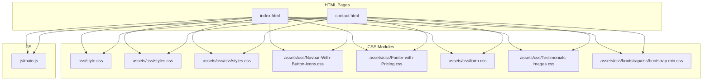
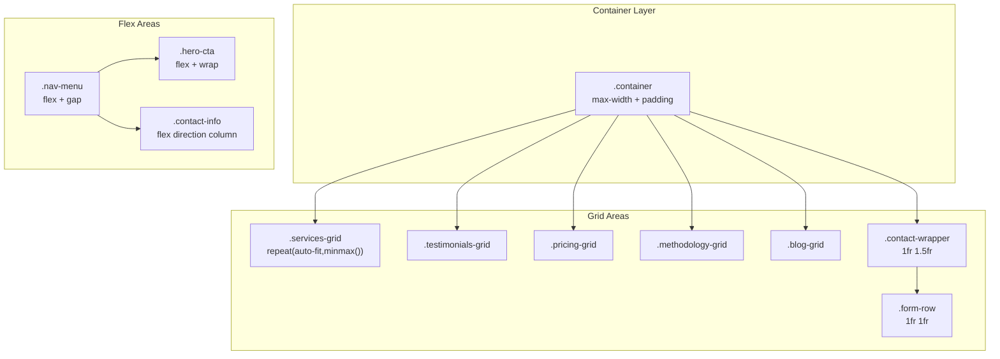
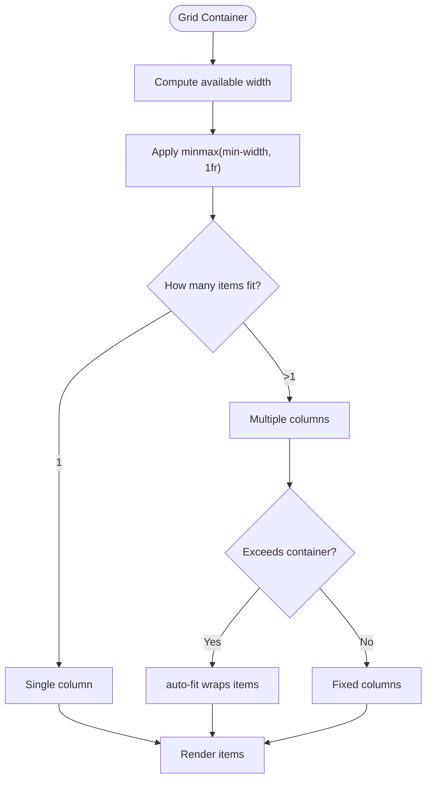
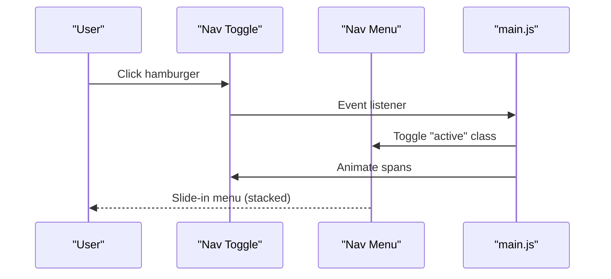
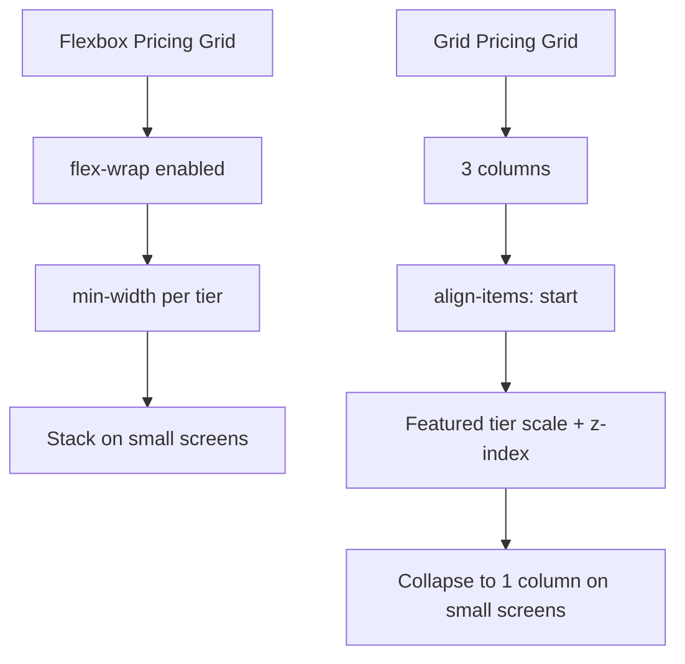
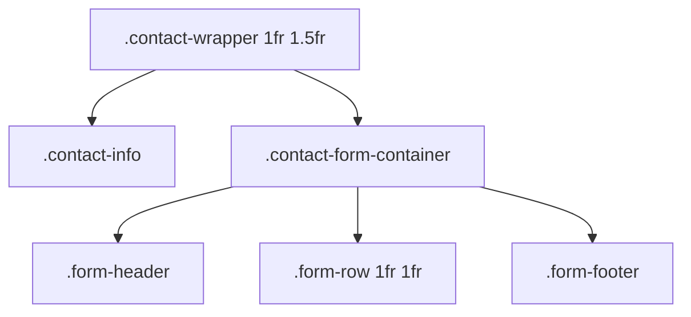
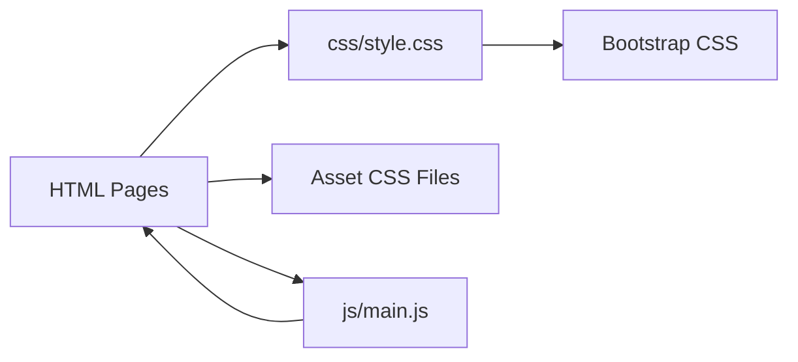

# Layout Systems: Grid & Flexbox

<cite>
**Referenced Files in This Document**
- [index.html](file://index.html)
- [contact.html](file://contact.html)
- [css/style.css](file://css/style.css)
- [assets/css/styles.css](file://assets/css/styles.css)
- [assets/css/css/styles.css](file://assets/css/css/styles.css)
- [assets/css/Navbar-With-Button-icons.css](file://assets/css/Navbar-With-Button-icons.css)
- [assets/css/Footer-with-Pricing.css](file://assets/css/Footer-with-Pricing.css)
- [assets/css/form.css](file://assets/css/form.css)
- [assets/css/Testimonials-images.css](file://assets/css/Testimonials-images.css)
- [assets/css/bootstrap/css/bootstrap.min.css](file://assets/css/bootstrap/css/bootstrap.min.css)
- [js/main.js](file://js/main.js)
</cite>

## Table of Contents
1. [Introduction](#introduction)
2. [Project Structure](#project-structure)
3. [Core Components](#core-components)
4. [Architecture Overview](#architecture-overview)
5. [Detailed Component Analysis](#detailed-component-analysis)
6. [Dependency Analysis](#dependency-analysis)
7. [Performance Considerations](#performance-considerations)
8. [Troubleshooting Guide](#troubleshooting-guide)
9. [Conclusion](#conclusion)
10. [Appendices](#appendices)

## Introduction
This document explains the layout system architecture with a focus on CSS Grid and Flexbox implementations. It covers:
- Responsive grid system using repeat(auto-fit, minmax()) for service cards, testimonials, pricing tiers, and blog grids
- Flexbox usage for navigation menus, hero sections, and contact options
- Container system with max-width constraints and padding strategies
- Practical examples of responsive breakpoint patterns, auto-placement algorithms, and alignment properties
- Mobile-first approach with progressive enhancement techniques
- Common layout challenges, browser compatibility considerations, and performance tips for complex grid layouts

## Project Structure
The layout system spans HTML pages, CSS modules, and a small JavaScript module:
- HTML pages define semantic sections and containers
- CSS files implement Grid and Flexbox patterns, responsive breakpoints, and container constraints
- JavaScript handles navigation toggles, smooth scrolling, and form enhancements

**Diagram sources**
- [index.html](file://index.html)
- [contact.html](file://contact.html)
- [css/style.css](file://css/style.css)
- [assets/css/styles.css](file://assets/css/styles.css)
- [assets/css/css/styles.css](file://assets/css/css/styles.css)
- [assets/css/Navbar-With-Button-icons.css](file://assets/css/Navbar-With-Button-icons.css)
- [assets/css/Footer-with-Pricing.css](file://assets/css/Footer-with-Pricing.css)
- [assets/css/form.css](file://assets/css/form.css)
- [assets/css/Testimonials-images.css](file://assets/css/Testimonials-images.css)
- [assets/css/bootstrap/css/bootstrap.min.css](file://assets/css/bootstrap/css/bootstrap.min.css)
- [js/main.js](file://js/main.js)

**Section sources**
- [index.html](file://index.html)
- [contact.html](file://contact.html)
- [css/style.css](file://css/style.css)

## Core Components
- Container system: centralizes max-width and horizontal padding for consistent spacing across sections
- Grid-based responsive cards: services, testimonials, pricing tiers, methodology steps, and blog cards
- Flexbox-based navigation and hero sections: alignment, wrapping, and responsive adjustments
- Contact page layout: two-column grid with responsive stacking and form grid patterns
- Icon and badge utilities: standardized sizing and alignment for icons and badges

Key implementation highlights:
- Grid auto-placement with repeat(auto-fit, minmax()) ensures equal-width cards that wrap responsively
- Flexbox for navigation items and hero CTA buttons enables flexible alignment and wrapping
- Media queries progressively adjust grid templates and container widths for different viewport sizes
- Utility classes for icon sizing and badge presentation support consistent visual rhythm

**Section sources**
- [css/style.css](file://css/style.css)
- [assets/css/styles.css](file://assets/css/styles.css)
- [assets/css/css/styles.css](file://assets/css/css/styles.css)
- [assets/css/Navbar-With-Button-icons.css](file://assets/css/Navbar-With-Button-icons.css)
- [assets/css/form.css](file://assets/css/form.css)

## Architecture Overview
The layout architecture combines:
- Semantic HTML sections with container wrappers
- CSS Grid for card-based content areas
- Flexbox for navigation and hero components
- Progressive enhancement via media queries and JavaScript

**Diagram sources**
- [css/style.css](file://css/style.css)
- [assets/css/form.css](file://assets/css/form.css)
- [index.html](file://index.html)
- [contact.html](file://contact.html)

## Detailed Component Analysis

### Container System
- Centralized container with max-width and horizontal padding ensures consistent spacing across sections
- Additional container constraints in asset CSS files refine max-width for specific contexts

Implementation patterns:
- Global container establishes baseline constraints
- Section-specific overrides adjust max-width for dense content areas (e.g., pricing footer)

Responsive behavior:
- Breakpoint-driven max-width adjustments for larger screens
- Consistent padding strategy prevents content from touching edges on small screens

**Section sources**
- [css/style.css](file://css/style.css)
- [assets/css/styles.css](file://assets/css/styles.css)
- [assets/css/css/styles.css](file://assets/css/css/styles.css)

### Grid Auto-Placement Patterns
Auto-placement algorithm using repeat(auto-fit, minmax()) ensures:
- Equal-width columns that adapt to available space
- Automatic wrapping when items exceed container width
- Minimum item width threshold to prevent excessive shrinking

Examples across components:
- Services grid: repeat(auto-fit, minmax(280px, 1fr))
- Testimonials grid: repeat(auto-fit, minmax(280px, 1fr))
- Reasons grid: repeat(auto-fit, minmax(300px, 1fr))
- Methodology steps: repeat(auto-fit, minmax(250px, 1fr))
- Blog grid: repeat(auto-fit, minmax(320px, 1fr))

Responsive adjustments:
- On smaller screens, grids collapse to single column
- Featured items may reorder or scale to emphasize priority

**Diagram sources**
- [css/style.css](file://css/style.css)

**Section sources**
- [css/style.css](file://css/style.css)
- [index.html](file://index.html)
- [contact.html](file://contact.html)

### Flexbox Navigation and Hero
Navigation menu:
- Uses Flexbox to distribute items horizontally
- Gap-based spacing for clean separation
- Responsive toggle behavior controlled by JavaScript

Hero section:
- Two-column grid layout for content and visuals
- Flexbox-based CTA area enabling wrapping and alignment
- Badge lists and hero cards arranged with Flexbox for consistent spacing

Responsive behavior:
- Navigation collapses to stacked layout on small screens
- Hero switches to single-column layout at narrower widths
- Flex-wrapped elements adapt to available space

**Diagram sources**
- [js/main.js](file://js/main.js)
- [css/style.css](file://css/style.css)

**Section sources**
- [css/style.css](file://css/style.css)
- [js/main.js](file://js/main.js)
- [index.html](file://index.html)

### Pricing Grid (Flexbox vs Grid)
Two distinct pricing layouts demonstrate different approaches:
- Flexbox-based pricing grid (asset CSS): flex-wrap with min-width constraints for tier cards
- Grid-based pricing grid (main CSS): fixed three-column grid with alignment and featured scaling

Responsive behavior:
- Flexbox variant stacks tiers vertically on small screens
- Grid variant collapses to single column and reorders featured tier for emphasis

**Diagram sources**
- [assets/css/styles.css](file://assets/css/styles.css)
- [css/style.css](file://css/style.css)

**Section sources**
- [assets/css/styles.css](file://assets/css/styles.css)
- [css/style.css](file://css/style.css)
- [index.html](file://index.html)

### Contact Page Layout
Contact page uses a two-column grid:
- Left column: contact information and features
- Right column: form container with nested grid rows

Form row pattern:
- Nested grid with two columns for compact field pairs
- Responsive adjustments for smaller screens

**Diagram sources**
- [css/style.css](file://css/style.css)
- [contact.html](file://contact.html)

**Section sources**
- [css/style.css](file://css/style.css)
- [contact.html](file://contact.html)

### Icon and Badge Utilities
Icon system:
- Standardized sizing via CSS variables and calculated dimensions
- Rounded and circle variants for consistent presentation

Badge system:
- Inline-flex presentation for compact labels
- Color and typography variations for emphasis

**Section sources**
- [assets/css/Navbar-With-Button-icons.css](file://assets/css/Navbar-With-Button-icons.css)
- [assets/css/styles.css](file://assets/css/styles.css)

## Dependency Analysis
The layout system integrates multiple CSS modules and HTML pages:
- Main stylesheet defines primary layout patterns and responsive breakpoints
- Asset stylesheets augment specific sections (pricing, testimonials, forms)
- Bootstrap CSS provides utility classes and responsive grid helpers
- JavaScript enhances navigation and form interactions

**Diagram sources**
- [css/style.css](file://css/style.css)
- [assets/css/bootstrap/css/bootstrap.min.css](file://assets/css/bootstrap/css/bootstrap.min.css)
- [js/main.js](file://js/main.js)
- [index.html](file://index.html)
- [contact.html](file://contact.html)

**Section sources**
- [css/style.css](file://css/style.css)
- [assets/css/bootstrap/css/bootstrap.min.css](file://assets/css/bootstrap/css/bootstrap.min.css)
- [js/main.js](file://js/main.js)

## Performance Considerations
- Prefer CSS Grid for complex multi-dimensional layouts; Flexbox for single-axis alignment
- Use minmax() with reasonable minimum widths to avoid excessive reflows on small screens
- Limit deep nesting in grid containers to reduce paint costs
- Leverage transform-based animations (scale, translateY) for hover effects to avoid layout thrashing
- Minimize media queries by grouping related changes and using mobile-first defaults
- Use contain: layout and contain: paint for heavy components to isolate layout impact

## Troubleshooting Guide
Common layout issues and remedies:
- Items collapsing on small screens: ensure min-width thresholds are set appropriately in repeat(auto-fit, minmax())
- Misaligned hero visuals: verify grid-template-columns and align-items properties
- Navigation overflow on mobile: confirm flex-direction and gap usage; test with flex-wrap
- Form field overlap: check nested grid template columns and ensure adequate gap spacing
- Sticky header conflicts: review z-index and positioning in combination with scroll events

Browser compatibility:
- Grid and Flexbox are broadly supported; use unprefixed properties for modern browsers
- For older browsers, consider adding vendor prefixes selectively and testing fallbacks
- Validate media query breakpoints across devices and orientations

Accessibility:
- Ensure sufficient color contrast in grid backgrounds and hover states
- Provide keyboard navigation support for interactive elements
- Use semantic HTML to improve screen reader comprehension

**Section sources**
- [css/style.css](file://css/style.css)
- [js/main.js](file://js/main.js)

## Conclusion
The layout system employs a hybrid approach combining CSS Grid and Flexbox to achieve responsive, maintainable designs. Grid excels at auto-placing content blocks with repeat(auto-fit, minmax()), while Flexbox provides precise alignment and wrapping for navigation and hero components. The container system enforces consistent spacing, and progressive enhancement via media queries ensures optimal experiences across devices. By following the patterns outlined here, teams can build scalable, accessible layouts that remain performant and maintainable.

## Appendices

### Responsive Breakpoint Patterns
- Mobile-first defaults with progressive enhancements
- Breakpoints at 768px and 992px for major layout shifts
- Additional fine-tuning at 1200px and 1400px for larger displays

### Alignment Properties Reference
- Flexbox alignment: justify-content, align-items, gap
- Grid alignment: place-items, justify-items, align-content
- Text and icon alignment: vertical-align, text-align, display:flex

### Practical Examples Index
- Services grid: [css/style.css](file://css/style.css)
- Testimonials grid: [css/style.css](file://css/style.css)
- Pricing grid (Flexbox): [assets/css/styles.css](file://assets/css/styles.css)
- Pricing grid (Grid): [css/style.css](file://css/style.css)
- Contact wrapper: [css/style.css](file://css/style.css)
- Navigation menu: [css/style.css](file://css/style.css)
- Hero CTA: [css/style.css](file://css/style.css)