# Responsive Design & Mobile-First Approach

<cite>
**Referenced Files in This Document**
- [index.html](file://index.html)
- [contact.html](file://contact.html)
- [css/style.css](file://css/style.css)
- [assets/css/styles.css](file://assets/css/styles.css)
- [assets/css/form.css](file://assets/css/form.css)
- [assets/css/Navbar-With-Button-icons.css](file://assets/css/Navbar-With-Button-icons.css)
- [js/main.js](file://js/main.js)
- [README.md](file://README.md)
</cite>

## Table of Contents
1. [Introduction](#introduction)
2. [Project Structure](#project-structure)
3. [Core Components](#core-components)
4. [Architecture Overview](#architecture-overview)
5. [Detailed Component Analysis](#detailed-component-analysis)
6. [Dependency Analysis](#dependency-analysis)
7. [Performance Considerations](#performance-considerations)
8. [Troubleshooting Guide](#troubleshooting-guide)
9. [Conclusion](#conclusion)
10. [Appendices](#appendices)

## Introduction
This document explains how the project implements responsive design using a mobile-first methodology. It covers breakpoint strategies, media query patterns, container-based layouts, fluid typography, mobile navigation patterns (including the hamburger menu), content reflow, image scaling, component adaptation, touch-friendly interface elements, mobile-specific interactions, performance considerations, progressive enhancement, graceful degradation, and practical testing and debugging guidance.

## Project Structure
The project follows a mobile-first approach with:
- A single-page application (SPA) concept using hash-based navigation
- A dedicated contact page with a full form
- CSS Grid and Flexbox for flexible layouts
- Media queries for responsive breakpoints
- JavaScript for interactive behaviors (navigation toggle, smooth scrolling, scroll animations, form validation)

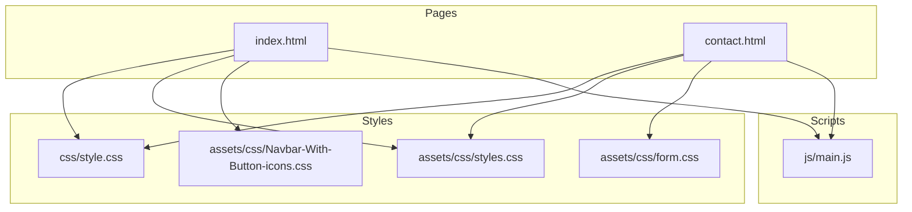

**Diagram sources**
- [index.html:1-522](file://index.html#L1-L522)
- [contact.html:1-291](file://contact.html#L1-L291)
- [css/style.css:1-1886](file://css/style.css#L1-L1886)
- [assets/css/styles.css:1-339](file://assets/css/styles.css#L1-L339)
- [assets/css/form.css:1-73](file://assets/css/form.css#L1-L73)
- [assets/css/Navbar-With-Button-icons.css:1-58](file://assets/css/Navbar-With-Button-icons.css#L1-L58)
- [js/main.js:1-338](file://js/main.js#L1-L338)

**Section sources**
- [README.md:1-401](file://README.md#L1-L401)
- [index.html:1-522](file://index.html#L1-L522)
- [contact.html:1-291](file://contact.html#L1-L291)

## Core Components
- Mobile-first navigation with a hamburger menu that activates on small screens
- Container-based layouts using a max-width container with centered content
- Fluid typography scales with relative units and responsive font sizes
- Grid and Flexbox layouts that adapt across breakpoints
- JavaScript-driven interactions: navigation toggle, smooth scrolling, scroll animations, and form validation
- Touch-friendly elements: large tap targets, spacing, and hover/focus states for accessibility

**Section sources**
- [css/style.css:37-41](file://css/style.css#L37-L41)
- [css/style.css:130-144](file://css/style.css#L130-L144)
- [js/main.js:4-42](file://js/main.js#L4-L42)
- [js/main.js:47-62](file://js/main.js#L47-L62)
- [js/main.js:202-231](file://js/main.js#L202-L231)

## Architecture Overview
The responsive architecture centers on:
- Mobile-first CSS with progressively enhanced breakpoints
- Semantic HTML with accessible navigation and ARIA attributes
- JavaScript that enhances UX without breaking on failure
- Media queries targeting common device widths

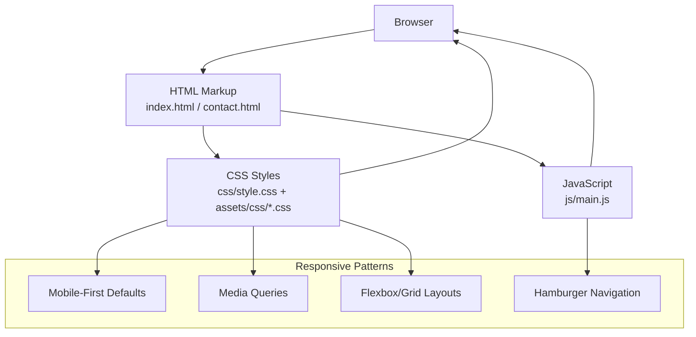

**Diagram sources**
- [css/style.css:1-1886](file://css/style.css#L1-L1886)
- [assets/css/styles.css:1-339](file://assets/css/styles.css#L1-L339)
- [js/main.js:1-338](file://js/main.js#L1-L338)

## Detailed Component Analysis

### Mobile Navigation (Hamburger Menu)
The navigation uses a mobile-first approach:
- Desktop navigation is visible by default
- On smaller screens, the hamburger menu becomes visible and toggles the menu visibility
- JavaScript animates the hamburger icon into an X when opened

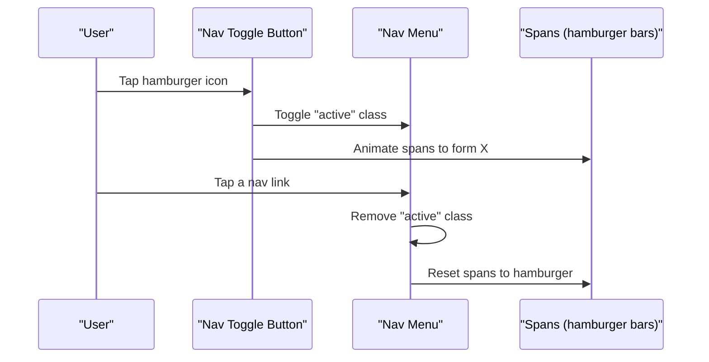

**Diagram sources**
- [index.html:32-45](file://index.html#L32-L45)
- [js/main.js:9-41](file://js/main.js#L9-L41)

**Section sources**
- [css/style.css:130-144](file://css/style.css#L130-L144)
- [js/main.js:9-41](file://js/main.js#L9-L41)

### Container-Based Layouts
The project uses a centered container with a max-width to constrain content width while allowing flexible padding:
- The container centers content and applies horizontal padding
- Grid and Flexbox layouts inside sections adapt to available space

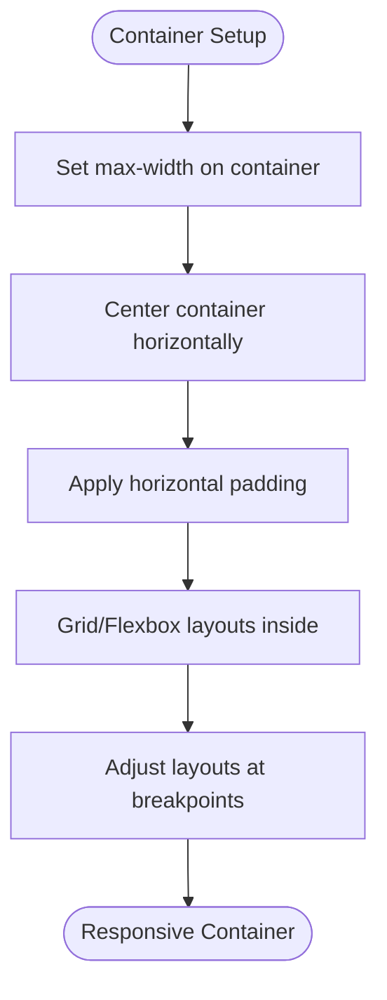

**Diagram sources**
- [css/style.css:37-41](file://css/style.css#L37-L41)
- [assets/css/styles.css:106-110](file://assets/css/styles.css#L106-L110)

**Section sources**
- [css/style.css:37-41](file://css/style.css#L37-L41)
- [assets/css/styles.css:106-110](file://assets/css/styles.css#L106-L110)

### Fluid Typography Scaling
Typography scales using relative units and responsive font sizes:
- Root-level variables define consistent sizing and spacing
- Headings and paragraphs use relative units to scale smoothly across viewports
- Media queries adjust font sizes for larger screens

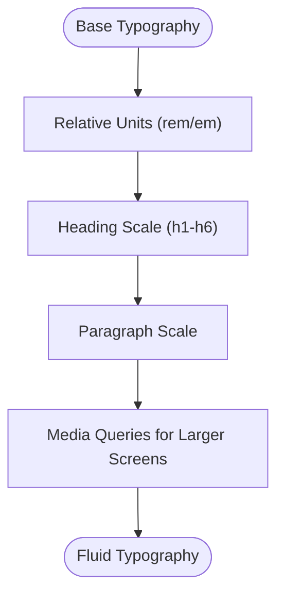

**Diagram sources**
- [css/style.css:10-24](file://css/style.css#L10-L24)
- [css/style.css:163-178](file://css/style.css#L163-L178)
- [assets/css/styles.css:41-49](file://assets/css/styles.css#L41-L49)

**Section sources**
- [css/style.css:10-24](file://css/style.css#L10-L24)
- [css/style.css:163-178](file://css/style.css#L163-L178)
- [assets/css/styles.css:41-49](file://assets/css/styles.css#L41-L49)

### Content Reflow and Grid Adaptation
Content adapts using CSS Grid and Flexbox:
- Auto-fit and minmax create flexible card grids that reflow based on available space
- Media queries adjust grid column counts and item widths for tablets and desktops
- Flexbox handles alignment and wrapping for smaller screens

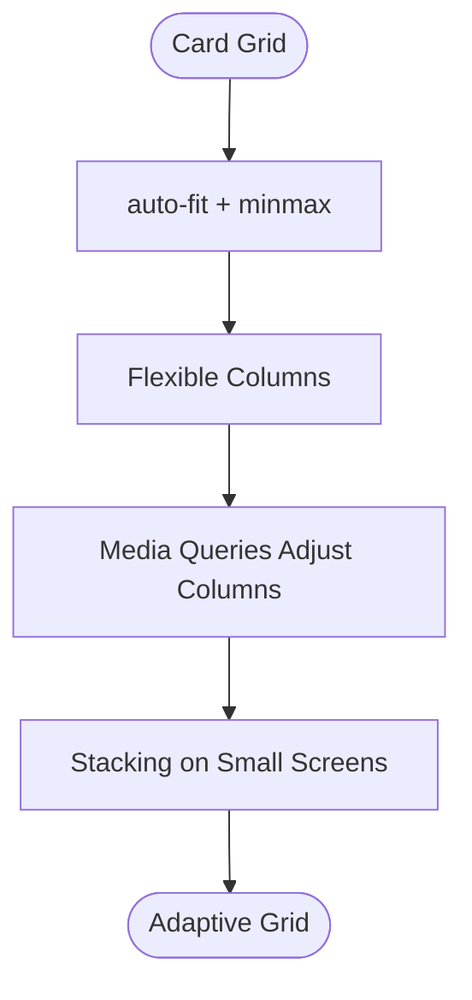

**Diagram sources**
- [css/style.css:381-385](file://css/style.css#L381-L385)
- [assets/css/styles.css:122-127](file://assets/css/styles.css#L122-L127)
- [assets/css/styles.css:304-318](file://assets/css/styles.css#L304-L318)

**Section sources**
- [css/style.css:381-385](file://css/style.css#L381-L385)
- [assets/css/styles.css:122-127](file://assets/css/styles.css#L122-L127)
- [assets/css/styles.css:304-318](file://assets/css/styles.css#L304-L318)

### Image Scaling and Hero Section Responsiveness
The hero section demonstrates responsive image scaling and layout adjustments:
- Background gradients and overlays provide visual consistency
- Media queries increase hero heights on larger screens
- Content remains readable and centered across breakpoints

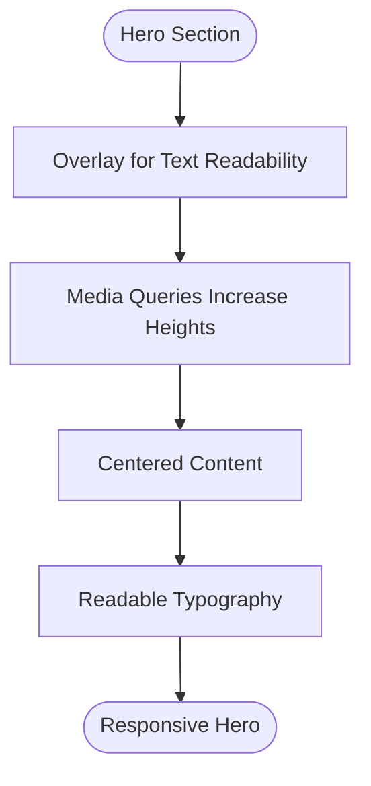

**Diagram sources**
- [assets/css/styles.css:21-30](file://assets/css/styles.css#L21-L30)
- [assets/css/styles.css:56-77](file://assets/css/styles.css#L56-L77)

**Section sources**
- [assets/css/styles.css:21-30](file://assets/css/styles.css#L21-L30)
- [assets/css/styles.css:56-77](file://assets/css/styles.css#L56-L77)

### Touch-Friendly Interface Elements
Touch interactions are optimized:
- Large tap targets for buttons and navigation items
- Hover and focus states for keyboard and mouse users
- Smooth transitions and animations for feedback
- Floating WhatsApp button for quick access

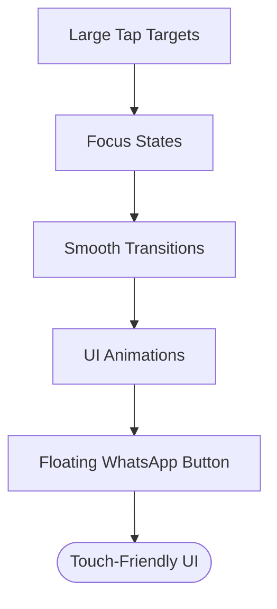

**Diagram sources**
- [css/style.css:236-283](file://css/style.css#L236-L283)
- [js/main.js:202-231](file://js/main.js#L202-L231)
- [index.html:513-517](file://index.html#L513-L517)

**Section sources**
- [css/style.css:236-283](file://css/style.css#L236-L283)
- [js/main.js:202-231](file://js/main.js#L202-L231)
- [index.html:513-517](file://index.html#L513-L517)

### Mobile-Specific Interactions
Mobile interactions include:
- Smooth scrolling to sections with an offset for fixed headers
- Scroll animations triggered when elements enter the viewport
- Active navigation highlighting based on scroll position
- Form validation and user feedback

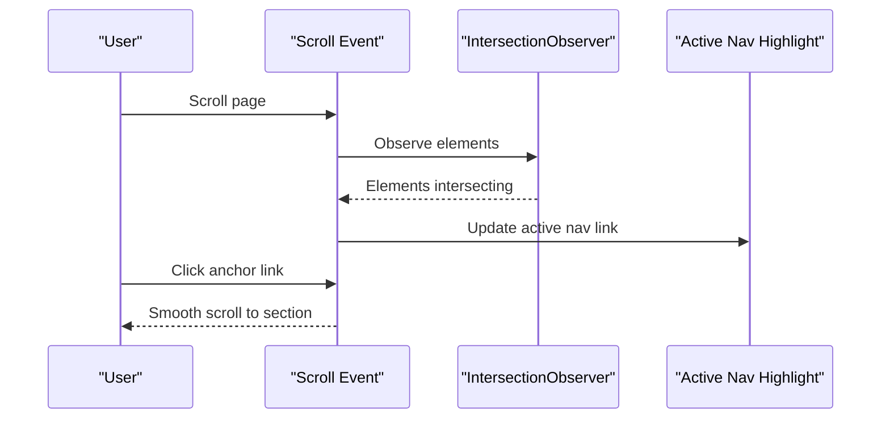

**Diagram sources**
- [js/main.js:47-62](file://js/main.js#L47-L62)
- [js/main.js:202-231](file://js/main.js#L202-L231)
- [js/main.js:236-260](file://js/main.js#L236-L260)

**Section sources**
- [js/main.js:47-62](file://js/main.js#L47-L62)
- [js/main.js:202-231](file://js/main.js#L202-L231)
- [js/main.js:236-260](file://js/main.js#L236-L260)

### Progressive Enhancement and Graceful Degradation
- JavaScript enhancements (navigation toggle, smooth scrolling, animations) are layered on top of semantic HTML
- If JavaScript fails, the navigation remains accessible via standard anchor links
- CSS Grid and Flexbox provide fallbacks for older browsers
- Media queries enhance layouts on capable devices

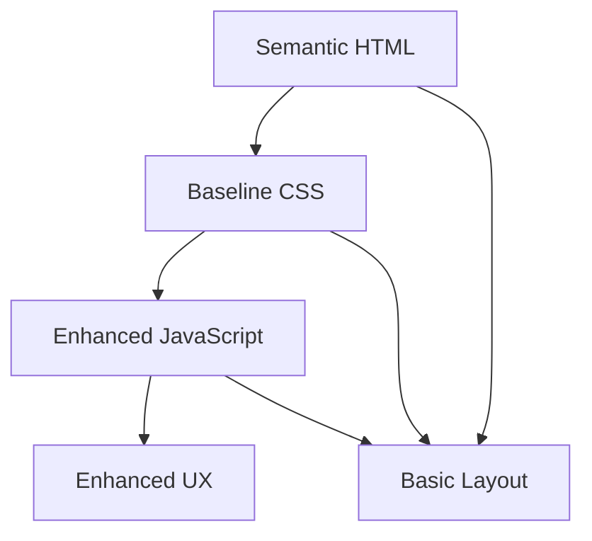

**Diagram sources**
- [index.html:1-522](file://index.html#L1-L522)
- [js/main.js:1-338](file://js/main.js#L1-L338)

**Section sources**
- [index.html:1-522](file://index.html#L1-L522)
- [js/main.js:1-338](file://js/main.js#L1-L338)

## Dependency Analysis
The responsive design relies on:
- CSS Grid and Flexbox for layout flexibility
- Media queries for breakpoint-based adaptations
- JavaScript for interactive enhancements
- Icon and font libraries for visual consistency

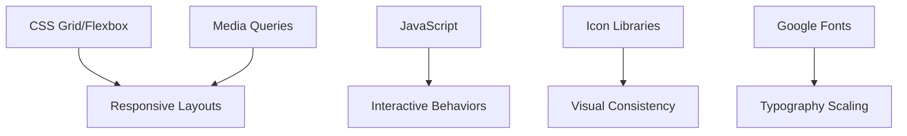

**Diagram sources**
- [css/style.css:1-1886](file://css/style.css#L1-L1886)
- [assets/css/styles.css:1-339](file://assets/css/styles.css#L1-L339)
- [js/main.js:1-338](file://js/main.js#L1-L338)

**Section sources**
- [css/style.css:1-1886](file://css/style.css#L1-L1886)
- [assets/css/styles.css:1-339](file://assets/css/styles.css#L1-L339)
- [js/main.js:1-338](file://js/main.js#L1-L338)

## Performance Considerations
- Minimal external dependencies reduce load times
- CDN-hosted libraries improve caching and delivery
- Optimized CSS and efficient JavaScript keep rendering fast
- Smooth animations and transitions are hardware-accelerated where possible
- Lazy-loading strategies can be considered for images and videos

[No sources needed since this section provides general guidance]

## Troubleshooting Guide
Common responsive design issues and solutions:
- Hamburger menu not opening: verify the toggle button exists and JavaScript is loaded
- Navigation links not closing the menu: ensure event listeners are attached to all links
- Scroll animations not triggering: confirm IntersectionObserver is supported and elements have correct classes
- Media query conflicts: check specificity and order of CSS rules
- Touch target sizing: ensure interactive elements meet minimum touch target sizes

**Section sources**
- [js/main.js:9-41](file://js/main.js#L9-L41)
- [js/main.js:202-231](file://js/main.js#L202-L231)
- [css/style.css:130-144](file://css/style.css#L130-L144)

## Conclusion
The project successfully implements a mobile-first responsive design using semantic HTML, CSS Grid and Flexbox, and progressive JavaScript enhancements. Breakpoint strategies and media queries ensure content adapts gracefully across devices, while touch-friendly interactions and accessibility features improve usability. The architecture supports performance and maintainability, and the troubleshooting guidance helps address common responsive issues.

[No sources needed since this section summarizes without analyzing specific files]

## Appendices

### Breakpoint Strategies and Media Query Patterns
- Mobile-first defaults with progressively enhanced breakpoints
- Common breakpoints used: 768px, 1200px, and larger viewports
- Media queries adjust hero heights, grid layouts, and component widths
- Container max-width constraints remain consistent across breakpoints

**Section sources**
- [assets/css/styles.css:56-77](file://assets/css/styles.css#L56-L77)
- [assets/css/styles.css:106-110](file://assets/css/styles.css#L106-L110)
- [assets/css/styles.css:304-318](file://assets/css/styles.css#L304-L318)

### Testing Responsive Designs Across Devices
- Use browser dev tools to simulate various screen sizes
- Test on physical devices (phones, tablets, laptops)
- Validate navigation, touch targets, and media queries
- Check performance metrics and rendering behavior

**Section sources**
- [README.md:186-200](file://README.md#L186-L200)