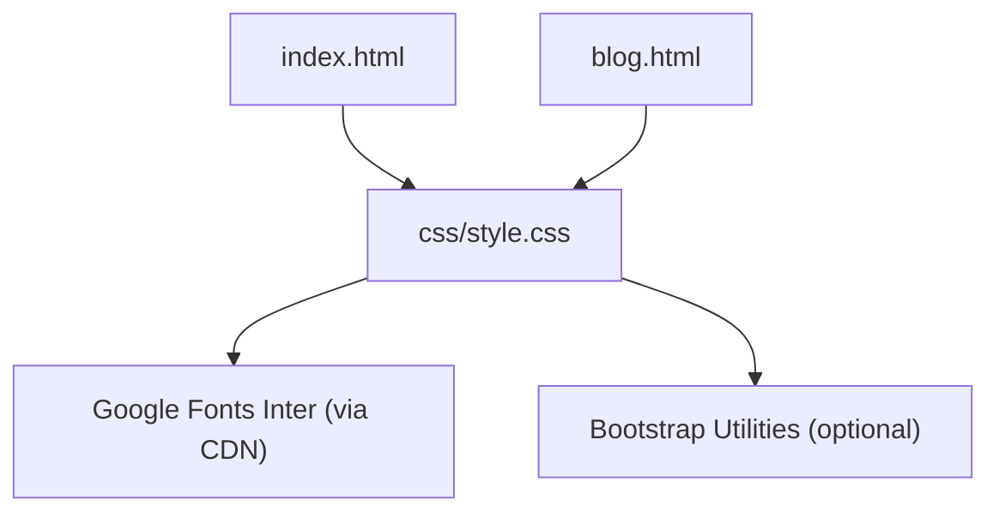
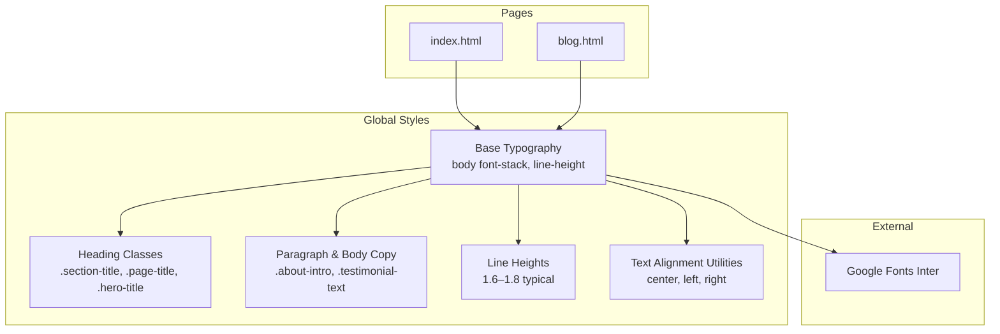
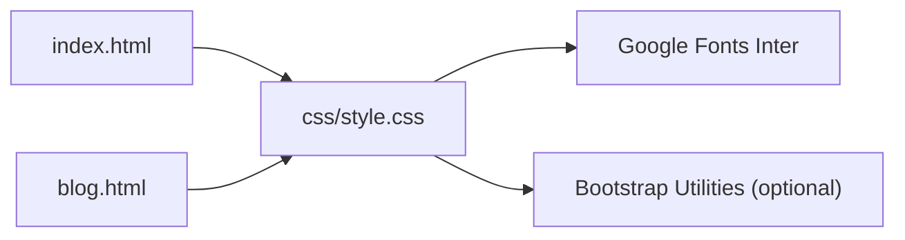

# Typography System

<cite>
**Referenced Files in This Document**
- [style.css](file://css/style.css)
- [index.html](file://index.html)
- [blog.html](file://blog.html)
- [bootstrap.min.css](file://assets/css/bootstrap/css/bootstrap.min.css)
</cite>

## Table of Contents
1. [Introduction](#introduction)
2. [Project Structure](#project-structure)
3. [Core Components](#core-components)
4. [Architecture Overview](#architecture-overview)
5. [Detailed Component Analysis](#detailed-component-analysis)
6. [Dependency Analysis](#dependency-analysis)
7. [Performance Considerations](#performance-considerations)
8. [Troubleshooting Guide](#troubleshooting-guide)
9. [Conclusion](#conclusion)

## Introduction
This document describes the typography system used across the website, focusing on font stack management, sizing scales, typographic hierarchy, responsive scaling, font weights, line heights, text alignment patterns, font loading strategies, performance optimizations, and accessibility considerations. The site integrates Google Fonts Inter with a robust fallback chain and applies consistent typography across pages and components.

## Project Structure
The typography system is primarily defined in the global stylesheet and consumed by HTML templates. The key files involved are:
- Global CSS defining base typography and component-specific styles
- HTML pages that include the stylesheet and load Inter from Google Fonts
- Bootstrap CSS providing additional typography utilities and responsive scales

**Diagram sources**
- [index.html:19](file://index.html#L19)
- [blog.html:22](file://blog.html#L22)
- [style.css:30](file://css/style.css#L30)

**Section sources**
- [index.html:19](file://index.html#L19)
- [blog.html:22](file://blog.html#L22)
- [style.css:30](file://css/style.css#L30)

## Core Components
- Font stack: Inter with system-safe fallbacks
- Base font size and line height for body text
- Heading hierarchy and font weights
- Body copy and paragraph styles
- Responsive typography scaling
- Text alignment utilities
- Accessibility and readability considerations

**Section sources**
- [style.css:30](file://css/style.css#L30)
- [style.css:31](file://css/style.css#L31)
- [style.css:33](file://css/style.css#L33)
- [style.css:213](file://css/style.css#L213)

## Architecture Overview
The typography architecture centers on a single global stylesheet that sets the base font stack and line height, and component classes that refine typography for specific contexts. Pages include the stylesheet and the Inter font via Google Fonts.

**Diagram sources**
- [style.css:30](file://css/style.css#L30)
- [style.css:31](file://css/style.css#L31)
- [style.css:33](file://css/style.css#L33)
- [style.css:311](file://css/style.css#L311)
- [style.css:845](file://css/style.css#L845)
- [style.css:1600](file://css/style.css#L1600)
- [style.css:342](file://css/style.css#L342)
- [style.css:9707](file://css/style.css#L9707)

## Detailed Component Analysis

### Font Stack Management
- Base font stack: Inter with system-safe fallbacks ensures reliable rendering across devices and platforms.
- Fallback chain includes system UI fonts and generic sans-serif to guarantee text availability.

Implementation highlights:
- Global body font stack and line height set at the root level.
- Additional font families used selectively for specific elements (e.g., quotes).

**Section sources**
- [style.css:30](file://css/style.css#L30)
- [style.css:31](file://css/style.css#L31)
- [style.css:73](file://css/style.css#L73)
- [style.css:98](file://css/style.css#L98)

### Google Fonts Inter Integration
- Inter is loaded via Google Fonts with a predefined weight range.
- The stylesheet links to the Inter subset and display strategy are applied at the page level.

Integration details:
- Link tag includes Inter weights and display parameter.
- Font is referenced in the global font stack.

**Section sources**
- [index.html:20](file://index.html#L20)
- [blog.html:23](file://blog.html#L23)
- [style.css:31](file://css/style.css#L31)

### Font Size Scale and Progression
The project defines a clear typographic scale progressing from headings to body copy:
- Display headings: hero titles and page titles use larger sizes with reduced line height for impact.
- Section headings: section titles and page titles use moderate sizes with balanced line heights.
- Body copy: paragraphs and descriptions use smaller sizes with generous line heights for readability.
- Micro copy: badges, labels, and metadata use progressively smaller sizes.

Responsive progression:
- Headings scale down on smaller screens while maintaining hierarchy.
- Body copy adjusts font sizes and line heights for mobile readability.

Examples of scale usage:
- Hero title: large size with tight line height for prominence.
- Section title: medium size with balanced line height.
- Paragraph intro: slightly larger than base body text with increased line height for readability.
- Micro copy: small sizes with compact spacing.

**Section sources**
- [style.css:163](file://css/style.css#L163)
- [style.css:311](file://css/style.css#L311)
- [style.css:845](file://css/style.css#L845)
- [style.css:1600](file://css/style.css#L1600)
- [style.css:341](file://css/style.css#L341)
- [style.css:1280](file://css/style.css#L1280)
- [style.css:1284](file://css/style.css#L1284)
- [style.css:1288](file://css/style.css#L1288)
- [style.css:1313](file://css/style.css#L1313)

### Font Weight Usage and Semantic Emphasis
- Bold weights are used for headings and emphasis to establish hierarchy and readability.
- Semantic boldness is applied to headings (e.g., section titles, page titles) to signal importance.
- Body copy uses lighter weights to reduce visual density and improve scanning.

Weight patterns:
- Headings: bold weights for prominence.
- Body text: lighter weights for readability.
- Emphasis: bold for strong emphasis within paragraphs.

**Section sources**
- [style.css:69](file://css/style.css#L69)
- [style.css:70](file://css/style.css#L70)
- [style.css:312](file://css/style.css#L312)
- [style.css:313](file://css/style.css#L313)
- [style.css:846](file://css/style.css#L846)
- [style.css:847](file://css/style.css#L847)
- [style.css:1601](file://css/style.css#L1601)
- [style.css:1602](file://css/style.css#L1602)
- [style.css:314](file://css/style.css#L314)
- [style.css:342](file://css/style.css#L342)

### Line Height Calculations for Readability
- Base line height is set globally for body text to balance readability and visual density.
- Headings use tighter line heights to maintain prominence and spacing.
- Body copy uses increased line heights to improve readability, especially for longer paragraphs.

Typical line heights:
- Body text: moderate line height for comfortable reading.
- Headings: tighter line heights to keep text stacked closely.
- Paragraphs: increased line heights for extended reading.

**Section sources**
- [style.css:33](file://css/style.css#L33)
- [style.css:1644](file://css/style.css#L1644)
- [style.css:1645](file://css/style.css#L1645)
- [style.css:343](file://css/style.css#L343)
- [style.css:547](file://css/style.css#L547)

### Text Alignment Patterns
- Center alignment is used for hero sections and page titles to create visual emphasis.
- Left alignment is used for body content to optimize reading flow.
- Utility classes are available for responsive alignment across components.

Alignment usage:
- Section headers and page titles often centered for prominence.
- Body content remains left-aligned for optimal reading.

**Section sources**
- [style.css:293](file://css/style.css#L293)
- [style.css:845](file://css/style.css#L845)
- [style.css:9707](file://css/style.css#L9707)

### Responsive Typography Scaling
- Headings scale down on smaller screens while preserving hierarchy.
- Body copy adapts font sizes and line heights for mobile readability.
- Media queries adjust typography for tablet and mobile breakpoints.

Responsive adjustments:
- Hero title reduces size on smaller screens.
- Section titles and page titles adapt to smaller viewports.
- Body copy maintains legibility with adjusted line heights.

**Section sources**
- [style.css:1280](file://css/style.css#L1280)
- [style.css:1284](file://css/style.css#L1284)
- [style.css:1288](file://css/style.css#L1288)
- [style.css:1313](file://css/style.css#L1313)

### Font Loading Strategies and Performance
- Inter is loaded via Google Fonts with a display strategy parameter to control font rendering behavior.
- The stylesheet includes the Inter subset and weight range to minimize payload.
- Consider adding font-display: swap or optional for improved performance.

Optimization opportunities:
- Add font-display property to the Inter stylesheet link.
- Consider preloading the font for critical paths.
- Evaluate using font-display: optional for non-critical text.

**Section sources**
- [index.html:20](file://index.html#L20)
- [blog.html:23](file://blog.html#L23)

### Accessibility Considerations
- Color contrast between text and backgrounds meets basic accessibility guidelines.
- Line heights and font weights support readability for diverse audiences.
- Semantic heading usage helps screen readers navigate content effectively.

Accessibility practices:
- Maintain sufficient contrast ratios for text.
- Use bold weights for headings to aid navigation.
- Ensure readable line heights for extended reading.

**Section sources**
- [style.css:32](file://css/style.css#L32)
- [style.css:312](file://css/style.css#L312)
- [style.css:33](file://css/style.css#L33)

### Heading Hierarchy and Semantic HTML
- Semantic headings are used consistently across pages to establish a clear hierarchy.
- Headings progress from largest to smallest, reinforcing content structure.
- Components use heading classes to maintain consistent hierarchy.

Semantic usage:
- Page titles and section titles use appropriate heading levels.
- Components define heading sizes and weights to preserve hierarchy.

**Section sources**
- [style.css:213](file://css/style.css#L213)
- [style.css:311](file://css/style.css#L311)
- [style.css:845](file://css/style.css#L845)
- [style.css:1600](file://css/style.css#L1600)

## Dependency Analysis
The typography system depends on:
- Global stylesheet for base font stack and line height
- Google Fonts Inter for the primary font
- Optional Bootstrap utilities for additional typography helpers

**Diagram sources**
- [style.css:30](file://css/style.css#L30)
- [index.html:20](file://index.html#L20)
- [blog.html:23](file://blog.html#L23)
- [style.css:9707](file://css/style.css#L9707)

**Section sources**
- [style.css:30](file://css/style.css#L30)
- [index.html:20](file://index.html#L20)
- [blog.html:23](file://blog.html#L23)
- [style.css:9707](file://css/style.css#L9707)

## Performance Considerations
- Font loading: Use font-display swap or optional to prevent layout shifts and improve perceived performance.
- Subset selection: Load only necessary character subsets to reduce payload.
- Weight range: Limit font weights to those actually used to minimize download size.
- Preload critical fonts for above-the-fold content.

[No sources needed since this section provides general guidance]

## Troubleshooting Guide
Common typography issues and resolutions:
- Fallback fonts not rendering: Verify the font stack includes system-safe fallbacks.
- Readability problems on mobile: Adjust line heights and font sizes for smaller screens.
- Contrast issues: Ensure sufficient contrast between text and background colors.
- Layout shifts during font load: Add font-display swap to the font link.

**Section sources**
- [style.css:31](file://css/style.css#L31)
- [style.css:33](file://css/style.css#L33)
- [index.html:20](file://index.html#L20)

## Conclusion
The typography system establishes a consistent, readable, and accessible foundation using Inter as the primary font with robust fallbacks. The defined scale, weights, and line heights create a clear hierarchy, while responsive adjustments ensure readability across devices. By optimizing font loading and maintaining semantic HTML, the system balances performance, accessibility, and visual coherence.