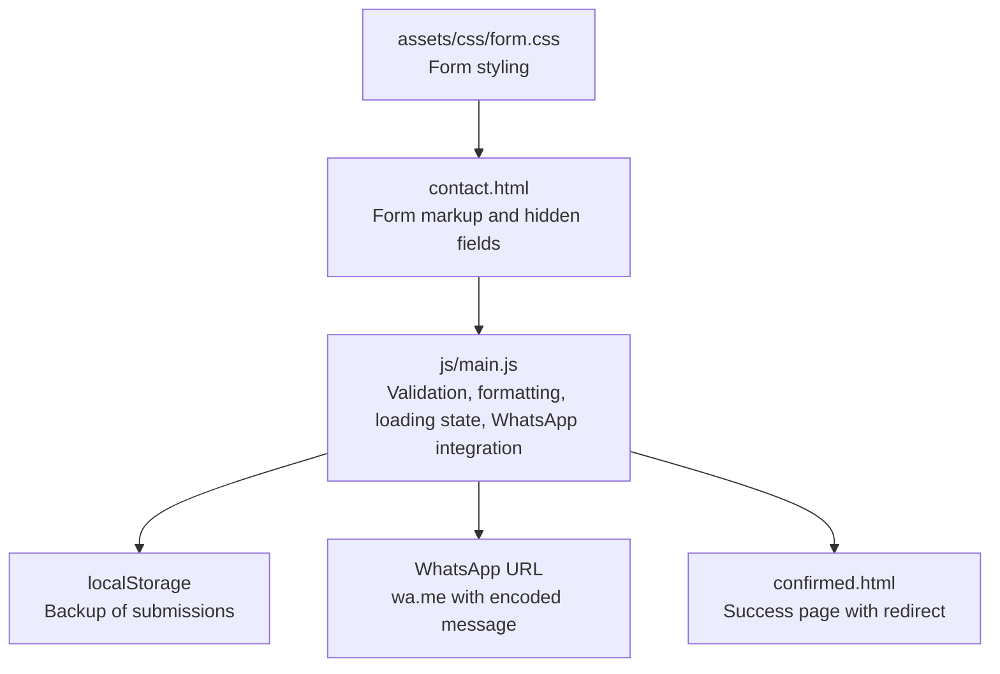
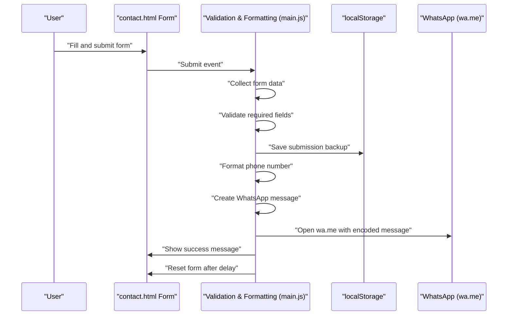
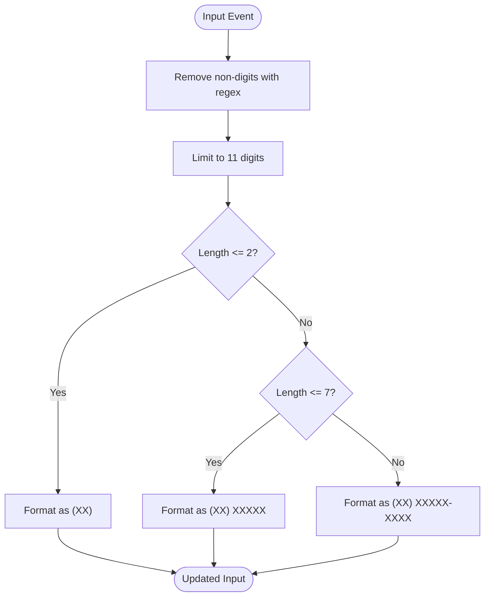
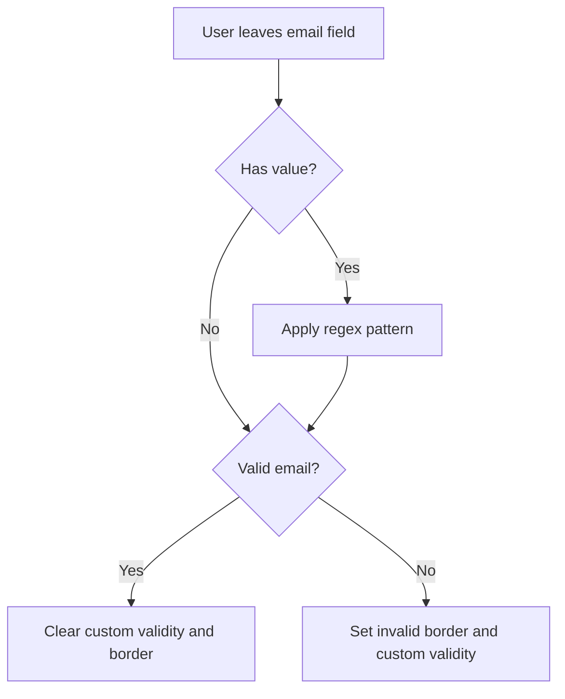
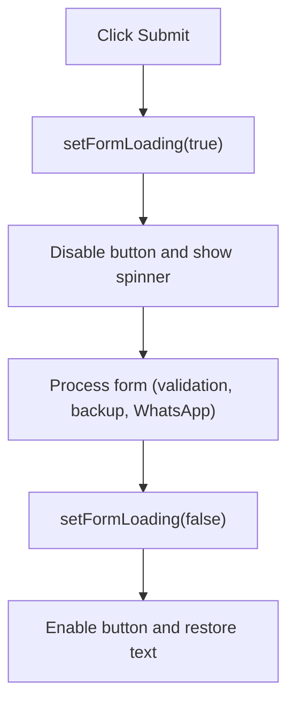
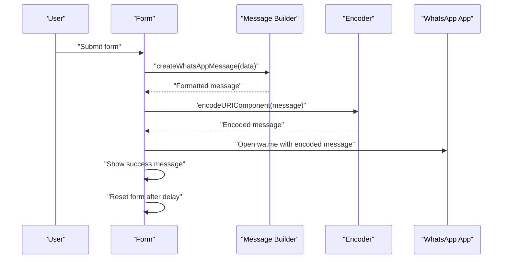
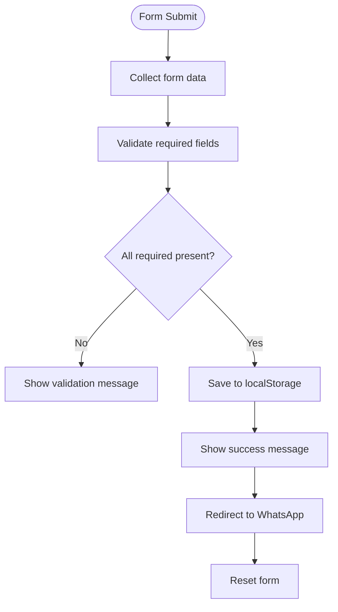
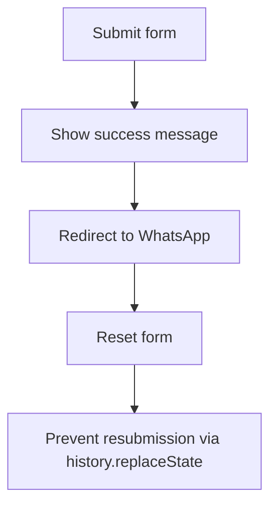
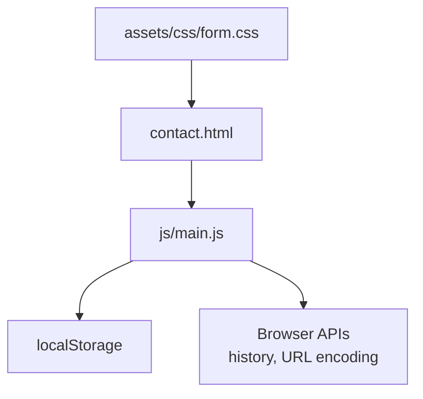

# Form Handling & Validation

<cite>
**Referenced Files in This Document**
- [contact.html](file://contact.html)
- [main.js](file://js/main.js)
- [form.css](file://assets/css/form.css)
- [README.md](file://README.md)
- [confirmed.html](file://confirmed.html)
</cite>

## Table of Contents
1. [Introduction](#introduction)
2. [Project Structure](#project-structure)
3. [Core Components](#core-components)
4. [Architecture Overview](#architecture-overview)
5. [Detailed Component Analysis](#detailed-component-analysis)
6. [Dependency Analysis](#dependency-analysis)
7. [Performance Considerations](#performance-considerations)
8. [Troubleshooting Guide](#troubleshooting-guide)
9. [Conclusion](#conclusion)

## Introduction
This document explains the form handling and validation system for the contact form, with a focus on:
- Phone number formatting for Brazilian phone numbers, including regex patterns, input masking, and character validation
- Email validation using regex patterns with real-time feedback and custom validity messages
- Form loading state management with spinner animations and button state changes
- WhatsApp integration system including message template creation, URL encoding, and automatic redirection
- Form data collection, validation logic, error handling strategies, and localStorage backup implementation
- Form reset functionality, prevention of resubmission, and security considerations for client-side validation

## Project Structure
The contact form is implemented on a dedicated page with supporting JavaScript and CSS:
- contact.html: Contains the form markup and hidden fields for third-party submission
- js/main.js: Implements phone formatting, email validation, loading state, and form handling logic
- assets/css/form.css: Provides basic form styling
- confirmed.html: Confirmation page shown after successful submission
- README.md: Documents the form data flow and privacy policy

**Diagram sources**
- [contact.html:141-204](file://contact.html#L141-L204)
- [main.js:79-107](file://js/main.js#L79-L107)
- [main.js:279-287](file://js/main.js#L279-L287)
- [main.js:293-304](file://js/main.js#L293-L304)
- [main.js:177-197](file://js/main.js#L177-L197)
- [confirmed.html:105-117](file://confirmed.html#L105-L117)
- [form.css:1-73](file://assets/css/form.css#L1-L73)

**Section sources**
- [contact.html:141-204](file://contact.html#L141-L204)
- [main.js:79-107](file://js/main.js#L79-L107)
- [main.js:279-287](file://js/main.js#L279-L287)
- [main.js:293-304](file://js/main.js#L293-L304)
- [main.js:177-197](file://js/main.js#L177-L197)
- [confirmed.html:105-117](file://confirmed.html#L105-L117)
- [form.css:1-73](file://assets/css/form.css#L1-L73)

## Core Components
- Phone number formatting algorithm for Brazilian phone numbers:
  - Removes non-digit characters using a regex pattern
  - Limits input to 11 digits
  - Formats as (XX) XXXXX-XXXX or (XX) XXXX-XXXX depending on length
- Email validation:
  - Real-time validation on blur using a regex pattern
  - Custom validity messages and visual feedback
- Form loading state:
  - Spinner animation and disabled button during submission
- WhatsApp integration:
  - Message template assembly
  - URL construction with encoded message
  - Automatic redirection to WhatsApp
- Form reset and resubmission prevention:
  - Resets form after submission
  - Prevents resubmission via browser history replace state
- Security considerations:
  - Client-side validation only; server-side validation is recommended for production

**Section sources**
- [main.js:79-107](file://js/main.js#L79-L107)
- [main.js:279-287](file://js/main.js#L279-L287)
- [main.js:293-304](file://js/main.js#L293-L304)
- [main.js:177-197](file://js/main.js#L177-L197)
- [main.js:336-338](file://js/main.js#L336-L338)

## Architecture Overview
The contact form uses a hybrid approach:
- The form posts to a third-party service via hidden fields
- Client-side JavaScript handles formatting, validation, loading state, and WhatsApp redirection
- Submissions are backed up to localStorage for resilience

**Diagram sources**
- [contact.html:141-204](file://contact.html#L141-L204)
- [main.js:112-171](file://js/main.js#L112-L171)
- [main.js:139-146](file://js/main.js#L139-L146)
- [main.js:177-197](file://js/main.js#L177-L197)
- [main.js:151-169](file://js/main.js#L151-L169)

## Detailed Component Analysis

### Phone Number Formatting (Brazilian)
The phone number formatting algorithm ensures consistent input for Brazilian numbers:
- Removes non-digit characters using a regex pattern
- Limits input to 11 digits
- Formats as (XX) XXXXX-XXXX or (XX) XXXX-XXXX depending on length

**Diagram sources**
- [main.js:79-107](file://js/main.js#L79-L107)

Implementation highlights:
- Regex pattern removes non-digit characters
- Input length is capped at 11 digits
- Conditional formatting branches handle partial and full number lengths

**Section sources**
- [main.js:79-107](file://js/main.js#L79-L107)

### Email Validation (Real-Time)
Email validation occurs on blur:
- Uses a regex pattern to validate email format
- Applies custom validity messages
- Provides visual feedback by changing border color

**Diagram sources**
- [main.js:279-287](file://js/main.js#L279-L287)

Implementation highlights:
- Regex pattern validates basic email structure
- Custom validity integrates with native HTML5 validation
- Visual feedback improves UX

**Section sources**
- [main.js:279-287](file://js/main.js#L279-L287)

### Form Loading State Management
Loading state toggles the submit button:
- Disables the button and replaces text with a spinner
- Restores button state after submission

**Diagram sources**
- [main.js:293-304](file://js/main.js#L293-L304)

Implementation highlights:
- Spinner animation indicates processing
- Button state prevents double-clicking

**Section sources**
- [main.js:293-304](file://js/main.js#L293-L304)

### WhatsApp Integration
WhatsApp integration creates a structured message and opens the app:
- Assembles a formatted message with all form fields
- Encodes the message for URL safety
- Opens wa.me with the pre-filled message
- Shows a success message while redirecting

**Diagram sources**
- [main.js:177-197](file://js/main.js#L177-L197)
- [main.js:151-169](file://js/main.js#L151-L169)

Implementation highlights:
- Message template includes all relevant fields
- URL encoding ensures special characters are safe
- Automatic redirection to WhatsApp enhances conversion

**Section sources**
- [main.js:177-197](file://js/main.js#L177-L197)
- [main.js:151-169](file://js/main.js#L151-L169)

### Form Data Collection, Validation, and Backup
The system collects form data, validates required fields, and backs up submissions:
- Collects all relevant fields from the form
- Validates required fields before proceeding
- Saves submissions to localStorage for backup
- Displays success/error messages and resets the form

**Diagram sources**
- [main.js:119-146](file://js/main.js#L119-L146)
- [main.js:155-169](file://js/main.js#L155-L169)

Implementation highlights:
- Required fields include name, email, phone, profession, level, interest
- localStorage backup persists submissions for later retrieval
- Success message and form reset improve user experience

**Section sources**
- [main.js:119-146](file://js/main.js#L119-L146)
- [main.js:155-169](file://js/main.js#L155-L169)

### Form Reset and Resubmission Prevention
After submission:
- The form is reset to clear user input
- A success message is displayed briefly
- Resubmission is prevented by replacing the current history state

**Diagram sources**
- [main.js:155-169](file://js/main.js#L155-L169)
- [main.js:336-338](file://js/main.js#L336-L338)

Implementation highlights:
- History replace state avoids resubmission on refresh
- Form reset clears input for subsequent submissions

**Section sources**
- [main.js:155-169](file://js/main.js#L155-L169)
- [main.js:336-338](file://js/main.js#L336-L338)

### Security Considerations
- Client-side validation is present but not sufficient for production
- Submissions are stored in localStorage, which is client-side storage
- The form posts to a third-party service via hidden fields
- No backend validation is implemented in this static site

Recommendations:
- Add server-side validation and sanitization
- Implement rate limiting and CAPTCHA
- Consider HTTPS enforcement and secure headers
- Avoid storing sensitive data in localStorage

**Section sources**
- [README.md:297-303](file://README.md#L297-L303)

## Dependency Analysis
The contact form relies on:
- HTML form structure with hidden fields for third-party submission
- JavaScript for formatting, validation, loading state, and WhatsApp integration
- CSS for basic form styling
- localStorage for backup persistence
- Browser APIs for history manipulation and URL encoding

**Diagram sources**
- [contact.html:141-204](file://contact.html#L141-L204)
- [main.js:79-107](file://js/main.js#L79-L107)
- [main.js:279-287](file://js/main.js#L279-L287)
- [main.js:293-304](file://js/main.js#L293-L304)
- [main.js:177-197](file://js/main.js#L177-L197)
- [main.js:336-338](file://js/main.js#L336-L338)
- [form.css:1-73](file://assets/css/form.css#L1-L73)

**Section sources**
- [contact.html:141-204](file://contact.html#L141-L204)
- [main.js:79-107](file://js/main.js#L79-L107)
- [main.js:279-287](file://js/main.js#L279-L287)
- [main.js:293-304](file://js/main.js#L293-L304)
- [main.js:177-197](file://js/main.js#L177-L197)
- [main.js:336-338](file://js/main.js#L336-L338)
- [form.css:1-73](file://assets/css/form.css#L1-L73)

## Performance Considerations
- Phone formatting runs on every input event; keep regex efficient
- Email validation triggers on blur to minimize unnecessary checks
- Loading state prevents multiple submissions and reduces server load
- localStorage backup is lightweight and fast for small datasets

## Troubleshooting Guide
Common issues and resolutions:
- Phone formatting not working:
  - Verify the input listener is attached to tel inputs
  - Check that the regex pattern removes non-digits correctly
- Email validation not triggering:
  - Ensure the blur event listener is attached to the email input
  - Confirm the regex pattern matches the intended format
- Loading state not updating:
  - Verify the submit button selector matches the form
  - Check that the loading function is called on submit
- WhatsApp not opening:
  - Confirm the message is properly encoded
  - Ensure the wa.me URL is constructed correctly
- Form not resetting:
  - Check that the form reset is called after the timeout
  - Verify the success message visibility is toggled correctly

**Section sources**
- [main.js:102-107](file://js/main.js#L102-L107)
- [main.js:279-287](file://js/main.js#L279-L287)
- [main.js:293-304](file://js/main.js#L293-L304)
- [main.js:151-169](file://js/main.js#L151-L169)
- [main.js:164-169](file://js/main.js#L164-L169)

## Conclusion
The contact form system provides a robust client-side experience for collecting and validating user data, formatting phone numbers for Brazilian standards, and integrating with WhatsApp for immediate communication. While the current implementation is client-side focused, it offers a strong foundation for future enhancements, including server-side validation, improved error handling, and enhanced security measures.