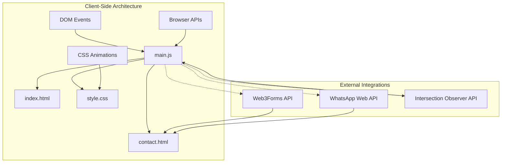
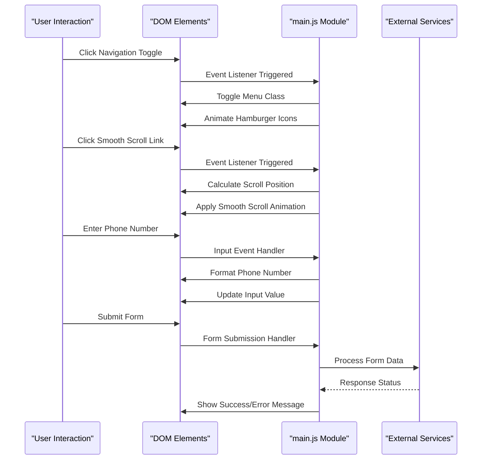
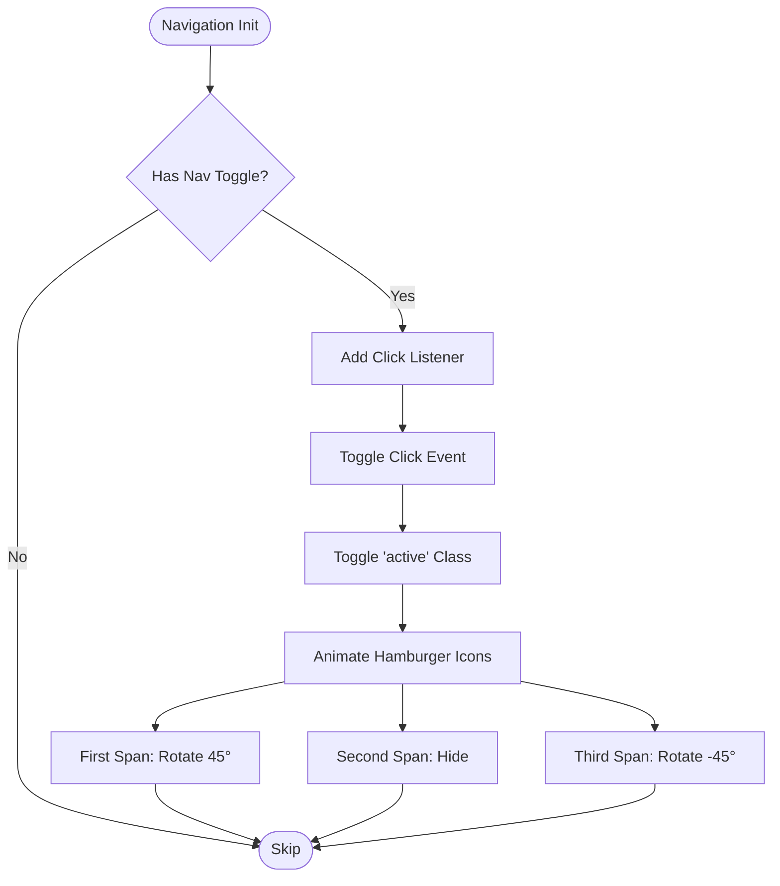
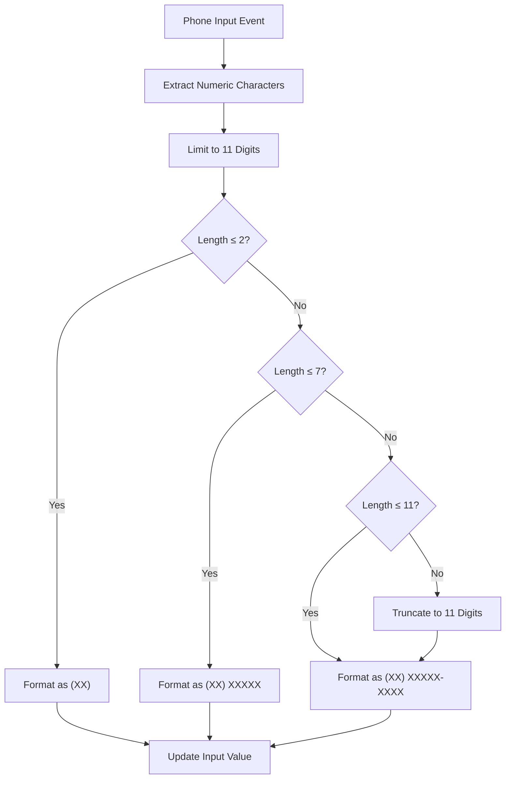
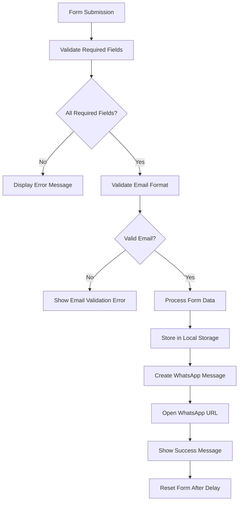
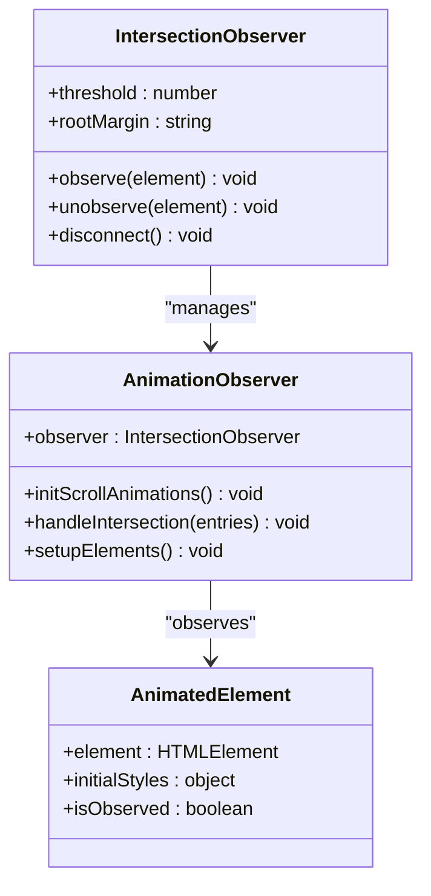
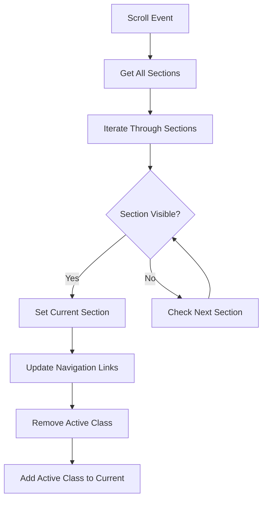
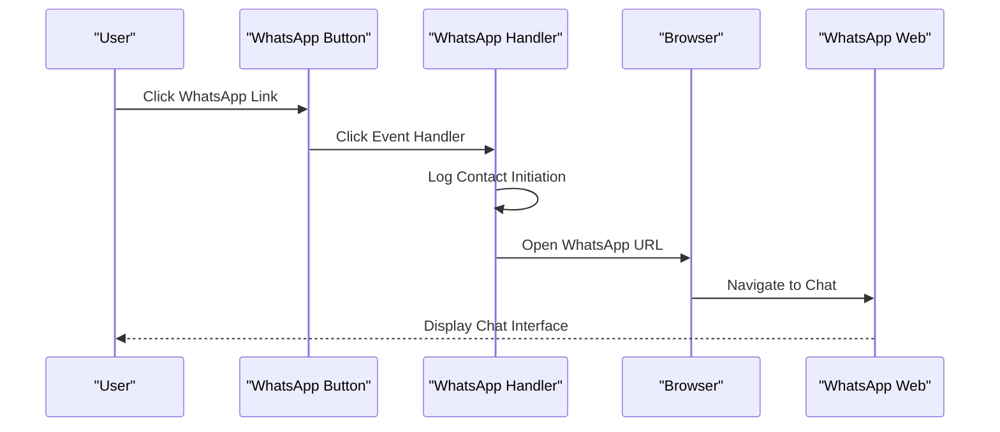
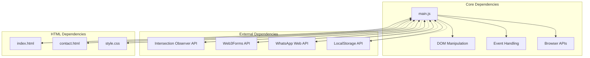

# JavaScript Architecture

<cite>
**Referenced Files in This Document**
- [main.js](file://js/main.js)
- [index.html](file://index.html)
- [contact.html](file://contact.html)
- [style.css](file://css/style.css)
- [.htaccess](file://.htaccess)
</cite>

## Table of Contents
1. [Introduction](#introduction)
2. [Project Structure](#project-structure)
3. [Core Components](#core-components)
4. [Architecture Overview](#architecture-overview)
5. [Detailed Component Analysis](#detailed-component-analysis)
6. [Dependency Analysis](#dependency-analysis)
7. [Performance Considerations](#performance-considerations)
8. [Troubleshooting Guide](#troubleshooting-guide)
9. [Conclusion](#conclusion)

## Introduction
This document provides a comprehensive analysis of the JavaScript architecture implemented in the project, focusing on the main.js module and ES6 programming patterns. The implementation demonstrates modern client-side development practices including modular structure, DOM manipulation techniques, event delegation patterns, and cross-browser compatibility strategies. The codebase showcases practical solutions for navigation menu toggling with animated hamburger icons, smooth scrolling using native JavaScript APIs, Brazilian phone number formatting, form validation logic, Intersection Observer API for scroll animations, active navigation link management, and WhatsApp integration handling.

## Project Structure
The JavaScript architecture follows a modular approach with a single main.js file serving as the central hub for all client-side functionality. The implementation integrates seamlessly with HTML templates and CSS styling to create a cohesive user experience across multiple pages.



**Diagram sources**
- [main.js:1-338](file://js/main.js#L1-L338)
- [index.html:24-522](file://index.html#L24-L522)
- [contact.html:20-291](file://contact.html#L20-L291)

**Section sources**
- [main.js:1-338](file://js/main.js#L1-L338)
- [index.html:24-522](file://index.html#L24-L522)
- [contact.html:20-291](file://contact.html#L20-L291)

## Core Components
The JavaScript implementation consists of several interconnected modules that handle different aspects of the user interface and user experience:

### Navigation System
The navigation system provides responsive menu functionality with animated hamburger icons and mobile-friendly behavior. The implementation uses modern DOM manipulation techniques and CSS transitions for smooth animations.

### Smooth Scrolling Implementation
Native JavaScript smooth scrolling is implemented using the Window.scrollTo() API with behavior: 'smooth' option, providing cross-browser compatibility while maintaining performance.

### Phone Number Formatting
Brazilian phone number formatting follows the XX XXXXX-XXXX or XX XXXX-XXXX pattern, with automatic formatting as users input digits and validation for proper length constraints.

### Form Validation and Submission
The form validation system includes email validation using regex patterns, real-time input formatting, and integration with external form processing services. The implementation handles both local validation and server-side processing.

### Scroll Animations
Intersection Observer API is utilized for efficient scroll-triggered animations, providing better performance than traditional scroll event listeners while maintaining smooth visual effects.

### WhatsApp Integration
Direct WhatsApp integration is implemented through URL construction and automatic message formatting, enabling seamless communication between users and service providers.

**Section sources**
- [main.js:4-42](file://js/main.js#L4-L42)
- [main.js:47-62](file://js/main.js#L47-L62)
- [main.js:79-107](file://js/main.js#L79-L107)
- [main.js:202-231](file://js/main.js#L202-L231)
- [main.js:236-260](file://js/main.js#L236-L260)
- [main.js:265-271](file://js/main.js#L265-L271)

## Architecture Overview
The JavaScript architecture employs a modular, event-driven approach with clear separation of concerns. Each functional area operates independently while sharing common DOM manipulation patterns and event handling strategies.



**Diagram sources**
- [main.js:4-42](file://js/main.js#L4-L42)
- [main.js:47-62](file://js/main.js#L47-L62)
- [main.js:79-107](file://js/main.js#L79-L107)
- [main.js:112-171](file://js/main.js#L112-L171)

## Detailed Component Analysis

### Navigation Menu Toggle System
The navigation system implements a responsive hamburger menu with animated icon transformations and mobile-first design principles.



**Diagram sources**
- [main.js:4-42](file://js/main.js#L4-L42)
- [style.css:129-144](file://css/style.css#L129-L144)

The implementation uses modern ES6 features including arrow functions, template literals, and destructuring assignment. The hamburger animation leverages CSS transforms and opacity changes for smooth transitions.

**Section sources**
- [main.js:4-42](file://js/main.js#L4-L42)
- [style.css:129-144](file://css/style.css#L129-L144)

### Smooth Scrolling Implementation
Smooth scrolling is implemented using native JavaScript APIs with precise positioning calculations and cross-browser compatibility.

```mermaid
sequenceDiagram
participant User as "User"
participant Link as "Anchor Link"
participant JS as "Smooth Scroll Handler"
participant Window as "Window Object"
participant DOM as "Target Element"
User->>Link : Click Anchor Link
Link->>JS : Prevent Default Behavior
JS->>DOM : Get Target Element
JS->>DOM : Calculate Element Position
JS->>Window : Scroll To Position
Window->>User : Smooth Scroll Animation
```

**Diagram sources**
- [main.js:47-62](file://js/main.js#L47-L62)

The implementation calculates precise scroll positions by measuring element offsets and applying a configurable header offset for sticky navigation elements.

**Section sources**
- [main.js:47-62](file://js/main.js#L47-L62)

### Phone Number Formatting Algorithm
The Brazilian phone number formatting system implements intelligent digit processing with automatic pattern recognition and formatting.



**Diagram sources**
- [main.js:79-99](file://js/main.js#L79-L99)

The algorithm handles various input scenarios including partial numbers, existing formatted numbers, and international prefixes. It maintains cursor position and prevents invalid character insertion.

**Section sources**
- [main.js:79-107](file://js/main.js#L79-L107)

### Form Validation and Processing
The form validation system implements comprehensive client-side validation with real-time feedback and integration with external processing services.



**Diagram sources**
- [main.js:112-171](file://js/main.js#L112-L171)
- [main.js:276-288](file://js/main.js#L276-L288)

The validation system uses regex patterns for email validation and provides immediate visual feedback through CSS styling and custom validity messages.

**Section sources**
- [main.js:112-171](file://js/main.js#L112-L171)
- [main.js:276-288](file://js/main.js#L276-L288)

### Scroll Animations with Intersection Observer
The scroll animation system utilizes the Intersection Observer API for efficient, performance-optimized animations triggered by scroll events.



**Diagram sources**
- [main.js:202-231](file://js/main.js#L202-L231)

The implementation sets up threshold values and root margins to trigger animations when elements enter the viewport, providing smooth fade-in effects with translate transformations.

**Section sources**
- [main.js:202-231](file://js/main.js#L202-L231)

### Active Navigation Link Management
The active navigation link system dynamically updates navigation highlighting based on scroll position and viewport visibility.



**Diagram sources**
- [main.js:236-260](file://js/main.js#L236-L260)

The system calculates section visibility using bounding client rectangles and page scroll position, updating navigation links in real-time as users navigate through the page.

**Section sources**
- [main.js:236-260](file://js/main.js#L236-L260)

### WhatsApp Integration Handling
The WhatsApp integration system provides seamless communication through URL construction and automatic message formatting.



**Diagram sources**
- [main.js:265-271](file://js/main.js#L265-L271)

The implementation includes logging capabilities for tracking user interactions and provides consistent behavior across different devices and browsers.

**Section sources**
- [main.js:265-271](file://js/main.js#L265-L271)

## Dependency Analysis
The JavaScript architecture demonstrates clear dependency relationships and modular design patterns that promote maintainability and scalability.



**Diagram sources**
- [main.js:1-338](file://js/main.js#L1-L338)
- [index.html:24-522](file://index.html#L24-L522)
- [contact.html:20-291](file://contact.html#L20-L291)

The architecture minimizes external dependencies while leveraging modern browser APIs for optimal performance and compatibility.

**Section sources**
- [main.js:1-338](file://js/main.js#L1-L338)

## Performance Considerations
The JavaScript implementation incorporates several performance optimization techniques to ensure smooth user experience across different devices and network conditions.

### Browser Compatibility Strategies
The codebase implements progressive enhancement techniques with fallbacks for older browsers. Key compatibility measures include:

- Native API detection before usage
- Graceful degradation for unsupported features
- Polyfill considerations for critical functionality
- Cross-browser event handling patterns

### Memory Management
The implementation uses efficient memory management practices including:
- Event listener cleanup where appropriate
- DOM query caching for frequently accessed elements
- Efficient iteration patterns using modern array methods
- Proper scope management to prevent memory leaks

### Performance Optimization Techniques
Several optimization strategies are employed throughout the codebase:

- Debounced scroll handlers for smooth performance
- Efficient DOM manipulation batching
- CSS transitions for hardware-accelerated animations
- Lazy initialization of heavy features
- Minimal DOM queries during critical interactions

**Section sources**
- [main.js:202-231](file://js/main.js#L202-L231)
- [main.js:236-260](file://js/main.js#L236-L260)

## Troubleshooting Guide
Common issues and their resolution strategies are documented below to assist developers in maintaining and extending the JavaScript architecture.

### Navigation Issues
**Problem**: Navigation menu fails to toggle on mobile devices
**Solution**: Verify CSS media queries are properly configured and JavaScript event listeners are attached after DOMContentLoaded

**Problem**: Hamburger animation appears jerky
**Solution**: Ensure CSS transitions are properly defined and JavaScript animations don't conflict with CSS animations

### Scroll Performance Issues
**Problem**: Smooth scrolling feels laggy on mobile devices
**Solution**: Check Intersection Observer API support and implement fallbacks for older browsers

**Problem**: Scroll animations trigger unexpectedly
**Solution**: Adjust threshold values and rootMargin settings in the Intersection Observer configuration

### Form Validation Problems
**Problem**: Phone number formatting conflicts with user input
**Solution**: Implement proper cursor position management and prevent invalid character insertion

**Problem**: Email validation fails for legitimate addresses
**Solution**: Review regex patterns and consider more comprehensive email validation approaches

### WhatsApp Integration Issues
**Problem**: WhatsApp links don't open properly
**Solution**: Verify URL construction and ensure proper encoding of special characters

**Problem**: Form submission fails silently
**Solution**: Implement comprehensive error handling and logging for debugging purposes

**Section sources**
- [main.js:276-288](file://js/main.js#L276-L288)
- [main.js:328-331](file://js/main.js#L328-L331)

## Conclusion
The JavaScript architecture demonstrates a well-structured, maintainable implementation that effectively combines modern ES6 programming patterns with practical web development solutions. The modular design promotes code reusability and maintainability while the use of native browser APIs ensures optimal performance and compatibility. The implementation successfully addresses key user experience requirements including responsive navigation, smooth scrolling, intelligent input formatting, and seamless integration with external services.

The codebase serves as an excellent example of modern client-side development practices, showcasing effective use of DOM manipulation, event handling, and browser APIs. The attention to performance optimization, browser compatibility, and user experience creates a robust foundation for future enhancements and feature additions.