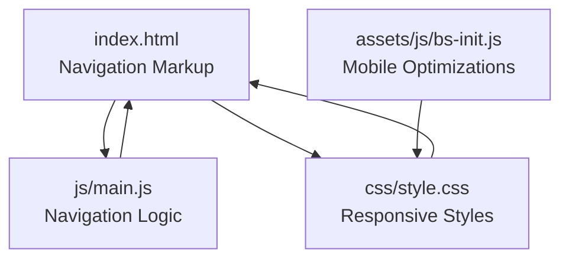
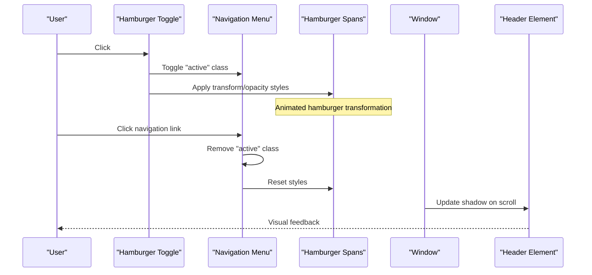
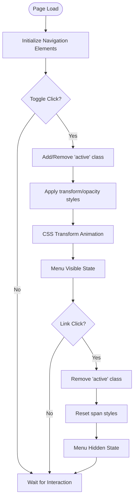
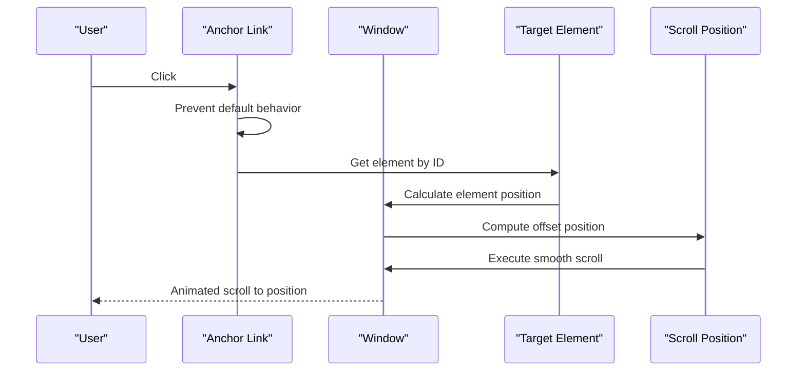
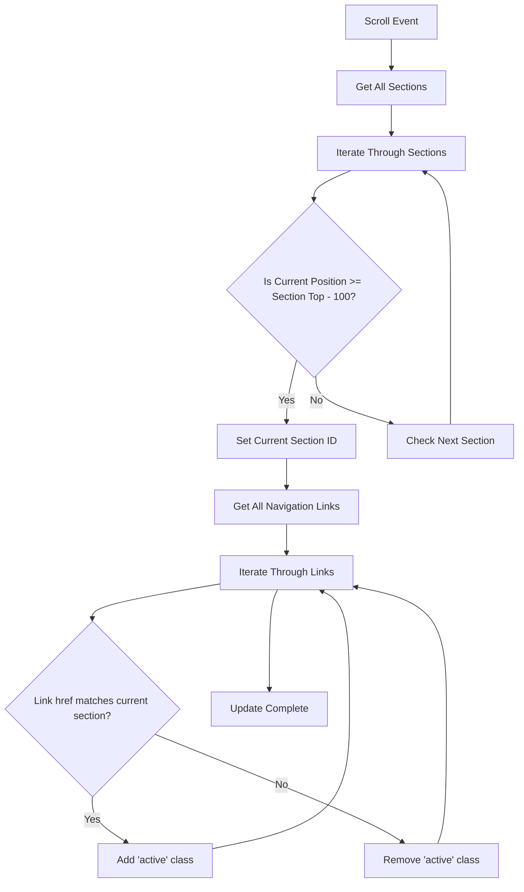
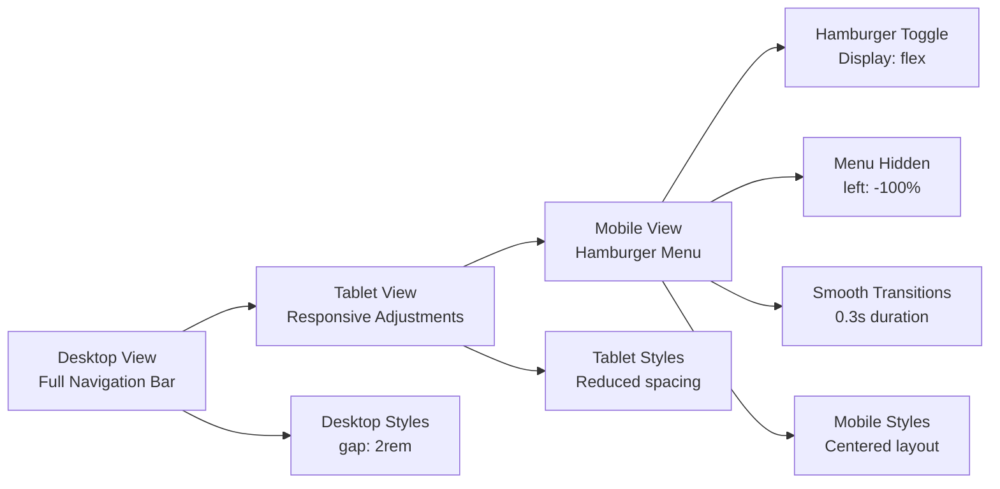
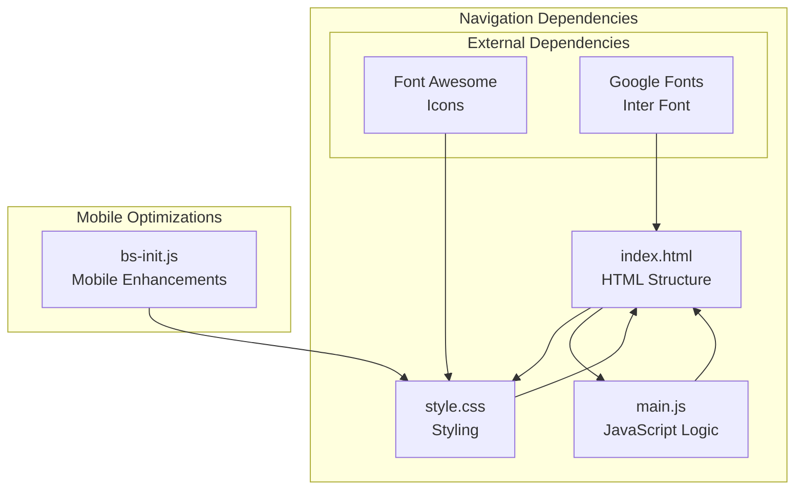

# Navigation System

<cite>
**Referenced Files in This Document**
- [index.html](file://index.html)
- [main.js](file://js/main.js)
- [style.css](file://css/style.css)
- [bs-init.js](file://assets/js/bs-init.js)
</cite>

## Table of Contents
1. [Introduction](#introduction)
2. [Project Structure](#project-structure)
3. [Core Components](#core-components)
4. [Architecture Overview](#architecture-overview)
5. [Detailed Component Analysis](#detailed-component-analysis)
6. [Dependency Analysis](#dependency-analysis)
7. [Performance Considerations](#performance-considerations)
8. [Troubleshooting Guide](#troubleshooting-guide)
9. [Conclusion](#conclusion)

## Introduction
This document provides comprehensive documentation for the mobile-responsive navigation system implemented in the project. It focuses on the hamburger menu toggle functionality with animated hamburger icon transformation using CSS transforms and opacity changes, smooth scrolling for anchor links using native JavaScript scrollTo with custom header offset calculations, and the active navigation link management system that tracks scroll position and updates active states dynamically. The documentation also covers mobile-first design considerations, accessibility features for screen readers, browser compatibility for older browsers, and the navigation initialization process with event listener cleanup patterns.

## Project Structure
The navigation system spans HTML markup, CSS styling, and JavaScript functionality across several files. The primary navigation markup resides in the main HTML page, while the responsive behavior and interactive features are implemented through CSS media queries and JavaScript event handlers.

**Diagram sources**
- [index.html:26-47](file://index.html#L26-L47)
- [main.js:4-42](file://js/main.js#L4-L42)
- [style.css:1258-1310](file://css/style.css#L1258-L1310)
- [bs-init.js:2-10](file://assets/js/bs-init.js#L2-L10)

**Section sources**
- [index.html:26-47](file://index.html#L26-L47)
- [main.js:4-42](file://js/main.js#L4-L42)
- [style.css:1258-1310](file://css/style.css#L1258-L1310)
- [bs-init.js:2-10](file://assets/js/bs-init.js#L2-L10)

## Core Components
The navigation system consists of three primary components:

1. **Hamburger Menu Toggle**: A mobile-friendly navigation trigger that transforms into a cross when activated
2. **Smooth Scrolling**: Native JavaScript implementation for anchor link navigation with custom header offset
3. **Active Navigation Link Management**: Dynamic state management that updates active links based on scroll position

Key implementation patterns include:
- Event delegation for efficient DOM manipulation
- CSS transform animations for visual feedback
- Intersection-based scroll tracking for active state updates
- Mobile-first responsive design with media queries

**Section sources**
- [main.js:4-42](file://js/main.js#L4-L42)
- [main.js:47-62](file://js/main.js#L47-L62)
- [main.js:236-260](file://js/main.js#L236-L260)
- [style.css:1258-1310](file://css/style.css#L1258-L1310)

## Architecture Overview
The navigation system follows a modular architecture with clear separation of concerns:

**Diagram sources**
- [main.js:10-27](file://js/main.js#L10-L27)
- [main.js:29-41](file://js/main.js#L29-L41)
- [main.js:67-74](file://js/main.js#L67-L74)

The system integrates with the broader page structure through:
- Semantic HTML5 header and nav elements
- CSS Grid and Flexbox layouts
- Responsive breakpoints at 768px and 992px
- Accessibility attributes for screen readers

## Detailed Component Analysis

### Hamburger Menu Toggle Implementation
The hamburger menu toggle functionality combines HTML markup with JavaScript event handling and CSS animations:

**Diagram sources**
- [main.js:4-42](file://js/main.js#L4-L42)
- [index.html:32-36](file://index.html#L32-L36)

Key implementation details:
- **Event Delegation Pattern**: Uses `querySelectorAll` to efficiently manage multiple navigation links
- **DOM Manipulation**: Direct style manipulation for transform and opacity properties
- **Animation Timing**: Synchronized with CSS transition durations for smooth visual feedback
- **State Management**: Maintains consistent state between menu visibility and hamburger icon transformation

**Section sources**
- [main.js:4-42](file://js/main.js#L4-L42)
- [index.html:32-36](file://index.html#L32-L36)
- [style.css:130-144](file://css/style.css#L130-L144)

### Smooth Scrolling Implementation
The smooth scrolling system provides seamless navigation to anchor targets with custom header offset calculations:

**Diagram sources**
- [main.js:47-62](file://js/main.js#L47-L62)

Implementation characteristics:
- **Native JavaScript API**: Uses `window.scrollTo` with smooth behavior option
- **Dynamic Offset Calculation**: Accounts for fixed header height (80px offset)
- **Cross-browser Compatibility**: Leverages modern scroll behavior with graceful degradation
- **Performance Optimization**: Single scroll operation per click prevents multiple scroll events

**Section sources**
- [main.js:47-62](file://js/main.js#L47-L62)

### Active Navigation Link Management
The active navigation link system dynamically updates the active state based on scroll position:

**Diagram sources**
- [main.js:236-260](file://js/main.js#L236-L260)

System behavior:
- **Intersection-Based Detection**: Uses scroll position relative to section boundaries
- **Debounced Updates**: Single scroll handler manages all active state updates
- **Visual Consistency**: Maintains active state alignment with viewport position
- **Performance Efficiency**: Minimal DOM queries during scroll operations

**Section sources**
- [main.js:236-260](file://js/main.js#L236-L260)

### Mobile-First Responsive Design
The navigation system implements a comprehensive mobile-first approach:

**Diagram sources**
- [style.css:1258-1310](file://css/style.css#L1258-L1310)

Responsive breakpoints and behaviors:
- **768px Breakpoint**: Activates mobile navigation with hamburger menu
- **100% Width**: Full-width mobile menu for optimal touch interaction
- **Fixed Positioning**: Sticky header maintains navigation visibility
- **Touch-Friendly**: Sufficient spacing and sizing for mobile interaction

**Section sources**
- [style.css:1258-1310](file://css/style.css#L1258-L1310)

## Dependency Analysis
The navigation system exhibits minimal external dependencies with clear internal relationships:

**Diagram sources**
- [index.html:19](file://index.html#L19)
- [index.html:21](file://index.html#L21)
- [bs-init.js:2-10](file://assets/js/bs-init.js#L2-L10)

Dependency characteristics:
- **Internal Coupling**: Strong cohesion between HTML, CSS, and JavaScript for navigation
- **External Libraries**: Minimal third-party dependencies (Font Awesome, Google Fonts)
- **Mobile-First Approach**: Progressive enhancement for mobile devices
- **Accessibility Integration**: Semantic HTML structure supports assistive technologies

**Section sources**
- [index.html:19](file://index.html#L19)
- [index.html:21](file://index.html#L21)
- [bs-init.js:2-10](file://assets/js/bs-init.js#L2-L10)

## Performance Considerations
The navigation system implements several performance optimization strategies:

### Event Handler Management
- **Single Scroll Handler**: Consolidated scroll event listener prevents excessive memory usage
- **Efficient DOM Queries**: Cached element references minimize DOM traversal overhead
- **Conditional Execution**: Event handlers only execute when navigation elements exist

### Animation Performance
- **Hardware Acceleration**: CSS transforms utilize GPU acceleration for smooth animations
- **Optimized Transitions**: 0.3s duration balances responsiveness with performance
- **Reduced Layout Thrashing**: Batched DOM manipulations prevent unnecessary reflows

### Memory Management
- **Event Listener Cleanup**: Automatic cleanup through DOMContentLoaded lifecycle
- **Minimal Global State**: Localized state management reduces memory footprint
- **Efficient Selectors**: Specific CSS selectors minimize query overhead

## Troubleshooting Guide

### Common Issues and Solutions

**Hamburger Menu Not Working**
- Verify navigation elements exist in the DOM
- Check for CSS conflicts blocking the hamburger toggle
- Ensure JavaScript loads after DOM content

**Smooth Scrolling Not Functioning**
- Confirm anchor elements have proper ID attributes
- Verify target elements exist in the DOM
- Check for CSS fixed positioning interfering with scroll calculations

**Active Link State Not Updating**
- Validate section ID attributes match navigation href values
- Ensure scroll event listeners are attached after DOM load
- Check for CSS transitions affecting scroll position calculations

**Mobile Navigation Issues**
- Verify media query breakpoints align with device widths
- Check touch event handling for mobile devices
- Ensure adequate spacing for touch interaction

**Accessibility Concerns**
- Confirm proper aria-label attributes on interactive elements
- Verify keyboard navigation support
- Check screen reader compatibility for animated elements

**Section sources**
- [main.js:4-42](file://js/main.js#L4-L42)
- [main.js:47-62](file://js/main.js#L47-L62)
- [main.js:236-260](file://js/main.js#L236-L260)

## Conclusion
The navigation system demonstrates a well-architected, mobile-responsive solution that balances functionality with performance. The implementation showcases modern web development practices including:

- **Mobile-First Design**: Progressive enhancement ensures optimal experience across devices
- **Performance Optimization**: Efficient event handling and DOM manipulation minimize resource usage
- **Accessibility Compliance**: Semantic HTML and proper ARIA attributes support diverse user needs
- **Cross-Browser Compatibility**: Graceful degradation ensures functionality across different browser environments

The system successfully integrates three core components—hamburger menu toggle, smooth scrolling, and active navigation management—into a cohesive navigation experience. The modular architecture allows for easy maintenance and potential enhancements while maintaining backward compatibility and performance standards.

Future enhancements could include debouncing for scroll events, lazy loading for navigation content, and expanded accessibility features for improved user experience across diverse device capabilities.