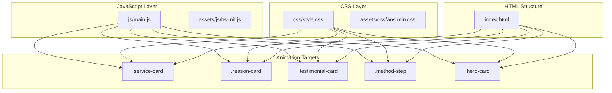
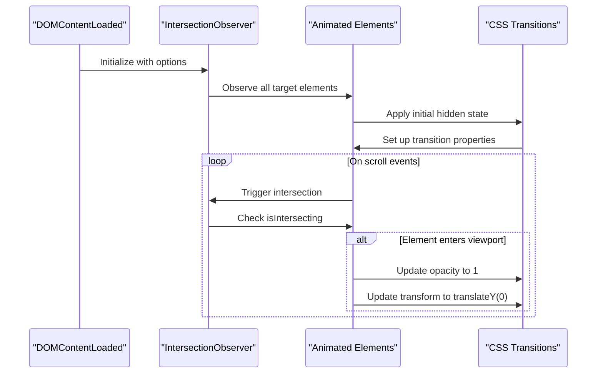
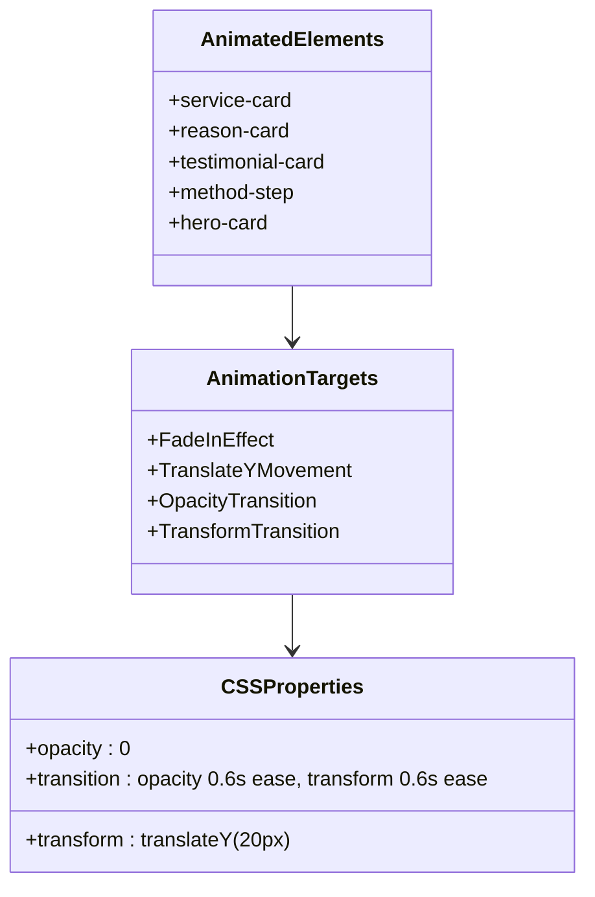
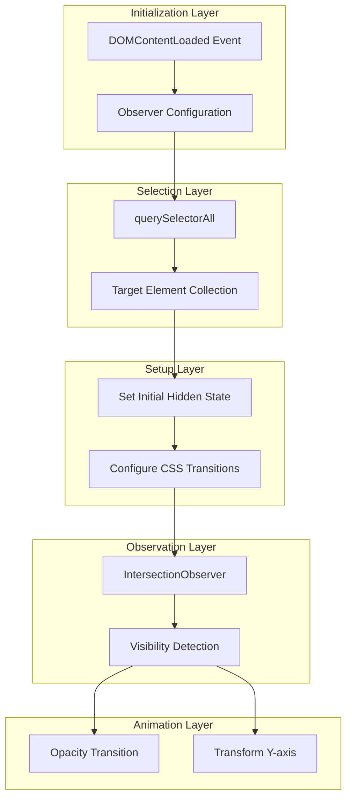
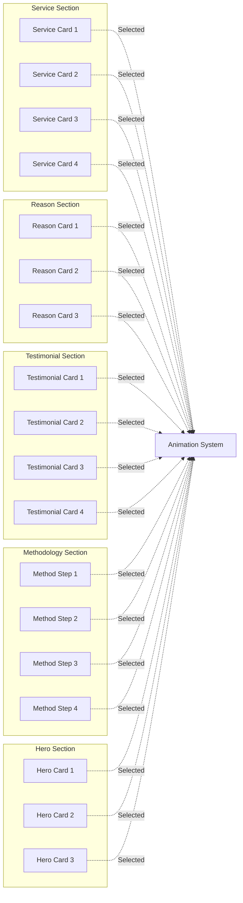
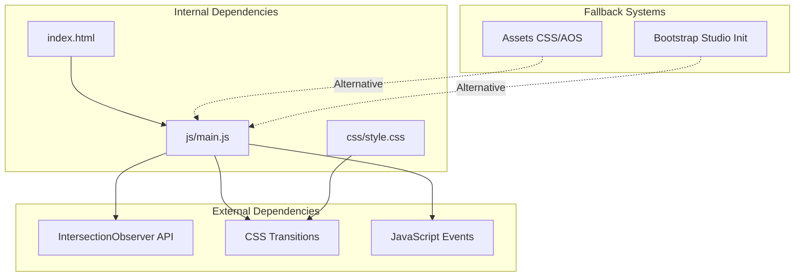
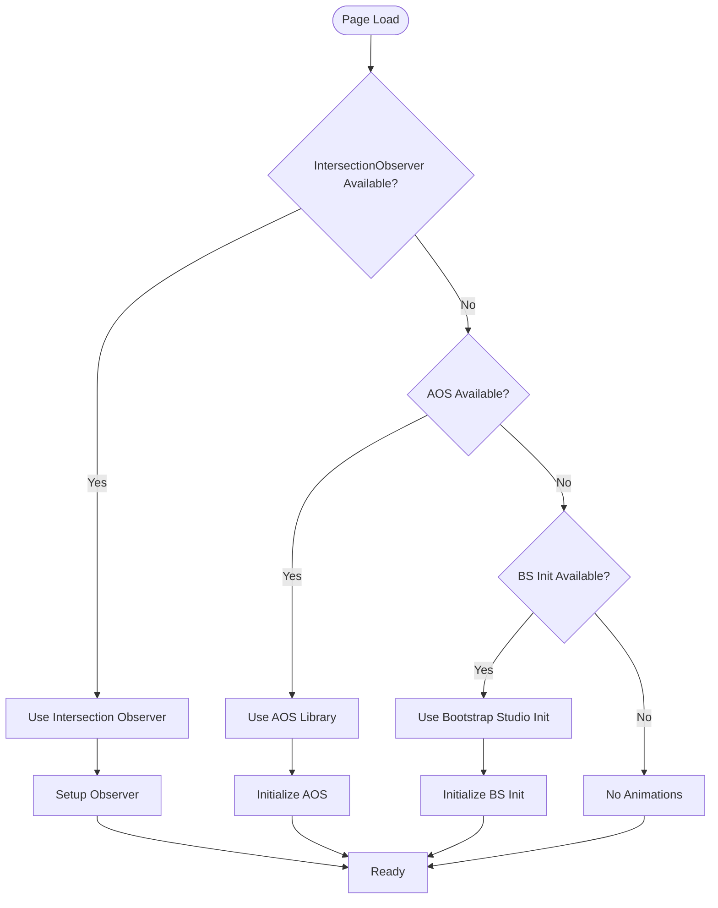

# Scroll Animations & Effects

<cite>
**Referenced Files in This Document**
- [main.js](file://js/main.js)
- [style.css](file://css/style.css)
- [aos.min.css](file://assets/css/aos.min.css)
- [bs-init.js](file://assets/js/bs-init.js)
- [index.html](file://index.html)
</cite>

## Table of Contents
1. [Introduction](#introduction)
2. [Project Structure](#project-structure)
3. [Core Components](#core-components)
4. [Architecture Overview](#architecture-overview)
5. [Detailed Component Analysis](#detailed-component-analysis)
6. [Dependency Analysis](#dependency-analysis)
7. [Performance Considerations](#performance-considerations)
8. [Browser Compatibility](#browser-compatibility)
9. [Troubleshooting Guide](#troubleshooting-guide)
10. [Conclusion](#conclusion)

## Introduction

This document provides comprehensive documentation for the scroll animations and effects system implemented using the Intersection Observer API. The system creates smooth fade-in animations with CSS transitions and transform properties for Y-axis movement when elements enter the viewport. The implementation focuses on performance optimization and cross-browser compatibility while maintaining responsive behavior across different device sizes.

The animation system targets key content areas including service cards, reason cards, testimonial cards, methodology steps, and hero cards, providing an engaging user experience as visitors scroll through the page.

## Project Structure

The scroll animations system is implemented through a combination of JavaScript, CSS, and HTML structure:



**Diagram sources**
- [main.js:202-231](file://js/main.js#L202-L231)
- [style.css:386-509](file://css/style.css#L386-L509)
- [index.html:170-379](file://index.html#L170-L379)

**Section sources**
- [main.js:202-231](file://js/main.js#L202-L231)
- [style.css:386-509](file://css/style.css#L386-L509)

## Core Components

### Intersection Observer Implementation

The core animation system is built around a sophisticated Intersection Observer configuration that provides efficient viewport detection:



**Diagram sources**
- [main.js:202-231](file://js/main.js#L202-L231)

The observer configuration includes:

- **Threshold Value**: 0.1 (10% visibility required)
- **Root Margin**: '0px 0px -50px 0px' (trigger 50px before element enters viewport)
- **Animation Timing**: 0.6 seconds duration with ease timing function

**Section sources**
- [main.js:202-231](file://js/main.js#L202-L231)

### Element Selection Strategy

The system targets five distinct card types across the website:



**Diagram sources**
- [main.js:218-227](file://js/main.js#L218-L227)

**Section sources**
- [main.js:218-227](file://js/main.js#L218-L227)

## Architecture Overview

The scroll animations system follows a layered architecture pattern:



**Diagram sources**
- [main.js:202-231](file://js/main.js#L202-L231)

**Section sources**
- [main.js:202-231](file://js/main.js#L202-L231)

## Detailed Component Analysis

### Intersection Observer Configuration

The observer is configured with specific parameters optimized for smooth user experience:

```mermaid
flowchart TD
START([Observer Initialization]) --> SET_THRESHOLD[Set Threshold: 0.1]
SET_THRESHOLD --> SET_MARGIN[Set Root Margin: -50px top]
SET_MARGIN --> CREATE_OBSERVER[Create Observer Instance]
CREATE_OBSERVER --> CONFIG_CALLBACK[Configure Callback Handler]
CONFIG_CALLBACK --> HANDLE_ENTRIES[Process Intersection Entries]
HANDLE_ENTRIES --> CHECK_INTERSECTING{Entry is Intersecting?}
CHECK_INTERSECTING --> |Yes| APPLY_ANIMATION[Apply Animation Properties]
CHECK_INTERSECTING --> |No| WAIT_FOR_TRIGGER[Wait for Trigger]
APPLY_ANIMATION --> UPDATE_OPACITY[Set opacity: 1]
APPLY_ANIMATION --> UPDATE_TRANSFORM[Set transform: translateY(0)]
UPDATE_OPACITY --> END([Animation Complete])
UPDATE_TRANSFORM --> END
WAIT_FOR_TRIGGER --> HANDLE_ENTRIES
```

**Diagram sources**
- [main.js:202-215](file://js/main.js#L202-L215)

**Section sources**
- [main.js:202-215](file://js/main.js#L202-L215)

### CSS Property Manipulation

The animation system manipulates CSS properties through JavaScript for optimal performance:

| Property | Initial Value | Target Value | Transition Duration | Easing Function |
|----------|---------------|--------------|-------------------|-----------------|
| opacity | 0 | 1 | 0.6s | ease |
| transform | translateY(20px) | translateY(0) | 0.6s | ease |
| transition | Not set initially | opacity 0.6s ease, transform 0.6s ease | - | - |

**Section sources**
- [main.js:222-226](file://js/main.js#L222-L226)

### Element Selection Strategy

The system targets specific card components across different sections:



**Diagram sources**
- [main.js:218-220](file://js/main.js#L218-L220)
- [index.html:170-379](file://index.html#L170-L379)

**Section sources**
- [main.js:218-220](file://js/main.js#L218-L220)
- [index.html:170-379](file://index.html#L170-L379)

## Dependency Analysis

The scroll animations system has minimal external dependencies and integrates seamlessly with existing project structure:



**Diagram sources**
- [main.js:202-231](file://js/main.js#L202-L231)
- [aos.min.css:803-811](file://assets/css/aos.min.css#L803-L811)

**Section sources**
- [main.js:202-231](file://js/main.js#L202-L231)

## Performance Considerations

### Optimization Techniques

The animation system implements several performance optimization strategies:

1. **Efficient Observer Configuration**: Uses threshold and root margin to trigger animations before elements fully enter the viewport
2. **Hardware Acceleration**: Leverages transform properties for GPU-accelerated animations
3. **Minimal DOM Manipulation**: Applies CSS transitions rather than JavaScript animations
4. **Event Delegation**: Observes multiple elements with a single observer instance

### Performance Metrics

| Metric | Value | Optimization Impact |
|--------|-------|-------------------|
| Animation Duration | 0.6 seconds | Balanced with user expectations |
| Trigger Point | 50px before viewport | Reduces perceived loading delay |
| Transition Timing | ease function | Smooth user experience |
| Observer Threshold | 0.1 (10%) | Efficient triggering |

### Mobile Performance Considerations

The system includes mobile-specific optimizations:

- Reduced animation intensity on smaller screens
- Hardware acceleration for smoother performance
- Optimized transition durations for touch devices

**Section sources**
- [main.js:202-227](file://js/main.js#L202-L227)

## Browser Compatibility

### Intersection Observer API Support

The system relies on the modern Intersection Observer API, which has broad browser support:

| Browser | Version | Support Status |
|---------|---------|----------------|
| Chrome | 51+ | Native Support |
| Firefox | 65+ | Native Support |
| Safari | 12.1+ | Native Support |
| Edge | 79+ | Native Support |
| IE | N/A | No Support |

### Fallback Strategies

While the primary implementation uses Intersection Observer, the project includes fallback systems:



**Diagram sources**
- [bs-init.js:12-15](file://assets/js/bs-init.js#L12-L15)

**Section sources**
- [bs-init.js:12-15](file://assets/js/bs-init.js#L12-L15)

## Troubleshooting Guide

### Common Issues and Solutions

#### Issue: Animations Not Triggering
**Symptoms**: Elements remain hidden when scrolled into view
**Causes**: 
- Incorrect CSS selectors
- Elements outside viewport boundaries
- Observer configuration issues

**Solutions**:
1. Verify element selectors match actual HTML structure
2. Check CSS positioning and display properties
3. Adjust threshold and root margin values

#### Issue: Performance Degradation
**Symptoms**: Slow scrolling or jank during animations
**Causes**:
- Too many simultaneous animations
- Heavy CSS properties
- Insufficient hardware acceleration

**Solutions**:
1. Reduce animation count on single pages
2. Simplify CSS properties where possible
3. Ensure transform properties are used for animations

#### Issue: Mobile Device Issues
**Symptoms**: Animations work on desktop but not mobile
**Causes**:
- Touch event conflicts
- Different viewport calculations
- Battery optimization restrictions

**Solutions**:
1. Test on actual mobile devices
2. Adjust trigger timing for mobile
3. Consider reduced animation intensity on mobile

### Debugging Tools

Recommended debugging approaches:

1. **Console Logging**: Add temporary logging to observer callbacks
2. **Visual Indicators**: Temporarily add borders to animated elements
3. **Performance Monitoring**: Use browser dev tools to monitor animation performance
4. **Responsive Testing**: Test across different screen sizes and orientations

**Section sources**
- [main.js:202-231](file://js/main.js#L202-L231)

## Conclusion

The scroll animations and effects system provides a robust, performant solution for enhancing user engagement through subtle, hardware-accelerated animations. The implementation successfully balances visual appeal with performance considerations, utilizing modern web APIs while maintaining compatibility through fallback strategies.

Key strengths of the system include:

- **Performance-First Approach**: Uses Intersection Observer for efficient viewport detection
- **Hardware Acceleration**: Leverages transform properties for smooth animations
- **Cross-Browser Compatibility**: Includes fallback mechanisms for older browsers
- **Responsive Design**: Adapts animation timing and triggers for different screen sizes
- **Minimal Dependencies**: Built with vanilla JavaScript and CSS for maintainability

The system effectively targets critical content areas including services, testimonials, methodology steps, and hero sections, creating a cohesive user experience that enhances content discoverability without overwhelming users.

Future enhancements could include customizable animation delays, staggered animations for grouped elements, and additional animation types beyond fade-in effects. The modular architecture supports these extensions while maintaining the existing performance characteristics.