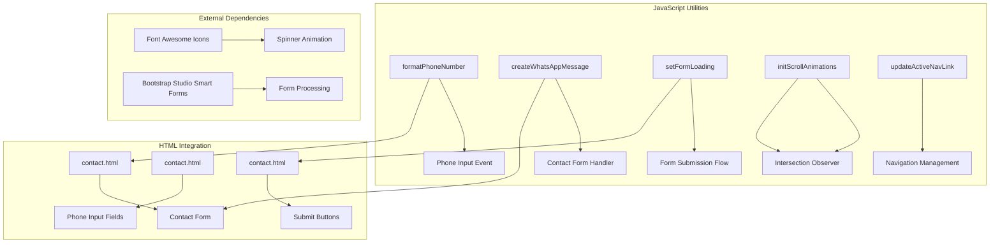
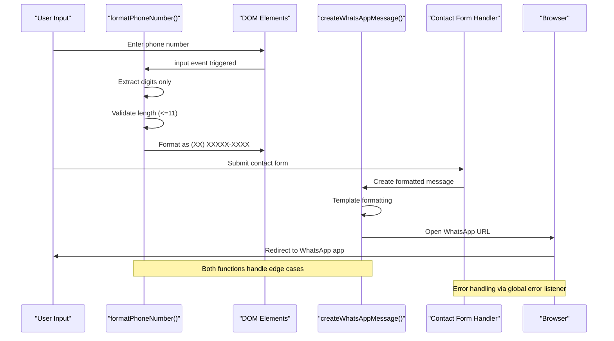
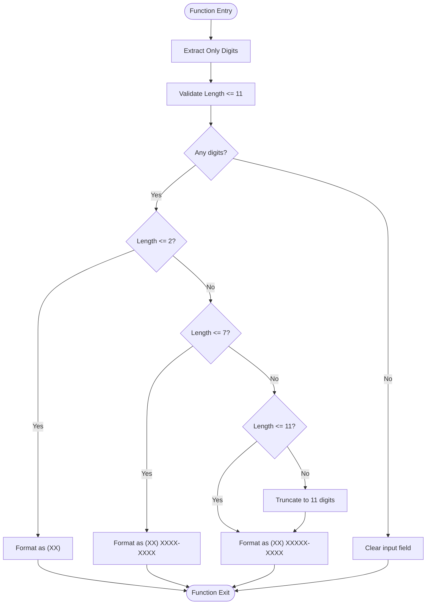
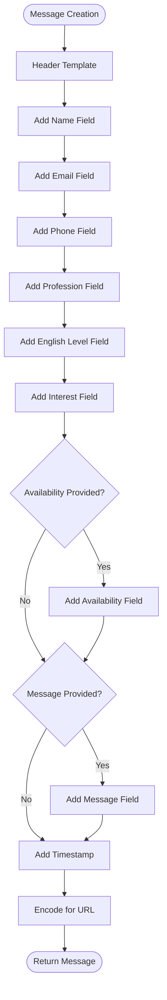
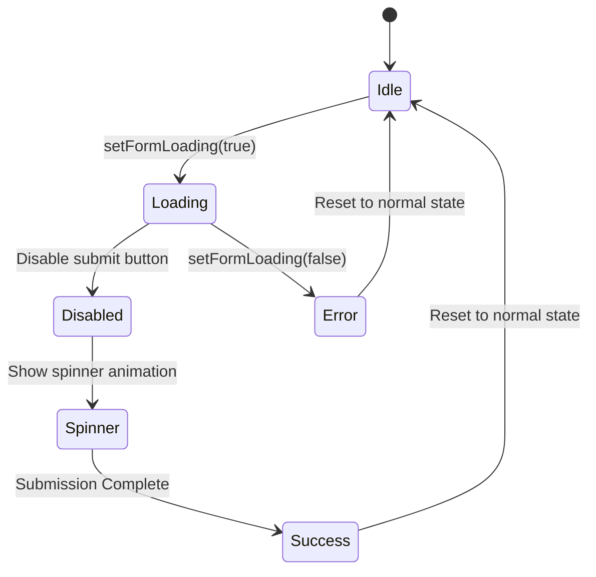
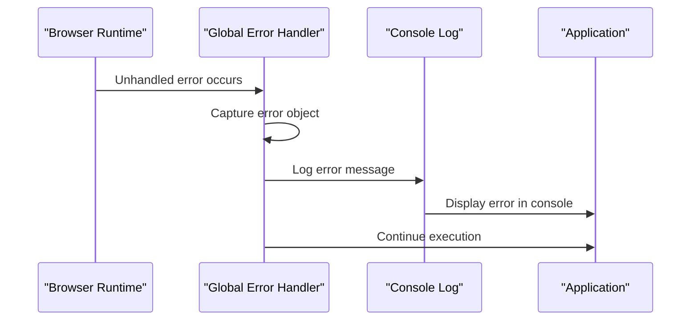
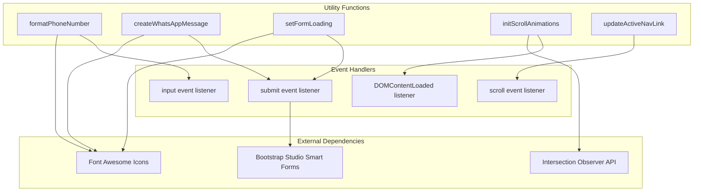

# Utility Functions & Helpers

<cite>
**Referenced Files in This Document**
- [main.js](file://js/main.js)
- [contact.html](file://contact.html)
</cite>

## Table of Contents
1. [Introduction](#introduction)
2. [Project Structure](#project-structure)
3. [Core Components](#core-components)
4. [Architecture Overview](#architecture-overview)
5. [Detailed Component Analysis](#detailed-component-analysis)
6. [Dependency Analysis](#dependency-analysis)
7. [Performance Considerations](#performance-considerations)
8. [Troubleshooting Guide](#troubleshooting-guide)
9. [Conclusion](#conclusion)

## Introduction
This document covers the utility functions and helper methods used throughout the JavaScript implementation. The focus areas include phone number formatting for Brazilian phone numbers, WhatsApp message creation with template formatting, form loading state management with spinner animations, global error handling setup, console logging utilities, and service worker registration placeholder functionality.

## Project Structure
The JavaScript utilities are primarily located in the main JavaScript file with supporting HTML structure in the contact page:



**Diagram sources**
- [main.js:79-107](file://js/main.js#L79-L107)
- [main.js:177-197](file://js/main.js#L177-L197)
- [main.js:293-304](file://js/main.js#L293-L304)
- [contact.html:141-204](file://contact.html#L141-L204)

**Section sources**
- [main.js:1-338](file://js/main.js#L1-L338)
- [contact.html:1-291](file://contact.html#L1-L291)

## Core Components

### Phone Number Formatting Utility
The phone number formatting function handles Brazilian phone number input with automatic formatting during user input.

### WhatsApp Message Creation Helper
The WhatsApp message creation function generates formatted messages for contact form submissions with proper template structure.

### Form Loading State Manager
The form loading state manager handles button state manipulation and spinner animation during form submission processes.

### Global Error Handling Setup
The global error handler captures unhandled JavaScript errors with console logging capabilities.

### Console Logging Utilities
Console logging functions provide welcome messages and contact information display.

### Service Worker Registration Placeholder
Service worker registration functionality is available as a commented-out placeholder for future offline support implementation.

**Section sources**
- [main.js:79-107](file://js/main.js#L79-L107)
- [main.js:177-197](file://js/main.js#L177-L197)
- [main.js:293-304](file://js/main.js#L293-L304)
- [main.js:328-331](file://js/main.js#L328-L331)
- [main.js:309-311](file://js/main.js#L309-L311)
- [main.js:316-323](file://js/main.js#L316-L323)

## Architecture Overview



**Diagram sources**
- [main.js:79-107](file://js/main.js#L79-L107)
- [main.js:177-197](file://js/main.js#L177-L197)
- [main.js:112-171](file://js/main.js#L112-L171)

## Detailed Component Analysis

### Phone Number Formatting Function

The phone number formatting function implements a sophisticated digit extraction and formatting algorithm specifically designed for Brazilian phone numbers.

#### Algorithm Implementation



**Diagram sources**
- [main.js:79-99](file://js/main.js#L79-L99)

#### Function Parameters and Return Values
- **Parameters**: `input` (HTMLInputElement) - The phone input element being processed
- **Return Value**: None (modifies input.value directly)
- **Processing Logic**: Digit extraction, length validation, and Brazilian phone number formatting

#### Usage Pattern
The function is automatically attached to all tel input elements on page load:

```javascript
const phoneInputs = document.querySelectorAll('input[type="tel"]');
phoneInputs.forEach(input => {
    input.addEventListener('input', function () {
        formatPhoneNumber(this);
    });
});
```

#### Edge Case Management
- **Empty Input**: Clears the input field
- **Invalid Characters**: Removes all non-numeric characters
- **Length Validation**: Automatically truncates to 11 digits maximum
- **Partial Input**: Formats partial Brazilian phone number patterns

**Section sources**
- [main.js:79-107](file://js/main.js#L79-L107)
- [contact.html:161](file://contact.html#L161)

### WhatsApp Message Creation Function

The WhatsApp message creation function generates properly formatted messages for contact form submissions with template-based structure and special character encoding.

#### Template Structure and Formatting



**Diagram sources**
- [main.js:177-197](file://js/main.js#L177-L197)

#### Function Parameters and Return Values
- **Parameters**: `data` (Object) - Contact form data object containing:
  - `name`: string - Contact name
  - `email`: string - Contact email
  - `phone`: string - Contact phone number
  - `profession`: string - Professional background
  - `level`: string - English proficiency level
  - `interest`: string - Primary interest area
  - `availability`: string (optional) - Preferred schedule
  - `message`: string (optional) - Additional message
  - `timestamp`: string - Submission timestamp
- **Return Value**: `string` - Formatted WhatsApp message ready for URL encoding

#### Special Character Encoding Strategy
The function uses standard newline characters (`\n`) and Markdown-like formatting with asterisks (`*`) for bold text and underscores (`_`) for emphasis. These are automatically URL-encoded when passed to the WhatsApp URL construction.

#### Usage Pattern
The function is integrated into the contact form submission process:

```javascript
const whatsappMessage = createWhatsAppMessage(formData);
const whatsappURL = `https://wa.me/${whatsappNumber}?text=${encodeURIComponent(whatsappMessage)}`;
```

#### Message Structure Components
1. **Header**: Bold title indicating consultation request
2. **Contact Information**: Name, email, phone number
3. **Professional Details**: Profession, English level, interest area
4. **Preferences**: Optional availability preference
5. **Additional Information**: Optional message content
6. **Timestamp**: Footer with submission date and time

**Section sources**
- [main.js:177-197](file://js/main.js#L177-L197)

### Form Loading State Management Function

The form loading state manager provides consistent user feedback during form submission processes with button state manipulation and spinner animation handling.

#### State Management Logic



**Diagram sources**
- [main.js:293-304](file://js/main.js#L293-L304)

#### Function Parameters and Return Values
- **Parameters**:
  - `form` (HTMLFormElement) - The form element to manage
  - `isLoading` (boolean) - Loading state flag
- **Return Value**: None (manipulates DOM elements directly)

#### Button State Manipulation
The function dynamically updates the submit button based on loading state:

**Loading State**:
- Disables the submit button
- Changes button content to include spinner animation
- Uses Font Awesome spinner icon with "Enviando..." text

**Idle State**:
- Enables the submit button
- Restores original button content
- Uses paper plane icon with "Enviar Solicitação" text

#### Usage Pattern
The function is designed for integration with form submission workflows:

```javascript
// Before form submission
setFormLoading(contactForm, true);

// After submission or error
setFormLoading(contactForm, false);
```

#### Reusability Patterns
- Works with any form element by passing the form reference
- Can be adapted for different button types by modifying selector logic
- Supports multiple forms on the same page

**Section sources**
- [main.js:293-304](file://js/main.js#L293-L304)

### Global Error Handling Setup

The global error handler provides centralized error monitoring and logging for unhandled JavaScript exceptions.

#### Error Capture Mechanism



**Diagram sources**
- [main.js:328-331](file://js/main.js#L328-L331)

#### Error Handling Strategy
- **Event Listener**: Attaches to window error events
- **Logging**: Captures error message and logs to console
- **Continuation**: Allows application to continue running despite errors
- **Extensibility**: Provides hook for adding error reporting systems

#### Integration Benefits
- Centralized error monitoring across the entire application
- Consistent error logging format
- Non-blocking error handling that prevents application crashes
- Foundation for implementing advanced error reporting systems

**Section sources**
- [main.js:328-331](file://js/main.js#L328-L331)

### Console Logging Utilities

The console logging utilities provide professional welcome messages and contact information display for debugging and development purposes.

#### Console Output Structure
The console displays three formatted welcome messages:
1. **Greeting Message**: Professional greeting with decorative styling
2. **Project Information**: Developer and project details
3. **Contact Information**: Direct WhatsApp contact number

#### Styling Features
Each console message uses custom CSS styling:
- Professional blue color scheme for primary messages
- Subtle gray color for secondary information
- Green highlighting for contact information
- Custom font sizes and weights for visual hierarchy

#### Development Benefits
- Quick identification of development vs production environments
- Easy access to contact information during debugging
- Professional presentation of console output
- Consistent branding in developer tools

**Section sources**
- [main.js:309-311](file://js/main.js#L309-L311)

### Service Worker Registration Placeholder

The service worker registration functionality provides a foundation for future offline support implementation.

#### Registration Structure
The placeholder demonstrates the standard service worker registration pattern:
- **Feature Detection**: Checks for service worker support
- **Registration Method**: Standard registration with path specification
- **Lifecycle Events**: Separate load event handler for registration
- **Error Handling**: Comprehensive error catching and logging

#### Implementation Status
Currently commented out as a placeholder, ready for activation when offline functionality is required.

#### Future Enhancement Potential
- **Offline Support**: Enable caching of static resources
- **Progressive Web App**: Transform website into PWA
- **Background Sync**: Handle form submissions offline
- **Push Notifications**: Enable user engagement features

**Section sources**
- [main.js:316-323](file://js/main.js#L316-L323)

## Dependency Analysis



**Diagram sources**
- [main.js:79-107](file://js/main.js#L79-L107)
- [main.js:177-197](file://js/main.js#L177-L197)
- [main.js:293-304](file://js/main.js#L293-L304)
- [main.js:202-231](file://js/main.js#L202-L231)
- [main.js:236-260](file://js/main.js#L236-L260)

**Section sources**
- [main.js:1-338](file://js/main.js#L1-L338)

## Performance Considerations

### Optimization Strategies
1. **Event Delegation**: Phone number formatting uses efficient event listeners on input elements
2. **Minimal DOM Manipulation**: Functions modify only necessary elements
3. **Efficient String Operations**: Phone number formatting uses simple substring operations
4. **Lazy Initialization**: Scroll animations initialize only when needed
5. **Memory Management**: No persistent closures or memory leaks in utility functions

### Performance Impact Assessment
- **Phone Number Formatting**: O(n) operation where n is input length, minimal impact
- **Message Creation**: O(k) operation where k is number of data fields, negligible overhead
- **Loading State Management**: O(1) operations, extremely lightweight
- **Error Handling**: Minimal performance impact, only active on error conditions

## Troubleshooting Guide

### Common Issues and Solutions

#### Phone Number Formatting Issues
**Problem**: Phone numbers not formatting correctly
**Solution**: Verify input type is `tel` and event listener is properly attached

#### WhatsApp Message Encoding Problems
**Problem**: Special characters not displaying correctly in WhatsApp
**Solution**: Ensure proper URL encoding using `encodeURIComponent()`

#### Form Loading State Not Working
**Problem**: Button state not changing during submission
**Solution**: Verify form element contains a submit button and function is called correctly

#### Global Error Handler Not Triggering
**Problem**: Unhandled errors not being logged
**Solution**: Check browser console for permission issues and ensure function is attached before errors occur

### Debugging Tips
1. **Console Logging**: Use browser developer tools to inspect function calls
2. **Event Monitoring**: Verify event listeners are firing correctly
3. **DOM Inspection**: Check if elements are properly selected and manipulated
4. **Network Monitoring**: Monitor form submission and WhatsApp redirection

**Section sources**
- [main.js:328-331](file://js/main.js#L328-L331)

## Conclusion

The JavaScript utility functions and helper methods provide a robust foundation for the contact form functionality with specialized features for Brazilian phone number formatting, WhatsApp message creation, and form state management. The implementation demonstrates clean separation of concerns, proper error handling, and extensible architecture suitable for future enhancements. The functions are designed for reusability and maintainability while providing excellent user experience through immediate feedback and professional presentation.